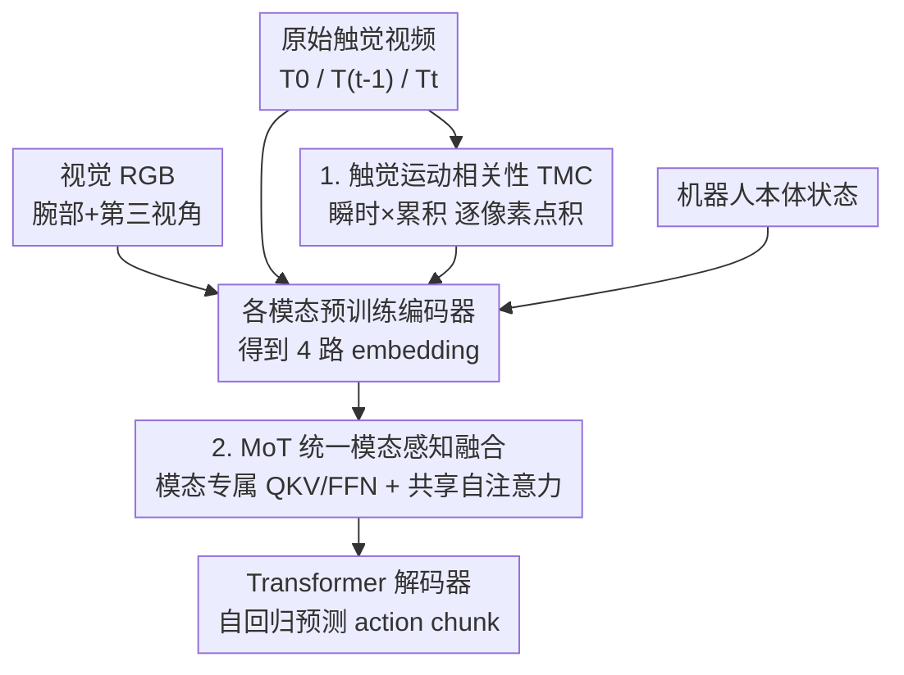

# Seeing Touch from Motion: A Unified Modality-Aware Visuo-Tactile Policy with Tactile Motion Correlation

**会议**: ECCV 2026  
**arXiv**: [2606.29941](https://arxiv.org/abs/2606.29941)  
**代码**: [https://shengqi77.github.io/Seeing-Touch-from-Motion/](https://shengqi77.github.io/Seeing-Touch-from-Motion/) (项目主页)  
**领域**: 机器人 / 具身智能  
**关键词**: 视触觉策略, 光学触觉传感, 触觉运动相关性, 接触状态感知, Mixture-of-Transformers

## 一句话总结
针对光学触觉传感器难以分辨细粒度接触状态的老问题，本文发现「瞬时运动」与「累积运动」的点积能显式区分「正在接触 / 稳定接触 / 正在松开」等状态，据此提出触觉运动相关性表征 TMC，并用 Mixture-of-Transformers 把它作为独立模态与视觉、原始触觉、本体状态融合，在四个真实接触密集操作任务上刷出更高成功率。

## 研究背景与动机
接触密集型操作（精密插入、擦拭、打磨）是机器人做精细活的关键，成功与否取决于能不能准确感知细微的物理交互。这类任务天然依赖全局视觉与局部触觉的互补：视觉负责规划粗略的运动轨迹，触觉负责在接触瞬间给出局部反馈。光学触觉传感器因为分辨率高、能感知纹理和多维力，被广泛采用——它内部用一个相机盯着弹性凝胶表面的形变，间接推断触觉线索，表面通常还印有 marker 来放大凝胶运动。但问题也恰恰出在这里：从这些视觉测量里提取出「细粒度接触状态」一直是个悬而未决的难题。现有方法要么直接用原始触觉图像，要么用累积运动场（当前帧与初始无接触帧之间的光流）。前者主要捕捉外观变化，「正在接触」和「正在松开」这两种物理上截然相反的状态，在原始图像里看起来高度相似；后者只反映凝胶整体形变的方向和幅度，同样会在「making contact / stable contact / releasing contact」之间呈现出几乎一样的模式。结果就是不同的接触状态对应着难以区分的表征，机器人无从判断此刻到底处于哪个接触阶段。

这个感知歧义带来的核心矛盾是：接触密集操作需要在时间上把接触过程切分得足够细（何时初次接触、何时形变稳定、何时开始回弹），但现有的两种表征都是「只看某一时刻的静态形变快照」，缺了刻画形变**如何随时间演变**的那一维信息，因而无法把方向相反、快照却相似的状态拆开。与此同时，就算有了好的触觉表征，如何把局部触觉和全局视觉真正融合也是另一半难题——现有融合要么在特征级简单拼接/加注意力（忽视各模态的独特性、还容易让某一模态压制另一模态），要么在决策级各训一个策略再合并输出（尊重了模态差异，却切断了跨模态交互，得不到真正的互补）。

本文的切入角度是去挖掘触觉运动里被忽视的**动态先验**：作者观察到，如果同时看「瞬时运动」（相邻两帧之间的光流）和「累积运动」（相对初始无接触帧的光流），二者的**方向相关性**能一刀切开那些静态快照分不开的状态——正在接触时两者同向，正在松开时两者反向，稳定接触时瞬时运动几乎消失。**核心 idea：用瞬时运动与累积运动的逐像素点积作为触觉表征（Tactile Motion Correlation, TMC），点积的正负号直接编码「正在压入 / 正在回弹 / 无形变」，其幅值又与接触力正相关；再把 TMC 当成一个独立模态，用 Mixture-of-Transformers 与视觉、原始触觉、本体状态做「统一但模态感知」的融合，兼顾跨模态互补与各模态个性。**

## 方法详解

### 整体框架
方法叫 ViTacMotor，要解决的是「怎么让视触觉策略看清细粒度接触状态、并把触觉和视觉恰当融合」。整体分两大块：前半段是纯几何的**触觉表征构建**——每个时刻从初始无接触帧 $T_0$、当前帧 $T_t$、前一帧 $T_{t-1}$ 用光流算出瞬时运动和累积运动，逐像素点积得到运动相关性图 TMC，这一步不含可学习参数，是把原始触觉视频「翻译」成一张能显式表达接触状态的运动相关性图；后半段是**策略网络**——把四路观测（第三视角+腕部 RGB 图像、原始触觉图、TMC 相关性图、机器人本体状态）各自过预训练编码器得到 embedding，喂进一个 Mixture-of-Transformers（MoT）做融合，最后用 Transformer 解码器自回归地预测一段动作序列（action chunk）。整个策略用 β-VAE 目标从零训练。

关键点在于：TMC 在 MoT 里被当成与「原始触觉外观」**不同的独立模态**——因为一个是外观、一个是运动动力学，物理性质异构，硬塞进同一模态反而互相干扰。MoT 给每个模态一套专属的 QKV 投影、输出投影、FFN 和 LayerNorm（保留模态个性），但让所有模态共享同一个全局自注意力（实现跨模态交互）。

### 关键设计

**1. 触觉运动相关性 TMC：用瞬时×累积的点积正负号，把静态快照分不开的接触状态一刀切开**

痛点很直接：原始图像只看外观、累积运动只看「相对初始态的总形变」，二者都是某一时刻的静态快照，于是「正在压入」和「正在回弹」这两种方向相反的过程被拍成了几乎一样的图。作者的破局点是引入**瞬时运动**——相邻两帧之间的光流，它捕捉的是这一瞬间凝胶在往哪个方向动。把瞬时运动 $\mathbf{M}^{\text{tran}}_t=\text{Flow}(T_{t-1},T_t)$ 和累积运动 $\mathbf{M}^{\text{cumu}}_t=\text{Flow}(T_0,T_t)$ 逐像素做点积，就得到运动相关性：

$$Corr_t(x) = \mathbf{M}^{\text{tran}}_t(x)\cdot \mathbf{M}^{\text{cumu}}_t(x),\quad x\in\Omega$$

这个点积的物理含义非常干净：正在**压入**时，这一瞬的形变方向和累计形变方向一致，点积为**正**；正在**松开**时凝胶在回弹，瞬时运动与累积运动反向，点积为**负**；**稳定接触**或**无接触**时瞬时运动趋近于零，点积近**零**。于是仅凭符号就能把「making / stable / releasing / no contact」区分开——这正是原始外观和累积运动都做不到的。更妙的是滑动接触会呈现「一侧正、一侧负」的空间分裂：负区是凝胶回弹处、正区是凝胶压入处，正负过渡方向恰好指示滑动方向。此外作者实测点积**幅值**与施加的接触力正相关，等于免费附送了一路力度感知信号。因为它只依赖光流、不绑定具体传感器结构，TMC 天然是 sensor-agnostic 的，作者在稀疏 marker 和稠密 marker 两类传感器上都验证了同样的判别力。相比另一类把瞬时/累积变化**隐式**编码进 latent 空间的表征学习工作，TMC 的点积是**显式、物理可解释**的标量场，可解释性和即插即用性都更好。

**2. TMC 作为独立模态接入 MoT 融合：既让触觉运动与外观分开，又让四路模态跨模态互补而不互相压制**

痛点是现有融合的两难：特征级拼接会抹掉模态个性、让强模态盖住弱模态；决策级各训各的又切断了跨模态交互。作者借用 Mixture-of-Transformers 架构做「统一但模态感知」的融合，关键的一步判断是：把 TMC **和原始触觉外观视为两个不同模态**——它们的物理性质异构（一个是运动动力学、一个是表面外观），如果合并会互相稀释信息。于是模态集合是 $\{I(\text{视觉}),\,T(\text{原始触觉}),\,Corr(\text{TMC}),\,p(\text{本体})\}$ 四个。每个模态 $m$ 用**专属**的投影矩阵算出自己的 Q/K/V，这保证了各模态的独特统计特性不被混淆；随后所有模态的 token 拼在一起过**一个共享的全局自注意力**，让视觉能「问」触觉此刻是什么接触状态、TMC 能「问」视觉物体在哪，实现真正的跨模态交互：

$$\mathbf{A}_t=\text{softmax}\!\left(\frac{\mathbf{Q}_t\mathbf{K}_t^\top}{\sqrt{d}}\right)\mathbf{V}_t$$

注意力之后每个模态再走**各自专属**的输出投影 $W_O^{(m)}$、FFN 和 LayerNorm（带残差），也就是「共享注意力做交互、模态专属的前后处理保个性」。这套设计的好处是同时拿到了两个此前只能二选一的东西：跨模态互补（来自共享自注意力）和模态特异性（来自模态专属参数），从而把全局视觉与局部触觉真正拧成一股绳。作者称这是首个把 MoT 架构用于视触觉融合的工作。

### 损失函数 / 训练策略
策略网络用 β-VAE 目标从零训练（每个任务单独训），以建模人类演示里的随机性。总损失是动作预测损失加上 KL 正则：

$$\mathcal{L}=\mathcal{L}_{\text{pred}}+\beta\,\mathcal{L}_{\text{KL}}$$

其中预测损失对预测动作块 $\hat{a}_{t:t+k}$ 与真值序列 $a_{t:t+k}$ 取 L1（$\mathcal{L}_{\text{pred}}=\lVert \hat{a}_{t:t+k}-a_{t:t+k}\rVert_1$），追求精确动作；KL 项把后验 $q_\phi(z\mid a_{t:t+k},o_t)$ 拉向标准正态先验，$\beta$（取 10）控制信息瓶颈强度。光流用高效的 DIS 算法（逆搜索 + 多尺度金字塔 + 变分精化），单核 CPU 上可达 600Hz，满足实时操作。每个任务在单张 RTX 3090 Ti 上训约 5 小时，batch size 16，学习率 $2\times10^{-4}$ 配余弦衰减，chunk size 100，编码器 4 层、解码器 7 层。

## 实验关键数据

### 主实验
在真实机器人（两台 6-DoF AgileX 机械臂 + 稠密/稀疏两类光学触觉传感器）上评四个接触密集任务，每方法每任务跑 15 次取平均成功率。任务分两组：需要精确接触状态信息的（试管收纳、灯泡插入）和需要精细力控的（白板擦除、铅笔削尖）。下表为整任务成功率（%）：

| 任务 | ACT | DP | ACT+T | Policy Consensus | TactileACT | ViTacMotor |
|------|-----|-----|-------|------------------|------------|------------|
| 试管收纳 | 53.3 | 40.0 | 60.0 | 53.3 | 60.0 | **73.3** |
| 灯泡插入 | 13.3 | 6.7 | 26.7 | 26.7 | 40.0 | **40.0** |
| 白板擦除 | 46.7 | 40.0 | 60.0 | 66.7 | 73.3 | **86.7** |
| 铅笔削尖 | 33.3 | 33.3 | 40.0 | 33.3 | 46.7 | **60.0** |

纯视觉策略（ACT/DP）在遮挡严重（夹爪举着试管挡住第三视角）或需要感知接触力（白板擦除）的场景表现最差；加了原始触觉图（ACT+T）有改善但仍不稳定，因为细粒度接触状态难从原始外观直接读出。ViTacMotor 在需要力控的两个任务上提升尤为明显（白板擦除比次优的 TactileACT 高 13.4 个点），因为 TMC 幅值隐式编码了接触力大小。

### 消融实验

| 配置 | 白板擦除 | 试管收纳 | 说明 |
|------|---------|---------|------|
| Base（仅视觉+本体） | 46.7 | 53.3 | 基线 |
| Base + TMC | 73.3 | 66.7 | 加 TMC 表征 |
| Base + MoT-Fusion | 66.7 | 60.0 | 加 MoT 融合 |
| Full（TMC + MoT-Fusion） | **86.7** | **73.3** | 完整模型 |

两个组件各自都能带来大幅提升，叠加后最好。另有两组针对性分析：（1）把 TMC 换到 ACT/DP 等已有策略里替换原始外观/累积运动表征，白板擦除上 TMC 均优（ACT：Raw 60.0 / Cumu 53.3 / TMC **73.3**；DP：Raw 53.3 / Cumu 40.0 / TMC **66.7**），说明 TMC 即插即用且普遍有效；（2）把 MoT 融合替换为常见融合策略，平均成功率 Concatenation 70.0 / Cross Attention 66.7 / MoT **80.0**。

### 关键发现
- TMC 和 MoT 融合两个组件贡献相当，去掉任一都掉点明显；TMC 的价值在于同时提供「细粒度接触状态判别」和「隐式力度感知」两种信号。
- TMC 是 sensor-agnostic 的：在稀疏 marker 与稠密 marker 两类传感器上都展现出对接触状态的判别力，因为它优先建模底层凝胶形变而非原始外观。
- 有意思的是 Cross Attention 融合反而略逊于简单 Concatenation（66.7 vs 70.0），说明单纯堆注意力不如 MoT 那样「共享注意力 + 模态专属参数」的结构化设计。
- 鲁棒性：在时变的空间均匀/非均匀光照扰动、以及更换橡皮/把试管换成圆柱等物体变化下仍能完成任务。

## 亮点与洞察
- **把「时间维」引入触觉表征是最漂亮的一手**：现有工作困在「静态形变快照」里出不来，作者只加了一路瞬时运动、再和累积运动做点积，就用符号把方向相反却外观相似的状态一刀切开——一个几乎零参数、物理可解释的算子解决了一个学习方法反复啃不动的感知歧义。
- **点积幅值与接触力正相关是意外的红利**：本来只想区分接触状态，结果同一个标量场顺带编码了力度，让力控任务（白板擦除、铅笔削尖）直接受益，等于一石二鸟。
- **「TMC 与原始触觉外观应视为不同模态」这个判断很关键**：运动动力学和表面外观物理异构，分开成两个模态喂给 MoT 才不互相稀释——这提示我们做多模态融合时，「模态怎么切分」本身就是设计变量，不是天然给定的。
- **TMC 即插即用可迁移**：它是对原始触觉视频的纯几何变换，可以直接替换任意视触觉策略里的触觉输入通道（论文已在 ACT/DP 上验证），迁移成本极低。

## 局限与展望
- 作者承认：在极端视觉扰动或物体位姿大幅变化下泛化仍受限——附录里给了失败案例，比如试管位置大幅改变+严重视觉干扰时能抓起但插不进孔。
- 自己发现的局限：所有实验都是「每个任务从零单独训练」，没有跨任务/跨物体的统一策略，泛化性主要靠任务内的光照/物体扰动来体现，规模和多样性有限；成功率绝对值（灯泡插入 40%、铅笔削尖 60%）离实用还有距离，说明任务本身很难。
- TMC 依赖光流质量，在 marker 稀疏或凝胶形变极小的情况下瞬时运动信号弱，点积可能不稳；论文用了 DIS 快速光流但未讨论光流误差对表征的影响。
- 改进方向：把 TMC 接入更大规模的 VLA / 世界模型做跨具身泛化；或把「接触状态符号」显式作为中间监督信号，而不只是隐式喂给策略。

## 相关工作与启发
- **vs 原始触觉图像方法（TactileALOHA / FreeTacMan 等）**：他们直接把 GelSight 类原始图当输入，本文改用运动相关性，区别在于原始图只有外观、分不开方向相反的接触状态，TMC 用点积符号显式编码，判别力更强。
- **vs 累积运动方法（Bogert 用 Helmholtz-Hodge 分解 / Xue 用 PCA 降维）**：他们只用累积形变的方向和幅度，本文补上瞬时运动这一维，弥补了累积运动的时间滞后，能区分累积运动分不开的稳定/松开状态。
- **vs 隐式学习触觉表征（Sparsh / AnyTouch）**：他们把瞬时和累积变化隐式编码进 latent，本文显式计算点积得到物理可解释的数值——可解释性和即插即用性更好，但学习类方法的通用表征潜力可能更大，二者互补。
- **vs 特征级/决策级融合（TactileACT 拼接 / Policy Consensus 决策级）**：前者忽视模态个性、后者切断跨模态交互；本文用 MoT「共享自注意力 + 模态专属参数」同时拿到互补性和特异性，是首个把 MoT 用于视触觉融合的工作。

## 评分
- 新颖性: ⭐⭐⭐⭐⭐ 用瞬时×累积点积显式刻画接触状态是一个简洁、物理可解释又此前没人做的观察，切中要害。
- 实验充分度: ⭐⭐⭐⭐ 四个真实任务 + 五个基线 + 充分消融（含 TMC 即插即用、融合策略对比、跨传感器、鲁棒性），但缺仿真大规模评测且成功率绝对值偏低。
- 写作质量: ⭐⭐⭐⭐⭐ 动机图（Fig.1/3）把三种表征的判别力差异讲得极清楚，方法叙述干净，读完就懂「为什么点积能奏效」。
- 价值: ⭐⭐⭐⭐ TMC 即插即用、sensor-agnostic，对整个视触觉操作社区有直接可复用价值；受限于每任务单独训练，落地泛化性待验证。

<!-- RELATED:START -->

## 相关论文

- [\[ECCV 2026\] Articulat3D: Reconstructing Articulated Digital Twins From Monocular Videos with Geometric and Motion Constraints](articulat3d_reconstructing_articulated_digital_twins_from_monocular_videos_with_.md)
- [\[ECCV 2026\] Match-Any-Events: Zero-Shot Motion-Robust Feature Matching Across Wide Baselines for Event Cameras](match-any-events_zero-shot_motion-robust_feature_matching_across_wide_baselines_.md)
- [\[CVPR 2026\] TeamHOI: Learning a Unified Policy for Cooperative Human-Object Interactions with Any Team Size](../../CVPR2026/others/teamhoi_learning_a_unified_policy_for_cooperative_human-object_interactions_with.md)
- [\[CVPR 2026\] Learning Long-term Motion Embeddings for Efficient Kinematics Generation](../../CVPR2026/others/learning_long-term_motion_embeddings_for_efficient_kinematics_generation.md)
- [\[CVPR 2026\] Bi-directional Autoregressive Diffusion for Large Complex Motion Interpolation](../../CVPR2026/others/bi-directional_autoregressive_diffusion_for_large_complex_motion_interpolation.md)

<!-- RELATED:END -->
