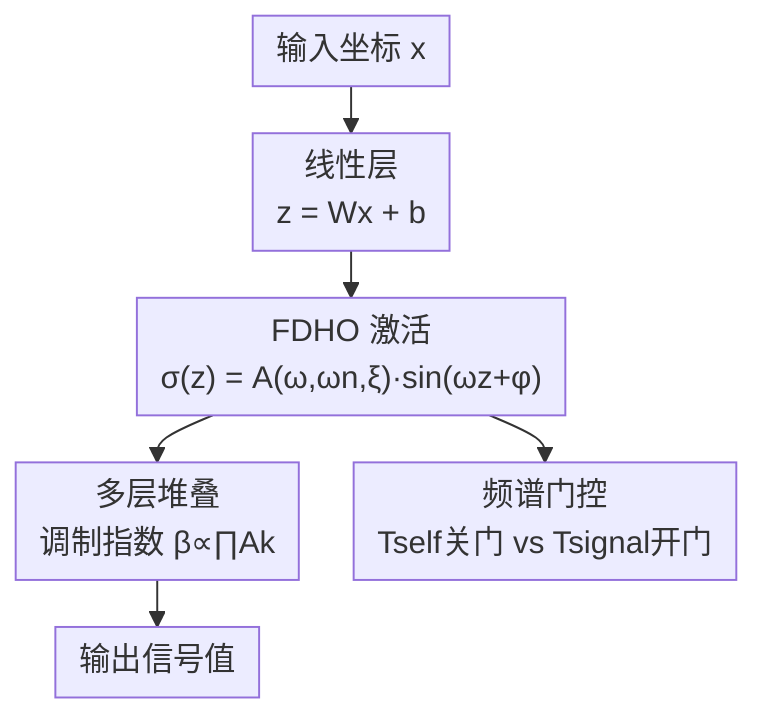

# Spectral Gating via Damped Oscillations for Adaptive Implicit Neural Representations

**会议**: ECCV 2026  
**arXiv**: [2606.23129](https://arxiv.org/abs/2606.23129)  
**代码**: [https://alex-costanzino.github.io/fdho/](https://alex-costanzino.github.io/fdho/) (有)  
**领域**: 3D视觉 / 神经表示  
**关键词**: 隐式神经表示, 频谱门控, 阻尼振荡器, 激活函数设计, 粗到细学习

## 一句话总结
本文从受迫阻尼谐振子的稳态响应出发，推导出一种物理驱动的激活函数 FDHO，将激活幅度与频率通过二阶传递函数耦合，产生隐式频谱门控机制：阻尼因子梯度的自交互项始终关闭频谱门，而信号项仅在目标存在相干频率分量时打开频谱门，从而实现自动区分信号与噪声、无需任何显式正则化或任务特化超参数调优，在信号拟合、去噪、CT 重建、超分辨率等任务上全面达到 SOTA 或竞品水平。

## 研究背景与动机

**领域现状**：隐式神经表示（INR）通过坐标网络编码连续信号，已成为新视角合成、3D 形状表示、音频重建等任务的核心范式。INR 的核心在于激活函数的选择——它直接决定网络的频谱表达能力，即能否同时刻画平滑的全局结构和精细的局部高频细节。

**现有痛点**：周期性激活（如 SIREN 的正弦函数）可以表达任意高频，但本质是一个全通滤波器，对噪声不加区分地拟合，且缺乏内在的空间定位和频率正则化。非周期性激活（如高斯、Gabor 小波 WIRE）提供空间紧致性和隐式正则化，却引入低频偏置，难以捕获振荡或细粒度内容。折中方案（FINER、MIRE、Fourier Reparametrisation 等）在计算开销、超参数敏感性或表达能力上各有牺牲。所有现有方法都没有提供一种在训练过程中根据信号与噪声的频谱特性自适应调整带宽的机制。

**核心矛盾**：这是一个"频谱困境"（spectral dilemma）——要表达高频细节就需要高带宽，但高带宽意味着噪声也会被无差别地拟合。现有方法本质上是在表达能力与鲁棒性之间做一个固定的折中点选择，缺乏随训练进程动态调整的能力。

**本文目标**：设计一种激活函数，使网络在训练过程中能够自动识别哪些频率分量是真正的信号（应当拟合）、哪些是噪声（应当忽略），并且以无超参数特化调优的方式工作。

**切入角度**：作者从经典力学中获得灵感——受迫阻尼谐振子的稳态响应天然包含一个由阻尼因子、固有频率和强迫频率共同决定的幅度传递函数，这是一个已知的二阶带通滤波器。如果把这个物理结构嵌入每个神经元，让振荡器参数可学习，是否可以在优化过程中自发地产生频谱选择性？

**核心 idea**：将每个神经元的激活建模为受迫阻尼谐振子的稳态响应，利用其幅度传递函数作为隐式频谱门控——阻尼因子的梯度自然分解为"关门力"（自交互项）和"开门力"（信号项），两者的竞争决定了网络何时扩大带宽、何时抑制噪声，从而在不添加任何显式正则化项的情况下实现自适应频谱选择。

## 方法详解

### 整体框架

FDHO 的核心创新在于激活函数的物理推导，而非网络架构改动。给定一个标准的坐标 MLP（输入坐标，输出信号值），将每个隐藏层的激活函数替换为 FDHO，其他结构（层数、宽度）与 SIREN 完全相同。每层共享一组可学习的振荡器参数 $\theta = (\omega, \omega_n, \xi, \varphi)$，分别代表强迫频率、固有频率、阻尼因子和相位。这组参数与网络权重 $\mathbf{W}, \mathbf{b}$ 通过梯度下降联合优化。

前向传播时，对输入 $z = \mathbf{w}^\top \mathbf{x} + b$，激活输出为 $\sigma(z; \theta) = A(\omega, \omega_n, \xi) \sin(\omega z + \varphi)$，其中幅度 $A$ 是经典二阶系统的传递函数：

$$A(\omega, \omega_n, \xi) = \frac{\omega_n^2}{\sqrt{(\omega_n^2 - \omega^2)^2 + (2\xi\omega_n\omega)^2}}$$

这个幅度函数的行为受三个物理参数精确控制：峰值出现在共振频率 $\omega_r = \omega_n\sqrt{1-2\xi^2}$（当 $\xi < 1/\sqrt{2}$ 时），峰值幅度为 $A_{\text{peak}} = (2\xi\sqrt{1-\xi^2})^{-1}$；当 $\xi \geq 1/\sqrt{2}$ 时，幅度从 $A(0)=1$ 开始单调递减。训练从阻带初始化开始（$\omega_0 < \omega_{n,0}$，$\xi_0 = 1/\sqrt{2}$ 对应 Butterworth 最大平坦响应），此时幅度被抑制，网络带宽极窄。随着训练推进，当损失景观要求更丰富的频率内容时，阻尼因子 $\xi$ 下降，幅度增长，带宽逐步扩大，产生天然的粗到细学习过程。

关键理解：在前向推理时，幅度 $A$ 是标量常数，网络并不对不同频率分量做空间变化的滤波。频谱门控的归纳偏置完全通过训练过程中的梯度动力学起作用——特定频率能否被网络表达，取决于该频率分量在梯度下降过程中与阻尼因子的交互方式。

### 关键设计

**1. 物理耦合的激活函数：用振荡器传递函数替代自由幅度参数**

INR 中正弦激活（SIREN）的致命缺陷在于频率和幅度是解耦的：网络可以将任意大的幅度分配给任意频率，包括噪声驱动的频率。一个直观的补救思路是让幅度也变成可学习参数（Adaptive SIREN），但作者通过对照实验证明了这种做法无效——解耦的参数空间中存在大量退化解（多组 $(a, \omega, \varphi)$ 组合产生相同输出），导致梯度下降在平坦方向上无限漂移（实验显示收敛时 PSNR 比 FDHO 低 77 dB，方差增大 10 倍）。

FDHO 的关键约束是：幅度 $A(\omega, \omega_n, \xi)$ 不是一个自由参数，而是由强迫频率、固有频率和阻尼因子通过物理传递函数唯一确定的。这种耦合消除了参数空间的退化：一旦频率分量被充分拟合，$\xi$ 就达到平衡（Corollary 1(a)），不会继续漂移。作者对此给出了三个形式化保证：平滑性（$C^\infty$，保证梯度优化可行）、Lipschitz 连续性（Lipschitz 常数 $L_z = |\omega|A$，将高频表达的能力绑定到幅度上）、输出有界性（$|\sigma| \leq A$，激活范围由参数直接控制）。

**2. 频谱门控的梯度分解：$\partial\mathcal{L}/\partial\xi = T_{\text{self}} + T_{\text{signal}}$**

这是 FDHO 最核心的理论贡献。对于 MSE 损失 $\mathcal{L} = \frac{1}{N}\sum_i (\sigma(z_i;\theta) - y_i)^2$，损失对阻尼因子 $\xi$ 的梯度可以严格分解为两项：

$$\frac{\partial\mathcal{L}}{\partial\xi} = \underbrace{\frac{\partial A}{\partial\xi}\frac{2A}{N}\sum_i \sin^2(\omega z_i + \varphi)}_{T_{\text{self}}} + \underbrace{\left(-\frac{\partial A}{\partial\xi}\right)\frac{2}{N}\sum_i y_i \sin(\omega z_i + \varphi)}_{T_{\text{signal}}}$$

$T_{\text{self}}$（自交互项）：由 Theorem 3.1 保证 $\partial A/\partial\xi < 0$（增加阻尼总是降低幅度），因此在大样本极限下 $T_{\text{self}} \approx \partial A/\partial\xi \cdot A < 0$，它始终将 $\xi$ 向上推（关闭频谱门），充当无条件的正则化力。

$T_{\text{signal}}$（信号项）：其符号完全取决于目标 $y$ 与载波 $\sin(\omega\cdot + \varphi)$ 的经验内积。只有当目标在此载波频率上具有相干能量时，$T_{\text{signal}} > 0$ 才会将 $\xi$ 向下推（打开频谱门）。

Corollary 1 给出了精确的门控条件——频谱门打开当且仅当 $\langle y, \sin(\omega\cdot + \varphi)\rangle_N > A/2$。三种情况对应三种截然不同的行为：(a) 如果目标包含频率为 $\omega$ 的相干分量，门会打开，直到 $A$ 逼近目标幅度 $A_y$ 达到平衡；(b) 如果目标为零均值 i.i.d. 噪声，信号项为 $O_p(N^{-1/2})$ 量级，自交互项占主导，门保持关闭；(c) 如果目标是频率不匹配的纯音，内积在大样本下趋于零，门同样关闭。由此，FDHO 在优化层面内禀地偏向拟合信号的相干分量、拒绝随机噪声。

**3. 多层频率合成与粗到细学习课程**

单层分析解释了对阻尼因子的梯度行为，但 INR 的表达能力来源于层间交互。Proposition 4 证明，两层 FDHO 的复合等价于频率调制信号：$h_2(x) = A_2 \sin(\beta \sin(\alpha(x)) + c)$，其中调制指数 $\beta = \omega_2 w_2 A_1$。通过 Jacobi-Anger 展开，该信号可分解为以 $\alpha(x)$ 频率的整数倍谐波之和，谐波幅度由 Bessel 函数 $J_n(\beta)$ 控制，有效谐波数量约为 $\lfloor\beta\rfloor + 1$。

扩展到 $L$ 层（Proposition 5），第 $\ell$ 层的有效调制指数为 $\beta_\ell = \omega_\ell w_\ell \prod_{k=1}^{\ell-1} A_k$。这意味着总谐波带宽对每层幅度的乘积呈指数敏感。初始时，每层幅度 $A_k \approx A_0 < 1$，因此 $\beta_\ell \propto A_0^{\ell-1}$ 随深度几何衰减——最深层最初几乎不贡献频率支持，带宽从输入层向外逐步扩展。这一乘积结构使得即使每层 $\xi_k$ 的微小下降，也能在多层复合后产生网络频谱带宽的巨变。作者用 NTK 分析补充了这一视角：内核幅度按 $A^2$ 缩放，网络通过逐步打开频谱门"自举"其收敛速度——初期 $A$ 小，学习慢，优先锁定低频结构；随 $A$ 增长，高频逐步被纳入。

### 损失函数 / 训练策略

FDHO 使用标准 MSE 损失，无需任何显式正则化项。关键训练细节如下：

- **参数化**：$\omega$ 和 $\omega_n$ 通过 softplus 保证正值，$\xi$ 通过 sigmoid 约束在 $(0, 1)$ 范围内（$\xi = 0$ 在 $\omega = \omega_n$ 处会导致分母为零，对应无阻尼共振的发散情况）。
- **初始化策略**：强迫频率置于固有频率以下（$\omega_0 = 45$, $\omega_{n,0} = 50$），使系统远离共振区，初始幅度被抑制；阻尼因子初始化为 $\xi_0 = 1/\sqrt{2}$，对应 Butterworth 最大平坦响应，提供适度幅度但无共振峰；相位初始化为物理相位滞后 $\varphi_0 = -\arctan(2\xi_0\omega_{n,0}\omega_0 / (\omega_{n,0}^2 - \omega_0^2))$，后续自由演化。网络权重初始化遵循 SIREN 方案，但按初始固有频率缩放：首层 $w \sim \mathcal{U}(-1/m, 1/m)$，隐藏层 $w \sim \mathcal{U}(-\sqrt{6/m}/\omega_n, \sqrt{6/m}/\omega_n)$。
- **优化器与学习率**：使用 Adam，网络权重学习率 $\eta_w = 10^{-4}$，振荡器参数学习率 $\eta_\theta = 10^{-2}$（两倍数量级的差异反映了振荡器参数直接影响全局频谱行为的特性）；配合 ReduceLROnPlateau 调度器（factor=0.1, patience=500, min_lr=$10^{-6}$）。
- **架构**：全任务统一配置，$m=256$ 隐藏维度，$L=5$ 隐藏层，不做任何任务特化调整——相比之下每个 baseline 在不同任务上需要独立的超参数配置。

## 实验关键数据

### 主实验

FDHO 在三大类观测模型下进行评估：信号表示（完整监督）、损坏观测恢复（去噪、CT 重建）、不完全观测恢复（修复、超分辨率），均在 9 个 INR baseline（SIREN、Gauss、WIRE、BACON、FINER、MFN、Fourier Features、FR）上对比。下表选取图像拟合（5 张自然图像）作为代表性主实验结果。

| INR | Tiger (Final/Peak) | Bikers (Final/Peak) | Butterfly (Final/Peak) | Knot (Final/Peak) |
|-----|-------------------|---------------------|----------------------|-------------------|
| FDHO | **63.79** / **63.79** | **57.06** / **57.25** | **57.85** / **57.96** | **59.21** / **64.05** |
| SIREN | 53.69 / 58.52 | 43.11 / 55.92 | 48.81 / 55.83 | 51.90 / 59.72 |
| FINER | 56.58 / 57.09 | 47.46 / 53.53 | 53.65 / 55.10 | 53.39 / 59.72 |
| Gauss | 44.10 / 46.46 | 41.45 / 42.59 | 43.19 / 45.01 | 43.81 / 47.08 |
| WIRE | 38.64 / 39.20 | 36.71 / 36.99 | 36.78 / 37.10 | 40.32 / 40.80 |

FDHO 在 5 张图像上取得 4 张的 Final 和 Peak PSNR 最优，领先第二名最高达 10 dB（Bikers 上 57.06 vs FINER 47.46）。唯一的例外是 Tiles（高度规则重复纹理），此时 FINER 的可变周期激活更契合该图像的频谱集中特性。最显著的规律是 SIREN 的 peak-to-final 跌落：Bikers 上峰值 55.92 dB 收敛后仅 43.11 dB（跌幅 ~13 dB），反映了全通激活缺乏稳定机制导致的过冲后漂移。FDHO 在 Tiger 上 Final 与 Peak 完全相等（63.79 dB），全图像上两者差距不超过 5 dB，验证了 Corollary 1(a) 的平衡条件确实施加了收敛稳定性。

噪声场景（图像去噪、$\sigma=0.1$ 高斯噪声）是最直接的频谱门控验证。FDHO 在 5 张图片上全部最优，领先第二名 MFN 约 2-3 dB。SIREN 从干净拟合的高峰值跌至 26.2 dB（与 Gauss/WIRE 同级别），证实全通特性对噪声毫无防范。CT 重建（稀疏 Radon 投影+测量噪声）是最综合的考验，FDHO 达 39.97 dB，领先第二名 MFN 2.8 dB，为全实验最大绝对优势。

### 消融实验 / 对照分析

| 配置 | 图像拟合(Tiger) Final/Peak | CT 重建 PSNR | 说明 |
|------|--------------------------|-------------|------|
| FDHO（完整模型） | **63.27** / **63.27** | **40.16** | 统一配置，无任务调参 |
| Adaptive SIREN | 54.65 / 58.21 | 32.44 | 可学习幅度+频率，但解耦 |
| SIREN（标准） | 53.37 / 58.19 | 33.28 | 固定正弦激活 |

三者使用完全相同的架构（m=256, L=5）、优化器和训练协议，排除调度器等干扰因素。Adaptive SIREN 的峰值 PSNR 接近 FDHO（58.21 vs 63.27，差距远小于收敛后），说明其容量足够表示目标，但收敛后的 9 dB 差距和大幅增加的方差（3.97 vs 1.30）证实了解耦参数缺乏稳定机制的假设。物理耦合将幅频关系约束为单一路径，消除参数退化平面，是 FDHO 稳定性的根本来源。

### 关键发现

- **频谱门控最受益的场景是噪声 + 高频共存**：去噪（+3-5 dB 对 MFN）和 CT（+2.8 dB 对 MFN）的优势最大，精确符合 Corollary 1(b) 预测——噪声的门控条件不满足，信号的门控条件满足。
- **粗到细课程在超分辨率中体现明显**：FDHO 先锁定观测到的低频结构再扩展到高频，在 Tiger、Bikers、Butterfly、Knot 四张图上均最优，但优势比去噪小（与 FINER/SIREN 差距 ~1 dB），因为超分辨率的约束来自信息缺失而非噪声。
- **Poisson 重建是弱点**：当监督施加在 Laplacian（二阶导数）上时，$\omega^2$ 放大因子使高频分量在损失中权重 $\propto \omega^4$，阻带初始化导致的高频恢复滞后成为负担。将初始带宽从 $\omega_0=45$ 放宽到 15 后，Tiger 的 PSNR 从 26.13 dB 提升至 30.11 dB，验证了分析。
- **FDHO 是唯一全任务稳定的方法**：MFN 去噪强但拟合弱，SIREN 拟合强但去噪弱，FINER 超分强但 CT 不稳定（方差 6.06 dB）。FDHO 在所有任务上排名始终在前二，且方差受控。
- **计算开销适中**：参数仅增加 24 个（相比 SIREN 增加 0.007%），推理成本相同；训练时间 191s（SIREN 134s，~1.4x），训练内存 2908MB（SIREN 1205MB，~2.4x），主要来自每层共享参数的反向传播和双学习率优化，属于可接受范围。

## 亮点与洞察

- **用物理系统的传递函数替代手工设计的激活函数**：这不是一个 tricks 的堆叠，而是一次概念上的升维——不是问"什么激活形状更好"，而是问"什么样的物理系统具有我们要的频谱选择性"，然后推导出结果。阻尼谐振子作为二阶线性系统的成熟理论（包括 Butterworth 滤波器的经典结果）为 FDHO 提供了坚实的数学地基。
- **梯度分解是这篇论文的"灵魂"**：$T_{\text{self}} + T_{\text{signal}}$ 的分解不仅优雅地解释了为什么网络拒绝噪声，还给出了精确的门控条件——"信号内积超过 $A/2$ 时门才打开"。这是从训练动力学的隐式偏置角度分析 INR，而不是从表示能力的静态角度，思路与 NTK 谱分析的传统路线互补。
- **阻带初始化天然产生粗到细课程**：这是一个"零成本"的课程学习——不需要调度器、不需要阶段切换，仅靠初始参数选择就实现了从低频到高频的自然推进。这种通过优化动力学而非显式控制来实现课程学习的方式，可以迁移到任何涉及频谱选择性学习的问题，如 NeRF 训练、扩散模型去噪调度等。
- **参数耦合作为稳定性的来源**：对比 Adaptive SIREN 的失败清晰说明了"自由度越多不一定越好"——物理约束消除了参数空间的退化方向，反而使收敛更稳定。这对深度学习中有意引入归纳偏置（而非仅仅增大模型容量）的设计哲学是一个有力的佐证。

## 局限与展望

- **衍生监督下的性能退化**：Poisson 重建任务表明，当监督信号经过微分算子变换后，FDHO 的阻带初始化可能不再是最优起点。作者已经验证了放宽初始带宽可以缓解问题，但尚未给出系统性的解决方案。未来可以研究根据监督算子的频谱特性自动调整初始化的策略。
- **每层共享参数的限制**：当前设计中，同一隐藏层的所有神经元共享 $(\omega, \omega_n, \xi, \varphi)$，神经元的频率多样性仅由权重的不同缩放（$\|\mathbf{w}_j\|$）产生。如果允许每个神经元有独立的振荡器参数，表达能力可能进一步增强——但也会大幅增加参数量和训练复杂度。这需要在表达能力和效率之间找平衡。
- **仅限于 MSE 损失的分析**：频谱门控的定理推导依赖于 MSE 损失的逐点形式，对于其他损失函数（如 L1、感知损失）的推广尚未讨论。不同损失下的梯度分解结构是否仍然产生类似的门控行为，是一个理论上的开放问题。
- **实验规模相对有限**：虽然任务覆盖面广（1D 信号、音频、2D 图像、3D SDF），但主要在经典 INR benchmark 上评测，未涉及更大规模的 NeRF 场景或视频表示等实际应用。在 FreSh 和 ResField 上的初步集成结果积极（提升 3-7 dB），但系统性的大规模验证仍待完成。

## 相关工作与启发

- **vs SIREN**：SIREN 的正弦激活是纯周期函数，幅度为常数 1，是一个全通滤波器。FDHO 的核心区别在于，通过物理传递函数将幅度与频率耦合，使网络在训练过程中可以自适应地调节带宽，而 SIREN 对信号和噪声给予完全相同的频谱访问权限。
- **vs WIRE**：WIRE 使用 Gabor 小波做联合时空-频率定位，优点是空间局部化，缺点是低频偏置——频谱带宽是固定的。FDHO 用可学习的阻尼因子在连续轴上桥接不同频谱区间：$\xi \to 0$ 时趋近 SIREN 的无约束带宽，$\xi$ 增大时平滑过渡到空间紧凑表示。
- **vs FINER**：FINER 在正弦激活中引入可变周期，使不同层可以有不同频率特性，但缺乏谱门控的梯度级噪声拒绝机制。实验上 FINER 在规则纹理（Tiles）和 SDF 上表现出色，因为它可以对准纹理的主导周期，但在噪声场景下退化为和非周期激活同级别。
- **vs TUNER**：TUNER 通过初始化时控制网络频谱边界来稳定训练，是静态的频谱控制。FDHO 的频谱门控是动态的、训练过程中演化的一一TUNER 设定频谱上限，FDHO 让网络自己学要去到哪里。
- **vs Fourier Features / BACON**：傅里叶特征映射和 BACON 的带限层级都是在输入编码或输出结构上做频谱控制。FDHO 的思路是将频谱选择性直接编码进激活函数的微分结构中，作为一种隐式的、优化驱动的归纳偏置，与输入/输出端的方法互补。

## 评分
- 新颖性: ⭐⭐⭐⭐⭐ 将经典力学中的阻尼谐振子概念引入 INR 激活函数设计，并用梯度分解严格证明频谱门控机制，思路原创且理论自洽
- 实验充分度: ⭐⭐⭐⭐ 覆盖 1D/2D/3D/音频 8 种任务 + 9 个 baseline + 对照研究 + 消融 + 计算开销分析，但缺少大规模 NeRF 场景验证
- 写作质量: ⭐⭐⭐⭐⭐ 理论推导清晰（从定义到性质到门控到多层组成到 NTK，逻辑链完整），实验分析细致（每种设置的讨论都落到 Corollary 的预测上），附录完整
- 价值: ⭐⭐⭐⭐⭐ 提出了一个不依赖显式正则化的自适应频谱控制机制，原理通用、代码轻量（仅增加 24 个参数）、与现有 INR 框架兼容，具有直接的实际应用价值，也为物理驱动深度学习提供了方法论参考

<!-- RELATED:START -->

## 相关论文

- [\[ICLR 2026\] Beyond Uniformity: Regularizing Implicit Neural Representations through a Lipschitz Lens](../../ICLR2026/others/beyond_uniformity_regularizing_implicit_neural_representations_through_a_lipschi.md)
- [\[ICLR 2026\] SONIC: Spectral Oriented Neural Invariant Convolutions](../../ICLR2026/others/sonic_spectral_oriented_neural_invariant_convolutions.md)
- [\[ICLR 2026\] Exploring State-Space Models for Data-Specific Neural Representations](../../ICLR2026/others/exploring_state-space_models_for_data-specific_neural_representations.md)
- [\[ICLR 2026\] A Brain-Inspired Gating Mechanism Unlocks Robust Computation in Spiking Neural Networks](../../ICLR2026/others/a_brain-inspired_gating_mechanism_unlocks_robust_computation_in_spiking_neural_n.md)
- [\[CVPR 2025\] EVOS: Efficient Implicit Neural Training via EVOlutionary Selector](../../CVPR2025/others/evos_efficient_implicit_neural_training_via_evolutionary_selector.md)

<!-- RELATED:END -->
