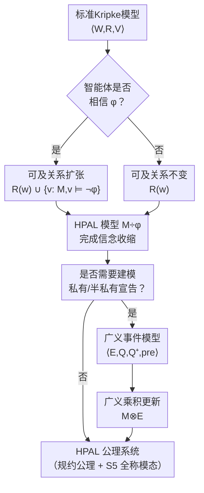

# Belief Contraction in Dynamic Epistemic Logic

**会议**: ECCV 2026  
**arXiv**: [2606.31861](https://arxiv.org/abs/2606.31861)  
**代码**: 无  
**领域**: 逻辑推理 / 认知逻辑  
**关键词**: 信念修正, 动态认知逻辑, 对冲公开宣告, Kripke模型, 信念收缩

## 一句话总结
本文在标准Kripke模型上定义了一种基于加边（而非删边）的信念收缩操作，用于建模对冲公开宣告导致的信念撤销，并给出了完整的公理化系统HPAL及其推广到私有宣告场景的广义动态认知逻辑GDEL。

## 研究背景与动机

动态认知逻辑（DEL）是建模多智能体信念变化的主流框架。其标准形式（Baltag, Moss, Solecki, 1998）通过「消除可能性」来刻画信息更新——当一个公共宣告发生时，所有与该宣告冲突的可能世界被从智能体的可及关系中删除。这种机制天然适合信念扩张（听到新信息后接受它），但无法处理信念收缩：当智能体被告知「某个事实可能不成立」时，她需要的是重新考虑之前被排除的可能性，而非排除更多。一个经典解法是在Kripke模型上增加偏序优先关系（plausibility orderings），把信念理解为「在最小优先世界中真」的命题，而收缩则通过「提升」某些世界的优先级别来实现。

本文揭示了优先关系方法的两个深层局限。其一，因为优先关系是传递的（transitive），它验证了信念的正内省公理（Baφ → BaBaφ），从而无法建模那些**不知道自己相信什么**的智能体——例如一个声称相信性别平等却在招聘中偏好特定性别的雇主，ta实际上相信的是相反的命题，但错以为不相信。其二，优先关系无法建模**对冲公开宣告**（hedged public announcement）导致的信念收缩：当Bob告诉Alice「你的办公室门可能没锁」时，Alice只是失去了对「门锁了」的信念，并未获得任何新的事实信念——她同时认为门打开和门关闭都有可能。本文严格证明：不存在任何优先事件模型，能通过优先乘积更新实现这种「两个世界等可能」的信念状态。

**核心 idea**：舍弃优先关系框架，直接在标准Kripke模型上定义收缩操作——当智能体收到「φ 可能为假」的对冲宣告时，如果她当前相信 φ，就把所有 ¬φ 世界加入到她的可及关系中（加边而非删边）；如果她已不相信 φ，则什么都不做。这个「加边」操作在保留模型原有结构的同时，使被排除的可能性重新进入信念集，实现了信念的精确撤销，并且能捕捉正内省失败和对冲宣告这两种优先关系无法处理的情形。

## 方法详解

### 整体框架

本文的推理体系分为两个递进层次。第一层是**对冲公开宣告逻辑（HPAL）**，专门处理公开且非承诺式的「可能为假」宣告。核心机制是在标准Kripke模型上定义一个收缩更新算子 [÷φ]ψ，含义是「在对冲宣告 φ 可能为假之后，ψ 成立」。收缩更新被定义为一个模型变换 M → M÷φ，其中 M÷φ 通过给相信 φ 的智能体增加 ¬φ 世界的可及边来构造（见关键设计1）。HPAL通过规约公理将含动态算子的公式等价转换为不含动态算子的基础认知公式，从而获得完全性。

第二层是**广义动态认知逻辑（GDEL）**，它将HPAL推广到涵盖私有/半私有宣告等更一般的场景。GDEL引入了一种新的**广义事件模型**，在标准事件模型的基础上增加了一组 Q⁺ 可及关系，专门用于刻画「宣告为智能体引入新可能性」这一机制。广义乘积更新在此基础上决定哪些世界被保留、哪些新边被加入。GDEL包含HPAL作为子逻辑，其更新操作本质上是「先做标准DEL的删边（refinement），再加新边（simulation）」的两步过程。

### 关键设计

**1. 加边式收缩：以可及关系扩张建模信息流失**

本文最关键的设计选择是：「信念收缩 = 加边而非删边」。标准DEL处理宣告的方式是**消除**与宣告冲突的世界（删边），这天然适合信息增加的情境。信念收缩恰恰相反——智能体不是获得了新信息，而是失去了一个旧信念。本文把收缩定义为：若智能体在 w 世界相信 φ（即所有可及世界都满足 φ），则把所有 ¬φ 世界加入可及关系 R(w) 中；若智能体已不相信 φ，则不做任何改变。这个定义有两个关键性质：首先，可及关系只增不减（Ra(w) ⊆ R÷φa(w)），因此不会丢失已有信念并未被触及的部分；其次，加入的不是「任意世界」，而是原模型中实际存在的 ¬φ 世界，这使得信念集的变化精确对应事实可能性。形式化地，M÷φ = (W,R÷φ,V)，其中 R÷φa(w) = Ra(w) ∪ {v ∈ W: M,v ⊨ ¬φ}（当 M,w ⊨ Baφ 时），否则 R÷φa(w) = Ra(w)。

**2. 对冲公开宣告的公理化：规约公理A5**

HPAL的核心技术贡献是给出了加边式收缩算子 [÷φ] 的完全公理化。整个公理系统由经典命题逻辑、全称模态 S5、信念模态 K 加上五条规约公理组成。其中最关键的是公理 A5：

\[
[÷φ]Baψ ↔ (Ba[÷φ]ψ ∧ (Baφ → ∀(¬φ → [÷φ]ψ)))
\]

这条公式揭示了收缩算子作用于信念的精确语义：「在对冲宣告 φ 可能为假之后，智能体 a 相信 ψ」当且仅当：① 智能体 a 相信「此宣告之后 ψ 成立」；② 如果 a 原本相信 φ，那么所有 ¬φ 世界中「此宣告之后 ψ 都成立」。公理A5精妙之处在于区分了两种情形：当智能体原本已相信 ¬φ 时，宣告不影响她，所以她只需满足第一种条件；当她原本相信 φ 时，¬φ 世界的加入将在宣告后影响她的信念，因此必须保证 ¬φ 世界在宣告后也一致满足 ψ。其他规约公理（如 [÷φ]p ↔ p 表明原子命题不受宣告影响，[÷φ]∀ψ ↔ ∀[÷φ]ψ 表明全称量词与收缩算子可交换）共同保证任何含动态算子的公式都能逐步归约为无动态算子的基础公式，从而将HPAL的完全性归约到标准认知逻辑的完全性。

**3. 广义事件模型：用 Q⁺ 关系建模可能性引入**

HPAL只能处理公开宣告，但现实中更多信念收缩发生在非公开场景（如Bob偷偷告诉Alice她门可能没锁，Clark在一旁没听见）。为此本文引入了广义事件模型 E = (E,Q,Q⁺,pre)，它在标准事件模型基础上增加了一组 Q⁺a ⊆ E × E 关系。关键区别在于：Qa(e) 是标准可及关系集——宣告之后仍被视为可能的那些事件；Q⁺a(e) 则代表被宣告**引入**为可能的新事件，与智能体的初始信念无关。在广义乘积更新中，新可及关系的定义变为 (v,f) ∈ REa(w,e) 当且仅当 f ∈ Q⁺a(e)，或者 v ∈ Ra(w) 且 f ∈ Qa(e)。这使得更新既能像标准DEL那样通过取积消去不可能的世界（来自标准Q的约束），又能通过Q⁺独立地向不同智能体引入新可能性。例如在私有宣告场景中，被偷偷告知的Alice的Q⁺包含 ¬φ 对应的事件，而不知情的Clark的Q⁺为空，从而精确捕捉了智能体之间的信息不对称。

### 一个完整示例

考虑论文中最核心的例子：Alice认为自己锁了办公室门（相信 ¬p），Bob告诉她「门可能没锁」（对冲公开宣告 p 可能为真）。

初始Kripke模型 M 有两个世界：w（¬p，门锁了）和 v（p，门没锁）。Alice在 w 处的可及关系只有 {w}——她只考虑门锁了的可能性，因此相信 ¬p。Bob的宣告是一个对冲宣告，不消除任何世界，但要求Alice考虑 p 的可能性。

在HPAL中，这个宣告对应收缩算子 [÷¬p]。由于 Alice 在 w 处相信 ¬p（Ba¬p 为真），收缩操作将 v（满足 p 的世界）加入 R(w) 的可及关系中。得到的 M÷¬p 中，R(w) = {w, v}，因此 Alice 在 w 处既不相信 p 也不相信 ¬p——两种可能性都开放。这正是预期效果：Alice失去了对门锁了的信念，进入了悬置判断的状态。

论文还证明了，这个简单的更新无法用任何优先事件模型实现（定理3.2）。直观原因在于：优先模型要求优先关系是传递且连通的，但从「两个世界有严格偏好（w 优先于 v）」变换到「两个世界等偏好」必须引入无限降链，破坏良基性。而HPAL的加边机制直接在标准Kripke模型上操作，不受传递性约束，因此可以一步到位。

### 损失函数 / 训练策略

不适用。本文为逻辑系统，无训练过程。

## 实验关键数据

### 主实验

| 性质 | 标准DEL | 优先模型 | HPAL（本文） | 说明 |
|------|---------|----------|-------------|------|
| 信念收缩（事实命题） | ✗ 无法建模 | ✓ 有限制 | ✓ 完全支持 | 优先关系方法不支持正内省失败和对冲宣告 |
| 正内省失败（Baφ → BaBaφ失效） | N/A（无信念概念） | ✗ 传递性强制 | ✓ 无约束任意可及关系 | 可建模「不知道自己相信什么」 |
| 对冲宣告（φ可能为假） | ✗ 只支持硬宣告 | ✗ 模态不等价 | ✓ 可用 [÷¬φ] 直接建模 | 定理3.2证明了优先模型的不可行性 |
| 私有宣告 | ✗ 只支持公开 | ✗ 只支持公开 | ✓ GDEL支持 | 广义事件模型用Q⁺区分各智能体 |

### AGM 收缩公理验证

| AGM公理 | HPAL是否成立 | 说明 |
|---------|-------------|------|
| Closure | ✓ | 承诺演绎封闭 |
| Success | 有条件成立 | 必须 ∃¬φ 才保证 (∃¬φ → [÷φ]¬Baφ) |
| Inclusion | 对命题信念成立 | 对认知公式失败（因为信念可被宣告改变） |
| Vacuity | 强版本成立 | V_a ∀¬Baφ → (χ ↔ [÷φ]χ) |
| Consistency | ✓ | 加边从不导致不一致 |
| Extensionality | ✓ | 逻辑等价的公式有相同收缩效果 |
| Conjunctive Overlap | 对命题信念成立 | 同上 |

### 关键发现
- 存在「自反」公式（即宣告后否认自身），如 Moorean 句 p ∧ Ba¬p：对该公式做对冲宣告后此公式变为假，构成自我否定循环
- 存在性公式（eBa 和字面量构成）在对冲宣告下永远被「保持」（preserved）：因为加边操作保留所有原世界，而存在性公式在模型扩张下单调
- 在 S5 框架中（单智能体，知识为等价关系），所有基础认知公式在对冲宣告下都保持真值——因为等价类在加边操作下不变，收缩前后的模型在同一等价类内部双相似

## 亮点与洞察
- **加边而非删边**是信念收缩的简洁解法：标准DEL通过消除世界（信息增加）建模信念变化，而信念流失天然对应增加世界的可及性——这个对偶视角非常优雅，而且「只增不减」的单调性保证了信念收缩不会引入不一致
- **规约公理A5**是全文技术核心：它只用一条公式就精准区分了「智能体原本相信φ」和「原本不相信φ」两种情形下的信念变化后效，完全刻画了加边操作的语义
- **Q/Q⁺双关系设计**是DEL框架的简洁扩展：只增加一组「可能引入」关系，就使标准DEL从只能建模宣告式信息更新扩展到也能建模信息流失——且证明了这个广义更新的本质是「先删边后加边」，与标准DEL保持兼容
- **对Moorean句的深度分析**展现了形式系统的精妙边界：形式地证明了「p 且相信 ¬p」在对冲宣告下自我否定，而「p 且不相信 p」被保持——刻画了信念系统在信息流失中的自反性边界

## 局限与展望
- HPAL的加边操作只能建模「全有或全无」的信念收缩——要么所有 ¬φ 世界都加入，要么都不加。现实中智能体可能只部分放松信念（如考虑部分 ¬p 可能性），本文承认这是未来工作
- 广义更新不保持传递性和欧几里得性：即使初始模型和广义事件模型中的Q/Q⁺都是等价关系，更新后的模型也可能失去正内省——对需要高阶信念推理的场景是限制
- 尚未刻画「成功公式」的完全特征化：虽然给出了存在性公式是保持的、普遍性公式是成功的充分条件，但充要条件仍是开放问题
- 收缩与扩张的交互尚未深入（Levi同一律）：本文没有给出涨缩复合算子的公理系统

## 相关工作与启发
- **vs 标准DEL (Baltag, Moss, Solecki 1998)**: 标准DEL只用世界消除处理宣告，无法应对信念收缩；本文在相同Kripke模型框架上增加了加边操作，比扩充优先关系更简洁
- **vs 优先关系方法 (Baltag & Smets 2008)**: 优先关系方法用偏序表达信念，虽能建模收缩但强制传递性（正内省），且不能处理对冲宣告；本文去掉了对可及关系的约束
- **vs AGM信念修正理论 (Alchourron et al. 1985)**: AGM假设收缩是命题层面的静态操作，本文的收缩是动态模型变换——因此AGM的Recovery公理在本文框架中不成立，这并非缺陷而是动态方法的本质特征
- **vs 图修改逻辑 (Aucher et al. 2009)**: 广义事件模型的Q⁺边添加可视为一种在Kripke模型上加边的图修改操作，但本文的Q/Q⁺双关系设计更细粒度地刻画了宣告对智能体的两种影响

## 评分
- 新颖性: ⭐⭐⭐⭐⭐ 以加边替代删边和偏序，从根本思路上重新定义了信念收缩的形式化，并给出完全公理化，属于理论创新
- 实验充分度: ⭐⭐⭐⭐ 逻辑理论论文的评价维度不同：给出了完整的语义定义、公理系统、完全性证明和一系列模型存在性反例，技术推导完整严密
- 写作质量: ⭐⭐⭐⭐⭐ 论文结构清晰：从问题动机→现有方法局限→本文方案→技术细节→扩展→AGM验证，逐步深入，案例生动（Alice/Clark/Bob的贯穿故事降低了理解门槛）
- 价值: ⭐⭐⭐⭐ 为DEL开辟了信念收缩的新方向，填补了对冲宣告的理论空白；GDEL框架具有通用性，可扩展到遗忘逻辑、意识增长等领域

<!-- RELATED:START -->

## 相关论文

- [\[ECCV 2026\] Recovery operators in quasi-Nelson logic: the prelinear case](recovery_operators_in_quasi_nelson_logic_the_prelinear_case.md)
- [\[AAAI 2026\] Model Change for Description Logic Concepts](../../AAAI2026/others/model_change_for_description_logic_concepts.md)
- [\[AAAI 2026\] More Than Irrational: Modeling Belief-Biased Agents](../../AAAI2026/others/more_than_irrational_modeling_belief-biased_agents.md)
- [\[AAAI 2026\] An Epistemic Perspective on Agent Awareness](../../AAAI2026/others/an_epistemic_perspective_on_agent_awareness.md)
- [\[ICML 2026\] On the Epistemic Uncertainty of Overparametrized Neural Networks](../../ICML2026/others/on_the_epistemic_uncertainty_of_overparametrized_neural_networks.md)

<!-- RELATED:END -->
