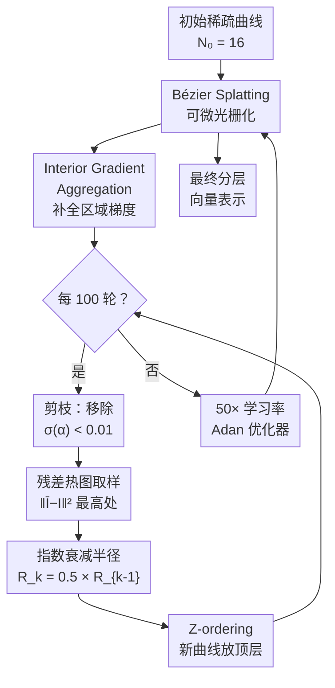

# Vector Scaffolding: Inter-Scale Orchestration for Differentiable Image Vectorization

**会议**: ECCV2026  
**arXiv**: [2605.11913](https://arxiv.org/abs/2605.11913)  
**代码**: 待确认  
**领域**: 计算机图形学 / 可微渲染  
**关键词**: 可微分向量化, 分层优化, 贝塞尔曲线, 拓扑坍塌, 图像矢量化

## 一句话总结
提出 Vector Scaffolding 分层优化框架，通过 Interior Gradient Aggregation 修复区域-边界梯度失衡、Progressive Stratification 按自然图像幂律由粗到细密化曲线、Rapid Inflation Scheduling 放大 50 倍学习率实现 2.5× 加速与 ~1.4dB PSNR 提升，将可微向量化从"平铺像素匹配"重构为"结构化拓扑构建"。

## 研究背景与动机

可微分向量化（differentiable vectorization）是近年计算机图形学的重要进展——DiffVG 首次让梯度流经光栅化过程，LIVE 引入逐层路径初始化，Bézier Splatting 则把 3DGS 的 Gaussian splatting 管线搬到 Bézier 曲线上，实现了并行化的极高效率渲染。这些方法的核心思路是一致的：把数百到数千条随机初始化的曲线铺在同一平面上，让它们通过像素级 MSE 损失互相竞争，最终拟合出目标栅格图像。然而，这种"平坦优化"（flat optimization）假设所有曲线地位平等、更新策略相同，忽略了自然图像内在的尺度层次。

这种假设导致了作者称为"拓扑坍塌"（topology collapse）的失效模式。由于曲线从纯随机开始，大尺度曲线为了降低内部高频纹理区域的像素误差，被迫扭曲自身形状去拟合无关细节；小尺度曲线则相互重叠、缠绕，形成一个结构混乱、不可编辑的"多边形汤"（polygon soup）。这恰恰摧毁了向量图形最核心的价值——可编辑性。更深层的原因是数学上的梯度失衡：一个封闭区域的内部面积梯度量级是 O(r²)，而边界梯度只有 O(r)；当大曲线试图覆盖大面积区域时，内部梯度（来自区域内的纹理误差）会完全支配优化方向，使曲线沦为超像素碎片而非有语义的结构块。

本文从梯度动力学诊断出发，提出了一个纯优化驱动的分层框架 Vector Scaffolding。核心 insight 在于：与其让所有曲线在同一个平面上盲目竞争，不如为优化过程赋予结构——让大曲线先锚定低频背景，再在其之上逐层叠加越来越小的曲线去拟合高频细节。**核心 idea：通过 Interior Gradient Aggregation 补全缺失的区域梯度来稳定大曲线，再以 Progressive Stratification 按自然图像幂律由粗到细密化曲线，最后借助 Rapid Inflation Scheduling 将学习率放大 50 倍，把可微向量化从平铺的像素匹配问题重构为分层的拓扑构建问题。**

## 方法详解

### 整体框架

Vector Scaffolding 是一个三组件协同的分层优化流水线。优化从极稀疏的初始曲线集（N₀=16）开始，每 100 轮迭代执行一次"剪枝→密化"循环：先剪除透明度低于阈值（σ(α) < 0.01）的无用曲线，然后在残差误差最高的区域按指数衰减的半径（r_rad=0.5）生成新曲线，并将新曲线置于 alpha-blending 的顶层。Interior Gradient Aggregation 在整个过程中持续提供稳定的梯度信号，确保大曲线不被高频噪声干扰。借助渐进分层带来的稳定损失地形，学习率可以安全放大到基线的 50 倍（颜色/透明度 LR=0.5，控制点 LR=0.01）。

### 关键设计

**1. Interior Gradient Aggregation：补全区域梯度以稳定大尺度曲线**

可微光栅化的反向传播梯度可以分解为两项：来自曲线内部的区域梯度（area gradient）和来自边界的边界梯度（boundary gradient）。根据 Reynolds transport theorem，穿过一条封闭曲线 ∂𝒜 的时间导数可以拆成内部体积分和边界面积分两项。区域梯度的量级为 O(r²)，边界梯度为 O(r)。先前方法（如 Bézier Splatting）为了加速渲染，仅在边界上采样 Gaussian，完全忽略了区域内部的位置梯度。这导致大曲线只有边界受到弱梯度（O(r)）驱动，而内部区域的高频纹理误差却在通过边界间接影响优化——大曲线被迫扭曲自身去拟合"不属于自己尺度"的高频细节，陷入局部最优。Interior Gradient Aggregation 的做法很直接：在每条曲线的封闭区域内也均匀采样 Gaussian，将区域梯度显式累加到控制点的梯度更新中。这样一来，大曲线可以直接从自身区域内接收到量级匹配（O(r²)）的位置梯度，牢牢"锚定"在应当覆盖的宏观结构上。区域梯度本身不决定曲线应该拟合哪个频段——它只是恢复了一个被遗忘的梯度通道，让后续的频段分离策略有稳定的基础。

**2. Progressive Stratification：按自然图像幂律由粗到细分层驱动**

在 Interior Gradient Aggregation 稳定了基础地形之后，Progressive Stratification 负责构建层次化的曲线结构。核心规则有三条：一是**几何递增曲线数量**——初始 N₀=16，每轮密化以 r_num=2.0 的比率翻倍（16→32→64→…直到目标预算）；二是**指数衰减初始化半径**——新生曲线的初始化半径以 r_rad=0.5 逐代减半，自然地限制了每层曲线所能覆盖的频率范围（大半径 = 低频，小半径 = 高频）；三是**固定的时间 Z-ordering**——新生曲线总是被赋予比旧曲线更低的 depth 值（即渲染在旧曲线上层），并且永不重新排序。这消除了 Bézier Splatting 中按包围盒大小动态重排 depth 带来的抖动。三条规则共同保证了频段分离：大曲线一旦稳定地覆盖低频背景区域，新生成的小尺度曲线只能在上层拟合残差热点，不会反向干扰已锚定的低频结构。这种机制与自然图像的幂律分布天然对齐——图像的能量大多集中在低频，少量曲线即可覆盖背景，逐层增加的小曲线则负责精细纹理。

**3. Rapid Inflation Scheduling：在稳定地形上放大 50 倍学习率加速收敛**

由于 Progressive Stratification 提供了稳定且频段分离的优化地形，作者发现学习率可以安全放大到 Bézier Splatting 的 50 倍（颜色/透明度 LR 从 0.01→0.5，控制点 LR 从 2×10⁻⁴→0.01）。这一激进的学习率仅在分层框架下可行：平坦优化中如果直接放大 50 倍，梯度振荡和损失发散会立即发生，消融实验验证了这一点。Rapid Inflation Scheduling 进一步利用这一优势重新设计了调度策略——曲线在头 600 轮就完成所有密化（每 100 轮翻倍，从 16 到 1024 共需 6 次），后续迭代维持高学习率持续精细调优。这种"快膨胀、慢精调"的节奏使得整体优化时间缩短为基线的 1/2.5（wall-clock time），且 PSNR 在同等曲线预算下反而更高。值得注意的是，每步的实际计算开销并未增加——因为 Interior Gradient Aggregation 不引入独立的计算阶段，且早期层更少的活跃曲线反而减少了每步光栅化的负载。

### 损失函数 / 训练策略

优化目标为像素级 MSE 损失加上三项正则项：

$$
\mathcal{L}_{\text{total}} = \mathcal{L}_2(g(\mathcal{B}), \mathcal{I}) + 0.01 \mathcal{L}_{\alpha} + 0.02 \mathcal{L}_{\text{Xing}}(\mathcal{B}) + \mathcal{L}_{\text{BS}}(\mathcal{B})
$$

其中 $\mathcal{L}_\alpha = \frac{1}{N}\sum_i |1 - \sigma(\alpha_i)|$ 推动不透明度趋近 1（实心向量而非模糊高斯斑）；$\mathcal{L}_{\text{Xing}}$ 是 LIVE 引入的自交避免损失；$\mathcal{L}_{\text{BS}}$ 是 Bézier Splatting 的曲线正则项。优化器使用 Adan（$\beta_{1,2,3}=0.98/0.92/0.99$），总迭代 5000 轮。

## 实验关键数据

### 主实验

在 Kodak 和 DIV2K 两个数据集上与 DiffVG、LIVE、LIVSS、Bézier Splatting 对比（均限定为闭合曲线，256/512/1024 三种曲线预算，共享同一光栅化后端）：

| 数据集 | 曲线数 | 指标 | 本文 | Bézier Splatting | 提升 |
|--------|--------|------|------|-------------------|------|
| Kodak | 256 | PSNR | 25.18 | 24.19 | +0.99 dB |
| Kodak | 512 | PSNR | 26.68 | 25.61 | +1.07 dB |
| Kodak | 1024 | PSNR | 28.30 | 26.91 | +1.39 dB |
| DIV2K | 256 | PSNR | 21.37 | 20.74 | +0.63 dB |
| DIV2K | 512 | PSNR | 22.64 | 22.11 | +0.53 dB |
| DIV2K | 1024 | PSNR | 23.99 | 23.45 | +0.54 dB |

在 Kodak 上 LPIPS 也大幅优于所有基线（1024 曲线下 0.275 vs Bézier Splatting 的 0.448）。由于本文方法与 Bézier Splatting 共享完全相同的可微光栅化后端，性能差距纯粹来自优化策略的重构——这直接证明了优化结构本身对向量化质量的决定性影响。

### 消融实验

| 配置 | Kodak PSNR (1024) | 说明 |
|------|-------------------|------|
| 完整模型 | 28.30 | 三项组件全部启用 |
| 去掉 Interior Gradients | ~23.5 | PSNR 暴跌约 5dB，大曲线失去内部锚点，拓扑坍塌 |
| 去掉 Progressive Stratification（平坦优化 + 50× LR） | ~19.2 | 梯度剧烈振荡，损失完全发散 |
| LR = 1×（其余完整） | 25.83 | 50 倍 LR 贡献了主要加速 |
| r_rad = 1.0（关闭半径衰减） | 25.30 | 无尺度约束后优化质量显著下降 |

### 关键发现

- Interior Gradient Aggregation 是最大的单项贡献——去掉后 PSNR 暴跌约 5dB，证明区域梯度对于大尺度曲线稳定至关重要
- 在平坦优化下直接将 LR 放大到 50 倍会导致完全发散；只有加上 Progressive Stratification 的频段分离后高 LR 才有效
- 超参数敏感性分析表明 r_rad 和 ΔT 在较大范围内表现稳定（5k 轮下 PSNR 波动 < 0.2dB），说明框架对超参数不敏感
- 自然支持 LoD（Level-of-Detail）渲染——由于曲线按时间 Z-ordering 分层，用户可以按"层"选择并编辑特定尺度的曲线，获得比"多边形汤"好得多的可编辑性

## 亮点与洞察

- **用 Reynolds transport theorem 诊断梯度失衡**：本文从数学上揭示了平坦向量化的根本原因（面积 vs 边界梯度的 O(r²)/O(r) 量级差异），并给出了优雅的修复方案（Interior Gradient Aggregation）。这种"先诊断再修复"的思路比纯拼架构更有启发性。
- **优化的结构比渲染后端更重要**：本文与 Bézier Splatting 共享同一个光栅化后端，仅改变优化策略就获得了 2.5× 加速 + 1.4dB 提升，有力地证明了"优化结构"本身是一个可被系统设计的维度——这为后续向量化工作开辟了一条新的研究轴。
- **极简的幂律启发式**：r_num=2.0, r_rad=0.5 是极其简单的规则，却与自然图像的能量分布天然对齐——这种"用自然规律指导算法设计"的思路具有很强的迁移潜力。
- **Z-ordering 的时间化**：将 depth 绑定到创建时间而不是动态排序，一举消除了先前方法中最令人头疼的 depth 抖动问题，且使 LoD 编辑成为自然副产品。

## 局限与展望

- 当前方法仅支持闭合 Bézier 曲线作为基本图元，不支持开放曲线（描边风格）或更丰富的 SVG 图元（矩形、圆、路径变形）。扩展到混合图元是自然方向。
- 分层策略虽然带来了结构可编辑性，但曲线之间的语义分组（如"这 10 条曲线属于天空"）仍靠人工识别，缺乏自动层级语义理解。
- 在 DIV2K 上的 SSIM 指标略逊于某些基线——高 LR 驱动的快速收敛有时会牺牲局部的精细纹理匹配。作者将之归因于"优先保证可编辑性"的设计取舍，但这一权衡在追求极致保真度的场景下需要进一步优化。
- 当前所有实验在固定预算（最多 1024 曲线）下完成，对于更高分辨率图像是否需要更多曲线或自适应预算策略仍有待探索。

## 相关工作与启发

- **vs Bézier Splatting [Liu 2025]**: 两者共享相同的光栅化后端（Bézier curves + 2D Gaussian splatting）。Bézier Splatting 采用平坦优化——所有曲线同时随机初始化、以相同学习率训练、按包围盒动态排序 depth。本文通过 Interior Gradient Aggregation 加入区域梯度、Progressive Stratification 实现频段分离、Rapid Inflation 放大 LR 50 倍。纯粹优化策略的改变，结果却比换后端更显著。
- **vs LIVSS [Wang 2025]**: LIVSS 也使用分层策略，但依赖外部扩散模型构建图像层次，计算开销大。本文是纯优化驱动，不依赖任何外部先验，且速度比 LIVSS 快一个数量级。
- **vs Optimize & Reduce [Hirschhorn 2024]**: O&R 也尝试了层次化路径构造，但其"先优化再归约"的思路需要交替执行剪枝和重参数化。本文的单调密化策略更简洁，且不需要外部语义信息。
- **vs DiffVG [Li 2020]**: DiffVG 开创了可微分向量化的基础，但其逐曲线串行重建策略使计算开销极大。本文通过并行化分层优化在保持可编辑性的同时大幅提升了效率。

## 评分

- 新颖性: ⭐⭐⭐⭐ 将"梯度动力学诊断 + 分层优化"系统应用于向量化问题，思路新颖且数学自洽，但各组件单个想法并非完全首创
- 实验充分度: ⭐⭐⭐⭐⭐ 在两个数据集上覆盖 3 种曲线预算 × 5 种基线的详尽对比，附全面的超参数敏感性分析和 LoD 可视化，各组件的消融完整
- 写作质量: ⭐⭐⭐⭐⭐ 动机清楚（平坦优化 → 拓扑坍塌 → 梯度失衡），方法三组分结构清晰，实验数据和可视化说服力强
- 价值: ⭐⭐⭐⭐⭐ 不仅带来了实际性能提升（2.5× 加速 + 1.4dB），更重要的是给出了"优化结构本身也是关键设计维度"的方法论启示

<!-- RELATED:START -->

## 相关论文

- [\[ECCV 2026\] NURBS Splatting: A Unified Differentiable Rendering Framework for Vector Graphics](nurbs_splatting_a_unified_differentiable_rendering_framework_for_vector_graphics.md)
- [\[CVPR 2026\] Clair Obscur: an Illumination-Aware Method for Real-World Image Vectorization](../../CVPR2026/others/clair_obscur_an_illumination-aware_method_for_real-world_image_vectorization.md)
- [\[CVPR 2026\] Inter-Photon-Limited Videography](../../CVPR2026/others/inter-photon-limited_videography.md)
- [\[CVPR 2026\] MSPT: Efficient Large-Scale Physical Modeling via Parallelized Multi-Scale Attention](../../CVPR2026/others/mspt_efficient_large-scale_physical_modeling_via_parallelized_multi-scale_attent.md)
- [\[ICLR 2026\] It's All Just Vectorization: einx, a Universal Notation for Tensor Operations](../../ICLR2026/others/its_all_just_vectorization_einx_a_universal_notation_for_tensor_operations.md)

<!-- RELATED:END -->
