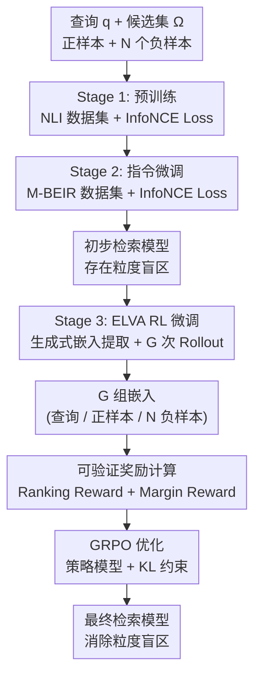

# ELVA: Exploring Ranking-Driven Universal Multimodal Retrieval

**会议**: ECCV 2026  
**arXiv**: [2606.20280](https://arxiv.org/abs/2606.20280)  
**代码**: 无  
**领域**: 多模态VLM / 强化学习 / 信息检索  
**关键词**: 通用多模态检索, 强化学习, 粒度盲区, 排序驱动, 可验证奖励  

## 一句话总结
ELVA 提出基于规则的可验证奖励 RL 框架，通过排序奖励和间隔奖励联合优化 MLLM 的检索排序能力，解决对比学习适配检索任务时产生的"粒度盲区"（grain blindness）问题，在 M-BEIR 和自建多粒度基准 MRBench 上均取得 SOTA，其中 MRBench 提升 13.1%。

## 研究背景与动机
通用多模态检索（UMR）旨在用一个统一框架处理跨模态的多样化检索任务（文本到图像、图像到文本、图文交织检索等）。近期工作将多模态大语言模型（MLLM）通过对比学习适配到检索任务，利用其强大的跨模态表示能力取得了显著进展。然而，本研究发现现有方法在将对比学习范式适配到检索任务时，普遍存在"粒度盲区"（grain blindness）——模型倾向于忽略查询中包含的细粒度语义信息（如"会喷火的 Charmander"这个查询既包含动作"喷火"又包含实体"Charmander"），导致在需要同时捕获多粒度信息的复杂查询上表现不佳。

粒度盲区的根源在于对比学习的二元分类本质：它只区分正负样本，将所有负样本同等对待，忽略了每个负样本携带的不同粒度信息。例如，对于查询"站着的狗"，一个"躺着的狗"和一个"站着的猫"作为负样本时，它们分别提供了"姿态"粒度和"实体"粒度的区分信息，但对比学习无法利用这种差异。本文提出，应让模型根据负样本与正样本的相似度对负样本进行排序，从而使模型从每个负样本中学习到不同的粒度信息。核心 insight：将检索训练从"区分正负"升级为"学习排序"，用强化学习的探索能力替代人工排序标签，让模型自主发现负样本间的层次结构，从而捕获查询中的全部粒度信息。

## 方法详解

### 整体框架
ELVA 采用三阶段训练框架，前两阶段沿用 LamRA 的预训练和指令微调流程，第三阶段引入基于规则可验证奖励的 RL 微调。给定一个多模态查询 $q$ 和候选集 $\Omega = \{c_n\}_{n=1}^{N}$（含 1 个正样本和 N 个负样本），目标是检索出最相关的 top-k 候选项。前两阶段通过对比学习获得初步检索能力，但模型因粒度盲区在处理复杂查询时表现不佳。第三阶段 ELVA 的核心是让策略模型对同一查询生成 $G$ 组独立的嵌入表示（rollouts），每组包含查询嵌入、正样本嵌入和所有负样本嵌入，然后通过两个可验证的奖励函数评估每组嵌入的质量，最终用 GRPO 算法优化策略模型，同时通过 KL 散度约束防止模型偏离参考策略过远。

框架采用三阶段串行训练，其中 RL 阶段的每次 rollout 都包含完整的嵌入生成和奖励计算循环。

### 关键设计

**1. 生成式嵌入提取：使 RL 探索成为可能**

传统 MLLM 检索方法通过提取固定 prompt token（如 EOS）的隐藏状态作为嵌入，这种方式在 RL 框架下会产生零方差的确定性输出，导致策略梯度无法有效探索。ELVA 将嵌入提取重新设计为生成式范式：模型先自回归地生成对输入的文字描述，再输出一个特殊 token [RET]，取该 token 位置的隐藏状态作为检索嵌入。这一改动引入了足够的表示方差，使得 GRPO 的多轮 rollout 机制能够产生有意义的嵌入变体，为 RL 探索提供了基础。在实现上，[RET] token 被注册到 LLM 的词表中，模型通过以下模板生成嵌入："{image}{query}... [RET]"，其中 image 和 query 模态可以灵活组合。

**2. 可验证奖励函数设计：排序奖励 + 间隔奖励**

这是 ELVA 的核心创新。传统 RL 依赖人类偏好模型或离散的排序指标（如 NDCG）作为奖励，前者成本高，后者信号不连续且方差大。ELVA 将可验证奖励（RLVR）扩展到多模态检索领域，设计两个互补的规则化奖励函数：

**间隔奖励（Margin Reward）**用来保证正样本与负样本之间有足够的相似度间隔，受三元组损失启发。给定查询 $q$、正样本 $c_p$ 和负样本集 $\{c_n\}$，先选出与查询最相似的最难负样本（hardest negative），然后要求正样本相似度与该最难负样本相似度之差超过阈值 $\delta$：

$$R_{\text{Margin}} = \max(0, \cos(q, c_p) - \max_n \cos(q, c_n) - \delta)$$

**排序奖励（Ranking Reward）**是连续化的排序优化目标，鼓励模型将正样本排到候选列表顶端，同时让高相似度的负样本排在靠近顶部的位次。对于一次 rollout 得到的排序结果（按相似度从高到低），设正样本位于第 $r$ 位、相似度为 $s_{(r)}$：

$$R_{\text{Rank}} = s_{(r)} \cdot \frac{1}{1 + \log r} - \gamma \sum_{k \neq r} s_{(k)} \cdot (\log k - 1)$$

第一项用对数衰减的位置权重鼓励正样本高位排序，第二项惩罚高相似度负样本，但惩罚力度随排名 $k$ 增加而对数递减——这意味着与查询语义更接近的负样本（排名靠前）受到较小惩罚，从而形成内部排序结构。这种连续化设计提供了平滑的奖励信号，避免了离散指标奖励的跳跃和不稳定问题。最终总奖励为 $R_{\text{total}} = \alpha R_{\text{Margin}} + \varepsilon R_{\text{Ranking}}$，默认 $\alpha=0.4$、$\varepsilon=0.6$，排序奖励权重略高以更直接地对齐 Recall@K 评估指标。

**3. 平衡负采样策略**

RL 训练阶段的数据构造对优化稳定性至关重要。前人工作直接使用 top-100 候选项作负样本，但这会导致负样本与查询过于相似、奖励分布过窄、梯度消失。ELVA 设计了一种混合负采样策略：每个查询的候选集中，50 个是从过滤掉过高相似度候选项后选出的 top-50 困难负样本（控制难度、提升排序能力），另外 50 个从全量候选池中随机采样（增加分布多样性、防止过拟合）。整个 RL 训练集从 M-BEIR 的 110 万样本中按 1% 比例采样，构造约 11k 条训练实例。这种混合策略保证了奖励方差足够大、学习信号丰富且稳定。

### 一个完整示例

以查询"站着的狗"（standing dog）为例走一遍 ELVA RL 阶段的流程。该查询包含两个粒度：实体"狗"和姿态"站着"。候选集包含 1 个正样本（站着的狗图片）和 100 个负样本（其中 50 个为过滤后的困难负样本——如"躺着的狗""站着的猫"，50 个为随机负样本）。策略模型生成 $G=8$ 组 rollout 嵌入。在一次典型的 rollout 中，模型可能将正样本排在第 3 位（$r=3$），紧跟"躺着的狗"（排名第 1，与查询实体相同但姿态不同）、"站着的猫"（排名第 2，与查询姿态相同但实体不同）。排序奖励的第一项 $s_{(3)} \cdot 1/(1+\log3)$ 鼓励模型提升正样本排位，第二项惩罚这两个高排位负样本——但它们的排名靠前使得对数惩罚 $\log k$ 较小，因此力度有限，模型得以感知这些负样本携带的不同粒度信息。间隔奖励同时确保正样本和最难负样本之间有最小间隔。8 组 rollouts 的相对奖励由 GRPO 比较并产生优化信号。训练后，在 t-SNE 可视化中，基线模型将正样本（站着的狗）与"躺着的狗""站着的猫"纠缠在一起（嵌入距离 0.07），而 ELVA 显著拉开距离（0.15），验证了粒度信息的保留。

### 损失函数 / 训练策略
前两阶段使用 InfoNCE 损失进行对比学习：

$$\mathcal{L}_{\text{InfoNCE}} = -\frac{1}{N}\sum_{n=1}^{N}\log\left[\frac{\exp(\cos(e_q, e_c^+)/\tau)}{\sum_{m=1}^{N}\exp(\cos(e_q, e_{c_m})/\tau)}\right]$$

第三阶段 ELVA 使用 GRPO（Group Relative Policy Optimization）进行策略优化。对每个查询 $q$ 生成 $G=8$ 组嵌入作为 actions，计算每组的总奖励 $R_{\text{total}}$，以组内奖励的均值和标准差做标准化后得到优势函数，用 PPO 风格的 clipped surrogate objective 更新策略，同时加入 KL 散度正则项（系数 $\beta=0.2$）约束策略不偏离参考模型（即 Stage 2 后的指令微调模型）过远。RL 阶段学习率为 $1 \times 10^{-6}$，训练 1 个 epoch，在 8 张 H20 GPU 上耗时约 16 小时。所有阶段中视觉编码器冻结，仅用 LoRA 微调语言模型部分。

## 实验关键数据

### 主实验
ELVA 在 M-BEIR 测试集的 16 个子任务上评估，覆盖 8 种查询-候选模态组合。

| 方法 | VN | COCO | F200K | WebQA | EDIS | NIGHTS | OVEN | InfoS | FIQ | CIRR | Avg. |
|------|-----|------|-------|-------|------|--------|------|-------|-----|------|------|
| CLIP-L (zero-shot) | 43.3 | 61.1 | 6.6 | 36.2 | 43.3 | 26.1 | 24.2 | 20.5 | 7.0 | 13.2 | 32.5 |
| Qwen2.5-VL-7B (zero-shot) | 40.2 | 71.9 | 20.3 | 71.9 | 49.4 | 25.5 | 42.4 | 32.1 | 25.0 | 55.1 | 46.7 |
| UniIR-CLIP (supervised) | 42.6 | 81.1 | 18.0 | 84.7 | 59.4 | 32.0 | 45.5 | 27.9 | 24.4 | 44.6 | 50.6 |
| MM-Embed-7B | 41.0 | 71.3 | 17.1 | 95.9 | 68.8 | 32.4 | 42.1 | 42.3 | 25.7 | 50.0 | 52.7 |
| PUMA-3B | 35.7 | 79.5 | 25.8 | 86.2 | 58.2 | 31.4 | 52.7 | 48.3 | 30.6 | 49.9 | 54.4 |
| LamRA-Ret-7B | 41.6 | 81.5 | 28.7 | 86.0 | 62.6 | 32.1 | 54.1 | 52.1 | 33.2 | 53.1 | 56.6 |
| **ELVA-7B** | **43.5** | **83.0** | **29.2** | **91.0** | **63.5** | **32.8** | **56.0** | **55.5** | **34.6** | **55.4** | **58.7** |

注：上表为简化展示，取每个任务的代表性指标（R@5 或 R@10），Avg. 为 16 个子任务均值。完整 16 列结果以原文为准。ELVA-7B 相较于 LamRA-Ret-7B 基线平均提升 2.1 个百分点，在 $(q^i, q^t) \rightarrow (c^i, c^t)$ 到 InfoS 的困难配置上提升达 6.0%。

在多粒度基准 MRBench 上，ELVA 相较 SOTA 方法 LamRA-Ret-7B 有 13.1% 的相对提升：

| 方法 | COCO* (t2i) | COCO* (i2t) | NIGHTS* | CIRR* | Avg. |
|------|-------------|-------------|---------|-------|------|
| Qwen2-VL-7B | 39.2 | 32.0 | 15.6 | 10.8 | 34.3 |
| LamRA-Ret-7B | 50.4 | 54.0 | 22.4 | 25.7 | 38.1 |
| **ELVA-7B** | **55.5** | **60.6** | **24.1** | **32.5** | **43.2** |

### 消融实验

| # | 配置 | VN (R@5) | COCO (R@5) | F200K (R@10) | Avg. | 说明 |
|---|------|----------|------------|-------------|------|------|
| 1 | w/o Ranking Reward | 41.7 | 82.0 | 28.4 | 57.2 | 去掉排序奖励，下降 1.5 个百分点 |
| 2 | w/o Margin Reward | 42.3 | 82.2 | 28.5 | 58.1 | 去掉间隔奖励，下降 0.6 个百分点 |
| 3 | w/o Negative Ranking | 42.8 | 82.0 | 28.5 | 58.1 | 排序奖励中去掉负样本排序项（第二项） |
| 4 | w/o Negative Sampling | 43.1 | 82.2 | 28.5 | 58.2 | 去掉平衡负采样策略，直接用全量候选 |
| 5 | w/o Random Negatives | 43.3 | 82.6 | 28.9 | 58.4 | 仅用困难负样本，不加随机负样本 |
| 6 | **ELVA-7B (Full)** | **43.5** | **83.0** | **29.2** | **58.7** | 完整模型 |

注：Avg. 为 M-BEIR 全部 16 个子任务均值。数据取自原文 Table 8。

### 关键发现
- **排序奖励贡献最大**：去掉排序奖励后平均下降 1.5 个百分点，说明全局排序优化比局部间隔约束更能对齐最终检索指标（Recall@K）。间隔奖励单独去掉仅下降 0.6 个百分点，但两者协同效果最佳，验证了"局部间隔 + 全局排序"的互补设计。
- **负样本排序项不可或缺**：排序奖励的第二项（负样本排序惩罚）去掉后下降 0.6 个百分点，证明显式优化负样本间层次结构有助于捕获多粒度信息，而非仅靠正样本高位排序即可。
- **平衡负采样对 RL 稳定性关键**：去掉采样策略后性能下降，随机负样本的加入（行 4 vs 行 5）提供分布多样性、防止过拟合。奖励权重消融显示 $\alpha=0.4, \varepsilon=0.6$（排序奖励权重略高）为最优配置。
- **框架通用性（plug-and-play）**：将 ELVA 的 RL 阶段直接应用到 PUMA 和 MM-Embed 上作为后训练步骤，分别带来 +1.9 和 +2.2 个百分点的提升，证明 ELVA 的 RL 框架可作为通用增强模块。
- **零样本视频检索泛化**：ELVA 从未在视频数据上微调，但在 MSR-VTT 和 MSVD 上的零样本文本到视频检索仍取得强结果，保留了 Qwen2-VL 固有的视频理解能力，表明 RL 微调没有灾难性遗忘。

## 亮点与洞察
- **"粒度盲区"概念的形式化定义具有方法论价值**：论文不仅提出现象，还给出了严格的数学定义——$d(f_\theta(q), f_\theta(q\setminus\{g_k\})) < \delta$ 表示去掉某个粒度后嵌入距离低于判别阈值，并指出其根源为对比学习的梯度饥饿（Gradient Starvation）现象：主导粒度提供了足够区分正负的相似度余量后，次要粒度的梯度信号被压制，导致过早收敛。这个分析框架可以迁移到其他对比学习场景中诊断表示坍缩问题。
- **排序奖励的连续化设计很巧妙**：传统的 NDCG 等排序指标在 RL 中会产生离散跳跃的奖励信号导致训练不稳定，ELVA 直接用相似度分数的连续函数替代离散的位置奖励（$s_{(r)} \cdot 1/(1+\log r)$），既保留了排序优化的语义，又提供了平滑梯度。这个思路可以迁移到任何需要用 RL 优化排序任务（如推荐系统、文档排序）的场景。
- **生成式嵌入提取解锁 RL 探索是一个被低估的设计**：看似只是换了个 token 提取方式（从固定 EOS 变为自回归生成的 [RET]），但这一改动是让 RL 能够运行的使能条件——确定性嵌入不会有 rollout 方差，GRPO 的相对优势比较也就失去意义。这个 insight 可用于其他需要给确定性模型引入 RL 探索的任务。
- **三阶段管线的模块化设计实用性强**：前两阶段（预训练+指令微调）完全是现有流程，第三阶段 RL 作为"插件"叠加，已训练的检索模型可以直接接上 ELVA 获得额外收益，无需重新设计整个训练管线。

## 局限与展望
- **MLLM 推理成本高**：这是所有基于 MLLM 的检索方法的共性问题。作者建议通过特征预计算、层剪枝、使用轻量版 ELVA-2B 来缓解，但推理延迟仍是实际部署的瓶颈。
- **视频检索性能仍有差距**：ELVA 在零样本视频检索上虽优于大部分方法，但仍落后于专门在视频数据上训练的 InternVideo2。未来需要加入视频数据微调来缩小差距。
- **未探索更大规模模型的 scaling 行为**：当前基于 Qwen2-VL-7B，对更大 MLLM（如 72B 级别）的效果未验证。RL 训练的 KL 约束在更大模型上是否需要调整也是开放问题。
- **数据集依赖**：MRBench 是从 M-BEIR 中自动筛选+人工验证构建的，覆盖的粒度类型（实体+动作、属性+实体等）有限。更全面的多粒度场景（如多实体交互、时空关系）未被评估。

## 相关工作与启发
- **vs LamRA / PUMA**: 这两者仅用对比学习适配 MLLM 到检索，ELVA 在它们的基础上增加 RL 排序微调，本质差异是训练目标从"二分类区分正负"升级为"排序优化学习粒度层次"。ELVA 可直接作为这两种方法的增强模块（实验已验证）。
- **vs Search-R3 / ReasonRank**: 这两者也用 RL 做排序学习，但分别使用连续相似度分数（容易在顶部位置收敛后饱和）和离散指标奖励（信号不连续、高方差）。ELVA 的排序奖励同时具有连续性和非饱和性（间隔奖励保证持续信号），且额外建模了负样本间排序结构。
- **vs VLM-R1 / Vision-R1**: 这些 RL-based MLLM 面向视觉推理任务而非检索，ELVA 是首次在检索领域使用 RLVR，核心差异在于奖励函数设计（排序感知 vs 推理正确性）和表示提取方式（生成式嵌入 vs token 生成）。

## 评分
- 新颖性: ⭐⭐⭐⭐ 首次将"粒度盲区"概念在检索任务中形式化并用 RLVR 解决，排序奖励的连续化设计有新意，但整体框架思路（对比预训练+RL 微调）不算全新范式
- 实验充分度: ⭐⭐⭐⭐⭐ 覆盖 M-BEIR 16 个子任务、未见数据集、未见任务（held-out）、MRBench 多粒度基准、零样本视频检索、消融实验、奖励权重分析、框架通用性验证，实验设计全面且严谨
- 写作质量: ⭐⭐⭐⭐ 概念定义清晰（粒度的数学定义、梯度饥饿的因果链）、方法动机链条完整，但 Table 编号存在不一致（文本内写 Table 5 但实际数据可能对应 Table 6，建议以原文为准核对）
- 价值: ⭐⭐⭐⭐ 提出的 RLVR 排序框架可作为通用检索增强模块（已证 plug-and-play），粒度盲区分析和连续排序奖励设计对其他检索/排序任务有迁移价值，但 MLLM 推理成本限制实际部署范围

<!-- RELATED:START -->

## 相关论文

- [\[ICLR 2026\] UME-R1: Exploring Reasoning-Driven Generative Multimodal Embeddings](../../ICLR2026/reinforcement_learning/ume-r1_exploring_reasoning-driven_generative_multimodal_embeddings.md)
- [\[ICLR 2026\] Universal Value-Function Uncertainties](../../ICLR2026/reinforcement_learning/universal_value-function_uncertainties.md)
- [\[NeurIPS 2025\] Knowledge-based Visual Question Answer with Multimodal Processing, Retrieval and Filtering](../../NeurIPS2025/reinforcement_learning/knowledge-based_visual_question_answer_with_multimodal_processing_retrieval_and_.md)
- [\[ICML 2026\] Offline Reinforcement Learning with Universal Horizon Models](../../ICML2026/reinforcement_learning/offline_reinforcement_learning_with_universal_horizon_models.md)
- [\[ACL 2026\] From Isolated Scoring to Collaborative Ranking: A Comparison-Native Framework for LLM-Based Paper Evaluation](../../ACL2026/reinforcement_learning/from_isolated_scoring_to_collaborative_ranking_a_comparison-native_framework_for.md)

<!-- RELATED:END -->
