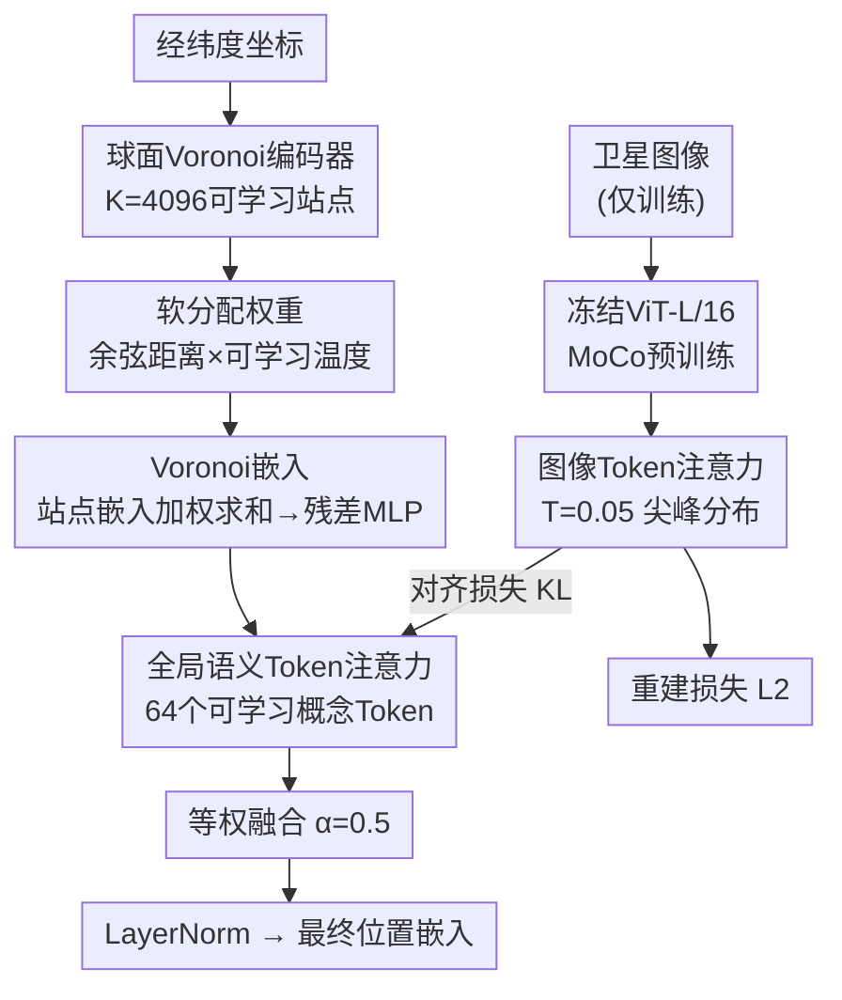

# Tessellating The Earth

**会议**: ECCV 2026  
**arXiv**: [2606.27514](https://arxiv.org/abs/2606.27514)  
**代码**: [https://github.com/mvrl/TTE](https://github.com/mvrl/TTE)  
**领域**: 遥感  
**关键词**: 地理位置编码, 球面Voronoi划分, 可学习空间分解, 全局语义Token, 对比学习

## 一句话总结

TTE 用可学习的球面Voronoi划分替代固定基函数（球谐函数/傅里叶特征）来编码地理坐标，让站点在训练中自动向高判别性区域迁移以集中表示容量，同时引入全局语义Token作为跨区域语义共享通道，在多项地理空间分类与回归任务上达到新SOTA。

## 研究背景与动机

经纬度坐标本身蕴藏着丰富的地理信息——气候、生态、土地覆盖、基础设施都与位置紧密相关。地理编码器（location encoder）的目标就是学习从经纬度到高维嵌入的映射，从而仅凭坐标就能表征某个地点的环境特征，在物种分布建模、作物产量估计、空气质量预测等任务中作为地理先验使用。现有的方法（如SatCLIP、GeoCLIP）大多采用对比学习框架，让位置编码器与卫星图像编码器的输出在嵌入空间中对齐。其中最关键的设计选择是**位置编码**——如何把经纬度升到高维空间。目前的方案使用球谐函数、多尺度傅里叶特征或随机傅里叶特征等固定基函数，但它们的空间结构在训练前就已确定，无法根据数据自适应调整。球谐函数在整个球面上均匀分配容量，把同样多的基函数分配给开阔的海洋和繁华的城市，这种无差别的分配导致海岸线和小型陆地始终被欠表达。

这种均匀分配背后的核心矛盾在于：地球表面的空间复杂度远非均匀，固定基函数无法将表示能力聚焦到真正需要的地方。全球约71%的面积是海洋，但大多数实际任务关心的陆地部分只占29%，然而现有编码器不能"选择性地"把计算资源分配给陆地、海岸线或生态过渡带。本文提出的切入角度是：既然我们需要自适应空间分解，何不把Voronoi划分——一种经典的几何分割工具——变成一个可学习的过程？让每个Voronoi站点不仅有自己的位置，还有自己的嵌入向量，站点在对比训练中自动向高判别性区域迁移，形成数据驱动的空间复杂度分配。在此基础上，卫星图像编码器蕴含的丰富语义知识（如土地类型、植被覆盖）只在训练时可用，推理时只有坐标——如何把这种视觉语义压缩成一个可随时引用的"概念词典"，让不同大陆覆盖相似环境的站点共享语义，是需要解决的第二个关键问题。

**核心idea：用可学习的球面Voronoi站点替代固定位置编码基函数，站点在对比训练中自动向高判别区域迁移以集中表示容量；同时引入一组共享的全局语义Token，通过非对称注意力蒸馏将卫星图像的视觉语义编码为紧凑概念词典，使编码器在推理时仅凭坐标也能引用语义信息。**

## 方法详解

### 整体框架

TTE 的整体架构分为两条路径。左侧是位置路径（推理时唯一使用的部分）：输入经纬度坐标映射到单位球面，经过可学习球面Voronoi编码器产生软分配权重，加权求和各站点的嵌入得到"Voronoi嵌入"；该嵌入再通过全局语义Token的注意力机制产生"Token表示"，与Voronoi嵌入按α=0.5等权融合后经LayerNorm得到最终位置嵌入。右侧是图像路径（仅在训练时使用）：共定位的Sentinel-2卫星图像经冻结MoCo-ViT-L编码器提取特征，再通过同一组Token的注意力机制（但温度固定为0.05，产生尖峰式近one-hot分布）得到图像侧的Token表示。三个损失函数——对比损失、重建损失、对齐损失——联合优化整个系统。

### 关键设计

**1. 可学习球面Voronoi划分：让容量跟着数据走**

固定基函数的最大问题是不管地球表面哪里复杂哪里简单，都分配相同数量的基元。本文的核心设计是用一组可学习的Voronoi站点来替代这些固定基。在单位球面上放置K=4096个站点，每个站点有三个可学习参数：位置向量s_k（球面上可移动，每步梯度后归一化回S²）、温度τ_k（控制Voronoi边界锐利度，值越大的站点感受野越小）、嵌入向量e_k（$\mathbb{R}^{384}$）。对于一个查询坐标x，其对站点k的软分配权重通过余弦相似度加权softmax计算：

$$w_k(x) = \frac{\exp(\tau_k \cdot (s_k \cdot x))}{\sum_j \exp(\tau_j \cdot (s_j \cdot x))}$$

最终的Voronoi嵌入就是所有站点嵌入的软加权求和 $f(x) = \sum_k w_k(x) \cdot e_k$，再经过一个两残差块的MLP映射到512维。站点初始化在过滤为陆地（除去南极）的Fibonacci格点上，温度初始化为45。在对比学习的驱动下，站点在训练中自动向海岸线、生态过渡带等高判别性区域迁移——有意思的是很多站点并不是停留在陆地上，而是**移动到近海**，这样它们的感受野可以专门覆盖狭窄的沿海带，而不是把容量分摊给海岸和内陆。海洋区域的站点分布稀疏，这种完全数据驱动的非均匀分配是之前所有固定基方法做不到的。

**2. 全局语义Token：让不同大陆的同一生态区共享表示**

Voronoi编码器本质上是局部的——每个站点只感知自己附近的区域。一个覆盖南美热带雨林的站点和一个覆盖非洲热带雨林的站点之间没有直接的语义共享通道。但直觉上，"热带雨林"这个语义概念应该是跨大陆共享的。本文引入了R=64个可学习的全局语义Token $\mathbf{r}_r \in \mathbb{R}^{512}$，作为所有站点共享的"概念词典"。位置路径和图像路径各自通过一个线性投影将嵌入映射到64维注意力logits上，经温度缩放softmax后得到Token权重，然后对Token向量加权求和得到上下文表示。

关键在于**温度的不对称设计**：图像路径使用固定低温T_img=0.05，产生尖峰式的近one-hot注意力分布（每张图像只强烈激活1-2个Token）；位置路径使用可学习的T_loc（从0.5线性退火到0.2），需要学会从坐标预测应该激活哪些语义Token。这种不对称设计迫使Token语义特化——最终每个Token确实学到了"雪冰覆盖""干旱沙漠""岩石地形""沿海区域"等特定的环境概念，且这些特化完全是无监督涌现的，没有使用任何标签。最终位置嵌入是Voronoi嵌入的线性投影与Token表示的等权（α=0.5）融合后经LayerNorm得到，既保留了局部空间结构又融合了全局语义。

**3. 三联损失联合优化：对比+重建+对齐**

训练目标由三个损失函数构成。主损失是对称对比损失（与SatCLIP相同），拉近共定位的图像嵌入和位置嵌入、推远批次内的负样本对，温度参数可学习。重建损失要求Token能够重建图像特征——图像路径的Token表示z_img与ViT原始特征做L2距离最小化，这是防止Token退化（collapse）的关键，确保64个Token确实覆盖了图像特征空间的主要方向。对齐损失是对Token注意力分布做KL散度对齐，位置路径的注意力分布尽可能接近图像路径的（固定目标，stop-gradient），让位置路径学会从坐标推断语义概念。

### 损失函数 / 训练策略

总损失 $\mathcal{L} = \mathcal{L}_{\text{con}} + 100 \cdot \mathcal{L}_{\text{recon}} + 0.1 \cdot \mathcal{L}_{\text{align}}$。重建损失权重较高确保语义关联，对齐损失权重较低让位置路径在遵循语义指导的同时保留地理适应性。训练使用AdamW优化器，不同参数组使用不同学习率（站点位置1e-3最快，投影头5e-5最慢），5个epoch线性预热后余弦退火至1e-6。有效批大小6384（2×H100，FP32），共300个epoch约10小时。TTE仅增加4.0M可训练参数（占总参数量1.3%），与SatCLIP大小几乎相同。

## 实验关键数据

### 主实验

| 任务（分类） | ACC | 对比SOTA | 任务（回归） | R² | 对比SOTA |
|------------|-----|----------|------------|-----|---------|
| Biome | **77.8** | TaxaBind 72.3 (+5.5) | Temperature | **0.946** | SINR 0.942 |
| EcoRegion | 67.4 | TaxaBind **72.9** | Elevation | **0.839** | SatCLIP 0.666 (+0.173) |
| Country | **94.8** | SINR 88.3 (+6.5) | Population | **0.790** | TaxaBind 0.712 |
| 分类平均 | **80.0** | 次优 77.2 (+2.8%) | 回归平均 | **0.777** | 次优 0.732 (+0.045) |

| iNaturalist-2018 地理先验 | Top-1 | Top-3 | Top-5 | Top-10 |
|-------------------------|-------|-------|-------|--------|
| 仅图像 | 66.1 | 83.3 | 88.0 | 92.2 |
| + SatCLIP | 75.1 | 88.7 | 91.9 | 94.5 |
| + TaxaBind | 75.1 | 89.7 | 93.0 | 95.6 |
| **+ TTE** | **76.2** | **90.0** | **93.2** | **95.7** |

### 消融实验

| 配置 | 分类平均↑ | 回归平均↑ | 关键观察 |
|------|----------|----------|---------|
| TTE完整 | 80.0 | 0.777 | 基线 |
| 固定站点（不更新位置） | 67.1 (-12.9) | 0.652 (-0.125) | **最大退化**，低于SatCLIP |
| 移除Token（无语义分支） | 76.3 (-3.7) | 0.739 (-0.038) | Token贡献显著 |
| 无对齐损失 | 78.3 (-1.7) | 0.763 (-0.014) | 分类受更大影响 |
| 无重建损失 | 78.8 (-1.2) | 0.766 (-0.011) | 主要在EcoReg和Housing |
| 对称soft注意力 | 77.8 (-2.2) | 0.752 (-0.025) | 尖峰分布优于对称 |

### 关键发现

- 站点位置可学习的贡献远超其他组件：固定站点造成平均分类掉12.9%、回归掉0.125，直接低于SatCLIP，有力支持了"均匀分配容量是实际瓶颈"的核心论断。
- Token数最优64个（太少欠表示语义空间、太多稀释对齐信号），站点数最优4096（8192反而略微退化），两者都在实验中呈现清晰的饱和曲线。
- 站点迁移呈现出非直观的几何策略：站点向海岸线聚集时，并非停留在陆地上，而是移动到近海——这样站点的感受野可以专门覆盖狭窄的沿海带，避免把容量分摊给海岸和内陆两个区域。
- TTE作为纯参数化编码器在iNaturalist-2018上甚至超过了需要外部数据库检索的RANGE方法（76.2 vs 75.2），说明Token已经积累了足够的跨区域语义先验。

## 亮点与洞察

- **用球面Voronoi替代固定基做地理编码是非常优雅的设计**：余弦距离在球面上天然对应角距离，softmax分配保证所有站点都有非零梯度。从DeRF到地理表示学习的迁移定义很清晰，参数增量极小（1.3%）却有巨大收益。
- **非对称注意力蒸馏**是最精巧的细节：图像路径用极低温迫使Token特化，位置路径用慢退火学会预测这种特化分布。消融实验证明这种"老师教学生"的师生框架优于对称软注意力。
- Token可视化令人惊叹——模型在没有显式监督的情况下学到了「雪冰」「沙漠」「岩石」「沿海」等语义概念，且注意力图呈现跨大陆的全局一致性。
- 代码和模型权重已开源，为遥感社区提供了一个可直接替代SatCLIP的强基线。

## 局限与展望

- 当前仅使用单时相Sentinel-2图像训练，没有整合时间维度，对时敏任务（如房价预测——1990年人口普查数据与当代卫星图之间有时序错配）表现不佳。
- 全局语义Token（64个）虽有效但无法完全替代直接图像检索——RANGE检索增强后在Biome上从77.8提升到84.2，说明Token压缩丢失了部分细粒度视觉信息。
- 在EcoRegion上不如TaxaBind，后者对齐了iNaturalist物种观测数据，说明极细粒度的生态分类可能需要专门训练信号而非通用视觉对比学习。
- 站点初始化策略的差异不大（Fibonacci格点 vs SatCLIP/RANGE聚类初始化结果基本持平），说明训练过程足够鲁棒，但也意味着未来可以探索更紧凑的初始化以减少收敛时间。

## 相关工作与启发

- **vs SatCLIP**: SatCLIP使用球谐函数+SIREN作为固定基位置编码，TTE用可学习Voronoi替代，在Biome上从68.9提升到77.8、Elevation从0.666到0.839，直观展示了自适应空间分解的价值。
- **vs GeoCLIP**: GeoCLIP使用层次随机傅里叶特征，也是固定基方法。TTE在Country分类上94.8 vs 81.3，差距非常显著。
- **vs RANGE**: RANGE检索增强（推理时查外部数据库）提供了更强的表示但引入了部署限制。TTE纯参数化编码器在iNat-2018上超越了RANGE，说明精心设计的自监督策略可以弥合部分检索带来的优势。
- **思想源流**: Voronoi站点迁移思路源自DeRF（神经辐射场中的可学习Voronoi分解）；全局语义Token的设计与ViT的register token、Set Transformer的inducing points在机制上同构，但服务于不同的目标——跨模态知识蒸馏。

## 评分

- 新颖性: ⭐⭐⭐⭐⭐ 用可学习球面Voronoi替代固定基做地理编码是原创性很高的设计，非对称注意力蒸馏也很巧妙
- 实验充分度: ⭐⭐⭐⭐⭐ 覆盖8个地理任务+物种分类，消融实验完整（逐组件消融+站点数和Token数扫描+多种初始化+架构变体+检索增强对比）
- 写作质量: ⭐⭐⭐⭐⭐ 问题动机清晰，方法叙述自洽，图（Voronoi分布、Token注意力、站点迁移动态）与叙述配合到位
- 价值: ⭐⭐⭐⭐⭐ 只需增加1.3%参数就能大幅提升地理编码质量，代码开源，对地理空间AI有实际推动意义

<!-- RELATED:START -->

## 相关论文

- [\[ICLR 2026\] Earth-Agent: Unlocking the Full Landscape of Earth Observation with Agents](../../ICLR2026/remote_sensing/earth-agent_unlocking_the_full_landscape_of_earth_observation_with_agents.md)
- [\[ICLR 2026\] Measuring the Intrinsic Dimension of Earth Representations](../../ICLR2026/remote_sensing/measuring_the_intrinsic_dimension_of_earth_representations.md)
- [\[CVPR 2026\] RAMEN: Resolution-Adjustable Multimodal Encoder for Earth Observation](../../CVPR2026/remote_sensing/ramen_resolution-adjustable_multimodal_encoder_for_earth_observation.md)
- [\[ICLR 2026\] TerraFM: A Scalable Foundation Model for Unified Multisensor Earth Observation](../../ICLR2026/remote_sensing/terrafm_a_scalable_foundation_model_for_unified_multisensor_earth_observation.md)
- [\[CVPR 2026\] TESSERA: Temporal Embeddings of Surface Spectra for Earth Representation and Analysis](../../CVPR2026/remote_sensing/tessera_temporal_embeddings_of_surface_spectra_for_earth_representation_and_anal.md)

<!-- RELATED:END -->
