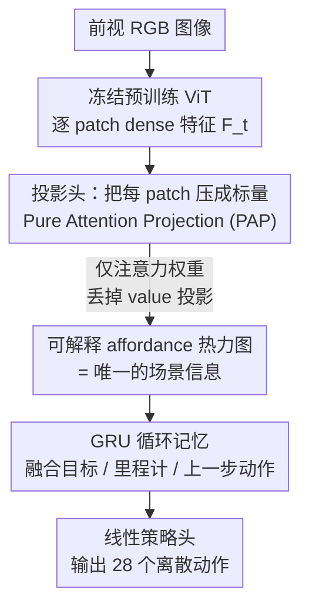

# A scalar per patch from pre-trained ViTs enables fast moving navigation in the real world

**会议**: ECCV2026  
**arXiv**: [2606.21216](https://arxiv.org/abs/2606.21216)   
**代码**: 未在正文提及  
**领域**: 机器人 / 具身导航  
**关键词**: 视觉导航, 预训练ViT, 特征瓶颈, 可解释性, sim2real

## 一句话总结
这是一项在真实办公楼里跑了 966 次真机导航（累计 24km、0.7 m/s 快速移动）的大规模实证研究，系统对比了 DinoV2/DinoV3/VC-1/AM-Radio/Dune 等冻结视觉编码器在纯 RGB 点目标导航上的表现，并提出一种极简投影层 PAP（Pure Attention Projection）：把每个图像 patch 压成一个标量注意力值喂给下游 agent，既不掉导航性能，又让「可通行区域 / 障碍 / affordance」这类可解释热力图自发涌现。

## 研究背景与动机
长期以来「感知」和「动作」被切成两个孤岛：计算机视觉负责「知道什么在哪」，做 3D 重建、分割、检测这些中间表示；机器人学负责把这些表示映射成电机指令。近来社区开始讨论视觉作为一门「做中间映射」的独立学科是否正迎来自己的「苦涩教训」时刻——未来的感知也许应该端到端地由「它对智能动作贡献多少」来衡量价值。但现实是，即便最通用的 VLA 智能体也不是从零在机器人数据上训练的，而是把预训练视觉编码器的特征分几步注入进去；机器人数据太稀缺，这个依赖短期内不会消失。于是一个很实际、却少有人在真机上系统回答的问题浮出水面：到底视觉的哪些方面对真实世界导航真正重要？

要在真机上快速移动（0.7 m/s、3Hz 决策，一个动作最快 333ms 后才能修正）导航，感知和决策都必须鲁棒，而现有工作大多停留在仿真里评估中间层先验，或依赖深度、可通行性这类手工特征，缺少「用通用预训练 ViT、不做任务定制工程」的大规模真机验证。作者据此把问题拆成五问：感知能否只从动作里学出来（从零训 ViT 行不行）？哪种预训练最适合导航（MAE vs 自蒸馏+iBOT vs 多教师蒸馏）？异构多教师蒸馏出的互补能力有没有用？下游任务到底需要编码器里多少信息？训练时给「特权传感器」（类 Lidar 全向输入）有没有帮助？

**本文的核心 idea 是：把冻结 ViT 每个 patch 的信息流「有原则地」瓶颈到只剩一个标量——当这个标量被塑形成一张空间注意力分布时，导航性能不降，而链接到 affordance 的可解释特征会自发涌现，说明真实导航所需的视觉信息其实可以被压得极窄。**

## 方法详解

### 整体框架
研究建立在 Janny 等人为真机快速移动优化过的端到端导航 agent 之上，任务是「静态点目标导航」（Static PointGoal）：目标用相对起始位姿的极坐标 $\mathbf{g}_0$ 给定、且不随移动更新，agent 只靠板载里程计（轮编码器 + IMU）估计自身位姿，没有外部地图、没有 Lidar、没有深度相机，唯一场景输入是前视 RGB。

整条感知-决策回路可以概括成四步：每个时刻先由冻结的预训练 ViT $v$ 把 RGB 图像编码成 dense patch 特征 $\mathbf{F}_t$，这是本文真正的研究对象；接着一个**投影头**把高维、逐 patch 的特征压成一个低维向量 $\mathbf{f}_t$（本文的贡献都在这里）；压缩后的视觉向量连同固定目标、里程计、上一步动作一起送进两层 GRU 更新循环隐状态 $\mathbf{h}_t$；最后一个线性策略头 $\pi$ 从 $\mathbf{h}_t$ 输出动作。动作空间是离散化的 28 个「线速度×角速度」组合，线速度取 {0, 0.2, 0.4, 0.7} m/s。整个 agent 用 PPO 强化学习训练，视觉编码器全程冻结，只训投影头、模态编码器、GRU 和策略。为了让仿真里学的策略能迁到真机，作者把 Habitat 里的「瞬移」运动换成了从真实轨迹标定出的二阶动力学模型，让仿真机器人像真机一样有加速、刹车、转向的惯性——这一步是把 sim2real gap 压到可忽略的关键前提。

投影头是这篇论文的分岔点，作者比较了四种（外加一个附录里的 SAP 变体），核心差异在于「保不保留空间结构」和「压得多狠」：

### 关键设计

**1. PAP（Pure Attention Projection）：把注意力权重本身当成表示，一个 patch 只留一个标量**

现有标准做法是 Cross-Attention Pooling（CAP，即 VLM 里的 Perceiver-Resampler）：用 $K$ 个可学习 query token 去 cross-attend patch 特征，每个 query 输出一个大小为 $E$（嵌入维度）的向量，$K$ 个 query 就是 $K\cdot E$ 个数。作者观察到，注意力机制里真正「决定看哪里」的是 query 和 key 算出的注意力分布，而 value 投影携带了大量人看不见的隐藏信息。PAP 的做法就是把注意力分布从「内部计算的中间量」提拔成「直接交给下游 agent 的表示」，并彻底丢掉 value 投影。具体地，每个 patch 特征 $\mathbf{F}_p$ 和每个可学习 read-out token $\mathbf{q}_k$ 只算一个标量——两者的相似度经 softmax 缩放：

$$\mathbf{f}_t=\Big\{\sigma\big(\mathbf{q}_k\mathbf{W}_{\text{query}}\cdot(\mathbf{F}_t\mathbf{W}_{\text{key}})^{\top}\big)\Big\}_{k=1\dots K}$$

于是 $K$ 个 read-out token 得到 $K$ 个长度为 $P$（patch 数）的向量，即每张热力图由 $P$ 个标量组成，总共 $K\cdot P$ 个数（再线性映射到 1024 维喂 GRU）。相比 CAP 的 $K\cdot E$，PAP 把每个 patch 的信息压到了极限——一个标量。为什么有效：因为交给 agent 的**全部**场景信息就是这几张热力图，没有任何 value 里藏的额外嵌入，这既是压缩也是天然的可解释性——人检查热力图看到的，就是 agent 能看到的全部。

**2. Affordance 图的涌现：可解释特征不是被监督出来的，是 RL 训练里自己长出来的**

这是 PAP 最出人意料的性质。作者对 4 个不同的预训练 ViT 都用 PAP，发现其中一个 read-out token 的注意力总是聚焦到「当前位置需要离开时，agent 可以去的那些方向/区域」——他们称之为 affordance map。关键是：这个感知模块是**无条件**的，并不依赖 agent 的目标；而且这种语义（可通行地面、障碍、可去方向）在每一个被测的 ViT 上都会涌现，说明它是导航任务本身逼出来的基础概念，而非某个编码器的偶然。作者进一步把这些热力图反投影、空间积分成一张全局地图叠在仿真地图上，验证它们确实对应「可导航空间 / 障碍 / affordance」的概念检测器。附录里 LPR 的特征幅值图也表现出几乎一样的分割式行为，交叉印证了「这些语义类别对导航是基础性的」。与传统机器学习可解释性方法的区别在于：这里没有「额外的隐藏信息」被偷偷传给模型，热力图就是表示本身。

**3. 保空间的低复杂度投影（PAP / LPR）是解锁难搞编码器的钥匙——DinoV3 的特殊案例**

论文比较了四种投影头：CAP、PAP、PCA、LPR（Linear Patchwise Reduction，把每 patch 特征线性降到 $D$=4 或 8 维再堆叠）。一个反常识发现是：保留空间信息、复杂度低的投影头（PAP、LPR）在真机上往往打平甚至超过 CAP，而完全不保空间的 PCA 投影意外地差。更戏剧性的是 DinoV3——它在标准 CV 任务上明显强于 DinoV2，可一旦用经典 CAP 投影，导航成功率直接崩到接近 0，换 read-out token 数、换 ViT-S/B、换随机种子都救不回来；但换上 PAP 或 LPR 这类「表达力弱但保空间、更简单」的投影头，DinoV3 又能正常工作并迁到真机。作者附录里进一步做了 SAP（self-attention pooling，保空间但表达力接近 CAP）消融，DinoV3 依然失败——这排除了「只要压缩+保空间就够」的解释，指向真正的病因是**投影头的表达力/复杂度**：DinoV3 的特征全局低频、依赖全局空间组织而非局部细节，弱 RL 奖励信号很难从它复杂的特征里抽出导航所需的简单信息，越复杂的投影头越难在弱监督下学好。这条发现把「投影头选择」从工程细节抬升成了「能否用上某个 SOTA 编码器」的决定因素。

### 损失函数 / 训练策略
agent 用 PPO 训练，奖励为 $r_t=R\cdot\mathbb{I}_{\text{success}}-\Delta_t^{\mathrm{Geo}}-\lambda-C\cdot\mathbb{I}_{\text{collision}}$：成功奖励 $R{=}2.5$，$\Delta_t^{\mathrm{Geo}}$ 是到目标测地距离的增益，松弛代价 $\lambda{=}0.01$ 鼓励效率，碰撞代价 $C{=}0.1$ 每次碰撞扣分但不终止 episode。为辅助空间推理，额外加一个线性头 $l$ 预测瞬时相对目标 $\hat{\mathbf{g}}_t=l(\mathbf{h}_t)$，训练时用仿真真值监督。从零训的 agent 跑 500M 步（单张 A100 约 3–4 周）；「特权预训练」路线先用类 Lidar 全向输入训 800M 步（无 RGB 编码器，用 1D CNN 编码 2D Lidar），再在纯 RGB 上微调 100M 步。为安全起见，仿真成功率低于 60% 的模型不上真机；真机每组序列重复 3 次以抵消光照等环境变化。

## 实验关键数据

评估分两个域：仿真用改造过（带真实动力学）的 Habitat + HM3D 验证集 2500 episodes；真机在办公楼里用「Rookie」机器人，每配置 3×14=42 个真实 episode，全文累计 966 次真机导航。指标为 SR（成功率）、SPL（路径长度加权成功率）、SCT（完成时间加权成功率）。

### 主实验：编码器对比（冻结 ViT + CAP，从零训 500M 步）

| Backbone | 预训练方式 | Sim SR | Real SR | Real SPL | Real SCT |
|----------|-----------|--------|---------|----------|----------|
| ResNet-18（从零，无预训练） | 无 | 53.5 | 未评 | — | — |
| DinoV2 | 自蒸馏+iBOT | 63.4 | 64.3 ±5.8 | 37.2 ±3.9 | 11.8 ±1.3 |
| VC-1 | MAE（含机器人数据） | 86.3 | 95.2 ±6.7 | 63.4 ±4.8 | 24.3 ±1.9 |
| Dune | 多教师蒸馏 | 90.7 | 95.3 ±3.3 | 62.5 ±3.4 | 26.8 ±2.0 |
| AM-Radio | 多教师蒸馏 | 85.2 | **100 ±0.0** | 63.4 ±0.5 | 29.3 ±0.7 |
| DinoV3 | 自蒸馏+iBOT | ~0（见下） | 未评 | — | — |

关键点：从零训 ResNet 几乎不工作（SR 53.5%），印证「感知不能只从动作里学」；用了预训练 ViT 后，仿真的 2500 episode 与真机 42 episode 指标高度一致——这是全文主结论「realistic motion 建模 + 预训练编码器已把 sim2real gap 压到可忽略、快速导航可纯仿真训练」的直接证据。异构多教师蒸馏的 AM-Radio / Dune 真机表现最好；VC-1 用 MAE 却意外强，作者归因于它 4.3M 图里专门掺了机器人数据。

### 特权预训练微调（从 Lidar agent 初始化 + 100M 步微调）

| Backbone | Real SR | Real SPL | 说明 |
|----------|---------|----------|------|
| DinoV2 | 97.6 ±3.3 | 57.2 ±9.4 | 相比从零训（64.3）大幅提升 |
| VC-1 | 100 ±0.0 | 65.0 ±4.4 | — |
| Dune | 100 ±0.0 | 64.1 ±1.7 | — |
| AM-Radio | 92.9 ±5.8 | 56.0 ±1.5 | 唯一没涨的编码器 |
| Lidar（参考，不可直接比） | 100 ±0.0 | 76.5 ±2.7 | 被微调的特权教师本身 |

用类 Lidar 全向特权信息预训练、再微调到纯 RGB，多数编码器都涨点（DinoV2 尤其明显），且拉平了编码器之间的差距——说明各编码器特征对机器人的有用程度其实相近，差异更多在「弱 RL 能不能解码出来」。⚠️ Lidar 行只作参考，输入模态不同不可直接比大小。

### 消融：read-out token 数 & 投影头（从特权 agent 微调 100M 步）

| 配置 | Sim SR | Real SR | 说明 |
|------|--------|---------|------|
| DinoV2 + CAP, K=1 | 88.0 | 97.6 ±3.3 | token 越多仿真略升但真机不迁移 |
| DinoV2 + CAP, K=8 | 88.6 | 90.5 ±6.7 | 真机反而掉 |
| DinoV2 + PAP, K=2 | 86.8 | 100 ±0.0 | 每 patch 一标量，真机满分 |
| DinoV2 + LPR, D=4 | 88.7 | 100 ±0.0 | 保空间线性降维，同样满分 |
| DinoV2 + LPR, D=8 | 87.7 | 88.1 ±6.7 | 维度加大真机反降 |
| DinoV2 + PCA, C=4 | 51.5 | 未评 | 不保空间，仿真就崩 |
| AM-Radio + PCA, C=4 | 0 | 未评 | 静态 PCA 投影完全失效 |
| DinoV3 + CAP（各种 K/种子） | ~0 | 未评 | 系统性失败 |
| DinoV3 + PAP, K=8 | 79.7 | 95.3 ±3.3 | 换保空间投影后救活并迁真机 |

### 关键发现
- **一个 patch 一个标量就够**：PAP/LPR 把每 patch 压到单标量，真机成功率仍可达 100%，而 CAP 用 K×E 个数反而在真机上更差——瓶颈化对 sim2real gap 是正向的，信息给多了容易过拟合仿真伪相关。
- **保空间 > 表达力**：PCA（不保空间）仿真就崩到 0–51%，PAP/LPR（保空间）稳；仿真里 token/维度越多越好，但这个优势不迁移到真机（如 CAP K=8、LPR D=8 真机反降），说明真机才是检验瓶颈价值的地方。
- **DinoV3 悖论**：CV 榜单更强的 DinoV3 在经典 CAP 下导航系统性归零，只有换低复杂度保空间投影才能用；病因是投影头表达力过高 × 弱 RL 奖励，配上 DinoV3「依赖全局低频结构、忽略高频细节」的特性——这与其他关于 DinoV3 迁移性差的研究一致。
- **可解释性零成本**：affordance 热力图在 4 个 ViT 上都从 RL 训练里自发涌现、无需监督，且对光照/纹理变化鲁棒（仿真与真机同区域注意力一致）。

## 亮点与洞察
- **把「可解释性」和「表示」合二为一**：PAP 直接把注意力分布当表示、丢掉 value，人看到的热力图 = agent 拿到的全部信息，这比事后归因（agent 里还藏着 value 的隐信息）诚实得多，是可迁移到任何「冻结编码器 + 下游轻策略」场景的巧思。
- **一个反直觉的规模化教训**：更强的编码器（DinoV3）、更多的 read-out token 并不必然更好——弱监督（RL）下，投影头越复杂越难学，「保空间 + 低复杂度」的窄瓶颈才是快速真机导航的甜点。
- **966 次真机 + 逐一对齐仿真/真机注意力**，把「sim2real gap 已可忽略」从口号做成了可复核的证据，这种「realistic motion 模型 + 冻结富编码器 + 简单投影」的配方对其他真机端到端任务有直接借鉴价值。
- **affordance 无条件涌现**：注意力聚焦「可离开的方向」且不依赖目标，提示导航所需的空间语义是任务内生的，可复用作轻量可通行性检测器（甚至不必额外训练分割）。

## 局限与展望
- 任务限定在静态点目标导航，作者也承认更广的任务（语言 grounding、图像目标匹配）需要不同推理机制，PAP 的极窄瓶颈是否仍够用未验证。
- 真机每配置仅 42 episode（14×3），个别配置 std 较大（如 DinoV2+CAP 微调 SPL ±9.4），且出于安全把仿真 <60% 的模型排除在真机外，真机样本存在筛选偏置。
- DinoV3 失败给出了「表达力 vs 保空间」两条假设并做了 SAP 消融倾向于「复杂度」解释，但仍是 conjecture，没有彻底定位机制；换更强 RL 或 IL 是否能救活复杂投影头未探索。
- PAP 丢掉 value 投影虽换来可解释性，本质是牺牲表达力换稳健，在信息更密集、需要细粒度语义的任务上可能不成立。

## 相关工作与启发
- **vs Cross-Attention Pooling / Perceiver-Resampler**：CAP 用 K 个 query 输出 K×E 维、value 里藏大量隐信息；PAP 只留注意力权重（K×P，每 patch 单标量）、丢 value，牺牲表达力换来可解释与更好的 sim2real——本文优势是真机更稳、可解释，劣势是表达力上限低。
- **vs 中层视觉先验（Sax et al., mid-level priors）**：他们只在仿真评估中层先验、且用深度/可通行性等手工特征；本文用通用预训练 ViT、不做任务定制工程，并在真机大规模验证。
- **vs 3D 几何编码器（MASt3R/VGGT）与蒸馏模型（Dune/AM-Radio）**：本文不自造几何特征，而是直接冻结这些编码器、比较谁的特征更利于导航，发现多教师蒸馏（含 3D 重建 + 人体网格 + 通用特征）的 Dune/AM-Radio 真机最优。
- **启发**：「注意力分布即可解释表示」的思路可迁移到操作、图像目标导航等任意用冻结 ViT 的下游策略；而「弱监督下投影头要低复杂度」的经验，对所有 RL/IL 接冻结大模型的 pipeline 都是可复用的设计准则。

## 评分
- 新颖性: ⭐⭐⭐⭐ PAP「注意力即表示、每 patch 一标量」的瓶颈+可解释组合很巧，但整体更偏系统性实证研究而非全新方法。
- 实验充分度: ⭐⭐⭐⭐⭐ 966 次真机 + 2500 仿真、5 编码器 × 4 投影头 × 多 token 数的完整消融，真机验证扎实。
- 写作质量: ⭐⭐⭐⭐ 问题拆成五问、结论清晰，但表格用大量 LaTeX 颜色宏、图信息承载重，纯文本可读性一般。
- 价值: ⭐⭐⭐⭐⭐ 「sim2real 已可忽略 + 窄瓶颈 + 可解释 affordance」对真机导航落地和「冻结编码器怎么接下游」都有直接指导意义。

<!-- RELATED:START -->

## 相关论文

- [\[ECCV 2026\] Pondering the Way: Spatial-perceiving World Action Model for Embodied Navigation](pondering_the_way_spatial-perceiving_world_action_model_for_embodied_navigation.md)
- [\[CVPR 2025\] A Data-Centric Revisit of Pre-Trained Vision Models for Robot Learning](../../CVPR2025/robotics/a_data-centric_revisit_of_pre-trained_vision_models_for_robot_learning.md)
- [\[ECCV 2026\] NavWM: A Unified Navigation World Model for Foresight-Driven Planning](navwm_a_unified_navigation_world_model_for_foresight-driven_planning.md)
- [\[ICLR 2026\] RRNCO: Towards Real-World Routing with Neural Combinatorial Optimization](../../ICLR2026/robotics/rrnco_towards_real-world_routing_with_neural_combinatorial_optimization.md)
- [\[CVPR 2026\] TraceGen: World Modeling in 3D Trace Space Enables Learning from Cross-Embodiment Videos](../../CVPR2026/robotics/tracegen_world_modeling_in_3d_trace_space_enables_learning_from_cross-embodiment.md)

<!-- RELATED:END -->
