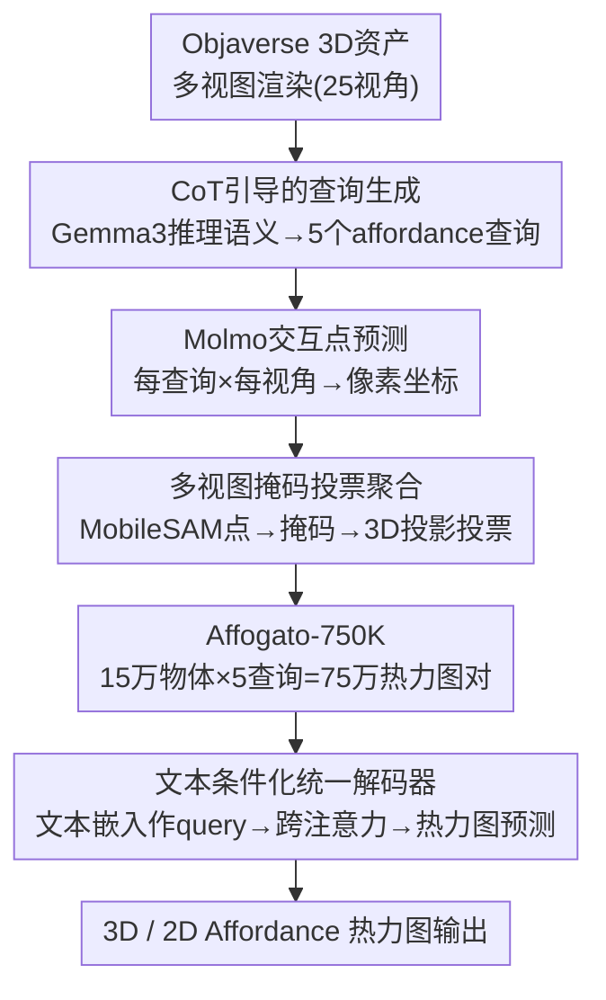

# Affogato: Open-Vocabulary Affordance Grounding with Automated Data Generation at Scale

**会议**: ECCV 2026  
**arXiv**: [2506.12009](https://arxiv.org/abs/2506.12009)  
**项目页**: [https://junha-l.github.io/affogato/](https://junha-l.github.io/affogato/)  
**数据集**: [HuggingFace](https://huggingface.co/datasets/project-affogato/affogato)  
**代码**: 无  
**领域**: 机器人/具身智能  
**关键词**: affordance定位, 开放词汇标注, 自动数据生成, 3D视觉理解, 具身智能

## 一句话总结
Affogato通过串联Gemma3、Molmo、MobileSAM三个基础模型构建全自动标注管线，从Objaverse的15万3D资产中生成了750K规模的开放词汇affordance热力图数据集（Affogato-750K），并设计跨模态统一架构Espresso-3D/2D验证了该数据集作为通用监督信号的有效性——预训练后在3D和2D affordance grounding基准上一致提升，尤其在unseen类别上增益最大。

## 研究背景与动机
**领域现状**：Affordance grounding（功能可供性定位）旨在定位物体上可以执行特定交互的区域（如杯子的"握持"区域），是具身智能体理解"在哪里操作"的基础能力。现有工作涵盖3D点云和2D图像两个方向，各自发展出独立的baseline和评测基准。

**现有痛点**：所有现有affordance数据集都受限于人工标注的规模和成本。3D数据集全部共享来自PartNet的23个物体类别，最多包含37种affordance；2D数据集最多覆盖304个物体类别和73种affordance。这些封闭的类别集合远不足以覆盖真实世界中开放多样的物体和交互方式——affordance本质上是开放词汇的概念，但人工标注无法规模化地匹配这种开放性。

**核心矛盾**：affordance grounding天然需要开放词汇的理解能力（一个物体的交互方式无法被有限集合穷举），但所有现有数据集的封闭式类别标签从根本上限制了模型的泛化能力。这种"任务要求开放词汇 vs 数据只能封闭集合"的矛盾，根本原因在于手工标注的成本瓶颈。

**本文目标**：设计一套完全自动化的标注管线，从大规模3D资产库中生成开放词汇的affordance监督信号，打破人工标注的规模天花板，并用统一的模型架构验证数据集的迁移价值。

**切入角度**：不训练任何新模型做标注，而是将多个现成基础模型（Gemma3/Molmo/MobileSAM）的能力串联起来，各取所长，形成一条"查询生成→点定位→掩码分割→3D聚合"的自动管线。

**核心idea**：用VLM链（Gemma3生成开放查询 + Molmo定位交互点 + MobileSAM生成掩码 + 多视图投票聚合到3D）自动创建包含750K个查询-热力图对的Affogato-750K数据集，配合文本条件化的跨模态统一模型Espresso验证这条自动管线产出的监督信号可以一致地提升各类架构在seen和unseen类别上的affordance grounding性能。

## 方法详解

### 整体框架
Affogato的核心思路是把几个基础模型的零样本能力编排成一条自动标注流水线，再以产出的数据集预训练一个最小化的统一模型来验证数据质量。整个框架分两大部分：前半段是数据生成（从Objaverse 3D资产开始，经过三阶段管线输出3D affordance热力图），后半段是模型验证（用Affogato-750K预训练Espresso-3D/2D，在LASO和AGD20K等基准上评估）。数据管线是本文的核心贡献——在不训练任何模型的前提下，利用三个现成VLM的互补能力，全自动地生成具有开放词汇覆盖和可靠空间定位的affordance标注。

### 关键设计

**1. CoT引导的查询生成：让VLM推理物体功能而非仅依赖形状**

直接给VLM看物体图片并让它生成affordance查询存在一个典型失败模式：模型往往仅凭视觉形状猜测交互方式，而忽略物体的真实功能——例如把帽架误判为椅子而生成"sit"查询，或对一扇门说出"hold to carry"。Affogato用Chain-of-Thought提示策略解决这个问题：先让Gemma3识别物体的语义类别（"这是什么物体？"），再基于该类别推理其典型功能（"这类物体通常有哪些交互方式？"），最后生成格式规范的功能导向查询。这种"先识别再推理"的两阶段流程迫使模型调用其预训练知识中关于物体功能的部分，而非仅依赖当前图像的视觉特征。每个物体从25个均匀分布视角中采样5个视角作为输入，确保模型看到物体的不同侧面，最终为每个物体生成5个不同侧重的affordance查询——这些查询是开放词汇的，不限于任何预定义类别集合。

**2. 多视图掩码投票聚合：从2D点预测到3D热力图的鲁棒映射**

单视图的2D affordance定位天然不可靠——遮挡、视角偏差、VLM的随机性都会导致预测不一致。Affogato通过"点→掩码→投影→投票"四步将2D噪声信号提升为3D鲁棒标注。第一步，Molmo接收每个视角的图像和对应的affordance查询，预测该交互最可能发生的像素坐标；Molmo在精准像素定位上表现出色，但偶尔也会出错或在不同视图中指向不同位置。第二步，MobileSAM以上述点为提示生成2D分割掩码，这里有一个关键设计选择：SAM为每个点提示返回三个不同粒度的掩码候选（从小到大），Affogato始终选择**最小的掩码**。原因是大掩码倾向于覆盖完整物体轮廓（snap to whole-object silhouette），而小掩码精准隔离部件级交互区域（如把手、按钮、盖子），恰好匹配affordance的部件级粒度。第三步，将各视角的2D掩码通过sigmoid转换为[0,1]的概率热力图，利用已知的相机参数和深度信息投影到3D物体表面。第四步，**多视图投票**：被多个视角一致识别为affordance区域的3D表面点获得高置信度，而仅在个别视角出现的噪声预测被天然稀释。这一步是整个管线鲁棒性的核心——即使Molmo在某些视角指错了位置、MobileSAM在某些视角分割不完整，只要多数视角的预测是正确的，共识投票就能输出干净的3D热力图。3D热力图生成后，还可以反投影到2D并选取可见度最高的视角，作为高质量的2D标注。

**3. 文本条件化统一解码器：用文本嵌入替代可学习query的跨模态架构**

为了给Affogato-750K的数据质量提供"纯净"的验证，作者需要一组不被模态特定架构设计所干扰的模型。已有的3D方法和2D方法各自积累了截然不同的设计传统，直接用它们做跨模态baseline会把架构差异与数据集贡献混在一起。Espresso-3D和Espresso-2D的设计因此极度克制：两者的架构完全对称，核心是一个**文本条件化的热力图解码器**——与标准transformer掩码解码器不同的是，它的cross-attention query不是一组可学习的固定向量，而是直接从文本编码器输出的affordance查询嵌入。这个设计的优势在于天然支持开放词汇：任何自由形式的自然语言查询都可以直接作为解码器的驱动信号，无需预定义类别列表，也无需为每个类别学习独立的query token。Espresso-3D使用PartField作为3D视觉编码器（在大量3D数据上预训练，能捕捉通用部件概念）、Recap-CLIP作为文本编码器，微调两者；Espresso-2D使用DINOv2作为2D视觉编码器、CLIP作为文本编码器，冻结两者以保持预训练表征。

### 损失函数 / 训练策略

**Espresso-3D**：损失函数为BCE Loss（处理逐点affordance二分类）和Dice Loss（提升区域级对齐）的等权求和，与LASO一致以保证公平比较。在LASO和Affogato-750K数据集上均训练50个epoch，batch size 64，使用8张NVIDIA RTX A6000 GPU。3D点云采用16,384点的高分辨率（远高于LASO的2,048点），使模型能捕捉细粒度几何细节。

**Espresso-2D**：仅使用BCE Loss。在Affogato-750K上预训练52,000次迭代，学习率0.001，batch size 512（7张RTX 3090 GPU）。由于Affogato-750K的渲染图不含真实背景，预训练时对每张图做背景替换增强（从Background dataset随机采样背景），再经过256到224的随机裁剪和水平翻转。在AGD20K上微调时学习率降至0.0001，仅需400次迭代——Affogato-750K预训练提供了强初始化。

## 实验关键数据

### 主实验

**3D affordance grounding on LASO (Table 2)**：在LASO的seen和unseen设置上，Affogato-750K预训练一致提升所有方法，且unseen上的增益最大：

| 方法 | Seen aIoU | Seen SIM | Unseen aIoU | Unseen SIM |
|------|-----------|----------|-------------|------------|
| OpenAD | 14.2 | 53.3 | 14.6 | 51.8 |
| OpenAD + Affogato-750K预训练 | 16.1 (+1.9) | 53.9 (+0.6) | 15.5 (+0.9) | 53.4 (+1.6) |
| PointRefer | 20.8 | 62.9 | 14.6 | 50.7 |
| PointRefer + Affogato-750K预训练 | 20.2 (-0.6) | 60.0 (-2.9) | 18.6 (+4.0) | 56.1 (+5.4) |
| Espresso-3D | 20.4 | 63.3 | 18.7 | 60.0 |
| Espresso-3D + Affogato-750K预训练 | **21.9** (+1.5) | **63.7** (+0.4) | **20.8** (+2.1) | **61.4** (+1.4) |

**2D affordance grounding on AGD20K zero-shot (Table 4a)**：无需任何AGD20K训练，仅靠Affogato-750K预训练，Espresso-2D在seen和unseen上均大幅超越所有zero-shot baseline：

| 方法 | Seen KLD↓ | Seen SIM↑ | Unseen KLD↓ | Unseen SIM↑ |
|------|-----------|-----------|-------------|-------------|
| LISA-7B | 1.627 | 29.6 | 1.830 | 25.6 |
| Molmo+SAM2 | 1.804 | 26.1 | 1.953 | 22.6 |
| AffordanceNet | 1.729 | 26.6 | 1.932 | 22.6 |
| Espresso-2D (Affogato-750K预训练) | **1.426** | **40.2** | **1.571** | **37.6** |

在AGD20K的监督学习设置下（Table 4b），Affogato-750K预训练同样带来一致提升：Espresso-2D在full supervision上从1.034 KLD / 50.3 SIM提升到0.974 KLD / 51.9 SIM，且在weak/1-shot/full三种监督级别下均为最优。

### 消融实验

| 分析项 | 设置 | 关键指标 | 说明 |
|--------|------|---------|------|
| 留出类别过滤 | 全量预训练 | LASO unseen 20.8 aIoU | 完整Affogato-750K |
| | 过滤重叠类别 | LASO unseen 20.2 aIoU | 去掉与LASO unseen潜在重叠的5.46%样本后仅降0.6 aIoU，仍远超from-scratch(18.7)，提升来自规模多样性而非类别泄露 |
| 数据规模缩放 | 50K预训练 | LASO unseen 18.7 aIoU | 与from-scratch持平 |
| | 150K预训练 | LASO unseen 19.4 aIoU | |
| | 400K预训练 | LASO unseen 19.6 aIoU | |
| | 750K全量 | LASO unseen 20.8 aIoU | 单调提升，确认规模驱动；2D侧KLD从1.064→1.007→0.974→0.974，400K时已饱和 |
| CoT提示 | w/o CoT | 形状导向查询 | 无CoT时模型仅凭形状猜测（帽架→"sit"，门→"carry"），CoT使模型先推理类别再生成功能查询 |
| SAM掩码尺寸 | 最大掩码 | 覆盖整物体 | SAM大掩码倾向于物体轮廓级分割 |
| | 最小掩码（本文） | 部件级精度 | 最小掩码隔离把手/按钮等可交互部件，配合多视图投票弥补个别视角的遗漏 |
| 背景增强(2D) | w/o增强 | Seen SIM 35.5 | 无背景增强时sim-to-real迁移明显更差 |
| | w/增强 | Seen SIM 40.2 | 随机背景替换显著提升zero-shot泛化(+4.7 SIM) |

### 关键发现

- **Affogato-750K预训练对unseen类别的增益最大、跨架构一致**：PointRefer在LASO unseen上获得+4.0 aIoU的最大提升，而seen设置下甚至略有下降（20.8→20.2），说明数据集的核心价值在于提供涵盖广泛类别分布的监督信号，帮助模型在未见过的物体-affordance组合上泛化。这一增益在OpenAD、PointRefer、Espresso三种不同架构上均成立。
- **跨域迁移存在严重的不对称性**：Daily-Used→Furnitures(18.2 aIoU)远超Furnitures→Daily-Used(4.6 aIoU)。控制训练量的消融实验（附录Table A4）表明，数据量差异（121K vs 8.8K物体）是主导因素，控制量后差距缩小一半(13.6→6.1)；剩余差距来自类别覆盖度：日常用品的515个类别比家具的122个类别更能覆盖家具类的测试分布。
- **合成渲染图可zero-shot泛化到真实机器人场景**：仅在Objaverse干净渲染图上预训练的Espresso-2D，在Open X-Embodiment的真实杂乱机器人操作场景中仍能正确定位affordance。这验证了从合成3D数据中学到的affordance表示具有跨域迁移能力，不依赖于真实照片的视觉特征。
- **数据管线的人类验证通过率84.8%**：在5K人工验证样本中，主要失败模式为Molmo点预测错误(34.9%的失败案例)和Gemma3查询错误(27.6%)，其余包括SAM边缘偏差(5.2%)和相机覆盖不足(10.5%)。

## 亮点与洞察

- **VLM链式编排的"零训练标注"范式**：把Gemma3（查询生成）、Molmo（点定位）、MobileSAM（掩码分割）三个现成的VLM串成一条自动标注管线，每个模型各司其职且完全不需要微调。这种"把多个模型的零样本能力组合成远超各自单独使用的系统"的思路，本质上是将VLM视为可组合的功能模块而非独立工具，可以迁移到任何需要空间+语言联合标注的场景（如part segmentation、grasping region detection等）。
- **多视图共识投票作为优雅的噪声抑制机制**：单视图VLM预测必然有随机噪声，但Affogato证明多视图的简单投票就能将噪声压制到可忽略的程度——不需要任何后处理模型或对抗训练，仅靠"多数视角说得对"的共识机制。这是整个管线鲁棒性的基石，可以推广到任何多视角2D→3D的知识蒸馏任务。
- **文本嵌入直接当decoder query的极简设计**：Espresso的解码器不用任何可学习的query token，直接把文本编码器的输出嵌入作为cross-attention的查询向量。这个设计比learnable query方案更简洁、更通用，天然支持任意自然语言输入，本质上就是referring segmentation的"最小可行架构"。作为验证数据质量的工具模型，这种克制设计反而比复杂架构更有说服力。
- **"机器标注+人工抽检"的高效数据策略**：Affogato先全自动生成750K标注，再从中仅抽取5K做人工验证和修正——人类劳动聚焦于质量评估而非重复标注。这种"先粗标后精检"的流程把人工标注的角色从"生产者"变成"质检员"，大幅提升了人机协作效率，是构建大规模AI数据集时值得借鉴的策略。

## 局限与展望

- **背景信息缺失限制真实场景迁移上限**：Affogato-750K基于Objaverse的孤立物体渲染，不含真实背景。虽然随机背景增强在一定程度上缓解了sim-to-real gap（SIM从35.5提升到40.2），但在高度杂乱、多物体遮挡的真实场景中性能仍会下降。作者指出数据引擎可以扩展到室内/室外场景数据来应对导航等任务。
- **仅定位接触区域，不建模交互动力学**：当前方法只能回答"在哪里操作"，无法回答"用多大的力操作"或"操作的时间动态"。作者明确将细粒度物理属性（如力度需求）视为未来挑战。
- **标注管线仍有约15%的错误率**：主要失败来源是Molmo的细粒度定位错误和Gemma3的物体误识别。这意味着管线的质量上限受限于所用VLM的能力——VLM本身的进步将直接提升Affogato管线的产线质量，属于"借东风"式的局限性。
- **2D迁移收益在400K时即饱和**：与3D任务在750K全量下仍在提升不同，2D的KLD在400K时已达最低值0.974，更多合成数据对真实图像迁移的边际收益递减。根本原因是合成渲染与自然图像的视觉分布差异，仅靠增加数据量无法弥补。
- **家具→日常的跨域泛化极弱(4.6 aIoU)**：从窄域训练跨到宽域测试时性能急剧下降，暴露了均匀采样策略在构建平衡数据集上的不足，需要更智能的类别覆盖策略。

## 相关工作与启发

- **vs LASO (PointRefer)**：LASO是首个引入自由文本查询的3D affordance grounding基准，但其数据通过将PartNet的封闭标签转换为文本描述而构建，本质上仍是封闭类别。Affogato用全自动管线从Objaverse的15万物体生成750K标注，类别数量级（>450类物体、>350种affordance）远超LASO的23类。更重要的是，Affogato-750K预训练可以直接提升PointRefer本身(+4.0 unseen aIoU)——这种"新数据提升旧模型"的验证方式证明了数据质量和泛化性的独立价值。
- **vs 3D AffordanceLLM / SeqAfford**：这两者尝试用LLM生成多样化的affordance查询文本以增加文本端多样性，但3D物体仍来自同一套PartNet的23类。Affogato从源头突破了类别限制——不仅查询是开放词汇的，物体本身也来自Objaverse的15万实例，且查询生成以视觉输入为条件而非物体类别标签，能自动适应类内差异（如不同设计的椅子）。
- **vs 2D大规模数据集(2HandedAfforder/RAGNet)**：这些工作同样探索了自动化标注的规模化2D affordance数据，但标注仅基于单视图——如果某个视角的VLM预测出错，该错误直接被写入数据集。Affogato的多视图聚合从机制上避免了这一问题：3D共识→2D投影的路径天然具有视角一致性，相当于用"3D验证2D"而非"2D平级扩展2D"。这种降维优势是Affogato-750K在2D zero-shot上(40.2 SIM)远超同类自动化数据集baseline(22-27 SIM)的可能原因之一。
- **vs 通用2D→3D知识蒸馏(ULIP/PartField)**：这些工作将2D基础模型的语义知识（"这是什么"）蒸馏到3D编码器。Affogato将这一范式扩展到**功能性**理解（"这里能做什么"），在"语义→功能"的知识深度上进一步，为具身AI提供了"物体是什么→这里可以怎样交互"的完整认知链。

## 评分
- 新颖性: 4/5 [用VLM链做全自动开放词汇affordance标注的系统工程思路新颖实用，但每条单链路(Gemma3/Molmo/MobileSAM/多视图聚合)都是已知技术，核心贡献在于编排整合而非算法创新]
- 实验充分度: 5/5 [3D+2D双模态、seen+unseen+跨域三设置、zero-shot+weak/1-shot/full四监督级别、多baseline+预训练增益、数据规模/留出过滤/CoT/SAM掩码尺寸/背景增强五项消融、合成→真实泛化，覆盖极其全面且附录补充了分辨率/跨域不对称/失败案例等深层分析]
- 写作质量: 4/5 [结构清晰、图表质量高、实验分析深入，但主实验结果表格密集、附录篇幅较长（18页），阅读负担偏重]
- 价值: 5/5 [750K规模的开放词汇affordance数据集填补了该领域的核心空白——在此之前所有数据集的总和都远不及这个量级和多样性；预训练增益跨模态跨架构一致验证了对整个embodied AI社区的实用价值，HuggingFace公开发布进一步降低了使用门槛]

<!-- RELATED:START -->

## 相关论文

- [\[AAAI 2026\] Affordance-Guided Coarse-to-Fine Exploration for Base Placement in Open-Vocabulary Mobile Manipulation](../../AAAI2026/robotics/affordance-guided_coarse-to-fine_exploration_for_base_placem.md)
- [\[AAAI 2026\] Realistic Synthetic Household Data Generation at Scale](../../AAAI2026/robotics/realistic_synthetic_household_data_generation_at_scale.md)
- [\[CVPR 2026\] IGen: Scalable Data Generation for Robot Learning from Open-World Images](../../CVPR2026/robotics/igen_scalable_data_generation_for_robot_learning_from_open-world_images.md)
- [\[ECCV 2026\] MuSix: Multi-scale Mixture of World Models for Embodied Agents in Evolving Environments](empathic_robots_exploring_the_role_of-empathy_in_vision-language_action_models.md)
- [\[ICCV 2025\] Selective Contrastive Learning for Weakly Supervised Affordance Grounding](../../ICCV2025/robotics/selective_contrastive_learning_for_weakly_supervised_affordance_grounding.md)

<!-- RELATED:END -->
