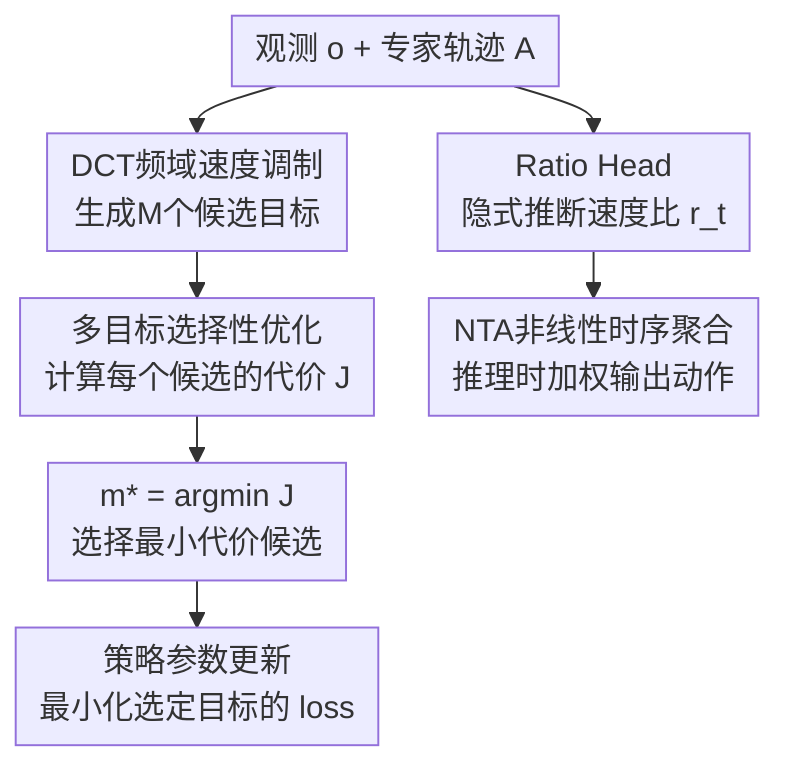

# AutoSpeed: Annotation-Free Stage-Adaptive Motion Speed Learning for Robot Manipulation

**会议**: ECCV 2026  
**arXiv**: [2607.01051](https://arxiv.org/abs/2607.01051)  
**代码**: [https://github.com/tinda24/autospeed](https://github.com/tinda24/autospeed)  
**领域**: 机器人 / 具身智能  
**关键词**: 模仿学习, 运动速度自适应, 机器人操作, 视觉运动策略, 阶段感知

## 一句话总结
AutoSpeed 提出一种模型无关的训练框架，在不需要阶段或速度标注的情况下，通过将不同速度下的未来轨迹作为候选优化目标、用复合代价函数（预测误差 vs 预测时域）选择最优候选，让视觉运动策略端到端地学会在简单阶段加速执行、在精细阶段减速执行，在多个仿真和真实机器人任务上同时提升成功率和执行效率。

## 研究背景与动机
基于模仿学习的视觉运动策略（如 ACT、Diffusion Policy、VLA 模型）通常直接模仿专家演示中的运动速度，并使用固定长度的动作分块（action chunking）预测未来动作。然而，专家演示的速度往往并非最优——演示者可能全程以保守速度操作，这限制了策略部署时的任务执行效率，在工业场景中尤其突出。

现有痛点在于：操作任务的不同阶段天然具有不同的难度——自由空间中的接近、粗定位等简单阶段可以快速执行且允许较长的预测时域，而插入、抓取等精细接触阶段需要更紧密的感知-动作耦合，适合更短的预测时域和更慢的执行速度。这一规律与人类运动控制中"速度-精度权衡"的发现高度一致。但现有方法对所有阶段一视同仁，用一个全局固定的执行速度和预测时域，既浪费了简单阶段的加速潜力，又在复杂阶段面临精度不足的风险。

核心矛盾由此产生：阶段自适应的速度调整是合理的，但现有方案要么依赖 VLM/LLM 的阶段标注（ESPADA），要么需要额外训练代理策略来估计动作熵以识别可加速区（DemoSpeedUp）——这些方法的标注成本高、质量难以保证，且标注过程与策略训练解耦，无法端到端优化。

本文的切入角度是：将阶段自适应速度学习形式化为一个无需外部标注的多目标选择性优化问题——通过 DCT 频域变换生成多个速度候选的监督目标，让策略在训练过程中自行判断每个阶段适合什么速度。核心 idea 是：用复合代价函数 $J = \mathcal{E} / (w + \log h)$ 同时衡量预测误差和预测时域，在多个候选速度中自动选出"预测得准且尽可能快"的那个，策略朝着最小代价目标优化，从而端到端地隐式学会阶段感知的运动速度。

## 方法详解

### 整体框架
AutoSpeed 要解决的核心问题是：给定一段专家演示轨迹，如何在没有任何阶段/速度标注的情况下，让策略学会在每个时间步自动判断"当前阶段可以加速到多快"。它的做法是将训练形式化为代价感知的多目标选择性优化：对每个时刻的专家动作片段，用 DCT 频域变换生成 $M$ 个不同速度下的候选目标轨迹，策略对每个候选计算预测误差，套入复合代价函数 $J$（分子是预测 MSE，分母是速度加权的自适应归一化项），选出代价最小的候选作为该步的优化目标。与此同时，一个轻量级 Ratio Head 从观测特征中预测当前阶段的速度比 $r_t$，供推理时使用。推理阶段通过非线性时序聚合（NTA）将不同速度的预测片段加权融合，输出平滑的最终动作。

### 关键设计

**1. 多目标选择性优化：无需标注，让代价函数自己"投票"选最优速度**

这是 AutoSpeed 的核心训练机制。在每个时间步 $t$，针对专家动作片段 $A_t \in \mathbb{R}^{H \times D}$，通过 DCT 频域速度调制生成 $M$ 个不同速度比下的候选目标 $\{A_t^{(m)}\}_{m=1}^M$（例如速度比从 0.8 到 2.2，步长 0.2）。每个候选对应不同的有效预测时域 $h_t^{(m)} = H \cdot r_t^{(m)}$：加速意味着 $r_t > 1$ 时用同样的 $H$ 个动作覆盖更长的未来时间，减速则反之。

关键在于如何选择最优候选。AutoSpeed 定义了一个复合代价函数：

$$J(A_t^{(m)}) = \frac{\mathcal{E}^{(m)}_t}{w + \log(h_t^{(m)})}$$

其中 $\mathcal{E}^{(m)}_t$ 是策略对候选 $m$ 的预测均方误差（非生成式模型直接算预测动作与候选的 MSE；扩散模型算预测噪声的 MSE；flow-matching 模型算预测速度场的 MSE），$w$ 是控制运动风格的长度惩罚系数（$w$ 越小策略越激进、倾向高速）。分母 $w + \log h_t^{(m)}$ 起到自适应归一化的作用：预测时域越短，分母越小、代价越大，迫使模型在能预测准的前提下尽量选高速。

每步选择代价最小的候选 $m^\star = \arg\min_m J(A_t^{(m)})$，策略仅对该候选计算 loss 并反向传播。直观上，简单阶段未来动作容易预测，即使加速到 $2\times$ 速度 MSE 仍然很低，$\mathcal{E}$ 小、$h$ 大 → $J$ 极小，模型自然选中高速候选；精细阶段长时域预测误差急剧增大，$\mathcal{E}$ 的增幅超过分母增幅 → $J$ 变大，模型被迫选中低速候选。整个过程无需任何标注——代价函数就是"裁判"。

**2. DCT 频域运动速度变换：实现非整数倍速缩放并保留高频动作细节**

速度调制的技术难点在于：简单的时间域降采样（每隔 $k$ 帧取一帧）只能做整数倍加速，无法实现平滑的非整数缩放，且直接丢弃中间帧会损失精细操作所需的高频动作信息。AutoSpeed 将动作序列沿时间轴做离散余弦变换（DCT-II），在频域完成时间轴重采样后逆变换回时域：

$$\mathbf{C} = \text{DCT}(A) \in \mathbb{R}^{H_0 \times D}$$

$$\tilde{A} = \mathbf{B}(r) \mathbf{C}, \quad \mathbf{B}(r)_{i,k} = \sqrt{\frac{2}{H_0}} \alpha_k \cos\left(\frac{\pi k (t_i + 0.5)}{H_0}\right)$$

其中 $t_i = i \cdot r$ 是重采样时间点，$\alpha_0 = 1/\sqrt{2}$，$\alpha_k = 1\ (k \ge 1)$。$H_0$ 是原始动作采样数（应大于 $H \cdot r_{\max}$ 以保证覆盖），$r$ 是目标速度比。因为 DCT 将能量集中在少数低频系数上，拉伸/压缩基函数等价于对动作轨迹做平滑的重采样，既支持非整数倍速（如 $1.3\times$、$0.7\times$），又保留了高频细节（精细操作的动作抖动、微小力控调整等）。这个设计是 AutoSpeed 能在插入、抓取等接触密集任务中不掉精度的关键技术原因。

**3. Ratio Head：从观测中隐式推断阶段信号，连接训练和推理**

仅有训练时的选择性优化还不够——推理时每一步也需要知道该用什么速度。AutoSpeed 引入一个轻量级的 Ratio Head，它是一个小型网络（通常几层 MLP），以策略骨干网络输出的观测隐层特征 $z$ 为输入，预测当前阶段的速度比 $\hat{r}_t$。训练时，Ratio Head 的监督信号就是多目标选择优化中每一步选出的最优速度比 $r^{(m^\star)}$，用 MSE 回归训练。

这个设计巧妙之处在于：Ratio Head 不需要显式的阶段标注，它的监督信号完全来自代价函数在训练中"自然涌现"的选择结果。随着训练推进，代价函数的选择越来越稳定，Ratio Head 学到的速度比曲线也就越来越与任务阶段对齐（如抓取时速度降到谷底、搬运时升至峰值）。推理时直接使用 Ratio Head 的预测值作为当前步的速度比，驱动策略输出匹配速度的动作序列。

**4. 非线性时序聚合 (NTA)：在变速度预测下实现平滑推理**

传统的时序聚合（temporal ensembling）假设所有动作分块在均匀时间网格上对齐，因此可以直接对不同历史步预测的同一时刻动作做指数衰减加权平均。但在 AutoSpeed 中，每个分块的速度比不同，导致不同历史步预测的动作在时间轴上不再对齐——同一个"未来第 3 步"在两个不同速度的分块中对应不同的实际时间点。

NTA 的解决方案是：在推理的每个控制步 $s$，收集所有历史预测中落入当前时间窗口 $[-i, +i]$ 的动作候选，对每个候选按其推理步的远近施加指数衰减权重 $w_q = \exp(-m(s-q))$，并对候选动作的时间偏移通过频域变换做微调对齐，最后加权平均得到最终动作。NTA 让 AutoSpeed 在变速度执行时仍能享受时序聚合带来的平滑性和响应性收益，是真机部署中执行时间缩短 1.78 倍且不掉成功率的关键推理组件。

### 一个完整示例

以 ALOHA Transfer Cube 任务中的一个典型时刻为例说明整个流程。假设当前观测到手爪距离方块还有一段自由空间距离（简单阶段），速度候选集为 $\{1.0, 1.2, 1.4, 1.6, 1.8, 2.0\}$（步长 0.2），$H=32$，$w=1.3$。

1. DCT 调制：对专家动作片段 $A_t$（32 步）分别做 $r \in \{1.0, \dots, 2.0\}$ 的 DCT 频域缩放，得到 6 个候选目标。$r=1.0$ 时有效时域 $h=32$ 步，$r=2.0$ 时 $h=64$ 步（覆盖两倍未来时间）。
2. 代价计算：策略对每个候选预测动作并算 MSE。在自由空间阶段，动作变化平缓、可预测性高，即使 $r=2.0$ 的 MSE 也只有 0.012，而 $r=1.0$ 的 MSE 为 0.008。代入 $J$：$J_{1.0} = 0.008 / (1.3 + \log 32) \approx 0.008 / 4.77 \approx 0.00168$；$J_{2.0} = 0.012 / (1.3 + \log 64) \approx 0.012 / 5.46 \approx 0.00220$。仔细看，$J_{1.0} < J_{2.0}$ ——等下，这意味着模型会选 1.0 而不是 2.0？不，这里需要看实际训练中的 MSE 差异。在实际训练中，简单阶段的加速候选 MSE 上升很慢（因为动作低频、可预测），例如 $r=2.0$ 时 MSE 只从 0.008 升到 0.010，此时 $J_{2.0} = 0.010 / 5.46 \approx 0.00183$ 仍可能高于 $0.00168$。实际上真正的选择取决于训练动态——在模型尚未学好时 MSE 普遍较高，速度选择更多由分母（时域惩罚）驱动；随着训练收敛，简单阶段的 MSE 低到足以让高速候选胜出。
3. 训练信号：假设当前步 $J_{1.4}$ 最小，则策略只对 $r=1.4$ 的候选计算 loss 并更新参数，Ratio Head 也被监督为预测 1.4。
4. 推理时：Ratio Head 预测 $r=1.6$（接近且偏快），策略输出 32 步动作覆盖 $32 \times 1.6 \approx 51$ 步等效时域，NTA 将这段动作与之前预测的重叠部分加权融合，最终以 1.6 倍速执行自由空间接近阶段。当手爪到达物体附近进入接触阶段时，Ratio Head 的预测自动降到 $r \approx 0.9$，实现减速。

### 损失函数 / 训练策略

基础损失与底层策略一致（ACT 用 MSE，扩散模型用噪声预测 MSE，flow-matching 用速度场 MSE），区别在于只在选出的最优候选 $m^\star$ 上计算。Ratio Head 额外有一个回归损失 $\|\hat{r}_t - r^{(m^\star)}\|_2^2$。

对生成式模型（扩散/flow-matching），AutoSpeed 提出三段式训练策略：第一阶段平均所有候选的 loss 让模型优先学低频、通用的结构；第二阶段切换为标准的多目标选择性优化；第三阶段冻结 Ratio Head，直接用其预测的速度比构造目标，让去噪/流匹配过程向选定模式快速收敛。这个策略提升了训练稳定性并减少了额外的计算开销（生成式模型需对每个候选独立加噪/去噪，三段式第一阶段和第三阶段避免了完整的多候选前向）。

推理时超参：$w$ 控制速度激进程度（默认 1.2-2.0），速度范围控制加速/减速边界（仿真 $[0.8, 2.0]$、真机 $[0.8, 2.2]$），NTA 中衰减系数 $m$ 和窗口大小 $i$ 控制时序聚合的平滑性。

## 实验关键数据

### 主实验

**ALOHA 单任务仿真**（Table 1）：在 Transfer Cube 上，AutoSpeed+高增益控制器将成功率从 72% 提升到 78%，同时将平均 episode 长度从 272 步压缩到 165 步（1.65 倍加速）。在接触密集的 Insertion 任务上，成功率和执行效率同时改善（22% → 24%，353 → 296 步）。

| 方法 | Transfer Cube SR(%) | Transfer Cube Len | Insertion SR(%) | Insertion Len |
|------|---------------------|-------------------|-----------------|---------------|
| ACT | 72 | 272 | 22 | 353 |
| ACT (AutoSpeed) | 64 | 160 | 24 | 300 |
| ACT (AutoSpeed + 高增益) | 78 | 165 | 24 | 296 |

**多任务仿真**（Table 2）：在 LIBERO-10 上，BAKU-Flow (AutoSpeed) 成功率达 52%，episode 长度从 287 压缩到 171（约 40% 加速）。在 Meta-World 50 任务上，BAKU-DiT (AutoSpeed) 从 43% 提升到 62%（+19 个百分点），BAKU-Flow (AutoSpeed) 以 65% 取得最高成功率，同时 episode 长度从 82 降到 71。

| 方法 | LIBERO-10 SR(%) | LIBERO-10 Len | Meta-World SR(%) | Meta-World Len |
|------|-----------------|---------------|------------------|----------------|
| BAKU-DiT | 50 | 261 | 43 | 87 |
| BAKU-Flow | 47 | 287 | 57 | 82 |
| BAKU-DiT (AutoSpeed) | 49 | 259 | 62 | 70 |
| BAKU-Flow (AutoSpeed) | 52 | 171 | 65 | 71 |

**真机实验**（Table 3）：4 个桌面操作任务（Transfer the Banana、Place the Toy、Stacking Two Cubes、Store Block in Drawer）上，BAKU-Flow (AutoSpeed)+NTA 相比 BAKU-Flow+TA 平均加速约 1.78 倍，同时每个任务的成功率均有绝对提升（Place the Toy 从 33% 到 43%，涨 10%）。

| 方法 | Banana SR(%) | Banana Time(s) | Toy SR(%) | Toy Time(s) | Stack SR(%) | Stack Time(s) | Drawer SR(%) | Drawer Time(s) |
|------|-------------|-----------------|-----------|--------------|-------------|----------------|--------------|----------------|
| BAKU-Flow+TA | 77 | 20.80 | 33 | 18.13 | 60 | 50.11 | 77 | 38.67 |
| BAKU-Flow (AutoSpeed)+NTA | 83 | 11.24 | 43 | 10.13 | 63 | 28.52 | 80 | 23.01 |

### 消融实验

**速度范围消融**：在 ALOHA Transfer Cube 上测试三组速度范围——[1x, 2x] 保守、[1x, 4x] 中等、[2x, 4x] 激进。三组都学习到一致的阶段感知速度模式（接触阶段自动减速形成谷底），且都优于 baseline。保守范围 [1x, 2x] 取得最高成功率 76%（baseline 64%），激进范围 [2x, 4x] 将 episode 长度压到 145 步（baseline 304 步），同时成功率仍保持 70%。速度范围的上下界决定成功率-效率的权衡区间，但阶段感知模式是鲁棒涌现的。

**$w$ 敏感度**：$w$ 越小，短时域候选的代价惩罚越重，策略越倾向选高速。不同 $w$ 下策略都保持阶段感知的加减速模式，仅改变整体速度曲线的基线高度。$w$ 可作为一个实用的"运动风格"调节旋钮。

**动作过采样的作用**：真机数据以 2 倍过采样采集时，AutoSpeed 的平均执行时间为 18.23s（SR 67.25%），较 1 倍采样的 19.41s（SR 65.50%）进一步改善，且均优于 baseline（31.93s, 61.75%）。过采样为 DCT 减速时提供更精细的动作参考，是可选的精度增强手段。

### 关键发现
- AutoSpeed 成功率和执行效率的提升是同时发生的，而非互相妥协——原因在于它通过阶段感知把"加速"和"保精度"分配到了不同的任务阶段，而非全局一刀切。
- Ratio Head 推断的速度比曲线与任务阶段高度对齐（抓取/交接/对齐阶段自动形成速度谷底），验证了"阶段信号可以端到端隐式习得"的核心假设。
- AutoSpeed 的训练额外开销很小：对非生成式模型零额外计算；对生成式模型因并行去噪，训练时间仅增加约 10-20%（如 Meta-World DiT 从 7.2h 到 8.0h）。
- NTA 是真机部署的关键：去掉 NTA 直接用固定速度执行会导致动作不连续，成功率显著下降。

## 亮点与洞察
- **代价函数的设计极具巧思**：$J = \mathcal{E} / (w + \log h)$ 把速度选择的两个冲突目标（预测精度 vs 执行速度）统一到同一个标量中，让策略在没有任何标注的情况下自己学会"什么时候该快、什么时候该慢"。分母用 $\log h$ 而非 $h$ 本身，避免了长时域对代价的过度压制，使得加速和减速的决策梯度更加平衡。
- **DCT 频域缩放是"顺手但关键"的工程选择**：频域操作的天然优势是可以在不引入锯齿/跳变的情况下做任意实数倍的拉伸和压缩，这对于机器人操作中"2 倍加速还得保证抓取动作不变形"的需求是刚需。如果换成简单的时间域下采样，精细操作的失败率会大幅上升。
- **Ratio Head 将训练信号变成了可部署的策略**：多目标优化只在训练时生效，Ratio Head 把"学到的最优速度"蒸馏成一个可推理的轻量模块，这种"训练时搜索、推理时回归"的范式可以迁移到任何需要在训练中探索、推理中固定的超参选择场景。
- **NTA 解决了一个被忽视的工程问题**：变速度预测导致动作分块时间轴不对齐，看起来是细节，但在真机高频控制中是致命的。NTA 用指数衰减 + 频域微调的方案既优雅又实用。

## 局限与展望
- 速度范围和 $w$ 目前是人工设定的超参，虽然消融表明不同设置下模式稳定，但在极端任务（如动态避障）中仍需手动调参。作者提到未来可探索自适应的 $w$ 设计。
- 低于 1 倍速的减速在频域重采样时可能引入动作失真（附录 E 中提到），当前通过动作过采样缓解，但这是一个值得进一步解决的根本性问题。
- 论文主要验证在单臂和双臂桌面操作任务上，尚未在移动操作、四足运动、人形机器人全身控制等更复杂的动力系统中测试 DCT 频域调制的普适性。
- Ratio Head 的预测质量依赖策略骨干特征的表达能力，在极低数据量（如 10 条 demo）或极高随机性的任务中，隐式阶段信号可能不够可靠。
- 三段式训练策略的切换时机（何时从第一阶段进入第二阶段）目前依赖经验设定，自动化切换策略可作为后续工作。

## 相关工作与启发
- **vs DemoSpeedUp**: DemoSpeedUp 用代理策略的动作熵识别可加速区，需要额外训练代理策略且熵信号难以区分不确定性与多模态。AutoSpeed 无需代理策略，复合代价直接端到端优化，且附录 F 的实验显示 AutoSpeed 的速度比与动作熵在极值上对齐，但在机器人启动/回程等快速运动中 AutoSpeed 的识别更准确。
- **vs ESPADA**: ESPADA 依赖 VLM/LLM 的阶段标注来识别可加速区，标注成本高、质量不稳定。AutoSpeed 完全不需要任何标注，且加速/减速统一在同一框架中（ESPADA 只考虑加速）。
- **vs SAIL**: SAIL 在推理时做速度调度，不与策略训练联合优化。AutoSpeed 让速度感知直接融入策略训练，属于训练时涌现范式，效果更稳定。
- **vs MoH (Mixture of Horizons)**: MoH 混合多个预测时域但用固定的门控融合，本质仍是对演示速度的模仿。AutoSpeed 主动拉偏速度生成候选、用代价驱动选择，是一种"超越演示"的视角，不再假设演示速度是最优的。

## 评分
- 新颖性: 五星。首次提出在模仿学习训练中端到端隐式学习阶段自适应运动速度，无需任何标注，多目标选择性优化的 formulation 简洁而巧妙。
- 实验充分度: 四星半。覆盖 62 个仿真任务 + 4 个真机任务，跨非生成式和生成式（扩散/flow）三类策略架构，消融分析了速度范围和 $w$，附录还有失败模式分析和动作熵对比。真机实验规模可更大（每个任务 20 次试运行略少）。
- 写作质量: 四星。结构清晰、公式规范、图表与正文对应好。三段式训练策略和 NTA 的细节放在附录而非主线中稍微增加了理解跳跃。
- 价值: 五星。解决了机器人操作中一个真实且普遍的问题（演示速度次优），框架模型无关、标注零成本、即插即用，对所有使用模仿学习的机器人任务都有直接实用价值。在工业部署中缩短节拍时间的意义尤其大。

<!-- RELATED:START -->

## 相关论文

- [\[ICLR 2026\] SARM: Stage-Aware Reward Modeling for Long Horizon Robot Manipulation](../../ICLR2026/robotics/sarm_stage-aware_reward_modeling_for_long_horizon_robot_manipulation.md)
- [\[ICCV 2025\] Moto: Latent Motion Token as the Bridging Language for Learning Robot Manipulation from Videos](../../ICCV2025/robotics/moto_latent_motion_token_as_the_bridging_language_for_learning_robot_manipulatio.md)
- [\[ECCV 2026\] VLA Knows Its Limits: Adaptive Execution Horizons for Robot Policies](vla_knows_its_limits_adaptive_execution_horizons_for_robot_policies.md)
- [\[ICLR 2026\] From Language to Locomotion: Retargeting-free Humanoid Control via Motion Latent Guidance](../../ICLR2026/robotics/from_language_to_locomotion_retargeting-free_humanoid_control_via_motion_latent_.md)
- [\[CVPR 2026\] CoMo: Learning Continuous Latent Motion from Internet Videos for Scalable Robot Learning](../../CVPR2026/robotics/como_learning_continuous_latent_motion_from_internet_videos_for_scalable_robot_l.md)

<!-- RELATED:END -->
