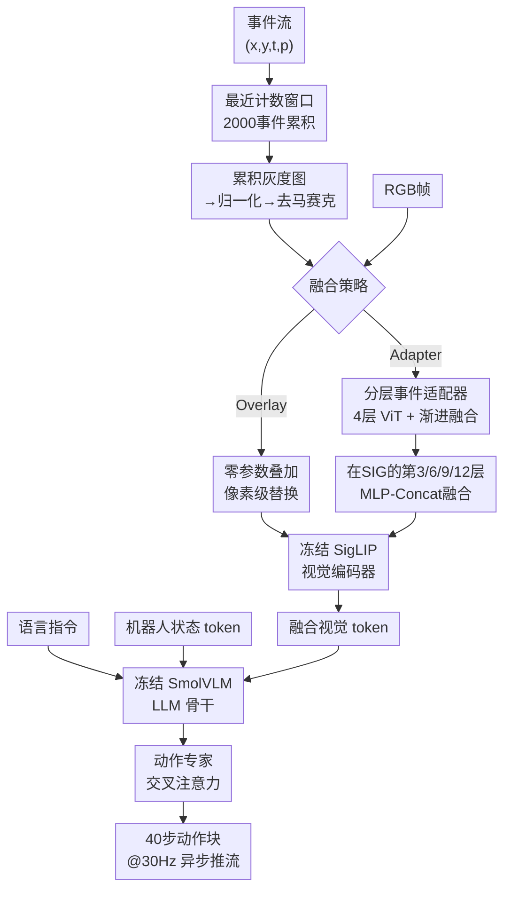

# E-VLA: Event-Augmented Vision-Language-Action Model for Dark and Blurred Scenes

**会议**: ECCV 2026  
**arXiv**: [2604.04834](https://arxiv.org/abs/2604.04834)  
**代码**: 待公开  
**领域**: robotics  
**关键词**: 事件相机, VLA模型, 低光照操作, 运动模糊鲁棒性, 事件计数窗口, 多模态融合  

## 一句话总结

E-VLA 将事件相机流通过最近计数窗口转化为类帧累积表示，再以零参数叠加或 13M 分层适配器两种轻量方式融入 SmolVLA 视觉编码管线，使机器人在 20 lux 极低照度下 Pick-Place 成功率从 0% 跃升至 90%，在 1000 ms 严重运动模糊下从 0% 恢复至 25%，并在 OOD 泛化测试中仅靠 200 lux 训练数据即在 20 lux 保持 45%。

## 研究背景与动机

Vision-Language-Action (VLA) 模型通过将帧式 RGB 视觉编码器与语言条件策略学习相结合，在开放式操作任务上展现了惊人能力。RT-2、OpenVLA、SmolVLA 等代表系统的共同路径是：在大规模多模态数据上预训练，再在机器人交互数据上微调。然而，这些模型的感知全部依赖于同一个物理过程——帧式相机在曝光窗口内积分光子的总量。在实验室明亮环境中这不成问题，但真实部署中光照骤降会使信号噪声比急剧恶化；提高曝光时间补偿亮度则必然引入运动模糊和额外延迟；极端情况下相机输出完全黑饱和（black clipping），信息彻底丢失。更根本的是，图像增强和数据增强只能在已退化的信号上操作——如果采集时刻信息已不可逆地丢失，后期处理无法凭空恢复。

事件相机（event camera）提供了截然不同的成像原理：异步检测逐像素的亮度变化而非全局曝光，具备微秒级时间分辨率和超过 120 dB 的动态范围。这意味着事件相机天然抗运动模糊，并在极低光照下仍能稳定捕捉场景中的边缘和运动结构。然而，将事件感知塞进当代 VLA 并非简单替换传感器——事件流稀疏、分布非均匀，与 VLA 模型依赖的密集规整 RGB 预训练分布严重不匹配；并且，腕装事件相机随机械臂运动而移动，事件触发率在接近、抓取、放置等不同阶段剧烈波动，导致时间分布极不稳定。因此，核心挑战是设计一种既兼容预训练分布、又能在操作动态下保持稳定的表示转换与融合机制。**本文的核心 idea 是：以事件计数而非固定时长定义窗口，将事件流累积为类帧表示，再通过零参数像素级叠加或含分层融合模块的轻量适配器，在不改变预训练 token 分布的前提下将事件结构线索融入 VLA 视觉编码管线。**

## 方法详解

### 整体框架

E-VLA 以 SmolVLA 为基线骨架。DAVIS346 事件相机同时输出异步事件流（$(x,y,t,p)$，微秒级时间戳）和 RGB 帧（30 FPS），两者空间上天然对准。事件流首先通过"最近计数窗口"选取最新的 N=2000 个事件，按像素位置累加为极性无关的灰度图，再经归一化和去马赛克得到类帧三通道表示 $E$。该事件帧随即可选入两种融合路径之一：(1) Overlay——将事件按空间位置直接叠加到 RGB 像素上（有事件处替换为极性映射颜色），零参数量，送入 SigLIP 编码；(2) 分层事件适配器——事件帧通入轻量 4 层 ViT（隐藏维 384 + 权重共享 patch embedding），在 SigLIP 编码器的第 3/6/9/12 层逐层通过 $\text{MLP}(\text{Concat}(\cdot))$ 与图像特征渐进融合。融合后的视觉 token 与语言指令 token、机器人状态 token 拼接，送入冻结的 SmolVLM LLM 骨干，最后由动作专家通过交叉注意力解码出 40 步的动作块（30 Hz 异步推流执行）。

### 关键设计

**1. 最近计数窗口：为 VLA 操作动态量身定制的事件表示转换**

E-VLA 的关键前提是把稀疏异步的事件流变成类帧结构才能被 ViT 编码器消费。最简单的策略是固定时长窗口（如每 20 ms 取一批事件），但在机器人操作场景中这犯了根本性错误：腕装相机随机械臂运动，接近物体时运动慢、事件少，抓取后移动时运动快、事件爆发。固定时长导致低速时窗口内事件稀疏（感知失效），高速时事件堆积产生类运动模糊的伪影。E-VLA 的核心洞察是用事件计数来替代时间定义窗口——每次截取按时间排序的最新 N 个事件。低速时窗口自然拉伸以收集足够事件，高速时自动收缩避免过冲。给定当前帧曝光结束时间 $t_e$，窗口定义为 $\mathcal{W}_I = \{e_k\}_{k=|\mathcal{E}_{t_e}|-N+1}^{|\mathcal{E}_{t_e}|}$，其中 $\mathcal{E}_{t_e} = \{e_i \mid t_i \leq t_e\}$。实验表明 2000 事件窗口在全照度范围（20-75 lux）保持 90-100% 的稳定成功率，远超最佳固定时长窗口（20 ms 在低光端掉至 45%）。

**2. 零参数 Overlay 叠加融合：最简单的往往最有效**

由于 DAVIS 相机的事件和 RGB 天然空间对准，一个极简的融合方案呼之欲出：直接把事件的位置和极性信息叠加到 RGB 像素上——有事件的像素替换为极性映射的颜色，无事件的保留原 RGB 值。这引入零额外参数和几乎零 FLOPs，纯粹即插即用。令人惊讶的是，这个暴力方案在几乎所有低光照条件下超越了精心设计的图像增强方法（RetinexNet、Retinexformer、EvLight、E2VID）：20 lux 下从图像基线的 0% 拉到 60%，1000 ms 运动模糊下从 0% 拉到 20-25%。背后的原因是，VLA 模型真正需要的是物体大致在哪里的空间结构线索，而非漂亮的伪图像——事件提供的高频边缘在 RGB 完全退化时恰好是够用的。尤其是在黑饱和场景，事件的信号是唯一还能提供空间信息的渠道。然而，叠加方案在 20 lux 下仅 60%，说明零参数的上限受限于对事件信息的不充分利用。

**3. 分层事件适配器：渐进式跨模态特征交互**

Overlay 只有像素级单向替换，无法在深层特征空间对事件和 RGB 做双向交互。E-VLA 进一步设计了一个分层事件适配器：一个紧凑的 4 层 ViT（隐藏维 384，参数量仅 13.3M，不到总模型的 3%）独立编码事件帧，然后在 SigLIP 视觉编码器的第 3/6/9/12 层，通过 MLP(Concat) 逐级将事件特征注入图像特征。公式上，设 $\mathcal{G}_l$ 为适配器第 $l$ 层、$\mathcal{F}_l$ 为 SigLIP 第 $l$ 组层，融合过程为 $E^{(l+1)} = \mathcal{G}_{l+1}(E^{(l)})$, $F^{(l+1)} = \mathcal{F}_{l+1}(\text{Fuse}(F^{(l)}, E^{(l)}))$，其中 $\text{Fuse}$ 为 MLP(Concat)。这个设计有三层精妙之处：一是轻量适配器配合冻结的庞大编码器，避免了从零大规模事件预训练的需要；二是渐进融合让事件特征在不同粒度逐级与图像特征交互，而非一次性合并破坏分布；三是权重共享的 patch embedding 保证了事件帧和 RGB 帧的底层映射一致，减少了跨模态融合的收敛难度。结果上，事件适配器在 20 lux 下达到 90%（vs Overlay 的 60%），在 2 lux 的极端条件仍有 35%——此时 RGB 早已完全黑饱和。在 OOD 泛化测试中（仅用 200 lux 训练），适配器在 20 lux 仍保持 45%，大幅领先图像基线的 0%。

### 训练策略

训练分三个阶段。Action stage（20k iter, lr=2e-4）：冻结 VLM 骨干，只训练动作专家和投射层，让模型适应部署环境。Event stage（10k iter, lr=5e-4）：从零训练事件适配器和融合模块，冻结其余组件。Joint stage（10k iter, lr=1e-4）：联合微调适配器、融合模块、动作专家和投射层。关键技巧是对图像分支施加 50% 的随机 dropout——迫使模型在训练时主动依赖事件信号而不是当图像可用时就走捷径。消融显示 0% dropout 时模型在中低光照下降约 14 个百分点，80% dropout 则在正常光照下性能受损。

## 实验关键数据

### 主实验

**低光照操作（Pick-Place，成功率 %）**

| 方法 | 75 lux | 40 lux | 35 lux | 30 lux | 25 lux | 20 lux | 平均 |
|------|--------|--------|--------|--------|--------|--------|------|
| 图像基线 | 100 | 80 | 70 | 35 | 0 | 0 | 47.5 |
| +RetinexNet | 100 | 100 | 85 | 80 | 25 | 10 | 66.7 |
| +Retinexformer | 100 | 80 | 80 | 75 | 20 | 10 | 60.8 |
| +EvLight | 100 | 95 | 95 | 75 | 45 | 10 | 70.0 |
| +E2VID（重建） | 80 | 60 | 55 | 10 | 5 | 5 | 35.8 |
| Overlay | 100 | 100 | 85 | 75 | 65 | 60 | 80.8 |
| 事件适配器 | 100 | 100 | 95 | 90 | 90 | 90 | 94.2 |

**运动模糊（1000 ms 曝光，成功率 %）**

| 方法 | Pick-Place | Sorting |
|------|-----------|---------|
| 图像基线 | 0 | 5 |
| Overlay | 20 | 32.5 |
| 事件适配器 | 25 | 32.5 |

**OOD 泛化（仅 200 lux 训练，Pick-Place 平均 %）**

| 方法 | 平均 |
|------|------|
| 图像基线 | 39.0 |
| +Retinexformer | 46.0 |
| +EvLight | 40.5 |
| Overlay | 54.0 |
| 事件适配器 | 75.0 |

### 消融实验

| 配置 | Pick-Place 平均 % | 说明 |
|------|------------------|------|
| 完整模型（2000 事件 + 适配器） | 94.2 | 最优 |
| 仅 Overlay 融合 | 80.8 | 零参数，已超所有增强基线 |
| 500 事件窗口 | 67.5 | 事件过少，感知信息不足 |
| 4000 事件窗口 | 85.8 | 事件过多，引入陈旧信息噪声 |
| 5 ms 固定时长窗口 | 60.8 | 低速事件稀疏致感知失效 |
| 20 ms 固定时长窗口 | 82.5 | 最优定长但仍不及计数窗口 |
| 无图像 dropout（~估计） | ≈80 | 模型走 RGB 捷径，低光照下降 |
| Action→Joint（无事件阶段） | 75.0 | 跳过事件训练致特征未充分学习 |
| Action→Event→Joint（无共享权重） | 80.0 | 共享 patch embedding 额外贡献 ~10% |

### 关键发现

- **模块贡献排序**：事件适配器（+46.7 百分点 > 基线）> Overlay（+33.3）> EvLight（+22.5）> RetinexNet（+19.2）> E2VID（-11.7，不如基线）。适配器相对 Overlay 的 13.4 百分点优势主要来自极低光照段（20 lux: +30）
- **计数窗口是根本性设计选择**：替换为 20 ms 固定时长后平均从 94.2% 降至 82.5%，说明窗口策略比融合策略更基础——信号质量比融合精细度更重要
- **事件对颜色不敏感是物理天花板**：Sorting 在 20 lux 下事件适配器仅 70%（vs Pick-Place 的 90%），因为事件累积表示丢弃了极性方向信息，无法可靠区分绝对色彩
- **跨骨干通用性**：在 pi0.5 骨干上事件适配器从 55.8% 提升到 95.0%，说明方法不绑定 SmolVLA
- **数据增强不足以弥合**：激进增强（亮度降低+方向性模糊）仅从 47.9% 微升至 51.7%，验证感知层退化无法通过后期增强弥补
- **极低光照边界**：事件适配器在 4 lux 下仍有 80%，到 2 lux 才降至 35%，此时事件传感器噪声开始主导

## 亮点与洞察

- **轻量级事件融合的设计哲学**：不重建图像、不增加视觉 token 数量、不改变预训练分布。Overlay 零参数、适配器仅 13M——这种最小侵入设计使 E-VLA 可即插即用到任意 ViT-based VLA 骨干，降低了事件 VLA 的入门门槛
- **黑饱和下的"还魂"能力**：25 lux 起图像基线完全崩溃（0%），事件适配器仍保持 90%。这个对比最直观地说明帧式相机的盲区恰是事件相机的舒适区，两者在感知维度上形成理想互补
- **图像 dropout 的平衡艺术**：训练时随机丢弃一半图像迫使模型学会在无 RGB 信息时仍能只用事件线索操作——50% 这个平衡点本身就是有价值的训练策略发现
- **边缘结构线索 > 重建图像**：E2VID 将事件重建为 RGB 再输入，效果反而低于图像基线（平均 35.8% vs 47.5%）。而直接利用事件的边缘结构线索却能大幅提升——说明 VLA 在退化条件下需要的是空间结构信息，而非美观的伪图像

## 局限与展望

- **事件对颜色不敏感**：事件累积表示丢弃了极性方向信息，无法可靠区分物体颜色。Sorting 任务比 Pick-Place 低约 20 百分点。可能的改进方向包括专用的色彩去马赛克方法（Color4e）或结合 RGB 残留信息做显式颜色恢复
- **腕装相机遮挡**：被操作物体天然遮挡腕装相机视野，Stacking 成功率在 20 lux 仅 40%。这个感知瓶颈在事件和 RGB 模式下都存在，属于通用限制。可通过改进安装位置或引入第三视角相机缓解
- **事件利用偏被动**：当前 E-VLA 主要响应机械臂运动触发的亮度变化，场景中静止但关键的物体（如目标杯）难以从事件中获得信号。引入主动照明调制或主动运动抖动来照亮静态区域可能是突破口
- **数据稀缺性**：仅 724 episodes、3 个任务、单平台（SO100 + DAVIS346），场景多样性有限。需要更大规模、多种场景的数据集验证泛化能力
- **OOD 泛化仍有差距**：事件适配器在 OOD 20 lux 下从 ID 的 90% 降至 45%，虽远优于基线（0%）但仍不够实用。更广泛的照度范围训练以及域适应策略可能进一步收窄差距

## 相关工作与启发

- **vs SmolVLA**：E-VLA 直接在 SmolVLA 上叠加事件融合模块，不改变骨干。证明了事件感知可以作为轻量插件无缝接入现有 VLA 框架，为后续事件 VLA 工作提供了基线设计
- **vs EvLight / RetinexNet / Retinexformer**：图像增强在信号已严重退化后无法恢复信息（20 lux 下最多 10%）。E-VLA 从采集端引入互补传感器，从根本上绕开了"修复天花板"
- **vs E2VID**：事件→图像重建在操作场景中表现最差（甚至低于图像基线）。原因是 VLA 中事件率随动作高度波动，重建质量极不稳定。E-VLA 放弃重建、直接利用事件作为结构线索是一个关键设计决策
- **vs 传统事件机器人系统**：大部分事件机器人工作（抓取、避障、滑移检测）采用模块化管线。E-VLA 首次将事件感知融入端到端通用 VLA 学习框架，保持了策略通用性和语言条件能力

## 评分

- 新颖性: ⭐⭐⭐⭐⭐ 首次将事件相机系统性地融入 VLA 框架，切入角度精准（感知瓶颈 vs 常见算法侧改进），开源的遥操作平台和数据集将持续推动领域发展
- 实验充分度: ⭐⭐⭐⭐⭐ 3 个任务 × 6 个照度等级 × 运动模糊 × OOD 泛化 × 窗口策略消融 × 训练策略消融 × 事件表示消融 × 跨骨干验证 × 极低光照边界实验——控制变量实验的深度在 VLA 论文中罕见
- 写作质量: ⭐⭐⭐⭐⭐ 动机逻辑清晰（帧式成像物理局限→事件互补优势→融合三大挑战），方法从最简单的 Overlay 逐步递进到适配器，实验层层深入，错误分析诚实
- 价值: ⭐⭐⭐⭐⭐ 为 VLA 的感知鲁棒性开辟了一条全新且有物理基础的技术路线；窗口策略、训练策略等设计洞察对整个事件 VLA 方向有普适指导意义

<!-- RELATED:START -->

## 相关论文

- [\[ICML 2026\] Dual-Stream Diffusion for World-Model Augmented Vision-Language-Action Model](../../ICML2026/robotics/dual-stream_diffusion_for_world-model_augmented_vision-language-action_model.md)
- [\[ECCV 2026\] Revisiting Parameter Redundancy in Vision-Language-Action Models: Insights from VLM-to-VLA Adaptation](revisiting_parameter_redundancy_in_vision-language-action_models_insights_from_v.md)
- [\[NeurIPS 2025\] Talk2Event: Grounded Understanding of Dynamic Scenes from Event Cameras](../../NeurIPS2025/robotics/talk2event_grounded_understanding_of_dynamic_scenes_from_event_cameras.md)
- [\[ECCV 2026\] PolicyTrim: Boosting Intrinsic Policy Efficiency of Vision-Language-Action Models](policytrim_boosting_intrinsic_policy_efficiency_of_vision-language-action_models.md)
- [\[ICLR 2026\] X-VLA: Soft-Prompted Transformer as Scalable Cross-Embodiment Vision-Language-Action Model](../../ICLR2026/robotics/x-vla_soft-prompted_transformer_as_scalable_cross-embodiment_vision-language-act.md)

<!-- RELATED:END -->
