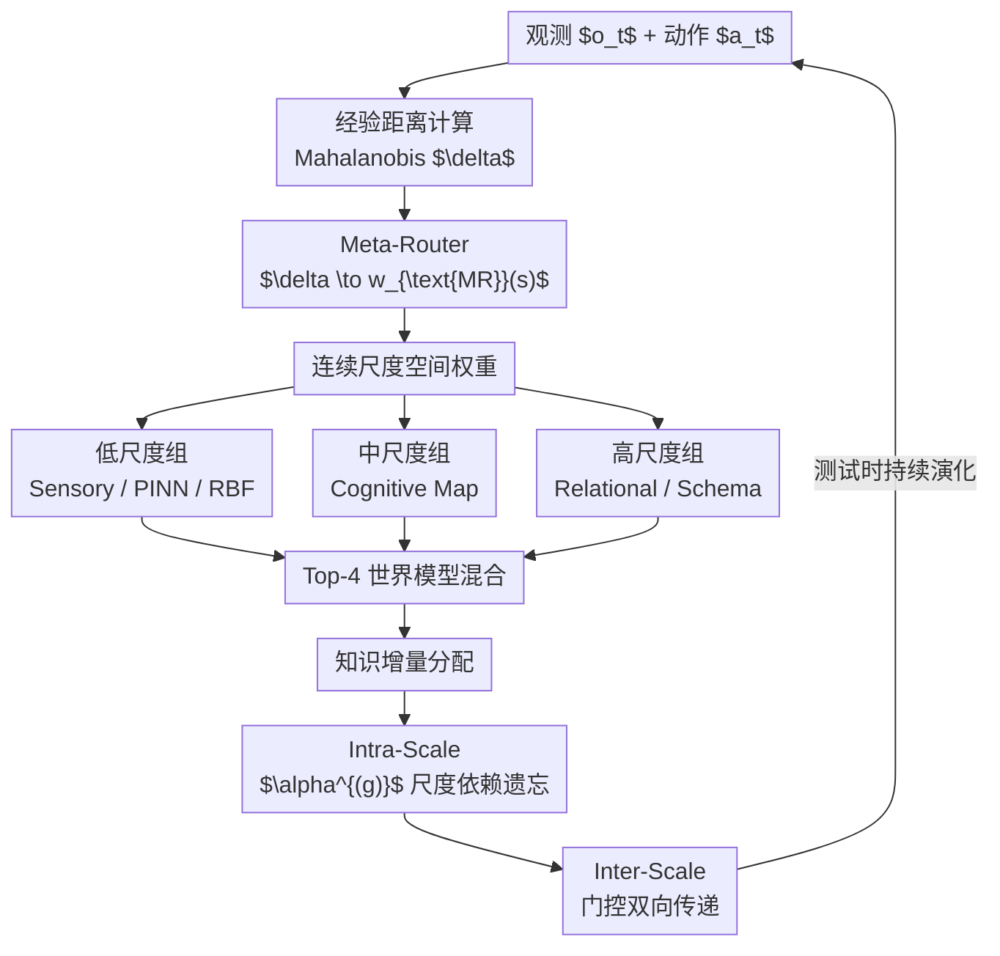

# MuSix: Multi-scale Mixture of World Models for Embodied Agents in Evolving Environments

**会议**: ECCV 2026  
**arXiv**: [2607.00457](https://arxiv.org/abs/2607.00457)  
**代码**: 无  
**领域**: 机器人 / 具身智能  
**关键词**: 世界模型, 专家混合, 具身智能, 尺度感知路由, 测试时适应  

## 一句话总结
提出 MuSix 框架，通过建构水平理论（CLT）启发的经验距离驱动两阶段尺度感知路由，显式解耦世界模型的"尺度确定"与"模型选择"；同时引入尺度依赖的遗忘率和门控跨尺度知识传递，让低层即时知识快速刷新、高层抽象知识持续稳定，实现具身智能体在动态环境中的多尺度自适应演化。

## 研究背景与动机

具身智能体在真实世界中需要同时处理多个尺度的推理任务：低层要感知物理交互细节（物体抓取、避障）、毫秒级响应局部动态变化，高层则要理解任务意图、规划长时序操作逻辑、在灾难场景中制定救援策略。现有基于视觉语言模型（VLM）的方法，如 SayCanPay、FLARE 等，通过将语言模型的推理能力与环境的 affordance 信号结合，在复杂指令跟随上取得了显著进展。但这类方法通常构建在固定的环境假设或单一的模型组件上——当环境条件发生变化时，要么整个系统需要重新训练，要么无法在合适粒度上做针对性的自适应调整，因为单个模型无法同时兼顾精细的局部预测和鲁棒的高层抽象。

专家混合（Mixture of Experts, MoE）架构为解决这一问题提供了自然的思路：其模块化的专家选择可以容纳性质不同的知识类型，而选择性的激活机制使系统能够只更新涉及的部分专家而不干扰其他组件，有效缓解灾难性遗忘。然而，将这些潜力转化为在动态环境中的持续适应能力，面临两个根本性的挑战。第一，标准的 MoE 路由操作缺乏显式的"尺度"概念——路由器的决策不绑定任何可识别的知识粒度，因此无法在测试时精确地只更新某个特定尺度的专家，导致了"路由混合挑战"。第二，不同尺度的知识老化速率截然不同：关于局部物理动力学的低层知识随着环境变化快速过时，而关于抽象规则的高层知识相对稳定。但传统 MoE 对所有专家使用统一的更新策略，无法尊重这种差异，导致了"演化挑战"。

本文的核心洞察是：这两个挑战的共同根源在于 MoE 缺乏一个显式的、可量化且与认知层次对应的"尺度轴"。作者借鉴认知科学中的建构水平理论（Construal Level Theory, CLT）——该理论认为心理距离决定了人类认知的抽象层级，近距离的事物触发具体、低层级的认知表征，远距离的事物触发抽象、高层级的表征——将这一原理操作化为"经验距离（experiential distance）"，用于量化当前情景相对于智能体累积经验的新颖程度。**核心 idea：提出 MuSix，将具身智能体的世界模型组织为多尺度分组，通过两阶段尺度感知路由（先由 Meta-Router 根据经验距离在连续尺度空间上确定权重，再由各尺度内 Base Router 选择世界模型）实现显式的尺度感知混合；同时引入尺度内依赖遗忘率（低层快速遗忘、高层缓慢遗忘）和门控跨尺度双向知识传递，让世界模型在测试时以各自合适的速度持续演化。**

## 方法详解

### 整体框架

MuSix 的核心思想是将世界模型按照知识粒度组织为多个尺度分组，并通过两阶段路由实现尺度感知的模型混合与持续演化。

框架的输入是当前观测 $o_t$ 与动作 $a_t$。首先，一个冻结的预训练编码器 $\phi$（CLIP-ViT）将观测映射到嵌入空间。经过多步累积的经验 $E_{<t}$ 被建模为多元高斯分布，当前观测的嵌入与经验分布之间的 Mahalanobis 距离即为经验距离 $\delta$。Meta-Router 接收 $\delta$ 并输出一个在连续尺度空间 $\mathcal{S}$ 上的权重函数 $w_{\text{MR}}(s)$。这些尺度权重与各预训练 Base Router $r(s)$ 的输出积分融合，得到最终的路由权重，用于从 $G=3$ 个世界模型分组（共 15 个模型）中选择 top-4 构成混合世界模型 $M$。

在推理过程中，混合世界模型对下一观测做出预测，预测误差产生知识增量 $\Delta K_{t+1}$。这一增量经 Meta-Router 分配到对应的尺度分组，各分组按尺度依赖的遗忘率 $\alpha^{(g)}$ 更新其知识状态（intra-scale adaptation），再通过门控双向传递与相邻尺度交换信息（inter-scale adaptation），完成一轮测试时演化。

### 关键设计

**1. 两阶段尺度感知路由：解耦尺度确定与模型选择**

标准 MoE 的问题在于路由器的输出是一个扁平的专家权重向量，无法让决策者知道"当前输入属于哪个尺度层级"。这使得测试时更新时无法精确瞄准要修改的专家——要么全量更新，要么全量不更新。MuSix 将路由显式分解为两个阶段。第一阶段由一个连续 Meta-Router $\text{MR} : \mathcal{O} \times \mathcal{O}^* \times \mathcal{S} \to \mathbb{R}$ 接收经验距离 $\delta$ 和当前观测 $o_t$，输出在尺度空间 $\mathcal{S}$ 上的权重函数 $w_{\text{MR}}(s)$。第二阶段，对于每个尺度 $s$，预训练的 Base Router $r(s) : \mathcal{O} \times \mathcal{A} \to \mathbb{R}^N$ 给出各世界模型在该尺度下的非归一化得分，最终路由器通过积分融合两者：

$$ \text{router} = \int_{\mathcal{S}} w_{\text{MR}}(s) \, r(s) \, ds $$

实践中通过 Monte Carlo 采样 16 个点来近似积分。这种解耦设计的巧妙之处在于：Meta-Router 的输出直接体现了"当前输入在哪个尺度上操作"，使得测试时可以精准定位到需要更新的尺度分组——只需将更新分配到 $w_{\text{MR}}$ 权重高的分组即可，而不会干扰其他尺度的世界模型。

**2. 经验距离与尺度感知损失：CLT 的操作化**

要让 Meta-Router 学会根据情景的"新颖程度"自动选择合适尺度的世界模型，首先需要定义一个可计算的度量。作者从建构水平理论出发，提出经验距离 $\delta$，定义为当前观测嵌入 $\phi(o_t)$ 与多步经验分布之间的 Mahalanobis 距离。经验分布通过对过去观测的嵌入施加指数衰减权重 $w_i = \exp(-\beta(t-i))$ 来建模，使得较近的观测对分布的贡献更大。当步数不足 $T_{\min}$ 时设 $\delta = +\infty$，表示在缺乏先验经验时所有情景均为新颖。

$$ \delta = \sqrt{(\phi(o_t) - \mu_E)^\top \Sigma_E^{-1} (\phi(o_t) - \mu_E)} $$

在此基础上，尺度感知损失 $\mathcal{L}_S$ 包含三项。第一项 $\mathcal{L}_S^{(1)} = (R_S \bar{\delta} - \|\mu_S\|)^2$ 将期望尺度的模长（即 Meta-Router 输出的尺度向量范数）显式地对齐到归一化经验距离——低 $\delta$（熟悉情景）对应低模长（低尺度），高 $\delta$（新颖情景）对应高模长（高尺度）。第二项 $\mathcal{L}_S^{(2)} = \lambda_1 \text{tr}(\Sigma_S)$ 鼓励尺度分布集中，防止权重在整个尺度空间上弥散。第三项 $\mathcal{L}_S^{(3)} = \lambda_2 Z^2$ 抑制 Meta-Router 输出发散。整个训练损失为 $\mathcal{L} = \mathcal{L}_{\text{TF}} + \lambda_S \mathcal{L}_S$，其中 $\mathcal{L}_{\text{TF}}$ 是标准的世界模型教师强制预测损失。

实验中对分析非常有洞察力的一点是：虽然尺度感知损失只监督了 $\|\mu_S\|$（尺度向量模长的均值），但作者发现 3D 尺度空间中的各轴对不同类型的输入产生了特异性响应——有的轴应对视觉新颖性，有的应对任务复杂性——呈现出无监督的特化现象。这解释了为什么 3D 尺度空间一致优于 1D 和 2D 空间。

**3. 尺度内/间知识适应：各尺度以各自节奏演化**

即使有了正确的尺度感知路由，测试时如何让世界模型持续适应环境变化仍是个难题。低层动力学知识可能每几步就过时了，而高层策略知识可以持续数十步。MoE 的统一更新策略在这里失效了——以快节奏更新所有专家会破坏稳定的高层知识，以慢节奏更新则无法跟上低层变化。

MuSix 的解决方案有两个互补部分。在 intra-scale 层面，每个分组 $g$ 以尺度依赖的遗忘率 $\alpha^{(g)} = \alpha_{\max} \exp(-\gamma(g-1))$ 更新其知识状态。低尺度分组的 $\alpha$ 大（快速遗忘旧知识、快速吸收新增量），高尺度分组的 $\alpha$ 小（缓慢遗忘、保持长期稳定性）。在 inter-scale 层面，引入门控双向传递：相邻分组之间通过可学习的门控参数 $W_+^{(g)}$（向上传递）和 $W_-^{(g)}$（向下传递）交换知识，门控值由当前观测 $o_t$ 的嵌入动态调节。

$$ K_{t+1}^{(g)} = (1 - \alpha^{(g)}) K_t^{(g)} + \Delta K_{t+1}^{(g)} + \Delta K_{\text{in},t+1}^{(g)} - \Delta K_{\text{out},t+1}^{(g)} $$

其中进入项 $\Delta K_{\text{in}}$ 和传出项 $\Delta K_{\text{out}}$ 分别代表来自上下相邻分组的净知识流入和流出，确保各尺度之间的协调一致性。门控参数在训练阶段固定，测试时只更新知识状态本身——这种设计有效控制了过拟合风险。

### 损失函数 / 训练策略

总损失 $\mathcal{L} = \mathcal{L}_{\text{TF}} + \lambda_S \mathcal{L}_S$，其中 $\mathcal{L}_{\text{TF}}$ 是教师强制预测损失（含动作预测、转移预测和辅助损失三项，权重 0.1 / 1.0 / 0.1）。训练采用三阶段课程：0–500 步只训练路由器（含 Meta-Router 和 Base Router），500–1500 步加入世界模型参数，1500 步后加入多样性损失防止专家坍塌。基础模型使用 Qwen3-VL-4B-Instruct 的 LoRA 适配器（rank=16）。训练 1 个 epoch，Cosine 学习率调度，warmup 200 步。

## 实验关键数据

### 主实验

| 数据集 | 环境 | 指标 | LLM-Planner | SayCanPay | FLARE | Conventional MoE | MuSix (本文) |
|--------|------|------|------|----------|-------|------------------|-------------|
| EmbodiedBench | EB-Habitat | Avg SR (%) | 23.11 | 34.39 | 27.11 | 25.56 | **40.44** |
| EmbodiedBench | EB-Navigation | Avg SR (%) | 24.96 | 47.20 | 34.24 | 29.28 | **57.92** |
| HAZARD | Fire | Rescue Value | 38.48 | 41.07 | 42.22 | 41.53 | **43.71** |
| HAZARD | Flood | Damage Ratio | 6.60 | 6.80 | 6.71 | 7.49 | **4.65** |

在 EmbodiedBench 上 MuSix 全面领先，尤其在需要复杂推理（Cpx）和视觉理解（Vis）的子集上优势最明显。在 HAZARD Fire 场景中 Rescue Value 最高，Flood 场景中 Damage Ratio 大幅低于所有基线（4.65 vs 6.60–7.49），表明多尺度演化帮助智能体在不必要的环境暴露中更有效避险。

### 消融实验

| 配置 | EB-Habitat SR (%) | HAZARD Fire Value | 说明 |
|------|-------------------|--------------------|------|
| MuSix 完整 | 40.44 | 43.71 | 完整模型 |
| w/o Meta-Router | 32.22 | 42.22 | 降为扁平路由，SR 降 8.22pp，核心验证 |
| w/o $\mathcal{L}_S^{(1)}$（尺度对齐） | 37.78 | 39.85 | 不对齐经验距离，Fire Value 降最多 |
| w/o $\mathcal{L}_S^{(2)}$（方差正则） | 35.56 | 44.89 | Habitat 下降泛 4.88pp，但 Fire 略升 |
| w/o intra-scale 适应 | 38.89 | 39.84 | 统一遗忘率，Fire Value 降 3.87pp |
| w/o inter-scale 适应 | 37.78 | 41.67 | 无跨尺度传递，FB-Habitat 降 2.66pp |

### 关键发现

- **Meta-Router 是最大贡献者**：去掉两阶段路由后模型退化最严重（EB-Habitat 从 40.44 降到 32.22），证实"显式尺度确定"是整个框架成立的前提。没有 Meta-Router 时知识增量只能按照 Base Router 的聚合权重均匀分配，无法做尺度针对性更新。
- **尺度对齐损失的核心地位**：$\mathcal{L}_S^{(1)}$ 的对齐项同时影响 Habitat 和 Fire，去掉后 HAZARD Fire Value 从 43.71 骤降到 39.85，下降幅度超过去掉整个 Intra-scale 适应。这说明路由的尺度选择与经验距离的对齐不仅是可用性提升，更直接影响适应性。
- **经验距离度量选择**：对比实验表明 Mahalanobis 距离显著优于余弦相似度（+5.33pp SR）和 KL 散度（+2.22pp），因为它能利用经验分布的协方差结构区分各方向的新颖程度。
- **架构无关性**：五种不同的世界模型分组配置（Variant I–V，从 2 组到 4 组）在 EmbodiedBench 上的性能落在 38.89–42.22% 的狭窄区间内，且最弱的变体都明显超过最强的基线 SayCanPay（34.39%）。这说明性能增益来自路由机制本身而非某组特定的世界模型架构。
- **高维尺度空间的应对机制**：3D 尺度空间的各轴应对不同类型的情景新颖性产生了轴级别的特化——即便损失只监督了整体模长。这说明增加尺度空间的维度为其挖掘多个新颖性维度提供了容量。

## 亮点与洞察

- **将认知科学理论（CLT）操作化为可计算的损失函数**是一个极具巧思的跨学科迁移：不是简单借用 CLT 做叙事包装，而是真正把"心理距离决定抽象层级"的原理写进了 $\mathcal{L}_S^{(1)}$ 的显式对齐中。这比常见的"启发式灵感"深了一步。
- **两阶段路由的"维度增加"策略**很有通用性：路由从 $\mathbb{R}^N$（世界模型输出空间）扩展到 $\mathcal{S} \times \mathbb{R}^N$（尺度空间 × 模型空间），用增加一个维度来换取"按尺度锁定目标"的能力。这个策略可以被推广到任何需要"先定类别、再做选择"的 MoE 场景。
- **门控双向传递的巧妙之处**在于只在训练阶段学习门控参数，测试阶段只更新知识状态——相当于在测试时学习一个规模远小于全模型参数的知识表示，既控制了过拟合又实现了持续演化。
- **"用经验分布协方差的无监督特化来解释高维尺度空间为什么更好"** 是实验设计的亮点。作者没有停留在"3D 比 1D 好"的结果上，而是深入分析了各轴的行为差异，为读者提供了可迁移的架构设计直觉。

## 局限与展望

- 框架继承了底层 VLM 的能力上限和局限性，推理质量的提升直接受益于基础模型能力的进步。作者坦诚地指出了这一点——这也意味着基础模型的更新需要重新 LoRA 训练所有世界模型。
- 真实世界的实验仅覆盖了 Franka Research 3 上的 8 个操作任务，平台多样性和任务跨度还需要进一步拓展。
- 超参数依赖人工选择（$\alpha_{\max}$, $\gamma$, 尺度维度 $|\mathcal{S}|$），未来工作可以考虑让系统从数据中自动发现最优的分组数量和架构组合。
- 计算开销方面，两阶段路由和 16 点 MC 采样比传统 MoE 增加了约 40% 的延迟（3.52s vs 2.52s），在实际部署中可能需要权衡速度与自适应精度。

## 相关工作与启发

- **vs SayCanPay**：SayCanPay 用学习到的 affordance 和成本模型指导 LLM 规划，但模型无尺度区分，环境变化时需要全量重训。MuSix 的优势在于通过尺度感知路由实现模块化定向更新，劣势是推理开销更大（+89% 延迟）。
- **vs Conventional MoE**：标准 MoE 的顶层路由缺乏可解释性，无法用于测试时按尺度做选择性更新。MuSix 的两阶段路由提供了清晰的可追溯尺度轴，但对路由架构的改造也引入了额外的训练复杂度。
- **与 CLT 的理论联系**：本文是将认知理论深度嵌入强化学习路由机制的代表性工作，与此前"借用认知理论做分析框架"的风格不同，它直接写出了可计算的损失函数。

## 评分
- 新颖性: ⭐⭐⭐⭐ [将 CLT 嵌入 MoE 路由的设计思路在具身智能领域具有原创性，两阶段路由+尺度依赖遗忘的组合有实质性贡献]
- 实验充分度: ⭐⭐⭐⭐⭐ [在 2 个仿真基准 + 真实机器人上全面评测，消融实验覆盖了两阶段路由的三个损失项和知识适应的两个子模块，分析性实验（距离度量、尺度维度、世界模型变体）都非常有深度]
- 写作质量: ⭐⭐⭐⭐ [方法描述清晰，Figure 2 框架图配合文本易懂，实验分析有洞察力；但部分公式排版在预印本中较混乱]
- 价值: ⭐⭐⭐⭐ [为动态环境下的具身智能体持续学习提供了一套可操作的框架，路由设计的解耦思路有迁移价值]

<!-- RELATED:START -->

## 相关论文

- [\[ICLR 2026\] Test-Time Mixture of World Models for Embodied Agents in Dynamic Environments](../../ICLR2026/robotics/test-time_mixture_of_world_models_for_embodied_agents_in_dynamic_environments.md)
- [\[ICLR 2026\] World-In-World: World Models in a Closed-Loop World](../../ICLR2026/robotics/world-in-world_world_models_in_a_closed-loop_world.md)
- [\[ECCV 2026\] Affogato: Open-Vocabulary Affordance Grounding with Automated Data Generation at Scale](affogato_open-vocabulary_affordance_grounding_with_automated_data_generation_at_.md)
- [\[ICLR 2026\] Empowering Multi-Robot Cooperation via Sequential World Models](../../ICLR2026/robotics/empowering_multi-robot_cooperation_via_sequential_world_models.md)
- [\[ICCV 2025\] NavMorph: A Self-Evolving World Model for Vision-and-Language Navigation in Continuous Environments](../../ICCV2025/robotics/navmorph_a_self-evolving_world_model_for_vision-and-language_navigation_in_conti.md)

<!-- RELATED:END -->
