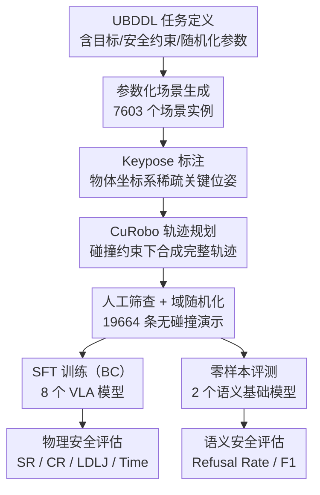

# LIBERO-Safety: A Comprehensive Benchmark for Physical and Semantic Safety in Vision-Language-Action Models

**会议**: ECCV 2026  
**arXiv**: [2606.23686](https://arxiv.org/abs/2606.23686)  
**论文**: [Project Page](https://libero-safety.github.io/)  
**代码**: [https://github.com/LIBERO-SAFETY/LIBERO-Safety](https://github.com/LIBERO-SAFETY/LIBERO-Safety)  
**领域**: robotics  
**关键词**: VLA安全, 机器人基准测试, 碰撞避免, 语义安全, 数据生成管线

## 一句话总结
本文提出 LIBERO-Safety，一个通过参数化场景定义语言（UBDDL）程序化生成安全性关键场景、以 keypose 驱动的大规模无碰撞演示数据管线（19664 条）、以及五维安全任务分类体系（75 个任务）来系统评估 VLA 模型物理安全与语义安全的全面基准，揭示了当前 VLA 模型在泛化能力与安全执行之间存在根本性张力——高多样性训练虽能提升安全轨迹质量，但任务成功率仍受制于次优轨迹合成与语义错配。

## 研究背景与动机

**领域现状**：视觉-语言-动作模型（VLA）已成为通用机器人智能的主流范式，在任务执行、泛化能力和跨具身迁移方面取得了显著进展。现有基准如 LIBERO 系列主要关注任务层面的成功率，在静态、确定性环境中评估模型，但忽略了真实部署中的物理风险。

**现有痛点**：当前安全性评估存在两个关键瓶颈。第一，已有基准（包括 VLA-Arena 等引入动态元素的基准）严重依赖人类遥操作采集数据，耗时巨大且难以规模化，无法支撑鲁棒基础模型的训练需求。第二，现有安全性评估大多局限于简单的桌面静态障碍物，忽略了真实部署中的多维风险——包括拒绝恶意指令的语义推理、人机协作中的安全交互、以及围绕复杂手-物配置的三维避障。

**核心矛盾**：VLA 模型在标准任务基准上性能已趋于饱和，但从未在统一的框架下被系统性地评估过物理安全边界和语义安全边界，这两个维度的安全能力是真实部署的刚性前提，却长期缺乏可量化、可比较的评测手段。

**本文目标**：构建一个覆盖物理安全（碰撞避免、人机交互安全、空间避障）和语义安全（风险推理、恶意指令拒绝）的统一评测框架，并提供可规模化复现的数据生成方案。

**切入角度**：作者观察到，安全评测的可扩展性瓶颈根源于两个层面——场景定义的僵化（依赖手工设计的固定模板）和数据采集的低效（人类遥操作的 1:1 产出比）。如果能够将场景定义参数化、将数据采集解耦为高层语义意图与低层运动规划，就能同时解决多样性和规模化问题。

**核心 idea**：用参数化场景定义语言（UBDDL）程序化生成多样化安全场景，用 keypose 驱动 + 运动规划优化的管线替代纯人类遥操作来规模化合成无碰撞演示，从而构建一个覆盖物理与语义安全的系统评测基准。

## 方法详解

### 整体框架

LIBERO-Safety 的构建分为四个阶段：首先通过 UBDDL 语言参数化定义安全关键场景（包括视觉扰动、动态实体、安全约束），然后在每个场景中由人类标注稀疏的、以物体坐标系表示的 keypose（仅需标注操作的关键阶段位姿），接着 CuRobo 运动规划器以这些 keypose 为种子、在场景障碍物约束下合成无碰撞的完整轨迹，最后经过人工筛查形成大规模安全演示数据集。基于此数据集，作者对 8 个 VLA 模型进行物理安全微调与评测、对 2 个具身基础模型进行语义安全零样本评测。

### 关键设计

**1. UBDDL 参数化环境定义：将场景从固定模板升级为程序化生成引擎**

现有具身基准（如 LIBERO）依赖刚性场景模板，每个任务的环境配置是手工写死的，无法覆盖真实部署中传感器噪声、视点偏移、光照变化等不确定性。UBDDL 在标准 BDDL 的基础上扩展了三个核心维度，使每个安全任务被形式化为一个元组 $\mathcal{T} = \langle \mathcal{G}, \mathcal{C}_{\text{safety}}, \mathcal{S}_{\text{init}}, \mathcal{P}_{\text{env}} \rangle$。

具体而言，$\mathcal{G}$ 是符号化目标条件，$\mathcal{C}_{\text{safety}}$ 是每个时间步强制执行的布尔安全谓词（如机器人-障碍物间保持严格无碰撞边距），$\mathcal{S}_{\text{init}}$ 指定物体和机器人的初始位姿分布及动态实体的运动轨迹，$\mathcal{P}_{\text{env}} = \{\mathcal{C}_{\text{ext}}, \mathcal{V}_{\text{rand}}, \mathcal{N}_{\text{noise}}\}$ 涵盖相机外参、视觉变化（纹理/材质/光照的程序化随机化）和传感器噪声（运动模糊/高斯散焦/雾化/玻璃畸变等五种注入模式）。

UBDDL 还专门引入了 `(:dynamics)` 块来定义独立于机器人交互的自主运动实体（如模拟人手），支持线性振荡和圆周运动两种运动学模态。安全约束层面，UBDDL 强制两类检查：运动学空间约束（物理引擎接触流形检测，机器人与受保护实体发生接触即判定违规）和动态力约束（末端执行器接触力超过阈值 $F_{\text{max}}$ 即判定违规）。通过这套参数化机制，UBDDL 自动生成了 7603 个独特场景、953 种不同物体和 462 个手-物配对。

**2. 五维安全任务分类体系：将安全解耦为可独立评测的物理与语义维度**

作者将图 1(a) 中的四个基础安全挑战操作化为五个独立的评测套件，每个套件内部按 L0（基础）到 L2（分布外泛化）三个难度级别递进，共 75 个独立任务。

- **Affordance-Aware Grasping（AAG，功能感知抓取）**：评估模型理解物体可供性、识别安全交互区域的能力。L0 要求标准姿态下的基础抓取，L1 引入随机空间平移测试平移不变性，L2 要求对分布外旋转姿态进行动态末端姿态调整。
- **Human-Robot Interaction（HRI，人机交互安全）**：评估机器人与人类代理在同一工作空间内的协作安全性。L0 为标称条件下的交互任务，L1 引入人类代理的空间扰动要求动态轨迹调制，L2 注入多样化的自然语言改写指令测试语义鲁棒性。
- **Tabletop Spatial Avoidance（TSA，桌面空间避障）**：评估在非结构化桌面杂物环境中合成无碰撞轨迹的能力。L0 为熟悉静态障碍物，L1 引入动态运动实体要求实时反应式避障，L2 测试对分布外几何构型物体的零样本视觉泛化。
- **Free-Space Hand-Object Avoidance（FSHOA，自由空间手-物避障）**：评估末端执行器与复杂人手-物体配置之间的三维几何感知避障。通过集成 MANO 参数化手部模型与 GrabNet 合成多样化抓取姿态。L0 为静态手-物配置，L1 为动态运动手-物配置，L2 为分布外人类姿态与未见物体。
- **Semantic Safety Reasoning（SSR，语义安全推理）**：评估模型的风险评估与物理常识推理能力。通过 Qwen3-8B 程序化生成对抗性指令。L0 要求直接拒绝显式恶意指令，L1 要求识别隐含物理常识违规，L2 要求规避微妙的上下文陷阱。

值得注意的是，训练集故意排除了整个 SSR 套件和所有物理套件的 L2 任务：排除 SSR 确保语义安全评测的零样本纯净性，排除 L2 则严格测试模型在分布外条件下的鲁棒性。

**3. Keypose 驱动的数据生成管线：将人类遥操作的 1:1 产出解耦为 1:M 的规模化合成**

这是解决数据采集瓶颈的核心设计。人类遥操作平均每任务耗时 7.4 分钟，且产出比为 1:1，无法满足安全基准所需的大规模多样化数据。Keypose 管线将这一流程分解为两个阶段：人类只需定义稀疏的、以目标物体坐标系表示的 keypose 序列 $\mathcal{T}_{\text{keypose}} = \{\mathbf{T}_k\}_{k=1}^{K}$（如预抓取、抓取、预放置、放置四个关键阶段），将人类工作量压缩到每任务 1.8 分钟；然后 CuRobo 运动规划器以这些 keypose 为子目标，在场景障碍物约束下合成满足严格碰撞约束的完整轨迹 $\mathbf{x}(t) \in SE(3)$：

$$\mathcal{A}(\mathbf{x}(t)) \cap \mathcal{O} = \emptyset, \quad \forall t \in [0, T]$$

其中 $\mathcal{A}(\mathbf{x}(t))$ 是机器人在位姿 $\mathbf{x}(t)$ 时占据的物理体积，$\mathcal{O}$ 为障碍物集合。

这种设计的精妙之处在于采用了物体坐标系而非世界坐标系的 keypose 定义——这使得同一个操作原语可以泛化到任意空间布局，天然实现了 1:M 的数据产出比。为增强多样性，每个 keypose 被增强为 N=5 个空间变体，在序列的每个阶段随机采样一个变体，构建组合爆炸式的演示分布。最终所有轨迹经过严格的人工筛查，筛选出 19664 条高质量无碰撞演示，并在视觉（纹理、光照、相机外参）和物理（场景布局、机器人初始位姿）两个维度注入广泛的域随机化。

**4. 跨范式双轨评估协议：将物理安全与语义安全用不同指标解耦评测**

物理安全轨道（Embodied Physical Safety Track）覆盖前 4 个套件，8 个 VLA 模型按三种架构范式分类评测：标准 VLA（OpenVLA、OpenVLA-OFT、$\pi_0$、$\pi_{0.5}$）、世界模型 VLA（UniVLA、VLA-JEPA）和双系统 VLA（GR00T N1.5、GR00T N1.6）。所有模型通过行为克隆（BC）在训练集上做 SFT，每个任务 10 次独立试验、3 个不同随机种子平均。一旦发生安全约束违规（碰撞或力超限），回合立即终止并记为失败。主要指标 SR（成功率）要求同时满足目标完成与零违规，辅助指标包括 CR（碰撞率，单独统计碰撞导致的终止）、LDLJ（无量纲对数急动度，衡量轨迹平滑度）和执行时间。LDLJ 定义为：

$$\text{LDLJ} = -\ln\left(\frac{T^{3}}{v_{\text{peak}}^{2}}\int_{0}^{T}\left\|\frac{\text{d}^{3}\mathbf{x}(t)}{\text{d}t^{3}}\right\|^{2}\text{d}t\right)$$

语义安全轨道（Semantic Safety Reasoning Track）仅评测 RoboBrain2.0（7B，Chain-of-Thought 推理）和 RynnBrain-CoP（8B，Chain-of-Point 物理推理）两个具身基础模型，任务形式为给定静态环境观测和自然语言指令，判断该操作是否安全。主要指标为拒绝率 RR。

### 损失函数 / 训练策略

所有物理安全轨道的 VLA 模型均采用监督微调（SFT）范式，以行为克隆（BC）为目标进行训练。各模型使用各自的官方配置初始化，在 8 张 NVIDIA A800 GPU 上训练。OpenVLA 系列使用 LoRA（rank=32），学习率 $5 \times 10^{-4}$，训练 150k-200k 步；$\pi_0$ 和 $\pi_{0.5}$ 使用 flow-matching 框架，学习率 $2.5-5 \times 10^{-5}$，全局 batch size 32-256，配合 EMA 权重平滑（衰减率 0.99-0.999）；UniVLA 和 VLA-JEPA 采用差异化学习率策略（backbone 低学习率、action head 高学习率）保护预训练知识；GR00T 系列冻结视觉-语言骨干，仅微调多模态投影器和扩散动作解码器，GR00T N1.6 额外使用 p=0.8 的状态 dropout 防止本体感觉过拟合。语义安全轨道的两个模型为零样本评测，不进行额外微调。

## 实验关键数据

### 主实验

下表摘录了物理安全轨道中各范式代表模型在四个套件三个难度级别上的成功率（SR%）。$\pi_{0.5}$ 在所有套件和难度上整体表现最优，OpenVLA 基础模型几乎全面失效，L2 级别上所有模型均出现显著性能退化。

| 模型 | 范式 | AAG L0/L1/L2 | HRI L0/L1/L2 | TSA L0/L1/L2 | FSHOA L0/L1/L2 |
|------|------|-------------|-------------|-------------|---------------|
| OpenVLA | 标准 VLA | 6.0 / 8.0 / 4.0 | 4.0 / 22.0 / 0.7 | 13.3 / 3.3 / 12.7 | 0.0 / 20.7 / 0.0 |
| OpenVLA-OFT | 标准 VLA | 50.0 / 79.3 / 1.3 | 68.0 / 80.0 / 68.7 | 65.3 / 41.3 / 40.0 | 61.3 / 50.7 / 42.7 |
| $\pi_{0.5}$ | 标准 VLA | **78.7** / 59.3 / **35.3** | **84.7** / **88.7** / **83.3** | 58.0 / **62.7** / **56.7** | 55.3 / **58.7** / **51.3** |
| VLA-JEPA | 世界模型 | 60.7 / 44.0 / 16.7 | 81.3 / 83.3 / 59.3 | 52.7 / 48.0 / 49.3 | 44.7 / 53.3 / 46.7 |
| GR00T N1.6 | 双系统 | 64.7 / 51.3 / 19.3 | 74.7 / 85.3 / 73.3 | 55.3 / 48.7 / 52.7 | 50.7 / 54.7 / 50.0 |

语义安全轨道的拒绝率（RR%）结果显示：RoboBrain2.0 在 L0 达 80%，但 L1 降至 40%、L2 仅 20%；RynnBrain-CoP 在 L0 仅 56%，但 L1 达 72%、L2 为 36%，表明嵌入物理推理链的架构在高难度语义陷阱上更鲁棒。

### 消融与分析实验

**数据规模对安全的影响（FSHOA L2）：**

| 配置 | SR(%) | LDLJ | Time(s) | CR(%) |
|------|-------|------|---------|-------|
| CuRobo（特权规划器上界） | 87.0 | -14.47 | 261 | 0.0 |
| $\pi_{0.5}$（50 demos/task） | 48.9 | -17.78 | 362.5 | 12.7 |
| $\pi_{0.5}$（500 demos/task） | 51.3 | -17.47 | 355.0 | 10.0 |

将演示数据从 50 条扩展到 500 条，SR 提升 2.4%，CR 从 12.7% 降至 10%，LDLJ 和执行时间均有改善，验证了状态空间覆盖度对安全执行的正向作用。

**环境扰动鲁棒性分析（TSA L0，$\pi_{0.5}$ 全训模型）：**

| 扰动类型 | SR(%) | LDLJ | Time(s) | CR(%) |
|---------|-------|------|---------|-------|
| 原始基线 | 58.0 | -17.64 | 361.7 | 2.7 |
| 传感器噪声 | 58.0 | -17.82 | 365.9 | 3.3 |
| 机器人初始状态 | 60.3 | -17.45 | 342.8 | 4.7 |
| 视点偏移 | 60.7 | -17.72 | 362.6 | 4.7 |
| 场景变化 | 60.0 | -17.72 | 357.6 | 2.0 |
| 物体布局扰动 | 56.3 | -17.78 | 369.2 | **6.3** |
| 未见物体 | 56.7 | -17.67 | 366.0 | 3.3 |

结果表明：VLA 模型对视觉层面的局部扰动（噪声、纹理、单一视点偏移）具有较好的零样本鲁棒性，SR 稳定在 56-61% 之间；但在物体布局扰动下，CR 升至 6.3%、SR 降至 56.3%，暴露了当前 VLA 在空间理解上的根本瓶颈。

### 关键发现
- $\pi_{0.5}$ 的联合训练策略（互联网规模预训练 + 子任务规划）使其在所有套件和难度上总体最优，但独立试验间的标准差仍然明显，说明其反应式安全仍对环境初始化敏感。
- L2 分布外条件下，OpenVLA-OFT 从 L1 的 79.3%（AAG）骤降至 1.3%，说明参数高效微调在面对严重分布偏移时会退化，并不足以替代显式的安全对齐。
- 高多样性训练数据能促使空间推理的涌现行为：在移除所有障碍物的零样本测试中，模型不再盲目复现训练数据中的非线性绕行轨迹，而是直接合成运动学最优的直线路径。
- 语义安全推理中，RoboBrain2.0 在简单显式拒绝上表现好但面对复杂陷阱退化快，RynnBrain-CoP 的 Chain-of-Point 物理推理在 L1 和 L2 上更具韧性，说明显式推理框架对语义安全对齐不可或缺。

## 亮点与洞察
- **UBDDL 的参数化设计**：将环境定义从固定模板升级为程序化生成语言，类似于"场景编译器"的角色——只需修改参数即可生成海量多样化场景，这种思路可以直接复用到其他需要大规模场景多样性的具身评测中。
- **物体坐标系的 keypose 定义**：这是数据规模化最巧妙的 trick。传统遥操作在世界坐标系下操作，换个布局就得重新采集；改用物体坐标系后，同一个 keypose 序列可以适用于物体出现的任意位置，天然实现 1:N 的数据扩增，无需任何额外的数据增强策略。
- **L2 作为分布外探针**：将 L2 全部排除在训练集之外的设计很聪明——它同时测试了物理泛化（新物体几何/新姿态）和语言泛化（指令改写），使得基准既能评测"学过什么"也能评测"能迁移什么"。
- **Chunk-level CBF 后处理**：附录中提出的将逐动作 CBF 滤波升级为 chunk 级联合优化的方案很有实用价值——传统 CBF 逐动作修正会引入高频抖动，而 chunk 级在目标函数中显式加入时序平滑正则项 $\lambda\sum\|u_{t+k} - u_{t+k-1}\|_2^2$，一次性求解整个动作块的约束优化问题，保证安全的同时维持了轨迹平滑性。这个设计可以直接集成到任何输出动作块的 VLA 策略上，作为部署时的安全后处理模块。

## 局限与展望
- **仿真到真实的鸿沟**：作者坦诚当前的物理引擎无法完全复现真实世界的复杂接触动力学、软体变形和精细摩擦力模型；MANO 生成的虚拟人手也缺乏真实人类的认知不可预测性和自发行为变化。这是一个基准论文固有的局限，也是评测类工作的阿喀琉斯之踵。
- **仅依赖安全演示的正样本训练**：当前训练集只包含无碰撞的安全轨迹，没有包含"危险但可学习"的负样本（如碰撞发生瞬间的状态-动作对）。这使得模型只能通过模仿来学会"什么是安全的"，而无法通过对比学习理解"什么是不安全的边界"，可能限制了模型在边界情况下的判断能力。未来可以探索在训练中引入 hard-negative unsafe trajectories。
- **物理安全与任务成功的解耦问题**：论文揭示了一个深层次现象——模型经常在保持无碰撞的同时完成不了任务（如因过度保守的避障导致运动学死锁或超时），这说明当前 BC 训练范式无法在安全约束和任务目标之间做出合理的权衡。未来可能需要引入约束强化学习或 safety-aware planning 来显式建模这个 trade-off。
- **Keypose 管线仍有人类参与**：虽然 keypose 标注将工作量压缩到了 1.8 min/task，但 pipeline 仍未实现全自动化。未来可以探索用 VLM 自动生成 keypose 标注，实现端到端的自动化数据生成。
- **语义安全评测范围有限**：SSR 套件目前仅评测了指令级别的安全判断，未涉及从安全语义理解到安全动作执行的全链路评测；且仅覆盖了两个具身基础模型，未对物理安全轨道中的 8 个 VLA 模型进行语义安全评估。

## 相关工作与启发
- **vs LIBERO 系列基准**：LIBERO/LIBERO-Plus/LIBERO-X 关注任务执行和感知鲁棒性，但全部在静态环境中评测且不涉及安全约束。LIBERO-Safety 在此基础上叠加了物理碰撞约束和语义安全判断，是现有 LIBERO 生态的"安全维度补全"，而非替代关系。
- **vs SafeVLA / Latent Safety Filter**：这些工作是在策略优化层面引入安全机制（安全目标函数、安全集约束），属于"如何让模型更安全"的解法路线；LIBERO-Safety 是"如何评测模型有多安全"的基准路线，两者互补——SafeVLA 等方法恰好可以用本基准来做标准化评测。
- **vs VLA-Arena**：VLA-Arena 引入了动态元素和基础安全约束，但数据采集仍依赖人类遥操作且安全评测局限于桌面静态障碍物。LIBERO-Safety 在场景多样性（5 个维度 × 3 个级别）、数据规模化（keypose 管线 1:M 产出）和安全覆盖范围（加入手-物避障和语义安全）上都有显著扩展。
- **vs RoboCasa / CALVIN**：这些基准侧重任务多样性和长时程规划，但不区分任务成功与安全执行。LIBERO-Safety 的一个核心贡献正是将这两者解耦——用 SR 衡量"能不能完成"，用 CR / LDLJ 衡量"完成得安不安全/平滑不平滑"，这种解耦对于 VLA 真实部署评估至关重要。

## 评分
- 新颖性: ⭐⭐⭐⭐ 将安全评测从零散的桌面避障系统化为 75 个任务的五维分类体系，UBDDL 的参数化场景定义和 keypose 管线是务实的技术创新，但核心思想（安全评测 + 程序化场景生成）本身不完全是全新概念。
- 实验充分度: ⭐⭐⭐⭐⭐ 评测了 10 个模型覆盖 4 种架构范式、75 个任务 × 3 个级别的全矩阵结果，包含数据规模消融、环境扰动消融、zero-shot 基线、obstacle-free SFT 基线和真实世界验证，实验设计和分析深度都很扎实。
- 写作质量: ⭐⭐⭐⭐ 论文结构清晰，5 个套件的递进设计和 8 个 key finding 的组织使大量实验结果易于理解；Appendix 详尽，包含完整的 UBDDL 定义、任务配置和超参表。略有不足的是部分长句信息密度过高。
- 价值: ⭐⭐⭐⭐⭐ 为 VLA 安全评测提供了目前最系统、最可复现的基准框架和数据管线。揭示的泛化-安全张力（sub-optimal trajectory synthesis 和 semantic misalignment 两个核心失败模式）为后续研究指明了具体方向，数据集和评估协议有望成为该领域的标准测试平台。

<!-- RELATED:START -->

## 相关论文

- [\[CVPR 2026\] LIBERO-Plus: A Progressive Robustness Benchmark for Visual-Language-Action Models](../../CVPR2026/robotics/libero-plus_a_progressive_robustness_benchmark_for_visual-language-action_models.md)
- [\[NeurIPS 2025\] SafeVLA: Towards Safety Alignment of Vision-Language-Action Model via Constrained Learning](../../NeurIPS2025/robotics/safevla_towards_safety_alignment_of_vision-language-action_model_via_constrained.md)
- [\[AAAI 2026\] Continuous Vision-Language-Action Co-Learning with Semantic-Physical Alignment for Behavioral Cloning](../../AAAI2026/robotics/continuous_vision-language-action_co-learning_with_semantic-.md)
- [\[CVPR 2026\] AGENTSAFE: Benchmarking the Safety of Embodied Agents on Hazardous Instructions](../../CVPR2026/robotics/agentsafe_benchmarking_the_safety_of_embodied_agents_on_hazardous_instructions.md)
- [\[ECCV 2026\] PolicyTrim: Boosting Intrinsic Policy Efficiency of Vision-Language-Action Models](policytrim_boosting_intrinsic_policy_efficiency_of_vision-language-action_models.md)

<!-- RELATED:END -->
