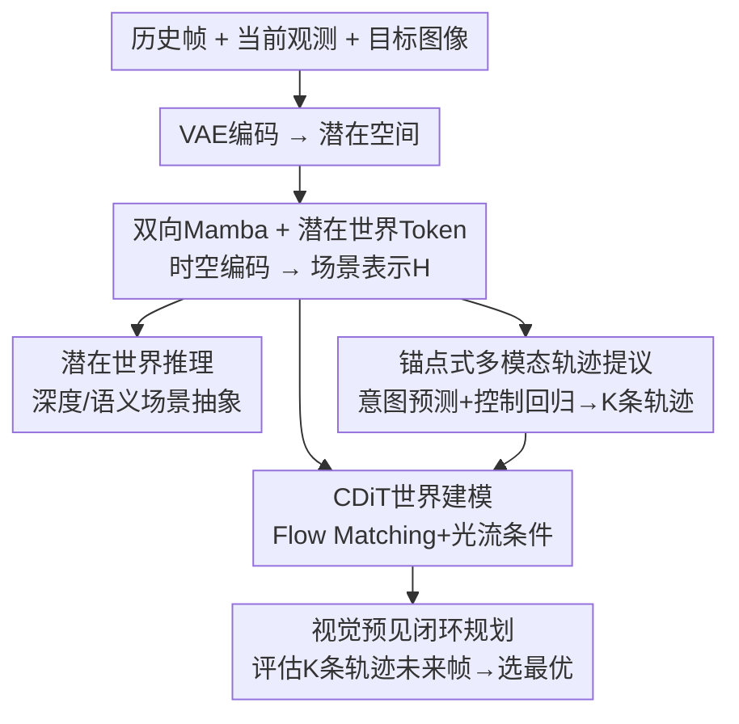

# NavWM: A Unified Navigation World Model for Foresight-Driven Planning

**会议**: ECCV 2026  
**arXiv**: [2606.24101](https://arxiv.org/abs/2606.24101)  
**代码**: 无  
**领域**: 机器人 / 具身智能  
**关键词**: 世界模型, 视觉导航, 多模态轨迹预测, 视觉预见规划, 潜在世界推理

## 一句话总结
NavWM 提出一个统一导航世界模型，在共享的双向 Mamba 主干上联合学习潜在世界推理（深度/语义场景抽象）、锚点式多模态轨迹预测和 Flow Matching 条件视觉生成，使得世界模型本身能充当"视觉预见"闭环规划器——对每条候选轨迹模拟未来观测并选出最优路径——在五个机器人数据集上离线生成质量（PSNR 14.17→17.34）和零样本导航成功率（44%）均达到 SOTA。

## 研究背景与动机
视觉导航是具身智能的核心能力，要求智能体仅凭相机观测在非结构化环境中安全移动、避障并抵达目标。传统导航策略（GNM、ViNT、NoMaD）学习从视觉观测到动作的直接映射，但这类纯反应式策略缺乏对未来的显式预见能力，普遍存在短视决策（myopic decision-making）和模式坍塌（mode collapse）问题，在未见环境中泛化能力有限。

近期工作开始将世界模型引入导航，但现有范式面临三个关键挑战。**第一，模块化解耦训练**：导航策略和世界模型通常分开训练（如 NWM 用 DiT 做世界模型再引导 NoMaD），无法利用两者共享的时空动态，导致次优表示。**第二，缺乏显式场景抽象**：即使部分方法尝试统一策略和世界模型（如 UniWM），其潜在表示缺少结构化的几何或语义线索，模型只能从原始特征中隐式推断空间规律，长时域预测和规划不稳定。**第三，动作空间的单模态坍塌**：真实导航存在多条可行轨迹通向同一目标，但现有方法大多将动作预测建模为单条轨迹，多模态动作空间被压缩为单一模式，智能体容易陷入局部最优或停滞。

核心 idea：感知（场景理解）、生成（未来帧合成）和控制（动作预测）本质上共享对底层环境结构和时空动态的建模需求——NavWM 用统一的双向 Mamba 主干同时学习这三件事，通过潜在世界 Token 注入几何/语义先验实现结构化场景理解，用锚点式多模态轨迹提议扩展动作空间，最终让生成式世界模型充当"视觉预见"闭环规划器：对多条候选轨迹分别模拟未来观测，评估目标对齐程度后选出最优路径。

## 方法详解

### 整体框架
NavWM 以 State Space Model（双向 Mamba）为统一主干，输入为历史帧序列 $\mathcal{O}_c=\{o_{t-M},\dots,o_{t-1}\}$、当前观测 $o_t$ 和目标图像 $o_g$，输出为 $K$ 条候选轨迹 $\mathcal{T}=\{\hat{a}_{t:t+N-1}^{(k)}\}_{k=1}^K$ 及对应的未来观测预测 $\mathcal{O}=\{\hat{o}_{t+1:t+N}^{(k)}\}_{k=1}^K$。动作 $a=(\mu,\phi)$ 包含自中心坐标系下的二维平移 $\mu\in\mathbb{R}^2$ 和旋转 $\phi\in\mathbb{R}$。

流程：输入图像先经预训练 VAE 编码器投影到紧凑潜在空间，然后在一组可学习的潜在世界 Token（Latent World Tokens）前拼接，送入双向 Mamba 进行时空编码，再通过注意力池化层将历史 token 压缩为固定长度表示以提升长时域推理效率。Mamba 输出的场景表示 $\mathcal{H}$ 分三路进入三个专用头：潜在世界推理头（预测深度/语义）、多模态轨迹提议头（生成 $K$ 条候选轨迹）、CDiT 世界建模头（以轨迹和场景特征为条件生成未来帧）。推理时，世界模型对每条候选轨迹模拟未来观测，通过视觉预见评估目标对齐程度，选择最优路径执行闭环导航。

### 关键设计

**1. 潜在世界推理：用 Latent World Token 内化场景几何与语义**

导航中的远见规划要求智能体对 3D 几何和语义有内在理解，否则未来帧合成缺乏物理基础。NavWM 引入一组可学习的潜在世界 Token（Latent World Tokens），在 Mamba 时空编码过程中主动吸收环境的结构化先验。监督信号来自视觉基础模型的蒸馏：用 Depth Anything V2 生成稠密深度伪标签 $\mathcal{D}_{gt}=\{d_n\}$，用 SAM 生成语义特征伪标签 $\mathcal{S}_{gt}=\{s_n\}$（覆盖预测时域 $n\in\{t+1,\dots,t+N\}$）。时空编码后的潜在世界 Token 经 CNN 解码器上采样，输出深度预测 $\hat{\mathcal{D}}$ 和语义预测 $\hat{\mathcal{S}}$。

为应对室内外导航环境深度尺度差异巨大的问题，深度预测采用尺度不变损失（Scale-Invariant Loss）：

$$\mathcal{L}_{si}=\frac{1}{P}\sum_{p=1}^{P}g_p^2-\frac{\lambda}{P^2}\left(\sum_{p=1}^{P}g_p\right)^2,\quad g_p=\log\hat{d}_p-\log d_p$$

语义对齐使用标准 MSE 损失。最终 $\mathcal{L}_{reason}=\lambda_{depth}\mathcal{L}_{si}+\lambda_{sem}\mathcal{L}_{mse}$。这个辅助任务的关键价值在于：它不是为深度/语义预测本身，而是迫使 Mamba 主干在编码阶段就内化场景的几何和语义结构，使后续的动作预测和视觉生成都受益于同一份"物理上说得通"的场景表示。

**2. 锚点式多模态轨迹提议：分解意图不确定性与控制不确定性**

可靠的预见规划需要探索多条可行未来轨迹，而非死守单条——后者极易陷入局部最优。NavWM 借鉴轨迹预测领域思路，将未来不确定性分解为两个互补来源：意图不确定性（高层导航目标去哪）和控制不确定性（低层运动怎么走），分别对应锚点目标预测和条件轨迹生成两个阶段。

第一阶段，构建锚点码本 $\mathcal{A}\in\mathbb{R}^{K\times 2}$：在训练集真值目标坐标上先做 K-Means 聚类，再用最远点采样（Farthest Point Sampling）选出最具代表性的 $K$ 个目标位置。给定场景表示 $\mathcal{H}$，将锚点坐标与场景特征拼接后送入两个轻量 MLP 头：意图头预测锚点概率 $\hat{\boldsymbol{\pi}}\in\mathbb{R}^K$，控制头回归每个锚点的空间偏移 $\Delta\hat{\mathbf{A}}\in\mathbb{R}^{K\times 2}$，得到修正目标 $\widetilde{\mathcal{A}}=\mathcal{A}+\Delta\hat{\mathbf{A}}$。训练时找到与真值最匹配的锚点 $k^*$，优化意图分类损失 + 偏移回归 Huber 损失：

$$\mathcal{L}_{anchor}=-\log(\hat{\boldsymbol{\pi}}_{k^*})+\mathcal{L}_{huber}(\Delta\hat{x}_{k^*},\Delta x_{gt})+\mathcal{L}_{huber}(\Delta\hat{y}_{k^*},\Delta y_{gt})$$

第二阶段，对每个修正目标直接回归完整未来航点序列 $\hat{\mathcal{T}}_k$（假设各时间步条件独立，避免自回归逐步生成的高计算开销）。只对匹配锚点 $k^*$ 施加监督：$\mathcal{L}_{traj}=\mathcal{L}_{huber}(\hat{\mathcal{T}}_{k^*},\mathcal{T}_{gt})$。最终 $\mathcal{L}_{action}=\mathcal{L}_{anchor}+\lambda_{traj}\mathcal{L}_{traj}$。这套锚点机制的精妙之处在于：离散锚点覆盖意图多模态性，连续偏移保留控制精度，二者解耦后各自专攻，比纯扩散或 GMM 方法既更多样又更精确。

**3. CDiT 世界建模与 Flow Matching：动作条件的视觉预见**

为使世界模型能按候选轨迹"想象"未来，NavWM 采用 Conditional Diffusion Transformer（CDiT）作为视觉生成骨干。CDiT 相较于标准 DiT 的关键改进在于条件注入方式：预测动作首先被转换为稠密光流场 $\mathcal{F}$（显式编码相机运动），经空间池化后与扩散时间步嵌入融合，通过自适应层归一化（AdaLN）调制中间激活。同时，统一主干产出的场景特征 $\mathcal{H}$ 通过交叉注意力注入，提供上下文引导。

生成训练采用连续时间 Flow Matching，将未来帧合成建模为从高斯先验到目标潜在分布的确定性映射。给定真值潜在 $z_1$ 和噪声 $z_0\sim\mathcal{N}(0,\mathbf{I})$，定义线性插值概率路径 $z_\tau=\tau z_1+(1-\tau)z_0$（$\tau\sim\mathcal{U}(0,1)$），网络 $v_\theta$ 回归驱动从噪声流向数据的常向量场 $u_\tau=z_1-z_0$：

$$\mathcal{L}_{visual}=\mathbb{E}_{\tau\sim\mathcal{U}(0,1),z_0\sim\mathcal{N},z_1\sim q}\left[\|v_\theta(z_\tau,\tau,\mathcal{F},\mathcal{H})-(z_1-z_0)\|_2^2\right]$$

Flow Matching 相较于 DDPM 的优势在于采样轨迹更直、推理步数更少，对导航这种需要实时推理的场景至关重要。CDiT + 光流条件 + 交叉注意力场景注入的组合，确保了生成帧在视觉质量和几何一致性上都优于标准 DiT 骨干。

**4. 两阶段联合训练与不确定性加权多任务损失**

感知、控制和生成三个任务虽然共享底层表示，但梯度量级和收敛速度差异大，直接联合训练容易导致某个任务主导优化。NavWM 采用两阶段策略：**第一阶段**所有组件联合训练，使用教师强制（teacher forcing）——CDiT 世界建模头接收真值轨迹作为条件，使感知、动作和生成三个分支学到互一致的时空表示。**第二阶段**冻结 Mamba 主干和轨迹提议头，仅微调 CDiT，条件从真值轨迹切换为模型自身预测的轨迹——这一步旨在消除训练-推理间的曝光偏差（exposure bias），让世界模型适应不完美的动作预测输入。

多任务损失通过不确定性加权自动平衡：$\mathcal{L}=\sum_{k\in\mathcal{T}}\left(\frac{1}{2}\exp(-s_k)\mathcal{L}_k+\frac{1}{2}s_k\right)$，其中 $\mathcal{T}=\{\text{visual},\text{action},\text{reason}\}$，$s_k$ 为各任务的可学习 log-variance。这个公式的直觉是：预测误差大的任务自动获得较小的权重（$\exp(-s_k)$ 变小），同时正则项 $\frac{1}{2}s_k$ 防止权重退化到零，无需手动调参即可自适应平衡三个目标。

### 一个完整示例：从观测到决策的单步闭环

假设智能体当前在室内走廊，观测到前方 3 米处有 T 字路口，目标图像显示应左转进入某房间。单步推理过程如下：VAE 将过去 4 帧历史、当前帧、目标图像编码为潜在 token（约 1024 维）。双向 Mamba 接收这些 token 和 16 个潜在世界 Token 进行时空编码，注意力池化后得到场景表示 $\mathcal{H}$。潜在世界推理头从世界 Token 解码出前方深度图（显示墙面距离 2.1m、左侧开口 1.8m 宽）和语义分割（左侧开口标记为"可通行"）。同时，锚点式轨迹提议头：意图头对 $K=7$ 个锚点打分，最高概率的三个分别对应"直行 1.5m""左转 45 度前进 2m""左转 30 度前进 1.8m"；控制头为每个锚点回归微小偏移修正。CDiT 以这三条轨迹为条件、以 $\mathcal{H}$ 为交叉注意力上下文，用 Flow Matching（4 步采样）生成对应的未来 4 帧观测。视觉预见规划器对比三组未来帧中目标房间门出现的概率和位置，发现"左转 45 度"的未来帧中门框在第 3 帧清晰可见且位置与目标一致——选择该轨迹执行第一步动作，进入下一轮闭环。

### 损失函数 / 训练策略

总损失由三部分组成：$\mathcal{L}_{reason}$（深度尺度不变损失 + 语义 MSE）、$\mathcal{L}_{action}$（锚点分类损失 + 偏移回归 Huber 损失 + 轨迹回归 Huber 损失）、$\mathcal{L}_{visual}$（Flow Matching 向量场回归 MSE）。三者通过不确定性加权自动平衡。

训练配置：分辨率 $256\times256$，历史窗口 4 帧，预测时域 4 帧，参数 1.5B。优化器 AdamW，学习率从 $5\times10^{-5}$ warmup 至 $1\times10^{-4}$（500 步）后余弦衰减至 $1\times10^{-5}$。8 张 A100，全局 batch size 64。第一阶段 100k 步（教师强制 + 15% 目标掩码概率），第二阶段 50k 步（仅微调 CDiT，使用预测轨迹）。

## 实验关键数据

### 主实验

**离线评估（Table 1）**：在 Go Stanford、SCAND、RECON、HuRoN 四个数据集上评测。导航指标方面，NavWM 以 ATE 0.207、RPE 0.066 大幅领先此前 SOTA UniWM（ATE 0.302、RPE 0.116）和 NWM（ATE 0.642、RPE 0.211）。视觉生成方面，NavWM 的 PSNR 达到 17.340（UniWM 14.172、NWM 14.343），LPIPS 降至 0.243（UniWM 0.282、NWM 0.295），SSIM 提升至 0.507（UniWM 0.435）。

| 方法 | ATE↓ | RPE↓ | AOE↓ | MAOE↓ | PSNR↑ | SSIM↑ | LPIPS↓ | DreamSim↓ |
|------|------|------|------|-------|-------|-------|--------|-----------|
| GNM | 1.519 | 0.622 | 18.165 | 23.961 | - | - | - | - |
| ViNT | 1.424 | 0.617 | 17.074 | 23.831 | - | - | - | - |
| NoMaD | 1.070 | 0.376 | 12.463 | 17.645 | - | - | - | - |
| NWM | 0.642 | 0.211 | 10.496 | 16.534 | 14.343 | 0.422 | 0.295 | 0.091 |
| UniWM | 0.302 | 0.116 | 9.468 | 13.221 | 14.172 | 0.435 | 0.282 | 0.102 |
| **NavWM** | **0.207** | **0.066** | **8.152** | **12.855** | **17.340** | **0.507** | **0.243** | **0.084** |

**导航 rollout 评估（Table 2）**：在 Image Goal Navigation 任务上，轨迹分段平均长度 43 步，成功条件为抵达目标 0.5m 半径内。NavWM 在已见环境成功率达 72%（UniWM 66%、NWM 58%），在零样本未见环境（TartanDrive）成功率达 44%（UniWM 36%、NWM 23%），ATE 和 RPE 也均为最优。

| 方法 | Seen SR↑ | Seen ATE↓ | Unseen SR↑ | Unseen ATE↓ |
|------|----------|------------|-------------|--------------|
| ViNT | 0.24 | 1.948 | 0.11 | 2.423 |
| NoMaD | 0.29 | 1.711 | 0.16 | 2.242 |
| NWM | 0.58 | 1.141 | 0.23 | 1.712 |
| UniWM | 0.66 | 0.645 | 0.36 | 1.122 |
| **NavWM** | **0.72** | **0.381** | **0.44** | **0.765** |

### 消融实验

**模块消融（Table 3）**：在 RECON+HuRoN 上逐步添加三个核心模块。仅用世界推理（WR）时 ATE 为 0.513；加入动作预测（WR+AP）后 ATE 降至 0.338；加入世界模型（WR+AP+WM）后 ATE 进一步降至 0.254。视觉质量方面，单独世界模型（WR+WM）PSNR 16.627；加入动作预测（WR+AP+WM）后 PSNR 升至 17.622，LPIPS 从 0.293 降至 0.240。三个模块之间存在显著的正向协同效应，验证了联合训练的必要性。

| WR | AP | WM | ATE↓ | RPE↓ | PSNR↑ | LPIPS↓ |
|----|----|-----|------|------|-------|--------|
| ✓ | | | 0.513 | 0.187 | - | - |
| ✓ | ✓ | | 0.338 | 0.137 | 14.286 | 0.249 |
| ✓ | | ✓ | - | - | 16.627 | 0.293 |
| ✓ | ✓ | ✓ | 0.254 | 0.113 | 17.622 | 0.240 |

**多模态轨迹对比（Table 4）**：比较锚点方法 vs GMM vs 扩散策略（NoMaD），引入 APD（Average Pairwise Distance）衡量轨迹多样性。无世界模型规划时，三种方法精度接近（ATE 0.85-0.88），但锚点方法 APD 最高。加入世界模型规划后，锚点方法 ATE 从 0.85 降至 0.36（降幅 58%），远超 GMM（0.88→0.79，降幅 10%）和扩散（0.86→0.58，降幅 33%），APD 同步提升至 1.49（扩散 0.59、GMM 0.31）。候选数 $K$ 消融显示 NavWM 在 $K\approx 7$ 时性能饱和（扩散约 5、GMM 更早），说明锚点方法在保持高保真度的同时提供更多样化的探索空间。

### 关键发现
- **联合训练的三向协同是核心提升来源**：WR+AP 使导航 ATE 从 0.513 降至 0.338（降 34%），再加入 WM 后进一步降至 0.254（再降 25%）——三个任务互相强化，因为共享的时空动态表示同时服务三者。
- **锚点式多模态轨迹的"规划增益"远超基线**：同样加世界模型规划，锚点方法 ATE 改善 58%，扩散仅 33%，GMM 仅 10%——关键不在于轨迹多样性绝对值最高，而在于锚点轨迹在多样性和物理可行性之间取得了最佳平衡，为上层规划器提供了更好的动作空间。
- **两阶段训练对生成质量至关重要**：第二阶段用预测轨迹微调 CDiT 后，图像重建质量显著提升（见原文 Figure 4），说明消除曝光偏差让世界模型在实际推理条件下更鲁棒。
- **零样本泛化能力突出**：在完全未见过的 TartanDrive 上 SR 达 44%，远超 UniWM（36%）和 NWM（23%），潜在世界推理对结构化场景先验的内化可能是泛化的关键。

## 亮点与洞察
- **"世界模型即规划器"的范式翻转**：传统思路是世界模型辅助导航策略，NavWM 反过来让世界模型成为闭环规划的主体——生成多条轨迹对应的未来帧，直接比较视觉质量来决策，把"生成"从辅助工具升级为决策核心。
- **意图-控制两阶段解耦的锚点设计**：将轨迹不确定性显式分解为意图（去哪）和控制（怎么走），用离散锚点码本覆盖意图多模态性、连续偏移回归保持控制精度，这种"离散锚点 + 连续修正"的组合在轨迹预测领域并非首创，但将其与视觉预见规划深度耦合、让世界模型从多模态中受益，是精巧的系统设计。
- **Flow Matching 替代 DDPM 做实时推理**：导航场景对推理延迟敏感，Flow Matching 的直线采样路径在保持生成质量的同时大幅减少推理步数，是实用主义的技术选择。
- **潜在世界 Token 作为共享表示锚点**：不是独立模块，而是一组可学习 token 在 Mamba 编码过程中吸收几何/语义先验，然后这个内化了结构化知识的表示同时服务于动作预测和视觉生成——这种"润物细无声"的表示学习方法可以迁移到任何需要多任务共享场景理解的任务。

## 局限与展望
- **依赖视觉基础模型蒸馏的质量上限**：潜在世界推理的监督来自 Depth Anything V2 和 SAM，这些模型的预测误差会直接传导给 NavWM 的场景理解，在极端光照、透明物体、镜面反射等基础模型失效的场景下表现未知。
- **锚点码本离线聚类的静态性**：锚点码本在训练前通过 K-Means+FPS 一次性构建，无法在训练中自适应更新。如果测试环境的目标分布与训练集差异大（如极长走廊 vs 小房间），固定码本可能覆盖不足。
- **仅支持图像目标导航**：当前框架以目标图像为条件，不支持语言指令或坐标目标。扩展到多模态目标条件需要重新设计条件注入机制。
- **1.5B 参数的部署挑战**：8 张 A100 的训练配置和 1.5B 参数量对真实机器人端侧部署构成挑战，作者未讨论模型压缩或蒸馏方案。
- **闭环 roll-out 的累计漂移未量化分析**：虽声称视觉预见能实时纠错，但缺乏对长时域（>100 步）累计漂移的系统性分析，Figure 3 的定性轨迹图暗示漂移仍在发生。

## 相关工作与启发
- **vs NWM（Navigation World Models）**：NWM 将 DiT 世界模型与导航策略解耦训练，世界模型仅作为 NoMaD 的"独立规划"引导器。NavWM 统一框架避免了表示鸿沟，且 CDiT+Flow Matching 比标准 DiT 更高效、生成质量更高。
- **vs UniWM**：UniWM 是第一个将导航策略与世界模型统一为自回归多模态模型的尝试（基于 Anole-7B），但其潜在表示缺少显式场景抽象。NavWM 的潜在世界 Token 机制弥补了这一差距，精度和泛化均有实质提升。
- **vs 扩散策略（Diffusion Policy / NoMaD）**：扩散策略通过去噪过程表达动作多模态性，但本质上仍建模单一分布，模式坍塌风险存在。NavWM 的锚点机制显式维护离散多模态假设，多样性和可解释性更好。
- **可迁移思路**：潜在世界 Token + 基础模型蒸馏的范式可推广到其他需要结构化场景理解的具身任务（如操作、抓取）；锚点式多模态预测 + 视觉预见评估的"生成-验证"框架可迁移到任何需要探索多条路径再做决策的规划任务。

## 评分
- 新颖性: ⭐⭐⭐⭐ 统一框架联合学习感知/控制/生成不算全新概念（UniWM 先行），但潜在世界 Token 的结构化场景蒸馏 + 锚点式多模态轨迹 + 视觉预见闭环规划的组合设计有实质创新
- 实验充分度: ⭐⭐⭐⭐⭐ 五个数据集、离线+在线双评测维度、模块级消融、多模态方法横向对比、候选数敏感度分析、零样本泛化测试——实验链条完整且结论有力
- 写作质量: ⭐⭐⭐⭐ 动机链条清晰（三痛点→三设计→三协同），方法部分公式与文字配合得当，但 1.5B 参数量的训练细节（如第二阶段冻结哪些层）交代略显简略
- 价值: ⭐⭐⭐⭐ 为视觉导航世界模型建立了"统一主干 + 结构化先验 + 多模态动作 + 视觉预见规划"的完整范式，多模态轨迹的规划增益分析（Table 4）对相关领域有直接参考价值

<!-- RELATED:START -->

## 相关论文

- [\[CVPR 2026\] NavForesee: A Unified Vision-Language World Model for Hierarchical Planning and Dual-Horizon Navigation Prediction](../../CVPR2026/robotics/navforesee_a_unified_vision-language_world_model_for_hierarchical_planning_and_d.md)
- [\[ECCV 2026\] Pondering the Way: Spatial-perceiving World Action Model for Embodied Navigation](pondering_the_way_spatial-perceiving_world_action_model_for_embodied_navigation.md)
- [\[CVPR 2026\] Motus: A Unified Latent Action World Model](../../CVPR2026/robotics/motus_a_unified_latent_action_world_model.md)
- [\[CVPR 2026\] ForeAct: Steering Your VLA with Efficient Visual Foresight Planning](../../CVPR2026/robotics/foreact_steering_your_vla_with_efficient_visual_foresight_planning.md)
- [\[ICLR 2026\] Sparse Imagination for Efficient Visual World Model Planning](../../ICLR2026/robotics/sparse_imagination_for_efficient_visual_world_model_planning.md)

<!-- RELATED:END -->
