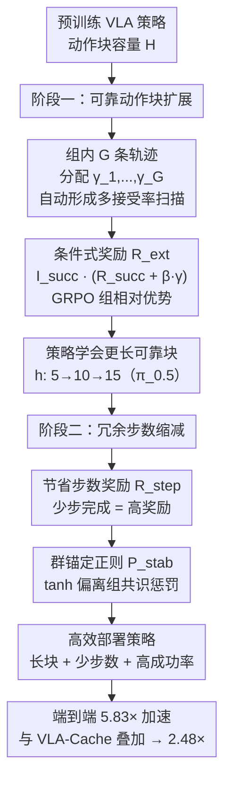

# PolicyTrim: Boosting Intrinsic Policy Efficiency of Vision-Language-Action Models

**会议**: ECCV 2026  
**arXiv**: [2606.22540](https://arxiv.org/abs/2606.22540)  
**项目页**: https://inceptionwang.github.io/PolicyTrim/  
**代码**: 无  
**领域**: 机器人 / 具身智能  
**关键词**: VLA模型, 强化学习, 机器人操作, 策略效率, 动作块扩展

## 一句话总结

PolicyTrim 提出两阶段 GRPO 后训练框架，通过动态执行窗口探索扩展可靠动作块长度、配合节省步数奖励与群锚定稳定性正则消除冗余物理步骤，在不改架构、不增示范数据的前提下将 VLA 机器人端到端部署速度提升最高 5.83 倍。

## 研究背景与动机

Vision-Language-Action（VLA）模型将视觉感知、语言理解与动作生成统一为端到端框架，已成为通用机器人操作的范式级方案。为降低大视觉语言骨干的计算开销，社区围绕计算效率做了大量工作——视觉 token 剪枝、量化、KV-cache 复用等手段不断降低单次推理延迟。然而，一个更根本的问题被忽略了：策略本身的效率，即完成一个任务总共需要多少次策略推理调用。这由两个因素联合决定——每次推理预测的动作块中能被可靠执行的长度，以及完成任务总共需要的物理步数。当前 VLA 策略在动作块尾部预测质量急剧退化，迫使系统保守地只执行前几个动作就重新获取观测；同时，模仿学习训练出的策略天然倾向于生成冗余的校正步骤。实验清晰地展示了这一矛盾：单纯强制执行更长动作块（块长从 5 增至 20），任务成功率反而从 97.8% 跌至 94.1%，且物理步数不降反增——尾部退化放的预测误差迫使机器人反复校正，反而使执行路径变得更长。

现有基于 RL 的后训练方法（如 VLA-RL、Co-RFT）普遍使用二元成功奖励，这带来了两个深层局限。首先，一旦策略成功率提升到高位，组内奖励方差迅速坍缩，优势估计失去辨识力，学习陷入停滞。其次，二元奖励对「走 80 步完成」和「走 120 步完成」不加区分，也完全无法激励模型扩展可靠预测范围——策略学会了能不能做成，但从未学会怎么做得更高效。更有趣的是，对同一策略在相同任务上重复 rollout 显示，紧凑的执行路径物理上是存在的，只是当前只能靠运气偶然出现——说明策略内部存在巨大的效率优化空间，但缺乏一个引导信号将其系统性地挖掘出来。

本文的核心洞察在于：策略效率与计算效率是两条完全正交的优化轴，前者通过减少推理调用次数提供乘法级加速，与任何单步推理加速手段叠加可获复合增益。PolicyTrim 将策略效率优化解耦为两个递进阶段——先通过动态执行窗口探索让模型学会在更长动作块内保持可靠的预测质量，再通过节省步数奖励配合稳定性正则消除冗余物理步骤。**核心 idea：将 VLA 策略效率优化分解为「先扩展可靠执行块长度、再缩减冗余物理步骤」的两阶段 GRPO 后训练，用定制奖励分别激励长块可靠预测与紧凑执行轨迹，实现端到端 5.83 倍加速而不损任务成功率。**

## 方法详解

### 整体框架

PolicyTrim 是一个两阶段 RL 后训练框架，基于 GRPO（Group Relative Policy Optimization）对预训练 VLA 策略进行渐进式优化，目标是减少完成任务所需的推理调用总次数。在任意决策步，VLA 策略基于当前视觉观测与语言指令生成一个长度为 H 的动作块（action chunk）。由于尾部预测质量不可靠，系统通常只执行前 h = ⌊γ·H⌋ 个动作（γ ∈ (0,1] 为接受率），然后获取新观测再进行下一轮推理——这保守策略虽然保证了物理稳定性，却浪费了大量潜在可靠的预测。

PolicyTrim 的阶段一通过为组内各轨迹分配不同的接受率 γ_i，并行探测各块位置的预测可靠性，并用组合奖励引导策略向更长可靠块演进。阶段二在扩展后的块基础上，用节省步数奖励鼓励成功轨迹走更少物理步，同时用群锚定稳定性正则防止策略坍缩到不可复现的捷径。两阶段顺序执行——先让预测更远且可靠、再让执行更紧凑——最终大幅减少推理调用次数。

### 关键设计

**1. 动态执行窗口探索：组内多接受率并行探测可靠边界**

阶段一的核心挑战在于：既想知道不同块长度下预测是否可靠，又不能为此付出额外的 rollout 代价。PolicyTrim 利用 GRPO 的组采样机制——对组内 G 条轨迹各分配一个不同的接受率 γ_i（从离散集合 Γ = {γ₁, γ₂, ..., γ_M} 中采样），形成一条轨迹执行 5 步就重观测、另一条执行 10 步、再一条执行全部 20 步的多接受率扫描仪。这种设计的经济性在于：同一 GRPO 组采样本身就是一次多水平线可靠性的对比实验，不额外消耗环境交互预算。消融实验有力支撑了这一设计的必要性：固定 γ = 1.0 时成功率从 99.1% 暴跌至 94.4%，而相同平均块长下的动态窗口探索将成功率保持在了 98.8%——关键差异在于组内对比：成功长块获得高奖励、失败长块得零分，策略自然学会哪些块位置的预测仍然可靠并朝那个方向优化。

**2. 条件式地平线奖励：防止无成功轨迹时的错误推动**

可靠块扩展的奖励设计面临一个微妙的反面模式：如果组内没有一条轨迹成功完成任务，客观上的地平线奖励 R_horizon = β·γ 仍会对长块轨迹给出正值，策略会被错误地推向长而不可靠的执行窗口。PolicyTrim 的解决方案极为简洁——引入成功指示器 I_succ，将联合奖励定义为 R_ext(τ_i) = I_succ(i) · (R_succ(τ_i) + β·γ_i)。当且仅当轨迹成功时叠加地平线分量，失败轨迹奖励恒为零。这个条件门控确保地平线奖励只在「已经成功」的前提下激励更长块，不会在模型尚不具备可靠预测能力时盲目推长。在同一 GRPO 组内，该设计自然形成对比学习效应——成功长块的奖励显著高于成功短块，失败轨迹均归零——优势估计引导策略自然地朝更长的可靠块方向演进。

**3. 节省步数奖励与群锚定正则化：防止贪心捷径坍缩的平衡机制**

阶段二的目标是以物理步数最小化为优化目标，但直接最小化步数会导致毁灭性副作用。首先定义节省步数奖励：R_step(τ) = max(0, S_base − S(τ)) / S_base，其中 S_base 约为初始策略平均成功步数的 1.3 倍。单独使用这个奖励时，由于初始步数方差大，偶发的低成本短轨迹获得异常高回报，策略通过不可复现的「运气」捷径来投机——成功率从 97.8% 急剧降至 93.7%。为此引入群锚定稳定性惩罚：

$$P_{stab}(\tau_i) = \lambda_{stab} \cdot \tanh\!\left( \frac{|S(\tau_i) - \mu_{group}|}{\max(\sigma_{group}, \sigma_{floor})} \right)$$

其中 μ_group 和 σ_group 是组内成功轨迹步数的均值与标准差。该惩罚让偏离群体共识的轨迹受到压制，确保策略收敛到可稳定复现的紧凑执行模式，而非依赖偶发的小概率事件。加入锚定正则后，任务成功率从 93.7% 回升至 97.5%，同时平均步数进一步从 81.7 降至 61.6——形成正则化同时提升成功率和执行效率的双赢局面，训练曲线也从无正则时的骤降变得平稳上升。

### 损失函数 / 训练策略

两阶段均使用 GRPO 优化，无 critic 模型或额外奖励模型。组内奖励标准化后计算相对优势，再以带 KL 惩罚的裁剪代理目标更新策略。两阶段顺序训练，每阶段最多 500 epoch；阶段一完成后冻结参考策略再进入阶段二。默认组大小 G = 8，地平线奖励系数 β = 0.8，稳定性正则系数 λ_stab = 0.2。

## 实验关键数据

### 主实验

**LIBERO 上 π_0.5 与 OpenVLA-OFT 结果**

| 模型 | 子集 | 成功率（基线→PolicyTrim） | 物理步数（基线→PolicyTrim） | 块长 | 加速比 |
|------|------|---------------------------|----------------------------|------|--------|
| π_0.5 | Spatial | 97.8% → 97.8% | 108.3 → 59.8 | 5→15 | 5.43× |
| π_0.5 | Object | 99.1% → 98.5% | 125.0 → 64.3 | 5→15 | 5.83× |
| π_0.5 | Goal | 98.7% → 98.8% | 110.6 → 63.5 | 5→15 | 5.23× |
| π_0.5 | Long | 93.0% → 93.3% | 249.8 → 171.8 | 5→10 | 2.91× |
| OpenVLA-OFT | Spatial | 98.6% → 98.8% | 111.2 → 62.1 | 8→8 | 1.79× |

**跨基准跨模型汇总**

| 模型 | 基准 | 成功率 | 步数变化 | 加速比 |
|------|------|--------|---------|--------|
| π_0.5 | ManiSkill | 88.1% → 89.8% | 45.2 → 38.3 | 2.36× |
| π_0.5 | Meta-World | 65.1% → 65.4% | 66.3 → 52.6 | 2.52× |
| GR00T | LIBERO-Spatial | 91.4% → 92.0% | 67.2 → 56.6 | 2.37× |

### 消融实验

| 配置 | 成功率 | 物理步数 | 块长 | 加速比 | 说明 |
|------|--------|---------|------|--------|------|
| Baseline | 97.8% | 108.3 | 5 | 1.00× | 无优化 |
| + 块扩展 | 97.2% | 113.8 | 15 | 2.86× | 块长翻三倍，步数反增 5.5 |
| + 步数奖励（无正则） | 93.7% | 81.7 | 5 | 1.32× | 成功率骤降 4.1% |
| + 步数奖励 + 正则 | 97.5% | 61.6 | 5 | 1.75× | 正则完全恢复成功率 |
| Full（两阶段 + 正则） | 98.3% | 59.8 | 15 | 5.43× | 全部组件最优 |

### 关键发现

- 可靠块扩展单独虽将执行窗口从 5 步推至 15 步（3 倍），但由于尾部预测残差在长期执行中被放大，物理步数反而从 108.3 增至 113.8——这既是消融实验的直接证据，也印证了阶段二的必要性：长块不能替代步数优化，两者必须递进处理。
- 节省步数奖励单独使用导致成功率暴跌（97.8% → 93.7%），加入群锚定正则化后完全恢复（97.5%），且步数进一步降至 61.6——正则同时提升了成功率和效率，这种双赢效果源于它抑制了「凭运气走捷径」而引导策略学习可复现的紧凑模式。
- 动态窗口探索（组内多 γ 并行）相比固定 γ 方案优势显著：Fixed γ = 1.0 成功率仅 94.4%，而同样 15 步块长下的动态探索保持 98.8%——并行多水平线探测为稳定性提供了关键支撑。
- 与 VLA-Cache 正交叠加后，在 LIBERO-Object 上获得 2.48× 联合加速，远超 VLA-Cache 单体的 1.26×，首次在实验中验证了「计算效率 × 策略效率」双轴优化的可行性。
- 在视觉分布偏移（高斯模糊、随机遮挡）下，PolicyTrim 不仅保持了更高的成功率（88.4% vs 79.6%），物理步数也更低（77.6 vs 128.9），说明学到的高效执行策略对感知退化更具鲁棒性。

## 亮点与洞察

- **视角层面的贡献**：将「部署效率」从「单步推理多快」转向「总共需要多少次推理」，识别出两条正交优化轴——计算效率 × 策略效率——尽管这个观察直觉上合理，但 VLA 社区此前竟无人系统化探索，是论文最根本的学术贡献。
- **利用 GRPO 组结构做免费探测**：阶段一的动态窗口探索巧妙利用 GRPO 组内天然并行多条轨迹的特性，把组变成一个多接受率可靠水平线扫描仪，不额外增加 rollout 预算就获得了多长度执行的对比信号，设计极其经济且优雅。
- **条件式地平线奖励的门控洞察**：地平线奖励仅在组内存在至少一条成功轨迹时才激活——这说明了一个微妙但重要的原则：「只有先确保能成功，才有资格谈效率」。没有这个门控，策略会被误导到长而不可靠的块。
- **群体共识作为自然锚点**：群锚定正则的巧妙之处在于它不是用绝对阈值截断，而是用组内共识作为自适应锚点——随群体收敛自动放松约束，同时 tanh 函数限制惩罚上界。这种自适应正则设计比固定惩罚系数更鲁棒。

## 局限与展望

- **架构依赖**：阶段一的块扩展对并行解码架构（OpenVLA-OFT）无效——其 placeholder token 机制对块长度微小增加即导致精度严重退化；自回归 VLA 模型也无法直接应用阶段一。未来可以在预训练阶段就植入对长块可靠性的建模支持。
- **需要高质量仿真环境**：两阶段 RL 都需要密集环境交互（≈68 小时 × 8×H100 GPU），对于缺少高保真仿真器的任务或实体机器人直接训练，成本仍然较高。
- **Sim-to-Real 的迁移不确定性**：实际部署时 PolicyTrim 在仿真中完成 RL 后训练，再通过少量真实演示的 SFT 迁移到真实世界——RL 学到的效率模式在 SFT 后被多大程度保留，论文未做系统分析。
- **未验证的场景**：实验聚焦于桌面操作任务，对多步骤长程任务、动态人机协作场景、变形物体操作等复杂场景的泛化能力仍需更多验证。

## 相关工作与启发

- **vs VLA-RL / Co-RFT / SimpleVLA-RL**：它们同样将 RL 用于 VLA 后训练，但均使用二元成功奖励，完全缺乏对执行效率的激励。PolicyTrim 是第一个将策略效率作为系统性优化目标的 RL 后训练框架，其奖励设计思路可直接推广到其他需要效率约束的控制任务（如导航、装配）。
- **vs 计算加速方法（SPVLA / VLA-Cache / SpecVLA）**：它们专注降低单步推理延迟，但无法减少推理次数本身。PolicyTrim 与此正交互补——组合使用可获得乘法级加速，为 VLA 部署优化提供了双轴并进的完整路线图。
- **vs 动作块预测退化研究（MoH / VLA Knows Its Limits）**：这些工作分析并量化了块尾预测退化，但停留在诊断层面。PolicyTrim 是首个针对此问题的 RL 解决方案，完成了从识别瓶颈到消除瓶颈的闭环。

## 评分

- 新颖性: ⭐⭐⭐⭐⭐ [首次系统定义 VLA 策略效率维度并给出完整优化方案，视角新颖且直击部署痛点]
- 实验充分度: ⭐⭐⭐⭐⭐ [跨 3 种架构 × 3 个仿真基准 × 真实平台 × 视觉扰动 × 与计算加速正交叠加，消融深入揭示各组件行为]
- 写作质量: ⭐⭐⭐⭐⭐ [动机清晰、方法递进、实验设计层层印证、附录丰富，论证链完整]
- 价值: ⭐⭐⭐⭐⭐ [与所有计算加速方法正交，直接影响 VLA 部署效率的乘法级提升，impact 覆盖整个 VLA 落地 pipeline]

<!-- RELATED:START -->

## 相关论文

- [\[CVPR 2026\] SRPO: Self-Referential Policy Optimization for Vision-Language-Action Models](../../CVPR2026/robotics/srpo_self-referential_policy_optimization_for_vision-language-action_models.md)
- [\[CVPR 2026\] Boosting Vision-Language-Action Finetuning with Feasible Action Neighborhood Prior](../../CVPR2026/robotics/boosting_vision-language-action_finetuning_with_feasible_action_neighborhood_pri.md)
- [\[CVPR 2026\] Adaptive Action Chunking at Inference-time for Vision-Language-Action Models](../../CVPR2026/robotics/adaptive_action_chunking_at_inference-time_for_vision-language-action_models.md)
- [\[ECCV 2026\] Revisiting Parameter Redundancy in Vision-Language-Action Models: Insights from VLM-to-VLA Adaptation](revisiting_parameter_redundancy_in_vision-language-action_models_insights_from_v.md)
- [\[ICLR 2026\] WMPO: World Model-based Policy Optimization for Vision-Language-Action Models](../../ICLR2026/robotics/wmpo_world_model-based_policy_optimization_for_vision-language-action_models.md)

<!-- RELATED:END -->
