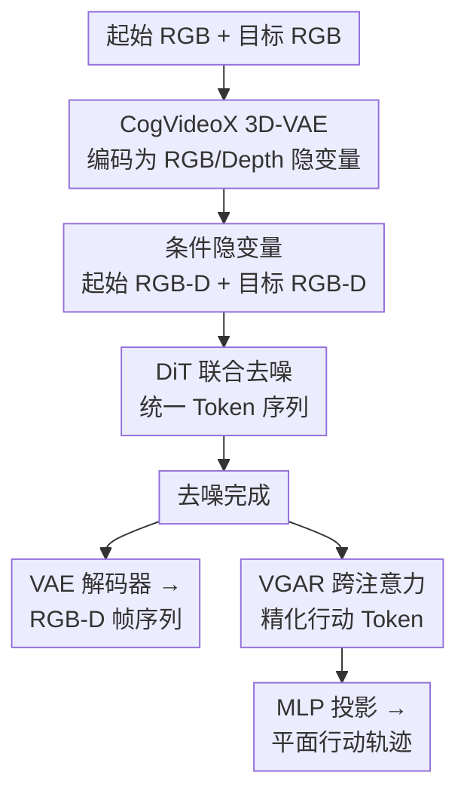

# Pondering the Way: Spatial-perceiving World Action Model for Embodied Navigation

**会议**: ECCV2026  
**arXiv**: [2606.29908](https://arxiv.org/abs/2606.29908)  
**代码**: 待确认  
**领域**: 机器人 / 具身智能  
**关键词**: 视觉导航, 世界模型, 联合生成, 扩散Transformer, 行动规划  

## 一句话总结
SWAM 提出将视觉导航中的轨迹规划与未来观测生成合二为一，用单次扩散推理从起始/目标 RGB 图像直接联合生成中间 RGB-D 帧序列和对应的行动轨迹，摒弃了传统"采样-验证"两阶段范式，在精度、效率和零样本泛化上全面超越基线。

## 研究背景与动机

具身导航要求智能体从当前观测出发，在给定目标图像的情况下规划一条可达路径。传统方法主要分两类：直接策略方法（如 NoMaD）端到端预测行动，推理快但缺乏对未来的显式想象，难从错误中恢复；基于世界模型的两阶段流水线则先从一个外部策略采样大量候选行动序列，用行动条件化的视频预测模型（如 NWM）展开每一段对应的视觉轨迹，再从中选出与目标最匹配的一条。后者的"验证-中心"范式虽然让路径选择有了模拟证据支撑，却从根本上割裂了目标意图与轨迹生成——决策质量受限于候选采样的覆盖度，长距离规划时需要穷举候选并逐条 rollout 导致推理负担极大（NWM+NoMaD 采样 16 条候选耗时 245 秒/样本），而且缺乏显式空间约束，生成的观测序列常出现突兀视角跳变或几何不可行轨迹。

本文提出的 SWAM 彻底改变了这一设计思路。核心 insight 在于：既然世界模型具备生成能力，何必把它降级为一个被动的验证器？如果让世界模型从一开始就同时生成"怎么走"和"会看到什么"，行动和观测在生成过程中相互约束，就能天然保证目标对齐、时间一致和空间可行性——而且一次推理搞定，不需要候选展开和反复评估。**核心 idea：SWAM 是一个基于扩散 Transformer 的联合观测-行动生成框架，给定起始和目标 RGB 图像，单次前向推理同时生成中间 RGB-D 观测序列和对应的平面行动轨迹，用深度伪标签在训练时注入空间先验，推理时仅需单目 RGB，从根上替代了"采样-验证"两阶段流水线。**

## 方法详解

### 整体框架

SWAM 构建在预训练视频生成模型 CogVideoX 的扩散 Transformer（DiT）之上，将其扩展为联合生成 RGB-D 观测帧和行动序列的导航规划器。传统两阶段方案（NWM+NoMaD）先采样候选行动再分别 rollout 视觉序列，而 SWAM 将所有信息编码为单一 token 序列，在扩散过程中同时去噪视觉和行动，一次推理产出全套规划结果。框架流程如下：

### 关键设计

**1. 联合观测-行动扩散框架：将行动和视觉统一为单条 token 序列进行联合扩散**

传统视频扩散模型只生成图像帧序列，SWAM 的创新在于把行动也编码成 token 加入扩散序列。具体来说，对每个采样时刻 $n$，RGB 图像和深度图分别用冻结的 CogVideoX 3D-VAE 编码为隐变量 $z_n^i, z_n^d$（空间尺寸 $h \times w$，维度 $d$），而行动 $a_n = (\Delta x_n, \Delta y_n)$ 则通过一个可学习的 MLP 投影为相同维度的行动 token $x^a$。这样，中间时刻的 RGB 隐变量序列、深度隐变量序列和行动 token 序列被拼接成一条统一 token 序列 $X_0$，作为扩散目标。起始帧和目标帧的 RGB-D 隐变量则作为条件信息，始终保持干净、不参与扩散。在去噪过程中，DiT 同时预测所有 token 的噪声残差，使得行动生成和视觉生成共享同一套隐空间表征——这保证了行动和观测在生成过程中相互协调，不会出现"路线在图里看是直的、但行动序列却是拐的"这种几何不一致。

**2. 视觉引导行动精化模块（VGAR）：用生成后的 RGB-D 证据二次修正行动 token**

扩散去噪完成后，视觉 token 和行动 token 在 DiT 最后一层已经各自成型，但直接对行动 token 做线性投影可能导致局部几何细节丢失。VGAR 模块在行动解码之前引入一个轻量级的门控残差跨注意力：让行动 token 作为查询（query）去关注视觉 token 的键值对，计算跨注意力输出 $C$，再通过一个门控机制 $G = \sigma(\text{MLP}([X_a; C]))$ 来控制视觉信息的注入量——$\Delta X_a = G \odot W(C)$，最终精化后的行动 token 为 $X_a' = X_a + \Delta X_a$。这个门控设计非常巧妙：如果当前行动 token 本身已经准确（如直行场景），门控值可以自动拉低，减少对视觉推测的过度依赖；如果行动 token 含糊（如路口的转弯决策），视觉帧中的空间线索就起主导作用。VGAR 不修改扩散主干，因此训练时可以端到端但不会干扰预训练特征的分布。

**3. 轨迹尺度正则化损失（TSR）：直接监督累积位移以消除长程漂移**

扩散损失 $\mathcal{L}_{\text{DDPM}}$ 单独作用在每一步的行动 token 上时，每个时间步的微小误差会随着轨迹积分累积，导致长距离规划时终点位置严重漂移。TSR 损失直接监督累积位移与真实目标位置的偏差：

$$\mathcal{L}_{\text{TSR}} = \frac{\|\hat{p}_N - p_G\|_2}{N}, \quad \hat{p}_N = \sum_{n=1}^N \hat{a}_n$$

其中 $\hat{p}_N$ 是预测轨迹的终点位置，$p_G$ 是目标真实位置，除以 $N$ 归一化使不同长度的轨迹损失可比。这个损失的意义在于：在局部去噪误差相近的多条预测序列中，TSR 会偏好那些虽然局部有小偏差但整体位移正确的轨迹，从而将"长程漂移"这个扩散模型容易忽视的问题变成了一个可直接优化的信号。组合损失为 $\mathcal{L} = \mathcal{L}_{\text{DDPM}} + \lambda_{\text{TSR}} \mathcal{L}_{\text{TSR}}$。

**4. 深度感知空间先验：训练时用深度伪标签注入几何约束，推理时仅需单目 RGB**

直接基于 RGB 的生成模型难以感知场景的几何结构（如障碍物在哪、地面起伏如何），这会导致生成的轨迹穿越不可通行区域。SWAM 的解决方案是在训练阶段引入 DepthAnything V3 为每一帧预测深度伪标签，将深度图和 RGB 图像并行编码为隐变量加入扩散序列。这样，模型在训练时学到的是"这个东西在三维空间里长什么样"的先验，而推理时只需要输入单目 RGB——深度分支只在训练时参与训练，推理时由模型自身生成深度帧。消融实验表明，仅添加深度分支就让 RECON 上的 ATE 从 2.09 降至 1.70，RPE 从 0.70 降至 0.47，说明几何感知对导航规划的提升是实质性的。

### 损失函数 / 训练策略

损失函数为扩散损失和 TSR 损失的加权组合：$\mathcal{L} = \mathcal{L}_{\text{DDPM}} + \lambda_{\text{TSR}} \mathcal{L}_{\text{TSR}}$。训练时，每次随机采样段长 $N \in \{9, 17, 33, 65\}$ 以支持变长预测，变长位置编码使用 RoPE 插值。模型从预训练的 CogVideoX 权重初始化，新增模块（深度分支、行动头、VGAR）全部用零初始化，确保初始状态与原始预训练模型行为完全一致。优化配置：Adam（lr=$1 \times 10^{-4}$），1000 步 warm-up，梯度裁剪最大范数 1.0，bf16 混合精度 + 梯度检查点。

## 实验关键数据

### 主实验

| 数据集 | 指标 | NWM+NoMaD (×16) | CogVideoX (Joint) | **SWAM（本文）** | 提升 |
|--------|------|:---:|:---:|:---:|:---:|
| RECON | ATE↓ | 1.53 | 2.09 | **0.93** | -39.2% |
| RECON | RPE↓ | 0.49 | 0.73 | **0.43** | -12.2% |
| SCAND | ATE↓ | 2.18 | 2.25 | **1.15** | -47.2% |
| SCAND | RPE↓ | 0.46 | 0.67 | **0.34** | -26.1% |
| TartanDrive | ATE↓ | 6.23 | 4.90 | **1.55** | -75.1% |
| TartanDrive | RPE↓ | 1.30 | 1.07 | **0.68** | -47.7% |
| 推理时间(s/样本) | - | 245.98 | 14.12 | **16.91** | -93.1% vs ×16 |

SWAM 在所有数据集上的 ATE/RPE 均大幅优于基线。值得注意的是，NWM+NoMaD 即使采样 16 条候选、消耗 245 秒，轨迹精度仍远不如 SWAM 一次推理（16.91 秒）的结果。TartanDrive（越野驾驶）上的 75.1% ATE 降幅尤其显著，说明深度先验在复杂地形下尤为有效。

### 零样本泛化

| 设定 | 模型 | ATE↓ | RPE↓ |
|------|------|:---:|:---:|
| HuRoN 训练 | NWM+NoMaD (×16) | 3.73 | 0.95 |
| **零样本（未在 HuRoN 上训练）** | **SWAM** | **2.94** | **0.85** |

SWAM 在从未见过的 HuRoN 数据集上零样本推理，ATE 反而低于在 HuRoN 上训练过的 NWM+NoMaD（2.94 vs 3.73），下降 21.2%，展现了极强的跨场景泛化能力。

### 消融实验

| 配置 | RECON ATE↓ | SCAND ATE↓ | TartanDrive ATE↓ |
|------|:---:|:---:|:---:|
| 基线（CogVideoX joint） | 2.09 | 2.25 | 4.90 |
| + Depth | 1.70 | 2.27 | 4.61 |
| + TSR | 2.06 | 1.63 | 2.63 |
| + Depth + TSR | 1.01 | 1.12 | 1.94 |
| + Depth + TSR + VGAR（完整模型） | **0.94** | **1.15** | **1.55** |

消融结论：TSR 对 TartanDrive 长程场景的贡献最大（4.90→2.63），深度分支在结构化环境（RECON）中最为关键，VGAR 则在所有场景上提供一致的边际改进。三个组件相互补充而非冗余。

### 关键发现
- TSR 损失是消除长程漂移的关键，尤其对 TartanDrive 这类存在强烈前向运动偏置的越野场景效果极为显著——单独 TSR 就让 ATE 从 4.90 降至 2.63
- 深度先验带来的几何约束在结构化环境（RECON/SCAND）中效果优于非结构化环境（TartanDrive），因为深度估计在野外地形中本身噪声更大
- SWAM 的主要失败模式集中在"歧义草丛"（将可通行植被误判为障碍物）和"急转弯"（平面位移行动表示无法捕捉快速方向变化），作者计划在未来引入语义可通行性推理和更丰富的行动表示

## 亮点与洞察
- **联合生成范式**：将"采样-验证-选择"解耦流水线压缩为一次联合扩散推理，是导航世界模型领域的一次范式切换——不是增量改进，而是从根本上改变了行动和观测的交互方式
- **TSR 损失巧妙而简单**：不修改扩散主干的训练流程，只在损失函数上加一项全局位移约束，就解决了扩散模型在长程规划中的累积漂移问题，这个思路可迁移到其他序列生成任务
- **零初始化新模块**：新加模块全部零初始化，确保训练开始时模型行为与预训练状态完全一致，渐进式学习新模态，是实用的迁移训练技巧
- **VGAR 门控设计**：用门控机制自动调节视觉证据的注入强度，避免在行动 token 已经准确时过度干扰，体现了"只在需要时让视觉介入"的优雅思路

## 局限与展望
- 歧义草丛场景的误判暴露了缺乏语义可通行性推理的短板——仅靠深度无法区分"软"植被和"硬"障碍物，需要融合语义分割或语言引导
- 平面位移（$(\Delta x, \Delta y)$）行动表示在急转弯场景下信息量不足，无法编码朝向变化，未来需要扩展为包含朝向角的表示
- 当前框架生成固定长度序列（8 步），虽然通过变长训练策略初步支持了更长规划，但严格来说还不是毫秒级在线闭环规划器——从视频生成到实时导航控制还有工程距离

## 相关工作与启发
- **vs NWM（Navigation World Model）**：NWM 是一个行动条件化的视频预测世界模型，走"生成候选行动 → 展开视频 → 排序选择"的两阶段路线。SWAM 将其变为联合生成，同等精度下推理速度快一个数量级
- **vs CogVideoX（联合基线）**：作者专门构建了一个以 CogVideoX 为背板的联合 RGB-行动生成基线作为公平对比，SWAM 在其上添加深度、TSR、VGAR 后全面超越，证明了导航专用设计而非通用视频生成能力才是提升关键
- **vs NoMaD / GNM**：直接策略方法（如 NoMaD）端到端输出行动，推理极快（~0.2s）但缺乏对未来观测的模拟能力，SWAM 用略多的推理时间换来了大幅的轨迹精度提升和零样本泛化能力

## 评分
- 新颖性: ⭐⭐⭐⭐⭐ 将导航世界模型的范式从"验证中心"转为"联合生成"，三个设计组合（联合扩散 + VGAR 门控 + TSR 损失）完整且必要
- 实验充分度: ⭐⭐⭐⭐⭐ 4 个数据集 + 零样本泛化 + 详尽的消融分析 + 失败模式分析，对比基线包含 NWM+NoMaD 多个采样量级和公平的 CogVideoX 统一背板基线
- 写作质量: ⭐⭐⭐⭐ 动机清晰、方法表述规范，图文丰富；代码未开源且附录中的失败案例分析可再深入
- 价值: ⭐⭐⭐⭐⭐ 导航世界模型领域的明确 SOTA，联合生成范式具有跨任务（如机械臂操作）的迁移潜力，TSR 损失可迁移到其他序列生成任务

<!-- RELATED:START -->

## 相关论文

- [\[ECCV 2026\] NavWM: A Unified Navigation World Model for Foresight-Driven Planning](navwm_a_unified_navigation_world_model_for_foresight-driven_planning.md)
- [\[CVPR 2026\] Motus: A Unified Latent Action World Model](../../CVPR2026/robotics/motus_a_unified_latent_action_world_model.md)
- [\[ICLR 2026\] Embodied Navigation Foundation Model](../../ICLR2026/robotics/embodied_navigation_foundation_model.md)
- [\[ICML 2026\] Dual-Stream Diffusion for World-Model Augmented Vision-Language-Action Model](../../ICML2026/robotics/dual-stream_diffusion_for_world-model_augmented_vision-language-action_model.md)
- [\[ECCV 2026\] A scalar per patch from pre-trained ViTs enables fast moving navigation in the real world](a_scalar_per_patch_from_pre-trained_vits_enables_fast_moving_navigation_in_the_r.md)

<!-- RELATED:END -->
