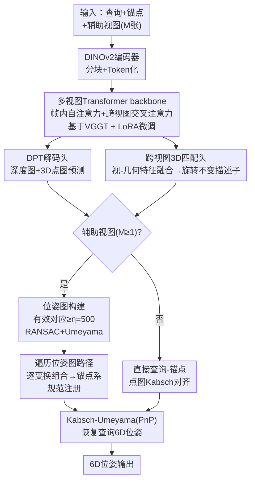

# Pose Anything Anywhere: Model-free Object Poses from Arbitrary References

**会议**: ECCV2026  
**arXiv**: [2606.23634](https://arxiv.org/abs/2606.23634)  
**代码**: 无  
**领域**: 机器人 / 3D视觉  
**关键词**: 6D姿态估计, 无模型位姿估计, 多视图几何, 跨视图特征匹配, 机器人感知

## 一句话总结
PANY提出统一的无模型6D位姿估计框架，将多视图几何推理与跨视图对应学习联合端到端训练，从任意数量的稀疏参考图（含可选无位姿辅助视图）中直接估计未见物体的6D位姿，无需CAD模型或预注册，在YCB-V、LM-O等基准上大幅超越此前方法。

## 研究背景与动机

开放世界机器人要求在无先验条件下感知从未见过的物体并完成抓取、放置等操作，其中关键前提是估计物体的6D位姿。现有方法大致分为三条路线：基于模型的管线（如FoundPose、RayPose）依赖精确CAD模板生成渲染图来匹配位姿，精度虽高但每遇新物体都要获取CAD，规模化部署成本极高；「重建优先」路线（如OnePose++、FoundationPose）走多视图重建加基于模型位姿求解器，但需要密集有姿态的图像序列，注册耗时长，不适合快速上线新物体；成对无模型匹配方法（如One2Any、SingRef6D）仅用一张参考图与查询做稠密对应或位姿回归，依赖单视图信息，在遮挡严重或视角发生大跳变时参考与查询之间的视觉重叠极低，问题本身变得病态——单张照片本质上无法覆盖物体被挡住的那一面。

这一困境的核心矛盾在于：实际用户最容易提供的是少量随手拍的照片（无位姿信息、甚至只有一两张），但当前方法在面对大视角变化和重度遮挡时，单张参考图携带的几何信息远远不足以消除位姿歧义。多视图约束显然能降低不确定性，可传统多视图几何管线要求密集序列加已知位姿加显式3D重建，在开放世界场景下又太过苛刻。本文的切入思路是让模型在训练阶段学会从多视图输入中联合推理几何结构和跨视图对应关系，从而在推理时既能从单张参考图直接估计位姿，也可灵活利用任意数量的无位姿「辅助视图」——这些辅助视图充当中间桥梁，弥合查询与锚点视图之间的宽基线间隙。**核心idea：将多视图几何推理backbone与跨视图3D对应学习统一端到端训练，使模型在推理时既支持单参考直接匹配，也能利用无位姿辅助视图通过位姿图规范注册逐步对齐到锚点坐标系，从而在遮挡和大视角变化下显著提升位姿鲁棒性。**

## 方法详解

### 整体框架

PANY输入包含三部分：一张查询图、一张定义了物体规范位姿的锚点参考图、以及零到多张无任何位姿标注的辅助视图。所有视图先通过共享的DINOv2编码器分块(tokenize)，送入基于VGGT的多视图Transformer backbone。该backbone交替执行帧内自注意力（每视图内捕捉局部外观）和跨视图交叉注意力（所有视图间建立几何关联），输出每视图的视觉嵌入，再经DPT上采样头预测深度图和3D点图。与此同时，跨视图3D匹配头将视觉特征与几何特征融合为旋转不变的3D描述子，通过局部对比学习建立跨视图的稠密3D对应。推理阶段，当查询与锚点之间视觉重叠不足时，辅助视图通过位姿图注册流程逐步组合对齐到锚点坐标系；重叠充足时直接执行查询-锚点点图对齐。最终使用Kabsch-Umeyama（RGB-D输入）或PnP（仅RGB输入）恢复查询位姿。

### 关键设计

**1. 多视图几何推理Backbone：从场景级几何基座模型适配到物体中心规范对齐**

PANY以VGGT为几何基座模型，其原生能力是从多张无位姿RGB图联合预测每帧的深度图、点图和相机参数。但VGGT是为场景级跟踪式监督训练的，输出表征存在视角依赖性——同一个3D点在两张视角差异大的图中落在不同的相对坐标系下，这在需要跨视图一致性对齐的物体级位姿估计中是致命缺陷。PANY的改进策略是冻结VGGT backbone、仅通过LoRA（rank=8, alpha=32）微调，同时新增跨视图匹配头作为额外监督信号。训练时每样本随机选取2-8张参考视图（共3-9张输入）覆盖各种视角组合，通过匹配头的对比学习强制不同视角下对应点的描述子在共享3D空间中靠近，使backbone在联合优化中逐渐消除视角依赖性，输出的点图天然对齐在共享坐标系中。这种训练策略让模型学会了处理任意数量的视图输入，为推理时的灵活适配打下基础。

**2. 跨视图3D匹配与几何感知特征融合：用局部对比学习建立宽基线下的鲁棒对应**

仅有预测的点图不足以应对大视角变化下的稠密匹配。PANY设计了一个跨视图3D匹配模块：先为每张视图的点图通过几何编码器提取旋转不变几何特征（使用旋转不变的positional embedding），同时将视觉backbone的像素级特征通过坐标索引提升到3D空间使两个模态对齐，两者融合为几何感知token；再送入一个交错使用稀疏几何注意力和稠密线性注意力的几何Transformer，输出旋转不变的3D描述子。训练时对所有有效视图对计算注意力矩阵 $A_{ij}=F_i^m(F_j^m)^\top$，用双向交叉熵损失 $\mathcal{L}_{ij}=\mathrm{CE}(A_{ij},\hat{Y}_i)+\mathrm{CE}(A_{ij}^\top,\hat{Y}_j)$ 监督对应关系。对应标签由共享坐标系中最近邻距离阈值（$\delta_\text{dis}$）定义，距离以内的点才有有效对应。这一设计的巧妙之处在于匹配不是在2D图像平面进行，而是在模型预测的共享3D点图空间中进行，天然不受视角变化的投影畸变影响，且旋转不变特征使匹配对纹理和光照变化也保持鲁棒。

**3. 位姿图规范注册：无位姿辅助视图充当宽基线桥梁**

这是PANY推理时的关键机制。当查询与锚点之间视觉重叠极少时（如物体正面与背面），直接匹配几乎不可能。PANY利用用户提供的无位姿辅助视图作为几何信息传递的中间桥梁：所有视图经backbone预测出点图和匹配描述子后，构建一个以视图/点云为节点、以有效对应数超过阈值（$\eta=500$）为边的位姿图 $\mathcal{G}=(\mathcal{V},\mathcal{E})$；对每条边用RANSAC+Umeyama稳健估计相似变换 $\mathbf{T}_{i\leftarrow j}$；然后从锚点节点出发沿位姿图路径组合变换 $\mathbf{T}_{i\rightarrow A}=\prod_{(k,l)\in\pi(i,A)}\mathbf{T}_{k\leftarrow l}$，将所有辅助视图的点云变换到锚点坐标系下注册为 $P̃_i=\mathbf{T}_{i\rightarrow A}\hat{P}_i$。这使得即使在没有任何单张参考视图与查询充分重叠的条件下，通过多视图「接力」逐步传递几何信息，也能可靠恢复查询位姿。实验显示仅需4张辅助视图性能即基本饱和，说明几何覆盖的增量确实有效消除了视角不确定性。

### 损失函数与训练策略

训练目标由三部分联合优化组成：深度回归L1损失 $\mathcal{L}_\text{depth}$、点图回归L1损失 $\mathcal{L}_\text{point}$、跨视图匹配双向交叉熵损失 $\mathcal{L}_\text{match}$，总体损失 $\mathcal{L}=\lambda_d\mathcal{L}_\text{depth}+\lambda_p\mathcal{L}_\text{point}+\lambda_m\mathcal{L}_\text{match}$，权重设为 $\lambda_d=1.0, \lambda_p=1.0, \lambda_m=0.05$。匹配损失的权重较低是因为其梯度信号来自于注意力矩阵的对比性质而非回归压力。在合成Omni6DPose数据集（5000+ CAD物体、149个类别、200万+ RGB-D图像）上训练15个epoch，每epoch 500次迭代，batch size 16，双A100约36小时。

## 实验关键数据

### 主实验结果

| 数据集 | 模态 | 配置 | 指标 | PANY | 之前SOTA | 提升 |
|--------|------|------|------|------|----------|------|
| YCB-V | RGB | 单参考 | ADD AUC | **92.5%** | 84.4% (One2Any) | +8.1% |
| YCB-V | RGB | 1锚点+8辅助 | ADD AUC | **94.6%** | 84.4% (One2Any) | +10.2% |
| LINEMOD | RGB | 单参考 | ADD-0.1d | **55.3%** | 52.6% (One2Any) | +2.7% |
| LINEMOD | RGB | 1锚点+8辅助 | ADD-0.1d | **87.4%** | 52.6% (One2Any) | +34.8% |
| Real275 | RGB-D | 单参考 | AR | **81.8%** | 54.9% (One2Any) | +26.9% |
| Real275 | RGB-D | 单参考 | ADD-0.1d | **89.3%** | 53.5% (Any6D) | +35.8% |
| Toyota-Light | RGB-D | 单参考 | AR | **51.1%** | 43.3% (Any6D) | +7.8% |
| LM-O (CNOS mask) | RGB | 1锚点+8辅助 | AR | **42.3%** | 39.7% (FoundPose* 8锚点) | +2.6% |

*注：FoundPose* 为文献在同等条件下复现的结果，使用8张有姿态锚点视图；PANY的辅助视图无位姿标注。

### 消融实验

**设计消融（Real275, 单锚点无辅助视图）：**

| 配置 | AR | ADD-0.1d | 说明 |
|------|-----|----------|------|
| 纯几何（无匹配头） | 56.6% | 23.6% | 直接Kabsch对齐预测点图 |
| +视觉匹配（无几何融合） | 57.6% | 25.4% | 仅视觉embedding做匹配 |
| 完整模型（匹配+几何融合） | **59.3%** | **27.8%** | 几何感知特征融合 |

**Backbone消融（同设置）：**

| 配置 | AR | ADD-0.1d | 说明 |
|------|-----|----------|------|
| pure DUSt3R | 27.8% | 16.8% | 替换backbone+同求解器 |
| pure MASt3R | 29.2% | 17.6% | 同上 |
| pure VGGT | 43.6% | 33.4% | 同上 |
| Ours Full | **51.1%** | **39.8%** | 完整系统 |

### 关键发现

- 匹配头+几何特征融合贡献最大：相比纯几何基线，完整模型的ADD-0.1d从23.6%提升至27.8%（表4b），且与backbone-only的VGGT基线（33.4%→完整39.8%，表4a）对比说明增益源自匹配头设计而非backbone替换。
- 辅助视图数量在4张时性能趋于饱和，默认8张已充分；锚点视图的选择对最终结果影响极小，表明方法是锚点鲁棒的。
- 在LM-O（CNOS mask）上，PANY仅用1锚点+8无位姿辅助视图就超越了使用密集CAD模板的模型方法（FoundPose 39.7%→PANY 42.3%），证明了无模型方案在仅有稀疏参考条件下的竞争力。

## 亮点与洞察

- **视角解耦的几何特征**：将视觉特征提升到预测的3D点图空间并通过对比学习强制视角一致性，避免了2D特征在大视角变化下的匹配退化——这是PANY在单参考设置下仍大幅领先One2Any的核心原因。
- **辅助视图的「桥梁」思维**：不要求辅助视图有位姿标注，仅作为几何信息传递的中介；这与传统方法要求密集有姿态序列形成鲜明对比，更贴近真实用户习惯。
- **训练-推理弹性设计**：训练时用3-9张随机视图，推理时灵活适配任意数量（1+M张）。这种策略使模型同时学会了处理信息冗余和信息稀疏两种极端情况。
- **位姿图注册**将N视图对齐问题转化为视图对变换的组合，RANSAC剔除错误对应、Umeyama估计刚性变换，在保持精度的同时具有良好的可扩展性。

## 局限与展望

- 极端遮挡或查询-参考重叠极小（如物体仅呈一条边缘）时仍可能失败，此时即使多视图接力也无法建立有效对应。
- 对称物体（如无特征的圆柱体）的位姿歧义仍未解决：几何线索不足以分辨朝向，需引入语义先验或对称性假设。
- 当前依赖CNOS等外部检测器提供分割mask，端到端联合检测加定位是自然延伸方向。
- 以LoRA微调VGGT可能限制了在新领域上的泛化上限，未来可探索更大参数空间或无Adapter的架构。

## 相关工作与启发

- **vs One2Any**：One2Any通过单参考预测ROC（参考物体坐标）图做RGB-D匹配，在单参考场景有竞争力；PANY的多视图推理使其在遮挡和大视角变化下达到几乎两倍精度（如YCB-V ADD AUC从84.4%到92.5%）。
- **vs FoundPose/RayPose**：它们是模型方法，依赖CAD模板或渲染对比；PANY彻底摆脱CAD，适用于零准备的新物体。
- **vs VGGT/DUSt3R**：场景级几何基座模型输出的点图存在视角依赖性，PANY通过跨视图对比学习将其适配为物体中心的规范对齐。

## 评分
- 新颖性: ⭐⭐⭐⭐⭐ 首次将多视图几何推理与跨视图对应学习统一为无模型位姿估计框架，无需CAD、无需密集有姿态序列，同时支持单参考和稀疏多参考，是领域内难得的一步到位方案。
- 实验充分度: ⭐⭐⭐⭐⭐ 在5个真实世界基准上验证，覆盖单参考/多参考、RGB/RGB-D、CNOS mask/GT mask等多种配置，消融完备有力。
- 写作质量: ⭐⭐⭐☆☆ 技术内容完整，方法节结构清晰，但引言和动机部分篇幅偏长，可以更凝练。
- 价值: ⭐⭐⭐⭐⭐ 大幅降低了开放世界机器人部署中位姿估计的准备门槛，实际应用前景广阔。

<!-- RELATED:START -->

## 相关论文

- [\[CVPR 2025\] Hearing Anywhere in Any Environment](../../CVPR2025/robotics/hearing_anywhere_in_any_environment.md)
- [\[ICLR 2026\] Learning to Grasp Anything By Playing with Random Toys](../../ICLR2026/robotics/learning_to_grasp_anything_by_playing_with_random_toys.md)
- [\[CVPR 2026\] UAST: Unified Active Search and Tracking for Arbitrary Targets with UAVs](../../CVPR2026/robotics/uast_unified_active_search_and_tracking_for_arbitrary_targets_with_uavs.md)
- [\[CVPR 2026\] Towards Training-Free Scene Text Editing](../../CVPR2026/robotics/towards_training-free_scene_text_editing.md)
- [\[NeurIPS 2025\] Learning Interactive World Model for Object-Centric Reinforcement Learning](../../NeurIPS2025/robotics/learning_interactive_world_model_for_object-centric_reinforcement_learning.md)

<!-- RELATED:END -->
