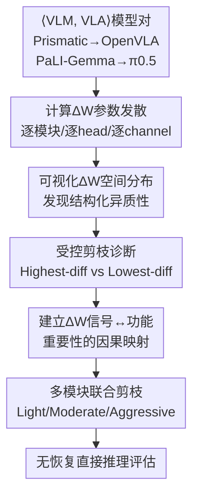

# Revisiting Parameter Redundancy in Vision-Language-Action Models: Insights from VLM-to-VLA Adaptation

**会议**: ECCV 2026  
**arXiv**: [2606.31382](https://arxiv.org/abs/2606.31382)  
**代码**: [https://github.com/Niannnnnn/VLA_Parameter_Redundancy_VLM2VLA](https://github.com/Niannnnnn/VLA_Parameter_Redundancy_VLM2VLA)  
**领域**: 机器人/具身智能 / 模型压缩  
**关键词**: VLA模型, 参数冗余, 剪枝, VLM-to-VLA adaption, 模块异质性, 无需恢复剪枝

## 一句话总结
本文重新审视VLA模型的参数冗余问题，发现现有"剪枝后微调恢复"的范式掩盖了对关键参数的误删；作者提出以VLM到VLA adaption过程中的参数变化量(ΔW)作为冗余判据，通过受控剪枝诊断实验揭示不同模块的ΔW信号具有强烈异质性，据此设计多模块联合剪枝方案，在OpenVLA和π0.5上实现12%-30%参数量缩减且无需任何后剪枝恢复即保持约90%原始性能。

## 研究背景与动机
VLA模型通过在大规模预训练VLM上adapt到机器人控制任务，继承VLM的跨模态表征能力，在具身智能领域取得显著进展。然而，VLA模型参数规模庞大，计算和存储开销严重，且在参数剪枝上表现出极端敏感性——即使中等比例的剪枝也会导致任务成功率"断崖式下跌"，模型行为近乎完全失效。

现有主流策略对此采取实用主义态度：把剪枝后的性能退化视为不可避免的副作用，通过微调或低秩adapt来"修复"。一个剪枝方法只要在恢复阶段将性能拉回可接受水平，就被认为"成功"。本文从根本上质疑这一前提：如果一个被剪枝的VLA模型必须重新学习才能恢复功能，那么被移除的参数真的冗余吗？作者认为，对性能恢复的普遍依赖掩盖了一个更关键的问题——现有剪枝标准实际上在"无差别误杀"关键参数，而非真正识别冗余。

核心洞察是：VLA的参数冗余不等同于传统CNN或LLM的参数冗余。VLA不是在一个单一任务分布上端到端训练出来的，而是通过从通用视觉-语言理解到机器人控制的**结构化adapt过程**构建的。在这个过程中，参数被选择性地复用、重加权或稳定化，以支撑面向动作的计算路径。因此，VLM-to-VLA adaption过程中的参数变化(ΔW)不是随机噪声，而是携带着关于参数功能重要性的结构化信号——这一信号可以成为精准识别冗余的钥匙。

## 方法详解

### 整体框架
本文的方法论核心不是直接提出一个剪枝算法，而是**将VLA参数剪枝从优化问题重构为分析问题**。作者构建了一套完整的诊断框架：首先量化VLM到VLA adaption过程中的参数发散(ΔW)的空间分布模式，然后引入受控剪枝作为诊断探针——通过比较移除不同ΔW特征的参数子集对VLA性能的直接影响（不做任何微调），建立adapt信号与功能贡献之间的因果联系，最后基于发现的模块异质性设计多模块联合剪枝方案。整个框架围绕四个层层递进的假设验证展开。

### 关键设计

**1. 受控剪枝作为诊断探针：从"怎么恢复"到"是否真冗余"**

现有剪枝方法将性能恢复视为剪枝流程的标配环节，等式为 $f(\cdot; \mathcal{T}(\mathcal{P}(W; M)))$——最终评估的模型已不是剪枝后参数自身支撑的能力，而是模型在结构扰动下重新学习和自我重建的结果。作者指出这带来根本性问题：如果一个剪枝干预必须依赖显式性能恢复才能奏效，被移除的参数就不可能真冗余。

因此，作者将剪枝重定义为分析手段而非优化目标：对目标模块按给定比例 $r$ 构造两种互补掩码——$M^{\text{high}}(r)$ 保留 $|\Delta W|$ 最大的参数（Highest-diff剪枝）、$M^{\text{low}}(r)$ 保留 $|\Delta W|$ 最小的参数（Lowest-diff剪枝），然后**直接评估剪枝后模型的推理行为，不做任何微调**。如果两种策略的性能存在显著差异，则说明 $\Delta W$ 信号确实包含参数重要性的有效信息；如果Highest-diff剪枝反而保持高性能而Lowest-diff剪枝导致崩溃，则说明高变化参数才是功能核心——这与传统"变化小=冗余"的直觉相反。算法中，对于LLM FFN等多矩阵模块，需要在gate/up/down投影间对齐channel维度，对Attention则聚合到head级别再排名，确保剪枝粒度为结构化单元（head/channel）而非单个权重。

**2. ΔW作为结构化信号：模块异质性的发现**

作者在两组代表性模型对上可视化 $\Delta W_{\text{rel}} = \|W^{\text{VLA}} - W^{\text{VLM}}\|_2 / \|W^{\text{VLM}}\|_2$ 的空间分布。在OpenVLA(Prismatic-based)中，Llama 2语言模型的参数更新呈现清晰的"三段式"垂直分布：初始层(L0)密集校准以处理多模态融合后的token注入，中间层(L1-L23)相对稳定，末端层(L24-L31)再次活跃以映射到动作语义空间；FFN模块中观察到明显的层间波动和channel维度的"条纹状"稀疏性，说明具身知识编码在特定子channel而非均匀分布。视觉backbone中，DINOv2的更新集中在浅层（低层视觉线索如抓取和避障），SigLIP的响应则在深层更强（补充语义信息对齐语言模型）。Projector的FFN结构呈单调递增，靠近语言模型入口的映射层(fc2, fc3)变化远大于初层(fc1)。

在π0.5(PaLI-Gemma-based)中，模块化设计使演化模式更规整：Gemma语言模型的Multi-Query Attention在head维度展现高判别信号，中间层(L1-L9)发散最大（功能重定向到具身任务attention），高层趋于稳定；视觉塔的FFN在中高层展示强发散信号。这些系统化观察指向一个关键结论：VLM-to-VLA adaption中的参数更新不是随机噪声，而是Attention head选择性重组和FFN channel局部激活上的强结构化异质性——这正是打破"剪枝即崩溃"瓶颈的经验基础。

**3. 模块功能角色的差异化剪枝逻辑**

受控剪枝实验揭示了三个典型模块类型，每种需要截然不同的剪枝策略：

- **语言backbone的Attention和FFN**：Highest-diff剪枝后保持高性能（Llama2 Attention 84.3% SR, Gemma FFN 95.0% SR），Lowest-diff剪枝后性能崩溃（0.0%和5.0%）。说明在语言backbone中，adapt过程中变化最大的参数恰好是动作决策的核心功能承载者——应保留高ΔW、剪除低ΔW。
- **DINOv2视觉编码器**：呈现"灵敏度反转"——Attention head中Highest-diff剪枝导致崩溃(1.6%)而Lowest-diff保持(76.7%)，FFN channel则相反（Highest-diff 82.0%, Lowest-diff 0.0%）。表明同一backbone内部，Attention和FFN的功能重要性依赖于不同的计算路径，Attention中稳定的head反而是关键。因此DINOv2的Attention应剪高ΔW、FFN应剪低ΔW。
- **Projector和SigLIP**：Projector在0.3剪枝比下两种策略均崩溃(0.0%/54.0%)，是"脆弱且无选择性"的跨模态对齐瓶颈，必须严格保护。SigLIP在剪枝比1.0(完全移除)下仍保持47%-70% SR，表现出极端鲁棒性——它只是辅助语义补充，可激进剪枝。

### 一个完整示例：OpenVLA的多模块联合剪枝推演

以OpenVLA在LIBERO-Spatial上的Moderate配置为例：总参数量从7.5B降至6.2B，显存从14.9GB降至12.4GB。剪枝配置为——Llama2 Attention: 剪Highest-diff 12.5%（保留adapt后变化最大的attention head，它们承载动作决策核心）；Llama2 FFN: 剪Highest-diff 20%（保留高ΔW channel，它们是具身知识编码的载体）；DINOv2 Attention: 剪Lowest-diff 6.25%（保留稳定head，它们是主要结构表征的关键）；DINOv2 FFN: 剪Highest-diff 10%（保留adapt中激活的功能channel）；SigLIP Attention: 剪Highest-diff 12.5%（辅助语义补充，可激进剪）；SigLIP FFN: 剪Lowest-diff 10%（利用其鲁棒性）；Projector: 0%剪枝（脆弱瓶颈，严格保护）。所有剪枝完成后直接推理，不做任何LoRA微调或RL恢复，最终得到62.3%平均SR，相比基线76.5%仅下降14.2个百分点，而同等参数量的LLM-Pruner在同条件下仅为1.0%。

### 损失函数 / 训练策略
本文不引入额外训练目标。核心实验为无恢复剪枝后的直接推理评估，不涉及任何微调。在验证假设I的对照实验中，LoRA微调采用FSDP分布式策略、10k步、学习率1e-4，仅用于证明"恢复补偿效应"的存在，不是本文主张的方法组成部分。

## 实验关键数据

### 主实验

**表1：OpenVLA多模块联合剪枝 vs 现有剪枝方法（LIBERO benchmark，无恢复直接推理）**

| 模型 | 参数量(B) | 显存(GB) | Spatial | Object | Goal | Long | 平均SR | vs基线 |
|------|-----------|----------|---------|--------|------|------|--------|--------|
| OpenVLA (Baseline) | 7.5 | 14.9 | 84.7 | 88.4 | 79.2 | 53.7 | 76.5 | +0.0 |
| LLM-Pruner | 6.2 | 12.4 | 23.4 | - | - | 1.0 | - | - |
| FLAP | 6.3 | 12.5 | 0.2 | - | - | 0.0 | - | - |
| Wanda (Full Sparse) | - | 10.2 | 0.0 | 13.4 | 0.8 | 0.0 | 7.1 | -69.4 |
| Wanda (Sparse Lang.) | - | 10.6 | 31.2 | 50.8 | 20.0 | 12.4 | 28.6 | -47.9 |
| **Ours-Light** | 6.6 | 13.0 | 78.3 | 82.5 | 74.0 | 46.8 | 70.4 | -6.1 |
| **Ours-Moderate** | 6.2 | 12.4 | 70.5 | 74.9 | 64.7 | 39.0 | 62.3 | -14.2 |
| **Ours-Aggressive** | 5.7 | 11.3 | 59.0 | 65.7 | 56.0 | 29.5 | 52.5 | -24.0 |

关键发现：在同等参数量约6.2B/12.4GB显存的匹配比较下，本文Moderate配置保持62.3%平均SR，而LLM-Pruner仅1.0%——这个约60个百分点的差距说明传统剪枝度量在VLA场景下完全失效，因为它们无差别地移除了正在经历功能重组的关键参数。Wanda即使在稀疏化程度更浅(12.0GB)的情况下也不过26.7%，且其结构化变体均出现灾难性崩溃。

**表2：π0.5多模块联合剪枝结果（LIBERO benchmark，无恢复直接推理）**

| 模型 | 参数量(B) | 显存(GB) | Spatial | Object | Goal | Long | 平均SR | vs基线 |
|------|-----------|----------|---------|--------|------|------|--------|--------|
| π0.5 (Baseline) | 3.6 | 7.3 | 98.8 | 98.2 | 98.0 | 92.4 | 96.9 | +0.0 |
| Ours-Light | 3.0 | 6.1 | 95.5 | 94.0 | 95.0 | 88.5 | 93.3 | -3.6 |
| Ours-Moderate | 2.8 | 5.6 | 90.7 | 90.1 | 91.3 | 84.0 | 89.0 | -7.9 |
| Ours-Aggressive | 2.5 | 5.0 | 83.6 | 83.0 | 84.5 | 77.1 | 82.1 | -14.8 |

π0.5的Moderate方案显存从7.3GB降至5.6GB，平均SR仅从96.9%偏移到89.0%，证明模块差异性剪枝逻辑在不同VLA架构间的泛化性。

### 消融实验

**表3：假设I验证——剪枝后微调恢复的"强补偿"效应（OpenVLA, Llama2 FFN, LIBERO-Spatial, 基线SR=84.7%）**

| 剪枝策略 | 比例(%) | 剪枝后SR(%) | 微调后SR(%) |
|----------|---------|-------------|-------------|
| Lowest-diff | 20 | 1.5 | 86.5 |
| Lowest-diff | 50 | 0.0 | 81.0 |
| Lowest-diff | 80 | 0.0 | 76.4 |
| Highest-diff | 20 | 76.3 | 85.8 |
| Highest-diff | 50 | 20.5 | 84.1 |
| Highest-diff | 80 | 0.0 | 80.7 |
| Random | 20 | 12.2 | 86.0 |
| Random | 50 | 0.0 | 82.2 |
| Random | 80 | 0.0 | 77.6 |

核心发现：移除低ΔW channel(Lowest-diff)在直接评估中导致完全崩溃(1.5%/0.0%/0.0%)，但LoRA微调将所有配置恢复到甚至超过基线水平——包括从0.0% SR恢复的配置。这种"强补偿"效应证明了现有范式确实在修复"参数误删"造成的结构性损伤。此外，恢复所需的收敛步数随剪枝比例递增（Fig.3），说明更高剪枝比引入更深的结构扰动。这直接支持假设I：依赖恢复等同于对误删参数的修复，有效的冗余识别必须在无需恢复的条件下维持核心功能。

**表4：假设II&III验证——ΔW信号有效性及其跨模块异质性（LIBERO-Spatial）**

| 模型 | 模块 | 子模块 | 剪枝比 | High-diff SR(%) | Low-diff SR(%) |
|------|------|--------|--------|-----------------|-----------------|
| OpenVLA | Vision | DINOv2 Attn(head) | 0.125 | 1.6 | 76.7 |
| OpenVLA | Vision | DINOv2 FFN(channel) | 0.20 | 82.0 | 0.0 |
| OpenVLA | Vision | SigLIP Attn(head) | 0.125 | 83.4 | 80.7 |
| OpenVLA | Vision | SigLIP FFN(channel) | 0.20 | 75.1 | 81.7 |
| OpenVLA | Language | Llama2 Attn(head) | 0.125 | 84.3 | 0.0 |
| OpenVLA | Language | Llama2 FFN(channel) | 0.20 | 72.0 | 2.7 |
| OpenVLA | Projector | FFN(channel) | 0.30 | 0.0 | 54.0 |
| π0.5 | Language | Gemma Attn(head) | 0.20 | 85.0 | 0.0 |
| π0.5 | Language | Gemma FFN(channel) | 0.50 | 95.0 | 5.0 |
| π0.5 | Vision | SigLIP Attn(head) | 0.20 | 90.0 | 55.0 |
| π0.5 | Vision | SigLIP FFN(channel) | 0.50 | 95.0 | 15.0 |

DINOv2的"灵敏度反转"（Attn High-diff崩溃1.6%/FFN Low-diff崩溃0.0%）是最关键的发现——同一backbone内部不同计算路径的功能重要性逻辑完全不同。Llama2和Gemma的语言模块在两个模型上表现一致：Low-diff剪枝总是导致崩溃（0.0%），High-diff剪枝保持高性能（84.3%/95.0%）。SigLIP的ΔW信号区分度较弱（High/Low差距仅2.7-10个百分点），与其语义补充角色一致。Projector在0.3剪枝比下High-diff完全崩溃(0.0%)、Low-diff勉强维持(54.0%)，证明它是"脆弱无选择性"的对齐瓶颈。跨模型的泛化验证显示，π0在RoboTwin2.0五个任务上的High-ΔW剪枝(平均47.4)远优于Low-ΔW(平均10.6)，进一步确认ΔW信号的跨benchmark有效性。

### 关键发现
- **ΔW信号不是全局重要性度量，而是高度模块特异化的**：语言backbone中高ΔW=重要（保留高ΔW），DINOv2 Attention中低ΔW=重要（保留低ΔW），DINOv2 FFN中高ΔW=重要（保留高ΔW），SigLIP中ΔW几乎无区分力，Projector中任何剪枝都会崩溃。不存在统一的"高变化=冗余"或"低变化=冗余"规则。
- **恢复范式的"强补偿"效应覆盖一切剪枝错误**：即使从0.0% SR出发，LoRA也能恢复到基线以上——这意味着以恢复后性能评判剪枝质量完全不可靠，它衡量的是模型的重学习能力而非冗余识别的准确性。
- **SigLIP展现极端剪枝鲁棒性，DINOv2是主要结构表征模块**：完全移除SigLIP（剪枝比1.0）后OpenVLA仍保持47%-70% SR，验证了此前研究中SigLIP作为辅助语义补充的角色定位；DINOv2的轻微剪枝即导致失败，确认为主要结构表征模块。
- **Projector是最脆弱瓶颈，必须零剪枝保护**：一旦这个跨模态对齐接口被破坏，无论移除哪些参数，性能都会退化。

## 亮点与洞察
- **将剪枝从优化问题重构为因果分析工具**：这是本文最深层的insight。不等同于"提出更好的剪枝标准"，而是先通过受控诊断实验建立ΔW信号与功能重要性的因果映射，再基于此设计剪枝策略。这种"先诊断、后设计"的方法论本身比具体算法更有迁移价值——任何涉及adapt过程的模型压缩（如LoRA合并、多任务fine-tune后的模型精简）都可以借用同样的诊断框架。
- **DINOv2 Attention的"灵敏度反转"是最具启发性的发现**：同一backbone内，Attention中稳定head反而是关键（Low-diff剪枝保持76.7%），FFN中变化channel才是核心（Low-diff剪枝直接0.0%）。这说明Attention和FFN在视觉表征中承担了本质上不同的计算角色——Attention可能负责跨层的结构信息传递（稳定head是信息通路），而FFN负责内容级特征变换（adapt激活的channel是任务特化路径）。这种细粒度的功能分工发现远超已有的"视觉模块主要、语言模块次要"的粗糙认知。
- **"强补偿"效应的揭示方法值得借鉴**：作者没有直接论证恢复的不可靠性，而是通过对比Lowest-diff剪枝(0.0% SR)微调后恢复(86.5%)和Highest-diff剪枝(76.3% SR)微调后(85.8%)来说明——恢复机制平等地弥合一切损伤，无论初始损伤来自真正冗余还是关键参数的误删。这种用对比实验暴露方法论缺陷的做法，比单纯的理论说教有力得多。
- **可迁移的诊断框架设计**：整个流程——选adapt对→算ΔW→可视化分布→受控剪枝诊断→建立因果映射→差异化方案——可以作为任何"从pretrain到下游adapt"场景的参数重要性分析标准范式，不限于VLA。

## 局限与展望
- **剪枝比仍有上限，没有实现"免费午餐"**：最激进的Aggressive配置下OpenVLA平均SR降至52.5%（-24.0个百分点），虽然远超传统方法但仍不可用于生产环境。ΔW信号在当前粒度(head/channel级别结构化剪枝)下能支撑的压缩极限约为30%，更极致的压缩可能需要更细粒度的冗余判据或与其他压缩技术（量化、token剪枝）结合。
- **仅在两组VLM-VLA对上验证**：虽然两组模型代表了当前VLA的两种主流设计范式（大LLM衍生的OpenVLA、模块化轻量的π0.5），但结论在更多VLA架构（如RT-2、CogACT、Gr00t）上的泛化性尚未验证。特别是那些不直接从VLM初始化的VLA模型，本文的ΔW诊断框架是否适用需要额外研究——可能需要更广义的"训练前后参数差异"定义。
- **模块异质性的深层原因未充分解释**：论文揭示了DINOv2中Attention和FFN的"灵敏度反转"现象，但并未给出机制层面的解释——为什么视觉Attention中稳定的head反而是功能关键？作者仅将其归因于"不同计算路径"，缺乏理论建模或表征分析实验来揭示现象背后的原因。
- **Projector的零剪枝策略过于保守**：论文结论是Projector必须严格保护，但0.2剪枝比下两种策略的性能差距(84.5% vs 78.5%)暗示Projector内部也存在一定的冗余信号——只是更精细的粒度（如更低剪枝比或子结构级别）可能才能利用。类似地，跨Projector内部fc1/fc2/fc3的差异（ΔW呈单调递增）可能暗示不同层有不同重要性，值得进一步探索。
- **仅考察了结构化剪枝，未涉及非结构化稀疏**：Wanda的非结构化稀疏方案(Full Sparse)表现极差(7.1% SR)，说明字面级稀疏在VLA中同样不可行。但ΔW信号是否可以指导非结构化稀疏的选择（如定位可稀疏的个别权重），文中未讨论。

## 相关工作与启发
- **vs RLRC (Chen et al.)**：RLRC同样做VLA参数剪枝，但采用LLM-Pruner + Taylor重要性 + RL/SFT恢复的范式。本文的核心差异在于从根本上拒绝恢复依赖，用无恢复条件下的直接评估暴露了RLRC等方法的根本缺陷——它们在衡量的是模型的重学习能力而非冗余识别准确性。实验显示LLM-Pruner在无恢复条件下仅1.0% SR，而本文方法在同等参数量下保持62.3%。
- **vs GLUESTICK (Jabbour et al.)**：GLUESTICK用SVD提取权重差异主方向并添加轻量修正项来避免微调，本质仍是后剪枝修复。本文更进一步——如果ΔW信号本身就能精准定位冗余，连SVD修正都不需要。两者共享了对ΔW重要性的认识，但GLUESTICK将其用于修复，本文将其用于诊断和选择。
- **vs VLM4VLA (Zhang et al.)**：VLM4VLA系统比较了不同VLM backbone对VLA下游任务的影响，发现VLM基准性能与VLA任务性能不必然相关，暗示adapt过程中存在复杂的结构重组。本文从参数维度为这一观察提供了机制解释——adapt过程中不同模块遵循不同的参数更新模式，正是这种结构化重组导致了VLM性能无法直接迁移为VLA性能。
- **vs Actions as Language (Hancock et al.)**：该工作关注VLA fine-tune过程中VLM知识的"灾难性遗忘"，通过将机器人动作重标记为图文对来维持VLM能力。本文的ΔW分析与此形成互补——如果adapt过程中的参数变化有选择性（只更新与动作决策相关的子结构），理论上可以减少对VLM知识的破坏。一个有趣的未来方向是将本文的ΔW诊断框架用于指导"最小破坏性adapt"，即只在ΔW高的重要通道上更新、保护低ΔW通道中的VLM先验。

## 评分
- 新颖性: ⭐⭐⭐⭐⭐ 将VLA参数剪枝从"怎么恢复"的工程优化问题彻底重构成"什么是真冗余"的分析问题，视角转换极具原创性；用受控剪枝作为诊断探针建立ΔW与功能重要性的因果映射，方法论本身有独立价值。
- 实验充分度: ⭐⭐⭐⭐ 实验设计严谨——四个假设逐层验证、两组VLA架构交叉校验、多benchmark泛化测试(RoboTwin2.0)、与多种剪枝基线的无恢复对比。略有不足的是仅覆盖两个VLA模型对，缺少对更多架构和更大规模模型的验证。
- 写作质量: ⭐⭐⭐⭐⭐ 逻辑链极其清晰——从现象(剪枝敏感)到质疑(恢复掩盖误删)到假设(ΔW含结构化信号)到验证(受控诊断实验)到应用(多模块联合剪枝)，四假设推进结构让读者始终知道当前在哪一步、下一步要证明什么。
- 价值: ⭐⭐⭐⭐⭐ 发现本身(模块异质性、灵敏度反转)对VLA理解和设计有深远启发；方法论(诊断先于设计)可迁移到所有涉及adapt过程的模型压缩场景；实用价值(12-30%压缩且无需恢复)直接推动VLA在资源受限设备上的部署可行性。

<!-- RELATED:START -->

## 相关论文

- [\[ICLR 2026\] VLM4VLA: Revisiting Vision-Language-Models in Vision-Language-Action Models](../../ICLR2026/robotics/vlm4vla_revisiting_vision-language-models_in_vision-language-action_models.md)
- [\[ECCV 2026\] E-VLA: Event-Augmented Vision-Language-Action Model for Dark and Blurred Scenes](e-vla_event-augmented_vision-language-action_model_for_dark_and_blurred_scenes.md)
- [\[ECCV 2026\] PolicyTrim: Boosting Intrinsic Policy Efficiency of Vision-Language-Action Models](policytrim_boosting_intrinsic_policy_efficiency_of_vision-language-action_models.md)
- [\[CVPR 2026\] AVA-VLA: Improving Vision-Language-Action models with Active Visual Attention](../../CVPR2026/robotics/ava_vla_improving_vision_language_action_models_with_active_visual_attention.md)
- [\[CVPR 2026\] ACoT-VLA: Action Chain-of-Thought for Vision-Language-Action Models](../../CVPR2026/robotics/acot-vla_action_chain-of-thought_for_vision-language-action_models.md)

<!-- RELATED:END -->
