# RoboAtlas: Contextual Active SLAM

**会议**: ECCV 2026  
**arXiv**: [2606.26046](https://arxiv.org/abs/2606.26046)  
**代码**: 无  
**领域**: 机器人 / 具身智能  
**关键词**: 主动SLAM, 语义地图, 上下文多臂赌博机, 大模型导航, 开放词汇

## 一句话总结

RoboAtlas 提出了一种上下文感知的主动 SLAM 框架，通过上下文多臂赌博机在几何探索、全局语义地图推理和第一人称 VLM 推理三个专家策略间自适应切换，在 GOAT-Bench 上以 90.6% 的成功率达成 SOTA，并在真实 Unitree Go2 机器人上 1800+ m² 环境中实现了 100% 任务成功率。

## 研究背景与动机

主动 SLAM（Active SLAM）是移动机器人自主导航的核心问题——机器人在未知环境中不仅要定位和建图，还要主动决策「下一步往哪走」以高效完成任务。传统主动 SLAM 的方法大多聚焦于几何探索：通过前沿点（frontier）信息增益最大化来扩展地图覆盖范围。但单纯几何探索无法感知语义含义——机器人能知道「哪里有未探索空间」，却不知道「哪个方向有目标物体」或「目标通常出现在什么场景中」。另一方面，近年基于大模型（VLM/LLM）的导航方法虽然能利用语义知识进行推理（比如「办公桌旁边有椅子，椅子旁边是门」），但它们通常依赖固定策略（每次都用 VLM 分析当前图像再选点）或固定权重混合方案，没有考虑探索阶段对信息来源需求的变化。

这种策略僵化是核心矛盾所在：在探索初期，环境信息极度匮乏，语义地图几乎为空，此时即使调用最强的 VLM 也无从推理——机器人只有一张模糊的局部图像，根本不知道全局场景结构，强行用 VLM 选目标就像盲人摸象。而探索了几分钟后，地图逐渐丰富，如果此时还只靠前沿点漫无目的地走，效率极低。理想的状态应该是：随着模型对环境的理解不断提升，从几何探索平滑过渡到语义引导的导航。但如何衡量「理解程度」、如何在不同策略之间动态切换，一直没有好的解决方案。

本文的核心洞察是：可以将不同导航策略建模为一组「专家」，每个专家从不同信息源（几何前沿 / 全局语义地图 / 第一人称 VLM 视角）生成一个候选目标点，然后用一个上下文感知的多臂赌博机（Contextual Multi-Armed Bandit）根据机器人当前的状态特征（地图覆盖率、目标相似度得分、VLM 置信度等）动态选择最合适的专家来生成导航目标。**核心 idea：将主动 SLAM 重新定义为上下文驱动的专家选择问题，用 LinUCB 赌博机根据不断积累的环境语义证据，让机器人在探索过程中自然地从前沿探索过渡到语义引导的导航。**

## 方法详解

### 整体框架

RoboAtlas 的总体流程是一个循环决策架构。在每个决策轮次 t，机器人接收语言指令 L_T，并获取当前位姿、占据栅格地图 M_grid 以及 OpenRoboVox 构建的 3D 语义场景字典 S_t。系统先从这些输入构建一个上下文状态向量 c_t（涵盖地图覆盖率、覆盖率变化率、回溯标志、上一轮选中的专家 ID、VLM 置信度和目标语义相似度聚合分），然后由三个并行专家各提出一个候选导航目标 g_t^(a)：前沿探索专家根据几何信息增益选前沿点，语义地图专家查询场景字典后调用 foundation model 推理目标位置，第一人称 VLM 专家直接从当前 RGB-D 图像推理目标方位。三个候选目标中只有通过有效性检查的才进入候选集。LinUCB 赌博机根据上下文 c_t 从候选专家中选择一个、将其目标下发至导航栈执行，直到机器人抵达或触发重规划。到达后观察即时奖励 r_t（基于目标区域内观测到的目标相关对象数量），更新赌博机的线性奖励模型后进入下一轮。整条循环持续执行，直到语言指令描述的任务完成。

框架的物理部署分为三层：机器人本体（Unitree Go2 四足）上运行 Jetson AGX Orin，负责 SLAM Toolbox 定位建图、Nav2 路径规划和底层运动控制；桌面的 RTX 4090 运行 RoboAtlas 决策堆栈 + OpenRoboVox 语义建图 + foundation model 推理；两者通过 5 GHz WiFi 传输 RGB-D 观测和导航目标。图 2 展示了 OpenRoboVox 的语义建图流水线和 CMAB 赌博机选择专家的协同关系。

```mermaid
%%{init: {'flowchart': {'rankSpacing': 24, 'nodeSpacing': 28, 'padding': 6, 'wrappingWidth': 400}}}%%
flowchart TD
    A["语言指令 L_T"] --> B["构建上下文状态 c_t<br/>地图覆盖率 / 目标相似度 / VLM置信度"]
    B --> C1["E_Frontier<br/>几何前沿探索"]
    B --> C2["E_SemanticMap<br/>全局语义地图推理"]
    B --> C3["E_EgoVLM<br/>第一人称VLM推理"]
    C1 --> D{"有效性检查"}
    C2 --> D
    C3 --> D
    D --> E["LinUCB 赌博机<br/>选择最优专家"]
    E --> F["下发目标到导航栈<br/>SLAM Toolbox + Nav2"]
    F --> G["执行至抵达<br/>或重规划触发"]
    G --> H["观察奖励 r_t<br/>更新赌博机模型"]
    H --> B
```

### 关键设计

**1. OpenRoboVox：面向导航的可扩展实时 3D 语义建图系统**

RoboAtlas 需要一个既能在有限 GPU 预算下实时运行、又能在大规模环境中持久积累语义信息的 3D 建图系统。OpenRoboVox 就是为此设计的。它基于体素（voxel）网格组织 3D 空间，每个体素存储从 RGB-D 观测中提取的多视角 CLIP 嵌入的累积平均值。当新帧到来时，先用 Grounding DINO 检测物体并提取 CLIP 特征，再通过相机投影映射到对应体素：每个体素维护一个嵌入累积缓冲器（accumulator buffer），用指数滑动平均融合多视角观察，同时对传入的深度点云做异常值剔除（基于体素内点云深度分布的统计离群检测）。核心设计决策是**不直接在体素级别做语义分割/分类**，而是把每个体素锚定到一个**场景字典（Scene-Dictionary）**——一张对象的持久化列表，每行记录一个物体的名称、语义嵌入、3D 质心位置、首次观测时间戳和置信度计数。场景字典本身也做去重合并：当两个体素因不同视角被映射到同一物体时，如果它们的嵌入余弦相似度超过阈值且空间距离小于合并半径，则合并为一个对象实体。这套架构的巧妙之处在于将「在线语义建图」拆成了两个不同粒度的任务：体素网格负责几何 + 嵌入的稠密存储（分辨率可调，实验中为 5 cm），场景字典负责实例级别的语义索引（约几千条），后者才是被上层专家（尤其是语义地图专家）直接查询的对象。异步双缓冲架构保证体素更新线程和专家推理线程互不阻塞，在真实机器人上维持 0.07–0.2 Hz 的决策频率。

**2. 三位专家策略：几何前沿、场景字典推理与第一人称 VLM 推理**

RoboAtlas 定义了三个并行生成候选目标的专家，各自从不同信息源获益，覆盖了从「一无所知」到「充分感知」的全导航阶段。

前沿探索专家（E_Frontier）是经典的几何探索：检测当前占据栅格地图上的所有前沿点簇（已知自由区域与未知区域之间的边界），用快速行进算法（fast marching method）为每个前沿点计算信息增益估计（可覆盖的未知栅格数量）和到达成本（A* 路径长度），选性价比最高的前沿点为候选目标。这是探索初期的安全兜底策略。

语义地图专家（E_SemanticMap）充分利用 OpenRoboVox 的场景字典。它有三个关键机制。首先，对于指令中提到的目标物体，计算场景字典中每个已记录对象与目标描述（用 CLIP 文本编码后的 task query Q_T）的相似度分数 s_o = T_sim(o, Q_T)（见目标相似度设计）。其次，对字典中所有对象的相似度分数做空间聚类——相似度高于 τ1 的对象聚合成候选区域，选包含最高分对象的区域中心为候选目标。第三，为了防止「看到了目标但 VLM 没注意到」的情况，专家还会生成一个 prompt 输入给 foundation model（实验中用 GPT-4o 或 Qwen2.5-VL-7B），告知它「下方是场景字典中各物体的空间分布和相似度分数，请融合给出最可能的目标位置」，本质上是用大模型做空间推理的后处理。这一专家在场景字典有一定积累后（通常经过十几轮探索后）开始变得精准。

第一人称 VLM 专家（E_EgoVLM）完全依赖当前帧的 RGB-D 图像，将图像与语言指令拼接后输入 foundation model，让模型推理目标在当前视野中的大致方位和距离，输出一个相对位置（偏转角度 + 深度估计），再转为全局坐标系下的目标点。这个专家不依赖场景字典，因此在新进入一个房间、场景字典还没更新时依然可用。但它的视野和记忆有限——只能基于当前帧，容易陷入局部最优。系统的上下文赌博机设计使得在探索早期和快速转场时 E_EgoVLM 被选中的概率较高，而在环境被充分观测后逐步让位给 E_SemanticMap。

**3. 上下文多臂赌博机（CMAB）：自适应专家选择的强化学习框架**

RoboAtlas 的核心决策器是一个基于 LinUCB（Linear Upper Confidence Bound）算法的上下文多臂赌博机。三个专家被视为三个"摇臂"（arms），赌博机在每轮决策时根据上下文向量 c_t 选择一个最好的臂。上下文向量的设计是整篇文章的关键工程贡献：它包含六个维度的特征——地图覆盖率 m_t^occ（已探索栅格占总可探索栅格的比例）、覆盖率变化率 dm_t^occ（最近两轮之间的增量）、回溯标志 B_t（是否在上轮目标点附近空转多轮而未发现新对象）、上一轮所选臂 a_{t-1}、VLM 置信度 V_t^vlm（E_EgoVLM 输出的热图方差，方差越小说明 VLM 越确定自身预测）、以及语义相似度聚合分 V_t^sim。

V_t^sim 的计算方式值得细说。先将场景字典中每个观测对象的 CLIP 相似度分数 s_o 按三个阈值（0 < τ1 < τ2 < τ3 ≤ 1）分档，统计超过每档的对象数量 N1、N2、N3，然后加权求和：
$$V_t^{\text{sim}} = \tau_1 N_1(t) + \tau_2 N_2(t) + \tau_3 N_3(t)$$

一个高置信度的目标物体（s_o 同时超过三个阈值）在 V_t^sim 中贡献 τ1+τ2+τ3，而低置信度物体只贡献 τ1。这使得 V_t^sim 既能反映目标相关对象的数量增长，又能反映置信度的提升，为赌博机提供了一个平滑的「环境语义理解程度」信号。

LinUCB 为每个臂 a 维护一个独立的线性奖励模型 θ_a，假设臂 a 在上下文 c 下的期望奖励为 c^T θ_a。在每轮选择时，对每个候选臂计算 UCB 上界 $\mathbf{c}_t^T \hat{\theta}_a + \alpha \sqrt{\mathbf{c}_t^T (\mathbf{X}_a^T \mathbf{X}_a + \mathbf{I}_d)^{-1} \mathbf{c}_t}$，其中 α 是探索系数，选择上界最高的臂执行。奖励 r_t 的定义为在目标点区域中新观测到的且相似度超过 τ2 的对象数量——奖励越高说明该专家选的目标确实发现了目标相关物体。这个奖励信号直接编码了「谁带路带得好」。随着探索进行，语义场景字典越来越完善，V_t^sim 不断升高，E_SemanticMap 的期望奖励逐渐超过 E_Frontier，赌博机因此自然地从前沿探索过渡到语义引导导航。

### 一个完整示例：搜索一个红色椅子

假设指令是「找到红色椅子」。机器人进入一个从未探索过的办公室。

第 1-5 轮：地图覆盖率为 0–5%，V_t^sim 为 0（场景字典为空），VLM 置信度低。赌博机上下文表明处于探索早期。LinUCB 反复选 E_Frontier，机器人沿前沿点逐步扫描走廊和办公区域。每轮 OpenRoboVox 将新观察到的物体（白色桌子、黑色屏幕、灰色椅子、绿色植物等）及其 CLIP 嵌入写入场景字典并计算与「红色椅子」的相似度。

第 6 轮：经过几轮探索，场景字典积累了约 20 个物体。其中有一个物体（一张红棕色桌子）的 s_o 达到了 τ2 阈值（不完全匹配「红色椅子」，但颜色相关）。V_t^sim 从 0 上升到 5.4（τ2 档有一个计数）。赌博机检测到语义信号增强，尝试选 E_SemanticMap。语义地图专家查询场景字典，识别出红棕色桌子附近还有一组物体（一个圆柱形物体）的相似度达到 τ1，聚类后在该区域生成候选目标。

第 7-10 轮：机器人前往该区域，发现目标区域有一个红色椅子。场景字典中该物体的 s_o 超过 τ3 阈值，V_t^sim 跳到 22.8。LinUCB 持续选 E_SemanticMap 以「锁定」目标。机器人最终移动到红色椅子旁边，任务完成。

整个过程中，E_EgoVLM 可能在机器人转角时被零星选中一两轮（用于快速确认方向是否有偏差），但在大多数轮次中从未成为主导。

### 损失函数 / 训练策略

LinUCB 不涉及端到端训练或离线预训练，它是在线学习的：每个臂的奖励模型 θ_a 在线更新，更新公式为带正则化的最小二乘估计。奖励计算依赖目标区域中观测到的目标相关对象数量（阈值 τ2 以上）。三个阈值 τ1, τ2, τ3 分别设为 0.15、0.50、0.85（经验值，经过消融实验验证）。探索系数 α 设为 0.5。

## 实验关键数据

### 主实验

| 基准 / 场景 | 指标 | RoboAtlas | 之前SOTA（GPT-4o基线） | 提升 |
|------------|------|-----------|----------------------|------|
| GOAT-Bench Val Unseen | 成功率 (SR) | **90.6%** (GPT-4o) / **88.8%** (Qwen2.5-VL-7B) | 72.8% | +17.8 pp / +16.0 pp |
| 真实环境（Unitree Go2, 1800 m²） | 任务成功率 | **100%** | — | — |
| HM3D 大规模扫描 | 平均语义实例 | ~30,000 | — | — |

在 GOAT-Bench Val Unseen 上，RoboAtlas 使用 GPT-4o 达到 90.6% SR，使用参数量小得多的 Qwen2.5-VL-7B 仍能达到 88.8% SR，不仅超过所有使用 GPT-4o 的基线方法，还揭示了**语义地图框架带来的信息增益比简单地更换更强的基础模型更为关键**——即语义场景字典的全局记忆比单独依赖 VLM 的一次性推理更有价值。

### 消融实验

| 配置 | GOAT-Bench SR | 说明 |
|------|--------------|------|
| Full RoboAtlas (3 experts + CMAB) | 90.6% | 完整模型 |
| w/o CMAB (只有 Frontier) | 26.1% | 纯几何探索，找不到特定目标物体 |
| w/o CMAB (固定 E_SemanticMap) | 57.3% | 一直用语义地图，早期地图为空时表现差 |
| w/o CMAB (固定 E_EgoVLM) | 72.8% | 一直用 VLM，没有全局记忆，易丢失目标 |
| w/o CMAB (均匀随机选专家) | 69.3% | 固定混合，无法自适应切换 |
| w/o Scene-Dictionary（只用 CLIP 体素）| 78.5% | 没有场景字典的实例级索引，信息检索效率低 |
| OpenRoboVox 的不同体素分辨率 | — | 5 cm 在精度和计算量之间最佳 |
| α 探索系数从 0.1 → 0.5 | — | α=0.5 在探索-利用间取得最佳平衡 |

### 关键发现

- CMAB 是性能的最大贡献者：去掉 CMAB 后任何单一固定专家策略都远低于组合效果（从 90.6% 降至 26–73%），说明三个专家的**互补**和**自适应切换**缺一不可。
- 场景字典（Scene-Dictionary）的贡献被消融实验所确认：去掉它直接用 CLIP 体素嵌入（即不在实例层面做合并和索引），SR 从 90.6% 降至 78.5%，损失显著。
- 使用小模型 Qwen2.5-VL-7B（88.8% SR）超过所有用 GPT-4o 的基线，最有价值的结论是：**全局语义地图带来的结构化信息增益比替换成更强的基础模型更具决定性**。这意味着对于视觉导航任务，投资于持久化场景表示比堆砌更大模型性价比更高。

## 亮点与洞察

- **将导航策略选择建模为上下文赌博机**是一个优雅的工程设计：不需要复杂的学习策略（如 PPO）来训练「何时用哪个策略」，LinUCB 在线更新就能自适应地从前沿探索过渡到语义导航，且无需离线训练数据。
- **奖励信号设计巧妙**：用新发现的目标相关对象数量作为奖励，直接把「谁带路谁立功」编码进去，自然驱动了从几何→语义的过渡。同时奖励只依赖阈值 τ2 以上的对象，自动忽略噪声物体。
- **「体素嵌入 + 场景字典」的双层语义建图架构**是关键的工程创新：体素层做稠密几何+嵌入积累（不直接分类），场景字典层做实例级去重合并和索引查询。这种分层结构让建图既健壮（多视角融合）又高效（上层只查询实例级字典，不遍历体素）。

## 局限与展望

- 当前 CMAB 使用的是线性奖赏假设（LinUCB），这意味着上下文特征与期望奖励之间的关系被假定为线性。实际中可能存在非线性交互（如「场景字典丰富但 VLM 置信度低」的组合），线性模型可能无法捕获。改用非线性赌博机（如神经线性的 NeuralUCB）或直接上小规模强化学习可能进一步提升性能。
- 三个专家全部依赖 foundation model（GPT-4o / Qwen2.5-VL），推理成本较高。虽然语义地图专家只在场景字典更新时触发（0.07–0.2 Hz），但在大规模长期部署中，API 成本和延迟仍可能是瓶颈。论文也展示了小模型 Qwen2.5-VL-7B 的性能接近 GPT-4o，暗示未来可以进一步缩小模型。
- 上下文向量的维度只有 6，虽然简单优雅，但可能丢失一些非线性或长时序的信号（如某个目标物多久前见过、上次在这一区域失败了多少次等）。更丰富的历史上下文可能进一步改善决策。
- 实验仅在单个四足机器人（Unitree Go2）上验证，对于轮式机器人（不同运动约束）或无人机（3D 导航）的迁移效果有待验证。

## 相关工作与启发

- **vs [SemExp / OccAnt]**：这些方法将语义探索建模为强化学习策略，需要大量仿真训练。RoboAtlas 用上下文赌博机代替 RL，零训练即可部署到真实机器人，灵活性更高但对 3D 地图质量和 foundation model 调用成本有依赖。
- **vs [LLM-Planner / SayCan]**：这些方法直接用大模型在语言空间做任务规划（「去厨房 → 拿苹果 → 放到桌上」），RoboAtlas 不做高层任务分解，而是聚焦于底层导航目标选择（「下一步去哪里」），两者正交互补。
- **vs [CLIP-Fields / ConceptGraphs]**：这些工作也用视觉-语言嵌入构建 3D 语义地图，但主要面向场景理解后处理（查询「桌子在哪里」获位置）。RoboAtlas 的 OpenRoboVox 专门为在线主动 SLAM 设计，强调实时增量更新和 GPU 内存安全。

## 评分

- 新颖性: ⭐⭐⭐⭐ 将上下文赌博机应用于主动 SLAM 的专家选择是一个新颖的组合方式，但每个组件（前沿探索、语义地图、VLM 推理）都是已知技术，整体架构的创新在于将三者组装成自适应系统
- 实验充分度: ⭐⭐⭐⭐⭐ 从两仿真平台（Isaac Sim + Habitat）到真实四足机器人，多基线对比（含固定专家和混合策略消融），在两个不同规模的 foundation model 上验证，实验设计扎实
- 写作质量: ⭐⭐⭐⭐ 结构清晰，算法伪代码和系统流程图完善，但方法部分（Implementation Details）有些数学符号偏密，面向更广泛的 CV 读者可以多些直观解释
- 价值: ⭐⭐⭐⭐⭐ 提出了一个可在真实机器人上部署的主动 SLAM 框架，且在真实大规模环境上验证（1800+ m²），对机器人导航社区有实用参考价值；「语义地图带来的信息增益比更换更强基础模型更重要」这一结论对社区方向有启发

<!-- RELATED:START -->

## 相关论文

- [\[ICLR 2026\] APPLE: Toward General Active Perception via Reinforcement Learning](../../ICLR2026/robotics/apple_toward_general_active_perception_via_reinforcement_learning.md)
- [\[CVPR 2026\] ActiveGrasp: Information-Guided Active Grasping with Calibrated Energy-based Model](../../CVPR2026/robotics/activegrasp_information-guided_active_grasping_with_calibrated_energy-based_mode.md)
- [\[CVPR 2026\] UAST: Unified Active Search and Tracking for Arbitrary Targets with UAVs](../../CVPR2026/robotics/uast_unified_active_search_and_tracking_for_arbitrary_targets_with_uavs.md)
- [\[CVPR 2026\] AVA-VLA: Improving Vision-Language-Action models with Active Visual Attention](../../CVPR2026/robotics/ava_vla_improving_vision_language_action_models_with_active_visual_attention.md)
- [\[NeurIPS 2025\] Real-World Reinforcement Learning of Active Perception Behaviors](../../NeurIPS2025/robotics/real-world_reinforcement_learning_of_active_perception_behaviors.md)

<!-- RELATED:END -->
