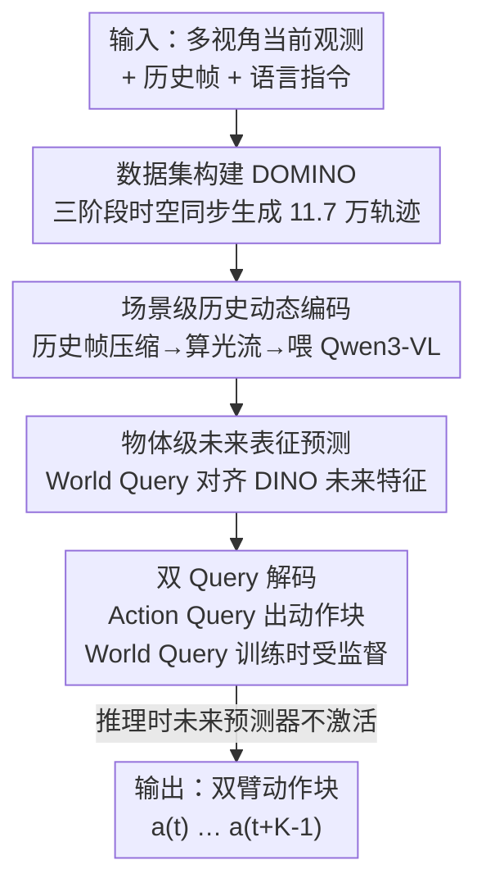

# Towards Generalizable Robotic Manipulation in Dynamic Environments

**会议**: ECCV 2026  
**arXiv**: [2603.15620](https://arxiv.org/abs/2603.15620)  
**代码**: [https://github.com/H-EmbodVis/DOMINO](https://github.com/H-EmbodVis/DOMINO)  
**领域**: 机器人 / 具身智能  
**关键词**: 动态操作、视觉-语言-动作模型、光流、未来预测、双臂操作

## 一句话总结
针对现有 VLA 只会抓静止物体、面对运动目标就失灵的痛点，本文构建了含 11.7 万条轨迹、35 个任务的动态操作基准 DOMINO，并提出用「历史光流 + 物体级未来特征预测」武装 VLA 的 PUMA 架构，在动态任务上把成功率绝对提升 6.3%。

## 研究背景与动机
视觉-语言-动作（VLA）模型这两年在机器人操作上进展迅猛，OpenVLA、π0、RDT 这些工作已经能把「看到的画面 + 一句指令」直接映射成机械臂的控制命令，撑起了通用具身智能的雏形。但主流 VLA 几乎都活在一个「静止世界」的假设里：物体老老实实待在桌上不动，机器人只需要在稳定环境里去够、去抓。真实场景远不是这样——流水线上的零件在传送，人递过来的东西在动，机器人必须一边实时感知、一边预判运动才能精准接住。作者把这类需求叫做**动态操作**（dynamic manipulation），并指出它长期是个被忽视的空白：一方面缺大规模动态操作数据，另一方面主流 VLA 架构本身就缺动态感知和运动预测能力。

数据这一头之所以难搞，核心是「运动目标和机械臂动作之间必须严格时空同步」——遥操作的人或脚本策略很难精确地对着一个连续运动的目标做出恰到好处的反应，结果就是现有具身数据集绝大多数都局限在静止任务上。而架构这一头，作者用一组 oracle 实验戳破了两个看似合理的直觉：其一，把标准 VLA 拿动态数据微调一遍，成功率平均只涨不到 3%，说明这不是简单的数据分布偏移问题，而是**架构本身的天花板**；其二，就算把物体的未来真值轨迹直接喂给模型，总成功率也只有边际提升——因为模型缺乏历史帧观测，它虽然能跟上轨迹，却读不懂目标背后的物理动态，退化成了机械的「照着轨迹走」，反而干扰了闭环操作。这两个发现共同指向一个核心矛盾：**动态操作既需要从历史里读出「物体现在怎么动」，又需要往前预判「它接下来会到哪」，而单帧观测的 VLA 两头都够不着**。

作者由此把动态感知拆成两件必须同时做到的事——以场景为中心捕获历史动态、以物体为中心预判未来运动。**核心 idea：用历史帧之间的光流给 VLA 补上「显式的运动感知」，再引入一组可学习的 world query 在训练时对齐 DINO 抽取的物体级未来特征、把「预判目标未来状态」的能力内化进共享表征，从而让模型在推理时零额外开销地做出前瞻性交互。**

## 方法详解

### 整体框架
DOMINO 这篇工作有两条腿：一条是**基准 DOMINO**（数据 + 评测），一条是**架构 PUMA**（动态感知的 VLA）。基准侧基于 SAPIEN 物理引擎和 RoboTwin 2.0 搭了一条低成本、可扩展的动态数据生成流水线，产出 35 个动态任务、5 种机器人本体、超 11 万条专家轨迹，并用一个标量「动态系数 α」把任务难度参数化（记作 DOMINO@α，α 是目标最大速度，α=0 即退化成静态）；同时按运动复杂度分成 Level 1（匀速可预测）/ Level 2（多项式高阶曲线）/ Level 3（分段随机突变）三档，配一套超越二值成功率的多维指标（SR 成功率 + MS 操作质量分）。

架构侧的 PUMA 建立在 Qwen3-VL 之上，输入是长度 h+1 的观测历史 $o_{t-h:t}$ 加一句语言指令，共享 backbone 同时优化两个头：一个动作策略 $\pi_\phi$，一次前向输出长度 K 的动作块 $\hat{a}_{t:t+K-1}$；一个**只在训练时监督**的辅助未来特征预测器 $\psi_\omega$，输出编码目标未来运动的辅助特征 $z_{t+1:t+N}$。关键在于两点设计：编码端把历史帧压缩后算成**光流图**，给策略提供显式的运动线索（场景级历史动态）；解码端用一组专门的 **world query** 去隐式预测目标物体的未来表征，并用冻结 DINO 抽的真值特征做相似度监督（物体级未来动态）。因为未来预测器推理时不激活，PUMA 在几乎不增加延迟的前提下拿到了动态感知能力。

### 关键设计

**1. DOMINO 三阶段时空同步的数据生成：让运动目标和机械臂动作严丝合缝对齐**

动态数据难造的根子在于「目标在动、机械臂也在动，两者时空必须同步」——如果直接让机械臂对着一个运动物体现场做遥操作，人根本反应不过来，采出来的多半是废数据。作者的巧思是把这个「同步」问题**倒过来解**：先在**静态 dry-run** 阶段随机采一个目标抓取位姿，在静止环境里把任务执行一遍，精确记下机械臂完成动作所需的执行时间 $T_{exec}$；再在**运动学反算**阶段，根据这个执行时间和指定的运动轨迹，反推出物体应该从哪个初始位置、以什么速度出发，才能恰好在机械臂到达时出现在抓取点；最后在**同步动态执行**阶段，把目标物体实例化成 SAPIEN 里的运动学刚体，让机械臂回放它那套已经验证过的动作计划，与运动目标同步跑。这样一来动作和运动天然对齐，避免了现场反应的不确定性。以 Level 1 为例，速度大小 $v$ 从半正态分布 $|\mathcal{N}(0.8\alpha, \alpha/3)|$ 采样并裁剪到 $[0.01,\alpha]$，方向角均匀采，起始位置直接由

$$\mathbf{p}_{\text{start}} = \mathbf{p}_{\text{end}} - \mathbf{v} \cdot T_{\text{sec}}$$

反算得到；Level 2/3 则用多项式拟合控制点、分段 Dirichlet 划分时长来造出高阶和突变轨迹。整条流水线跑在 SAPIEN + RoboTwin 2.0 上，还带碰撞检测（一旦夹爪接触目标就把它从运动学体转成动态刚体，让抓取受力真实），因此能低成本、可扩展地批量产出高质量专家演示。

**2. 场景级历史动态编码：用光流而非堆叠原始帧，把「运动」显式画出来**

标准 VLA 只看单帧，天生读不出「物体正在往哪动」。一个朴素的补救是把历史帧直接堆起来喂进网络，但作者发现这逼着网络自己去隐式推断帧间变化，学习负担重、效果差（消融里用原始历史帧反而把成功率从 baseline 的 10.86% 拉低到 8.15%）。PUMA 的做法是：按固定步长采 h 帧第三视角历史帧，先做空间压缩，然后**在压缩帧之间计算光流图**（用 Farnebäck 算法算稠密光流，映射到 HSV——色相编码运动方向、明度编码运动幅度，再转 RGB），把这些光流图和当前多视角图像一起过 Qwen3-VL 的视觉编码器。光流的好处是它把运动状态「显式且直观」地表达出来了，策略不用再费劲从像素堆里猜运动，直接就能估出目标的运动趋势。为控制开销，历史图和光流的分辨率压到 64×64，并用基于磁盘的缓存机制（首个 epoch 算完就存成压缩 NumPy，后续 epoch 直接读盘），实测光流计算只占单步推理延迟的 3.3%。

**3. 物体级未来表征预测：World Query 隐式预判目标去向，只在训练时监督**

光有历史还不够——要接住运动目标，策略必须能**往前预判**它接下来会到哪。已有的世界模型类方法（如 DreamVLA）多在预测场景级的全局动态区域，但作者主张动态操作真正需要的是**以物体为中心**的预判，把目标自身的轨迹从无关的场景动态里剥离出来。具体做法是：训练时按固定间隔采 N 帧未来帧，用冻结的 GroundingDINO + SAM2 把语言指令里点名的操作物体 grounding 出来得到掩码 $\mathcal{B}$，再用冻结 DINO 编码器 $\mathcal{E}$ 抽 patch token，经掩码平均池化 $\mathcal{P}$ 得到物体级未来真值特征

$$\mathbf{f}_{t+i}=\mathcal{P}\!\left(\mathcal{E}(I_{t+i}), \mathcal{B}(I_{t+i}, p)\right), \quad i=1,\dots,N.$$

然后引入 N 个可学习的 **world query**，让它们聚合时空上下文、在隐空间里预测目标的未来表征 $z_{t+i}$，并用余弦相似度损失把预测拉向真值 $f_{t+i}$。这一步的精髓在于「监督只加在训练阶段」：它逼着共享表征把「目标未来会怎么动」的信息学进去，等于给动作策略加了一个前瞻性的正则；而推理时完全不需要未来帧、也不激活这个预测器，所以零额外计算开销就享受到了动态预判能力。消融显示，加上这个辅助预测（N=2）能把成功率从只有光流的 11.71% 提到 14.80%，把预测步长拉长到 N=4 更是达到最优的 17.20%。

### 损失函数 / 训练策略
PUMA 端到端训练，总损失是两项加权和：动作策略用 $\ell_1$ 回归损失监督预测动作块

$$\mathcal{L}_{action} = \frac{1}{K} \sum_{i=0}^{K-1} \| \hat{\mathbf{a}}_{t+i} - \mathbf{a}^*_{t+i} \|_1,$$

辅助未来预测器最小化预测表征与物体级真值特征的余弦距离

$$\mathcal{L}_{world} = \frac{1}{N}\sum_{i=1}^{N}\left(1-\frac{\mathbf{z}_{t+i}^{\top}\mathbf{f}_{t+i}}{\|\mathbf{z}_{t+i}\|_2\,\|\mathbf{f}_{t+i}\|_2}\right),$$

合起来 $\mathcal{L}_{total} = \mathcal{L}_{action} + \lambda\,\mathcal{L}_{world}$，其中 $\lambda$ 平衡动态任务的影响（实现里取 0.05）。策略从 Qwen3-VL-4B 初始化，动作头是 MLP、预测 14 维绝对关节动作、未来动作窗口 15 步；用 4 个 world query，历史/未来窗口各 4 帧、步长 4，未来特征用冻结的 DINOv2-B/14 抽取。全参数微调、DeepSpeed ZeRO-2、8×A100。

## 实验关键数据

### 主实验
在 DOMINO@0.1（Level 1，clean 设置，Aloha-AgileX 机器人，所有 VLA 都在 35 个动态任务上微调）上对比 SOTA：

| 方法 | Backbone | SR (%) | MS |
|------|----------|--------|-----|
| OpenVLA | Prismatic | 1.54 | 6.10 |
| RDT-1B | DiT | 5.34 | 17.71 |
| π0 | PaliGemma | 8.17 | 23.96 |
| π0.5 | PaliGemma | 9.63 | 26.17 |
| OpenVLA-OFT | Qwen3-VL* | 10.86 | 30.49 |
| **PUMA (本文)** | Qwen3-VL | **17.20** | **34.97** |

PUMA 成功率 17.20% 大幅领先次优的 OpenVLA-OFT（Qwen3-VL 版）10.86% 和 π0.5 的 9.63%，MS 也拿到最高的 34.97。摘要口径的「绝对提升 6.3%」即相对同 backbone 的强 baseline。

**静态→动态的性能崩塌**（Level 1）说明问题为什么难：

| 方法 | 静态 S→S | 动态 S→D (零样本) | 动态 D→D (微调) |
|------|---------|------------------|----------------|
| ACT | 27.7 | 6.5 | 9.4 |
| OpenVLA-OFT | 17.5 | 6.7 | 9.1 |
| π0.5 | 44.8 | 7.5 | 9.6 |

π0.5 从静态的 44.8% 直接掉到动态零样本的 7.5%，且拿动态数据微调也只回到 9.6%——印证了「不是数据问题，是架构问题」。

### 消融实验

| 配置 | Hist. Rep. | Aux. Pred. | N | SR (%) | MS |
|------|-----------|-----------|---|--------|-----|
| Baseline | ✗ | ✗ | - | 10.86 | 30.49 |
| + 历史光流 | ✓ | ✗ | - | 11.71 | 31.02 |
| + 光流 + 未来预测 | ✓ | ✓ | 2 | 14.80 | 32.74 |
| + 历史**原始帧** + 未来预测 | ✓ | ✓ | 2 | **8.15** | 28.62 |
| + 光流 + 未来预测 | ✓ | ✓ | 4 | **17.20** | **34.97** |

### 关键发现
- **光流 vs 原始帧是命门**：同样加未来预测，用原始历史帧（8.15%）反而低于 baseline（10.86%），用光流（14.80%）才有效——证明「让网络自己从像素堆推运动」是死路，显式光流表征才是关键。
- **未来预测步长越长越稳**：N 从 2 提到 4，成功率从 14.80% 涨到 17.20%，说明更长的预判视野能建立对未来轨迹更鲁棒的理解。
- **动态数据能反哺静态**：只在动态数据上训的策略零样本迁到静态场景，某些任务甚至超过静态训练的策略（如 OpenVLA-OFT 上 Adjust Bottle 65% vs 47%）；动静混合协同训练更把 PUMA 的动态 SR 从 14.80% 拉到 19.71%（+4.91%）。作者解释：静态数据给的是稳定的结构先验，动态数据给的是反应式灵巧性，两者互补。
- **真机可迁**：在双臂 AgileX Piper 上选 5 个动态任务、每任务 50 条演示，PUMA 用 LoRA 从仿真 checkpoint 微调后达 42% 平均 SR，远超 π0.5 的 24% 和 ACT/RDT 的 <10%。
- **几乎零开销**：单卡 RTX 4090 上 PUMA 单步 103.7ms（9.6Hz），与 π0.5 持平；光流计算仅占 3.3%，动态感知模块开销可忽略。

## 亮点与洞察
- **「反算式」数据同步**是整篇最漂亮的工程 insight：与其让机械臂现场追一个运动目标（几乎不可能采到好数据），不如先在静态里量好执行时间、再倒推物体该从哪出发，把「同步」这个动态难题转化成一个确定性的运动学反算问题。这套思路可迁移到任何「需要 agent 和环境事件精确对齐」的数据采集场景。
- **辅助监督只在训练时加**是很经济的设计：world query 把「预判未来」内化进共享表征，推理时直接扔掉预测头，等于免费拿到前瞻能力——这种「训练时重、推理时轻」的辅助任务范式对延迟敏感的机器人策略特别有价值。
- **两个 oracle 实验先证伪再立论**：作者没有一上来就堆模块，而是先用「微调只涨 3%」「喂真值轨迹也只边际提升」两个实验把「数据问题」和「只需未来轨迹」两条捷径堵死，逼出「历史 + 未来必须并重」的结论，方法动机因此扎实。
- **光流作为显式运动先验**在 VLA 里被验证有效，且用 HSV 编码方向/幅度再转 RGB 直接喂视觉编码器，几乎不改架构——这个「把运动画成图」的 trick 可以低成本嫁接到其他单帧策略上。

## 局限与展望
- 主实验绝大多数在 Level 1（匀速）、clean 设置、单一 Aloha-AgileX 本体、α=0.1 下做，Level 2/3 高阶/突变动态只有小规模子集验证，且此时绝对成功率仍很低（Level 3 下 PUMA 也只有 4.6%），离实用还远。
- 数据全部来自仿真（SAPIEN），真机实验靠「拿透明绳拉物体」模拟 Level 1 线性运动，无法复现高阶/突变轨迹，sim-to-real 的动态复杂度覆盖有限。
- 物体级监督依赖 GroundingDINO + SAM2 从指令里 grounding 目标，若指令解析失败会退化成用整句当 prompt，对指令措辞和 grounding 质量有一定敏感性。
- 未来预测是隐式的特征对齐，作者自己也把 PUMA 定位成「exploratory attempt」，并未显式建模物理动力学（如碰撞、接触力），面对真正随机突变的目标仍力不从心。

## 相关工作与启发
- **vs DreamVLA / 场景级世界模型**：它们预测的是全局场景转移或机器人运动学，忽略了对反应式规划最关键的**单个物体的动态**；PUMA 用 world query 做物体级未来特征预测，把目标轨迹从无关场景动态里剥离，粒度更细。
- **vs 带时序上下文 / 记忆机制的 VLA**（如 MemoryVLA、TraceVLA）：这类方法主要跟踪任务进度、服务长程任务，做不到动态操作需要的高频运动估计；PUMA 用光流提供显式高频运动线索，专攻运动目标。
- **vs RoboTwin 2.0 / LIBERO / RLBench 等基准**：现有仿真基准几乎都建立在「静态世界」假设上（状态转移完全由机器人驱动），无法评测独立运动目标的操作；DOMINO 是首个用动态系数 α 参数化难度、按运动复杂度分级、专门评测动态双臂操作的基准。
- **vs 直接喂未来真值轨迹的 oracle**：本文证明单给未来轨迹会让策略过拟合成「照轨迹走」、缺历史反而干扰闭环——这提醒后续工作，未来线索必须锚定在历史物理上下文里才有用。

## 评分
- 新颖性: ⭐⭐⭐⭐⭐ 首次系统定义并基准化动态操作，反算式数据同步 + 物体级未来预测两个设计都很新。
- 实验充分度: ⭐⭐⭐⭐ 主实验、消融、跨难度、真机、延迟一应俱全，但高阶动态和真机的动态复杂度覆盖偏薄。
- 写作质量: ⭐⭐⭐⭐⭐ 用两个 oracle 实验先证伪再立论，逻辑链清晰，Finding 式小结好读。
- 价值: ⭐⭐⭐⭐⭐ 补上了 VLA「只会抓静物」的空白，基准 + 数据 + 架构一起开源，对具身智能社区推动明显。

<!-- RELATED:START -->

## 相关论文

- [\[CVPR 2026\] AdaDexTrack: Dynamic Modulation for Adaptive and Generalizable Dexterous Manipulation Tracking](../../CVPR2026/robotics/adadextrack_dynamic_modulation_for_adaptive_and_generalizable_dexterous_manipula.md)
- [\[ICLR 2026\] VLBiMan: Vision-Language Anchored One-Shot Demonstration Enables Generalizable Bimanual Robotic Manipulation](../../ICLR2026/robotics/vlbiman_vision-language_anchored_one-shot_demonstration_enables_generalizable_bi.md)
- [\[ICLR 2026\] Test-Time Mixture of World Models for Embodied Agents in Dynamic Environments](../../ICLR2026/robotics/test-time_mixture_of_world_models_for_embodied_agents_in_dynamic_environments.md)
- [\[ECCV 2026\] MuSix: Multi-scale Mixture of World Models for Embodied Agents in Evolving Environments](empathic_robots_exploring_the_role_of-empathy_in_vision-language_action_models.md)
- [\[AAAI 2026\] Dexterous Manipulation Transfer via Progressive Kinematic-Dynamic Alignment](../../AAAI2026/robotics/dexterous_manipulation_transfer_via_progressive_kinematic-dynamic_alignment.md)

<!-- RELATED:END -->
