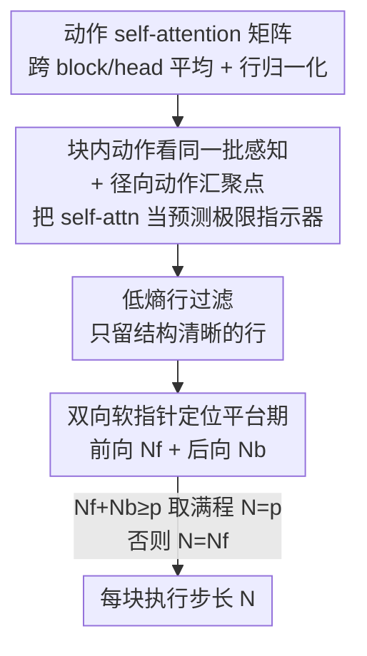

# VLA Knows Its Limits: Adaptive Execution Horizons for Robot Policies

**会议**: ECCV 2026  
**arXiv**: [2602.21445](https://arxiv.org/abs/2602.21445)  
**代码**: 项目页有 video demo（论文未直接给出 GitHub）  
**领域**: 机器人 / 具身智能  
**关键词**: VLA、动作分块、执行步长、注意力汇聚、测试时自适应

## 一句话总结
本文发现 flow-based VLA 的执行步长（每个动作块里真正执行几步）存在一个「先升后降」的最优点，并揭示动作 self-attention 里的「首尾动作汇聚点」编码了模型的预测极限，据此提出 AutoHorizon——一种零训练、几乎零开销的测试时方法，为每个动作块动态估计执行步长。

## 研究背景与动机
动作分块（action chunking）已经成了模仿学习训练 VLA 的标配：策略不再一步一动，而是一次预测一段连续动作序列（一个 chunk），然后机器人只执行这段序列的前若干步，就丢掉剩下的、重新观测并预测下一段。预测出来的总长度叫「预测步长」（prediction horizon $p$），真正执行的前缀长度叫「执行步长」（execution horizon $e$）。这套闭环机制本质上是在拿长程一致性换反应性——执行得越长动作越平滑连贯，执行得越短对环境变化越敏感。可几乎所有工作都把 $e$ 当成一个靠人拍脑袋或穷举扫出来的固定超参，很少有人认真问：这个 $e$ 到底该怎么定？

作者的出发点是一组扎眼的经验观察：在 LIBERO 上用 π0.5 跑，仅仅改变执行步长就能让成功率从「几乎全对」剧烈波动到「频繁失败」，而且性能曲线呈现明显的单峰形状——随 $e$ 增大先升后降，最优值落在中间某处。这说明固定步长天然就是次优的：策略 rollout 的不同阶段，对「一致性 vs 反应性」的偏好本就不一样。伸手去够咖啡壶时希望步长长一点、动作平滑；往杯子里倒水时又需要步长短、随时可纠偏。既然最优点会随时间漂移，执行步长理应逐块自适应，而不是全程钉死一个值。穷举扫参既贵又不解决「块内自适应」的根本问题。

那怎么在测试时、不重训模型的前提下判断「这个块该执行多长」？作者转向注意力机制找线索，分析了 flow-based VLA 在生成动作时如何在视觉、语言、动作 token 之间分配注意力，挖出两个关键现象：其一，同一个 chunk 内的各个动作**始终**盯着同一批视觉-语言 token 看，晚一点的动作没法随环境变化调整感知语境，暴露了预测块适应性的天花板；其二，预测动作对**首尾两端**的动作 token 有异常强的注意力，作者称之为「径向动作汇聚点」（radial action sinks），中间动作都是围绕这两个锚点组织的。**核心 idea：把动作 self-attention 权重解读为模型预测极限的隐式指示器——当注意力质量停止向前推进、开始进入平台期的那个转折点，就标记了 VLA 可靠预测能力的自然边界，用一个双向软指针机制找到它，即为该块的执行步长。**

## 方法详解

### 整体框架
方法要解决的问题很聚焦：在测试时、针对每一个预测出来的动作块，自动估计一个合适的执行步长 $e$，让机器人既能在稳定阶段跑得平滑、又能在交互阶段随时纠偏。整体上分两大块——**先解释现象**（为什么性能对 $e$ 呈单峰、注意力里藏着什么规律），**再据此设计算法**（AutoHorizon 怎么从注意力矩阵里读出这个步长）。

输入是 VLA 在某个采样步拿到的动作 self-attention 矩阵 $\mathbf{S}_t \in \mathbb{R}^{p\times p}$（对所有 transformer block 和 attention head 取平均、再行归一化），输出是这一块的执行步长 $N$。中间流程是：先按行熵过滤掉注意力弥散的行，只留下「看得清楚、结构性强」的行；再用一个前向软指针沿注意力轨迹走，找到质量停止推进的转折点得到前向步长 $N_f$；对翻转后的注意力矩阵做同样操作得到后向步长 $N_b$；最后按 $N_f+N_b$ 是否覆盖满整块来融合，决定最终步长。整个过程无需任何额外训练或参数拟合，只在第 1 或第 3 个采样步做一次，开销可忽略。

### 关键设计

**1. 存在唯一最优执行步长：把 rollout 总误差建模成单峰函数**

作者先从理论上证明「最优执行步长确实存在且唯一」，为整个方法奠基。痛点是：如果性能对 $e$ 没有可预测的结构，那估计它就无从谈起。作者把一次完整 rollout 的期望误差拆成两部分——每次跨块切换带来的奖励损失 $\delta^c$（与 $e$ 无关），以及每个执行块相对专家轨迹段的发散损失 $\delta^d_j(e)$（随 $e$ 单调增，建模为 $\delta^d_j(e)=ke\log e$）。设总共执行 $L$ 个底层动作、$m=\lceil L/e\rceil$ 个块，总误差为

$$\mathcal{L}(e)=\sum_{i=0}^{m-1}\delta^{c}+\sum_{j=0}^{m}\delta^{d}_{j}(e)$$

对连续化的 $e$ 求导可得唯一稳定点 $\hat e=\delta^c/k$，且二阶导在此为正，于是 $\mathcal{L}$ 在 $(0,\hat e)$ 严格递减、在 $(\hat e,\infty)$ 严格递增——这正是经验上观察到的单峰曲线。直观含义很清晰：当跨块切换代价 $\delta^c$ 大（策略学到了多样动作分布），倾向更长步长以求连贯；当块内发散 $\delta^d$ 主导（策略难以刻画环境动态），倾向更短步长以求反应性。这一分析把 Liu 等人 BID 的结论推广成了显式的「一致性 vs 反应性」权衡。作者特别强调，这个式子只证明存在性、**不直接指导方法设计**——真正的估计要靠注意力。

**2. VLA 知道自己的极限：块内注意力不变性 + 径向动作汇聚点**

这是全文的观察核心，直接回答「单峰从何而来、边界怎么找」。作者可视化 π0.5（$p=50$）最后一个采样步的 cross-attention，发现一个惊人的**不变性**：同一 chunk 内的所有动作，几乎以完全相同的权重盯着同一批视觉-语言 token 看。也就是说模型虽然预测了一长串未来动作，但晚一点的动作根本没有随环境变化调整感知语境，只是反复复用对早期动作有用、对后期却越来越过时甚至误导的静态特征——执行这些后期动作因此变得冗余乃至有害，表现为「过度自信、反应性差」的 rollout。（顺带一提，作者还发现第一个语言 token 上有类似 LLM「注意力汇聚」的异常高权重，但把语言 token 全 mask 掉成功率只轻微下降，说明骨干强大的视觉-语言预训练已经把语义吸收进了视觉表征里。）

第二个现象是径向动作汇聚点：可视化动作之间的 self-attention，注意力强烈集中在**首、尾**两个动作 token 上，相关强度在近距离内保持高位、随时间距离拉开后急剧衰减到低平台。作者推断首动作累积误差最低、是天然锚点，而首尾动作共同承担跨块连续性（训练时起始时间戳随机采样）。这两个汇聚点定义了中间动作围绕组织的隐式中心。据此作者给出关键解读：**当径向汇聚点的注意力仍高，说明模型确信预测动作还对齐着锚点、在当前观测下有效；一旦注意力衰减，模型就转向依赖自己先前生成的动作而非真实感知输入，这种自指依赖会放大累积误差、在长 rollout 中拖垮性能**。于是「注意力衰减、进入平台」的那个位置，就是模型可靠预测的边界。

**3. AutoHorizon：低熵行过滤 + 双向软指针定位平台转折点**

有了「转折点即边界」的解读，剩下的就是如何从矩阵里稳健地把它读出来。第一步是过滤噪声行：并非每一行注意力都可信，弥散均匀的行提供不了结构线索，作者用行熵度量并只保留熵低于 $q$-分位数的行，

$$H_t[i]=-\frac{1}{\log p}\sum_j \mathbf{S}_t[i,j]\log \mathbf{S}_t[i,j],\qquad R_t=\{\,i\mid H_t[i]\le Q_q(H_t)\,\}$$

留下那些注意力更尖锐、更自信的行作为可靠依据。第二步是双向软指针找平台。对前向指针，先算每一行的「期望预测视野」$\mu_t[i]=\max(\sum_j j\,\mathbf{S}_t[i,j],\ \max_{k\le i}\mu_t[k])$——即用注意力对列索引 $j$ 做加权，量化模型「往前看多远」，并施加非递减约束防止倒退。再看相邻行的增量 $\Delta\mu_t[i]=\mu_t[i]-\mu_t[i-1]$：一个突然变大的 $\Delta\mu$ 意味着注意力焦点骤移、平台开始，于是把平台之前的动作集合定义为 $P_t=\{i\mid \Delta\mu_t[i]<\tau\}$，前向步长取 $N_f=\lfloor \mu_t[\min(R_t\cap P_t)]\rfloor+1$。对翻转矩阵 $\tilde{\mathbf{S}}_t$ 做完全相同的操作得后向步长 $N_b$（对应从尾部汇聚点看的边界）。

之所以要双向，是因为首尾两个汇聚点各自定义了一个可靠边界，融合规则是：若 $N_f+N_b\ge p$（前后覆盖已能拼满整块），说明整块都可靠，直接取满程 $N=p$；否则只用前缀 $N=N_f$。经验上前者多发生在预测步长 $p$ 较小、模型对短轨迹拟合很好时，后者主导于 $p$ 较大时。整套流程零训练、超参固定（$q=0.9,\tau=0.3$）、只在单个采样步跑一次，因而几乎零开销，且天然适配任意 flow-based VLA。

### 一个完整示例
以 π0.5（$p=50$）执行「把魔方放进碗里」为例走一遍：机器人先要够到魔方，此阶段环境稳定、反应性不重要，注意力矩阵里前向指针能一路推进很远才遇到平台，$N_f$ 较大，加上后向 $N_b$ 后 $N_f+N_b\ge 50$，于是 AutoHorizon 判定满程执行、步长拉长，动作平滑快速地伸向目标；等到机器人开始抓取、放置（真正的物理交互）时，感知语境快速变化，注意力很早就衰减进平台，前向指针在小步数处就触发转折点，$N_f$ 变小且 $N_f+N_b<50$，步长随之缩短，让策略每隔几步就重新观测、及时纠偏。整段 rollout 里估计出的步长因此在「长-短-长-短」之间自然起伏，而这正是固定步长永远做不到的。

## 实验关键数据

### 主实验
在 LIBERO（单臂）与 RoboTwin（双臂）仿真、以及真实 Franka 机械臂上评测，骨干为 π0.5 与 GR00T N1.5。核心对比对象是 Static Oracle（固定步长）、Static Oracle+（对固定步长穷举搜索、需每任务 $p$ 次 rollout 的强而昂贵基线）和 Random（随机步长）。

| 数据集 / 骨干 | 指标 | AutoHorizon | 最优固定步长基线 | 说明 |
|--------|------|------|----------|------|
| LIBERO-10 / π0.5 ($p=50$) | 成功率 | 92.1 | 91.9 (Oracle+) | 固定步长最优点也需穷举才达到 |
| LIBERO-10 / π0.5 ($p=50$) | 成功率 | 92.1 | 68.6 (Oracle @ $e=p$) | 步长选错时暴跌 23+ 点 |
| LIBERO-Object / π0.5 ($p=50$) | 成功率 | 98.0 | 97.6 (Oracle+) | 一致超越或持平 |
| LIBERO-10 / GR00T N1.5 ($p=16$) | 成功率 | 92.7 | 90.0 (Oracle+) | 跨架构泛化 |
| RoboTwin·Adjust Bottle / π0.5 | 成功率 | 100.0 | 98.7 (Oracle+) | 对步长敏感任务上优势明显 |
| 真实·Cube Bowl / π0.5 ($p=50$) | 阶段完成率 | 99.0 | 97.5 (Oracle+) | 真机三任务全面领先 |

关键结论是：AutoHorizon 在两种骨干、三类环境上都持平或超过「穷举出来的最优固定步长」，而后者需要成倍的 rollout 预算才能找到。当 $p=50$ 时 Static Oracle 随步长先升后降、甚至常常被 Random 反超，凸显了「选对步长」的重要性；而 AutoHorizon 靠动态调整稳居榜首。

### 消融实验

| 配置 | LIBERO-10 成功率 | 说明 |
|------|---------|------|
| AutoHorizon（完整） | 92.1 | 动态逐块估计 |
| Static Oracle ($e=\lfloor m\rfloor$) | 89.1 | 固定为 AutoHorizon 均值下取整 |
| Static Oracle ($e=\lceil m\rceil$) | 91.9 | 固定为均值上取整，仍略逊 |
| Random | 83.3 | 随机步长，证明结构化自适应有效 |
| Action Trigger（最优 $\tau_a$） | 79.6 | 按动作差分触发重规划，且对超参极敏感 |
| Uncertainty Proxy（最优 $\tau_u$） | 79.2 | 采 4 个块估不确定度，算力开销大 |

### 关键发现
- 即便把固定步长设成 AutoHorizon 估计分布的均值（最近邻 Static Oracle），成功率仍不如 AutoHorizon——说明价值不在「平均步长选得准」，而在于对长 rollout 中的极端情形（偶尔需要更长或更短）也能逐块应对，这是单一固定值给不了的。
- 当执行步长超过预测步长（$e>p$）性能急剧下降，作者归因于训练-测试不匹配（模型没见过比 $p$ 更长的轨迹），这天然给出上界 $1\le e\le p$。
- 超参极不敏感：注意力层数 $L$、熵分位 $q$、阈值 $\tau$ 在大范围内成功率稳定在 90+ 附近，$q=0.9,\tau=0.3$ 即可通用，无需逐任务调参。相比之下两个重规划基线对阈值高度敏感。
- 真机上观察到直观的物理对应：步长太短（$e\in[1,5]$）机器人频繁犹豫停顿（初始动作幅度太小、进展不足）；中等步长（$e\in[20,40]$）易过冲或撞工作台；过长（$e>40$）难以维持物体定位、频繁掉落。

## 亮点与洞察
- 把「注意力汇聚（attention sink）」这个原本用于 LLM 高效推理的现象，迁移解读为 VLA 动作序列的「预测极限指示器」——首尾径向汇聚点的注意力衰减点，恰好是模型该停止执行、重新观测的边界。这个「用模型自己的注意力当置信度、无需额外 head 或训练」的视角很巧妙，可迁移到任何需要判断「预测何时开始不可靠」的自回归/分块生成场景。
- 方法几乎零成本：不训练、不改模型、只在一个采样步读一次注意力矩阵，却能匹敌穷举扫参的最优固定步长——「免费午餐」式的测试时增强，落地门槛极低。
- 先用一个可证明单峰的误差模型解释「为什么存在最优步长」，再用注意力观察解释「最优点在哪、怎么找」，理论与机制两条腿走路，让「动态步长」不只是工程 trick 而有解释支撑。

## 局限与展望
- 方法专门针对 flow-based / diffusion-based VLA 的注意力结构（依赖动作 self-attention 和径向汇聚点），对非分块、非注意力架构的策略是否适用未验证。
- 双向软指针里的阈值 $\tau$、分位 $q$ 虽被证明不敏感，但仍是固定人设值；「注意力增量骤变即平台」的判定本质是启发式，缺乏对转折点的严格最优性保证。
- 上界 $e\le p$ 来自训练-测试不匹配，意味着方法无法突破预测步长本身的限制；若想要更长的平滑执行，仍需在训练侧加大 $p$。
- 真机实验任务数（3 个 pick-and-place）和试验次数偏少，二值结果导致方差偏大，更复杂长程任务上的稳健性有待观察。

## 相关工作与启发
- **vs BID (Bidirectional Decoding)**: BID 从策略学习角度证明分块提升长程一致性但牺牲短期反应性，并用拒绝采样选最优块；本文把 BID 的分析推广成显式的 rollout 总误差单峰模型，且不改采样、只在测试时估计步长，视角从「选哪个块」转向「块执行多长」。
- **vs RTC (Real-Time Chunking)**: RTC 在异步执行下把块预测建模成图像 inpainting；本文关注的是同步执行下「执行步长」这个正交维度，两者可互补。
- **vs StreamingLLM / 视觉注意力汇聚**: 前者发现 LLM 对起始 token 的注意力汇聚并用于高效长文本，Kang 等发现 VLM 对显著但语义无关 token 的注意力汇聚；本文首次在 VLA 动作序列里发现「径向」双端汇聚，并赋予其「预测极限」的全新功能语义，而非仅仅当作需要保留或重分配的结构性 token。
- **vs 固定步长 / 穷举扫参的常规做法**: 传统 VLA 靠人拍脑袋或按控制频率定步长、或穷举搜索；本文用零训练的注意力读数逐块自适应，既省掉扫参成本，又拿到固定步长天花板都够不到的逐块灵活性。

## 评分
- 新颖性: ⭐⭐⭐⭐⭐ 首次系统研究 VLA 执行步长，并把动作 self-attention 汇聚点解读为预测极限，视角新颖。
- 实验充分度: ⭐⭐⭐⭐ 两骨干、仿真+真机、多任务覆盖广，超参敏感性充分；真机任务规模略小。
- 写作质量: ⭐⭐⭐⭐⭐ 现象-理论-方法逻辑清晰，注意力可视化和真机行为对应讲得很透。
- 价值: ⭐⭐⭐⭐⭐ 零训练零开销即插即用、匹敌穷举最优固定步长，对 VLA 落地实用价值高。

<!-- RELATED:START -->

## 相关论文

- [\[ICLR 2026\] Real-Time Robot Execution with Masked Action Chunking](../../ICLR2026/robotics/real-time_robot_execution_with_masked_action_chunking.md)
- [\[ICML 2026\] Mixture of Horizons in Action Chunking](../../ICML2026/robotics/mixture_of_horizons_in_action_chunking.md)
- [\[ICLR 2026\] Time Optimal Execution of Action Chunk Policies Beyond Demonstration Speed](../../ICLR2026/robotics/time_optimal_execution_of_action_chunk_policies_beyond_demonstration_speed.md)
- [\[ECCV 2026\] AutoSpeed: Annotation-Free Stage-Adaptive Motion Speed Learning for Robot Manipulation](autospeed_annotation-free_stage-adaptive_motion_speed_learning_for_robot_manipul.md)
- [\[ICML 2026\] SCALE: Self-uncertainty Conditioned Adaptive Looking and Execution for Vision-Language-Action Models](../../ICML2026/robotics/scale_self-uncertainty_conditioned_adaptive_looking_and_execution_for_vision-lan.md)

<!-- RELATED:END -->
