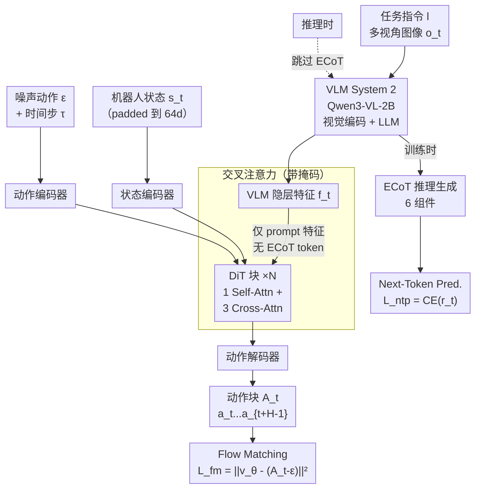

# ZR-0: Training Vision-Language-Action Models with Dense Embodied Chain-of-Thought Supervision

**会议**: ECCV 2026  
**arXiv**: [2606.30552](https://arxiv.org/abs/2606.30552)  
**代码**: [https://github.com/RUCKBReasoning/ZR-0](https://github.com/RUCKBReasoning/ZR-0) (有)  
**领域**: 机器人 / 具身智能  
**关键词**: VLA, Embodied Chain-of-Thought, 跨本体迁移, Flow Matching, 扩散 Transformer

## 一句话总结

ZR-0 通过密集的 Embodied Chain-of-Thought (ECoT) 推理监督对齐跨机器人本体的表征，采用预训练 VLM (System 2) 生成结构化推理 + DiT 动作专家 (System 1) 流匹配产出的双流架构，在 60M 帧的大规模预训练语料上训练后在 LIBERO、RoboTwin 2.0、RoboCasa 及真实 xArm 上达到 SOTA。

## 研究背景与动机

视觉-语言-动作（VLA）模型正成为机器人操控领域的主流范式，其核心思路是将预训练视觉-语言模型的语义理解能力与底层动作控制结合，使机器人能根据自然语言指令和视觉观测执行操作任务。然而，VLA 模型面临一个根本性的跨本体迁移难题：不同机器人的运动学构型完全不同——六轴臂和七轴臂的关节空间维度不同，灵巧手和夹爪的控制接口不同，轮式底盘和双足底盘的运动模型更是天差地别。现有方法试图从格式层面弥合这些差异（如零填充统一维度、逐个本体归一化、统一动作空间表示），但仅解决了输入输出的数值对齐，并未触及更深层的语义对齐问题——同样的"拿起杯子"操作在不同本体上应当对应相似的高层推理轨迹，但低层动作表征的巨大差异淹没了这种共性。

作者的核心观察是：尽管低层状态和动作空间各不相同，但操控背后的高层认知过程——场景感知、目标识别、任务规划、子任务分解——在不同本体之间是很大程度上共享的。一把六轴臂和一把七轴臂在"从桌上拿杯子"时遵循相似的认知轨迹：定位杯子、判断抓手位置、规划夹取路径、确认成功，差别仅在于最终如何将这段认知转化为各关节的转角序列。这意味着，如果能让 VLA 模型在学习过程中显式地生成结构化的认知推理链（而不仅仅是端到端地映射视觉→动作），这部分推理表征就天然是跨本体可迁移的，因为它在抽象层面上描述了"做什么"而非"怎么做"。

基于这一洞察，本文设计了 ZR-0——一个 2.6B 参数的端到端 VLA 模型，其核心思路是在训练阶段通过密集的 **Embodied Chain-of-Thought (ECoT)** 推理监督来对齐不同本体的高层表征。ECoT 将每一步操控都拆解为场景描述、进度评估、未来规划、待做动作、目标检测和离散动作六个组件，以自然语言和结构化格式覆盖了操控的完整认知链。同时，ZR-0 采用了精心设计的双流架构：VLM 负责生成 ECoT 推理，DiT 动作专家则通过交叉注意力从 VLM 取特征并输出连续动作块，注意力掩码保证动作专家只看到输入的 prompt 特征而不依赖 ECoT token——这使得推理时可以直接跳过 ECoT 生成，单次前向即产出动作。**核心 idea：用密集的 ECoT 监督作为跨本体表征对齐的桥梁，让 VLA 模型在认知层面学到本体无关的操控知识，再通过交叉注意力解耦设计实现训练时学习、推理时零开销。**

## 方法详解

### 整体框架

ZR-0 是一个双流端到端架构，两条流的交互通过带掩码的交叉注意力精确控制。在训练时，给定任务指令和来自多个摄像头视角的当前帧观测，左侧的 VLM（System 2，初始化为 Qwen3-VL-2B）首先处理视觉和文本输入，生成结构化的 ECoT 推理序列（涵盖六类信息），同时产出最后一层的隐层特征。右侧的 DiT 动作专家（System 1）以这些 VLM 特征为条件，再拼接机器人本体状态，通过流匹配（Flow Matching）预测长度为 H 的未来动作块。连接两条流的核心机制是交叉注意力：DiT 块中的动作/状态 token 作为查询，VLM 输出的特征作为键/值，但注意力掩码强制只允许动作专家关注输入的 prompt 特征（指令 + 图像），**不允许**看到 ECoT 推理 token 对应的特征。这一设计是 ZR-0 的枢纽——它保证了训练时 VLM 有强监督信号（next-token prediction on ECoT）来生成高质量推理，同时又让动作专家学会只依赖 prompt 特征本身（而非 ECoT 输出）就能产出动作，从而在推理时绕过 ECoT 生成的整个阶段。

下图展示了 ZR-0 的完整训练与推理流程：

### 关键设计

**1. ECoT 密集推理监督：将跨本体操控对齐到共享认知空间**

ECoT 是 ZR-0 的核心成分——它不是简单的"思考后再行动"，而是一个由六个结构化组件构成的、逐帧密集标注的操控推理规范。每个时间步 t，VLM 需要依次输出：（1）**场景描述**——用自然语言描述当前视觉场景中有什么物体、处于什么状态，这会训练 VLM 的视觉感知和物体识别能力；（2）**进度评估**——评估任务当前完成了多少步，并给出一个二值完成指示，训练模型对任务进度的动态感知；（3）**未来计划**——用自然语言推理剩余需要完成的步骤，培养时间推理和长程规划能力；（4）**待做动作**——这是六个组件中最关键的一个，它将剩余操作分解为一系列原子子任务，以祈使句形式组织（动词+宾语，如"pick up the cup""move to the table"），**这些原子动作的表示是本体无关的**——无论机器人有几根手指、有几个关节，"拾取杯子"这个原子子任务在不同本体上共享相同的认知标签，不携带任何关节角度信息，因此天然可作为跨本体对齐的锚点；（5）**目标物体**——以 JSON 格式输出当前交互目标的边界框，提供显式的视觉定位监督，强化模型的视觉空间注意力；（6）**离散动作**——使用 FAST 分词器将本体相关的低层动作 token 化，充当高层推理到低层控制之间的桥接。这六个组件共同构成了一条完整的操控认知链，覆盖了"看到什么→做到哪了→还要做什么→具体怎么做"的全过程。ZR-0 在 ProcCorpus-60M 的约 60M 帧上实现了 96.8% 的 ECoT 标注覆盖率（通过自动 VLM 标注管线生成），使模型在预训练阶段获得了海量跨本体认知对齐信号。

**2. 双流架构与注意力掩码：训练时深度融合、推理时完全解耦**

ZR-0 的双流架构不是一个简单的"VLM 搭 MLP 做动作"——它通过带注意力掩码的交叉注意力机制在"训练时深度融合"和"推理时完全解耦"之间找到了平衡点。VLM 流（System 2）以 Qwen3-VL-2B 为骨干，处理指令和图像后产出隐层特征 f_t 并同时生成 ECoT 推理序列 r_t。动作专家（System 1）是一个 Diffusion Transformer，由状态编码器、动作编码器、堆叠 DiT 块和动作解码器组成（全部是 MLP）。每个 DiT 块内的结构是 1 层自注意力 + 3 层交叉注意力（vs. GR00T N1 的 1:1 比例，增加交叉注意力密度以增强跨模态交互）。在自注意力阶段，状态 token 和动作 token 之间双向可见，形成对当前操控状态的完整建模。在交叉注意力阶段，状态/动作 token 作为查询，VLM 的特征作为键/值——但这里的注意力掩码是关键设计：它**只允许**动作专家访问输入 prompt（指令 + 图像）对应的 VLM 特征，而禁止访问 ECoT 推理 token 对应的特征。这意味着动作专家必须学会仅从"任务指令 + 视觉观测"（即 ECoT 生成之前的中间表征）就产出行之有效的动作，而不能依赖 ECoT 输出的后续 token 特征。训练时，VLM 同时做两件事：一是通过 next-token prediction 损失优化 ECoT 序列（让其学会高质量的推理），二是通过流匹配损失（梯度反向传播到 VLM）优化 VLM 特征对动作专家的条件作用（让 prompt 特征本身包含足够的信息来生成动作）。推理时，ECoT 生成阶段被完全跳过，只需一次 VLM 前向拿到 prompt 特征，经过交叉注意力即产出动作，延迟约 90ms（A6000, bfloat16），完全满足实时部署要求。

**3. ProcCorpus-60M：大规模多样化预训练语料与自动化 ECoT 标注管线**

为了支持 ECoT 监督的学习，ZR-0 聚合了 ProcCorpus-60M——一个超过 60M 帧（约 1000 小时）的大规模机器人操控数据集，涵盖 400K+ 条轨迹，数据来源包括 DROID、Bridge、Fractal、RH20T 以及 Open X-Embodiment 的多个子集。该数据集覆盖了从单臂桌面操作、双臂协同到人形机器人等多种本体和场景，为跨本体表征学习提供了丰富的多样性。但原始轨迹仅包含视觉观测和动作序列，不具备推理标注——为此 ZR-0 设计了一套自动化的 VLM 标注管线，以约 96.8% 的覆盖率在每一帧上生成完整的 ECoT 六组件标注（仅在轨迹开头等缺乏上下文的少数帧处跳过）。标注成本不可忽视（每帧需要一次 VLM 前向推理），但这是一次性投入——标注完成后，这些数据作为预训练语料永久可用。此外，为了保持 VLM 的通用视觉感知和语言理解能力不被遗忘，ZR-0 在预训练中还混合了 CapsFusion 和 Pixmo 等通用 VL 数据集，在操控推理能力提升的同时保留了模型的通用多模态能力。

### 一个完整示例：LIBERO-10 长程任务推理

以 LIBERO-10 中的"把碗从柜子里拿出来放到餐桌上"任务为例，ZR-0 在第一步的推理过程如下：VLM 看到第一帧图像后生成场景描述"厨房场景，一个碗在打开的柜子中，木制餐桌在右侧"；进度评估为"任务刚开始，完成度 0"；未来计划为"伸出右臂取碗、收缩手臂、移动到餐桌、放置碗"；待做动作为四步祈使句序列 "grasp the bowl""pull arm back""move to table""place the bowl"；目标物体输出当前帧中碗的边界框；离散动作通过 FAST 分词器编码。在预训练阶段，这些逐帧 ECoT 监督信号迫使 VLM 在每个时间步都维持对场景、目标和任务状态的精细理解，而注意力掩码又让动作专家只能从句法级别的 prompt 特征（不含 ECoT token）中提取操控线索——这反过来迫使 VLM 的 prompt 表征本身就必须是"具备操控推理能力的"，不能偷懒地依赖 ECoT token 来承担推理负担。

### 损失函数 / 训练策略

ZR-0 使用两个互补的训练目标。**Next-Token Prediction 损失 L_ntp**：对 ECoT 推理序列 r_t 施加标准交叉熵损失，仅更新 VLM 参数。**Flow Matching 损失 L_fm**：给定真实动作 A_t、高斯噪声 ε 和时间步 τ（从 Beta(1.5,1.0) 采样），构造插值轨迹 A_t^τ = (1−τ)ε + τA_t，模型预测去噪向量场 v_θ 并最小化 ||v_θ − (A_t − ε)||²。该损失的梯度通过动作专家反向传播到 VLM。总损失 L = L_ntp + α·L_fm，其中 α=5（预训练）——更高的动作损失权重让模型更侧重动作质量。预训练使用 AdamW（cosine LR，峰值 3×10⁻⁵），DeepSpeed ZeRO + Flash-Attention 2 + 梯度检查点。动作块长度 H 在预训练时为 32，下游微调时按 benchmark 调节（LIBERO 用 10，其余用 16）。状态/动作统一 padding 到 64 维并做 min-max 归一化。后训练阶段（下游 finetune）仅使用 benchmark 自带的训练数据，**不再**使用 ECoT 或通用 VL 数据——这是刻意设计：ECoT 和 VL 混合数据仅在预训练阶段发挥作用。

## 实验关键数据

### 主实验

ZR-0 在三个仿真 benchmark 和真实 xArm 上进行评估，覆盖单臂、双臂、人形三种本体类型：

| Benchmark | 本体类型 | 任务数 | ZR-0 | 之前SOTA | 提升 |
|-----------|---------|--------|------|----------|------|
| LIBERO (平均) | 单臂 | 40 | **97.8%** | 93.8% (π₀.₅) | +4.0% |
| LIBERO-10 (长程子集) | 单臂 | — | **96.4%** | 92.4% (π₀.₅) | +4.0% |
| RoboTwin 2.0 (Clean) | 双臂ALOHA | 50 | **88.70%** | 81.70% (π₀.₅) | +7.0% |
| RoboTwin 2.0 (Randomized) | 双臂ALOHA | 50 | **87.98%** | 75.72% (π₀.₅) | +12.3% |
| RoboCasa GR-1 Tabletop | 人形 | 24 | **69.3%** | 63.2% (JoyAI-RA) | +6.1% |
| 真机 xArm (进度分数) | 单臂 | 4 | **76.0** | 67.8 (π₀.₅) | +8.2 |

LIBERO 上 ZR-0 的优势在高难度的长程子集（LIBERO-10）上最明显，比 π₀.₅ 高出 4 个百分点。RoboTwin 2.0 的 Randomized 场景下差距进一步拉大（+12.3%），说明 ZR-0 对视觉变化的鲁棒性显著更强——Clean 与 Randomized 之间的性能差距仅 0.72%，远低于 π₀.₅ 的 5.98%。RoboCasa 人形实验中，ZR-0 在取放类任务上提升巨大（如 CuttingboardToTieredbasket 从 36%→80%，PlacematToPlate 从 38%→88%），但在六项需要与柜门/抽屉交互的 Close 任务上表现较差——作者归因于预训练语料中这类技能覆盖不足。

### 消融实验

| 配置 | LIBERO 平均 | 说明 |
|------|-------------|------|
| ZR-0 (完整) | **97.8%** | 预训练 + ECoT + 双流 |
| w/o ECoT PT | 95.7% | 去掉 ECoT 预训练，LIBERO-10 从 96.4%→92.6%（-3.8%） |

ECoT 消融的影响在长程任务上最显著——说明 ECoT 的密集推理监督对复杂、多步操作的跨本体表征对齐有不可替代的作用。

### 关键发现

- **ECoT 的贡献在长程任务上最大**：LIBERO-10 上移除 ECoT 预训练导致 3.8% 的精度下降（92.6%→96.4%），显著高于其他子集，说明推理监督对多步操作至关重要。
- **跨本体泛化能力真实**：单一预训练权重 + 下游基准数据微调即可在单臂、双臂、人形三种完全不同的本体上取得 SOTA，证明 ECoT 确实学到了本体无关的高层操控知识。
- **鲁棒性显著优于基线**：RoboTwin 2.0 Clean vs. Randomized 的性能差仅 0.72%（π₀.₅ 为 5.98%），说明 VLM 视觉理解的泛化能力加上 ECoT 对齐让模型对背景/光照变化更不敏感。
- **预训练语料覆盖度是关键瓶颈**：RoboCasa 的 Close 类任务在所有方法中均表现不佳，且 ZR-0 未能通过 ECoT 弥合——说明推理监督虽好，但无法凭空补偿数据覆盖的缺失，数据多样性仍是基础。

## 亮点与洞察

- **注意力掩码是"由奢入俭"的关键 trick**：让动作专家在训练时就学会仅依赖 prompt 特征（而非 ECoT token），实现了训练时享受 ECoT 的强监督、推理时完全零开销的优雅解耦。这一设计思路——在训练阶段引入计算密集型辅助监督但设计架构保证推理时无需执行——可广泛迁移到其他需要复杂推理但部署延迟敏感的机器人场景。
- **ECoT 的六组件设计兼顾了细度与可扩展性**：从场景描述的粗粒度语义到离散动作的细粒度控制，覆盖了一条完整的认知链。其中"待做动作"用本体无关的祈使句表示原子操作，是跨本体对齐的精髓——这不是一个需要手工设计的损失函数，而是一个通过预训练数据自动学习的表征对齐机制。
- **DiT 块内 1:3 的 self-attn 与 cross-attn 比例**较 GR00T N1 的 1:1 大幅增加了跨模态交互次数，使得多模态视觉-语言特征能更充分地被动作专家利用，但代价是计算量增加。

## 局限与展望

- **预训练数据规模相对不足**：约 1000 小时的操控数据量比 π₀ 的 10,000+ 小时和 LingBot-VLA 的 ~20,000 小时低一个数量级。数据覆盖的盲区（如柜门/抽屉交互）直接导致了下游性能短板——进一步扩大数据规模和多样性是当前最直接的前进路径。
- **ECoT 标注成本高**：每帧一次的 VLM 标注需要大量计算资源，且标注质量依赖 VLM 本身的推理能力（自举的潜在风险）。未来可以探索关键帧选择或稀疏标注策略。
- **精细操控精度依赖动作监督规模**：真实 xArm 实验中 Hang Cups 任务（需高精度悬挂杯子）ZR-0 反而低于 π₀.₅（70.0 vs 85.0），提示 ECoT 认知对齐对精细电机控制的增益有限，这可能需要大规模动作级数据支撑。
- **未探索人类视频利用**：作者指出 ECoT 的结构化推理不局限于机器人数据——人类第一人称操作视频（Ego4D, EPIC-KITCHENS）也包含类似的结构化认知轨迹，理论上可作为廉价的预训练数据来源，本文未涉足这一方向。

## 相关工作与启发

- **vs π₀ / π₀.₅**: 都使用流匹配和连续动作专家。但 π₀ 系列没有显式推理监督——ZR-0 通过 ECoT 增加了认知层对齐信号，在跨本体迁移上实现了系统性优势，尤其是 Clean→Randomized 的鲁棒性差距。
- **vs RT-2 / OpenVLA**: 这些方法将动作离散化为 token 后与文本联合预测。ZR-0 采用连续动作预测（流匹配）+ 并行双流架构，避免了离散化带来的精度损失，且推理延迟不受序列生成长度的约束。
- **vs GR00T N1**: 同为双流 VLA 架构。ZR-0 的关键区别是注意力掩码设计（只取 prompt 特征而非所有 VLM 输出）和 DiT 块内更高的交叉注意力比例（1:3 vs 1:1），这两项共同贡献了推理时跳过 ECoT 的可行性。

## 评分

- 新颖性: ⭐⭐⭐⭐ 双流架构 + 注意力掩码 + ECoT 密集监督的组合在 VLA 领域是首次提出，"训练时享受、推理时零开销"的设计优雅且实用。
- 实验充分度: ⭐⭐⭐⭐⭐ 覆盖三种仿真本体 + 真机验证，包含 40/50/24 个任务的系统评估，消融实验确认了 ECoT 的核心贡献。真实场景的 xArm 实验透明度高（不仅报了胜场还完整报告了败场）。
- 写作质量: ⭐⭐⭐⭐ 动机链条清晰（低层动作差异→高层认知共享→ECoT 对齐），消解和设计动机的解释到位，不足是方法部分的框架图在原文中不够突出。
- 价值: ⭐⭐⭐⭐⭐ 跨本体迁移是 VLA 落地的核心瓶颈之一，ECoT 提供了一种可规模化、本体无关的解决方案，且双流解耦设计保证了实际部署的可行性，对后续 VLA 设计有明确参考价值。

<!-- RELATED:START -->

## 相关论文

- [\[CVPR 2026\] ACoT-VLA: Action Chain-of-Thought for Vision-Language-Action Models](../../CVPR2026/robotics/acot-vla_action_chain-of-thought_for_vision-language-action_models.md)
- [\[CVPR 2026\] TRM-VLA: Temporal-Aware Chain-of-Thought Reasoning and Memorization for Vision-Language-Action Models](../../CVPR2026/robotics/trm-vla_temporal-aware_chain-of-thought_reasoning_and_memorization_for_vision-la.md)
- [\[CVPR 2025\] CoT-VLA: Visual Chain-of-Thought Reasoning for Vision-Language-Action Models](../../CVPR2025/robotics/cot-vla_visual_chain-of-thought_reasoning_for_vision-language-action_models.md)
- [\[ICLR 2026\] Hybrid Training for Vision-Language-Action Models](../../ICLR2026/robotics/hybrid_training_for_vision-language-action_models.md)
- [\[CVPR 2026\] From Manuals to Actions: A Unified VLA Model for Chain-of-Thought Manual Generation and Robotic Manipulation](../../CVPR2026/robotics/from_manuals_to_actions_a_unified_vla_model_for_chain-of-thought_manual_generati.md)

<!-- RELATED:END -->
