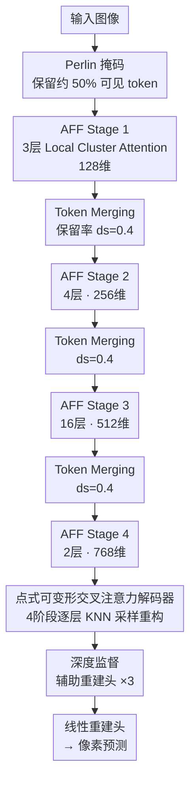

# AFFMAE: Scalable Vision Pre-Training for High-Resolution Microscopy Segmentation on Desktop Hardware

**会议**: ECCV2026  
**arXiv**: [2602.16249](https://arxiv.org/abs/2602.16249)  
**代码**: [https://github.com/najafian-lab/affmae](https://github.com/najafian-lab/affmae)  
**领域**: 语义分割  
**关键词**: 掩码自编码器, 层次化视觉Transformer, 显微图像分割, 自适应令牌合并, 桌面级预训练

## 一句话总结
AFFMAE 将 AutoFocusFormer 的自适应离网（off-grid）令牌合并机制融入 MAE 框架，在保持仅编码可见令牌的高效不对称设计的同时，实现了层次化骨干的掩码友好预训练，使得高分辨率显微图像分割预训练可在单张消费级 GPU 上完成，以同等参数量匹配 ViT-MAE 分割精度，预训练吞吐提升 2 倍、高分辨率微调吞吐最高提升 5 倍。

## 研究背景与动机

生物医学诊断每天产生海量未标注高分辨率图像（病理切片、电镜、放射影像），在其上进行域内自监督预训练能大幅提升下游分割性能——多个工作反复证实，在目标域预训练比通用 ImageNet 初始化带来更显著的迁移增益。然而，高分辨率预训练通常依赖服务级多 GPU 集群，对于受数据隐私法规（如 HIPAA/IRB）约束的实验室来说，将敏感医学图像上传云端既不现实，也面临冗长的合规审批。这种计算与隐私的双重约束催生了对「桌面级消费 GPU 上就能完成的域内高分辨率预训练」的迫切需求。

掩码自编码器（MAE）以不对称编码器设计——只编码可见 token，丢弃被掩码 token——天然降低了显存和计算量，是资源受限场景的理想起点。但当输入分辨率升至 1024×1024，标准 ViT-MAE 的 token 数急剧膨胀，即便只处理可见 token，显存仍需 25 GB 以上。层次化视觉 Transformer（Swin, PVT）通过逐步下采样降低 token 数来缓解扩展性问题，但它们的核心操作（窗口注意力、网格化 patch merging）要求 token 维持稠密网格布局——一旦像 MAE 那样丢弃掩码 token，网格立即出现空洞，窗口划分和合并运算随之失效。现有方案要么在编码器中引入 mask token 保留稠密表示（牺牲 MAE 的节省），要么设计复杂的 mask-aware 算子，结果在细长结构（如肾小球基底膜上宽仅数像素的滤过裂隙）分割上反而落后 ViT 基线。

本文的核心 insight 是：网格稠密假设才是层次化与 MAE 冲突的根源，换一个不需要网格假设的自适应下采样骨干就能同时拿到两边的优势。**核心 idea：将 AutoFocusFormer 的自适应离网（off-grid）令牌合并与 MAE 仅编码可见令牌策略深度融合——编码器在离网坐标上进行本地注意力与可学习下采样合并，始终 mask-agnostic；解码器用点式可变形交叉注意力从多尺度离网特征还原密集重建，配合数值稳定的混合精度 Triton 内核和 Perlin 噪声结构化掩码策略，使得单张消费级 GPU 即可完成 1024 分辨率下的高分辨率显微图像预训练与微调。**

## 方法详解

### 整体框架

AFFMAE 采用不对称编码器-解码器架构，继承 MAE「编码器只看可见 token」的高效设计，但用 AutoFocusFormer（AFF）替代标准 ViT 作为骨干。AFF 为每个 token 维护一个显式 2D 空间坐标，通过局部平衡聚类做注意力计算，再根据可学习重要性分数做自适应下采样——在信息密集区域保留更多 token、在纹理稀疏区域激进合并。

编码器分四个阶段，每阶段由若干 Local Cluster Attention 块堆叠，之后通过可学习 Token Merging 模块按指定保留率（如 40%）将 token 合并到下一阶段。解码器以可学习的 mask token（带绝对位置编码）为查询，在编码器各阶段输出上通过 KNN 采样构造虚拟特征，逐步还原密集空间结构。该解码器可在微调时直接充当分割头，无需额外引入 UperNet 或 Mask2Former 等重解码器。

### 关键设计

**1. 自适应离网令牌合并：让下采样理解图像内容而非遵循网格**

标准层次化骨干的下采样是确定性网格对齐操作：每个 2×2 的 patch 块均匀合并为一个 token，无论该区域包含关键结构还是纯背景。AFF 彻底打破这一约束：每个 token 除特征向量外维护 2D 空间坐标，下采样前由轻量 MLP 预测重要性分数，按保留率保留 top-k 作为锚点 token，其余 token 可微地合并到最近锚点，同时融合特征和空间支撑域。这使得含滤过裂隙、基底膜边缘等高信息密度区域能自动保留更多 token 甚至原始分辨率级坐标，而大面积均匀背景被激进合并释放计算资源。这是 AFFMAE 在细长结构分割上超越所有网格化层次基线的根本原因——不依赖固定 stride 的均匀降采样，细长裂隙不会被稀释到相邻 patch 中。

**2. 点式可变形交叉注意力解码器：从离网特征逐层重建密集表示**

编码器各阶段输出的 token 位于不规则空间坐标，无法做标准网格对齐解码。解码器对每个 mask token 查询（带绝对位置编码）预测 2D 偏移量 $\Delta = g(\mathbf{f})$，得采样点坐标 $\mathbf{q} = \mathbf{r} + \Delta$；然后在编码器各阶段特征上以 $\mathbf{q}$ 为中心 KNN 收集最近可见 token，用距离加权 softmax 聚合生成虚拟采样特征。聚合核从原始反幂加权 $w_i \propto d_i^{-p}$ 替换为指数距离核 $w_i = \mathrm{softmax}_i(-p d_i)$——前者在混合精度下近距离权重爆炸、远距离下溢为零，后者等价于带温度参数的 stable softmax，可在 fp16 下安全计算。解码器以 4 个阶段从粗到细融合多尺度离网特征，最终还原到密集网格。该解码器在微调时直接充当分割头，消除了预训练-微调之间的解码器架构差异。

**3. KNN 缓存查找：将解码器的邻居检索降至 O(1)**

点式解码器的核心瓶颈是反复的 KNN 查询——每个采样点需在全部可见 token 上做最近邻搜索，数千次查询累积开销可观。AFFMAE 利用关键事实：token 坐标的原始来源是密集的 $H \times W$ patch 网格（如 $64 \times 64 = 4096$ 个格点），虽然在编码过程中坐标变得不规则，但格点空间是固定的。预计算一个紧凑 $H \times W \times K$ 查找表，每个网格单元存储最近的 K 个可见 token 索引。运行时将连续查询位置量化到最近网格单元，邻居检索退化为查表加小规模距离计算，从全量扫描降为近似 O(1)，且距离计算与 softmax 加权可融合进同一 Triton 内核，前向加速 1.5×、反向加速 1.4×。

**4. 深度监督对抗深层特征坍缩：为稀疏深层注入强梯度信号**

在激进下采样的稀疏层次结构中，AFFMAE 观察到深层 token 的有效秩（Normalized Effective Rank）急剧下降——特征退化为仅表示位置编码的均匀模式，语义信息几乎完全丢失。根本原因是深层 token 数量极少，仅靠最终像素重建损失难以提供足够梯度信号。AFFMAE 在解码器各中间阶段附加辅助重建头，迫使模型直接从稀疏中间特征重建被掩码输入。有效秩监控显示：不加深度监督时最深阶段 $R \approx 0.2$（接近位置嵌入的秩），加之后稳定在 $R > 0.7$，消融实验中带来 +3% mIoU 的显著提升。注意仅在最深层做重建（Stage 4 Recon.）反而导致 mIoU 从 0.59 暴跌至 0.43，说明缺乏低层空间细节的冗余信号不足以引导密集语义学习。

**5. Perlin 掩码：保留自然图像频谱统计的结构化掩码策略**

高分辨率下随机掩码的效果急剧下降：当 patch 相对图像尺寸变小时，被掩码区域可通过相邻可见 patch 的简单插值重建，模型无需学习全局结构即可降低损失。Perlin 噪声生成的连续区域在形态上更接近生物结构（膜、裂隙的走向），迫使模型必须理解全局几何关系才能完成重建。频谱分析验证了设计动机：原始 EM 图像的功率谱密度遵循自然图像典型的 $1/f^\alpha$ 幂律衰减（$\alpha \approx 2$）；随机掩码在高频段引入白噪声伪影，中低频段产生明显频谱空隙；Perlin 掩码的频谱曲线几乎与原始图像重合，在整个频率范围内保持自然统计特性。消融实验中 Perlin 掩码相对随机掩码提升约 0.6 个 mIoU 点。

### 一个完整示例

以 512×512 的肾小球 EM 图像为例。输入被 8×8 patch 划分（共 4096 个 token），Perlin 掩码后约 50%（约 2048 个）保留为可见 token。进入 Stage 1（128 维、3 层 Local Cluster Attention），然后在 Token Merging 中以 40% 保留率（约 819 个 token）下采样到 Stage 2（256 维、4 层）。Stage 3 进一步合并至约 328 个 token（512 维、16 层），Stage 4 至约 131 个 token（768 维、2 层）。解码端以 2048 个 mask token 为查询，分 4 层逐层对编码器各阶段做可变形交叉注意力——先在 Stage 4 特征上 KNN 获取粗粒度全局信息，再逐层引用 Stage 3-1 细粒度局部信息，最终线性头输出 512×512 重建。深度监督的辅助头在 Stage 3 和 Stage 2 的解码特征上也分别计算重建损失。微调时，同一解码器输出三类分割（背景 / PGBMI基底膜 / 裂隙），batch size 4 在 RTX 5090 上仅耗 13.4 GB 显存，微调吞吐达 20 Img/s（ViT-MAE 同分辨率仅 4 Img/s）。

### 损失函数 / 训练策略

预训练使用 MSE 重建损失（掩码区域），加上深度监督各中间层重建头的辅助 MSE 损失（求和）。优化器 AdamW（$\beta_1=0.883,\ \beta_2=0.935$），Cosine Annealing 学习率，base 3.5e-4、最小 1e-6、10,000 步 warmup，weight decay 0.05。预训练仅做 CLAHE 均衡化和归一化，无额外数据增强。400 epoch 在单张 RTX 5090 完成，有效 batch size 256。微调使用分类加权 BCE + Dice 损失（背景 / PGBMI / 裂隙权重 = 0.2 / 2.0 / 3.0），加入仿射变换、光度畸变和弹性畸变增强，层间学习率衰减 0.6，400 epoch。

## 实验关键数据

### 主实验

在足突宽度（FPW）数据集上对比各方法在不同分辨率下的分割 mIoU 和微调吞吐：

| 方法 | 分辨率 | 微调吞吐 (Img/s) | 显存 | Slits IoU | mIoU | FPW MAE |
|------|--------|-------------------|------|-----------|------|---------|
| ViT-MAE | 512 | 37 | 6.7 GB | .447 | .606 | 21.18 |
| ViT-MAE | 1024 | 4 | 25.4 GB | .494 | .630 | 19.26 |
| SimMIM | 1024 | 21 | 18.0 GB | .506 | .628 | 19.70 |
| HiViT | 1024 | 18 | 14.9 GB | .480 | .623 | 19.54 |
| GreenMIM | 1024 | 12 | 17.1 GB | .480 | .597 | 21.69 |
| MixMAE | 1024 | 21 | 15.3 GB | .473 | .607 | 20.45 |
| **AFFMAE (Ours)** | **512** | **82** | **6.2 GB** | **.459** | **.608** | 21.16 |
| **AFFMAE (Ours)** | **768** | **36** | **7.9 GB** | **.490** | **.622** | 18.61 |
| **AFFMAE (Ours)** | **1024** | **20** | **13.4 GB** | **.514** | **.633** | **15.97** |

预训练效率（512×512, batch 32）：

| 方法 | GFLOPs | 显存 (GB) | 吞吐 (Img/s) |
|------|--------|-----------|-------------|
| ViT-MAE | 274.5 | 29.7 | 76 |
| SimMIM | 119.3 | 27.7 | 111 |
| HiViT | 96.7 | 11.7 | 318 |
| GreenMIM | 71.3 | 11.9 | 76 |
| MixMAE | 126.3 | 20.1 | 146 |
| **AFFMAE (Ours)** | **58.7** | **14.5** | **151** |

### 消融实验

| 配置 | mIoU | 说明 |
|------|------|------|
| Full (ds=0.4, Perlin, DeepSup) | 0.5908 | 默认配置 |
| 保留率 ds=0.5 | 0.6009 | 更多 token 但增 20% 计算 |
| 保留率 ds=0.25 | 0.5729 | 过强下采样丢失细结构 |
| 掩码率 75% | 0.5739 | 显微图像需更低掩码率（与 MAE 推荐 75% 不同） |
| 随机掩码 | 0.5947 | 不如 Perlin 掩码（0.6009） |
| 无深度监督 | 0.5734 | 深层特征坍缩导致 −3% |
| 仅 Stage 4 重建 | 0.4353 | 缺乏低层信息，比完全去掉还差 |

### 关键发现

- **深层特征坍缩是主要瓶颈**：深度监督带来单一消融中最大增益（+3% mIoU），有效秩监控显示无深度监督时最深阶段 $R \approx 0.2$，语义几乎完全丢失。仅在最深层加重建反而将 mIoU 从 0.59 拉低到 0.43——多阶段监督不可或缺。
- **网格化层次骨干在细小结构上的系统性劣势**：所有基于 Swin 的基线（HiViT, SimMIM, MixMAE, GreenMIM）在 Slits 类上 IoU 均显著低于 ViT-MAE 和 AFFMAE，差距 3-6 个点，验证了网格对齐均匀下采样对细长结构的破坏性。AFFMAE 在 Slits IoU 上以 .514 超越 ViT-MAE 的 .494（1024 分辨率），是唯一在所有分辨率上 Slits IoU 胜出 MAE 的层次方法。
- **桌面端训练切实可行**：AFFMAE 预训练仅需 14.5 GB 显存（RTX 5090），微调 1024×1024 仅 13.4 GB，将此前需要 A100 级 GPU 的工作压入消费级显卡范围。扩展性测试显示即使在 896×896 分辨率预训练，显存也控制在 22.3 GB（RTX 5090 的 32 GB 上限内）。

## 亮点与洞察

- **离网 token 合并 + MAE 是天然适配**：AFFMAE 证明「不需网格假设的自适应下采样骨干」与 MAE 天然互补，比所有在网格骨干上适配 MAE 的方案（SwinMAE, MixMAE, GreenMIM）更简洁、更有效。这个 insight 对高分辨率视觉预训练的骨干设计具有指导意义。
- **深度监督 + 有效秩监控**是发现并解决稀疏层次网络特征坍缩的高效工具组合。有效秩提供了一个无需下游任务即可量化表征质量的代理指标，值得在类似架构中推广。
- **Perlin 掩码的频谱合理性论证**：从自然图像统计视角论证了高分辨率下需要结构化掩码而非随机掩码，并用频谱分析给出了定量证据——掩码策略的频谱特性应匹配数据分布，这一步提升了掩码设计的理论严谨性。
- **解码器即分割头的工程简化**：点式可变形交叉注意力解码器在微调时可直接当分割头，消除了预训练-微调之间的解码器架构差异，避免适配 UperNet 等复杂头，且参数效率更高（~10M）。

## 局限与展望

- **不规则 token 集的底层效率瓶颈**：离网索引的 gather/scatter 操作和 KNN 查询的带宽开销使理论 FLOPs 减少不能完全转化为 wall-clock 加速。高分辨率（>1200px）密集查找表可能超出缓存容量，使简单网格索引反而更快。进一步优化邻域查找、空间填充曲线和内核设计是关键方向。
- **仅在 2D TEM 验证**：实验全部基于 2D 透射电镜（肾小球 EM）。论文指出扩展到 3D 体素在架构上无本质障碍，但 3D 场景下聚类平衡、邻域查找、各向异性掩码和内核优化都是开放挑战。
- **预训练效率对比的硬件 caveat**：GreenMIM/HiViT/MixMAE 在 H100 上运行，AFFMAE 和 MAE 在 RTX 5090，预训练时间跨硬件对比需谨慎（FLOPs 和显存与硬件无关，公平）。
- **Lucchi++ 数据集略低于 MAE**：表明自适应下采样和 Perlin 掩码的收益在不同显微模态间可能有差异，需更多模态验证泛化性。

## 相关工作与启发

- **vs MAE (He et al., 2022)**: MAE 用 ViT 骨干 + 仅编码可见 token，但 ViT 在超高分辨率下令牌数膨胀；AFFMAE 用 AFF 骨干替代 ViT，通过自适应离网下采样将 token 数可控地逐阶段减少。
- **vs SwinMAE / MixMAE / GreenMIM**: 这些方法在 Swin 等网格化层次骨干上适配 MAE，但不得不引入 mask token 或 mask-aware 算子来维护网格稠密性，导致预训练-微调架构差异。AFFMAE 从根源上绕过问题——用不需要网格假设的骨干。
- **vs SimMIM**: SimMIM 在层次骨干上保留稠密 token 流和 mask token，计算量远高于 AFFMAE（预训练显存 27.7 GB vs 14.5 GB），且网格均匀下采样在细小结构分割上表现不佳。
- **vs AutoFocusFormer (AFF)**: AFF 提供了离网 token 合并的基础架构，但原始 AFF 只做监督学习；AFFMAE 将其融入 MAE 自监督框架，并增设深度监督、Perlin 掩码、数值稳定核和高效 Triton 内核等关键自监督适配改进。

## 评分
- 新颖性: ⭐⭐⭐⭐ 将自适应离网 token 合并与 MAE 融合的思路新颖，深度监督对抗特征坍缩和 Perlin 掩码频谱分析都提供了有价值的洞见。
- 实验充分度: ⭐⭐⭐⭐ 设计动机均有消融实验支撑（有效秩监控、深度监督/掩码策略/保留率等系统消融），并在多个公共 EM 数据集验证了泛化性。预训练效率对比需注意硬件差异。
- 写作质量: ⭐⭐⭐⭐ 动机叙述清晰，问题陈述具体到量化指标和视觉证据，方法内部一致性良好——有效秩可视化直接支撑深度监督的设计动机。
- 价值: ⭐⭐⭐⭐⭐ 使受隐私约束的实验室能在桌面级 GPU 上完成高分辨率显微图像域内预训练，对生物医学影像分析社区有直接实用意义，离网下采样 + MAE 的组合思路值得更多高分辨率视觉任务借鉴。

<!-- RELATED:START -->

## 相关论文

- [\[ECCV 2026\] SkelEM: Training-Signal Decoupling of Skeleton and Diffusion for Self-supervised Axial Super-Resolution in Volume Microscopy](skelem_training-signal_decoupling_of_skeleton_and_diffusion_for_self-supervised_.md)
- [\[CVPR 2025\] COSMOS: Cross-Modality Self-Distillation for Vision Language Pre-training](../../CVPR2025/segmentation/cosmos_cross-modality_self-distillation_for_vision_language_pre-training.md)
- [\[CVPR 2026\] F2Net: A Frequency-Fused Network for Ultra-High Resolution Remote Sensing Segmentation](../../CVPR2026/segmentation/f2net_a_frequency-fused_network_for_ultra-high_resolution_remote_sensing_segment.md)
- [\[ECCV 2024\] DreamLIP: Language-Image Pre-training with Long Captions](../../ECCV2024/segmentation/dreamlip_language-image_pre-training_with_long_captions.md)
- [\[CVPR 2026\] SPAR: Single-Pass Any-Resolution ViT for Open-Vocabulary Segmentation](../../CVPR2026/segmentation/spar_single-pass_any-resolution_vit_for_open-vocabulary_segmentation.md)

<!-- RELATED:END -->
