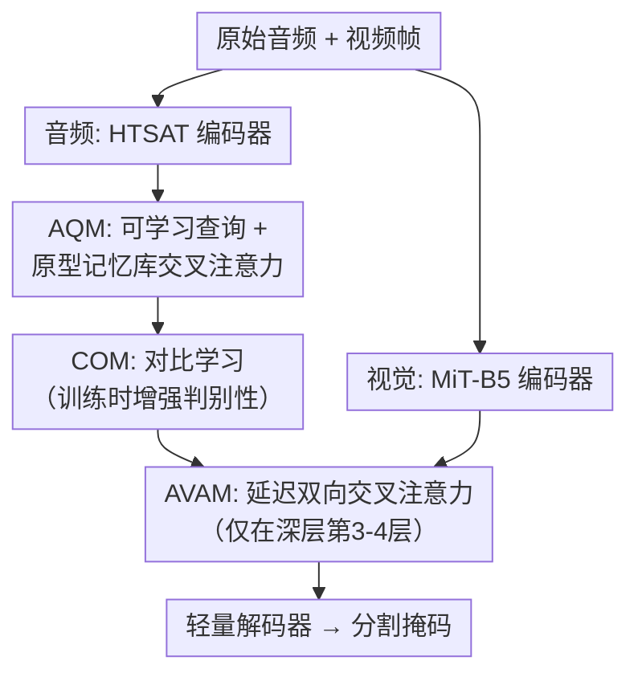

# Delayed Bidirectional Alignment via Disentangled Audio Semantics for Audio-Visual Segmentation

**会议**: ECCV2026  
**arXiv**: [2512.20117](https://arxiv.org/abs/2512.20117)  
**代码**: 待确认  
**领域**: 语义分割  
**关键词**: 音频引导分割、多源解耦、跨模态对齐、对比学习、原型记忆库

## 一句话总结

DDAVS 通过原型记忆库锚定的可学习查询来解耦多源音频语义，并引入仅在深层进行的延迟双向交叉注意力对齐视听模态，在 AVSBench 和 VPO 多源/多类/多实例场景上全面超越此前 SOTA。

## 研究背景与动机

音频-视觉分割（AVS）的任务是在给定音频信号和图像/视频的条件下，以像素级精度分割出发声物体。这个任务不像传统视觉分割那样分割「所有可见物体」，而是只分割「正在发出声音』的物体，因此天然要求模型建立精细的跨模态对应关系。早期方法通常走这样一条路线：先用可学习查询将音频信号解耦为若干语义分量，再让这些音频语义以单向方式引导视觉特征进行分割。然而，在实际场景中这条路线暴露了两大瓶颈。

第一个瓶颈是多源纠缠。真实世界的场景里通常同时有多个发声源——比如一个人说话时旁边引擎在响、或者在多人演奏的场景里吉他、萨克斯和人声混在一起。现有方法用可学习查询解耦音频时，查询是在一个完全自组织的隐空间中自发生成的，没有显式的结构约束，结果往往是声学上或视觉上更显著的对象（更大声或更大个头）主导了分割结果，而较弱的声音源被压制甚至丢失。第二个瓶颈是视听错位。有些情况下发声物体在画面中很小或很远，视觉提供的定位信号很弱；更极端的情况是声源在画面外（off-screen），视觉完全没有对应的锚点。现有的单向对齐策略让音频查询去影响视觉特征，但反过来视觉信息无法反馈给音频组件来抑制无关噪声或强化场景一致的声学信号——这使得模型在面对弱视觉信号时容易产生错误的激活。

本文的核心 insight 是：这两大瓶颈其实共享同一个病因——解码阶段的「及时对齐」反而伤害了高层的语义理解。如果让对齐发生在浅层，音频和视觉的低级噪声会互相干扰、模糊掉真正的语义对应关系。DDAVS 的切入角度是：把解耦和对齐分开处理——先用一个外部原型记忆库给音频查询一个结构化的语义锚定空间（解耦出干净的语义分量），再把跨模态对齐延迟到编码器深层去做双向交互。**核心 idea：将 AVS 拆解为「原型锚定的音频语义解耦 → 延迟双向跨模态对齐」两阶段，通过结构化语义空间和深层交互分别解决多源纠缠和视听错位。**

## 方法详解

### 整体框架

DDAVS 的输入是一段原始音频波形和对应的视频帧，输出是发声区域的像素级分割掩码。整个流程分三条线路：音频分支经过 HTSAT 编码器提取音频特征后，进入 Audio Query Module（AQM）生成一组解耦的音频语义查询向量；这些查询经过 Contrastive Optimization Module（COM，仅在训练时启用）增强判别鲁棒性；视觉分支经过 MiT-B5 编码器提取多尺度视觉特征；然后在 Audio-Visual Alignment Module（AVAM）中，音频查询和视觉特征经过仅作用于深层（第 3-4 层）的延迟双向交叉注意力逐步对齐融合，最终由一个轻量解码器输出分割掩码。

### 关键设计

**1. Audio Query Module（AQM）：用原型记忆库给解耦查询一个结构化语义锚点**

AQM 要解决的核心矛盾是：直接让可学习查询从音频特征中自发生成语义分量，得到的向量各自落在什么「意思」上完全不可控——有的查询可能坍缩到同一个声音源，有的查询学到的语义空间对下游分割没有帮助。DDAVS 的做法是引入一个全局原型记忆库，为查询提供类别先验知识。

具体分三步。第一步是构建记忆库：从训练集中筛选出每个类别只有单一发声源的音频片段（如只有吉他声的片段、只有人声的片段），用 HTSAT 提取特征后对每个类别的特征做 K-means++ 聚类，把每个聚类中心附近的若干特征固定为该类别的原型向量，所有类别的原型拼成全局记忆库。这个记忆库在训练和推理中都是冻结的，确保全局一致的语义基准确立。第二步是查询生成：用 Q-Former 将 HTSAT 输出的音频 token 序列映射为一组可学习查询（默认 5 个），每个查询天然关注不同的声音组件。第三步是库引导精炼：这组初始查询通过交叉注意力与原型记忆库交互——查询作为 Q，记忆库的原型作为 K/V，从库中拉取与自己最相关的语义原型信息来校准自己的语义方向。得到的是一个既保留查询多样性、又含有类别先验知识和结构化空间约束的解耦语义查询。

**2. Contrastive Optimization Module（COM）：用增强对比学习提升查询的判别鲁棒性**

尽管 AQM 让查询有了结构化的语义锚点，但在多源混叠场景中，较弱的音频源仍然可能被主导源掩盖，导致不同查询间的语义分离度不够。COM 的思路是：让同一段音频经过两种数据增强路径（原声和加噪变调），分别提取查出后拉近同一查询在不同增强下的正例对、推远不同查询间的负例对，使每个查询在各种声学扰动下都能稳定地与源语义绑定而不被干扰。

具体上，原始音频经过链条增强（混响、音高偏移、动态范围压缩、音量抖动）得到增强版本，但增强版只用于 COM 分支，不影响主分割路径的音频特征。然后将原声查询集合和增强后的查询集合分别送入投影头做 L2 归一化，再在两者之间做 InfoNCE 对比损失——让同一个查询的正例对彼此靠近，不同查询的负例对互相远离。这个对比学习只在训练时施加，推理时无额外开销，但显著提升了弱源查询的判别性，消融中 +AQM+COM 比 +AQM 高约 2.2% J&F。

**3. Audio-Visual Alignment Module（AVAM）：延迟双向交叉注意力对齐**

传统 AVS 方法的对齐要么是单向的（音频→视觉），要么在每层都做双向对齐但用门控机制仅缩放音频强度。DDAVS 的 AVAM 在两个方面做了设计选择。第一个选择是「延迟对齐」：跨模态交叉注意力只施加在 4 层 Transformer 块的第 3-4 层（深层），跳过前两层的低层特征。动机是浅层特征主要编码边缘、纹理等低级信息，如果此时就注入音频信息，噪声会互相干扰；在深层，视觉特征已经具备了实例级的语义结构（如完整的人的轮廓而不是一堆碎片化的边缘），音频语义也有了解耦后的清晰语义，此时做对齐能够建立精确的「发声物体→听觉类别」对应关系。实验也验证了前两层做对齐反而掉点（第 1 层单独对齐比不做的基线还差）。

第二个选择是「双向」：每一轮对齐不是单向让音频查询 attend 视觉 token，而是先让音频查询 attend 到视觉 token 上来提取与发声相关的区域，再用更新后的音频嵌入反过来作为 K/V attend 到视觉流上，把判别性声学线索反注入视觉。声→视方向的注意力起到去噪和聚焦作用（用视觉的稳定空间结构约束相对有噪声的音频代表），视→声方向则用语义丰富的音频特征进一步锐化视觉激活图。这个过程在每个对齐深度重复，逐步精化。

### 损失函数 / 训练策略

总损失由四项组成：交叉熵损失提供逐像素监督，Dice 损失和 IoU 损失鼓励区域完整性和边界对齐，外加 COM 的对比学习损失。四个损失的权重通过超参数 $\lambda$ 调节。视觉骨干用 MiT-B5，音频编码器用 HTSAT（AudioSet 预训练）。训练在 8×RTX 4090 上进行，AdamW 优化器，初始学习率 1e-4，batch size 64。

## 实验关键数据

### 主实验

| 数据集 | 指标 | DDAVS | 之前SOTA | 提升 |
|--------|------|-------|----------|------|
| AVS-Objects-S4（单源） | J&F | 92.4 | DDESeg: 91.1 | +1.3 |
| AVS-Objects-MS3（多源） | J&F | 76.0 | CCFormer: 75.6 | +0.4 |
| AVS-Semantic（语义） | J&F | 52.9 | AAVS: 50.9 | +2.0 |
| VPO-MS（多源） | J&F | 76.1 | DDESeg: 74.3 | +1.8 |
| VPO-MSMI（多源多实例） | J&F | 72.8 | RAVS: 69.3 | +3.5 |

在最具挑战的 AVS-Semantic 子集（涉及空间和类别歧义）和 VPO-MSMI（多源多实例）上提升最为显著，分别高出前 SOTA 2.0% 和 3.5% J&F，说明解耦语义+延迟双向对齐在处理复杂场景时优势明显。

### 消融实验

| 配置 | AVS-MS3 J&F | AVSS J&F | 说明 |
|------|-------------|----------|------|
| 基线（无 AQM/COM/AVAM） | 69.7 | 48.6 | 仅编码器+Transformer+解码器 |
| +AQM | 71.9 | 49.8 | 原型库查询解耦贡献 +2.2/+1.2 |
| +AQM+COM | 74.1 | 51.7 | 对比学习贡献巨大 +4.4/+3.1 |
| +AVAM | 73.2 | 51.5 | 延迟双向对齐贡献 +3.5/+2.9 |
| +AQM+AVAM | 73.8 | 51.5 | 解耦+对齐组合 |
| **DDAVS（全部）** | **76.0** | **52.9** | 全部组件协同，比基线高 +6.3/+4.3 |

### 关键发现

- **COM 是最大贡献者**：在 AVAM 已就位的前提下，再加上 AQM+COM 能把 J&F 从 73.2 提升到 76.0，说明即使空间对齐已经建立，优化查询可分性仍然是独立且重要的维度。
- **延迟到深层（第 3-4 层）对齐是最优配置**：前 1-2 层做交叉注意力甚至会低于基线；只做第 4 层不如第 3+4 层；扩展到更多层（如 1-4 全做）反而因为引入低层噪声而掉点。
- **原型记忆库即使全部移除（OOB-100%）仍然超过基线**，说明原型锚定提供的结构化空间约束有效但模型并不完全依赖它，具有很强的鲁棒性。
- t-SNE 可视化显示 DDAVS 的音频表示在多源场景中不会坍缩到单一类别，而是在混合源的各成分之间形成内插分布，且在跨数据集（AVSBench vs ESC-50）上保持了类别一致性。

## 亮点与洞察

- **把「延迟对齐」从工程直觉上升为系统设计原则**：通过在深层做双向交叉注意力而非每层都对齐，简洁地避免了低级噪声对跨模态语义映射的干扰。这种「对齐时机比对齐方式更重要」的视角对其他多模态任务（视频描述、视觉问答）也有启发。
- **原型记忆库既不是 finetune 也不是外部分类器**：它保持冻结，仅通过交叉注意力给查询提供语义锚点——在训练中引导而不主导，既不过拟合又给了充足的结构引导。
- **增强对比学习只影响查询判别性而不改变原始音频特征**：增强版仅走 COM 分支，主分割路径完全工作在干净的原始音频上，巧妙隔离了增强引入的噪声与主任务的分割学习。

## 局限与展望

- 当前验证局限于有明确定义错位范围和人工分类的基准场景，开放域视频和流式音频场景尚未覆盖。
- 原型记忆库的构建依赖训练集中单源片段的筛选和 K-means 聚类，如果训练集质量低或类别覆盖不足，库作为全局锚点的有效性会下降。
- 模型总参数量约 150M，FLOPs 约 86G（比基线高 2.16G），算力要求中等偏高。

## 相关工作与启发

- **vs DDESeg（CVPR 2025）**：两者都用特征库来辅助音频解耦，但 DDESeg 通过 KNN 从库中近似语义（受限于 K 个相近类别的语义空间），而 DDAVS 用可学习查询+交叉注意力从库中按需拉取更灵活的语义组合；DDESeg 的门控双向对齐仅缩放音频强度，DDAVS 的全交叉注意力对称双向交互更彻底。
- **vs AVESFormer**：尽管也提出了延迟对齐，但 AVESFormer 的对齐是单向的（音频→视觉），没有视觉到音频的反馈回路，难以处理 off-screen 等错位场景。
- **vs Contrastive AVS 方法（CAVP, DiffusionAVS）**：它们把对比学习用在音频-视觉模态对齐上（拉近配对声画、推远非配对声画），DDAVS 则把它用在音频内部的查询判别上（不涉及跨模态），目标完全不同。

## 评分

- 新颖性: ⭐⭐⭐⭐ 将延迟对齐、原型库锚定的解耦和对比学习判别增强三个相对独立的设计系统性地整合为两阶段框架，简洁有效，但每个组件本身不属于完全未见过的新范式。
- 实验充分度: ⭐⭐⭐⭐⭐ 在 2 个基准的 5 个子集上对比了 20+ 个基线，消融完全（组件、位置、查询数量、库鲁棒性、骨干组合），t-SNE 可视化补充了语义分析，非常扎实。
- 写作质量: ⭐⭐⭐⭐⭐ 动机清晰，introduction 用三个子图清晰对比了三类方法的差异，实验组织有序，图注和表格都很清晰。
- 价值: ⭐⭐⭐⭐ AVS 是一项实用且有挑战性的任务，DDAVS 在多个困难场景下取得了一致提升，方法简洁、设计原则有启示性，但增量改进为主。

<!-- RELATED:START -->

## 相关论文

- [\[CVPR 2025\] Robust Audio-Visual Segmentation via Audio-Guided Visual Convergent Alignment](../../CVPR2025/segmentation/robust_audio-visual_segmentation_via_audio-guided_visual_convergent_alignment.md)
- [\[CVPR 2025\] Dynamic Derivation and Elimination: Audio Visual Segmentation with Enhanced Audio Semantics](../../CVPR2025/segmentation/dynamic_derivation_and_elimination_audio_visual_segmentation_with_enhanced_audio.md)
- [\[ICCV 2025\] Implicit Counterfactual Learning for Audio-Visual Segmentation](../../ICCV2025/segmentation/implicit_counterfactual_learning_for_audio-visual_segmentation.md)
- [\[ICML 2026\] LightAVSeg: Lightweight Audio-Visual Segmentation](../../ICML2026/segmentation/lightavseg_lightweight_audio-visual_segmentation.md)
- [\[CVPR 2026\] SouPLe: Enhancing Audio-Visual Localization and Segmentation with Learnable Prompt Contexts](../../CVPR2026/segmentation/souple_enhancing_audio-visual_localization_and_segmentation_with_learnable_promp.md)

<!-- RELATED:END -->
