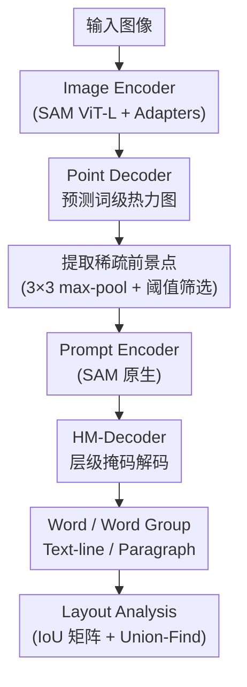

# ET-SAM: Efficient Point Prompt Prediction in SAM for Unified Scene Text Detection and Layout Analysis

**会议**: ECCV 2026  
**arXiv**: [2603.25168](https://arxiv.org/abs/2603.25168)  
**代码**: 无 (论文称将开源)  
**领域**: 语义分割  
**关键词**: 场景文本检测, SAM, 点提示预测, 布局分析, 联合训练

## 一句话总结
ET-SAM 用轻量 Point Decoder 预测词级热力图以提取稀疏前景点，替代 Hi-SAM 从像素级分割中随机采样上千个点的做法，配合可学习任务提示和联合训练策略统一利用多粒度异构标注数据，在 HierText 上以约 3 倍推理加速达到有竞争力性能，并在 Total-Text/CTW1500/ICDAR2015 上平均 F-score 提升 11.0%。

## 研究背景与动机
场景文本检测领域长期存在一个割裂：不同方法各自针对单一文本粒度（词级、行级或段落级）设计专用参数，缺乏统一框架同时处理所有层级。HierText 数据集和 Unified Detector (UD) 的提出首次将统一场景文本检测与布局分析作为一个整体基准，随后 Hi-SAM 基于 SAM 实现了四层文本分割（pixel/word/text-line/paragraph），在精度上大幅领先 UD。

然而 Hi-SAM 有两个结构性瓶颈。第一，它依赖一个 S-Decoder 做像素级文本分割，从中随机采样约 1500 个前景点作为视觉提示——这些点每一个都要在后续分层掩码解码和后处理中逐点计算，推理延迟高达 4.4 秒/图。如果简单减少采样点数，性能会显著下降（只采 280 个点时各指标全面崩溃）。这意味着"大量点"本身不是冗余，而是 Hi-SAM 的点质量不够高、必须靠数量弥补。第二，Hi-SAM 要求每个训练样本都有完整的多粒度标注（词、行、段落缺一不可），而具备这种全标注的数据集极其稀缺，严重制约了数据扩展能力。

核心矛盾在于：**如何在保持甚至提升检测精度的前提下，用极少的高质量提示点替代密集随机采样，同时让模型能从仅有单一粒度标注的数据集中受益？**

ET-SAM 的回答是：不要"先分割再采样"，而是让一个专门设计的轻量解码器直接预测词中心热力图，从中提取天然落在文本核心区域的稀疏点作为提示。同时，通过可学习的任务提示（task prompt）区分不同数据集的标注粒度差异，用对齐并联的联合训练管线把多层次、仅词级、仅行级三类数据统一起来。核心 idea：**用可学习的点预测替代随机采样，用任务提示消解标注异构性**。

## 方法详解

### 整体框架
ET-SAM 的目标是对输入图像同时输出词、词群、文本行、段落四层分割掩码，并以此完成布局分析。它由四个组件构成：(1) 带 Adapter 的 SAM ViT-L 图像编码器（沿用 Hi-SAM 配置）；(2) 一个轻量可训练的 Point Decoder，从 SAM 原始 Mask Decoder 精简而来，负责预测词级热力图；(3) 直接继承 SAM 的 Prompt Encoder；(4) 层级掩码解码器 HM-Decoder，是 SAM Mask Decoder 的定制改造版，以稀疏点提示为引导、同时输出四个粒度的掩码和 IoU 分数。Point Decoder 和 HM-Decoder 内部均嵌入可学习任务提示，用于适配不同数据集的标注粒度差异。

Point Decoder 输出的词热力图中，词中心区域呈现峰值激活。对热力图做 3x3 最大池化提取局部极值，超过阈值的坐标即为稀疏前景点（HierText 上约 287 个，远少于 Hi-SAM 的 1500 个），送入 Prompt Encoder 编码后引导 HM-Decoder 进行分层掩码预测。最后基于段落掩码的 IoU 矩阵，用 Union-Find 算法完成布局分析。

### 关键设计

**1. Point Decoder：从"先分割再采样"到"直接预测稀疏点"**

Hi-SAM 的做法是 S-Decoder 先做像素级文本分割，再从中随机采样上千个前景点——这带来两个问题：分割本身耗时，且随机采样的点质量无法保证，简单减少采样数会导致性能崩塌。ET-SAM 的 Point Decoder 直接把 SAM 的 Mask Decoder 做三次减法：(1) 去掉视觉提示输入，替换为可学习输出 token 与任务提示 token 的逐元素加和；(2) 把原来为多粒度掩码设计的多个 MLP 合并为一个；(3) 删除 IoU 预测头。解码器输出一个与图像嵌入做空间点积得到的单通道热力图 $\hat{H} \in [0,1]^{256\times 256}$。

目标热力图的构造方式很关键：对每个词实例的标注，先确定词中心线，沿中心线密集采样点，每个采样点生成各向同性高斯核 $H_{xy} = \exp\left(-\frac{(x-p_x)^2+(y-p_y)^2}{2\sigma_w^2}\right)$，其中 $\sigma_w$ 根据词轮廓宽度自适应调整。所有词的所有采样点热力图取逐像素最大值合并为最终目标 $H$。这种"沿中心线散布高斯核"的设计使得热力图的激活区域恰好覆盖每个词的核心区域，无论直排还是弯曲文本都能准确定位，后续提取的极值点天然落在词内部，质量远高于随机采样。

Point Decoder 中的 Transformer Block 和转置卷积层保留 SAM Mask Decoder 的预训练权重，只有新增的可学习 token 和单 MLP 从头训练。这种部分初始化的策略让模型继承了 SAM 的视觉理解能力，同时只需少量训练即可学会预测词热力图。

**2. 可学习任务提示：消解跨数据集标注异构性**

不同数据集的标注规范差异会干扰模型优化：HierText 词密度高、文本行用四边形标注，CTW1500 用曲线表示文本行，Total-Text 弯曲文本多。ET-SAM 在 Point Decoder 和 HM-Decoder 中各引入一组可学习任务提示 token，共定义三种任务配置 ($N_{task}=3$)：Task 0 针对多层次数据集（如 HierText），Task 1 仅需词级掩码预测，Task 2 仅需文本行级掩码预测。

在 Point Decoder 中，任务提示 token $t_{p\_task}[i] \in \mathbb{R}^{1\times 256}$ 与可学习输出 token $t_{p\_out}$ 逐元素相加，使热力图预测自适应于当前任务的词密度特征。在 HM-Decoder 中，任务提示 token $t_{h\_task}[i] \in \mathbb{R}^{1\times 4\times 256}$（维度 4 对应四层掩码）同样与输出 token 相加，作为条件信号指定分割目标。消融实验表明，在 HierText 上两类任务提示联合使用获得最佳布局分析性能，在 Total-Text 上 Point Decoder 的任务提示贡献更大——这符合直觉：Total-Text 是单粒度数据集，HM-Decoder 只需关心词级分割，但词密度的数据集差异仍需 Point Decoder 的任务提示来应对。

**3. HM-Decoder：四点同时分割四层文本粒度**

HM-Decoder 以每个点提示为引导，同时输出该点对应的四层掩码：单个词 (word)、行内单词群 (word group)、完整文本行 (text-line)、所属段落 (paragraph)。结构上，它将 SAM Mask Decoder 的输出 token 扩展为四个可学习 token $t_{h\_out} \in \mathbb{R}^{1\times 4\times 256}$，与任务提示相加后广播到 $K$ 个点提示 token 上，拼接为 $[t'_{h\_out}; t_{point}] \in \mathbb{R}^{K \times (4+N_p) \times 256}$ 送入 Transformer。

关键设计在于高低分辨率的分工：文本行和段落掩码用低分辨率特征 $F_{lr} \in \mathbb{R}^{K\times 256\times 256\times 32}$ 经 MLP 投影后空间点积生成（$M_{l,p} \in \mathbb{R}^{K\times 256\times 256\times 2}$），词和词群掩码则将低分辨率特征上采样到 $384\times 384$ 并经卷积精炼得到高分辨率特征 $F_{hr}$，再用另一 MLP 投影融合，最终在 $384\times 384$ 分辨率上输出 $M_{w,wg}$。这个不对称设计是因为词和词群的边界精度对阅读体验影响更大，需要更高分辨率，而文本行和段落允许稍粗的粒度。

**4. 联合训练策略：把异构标注数据"对齐并联"**

除了 HierText，大多数场景文本数据集只有单一粒度标注（词级或行级），Hi-SAM 无法利用它们。ET-SAM 将现有数据集按标注类型分成三类（多层次/仅词级/仅行级），分别预处理为统一格式后随机打乱，构成三个对齐并行的数据集，以最长数据集为准循环采样较短数据集。

每个 batch 强制各包含三类数据集各一个样本，避免某一类主导优化方向。对仅含文本行标注的数据集，先用多层次和词级数据训练好的 Point Decoder 生成伪词热力图，再用已有文本行标注过滤误检（抑制不在任何文本行内的假阳性点），解决了"行级数据集缺少词标注、无法构造词热力图监督信号"的问题。

训练时对 HierText 每图随机采样 10 个文本行、对应词群和段落，再从每个词群随机选一个词；对词级/行级数据集随机采样 10 个词或文本行。从热力图中提取极值点并与对应掩码做交集，每个掩码最多随机选 2 个点，共产生最多 20 个点提示及其真值掩码。

### 一个完整示例：HierText 上的推理全流程

以 HierText 上一张包含密集文本的场景图像为例。输入图像经 Image Encoder 提取特征后，Point Decoder 以 Task 0 的任务提示为条件，生成一张 $256\times 256$ 的词热力图。3x3 最大池化扫描全图，保留激活值大于 0.6 的局部极值点，在 HierText 上平均得到约 287 个稀疏前景点。

这些点按每批 100 个送入 Prompt Encoder 编码为点提示 token，HM-Decoder 以 Task 0 的掩码任务提示为条件，对每个点同时预测四层掩码及其 IoU 分数。后处理阶段：先用 IoU < 0.5 过滤低质量文本行掩码，再用 Matrix NMS（阈值 0.5）抑制重叠行；被抑制的文本行对应的词群和段落掩码一并丢弃。保留的段落掩码之间计算 IoU 矩阵，Union-Find 算法合并重叠段落，聚合对应词群和文本行，完成布局分析。

整条管线中，Point Decoder 替代了 Hi-SAM 的 S-Decoder（省去像素级分割的时间），稀疏点替代了密集随机采样（HM-Decoder 和后处理的计算量大幅减少），最终整体推理耗时从 Hi-SAM 的 4.4 秒降至约 1.4 秒。

### 损失函数 / 训练策略

Point Decoder 的优化目标为 MSE loss：$\mathcal{L}_{point} = \|H - \hat{H}\|_2^2$。

HM-Decoder 的四层掩码损失各自由 BCE loss、Dice loss 和 IoU MSE loss 以 1:1:1 等权重组成。总损失为：

$$\mathcal{L} = 50 \times \mathcal{L}_{point} + \mathcal{L}_{word} + \mathcal{L}_{word\_group} + \mathcal{L}_{line} + 0.5 \times \mathcal{L}_{para}$$

热力图损失权重 50 是平衡点：权重过小（25）时点提示精度不足，密集文本场景性能下降；权重过大（100）时牺牲掩码质量，出现轻微性能回落。

联合训练在 8 张 V100 (32GB) 上以每卡 batch size 3 运行 120 epoch，优化器为 AdamW ($\beta_1=0.9$, $\beta_2=0.999$, weight_decay=0.05)，初始学习率 $10^{-4}$，第 100 epoch 降为 $10^{-5}$。联合训练后在各自标数据集上微调：HierText 50 epoch（lr 在第 35 epoch 降）、Total-Text/CTW1500/ICDAR2015 各 80 epoch（lr 在第 60 epoch 降），微调使用 4 张 V100、总 batch size 8。

## 实验关键数据

### 主实验

**HierText 上的统一检测与布局分析：**

| 方法 | Word PQ / F | Text-line PQ / F | Layout PQ / F |
|------|-------------|-------------------|---------------|
| UD | 48.21 / 61.51 | 62.23 / 79.91 | 53.60 / 68.58 |
| Hi-SAM-L | 63.10 / 81.83 | 66.17 / 84.85 | 57.61 / 74.49 |
| ET-SAM (Joint) | 62.52 / 80.84 | 65.40 / 84.08 | 57.74 / 74.51 |
| ET-SAM (FT) | **63.60 / 81.94** | **66.30 / 84.82** | **58.82 / 75.39** |

联合训练后 ET-SAM 与 Hi-SAM 性能基本持平（词级和行级略低，布局分析略高）；微调后全面超越 Hi-SAM，词级 PQ +1.08%、Layout PQ +1.08%。

**单粒度场景文本检测（F-score）：**

| 方法 | Total-Text | CTW1500 | ICDAR15 |
|------|-----------|---------|---------|
| Hi-SAM-L (zero-shot) | 70.2 | 77.4 | 77.4 |
| ET-SAM (Joint) | 86.4 | 87.1 | 83.5 |
| ET-SAM (FT) | **87.0** | **87.9** | 83.2 |

联合训练相较于 Hi-SAM 的 zero-shot 结果平均 F-score 提升 10.7%，微调后三数据集平均提升 11.0%。ET-SAM 与专用 SOTA 检测器（DPText-DETR 的 89.0/88.8/--）仍有差距，但作者在附录中证明使用相同训练数据时 ET-SAM 可反超 DPText-DETR 平均 1.2% F-score，差距主要源于训练数据规模而非方法本身。

### 消融实验

**Point Decoder 有效性（HierText 测试集）：**

| 配置 | Word PQ/F | Text-line PQ/F | Layout PQ/F | 平均点数 | 推理时间 |
|------|-----------|----------------|--------------|---------|---------|
| Hi-SAM-L (1500 点) | 63.10/81.83 | 66.17/84.85 | 57.61/74.49 | 1500 | 4.4s |
| Hi-SAM-L (280 点) | 61.04/78.82 | 62.29/79.30 | 54.59/70.43 | 280 | 1.2s |
| Hi-SAM-L + PointDec | 63.50/81.74 | 66.96/85.30 | 58.35/74.63 | 268 | 1.2s |
| ET-SAM (FT) | **63.60/81.94** | 66.30/84.82 | **58.82/75.39** | 286 | 1.4s |

核心发现：把 Hi-SAM 的 S-Decoder 替换为 Point Decoder（第三行），在点数相近（268 vs 280）的情况下性能从"崩塌"恢复到"超越原版"，尤其文本行和布局层级提升显著，说明 Point Decoder 预测的点在空间位置上更精准、信息量更大。在此基础上配合 HM-Decoder 定制改造和联合训练，ET-SAM 完整版实现最优性能。

**任务提示消融（联合训练后）：**

| Point 任务提示 | Mask 任务提示 | HierText Layout PQ/F | Total-Text F | CTW1500 F |
|:---:|:---:|:---:|:---:|:---:|
| x | x | 56.77/73.38 | 81.99 | 86.79 |
| x | v | 57.23/73.76 | 84.13 | 86.30 |
| v | x | 57.56/74.10 | 86.00 | 86.75 |
| v | v | **57.74/74.51** | **86.37** | **87.14** |

两类任务提示联合使用在所有数据集上取得最佳性能。在 HierText 上两者各自带来增益、叠加最优；在 Total-Text 上 Point Decoder 的任务提示贡献更大（+4.01% F-score），因为不同数据集的词密度差异主要通过热力图预测体现。

**联合训练数据规模的影响（Row #1 仅 HierText，Row #2 加入 Total-Text + CTW1500，Row #3 再加入 ICDAR13 + ICDAR15 + TextSeg）：**

| 数据配置 | Total-Text F | CTW1500 F |
|----------|:---:|:---:|
| 仅 HierText | 69.02 | 73.48 |
| + Total-Text + CTW1500 | 85.93 | 87.45 |
| + IC13 + IC15 + TextSeg | **86.37** | 87.14 |

加入目标域数据后跨数据集泛化大幅改善（+16.91% / +13.97%），持续增加数据量可进一步提升性能。

### 关键发现
- Point Decoder 是整个加速的核心：仅替换 S-Decoder 就在点数减少 82% 的情况下反超原版 Hi-SAM，同时推理从 4.4s 降至 1.2s（3.6 倍加速）。速度增益来自"分层掩码解码 + 后处理"两阶段共同受益（分层解码从 3.73s 降到 0.94s，后处理从 0.33s 降到 0.18s）。
- 点阈值存在精度-效率权衡：阈值从 0.6 升到 0.8 时点数从 287 降到 182、推理从 1.02s 降到 0.72s，但在 HierText 上各项指标崩塌（Word F 从 80.84 降至 72.73）。论文最终取 HierText 阈值 0.6、其余基准 0.7，优先保证精度。
- 联合训练对 HierText 性能确有轻微拖累（Row #1→Row #2 有明显下降），作者归因于小规模异构数据混合引入的分布偏移，但加入更多数据集后部分恢复，暗示"数据量足够大时分布偏移会被稀释"。
- 弯曲文本的 Point Decoder 热力图设计：中心线热力图 vs 中心点热力图——后者用各向异性高斯核、点数更少（约 155 vs 268）、更快（1.0s vs 1.2s），但对弯曲文本（Total-Text 和 CTW1500 中大量存在）热力图中心会偏移词区域，因此最终采用对弯曲文本友好的中心线方案。

## 亮点与洞察
- **"不要分割再采样，直接预测暗示点"**是这篇论文最核心的设计哲学翻转。Hi-SAM 陷入了"要提示点就得先分割、分割又耗时"的循环，ET-SAM 用一个从 SAM Mask Decoder 精简出的单通道热力图预测就跳出了这个循环。这种"把繁重的中间任务替换为轻量的引导信号"的思路，在 prompt-based 分割框架中有广泛迁移价值。
- **任务提示作为条件解耦**是一个简洁优雅的设计：同一套模型参数，仅通过切换一个 256 维的可学习向量就能适配不同词密度和分割目标。这比"为每个数据集训一套参数"或"在数据层面强行统一标注格式"都更轻量且可扩展——新增数据集只需加一个任务配置、训一个新的 task prompt token。
- **联合训练的 batch 构造策略**（每 batch 强制含三类数据各一）直接解决了异构数据联合训练中常见的"某一类主导梯度"问题。这是一种低成本但有效的训练工程 trick，可迁移到任何需要混合多种标注格式数据的场景（如多数据集联合训练的目标检测、多源遥感数据融合等）。
- HM-Decoder 中高/低分辨率特征的分工（词和词群用 384x384 高分辨率，文本行和段落用 256x256 低分辨率）体现了一个务实的设计原则：不为所有输出层级投入相同的计算量，而是根据需求合理分配。这可以推广到其他层级预测任务。

## 局限与展望
- 作者自认的主要局限：ET-SAM 的视觉特征未与视觉-语言模型对齐，因此无法直接用于文本识别、VQA 等高层语义理解任务，只能做检测和分割。
- 图像编码器仍是 SAM ViT-L 原版（仅加少量 Adapter），在 DETR 类轻量 backbone（0.015s）面前显得笨重（0.291s）。Table 11 显示 HM-Decoder 的解码时间（0.580s）也远高于 DETR 的 Transformer 编解码（0.038-0.114s），说明加速空间仍然很大——未来可考虑知识蒸馏或用 EfficientSAM 等轻量 backbone。
- 联合训练中仅含行级标注的数据集需要先生成伪词热力图再过滤，这条"两阶段"路径存在误差累积风险：若 Point Decoder 初训后的伪标签质量不够好，后续 HM-Decoder 训练会受噪声影响。文中未对此做敏感性分析。
- 实验主要在英文字符场景上验证，中文字符场景（字符间距不同、词密度更高）的表现未做系统评估。

## 相关工作与启发
- **vs Hi-SAM**: Hi-SAM 是本文的直接前身和 baseline，区别在于 Hi-SAM 用 S-Decoder 做像素级分割 + 随机采样提示点，ET-SAM 用 Point Decoder 直接预测词热力图 + 稀疏点提取。ET-SAM 不仅在速度上 3 倍加速，在跨数据集泛化上因联合训练策略具备显著优势。Hi-SAM 的四层掩码解码架构被保留但做了改造（加入任务提示、高低分辨率分工）。
- **vs DETR 系文本检测器 (DPText-DETR / DeepSolo / SRFormer)**: 这些方法针对单一粒度设计专用的 query 机制，在各自粒度上达到 SOTA 性能。ET-SAM 的优势在于统一框架（同一模型处理四种粒度），且在相同训练数据下可以反超 DPText-DETR。劣势是 backbone 更重、推理更慢。
- **vs SAM 系列 (SAM / SAM 2 / SAM 3)**: ET-SAM 的 Point Decoder 和 HM-Decoder 都是从 SAM Mask Decoder 改造而来，保留了预训练权重。这种"从通用分割基础模型继承参数 + 任务特化改造"的范式具有通用性——任何 SAM-based 的垂直领域方法都可以借鉴，只需设计任务特定的轻量解码器和任务提示即可。

## 评分
- 新颖性: ⭐⭐⭐⭐ 从"随机采样"到"可学习点预测"的设计翻转有新意，任务提示 + 联合训练的组合同样简洁有效，但核心架构仍高度依赖 SAM 和 Hi-SAM
- 实验充分度: ⭐⭐⭐⭐⭐ 主实验、消融、阈值敏感性、数据规模分析、附录中与 DPText-DETR 的公平对比一应俱全，推理速度有逐阶段的详细拆解
- 写作质量: ⭐⭐⭐⭐ 结构清晰、动机充分、消融逻辑完整，但部分公式细节（如热力图 σ_w 的自适应计算方式）未给出完整表达式
- 价值: ⭐⭐⭐⭐ 为 SAM-based 文本检测提供了明确的效率优化路径，任务提示 + 联合训练的策略可直接推广到其他 prompt-based 分割任务和多数据集联合训练场景

<!-- RELATED:START -->

## 相关论文

- [\[ICLR 2026\] SAM-Veteran: An MLLM-based Human-like SAM Agent for Reasoning Segmentation](../../ICLR2026/segmentation/sam-veteran_an_mllm-based_human-like_sam_agent_for_reasoning_segmentation.md)
- [\[CVPR 2025\] HFP-SAM: Hierarchical Frequency Prompted SAM for Efficient Marine Animal Segmentation](../../CVPR2025/segmentation/hfp-sam_hierarchical_frequency_prompted_sam_for_efficient_marine_animal_segmenta.md)
- [\[ICML 2026\] Beyond Detection: A Structure-Aware Framework for Scene Text Tracking](../../ICML2026/segmentation/beyond_detection_a_structure-aware_framework_for_scene_text_tracking.md)
- [\[CVPR 2026\] V²-SAM: Marrying SAM2 with Multi-Prompt Experts for Cross-View Object Correspondence](../../CVPR2026/segmentation/v2-sam_marrying_sam2_with_multi-prompt_experts_for_cross-view_object_corresponde.md)
- [\[NeurIPS 2025\] SAM-R1: Leveraging SAM for Reward Feedback in Multimodal Segmentation via Reinforcement Learning](../../NeurIPS2025/segmentation/sam-r1_leveraging_sam_for_reward_feedback_in_multimodal_segmentation_via_reinfor.md)

<!-- RELATED:END -->
