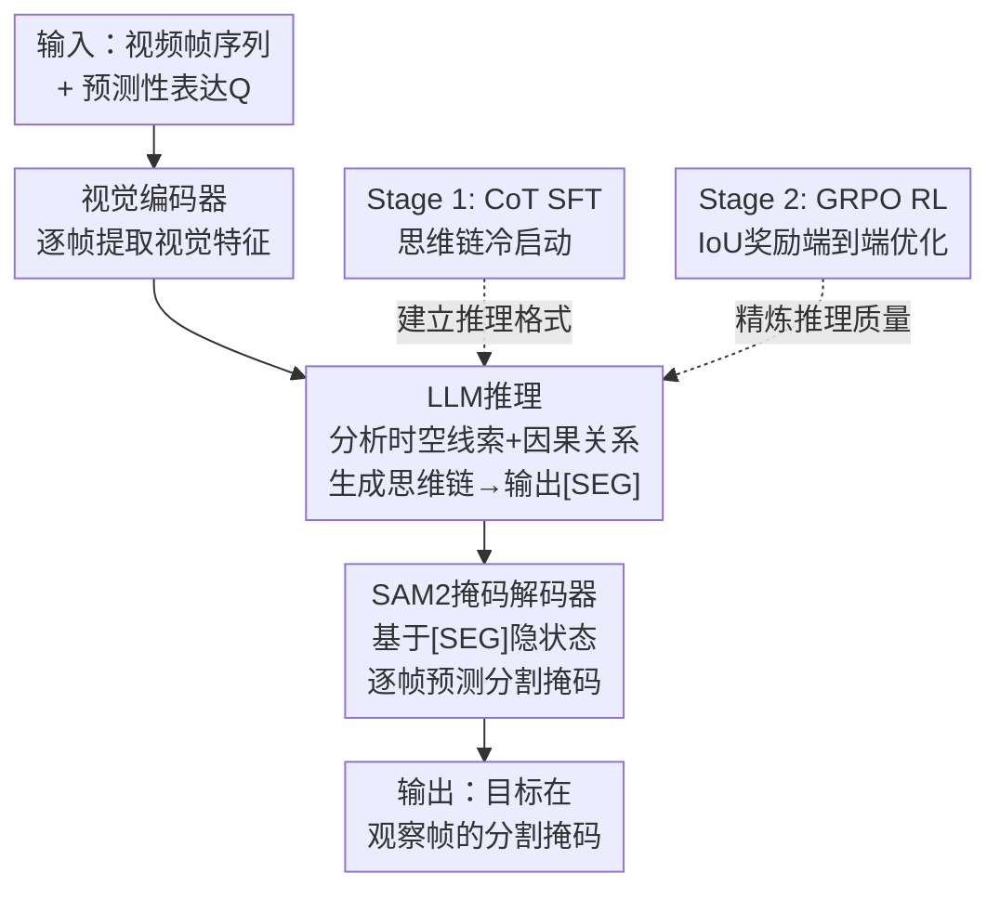

# FeVOS: Foresight Expression Video Object Segmentation

**会议**: ECCV 2026  
**arXiv**: [2606.25585](https://arxiv.org/abs/2606.25585)  
**代码**: 无  
**领域**: 视频理解  
**关键词**: 视频目标分割, 预测推理, 指代表达, 强化学习, 思维链

## 一句话总结
提出FeVOS（Foresight Expression Video Object Segmentation）任务——根据观察帧中的视觉线索预测未来事件并分割相关目标，构建包含968视频和14525条预测性表达的数据集并附带2904条合成思维链标注，设计FeVOS-R1两阶段训练框架（CoT监督微调冷启动 + GRPO强化学习纯IoU奖励精炼推理），在FeVOS上达到42.3 J&F，较微调Sa2VA基线提升6.5个点，同时在ReVOS（60.3）和MeViS（49.5）上展现出强零样本泛化能力。

## 研究背景与动机
指代视频目标分割（RVOS）要求模型根据语言表达在视频中分割对应目标，已在视频编辑、自动驾驶和机器人规划中展现潜力。然而，现有RVOS任务和数据集存在一个根本局限：所有指代表达都描述已观察帧内发生的事件或属性。早期数据集Ref-DAVIS和Ref-YouTube-VOS主要关注单帧可推断的静态属性（外观、类别、位置），MeViS虽然引入了需要跨帧时空理解的运动表达（如"the sponge moved"），但其指代范围仍然局限于已提供的观察帧。换句话说，现有RVOS本质上是一个"事后描述"任务——模型只需在已有画面中找到被描述的对象。

这一设计范式与实际应用之间存在核心矛盾：在机器人辅助、自动驾驶等场景中，智能体往往需要在动作发生之前就预判哪些物体会参与下一步交互，而不是事后识别。例如在厨房场景中，"What tool will be used?"这个问题要求模型从脏锅中有洗洁精泡沫、左手拿锅右手空闲等视觉线索中，推断出海绵将被使用，并精确定位海绵的位置——这是一个"事前预测"问题，而非"事后描述"。现有RVOS模型在零样本设置下面对此类预测性表达时J&F普遍低于31.0，暴露了严重的短板。之所以之前没有人做这个方向，一方面是因为缺少专门面向预测性推理的标注数据——标注者需要同时具备对视频因果链的理解和精确的像素级标注能力，另一方面传统RVOS社区长期关注的是"如何更好地对齐语言和视觉"，而非"如何从视觉推断未来"。

本文的核心idea是：将RVOS从观察性推理推进到预测性推理，要求模型仅基于观察帧中的隐式视觉线索，预测未来事件中涉及的目标并给出像素级分割掩码。为此，作者构建了专门的FeVOS基准数据集，并设计了通过显式思维链推理和强化学习赋予模型预测性时空推理能力的训练框架。

## 方法详解

### 整体框架
FeVOS的完整系统包含两个层面：基准数据集构建和模型训练方法。数据集通过五阶段管线构建：从COIN、STAR、EPIC-KITCHENS-VISOR等多源视频收集候选片段，经Qwen2.5-VL自动过滤（仅保留约30.5%具备因果链的视频），人工确定观察帧与未来帧的分割时间点（再保留约44.0%），两阶段表达标注（设计+独立验证，确保表达既需要真正的预测性推理又能被合理推断，约85.9%保留），以及基于SAM2的交互式掩码标注，最终得到968个视频、14525条预测性表达和对应像素级掩码。在此基础上，利用Qwen2.5-VL以视觉提示方式自动生成2904条思维链标注（每视频3条），提供多样化的逐步推理路径。

模型FeVOS-R1以Sa2VA为基座（InternVL2.5-4B作为MLLM，SAM2-L作为分割模块），采用两阶段训练范式。推理时，输入视频帧序列和一条预测性表达，视觉编码器提取帧特征后送入LLM，LLM生成包含逐步推理过程的文本响应并以特殊token [SEG]标记分割目标，随后[SEG]的隐状态被投影送入SAM2掩码解码器，在观察帧上逐帧预测目标分割掩码。

### 关键设计

**1. 合成思维链标注与监督微调冷启动：为预测性分割建立"观察→推理→分割"的认知链路**

现有MLLM分割方法（Sa2VA、VideoLISA等）在传统RVOS上表现良好，但面对预测性表达时缺乏显式推理过程——模型直接尝试从观察到分割，中间没有对时空线索和因果关系的分析步骤。这在预测性场景中尤为致命，因为预测性表达（如"What tool will be used?"）的语义无法与观察帧中的视觉内容直接对齐——观察帧里并没有"工具被使用"这一事件，只有隐式的因果前兆。

为此，作者首先利用Qwen2.5-VL自动生成思维链标注。具体做法是：将真值掩码叠加到视频帧上作为视觉提示（高亮目标物体），向Qwen2.5-VL同时提供标注后的视频和预测性表达，要求它生成解释"为什么这个高亮物体是答案"的逐步推理。由此得到的思维链通常包含对视觉线索、时序上下文和因果关系的分析（如图2中蓝色文字所示）。每视频生成3条以提供多样化的推理视角。

在Stage 1中，使用这些CoT标注对Sa2VA进行监督微调，损失函数为掩码质量损失和文本生成损失的加权组合：$\mathcal{L}_{total} = \alpha_{ce}\mathcal{L}_{ce} + \alpha_{dice}\mathcal{L}_{dice} + \alpha_{text}\mathcal{L}_{text}$。模型学习生成"先分析再分割"的响应格式：先以自然语言逐步推理（分析观察帧中的视觉证据和因果关系），再输出[SEG] token触发SAM2生成掩码。这一步的关键在于"冷启动"——它不仅教会模型正确的输出格式，更重要的是建立了"观察→推理→分割"的认知链路。消融实验表明，纯RL从零开始训练（不经SFT）仅达36.0 J&F，而SFT冷启动后即使不加RL也能达到37.2 J&F，验证了显式推理监督的基础性作用。

**2. 纯IoU驱动的GRPO强化学习：去掉格式奖励，让推理直接服务于分割质量**

SFT阶段赋予了模型基本的推理能力，但此时推理链的质量仍有优化空间——模型生成的推理过程可能与最终分割结果不完全对齐。传统GRPO在视觉-语言推理任务中通常同时使用准确率奖励和格式奖励（如要求输出符合`<think></think><answer></answer>`标签和JSON格式），以确保输出结构规范。

作者的key insight是：在已经通过CoT-SFT建好推理格式的前提下，格式奖励不仅是冗余的，反而会分散模型容量——模型可能为了满足格式约束而牺牲推理质量。因此Stage 2仅使用基于IoU的纯准确率奖励：$R_{IoU} = \frac{1}{T}\sum_{t=1}^{T}\text{IoU}(\hat{M}_t, M_t)$，其中$\hat{M}_t$和$M_t$分别为第$t$帧的预测掩码和真值掩码。GRPO对每个查询采样$|G|=4$个输出，计算组内归一化的优势函数$A_i = (r_i - \bar{r}_G) / \sigma_G$来更新策略$\pi_\theta$：

$$\mathcal{J}(\theta) = \mathbb{E}_G\left[\frac{1}{|G|}\sum_{i\in G}\left(\min\left(s_i A_i, \text{clip}(s_i, 1-\epsilon, 1+\epsilon)A_i\right) - \beta\mathbb{D}_{KL}(\pi_\theta||\pi_{ref})\right)\right]$$

其中$s_i = \pi_\theta(o_i|q) / \pi_{old}(o_i|q)$为新旧策略的概率比，KL散度正则项$\beta\mathbb{D}_{KL}(\pi_\theta||\pi_{ref})$防止模型偏离参考模型过远。

与Seg-Zero等需要模型输出JSON格式边界框坐标的RL方法不同，FeVOS-R1通过[SEG] token的隐状态直接将LLM与SAM2连接——这使得IoU奖励信号可以通过SAM2解码器反向传导到LLM的推理过程，整个pipeline端到端可优化，避免了中间格式表示带来的信息损失和格式对齐开销。

消融实验证实了去掉格式奖励的正确性：IoU-only（42.3 J&F）比IoU+Format（40.9）高出1.4个点，纯格式奖励仅37.7。这说明在推理格式已由SFT固化的情况下，让RL直接优化分割质量能使推理链与分割目标更紧密对齐。

### 一个完整示例

以厨房清洗场景为例。输入一段观察视频（展示脏锅中有洗洁精泡沫、左手抓锅柄、右手自然垂放在右侧海绵旁）和预测性表达"What tool will be used?"。视觉编码器首先将观察帧逐帧编码为特征序列。LLM接收视觉特征和文本提示后，开始生成思维链："Given the visual evidence — a dirty pot with dish soap applied in the sink, the left hand holding the pot handle while the right hand is free — the scene indicates a transition to cleaning action. The right hand is positioned near the sponge and is unoccupied, making it the most likely tool to be used next. Therefore, the sponge on the right side will be used." 在这一推理过程中，模型不仅判断了"海绵"这个工具类别，还通过右手位置进行了空间消歧——定位右侧海绵而非其他可能存在的清洁工具。推理完成后LLM输出[SEG] token，其隐状态被投影为SAM2的提示嵌入。SAM2掩码解码器据此在每一观察帧上预测海绵的像素级分割掩码。最终输出的掩码序列精确标注了右侧海绵在观察帧中的位置，而左手、锅、洗洁精瓶等都被正确排除。

### 损失函数 / 训练策略

**Stage 1 (CoT-SFT)**：仅更新LLM和SAM2掩码解码器，其余部分冻结，使用LoRA（rank=128）高效微调。优化器使用学习率$2\times10^{-5}$配合余弦退火调度，batch size 4，梯度累积4步，在FeVOS数据集CoT标注上训练4个epoch。

**Stage 2 (GRPO RL)**：冻结SAM2掩码解码器，仅微调LLM（相同LoRA配置）。每组采样$|G|=4$个输出用于GRPO优势估计，学习率$1\times10^{-5}$，batch size 4，梯度累积2步，在与SFT阶段相同的表达数据上训练2个epoch。所有实验在4张NVIDIA RTX 4090 GPU上完成。推理时，模型以自回归方式生成CoT响应，从中提取[SEG] token位置，用其隐状态提示SAM2生成最终逐帧掩码。

## 实验关键数据

### 主实验

| 方法 | 骨干网络 | J | F | J&F |
|------|---------|---|----|------|
| ReferFormer | ResNet-50 | 16.4 | 20.0 | 18.2 |
| LMPM | Swin-T | 17.1 | 20.7 | 18.9 |
| VISA | Chat-UniVi-7B | 22.9 | 28.2 | 25.6 |
| VideoLISA | LLaVA-Phi-3-V-3.8B | 22.9 | 29.4 | 26.1 |
| VideoGLaMM | Phi3-Mini-3.8B | 21.7 | 26.7 | 24.2 |
| VRS-HQ | Chat-UniVi-7B | 28.8 | 33.3 | 31.0 |
| GLUS | Chat-UniVi-7B | 27.4 | 31.7 | 29.6 |
| Sa2VA | InternVL2.5-4B | 23.7 | 27.2 | 25.4 |
| GLUS* (FeVOS微调) | Chat-UniVi-7B | 31.0 | 35.9 | 33.5 |
| Sa2VA* (FeVOS微调) | InternVL2.5-4B | 33.1 | 38.4 | 35.8 |
| **FeVOS-R1** | InternVL2.5-4B | **39.5** | **45.1** | **42.3** |

所有零样本方法J&F均低于31.0，验证了预测性推理任务的难度远超传统RVOS。传统方法ReferFormer（18.2）和LMPM（18.9）几乎完全失效，因为它们仅设计用于对齐显式描述和视觉内容。Sa2VA从零样本25.4到直接SFT微调35.8（+10.4），表明领域适配有效；FeVOS-R1进一步推至42.3（+6.5），证明思维链推理和RL优化在预测性场景中不可或缺。值得注意的是，FeVOS上的最佳性能（42.3 J&F）远低于该模型在传统RVOS基准上的表现（ReVOS 60.3），量化了"预测"比"描述"难多少。

### 泛化实验

| 方法 | ReVOS All (J&F) | ReVOS推理子集 | MeViS (J&F) |
|------|-----------------|-------------|-------------|
| Sa2VA (零样本) | 59.1 | 55.6 | 46.4 |
| Sa2VA* (FeVOS微调) | 58.1 | 55.2 | 46.5 |
| **FeVOS-R1** | **60.3** | **57.8** | **49.5** |

直接SFT微调Sa2VA在ReVOS上反而下降了1.0个点（59.1→58.1），出现灾难性遗忘；而FeVOS-R1不仅恢复了性能，还超过了零样本基线（60.3），尤其在推理子集上提升显著（57.8 vs 55.2，+2.6）。在MeViS上，FeVOS-R1（49.5）超过同规模模型VideoLISA（44.4）和VideoGLaMM（45.2）。这表明CoT+RL训练不仅未导致过拟合，反而通过增强推理能力实现了跨域泛化。

### 消融实验

**训练阶段消融：**

| 配置 | CoT-SFT | RL | J | F | J&F |
|------|---------|-----|---|---|------|
| SFT only | 有 | 无 | 34.7 | 39.8 | 37.2 |
| RL only | 无 | 有 | 33.5 | 38.6 | 36.0 |
| Two-stage | 有 | 有 | 39.5 | 45.1 | 42.3 |

纯RL（36.0）低于纯SFT（37.2），因为缺少冷启动时模型倾向于产生无意义的平凡响应，RL在无格式引导时难以自发产生有效推理。两阶段结合（42.3）相比SFT-only提升+5.1，证明SFT建立推理格式和RL精炼推理质量两者高度互补。

**奖励设计消融：**

| 配置 | IoU奖励 | 格式奖励 | J | F | J&F |
|------|---------|---------|---|----|------|
| Format only | 无 | 有 | 35.1 | 40.3 | 37.7 |
| IoU + Format | 有 | 有 | 38.3 | 43.5 | 40.9 |
| IoU only | 有 | 无 | 39.5 | 45.1 | 42.3 |

当模型已通过CoT-SFT掌握输出格式后，额外的格式奖励不仅无益反而有害：IoU-only（42.3）比IoU+Format（40.9）高出1.4个点。格式奖励迫使模型将部分容量用于满足冗余的格式约束，而非专注于分割目标。

### 关键发现
- **两阶段缺一不可**：单独SFT或单独RL远不如二者结合。SFT提供推理的"语法"（输出格式和基本推理模式），RL提供推理的"语义"（让推理真正服务于分割质量）。去掉SFT冷启动掉点6.3，去掉RL精炼掉点5.1，两者贡献相当且高度互补。
- **格式奖励在推理格式已固化时是负优化**：这是一个反直觉的发现——大多数GRPO工作把格式奖励视为标配，但本文的实验清晰表明，在SFT已充分建立输出格式的前提下，格式奖励不仅冗余，还通过分散模型容量阻碍了任务目标的优化。这对RL在视觉推理中的奖励设计具有普遍参考意义。
- **预测性推理的难度被严重低估**：FeVOS上最佳42.3 J&F vs ReVOS上60.3 J&F的差距（18个点），量化了"预测未来"比"描述现在"的难度增量。这不仅是模型能力的问题，更是任务范式切换带来的根本性挑战。
- **直接在FeVOS上SFT微调存在过拟合风险**：Sa2VA*在ReVOS上性能下降（59.1→58.1），而经过RL精炼的FeVOS-R1反而超过了零样本基线（60.3）。这说明RL阶段帮助模型学到了可迁移的推理能力，而非仅仅记忆FeVOS的统计模式。

## 亮点与洞察
- **将RVOS从"事后描述"变成"事前预测"的范式转换**：这不是简单的数据集扩展，而是从根本上重新定义了任务的认知要求。论文对"为什么现有RVOS不够"的分析精准到位——不是模型不够强，而是任务定义本身就排斥了预测性推理。这种问题驱动的论文动机写作方式值得借鉴。
- **CoT标注生成使用视觉提示（叠加真值掩码）而非文本描述**：设计巧妙——让Qwen2.5-VL直接"看到"答案再去解释为什么，避免了文本描述目标位置的歧义和不精确。生成的CoT既保证了推理质量，又天然具有多样性（每视频3条不同视角）。
- **"格式奖励有害"的发现具有可迁移价值**：在其他使用GRPO做视觉推理的场景中，如果输出格式已在SFT阶段充分建立，应考虑去掉格式奖励以释放模型容量。这一insight挑战了DeepSeek-R1以来将格式奖励视为标配的做法。
- **基于[SEG] token的端到端RL优化避免了中间表示损失**：与Seg-Zero等需要模型输出JSON格式边界框坐标的方法不同，[SEG] token的隐状态作为连续表示直接对接SAM2，使得IoU梯度可以无信息损失地反向传导到LLM的推理过程，实现了真正的端到端优化。

## 局限与展望
- **绝对性能仍有巨大提升空间**：FeVOS上42.3的J&F相比传统RVOS（60+）差距显著，说明预测性推理的难度决定了这条路还很长。作者建议的方向包括：突破当前MLLM的帧数限制以利用更丰富的全局上下文、优化采样策略以捕捉瞬时视觉线索、在更多RVOS数据集上进行CoT-SFT和RL训练以提升泛化性、以及缓解推理过程中的幻觉问题。
- **CoT标注依赖单一MLLM（Qwen2.5-VL）生成**：2904条CoT全部由同一个模型生成，推理风格和覆盖范围受限于该模型的能力和偏好。如果Qwen2.5-VL在特定类型的因果推理上存在系统性偏差，这个偏差会被SFT阶段放大。未来可考虑多模型集成生成或引入人工校对的CoT标注以增强多样性和鲁棒性。
- **RL阶段训练数据仅限FeVOS**：虽然泛化实验展现了零样本迁移能力，但如果在RL阶段混入部分传统RVOS数据，可能进一步缓解过拟合并提升跨域性能。
- **未建模预测的不确定性**：现实场景中未来可能存在多种合理结果（既可能用海绵也可能用刷子）。当前方法只能给出单一确定性预测，未来可探索多模态输出或概率掩码预测。
- **推理幻觉缺乏检测和缓解机制**：CoT推理过程中模型可能生成看似合理但实际与视觉证据不一致的分析。作者将此列为未来方向但未提出具体方案。一个潜在思路是在RL奖励中引入推理-视觉一致性检查作为辅助信号。

## 相关工作与启发
- **vs MeViS**: MeViS引入了需要时空理解的运动表达（如"the sponge moved"），但仍描述已观察帧内已发生的事件，本质是观察性推理。FeVOS要求基于观察帧预测未来事件（如"What tool will be used?"），是预测性推理。两者的核心区别在于时间参照点——MeViS面向过去和现在，FeVOS面向未来。从MeViS到FeVOS的演进路径（静态属性→运动属性→未来事件）本身就是一个值得关注的趋势。
- **vs Sa2VA / VISA / VideoLISA**: 这些方法在传统RVOS上表现出色，但面对FeVOS的零样本性能极低（25.4-31.0）。表明MLLM+分割头的架构具备一定推理潜力，但缺少针对预测性推理的专门训练。FeVOS-R1在相同Sa2VA架构下通过训练策略改进取得大幅提升，说明在当前阶段"怎么训练"比"用什么架构"更关键。
- **vs Seg-Zero / Veason-R1**: 这些同期工作也将RL引入视频分割，但聚焦于传统RVOS设置中的观察性分割。FeVOS-R1的独特之处在于将RL用于优化预测性推理链本身——通过[SEG] token隐状态实现了无需JSON等中间格式转换的端到端IoU优化，避免了格式对齐开销和中间表示的信息损失。
- **vs DeepSeek-R1 / VLM-R1**: DeepSeek-R1证明了RL可以激发LLM的推理能力，VLM-R1将其扩展到视觉-语言任务。FeVOS-R1在继承这一范式的同时，发现了一个重要的反直觉现象：在SFT冷启动充分的前提下，纯任务奖励（IoU）优于任务奖励+格式奖励的组合。这一发现对RL在视觉推理中的奖励设计具有普遍参考价值，值得在更多视觉-语言任务上验证。

## 评分
- 新颖性: ⭐⭐⭐⭐☆ 将RVOS从观察性推理推进到预测性推理是清晰的范式创新，任务定义和数据集构建都有明确差异化。方法层面（CoT SFT + GRPO RL）的组合本身并非首创，但去掉格式奖励的insight和将RL用于预测性分割这两点有新意。
- 实验充分度: ⭐⭐⭐⭐☆ 主实验覆盖8个零样本基线和2个微调基线，泛化实验覆盖ReVOS和MeViS两个基准，消融实验系统拆解了训练阶段和奖励设计两个关键变量。缺少对CoT标注质量的独立评估（如人工评审准确率）和对不同CoT生成策略（如不同MLLM、不同提示方式）的对比。
- 写作质量: ⭐⭐⭐⭐☆ 问题动机阐述清晰，图1（任务对比）和图2（CoT示例）非常直观地展示了预测性vs观察性推理的区别。数据构建管线和两阶段训练图示有助于理解。部分表格排版可以优化。
- 价值: ⭐⭐⭐⭐⭐ 预测性视频理解是通往主动智能（proactive intelligence）的关键一步。该工作不仅提供了一个高质量基准，还展示了思维链推理+RL在这个方向上的有效性，为后续工作（如机器人规划中的预测性感知、自动驾驶中的意图预测、具身智能中的动作前预判等）开辟了明确的研究路径。42.3 J&F的上限也意味着大量提升空间，有望吸引社区跟进。

<!-- RELATED:START -->

## 相关论文

- [\[CVPR 2026\] Efficient Video Object Segmentation and Tracking with Recurrent Dynamic Submodel](../../CVPR2026/segmentation/efficient_video_object_segmentation_and_tracking_with_recurrent_dynamic_submodel.md)
- [\[ICLR 2026\] Advancing Complex Video Object Segmentation via Progressive Concept Construction](../../ICLR2026/segmentation/advancing_complex_video_object_segmentation_via_progressive_concept_construction.md)
- [\[ICCV 2025\] Latent Expression Generation for Referring Image Segmentation and Grounding](../../ICCV2025/segmentation/latent_expression_generation_for_referring_image_segmentation_and_grounding.md)
- [\[ECCV 2024\] ActionVOS: Actions as Prompts for Video Object Segmentation](../../ECCV2024/segmentation/actionvos_actions_as_prompts_for_video_object_segmentation.md)
- [\[CVPR 2025\] M3-VOS: Multi-Phase, Multi-Transition, and Multi-Scenery Video Object Segmentation](../../CVPR2025/segmentation/m3-vos_multi-phase_multi-transition_and_multi-scenery_video_object_segmentation.md)

<!-- RELATED:END -->
