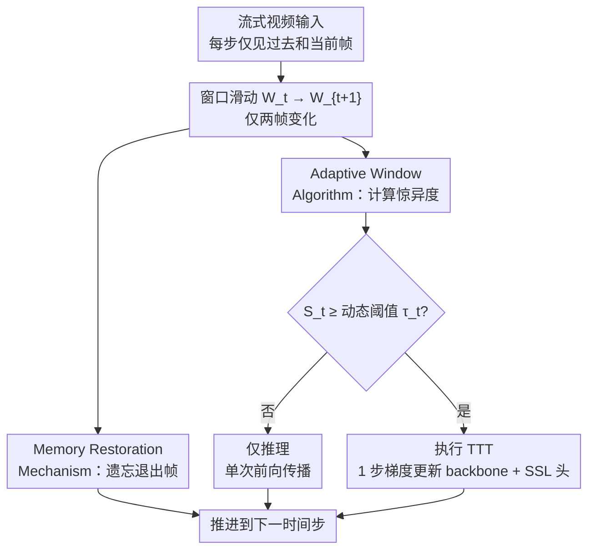

# Forget, Anticipate and Adapt: Test Time Training for Long Videos

**会议**: ECCV 2026  
**arXiv**: [2606.26515](https://arxiv.org/abs/2606.26515)  
**代码**: [https://github.com/rajatmodi62/ffn](https://github.com/rajatmodi62/ffn) (项目页)  
**领域**: 语义分割  
**关键词**: 测试时训练、长视频、语义分割、自适应窗口、惊异度

## 一句话总结
提出 Frame Forgetting Network（FFN），通过只处理滑动窗口中退出/进入两帧的「遗忘—预测—适应」机制，将长视频测试时训练的计算复杂度从 O(k) 降至常数，并基于「惊异度」动态决定何时执行 TTT，在密集分割、深度估计和动作分类上达到更优的精度-效率权衡。

## 研究背景与动机

测试时训练（Test Time Training, TTT）为模型在推理阶段的自适应提供了一条无需标注的有效路径：模型通过自监督任务（如图像重建或 MAE 掩码恢复）在测试时持续更新权重，以适应视频流中不断变化的场景分布。然而，将 TTT 真正落地到视频领域一直受困于严峻的计算瓶颈。现有方法无一例外地采用固定大小的滑动窗口——窗口内包含过去 k 帧，每滑动一步就对整个窗口内的所有帧计算自监督损失并回传梯度。这意味着计算量随窗口大小线性增长：对一个两小时的视频（约 7200 帧），每步重算整个窗口的方式需要超过 8 小时才能处理完，在无人机救灾、边缘设备部署等离线场景中完全不现实。更糟糕的是，即使相邻帧几乎完全一致（如静止监控），模型也会浪费算力去做无意义的适应——每次适应都针对未来不会再出现的重复内容。

这种冗余的根源在于一个被长期忽视的观察：滑动窗口从 W_t 推进到 W_{t+1} 时，k 帧中只有两帧真正发生了变化——帧 x_t-k 退出窗口、帧 x_{t+1} 进入窗口，其余 k-2 帧完全相同。现有的 TTT-Online 等工作虽然通过权重重置来遵守「局部性原则」（视频早期的帧不应影响后期的适应），但逐窗口重算的做法本质上是在反复处理已经适应过的帧，计算效率和精度提升之间存在难以调和的矛盾。那么，能否像数据结构中的滑动窗口技巧（如 Kadane 算法）那样，只处理「退出」和「进入」两帧，同时维护一个隐含的运行状态来保留时间上下文？

本文正是从这一数据结构视角出发，提出了 Frame Forgetting Network（FFN）。FFN 由两个核心模块构成：Memory Restoration Mechanism（MRM）负责主动「遗忘」退出帧的适应影响——把 backbone 权重「拉回」到适应该帧之前的状态；Adaptive Window Algorithm（AWA）则基于「惊异度」动态判断当前帧是否需要适应——模型预测下一帧并与真实帧比较，从像素空间和隐空间两个层面综合衡量「新信息量」，只有差距超过动态阈值时才执行 TTT。**核心 idea：利用滑动窗口的「两帧变化」不变性，将长视频 TTT 的计算范式从 O(k) 重算整个窗口转变为 O(1) 只处理退出/进入/当前三帧，通过主动遗忘配合惊异度驱动的自适应决策，在快 5.8 倍的同时实现密集分割精度的大幅提升。**

## 方法详解

### 整体框架

FFN 的核心洞察是滑动窗口推进时只有两帧发生变化，因此只需处理这三帧：退出帧 x_{t-k}（负责遗忘）、当前帧 x_t（负责决策）和进入帧 x_{t+1}（负责验证）。整个框架以流式方式运行，每步先通过 MRM 遗忘退出帧的适应影响，再通过 AWA 计算当前帧的惊异度并决定是否执行 TTT。如果惊异度超过动态阈值，则对 backbone 和 SSL 头执行一步梯度更新；否则仅做一次前向推理后直接推进到下一时间步。

### 关键设计

**1. Memory Restoration Mechanism (MRM)：主动遗忘退出帧的适应以维持局部性**

由于 TTT 会持续更新 backbone 权重，当帧 x_{t-k} 退出窗口时，模型当前的权重 f_t 仍「记得」对该帧的适应。如果带着这个适应处理后续帧，旧帧的影响会持续偏置当前预测，破坏局部性原则。MRM 的思路是：在训练阶段先缓存 x_{t-k} 刚进入窗口时的预适应特征 f_{t-k-1}(x_{t-k})，当该帧退出窗口时，通过最小化当前特征与预适应特征之间的距离来将 backbone 权重「拉回」——这里使用 L2 损失计算两者差异，做一步梯度回传调整 f_t 的权重。为了区分不同时间步的同一帧（同一像素内容在不同时刻进入窗口时预适应特征不同），MRM 还引入了一个三层 MLP 的时序模块：将时间步 t-k 编码为 1D 正弦位置编码后注入 backbone，相当于让 backbone 知道「这是第几帧的特征」。这种带时间条件的遗忘比直接重置权重更精巧——它只抹去了退出帧的局部影响，保留了 backbone 在适应其他帧时学到的有用知识，从而维持了模型内部的表示连续性。

**2. Adaptive Window Algorithm (AWA)：基于「惊异度」动态判断何时需要适应**

滑动窗口每步都执行 TTT 显然不是最优的——相邻帧常极为相似，或仅因相机抖动产生大幅像素差异但语义未变。AWA 的核心是让模型通过「预测下一帧」来自我评估是否需要适应。它组合了两个互补的信号。第一个是视觉空间差异 v_visual：将当前帧 x_t 输入一个预测头（与 SSL 头共享参数），生成下一帧预测 x'_{t+1}，计算逐像素归一化 L2 距离。单独使用 v_visual 会误判相机抖动——像素变化剧烈但场景未变。因此引入第二个信号——隐空间相似度 A：维护一个记忆缓冲 B，记录最近所有曾执行 TTT 的帧的 backbone 隐特征，计算当前帧隐特征与最近一次适应帧隐特征的余弦相似度。当场景未变时，即使像素差异大，隐特征仍保持相似（A≈1）。将两者组合为惊异度：

$$S_t = [\log(1+v_{\text{visual}}(t))] \times [1-A]$$

当 S_t 超过动态阈值 τ_t 时触发 TTT。τ_t 被定义为最近 W 帧（缓冲大小 50）惊异度的均值与标准差之和 $\tau_t = \mu_t + \sigma_t$，使其能自适应视频的节奏变化：缓慢变化的视频阈值自动升高、场景剪切的视频阈值自动适应。同时，这种决策机制也自然地处理了三种典型情况：静止帧（v_visual≈0, A≈1 → S_t≈0，不触发）、相机抖动（v_visual↑ 但 A≈1 → S_t 低，不触发）、场景切换（v_visual↑ 且 A↓ → S_t 高，触发适应）。

### 损失函数 / 训练策略

采用标准 TTT 两阶段训练。训练阶段：联合训练 backbone f、SSL 头 g 和下游头 h，SSL 任务设置为「下一帧预测」而非常见的当前帧重建（消融实验验证了前者带来的归纳偏置更强）。测试阶段：冻结下游头 h，仅更新 f 和 g，每帧最多一步梯度更新，使用 Adam 优化器，记忆缓冲大小 W=50。冷启动阶段先强制适应前 60 帧以填满缓冲（约 42 秒初始延迟），之后由 AWA 接管自适应决策。

## 实验关键数据

### 主实验

| 数据集 | 指标 | Online TTT-MAE (s.w.) | TTT-Online (n.o. s.w.) | FFN (Ours) | 提升 |
|--------|------|-----------------------|------------------------|------------|------|
| COCO-Videos Inst. | AP | 37.6 | 35.3 | **45.1** | +7.5 |
| COCO-Videos Pan. | PQ | 21.7 | 20.8 | **29.6** | +7.9 |
| KITTI-STEP Val. | mIoU | 55.4 | 48.1 | **57.3** | +1.9 |
| KITTI-STEP Test | mIoU | 54.3 | 51.7 | **59.5** | +5.2 |
| EpicTours Sem. | mIoU | 42.8 | — | **49.3** | +6.5 |
| EpicTours Inst. | AP | 31.4 | — | **36.7** | +5.3 |

| 方法 | 时间（秒/帧）| 备注 |
|------|-------------|------|
| Online TTT-MAE (s.w.) | 4.1 | 每步重算整个窗口 |
| Self-Train | 6.6 | 伪标签自训练 |
| FFN (Ours) | **0.7** | 仅处理 3 帧 |
| 纯推理（无 TTT）| 1.8 | 单次前向传播 |

### 消融实验

| 配置 | COCO Inst. AP | KITTI Val. mIoU | 说明 |
|------|--------------|-----------------|------|
| Full FFN（绝对编码+MBO+余弦） | 45.1 | 57.3 | 完整模型 |
| + RoPE 位置编码 | **46.8** | **58.9** | 旋转位置编码进一步 +1.7↑ |
| + FIFO + MBO 缓冲 | 45.7 | 59.1 | 二者组合最佳 |
| + L1 遗忘损失 | 43.2 | 56.1 | 不如余弦损失 |
| FIFO 缓冲 | 43.9 | 56.4 | 仅先进先出 |
| 去掉时序条件 | 42.7 | — | 不给 backbone 输入时间 t |

### 关键发现
- **MRM 的时序条件不可或缺**：去掉注入 backbone 的时间编码后，COCO-Videos 实例分割 AP 从 45.1 降至 42.7，说明 backbone 需要知道「这是第几帧的特征」才能准确恢复预适应状态。
- **惊异度阈值动态化的有效性**：FFN 在 3 小时长视频上性能保持稳定甚至微增，而 TTT-Online 在 50 分钟后性能迅速衰减——动态决策机制有效抑制了持续适应带来的权重漂移。
- **缓冲容量适中最优**：增大缓冲超过 50 帧后性能下降，验证了「只保留近期关键帧」的局部性原则；缓冲太大会让旧帧的统计量拖慢当前阈值对场景变化的响应。
- **下一帧预测优于当前帧重建**：预测未来帧作为 SSL 目标使模型获得场景变化的「方向感」，在 Something-Something v2 这种需要区分「向上/向下移动」的动作分类上有额外增益。

## 亮点与洞察
- **将滑动窗口的数据结构思想引入神经网络适应**：Kadane 算法等「只处理进出两帧」的思路在算法层面很经典，但把它实现在 TTT 的权重更新场景中需要精巧的遗忘+恢复机制。这篇文章证明了这个想法在神经网络上也是可操作的。
- **「遗忘即恢复」而非「遗忘即丢弃」**：MRM 的优雅之处在于，它不是丢弃对退出帧的知识，而是通过 L2 损失把 backbone「拉回」到适应前的状态——既抹去了局部影响，又保留了全局学习成果，比权重重置更灵活。
- **惊异度 S_t 的双信号设计**：视觉差异+隐空间相似度的组合避开了纯像素差异的陷阱，而动态阈值 τ_t = μ_t + σ_t 使系统能自适应不同视频的节奏（慢速 CCTV vs 快速城市漫游），无需预定义阈值。
- **EpicTours 数据集填补长视频 TTT 评测空白**：此前最长视频数据集仅约 5 分钟，EpicTours 提供最长 3 小时的真实城市漫游视频及密集标注，为后续研究提供了更现实的评测平台。

## 局限与展望
- **冷启动延迟**：需要先强制适应约 60 帧（约 42 秒）来初始化记忆缓冲，在此期间无法享受 AWA 的算力节省。对经常有场景切换的短视频而言，这个延迟的影响更大。
- **反向传播仍为主流瓶颈**：每帧即使只做一步梯度更新，反向传播本身仍比纯推理昂贵。作者讨论了无反向传播的替代方案（前向-前向算法、目标传播），但目前在大规模视觉任务上尚无法替代反向传播。
- **长时间无变化场景的低效**：当监控摄像头长时间无内容变化时，FFN 处于空闲状态。作者提出可在空闲时通过 Langevin 动力学采样自训练，但具体实现尚未探索。
- **EpicTours 类别粒度有限**：目前仅标注 30 类 COCO 子集，未来可扩展到细粒度类别和更多样化的场景。

## 相关工作与启发
- **vs TTT-Online (Wang et al., JMLR 2025)**：直接基线，每步重算整个滑动窗口（O(k) 复杂度），每步重置权重。FFN 通过 MRM+AWA 实现 O(1) 每步计算且保持权重连续性，在 COCO-Videos 实例分割 AP 上高出 7.5 点，速度快 5.8 倍。
- **vs 在线模型蒸馏 (Mullapudi et al., 2018)**：学生-教师双模型架构需要教师部署在远程服务器，不适合离线场景。FFN 只用单模型、完全本地运行。
- **vs Tent (Wang et al., 2020)**：Tent 用熵最小化做测试时适应，但只更新归一化层参数且每帧都做。FFN 动态决策是否适应且更新 backbone 全部参数，在密集分割上大幅领先。
- **vs 视频压缩中的惊异度**：视频编码中通过帧间差异决定压缩码长的思路与 AWA 有相似哲学，但 FFN 通过可学习的预测头实现、且所有知识压缩进模型权重而非编码文件。

## 评分
- 新颖性: ⭐⭐⭐⭐ MRM 将遗忘恢复思想引入 TTT 场景，AWA 的双信号惊异度设计精巧，但整体方案受经典滑动窗口数据结构的启发，并非颠覆性创新。
- 实验充分度: ⭐⭐⭐⭐⭐ 在 11 个数据集上验证了分割、深度估计、动作分类三个任务，并专门构建 EpicTours 长视频评测集，消融覆盖各模块的每个设计选择。
- 写作质量: ⭐⭐⭐⭐ 从问题洞察→滑动窗口不变性→三帧机制层层递进，图文示意清晰，讨论部分诚实有启发力。
- 价值: ⭐⭐⭐⭐⭐ TTT 在长视频上的计算瓶颈是走向实用的关键障碍，FFN 给出了一个经验证有效的常数复杂度方案，对边缘部署和实时应用有直接推动力。

<!-- RELATED:START -->

## 相关论文

- [\[ICML 2025\] IT³: Idempotent Test-Time Training](../../ICML2025/segmentation/it3_idempotent_test-time_training.md)
- [\[CVPR 2026\] Mixture of Prototypes for Test-time Adaptive Segmentation](../../CVPR2026/segmentation/mixture_of_prototypes_for_test-time_adaptive_segmentation.md)
- [\[CVPR 2026\] Hyperbolic Prototype Learning with Uncertainty-Aware Consistency for Continual Test-Time Segmentation](../../CVPR2026/segmentation/hyperbolic_prototype_learning_with_uncertainty-aware_consistency_for_continual_t.md)
- [\[CVPR 2026\] The Golden Subspace: Where Efficiency Meets Generalization in Continual Test-Time Adaptation](../../CVPR2026/segmentation/the_golden_subspace_where_efficiency_meets_generalization_in_continual_test-time.md)
- [\[ECCV 2026\] Segmenting, Fast and Slow: Real-Time Open-Vocabulary Video Instance Segmentation with Dual-Path Processing](segmenting_fast_and_slow_real-time_open-vocabulary_video_instance_segmentation_w.md)

<!-- RELATED:END -->
