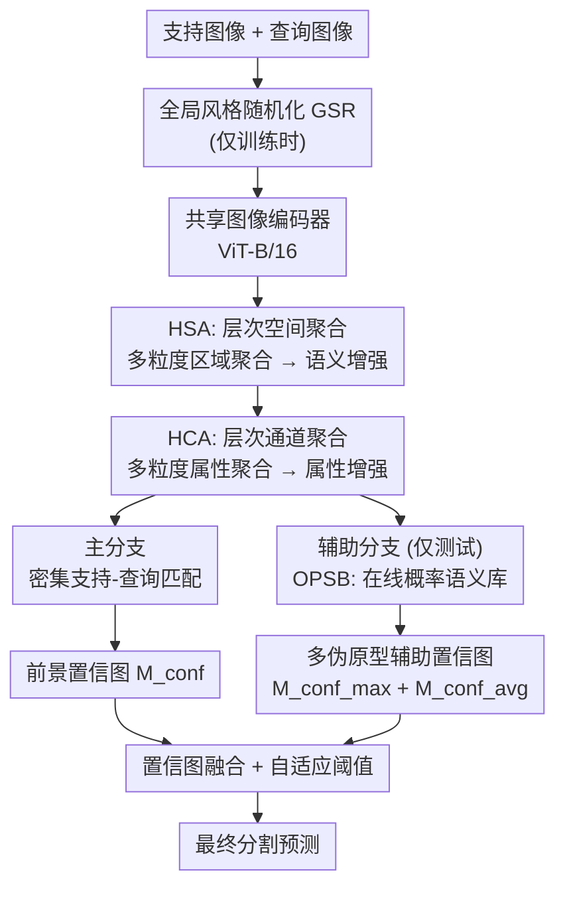

# Hierarchical Spatial and Channel Aggregation for Cross-domain Few-shot Segmentation

**会议**: ECCV2026  
**arXiv**: [2606.24296](https://arxiv.org/abs/2606.24296)  
**代码**: 待确认  
**领域**: 语义分割  
**关键词**: 跨域少样本分割, 语义过对齐, 属性过对齐, 层次聚合, 槽注意力

## 一句话总结

本文提出 DHANet，通过沿空间维度进行层次聚合以缓解语义过对齐、沿通道维度进行层次聚合以缓解属性过对齐，并利用在线概率语义库在推理时提供额外支持信息，在四个跨域少样本分割基准上取得 SOTA。

## 研究背景与动机

跨域少样本分割（CD-FSS）的目标是让模型在源域大量标注样本上训练后，仅凭目标域寥寥几张标注样本就能分割全新类别。已有的 CD-FSS 方法主要聚焦于缩小风格差异造成的特征分布偏移——风格扰动、提取域无关特征、利用少量目标域数据进行微调等策略被广泛采用。这些方法在一定程度上缩小了源域和目标域之间的全局特征分布差距，但它们忽视了一个更深层的问题：不同域的类别在语义粒度和判别属性上可能存在根本性差异。

这种忽视导致了训练过程中的两个层面的"过对齐"问题。第一是语义过对齐（semantic over-alignment）：训练时模型被强制将所有前景像素特征在源域的特定粒度下对齐到单一的类原型上，结果是模型只能在该粒度下区分前景和背景——例如学会把"猫"识别为前景、把"其他类"识别为背景，却无法在更细粒度下区分猫的头和猫的身体。当目标域需要更细或更粗的分割粒度时，模型的前景-背景判别能力急剧退化。第二是属性过对齐（attribute over-alignment）：同一类的不同实例往往表现出属性上的差异（如白猫和橘猫的颜色属性不同），这些源域不敏感的属性本来由不同的通道各自激活，但训练中的通道级对齐迫使这些通道逐渐退化，丧失捕获差异的能力。当目标域恰恰对这些属性敏感时（例如皮肤镜图像依赖颜色区分病灶），类内特征的一致性就大幅削弱。

部分最新工作（如 SDRC、HSL）开始尝试缓解语义过对齐，但它们要么依赖外部模型提供的超像素先验（限制了泛化性），要么仅在单粒度下进行特征解耦（对不同域的粒度变化适应性有限），而且完全忽略了属性过对齐的问题。本文的核心 idea 是**同时沿空间维度和通道维度做层次化聚合：沿空间维度在多个粒度下聚合区域语义特征以缓解语义过对齐，沿通道维度在多个粒度下聚合属性特征以缓解属性过对齐，将单粒度的硬对齐转化为多粒度的软对齐**，并辅以一个在线概率语义库，在推理时提供更丰富的支持信息。

## 方法详解

### 整体框架

DHANet 的整体流程如下：支持图像和查询图像先经过全局风格随机化（GSR）进行风格扰动（仅在训练时使用），再送入共享权重的 ViT-B/16 编码器提取特征。特征依次经过层次空间聚合（HSA）和层次通道聚合（HCA）模块，得到在语义和属性两个维度上都得到层次增强的表示。主分支通过密集的支持-查询特征匹配计算前景置信图；辅助分支（仅在测试时启用）中，在线概率语义库（OPSB）维护类的概率分布并从中采样多个伪原型，提供额外的支持信息来计算辅助前景置信图。两分支的置信图融合后经自适应阈值得到最终分割预测。

### 关键设计

**1. HSA：层次空间聚合解耦语义粒度**

语义过对齐的本质在于所有前景像素被强制对齐到单一的类原型，模型因此丧失在不同粒度下区分语义区域的能力。HSA 模块的解决思路是：受槽注意力（slot attention）启发，在空间维度上设置多层级的可学习槽位（spatial slots），每层槽的数量逐级递增（本设计设 $L_s=2$，第一层 10 个、第二层 20 个），从粗到细地覆盖不同粒度的语义区域。每个槽先通过交叉注意力从编码器输出特征 $\mathbf{F}^h$ 中聚合初始信息，再经 slot attention 迭代更新为该层的一个区域原型，同时产出注意力图来分配每个像素所属的区域。各层区域原型通过反向掩码平均池化（RMAP）映射回空间坐标，形成对应粒度的区域特征图 $\mathbf{F}^i$，最终和各层区域特征图的均值相加得到层次语义增强特征 $\tilde{\mathbf{F}}$。在训练时，这种多粒度表示使得支持特征和查询特征不必锁定在单一粒度对齐，而是在多个粒度上都可以找到对应，从而缓解过对齐；在测试时，不同尺度的区域一致性还能帮助抑制背景噪声的干扰。各层内的槽通过正交约束（$\mathcal{L}_{orth}$）保持相互区分，防止坍缩成相同表示。

**2. HCA：层次通道聚合保留域敏感属性**

属性过对齐的根源在于：同一语义区域在不同图像中可能由不同的通道激活，但通道级对齐迫使这些通道趋同，导致那些对源域不敏感但目标域重要的属性通道逐渐退化。HCA 的设计与 HSA 对称但沿通道维度操作：将经过 HSA 增强的特征 $\tilde{\mathbf{F}}$ 叠加浅层细节特征 $\mathbf{F}^l$ 后，沿空间维度展平并转置，使通道维成为聚合的基本单位，设置多层级可学习通道槽（channel slots，$L_c=2$，第一层 32 个、第二层 64 个）。与 HSA 不同，HCA 不采用 RMAP 把属性原型"填回"对应的通道——那样会破坏特征的属性多样性——而是将各层的所有属性原型沿通道维直接拼接到原始特征上。这种拼接策略同时保留了原始通道的全部信息和多粒度属性原型，让模型在匹配时可以根据目标域的属性敏感度自选择匹配粒度：如果目标域对颜色敏感，模型可以利用细粒度属性原型；如果对纹理敏感，模型可以选择粗粒度原型。HCA 同样对通道槽施加正交约束。

**3. OPSB：在线概率语义库缓解支持信息匮乏**

测试阶段仅有 1 张或 5 张支持样本，有限的类别信息很难覆盖目标域中类内差异大的情况。很多已有方法选择利用每轮预测结果对模型做在线微调，但这引入了知识遗忘的风险且计算开销大。OPSB 采用了一条不同的路径：将每个类的原型建模为高斯分布（由均值和方差参数化），在推理过程中逐 episode 地累积和更新。具体来说，每个测试 episode 先用当前预测中置信度高的前景/背景像素特征估算该 episode 的分布参数，再通过带样本数权重的融合公式（类似于"在线 Welford 算法"，同时对均值和方差做加权平均）更新到全局语义库中。推理时，从当前分布中采样 20 个伪原型作为额外支持信息，与查询特征计算余弦相似度并同时取最大值和平均值，得到两个辅助置信图。概率建模相比确定性原型的关键优势在于：采样多个伪原型可以覆盖类内方差的不同区间，提供比单个确定性原型更丰富的匹配信息。实验也证实概率原型比确定性原型高出近 1 个 mIoU 点。

### 损失函数 / 训练策略

总损失 $\mathcal{L} = \mathcal{L}_{main} + \mathcal{L}_{ssp} + \lambda\mathcal{L}_{orth}$，其中 $\mathcal{L}_{main}$ 是主分支的 BCE 分割损失，$\mathcal{L}_{ssp}$ 是自分割辅助损失（同 SSP），$\mathcal{L}_{orth}$ 是槽的正交约束（$\lambda=0.1$）。训练使用 SGD 优化器，momentum 0.9，weight decay 5e-4，学习率 1e-3，batch size 6，共 5 个 epoch。此外，在目标域上利用首个 episode 的支持集进行一轮微调（以数据增强后的 12 个 episode 训练 1 个 epoch）。

## 实验关键数据

### 主实验

在四个目标域数据集（卫星遥感 Deepglobe、皮肤镜 ISIC、X 光胸片 Chest X-ray、日常物体 FSS-1000）上的 1-shot 和 5-shot mIoU 对比：

| 设置 | 方法 | Deepglobe | ISIC | Chest X-ray | FSS-1000 | 平均 |
|------|------|-----------|------|-------------|----------|------|
| **1-shot** | DHANet (本文) | **49.79** | **64.25** | 86.06 | **83.61** | **70.93** |
|  | HSL (AAAI-26 SOTA) | 45.77 | 59.36 | 85.95 | 81.89 | 68.24 |
|  | 提升 | +4.02 | +4.89 | +0.11 | +1.72 | +2.69 |
| **5-shot** | DHANet (本文) | **56.13** | **67.38** | 86.87 | **86.67** | **74.26** |
|  | HSL (AAAI-26 SOTA) | 54.56 | 64.62 | 86.25 | 83.84 | 72.32 |
|  | 提升 | +1.57 | +2.76 | +0.62 | +2.83 | +1.94 |

在 1-shot 设定下，DHANet 的平均 mIoU 超越之前 SOTA 方法 HSL 达 2.69 个百分点，尤其是在语义粒度与源域差异最大的 Deepglobe（卫星遥感）和 ISIC（皮肤镜）上提升最为显著（分别 +4.02、+4.89 个百分点）。DHANet 的 1-shot 平均性能甚至超过了除 HSL 外所有对比方法的 5-shot 性能。

### 消融实验

| 配置 | 平均 mIoU (1-shot) | 说明 |
|------|-------------------|------|
| Baseline (GSR + 微调 + 自适应阈值) | 66.53 | 仅缓解风格差异 |
| +HSA | 68.43 | +1.90，缓解语义过对齐 |
| +HCA | 67.90 | +1.37，缓解属性过对齐 |
| +HSA + HCA | 69.22 | +2.69，两者互补 |
| +HSA + HCA + OPSB | **70.93** | +1.71，额外支持信息 |

| HSA/HCA 内部组件消融 | 平均 mIoU | 说明 |
|----------------------|-----------|------|
| 完整聚合模块 | 69.22 | HSA + HCA 启用 |
| w/o SlotAttn | 67.39 | 槽无法聚合区分性特征 |
| w/o CrossAttn | 67.81 | 槽失去样本先验引导 |
| w/o $\mathcal{L}_{orth}$ | 68.33 | 槽趋向同质化 |

### 关键发现
- HSA 和 HCA 的互补增益（联合 2.69%）显著大于各自增益之和（1.90% + 1.37% = 3.27%），证实了语义过对齐和属性过对齐是相互独立的问题，各自处理是正确策略。
- OPSB 的概率原型策略比确定性原型高出 0.98 个点（70.93 vs 69.95），比在线微调高出 3.05 个点（70.93 vs 67.88），说明概率建模在应对类内方差时比确定性原型和传统微调都更有效。
- 层次聚合的层级数存在一个最优值：HSA 在 $L_s=2$、HCA 在 $L_c=2$ 时性能达到最佳，继续增加层级反而会因过度精细的粒度划分打乱原有的类别层级关系导致性能下降。
- 效率方面，DHANet 的 FLOPs 低于 HSL（176.48G vs 186.52G）且 FPS 更高（30.77 vs 27.25），在取得更好性能的同时反而更高效。

## 亮点与洞察
- **系统性地区分了两种过对齐问题**：这是 CD-FSS 领域首次把语义过对齐和属性过对齐作为两个正交问题同时处理，实验证实相互独立且互补，视角干净有力。
- **将 slot attention 跨维度复用**：同一套注意力机制沿空间维度和通道维度分别聚合，仅输出策略不同（HSA 用 RMAP 填充、HCA 用拼接），展示了 slot attention 作为通用特征解耦工具的灵活性。
- **概率语义库的设计简洁实用**：把确定性原型升级为高斯分布，通过多伪原型采样覆盖类内方差，不需要额外的模型或复杂的在线训练，这种思路可以轻松迁移到其他小样本学习、域适应或持续学习场景中。

## 局限与展望
- OPSB 依赖预测置信度来筛选高质量特征更新语义库：若模型在某个目标域上的整体预测质量极差，筛选出的"高质量"特征可能并不可靠，形成误差累积。需要更鲁棒的置信度估计或不确定性感知的选择策略。
- 层次层级数（$L_s=2, L_c=2$）是固定超参，不随目标域自适应调整。理想情况下，面对粗粒度域（如卫星图像中的大面积地物分类）和细粒度域（如医学影像中的微小病灶分割）应能自动选择不同层级数。
- 实验仅在语义分割任务上验证，未扩展到实例分割或全景分割场景。OPSB 的概率建模机制在实例级分割中是否有类似的收益待验证。

## 相关工作与启发
- **vs HSL**：HSL 借助外部超像素分割模型产生多尺度先验来学习层次语义特征，对外部模型存在依赖；本文纯靠可学习的 slot attention 实现层次化，更灵活且不需要额外的分割先验。
- **vs SDRC**：SDRC 仅在单一粒度下做特征解耦来缓解语义过对齐，对不同域粒度的适应性有限；本文的多粒度层次聚合天然适应从粗到细的各种粒度需求。
- **vs PATNet / APM / DRA**：这些方法专注于域无关特征提取或风格扰动以缩小分布差异，完全未考虑语义和属性过对齐问题，在语义粒度差异大的域（如 Deepglobe、ISIC）上性能明显落后。

## 评分
- 新颖性: ⭐⭐⭐⭐⭐ 首次同时从空间和通道维度系统性建模 CD-FSS 中的两种过对齐，问题切入角度新颖，概率语义库的设计简洁有效
- 实验充分度: ⭐⭐⭐⭐⭐ 四个差异性大的目标域数据集、组件消融、层级数分析、查询利用策略对比、效率分析、可视化验证覆盖全面
- 写作质量: ⭐⭐⭐⭐ 动机论述清晰、问题定义精准，但方法部分公式偏多可适当精简以提升可读性
- 价值: ⭐⭐⭐⭐⭐ 在 1-shot 和 5-shot 下均大幅超越 SOTA（+2.69 / +1.94 mIoU），且效率更高，对 CD-FSS 领域有重要推动

<!-- RELATED:START -->

## 相关论文

- [\[AAAI 2026\] Bridging Granularity Gaps: Hierarchical Semantic Learning for Cross-Domain Few-Shot Segmentation](../../AAAI2026/segmentation/bridging_granularity_gaps_hierarchical_semantic_learning_for_cross-domain_few-sh.md)
- [\[CVPR 2026\] Cross-Domain Few-Shot Segmentation via Multi-view Progressive Adaptation](../../CVPR2026/segmentation/cross-domain_few-shot_segmentation_via_multi-view_progressive_adaptation.md)
- [\[ICML 2025\] Self-Disentanglement and Re-Composition for Cross-Domain Few-Shot Segmentation](../../ICML2025/segmentation/self-disentanglement_and_re-composition_for_cross-domain_few-shot_segmentation.md)
- [\[ICML 2025\] Adapter Naturally Serves as Decoupler for Cross-Domain Few-Shot Semantic Segmentation](../../ICML2025/segmentation/adapter_naturally_serves_as_decoupler_for_cross-domain_few-shot_semantic_segment.md)
- [\[CVPR 2025\] The Devil is in Low-Level Features for Cross-Domain Few-Shot Segmentation](../../CVPR2025/segmentation/the_devil_is_in_low-level_features_for_cross-domain_few-shot_segmentation.md)

<!-- RELATED:END -->
