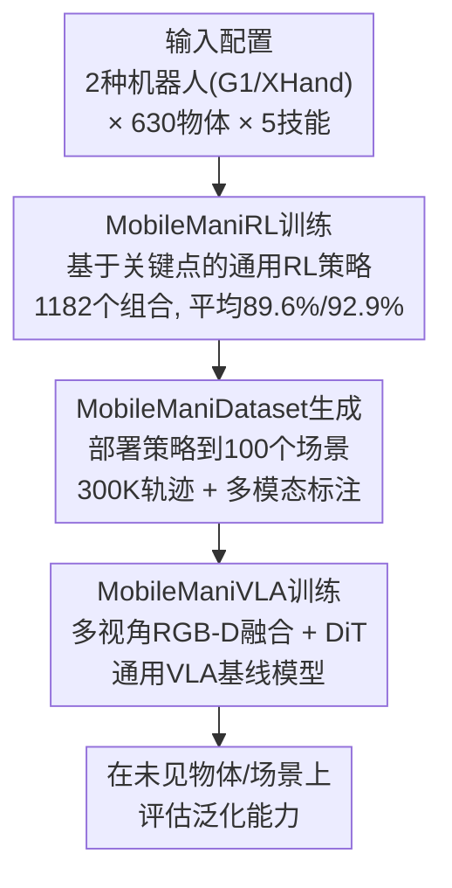

# MobileManiBench: Simplifying Model Verification for Mobile Manipulation

**会议**: ECCV 2026  
**arXiv**: [2602.05233](https://arxiv.org/abs/2602.05233)  
**论文**: [项目网站](https://dexhand.github.io/MobileManiBench/)  
**代码**: [项目网站](https://dexhand.github.io/MobileManiBench/)（代码/数据集/模型均在此公开发布）  
**领域**: 机器人 / 具身智能  
**关键词**: 移动操作, 仿真基准, 视觉-语言-动作模型, 强化学习, 灵巧手操作

## 一句话总结

本文提出 MobileManiBench——一个基于 Isaac Sim 的大型移动操作仿真基准，通过强化学习自动生成 300K 多样化操作轨迹（含语言指令、多视角 RGB-D 图像、物体/机器人状态与动作），覆盖 2 种机器人平台、630 个物体、5 种技能和 100 个场景，并在此基准上系统评估了多个 VLA 模型，为移动操作的 VLA 架构验证提供了标准化平台。

## 研究背景与动机

**领域现状**：视觉-语言-动作（VLA）模型在机器人操作领域取得了显著进展，展现出对新物体和多样视觉环境的强泛化能力。当前 VLA 模型的训练高度依赖大规模数据集，其中 Open X-Embodiment 已成为事实标准训练资源。然而，现有数据主要通过遥操作在静态桌面场景中收集，受限于第三方视角或头戴视角，物体种类有限。

**为什么之前没人做这事**：建造一个移动操作基准面临多重技术壁垒。首先，遥操作数据采集成本极高——一旦改变硬件配置（如增加深度相机、换成灵巧手、加装移动底盘），就需要从头重新采集数据。对灵巧手和移动平台而言，遥操作管线尤其笨重。其次，现有仿真基准（如 RLBench、ManiSkill2、LIBERO）多为固定基座、桌面场景，缺少对移动操作、灵巧手、多视角传感器的系统支持。第三，多样化的操作技能（拉/推/开/关/抓取）需要在同一平台上统一建模，而不同物体结构（铰接物体 vs 整体物体）的操作模式差异很大。

**做这件事为什么现在才可能**：高保真仿真引擎（NVIDIA Isaac Sim）和强化学习（PPO）的成熟使得自动化生成多样化操作轨迹成为可能。通过训练通用的 RL 策略而非手工设计规则，可以在一个统一的框架下处理多种机器人—物体—技能组合，并自动生成包含丰富标注的数据。

**核心 idea**：将 VLA 模型验证从昂贵、高风险的真实世界遥操作迁移到仿真环境——先利用 RL 自动训练面向每类组合的操作策略，再部署到多样化场景中大规模生成带多模态标注的操作轨迹，从而在高仿真度、低成本、可复现的条件下评估 VLA 架构的设计选择。

## 方法详解

### 整体框架

MobileManiBench 的构建分为三个阶段：MobileManiRL 策略训练、MobileManiDataset 自动生成、以及 MobileManiVLA 基线模型训练。流程图如下：

首先针对每个机器人—物体—技能三元组，在简化场景中训练一个基于状态输入的强化学习策略（MobileManiRL）。然后将训练好的策略部署到 100 个多样化真实感场景中，自动生成成功操作轨迹。最后将所有轨迹汇聚，训练一个通用的 VLA 模型 MobileManiVLA，并在未见物体和未见场景上评估泛化能力。

### 关键设计

**1. MobileManiRL：基于关键点的通用强化学习策略**

该设计要解决的核心矛盾：1182 个机器人—物体—技能组合，若针对每个组合手工设计策略不现实。论文的解法是将操作问题抽象为关键点（keypoint）位移的规划问题。

定义三类关键点：机器人夹爪/手部点（gripper/hand points）、物体抓取点（object grasp point）、目标点（goal point）。一个通用奖励函数 $R = R_d + (1-f_g)R_a + f_g(R_g+R_m+R_s)$ 驱动策略学习：全局距离奖励 $R_d$ 惩罚夹爪与抓取点、抓取点与目标点之间的偏差；当夹爪接近抓取点（距离低于阈值）时抓取标志 $f_g$ 置为 1，切换到抓取后阶段，依次触发抓取奖励 $R_g$、移动动作奖励 $R_m$ 和成功奖励 $R_s$。

策略输入包含 5 类信息：时间步编码、物体状态（抓取点和目标点的位置）、机器人本体感觉（78-135 维，含关节角度与姿态）、机器人—物体距离（22-31 维，夹爪/手指到抓取点的逐点距离）、上一步动作。策略网络为 4 层 MLP（隐藏层 1024→1024→512→512），输出 $(6+D)$ 维动作：前 6 维表示手腕位姿增量（经逆解算得移动基座+右臂目标关节角），剩余 $D$ 维为末端执行器目标关节角（G1 机器人 D=1，XHand 灵巧手 D=12）。

**2. 自动化数据生成与场景多样化**

该设计解决数据多样性和标注完整性的瓶颈。MobileManiRL 在简化场景（地面场景和桌面场景）中训练后，被部署到 5 类真实感场景中进行轨迹渲染：太空场景（手推车）、墙体场景（马桶、冰箱、柜子等）、门场景（窗、杠杆门、圆门）、户外场景（汽车）、桌面场景（盒子、笔记本电脑、洗碗机等）。每类场景手动标注 20 个放置位置（共 100 个），其中 80 个用于 VLA 训练、20 个保留用于测试。场景覆盖厨房、卧室、医院、办公室、仓库、停车场等日常环境。

每个操作轨迹以 30 FPS 录制，平均 160 帧。每条轨迹 $\mathcal{T} = \{L, (I_1,S_1,A_1), \dots, (I_T,S_T,A_T)\}$ 包含：一条自然语言指令 $L$；头视角和手腕视角同步的 $520\times520$ RGB、深度、分割图像 $I_t$；物体和机器人状态 $S_t$；以及 $(6+D)$ 维动作 $A_t$。所有状态和动作记录在全局世界坐标系中。最终数据集总计 15232 个训练组合和 920 个测试组合，每个训练组合生成 10 条成功轨迹，共 150K 条训练轨迹。

**3. MobileManiVLA：多视角多模态扩散Transformer架构**

该设计针对移动操作中单一 RGB 视角信息不足以完成精确操作的问题，构建了一个融合 4 路视觉输入和机器人状态信息的 VLA 基线模型。

视觉和语言模块初始化自 PaliGemma-2 预训练权重。视觉模块处理来自头视角和手腕视角的 4 路图像（两个 RGB + 两个深度，各缩至 $224\times224\times3$），经 SigLIP 编码为密集视觉嵌入。语言指令以 `<技能> <物体>` 格式（如 "open faucet"）分词投影为语言嵌入。二者经线性投影对齐后，与可学习的认知 token $c$ 一同送入 Gemma-2 语言模型，输出融合感知和指令上下文的特征 $f_t^c$。

动作模块采用扩散Transformer（DiT）。每次推理时，DiT 以当前去噪步 $i$ 的噪声动作序列 $(a_t^i, a_{t+1}^i, \dots, a_{t+N}^i)$、认知特征 $f_t^c$、以及经轻量 MLP 编码的 6 维手腕位姿状态特征 $f_t^s$ 作为条件输入，经多步去噪逐步预测干净动作 $(\hat{a}_t, \hat{a}_{t+1}, \dots, \hat{a}_{t+N})$。动作块长度 $N=16$，推理时采用 CogACT 提出的自适应集成策略（窗口 $K=4$）提升轨迹平滑性。所有状态和动作转换到机器人移动基座坐标系，保证跨场景一致性。

### 损失函数 / 训练策略

MobileManiVLA 端到端训练，损失函数为扩散模型的标准 MSE：$\mathcal{L}_{\text{MSE}} = \mathbb{E}_{\epsilon \sim \mathcal{N}(0,1), i} \|\hat{\epsilon}^i - \epsilon\|_2$，其中 $\hat{\epsilon}^i$ 是第 $i$ 步去噪时预测的噪声，$\epsilon$ 是对应的真实高斯噪声。训练批次大小 480，学习率 $2\times10^{-5}$，320K 次迭代，在 8 张 NVIDIA B200 GPU 上训练约 12 天/机器人。

## 实验关键数据

### 主实验

下表对比了 MobileManiRL（状态输入、逐组合独立训练与评估）和 MobileManiVLA（隐式感知输入、通用模型、在未见物体和场景上评估）在 5 种操作技能上的成功率：

| 技能 | MobileManiRL G1 (%) | MobileManiRL XHand (%) | MobileManiVLA G1 (%) | MobileManiVLA XHand (%) |
|------|--------------------|-----------------------|---------------------|-----------------------|
| Open | 86.6 | 91.9 | 42.9 | 34.5 |
| Close | 96.2 | 96.5 | 75.8 | 77.5 |
| Pull | 80.8 | 97.3 | 34.4 | 29.4 |
| Push | 93.1 | 97.2 | 85.1 | 90.0 |
| Pick | 66.4 | 72.6 | 28.8 | 40.2 |
| **Mean** | **89.6** | **92.9** | **56.7** | **57.3** |

### 消融实验

**输入模态消融**（G1 机器人，仅含 open/pull/pick 三种挑战性技能）：

| 视觉输入 | 状态输入 | 成功率 (%) |
|---------|---------|-----------|
| 头部 RGB 仅 | — | 7.9 |
| + 头部 Depth | — | 14.1 |
| + 腕部 RGB | — | 14.9 |
| 头部 RGB-D + 腕部 RGB-D | — | 28.2 |
| 头部 RGB-D + 腕部 RGB-D | 腕部位姿 | 32.3 |
| 头部 RGB-D + 腕部 RGB-D | 腕部位姿 + 抓取点 + 目标点 | 36.6 |

**物体/场景泛化消融**（G1 机器人）：

| 物体 | 场景 | 成功率 (%) |
|------|------|-----------|
| Seen | Seen | 59.6 |
| Seen | Unseen | 51.3 |
| Unseen | Seen | 39.2 |
| Unseen | Unseen | 28.2 |

**VLA 模型对比**（G1 机器人，默认输入配置）：

| 模型 | 成功率 (%) |
|------|-----------|
| OpenVLA (7B) | 4.5 |
| CogACT (7B) | 6.8 |
| π₀ (3B) | 11.2 |
| π₀.₅ (3B) | 18.8 |
| MobileManiVLA (3B) | 28.2 |

### 关键发现

- **灵巧手提升精度但增加碰撞风险**：MobileManiRL 下 XHand 灵巧手总体优于 G1 夹爪（92.9% vs 89.6%），但在 MobileManiVLA 中二者持平（57.3% vs 56.7%），灵巧手在 open/pull 等技能上因手指与物体表面碰撞反而表现更差，仅在 pick 技能上因力闭合抓取优势胜出。
- **多视角多模态是移动操作的关键**：单头部 RGB 仅 7.9% 成功率；同时使用头视角和腕视角的 RGB-D 提升到 28.2%，说明移动操作中机械臂本身的遮挡使得单一视角信息严重不足。对比现有 VLA 模型（OpenVLA/CogACT 仅头部 RGB → 4.5%/6.8%）也能佐证这一结论。
- **泛化到未见物体比未见场景更难**：未见物体 + 可见场景成功率 39.2%，而可见物体 + 未见场景为 51.3%，差距约 12 个百分点，说明物体结构变化比场景布局变化对操作策略的挑战更大。
- **移动底座至关重要**：固定底座下 MobileManiRL 成功率从 82.8% 骤降至 25.4%（在 open laptop/pull cart 等需要移动的任务上），确认了移动操作场景中移动底座的核心地位。

## 亮点与洞察

- **仿真优先（simulation-first）的验证范式**：在 VLA 模型兴起、数据采集成本高涨的背景下，将模型验证从真实世界迁移到仿真是一个优雅的桥接方案——先在仿真中快速迭代架构和传感器配置，验证有效后再进入真实世界部署，大幅降低验证成本。这个思路不仅适用于移动操作，可迁移到任意机器人操作场景。
- **基于关键点的通用奖励函数**：用夹爪点—抓取点—目标点三组关键点的位移统一描述不同物体类型（铰接物体、整体物体）和不同技能（推/拉/开/关/抓取）的操作目标，使得一个奖励函数就能训练 1182 种组合的 RL 策略，避免了为每种操作模式重新设计奖励。
- **多视角 RGB-D 的数据采集范式**：论文明确展示了头视角 + 手腕视角、RGB + Depth 的四路视觉输入对移动操作的刚性需求（从 7.9% → 28.2%）。这是对现有 VLA 模型（大多只用单视角 RGB）的一个直接提醒：移动操作的感知挑战远大于桌面操作。
- **灵巧手在 VLA 范式下的局限**：论文诚实报告了灵巧手在 VLA 模型中不如预期的表现——手指在接近物体表面时容易碰撞。这提示在 VLA 范式中，高自由度灵巧手指的控制可能需要在训练中加入更多约束或更好的视觉引导策略。
- **统一的多维度评估平台**：同时支持 2 种末端执行器 × 630 物体 × 5 技能 × 100 场景 × 2 视角——这个设计空间基本覆盖了移动操作的主要变量，为系统性研究 embodiment、感知模态和策略架构提供了标准化平台。

## 局限与展望

- **Sim-to-Real 差距**：论文展示了 MobileManiVLA 在真实机器人上的推理（附录中），但评估仍然主要在仿真中进行。仿真中的物理特性（摩擦、刚度、接触动力学）与真实世界存在差距，基准上得到的结论是否完全迁移到真实世界需要进一步验证。
- **VLA 性能远低于 RL**：MobileManiVLA（56.7%/57.3%）显著低于 MobileManiRL（89.6%/92.9%），差距约 33 个百分点。原因在于 VLA 模型依赖隐式视觉输入而非精确状态，但这也反映了当前 VLA 架构在处理精细操作任务时的根本局限——视觉表征的信息损失远大于显式状态的精度。
- **轨迹生成上限来自 RL**：数据集质量高度依赖 MobileManiRL 策略的成功率。对 pick 这类挑战性技能（RL 仅 66.4%/72.6%），后续 VLA 训练数据中成功轨迹占比天然受限。提升 RL 策略本身即可提升数据集质量和 VLA 效果。
- **技能种类有限**：目前仅支持 5 种操作技能，缺少更复杂的任务（如装配、工具使用、多物体协同操作），场景也局限于静止物体，缺少动态环境（如人来人往、物品移动）。
- **只有 2 种机器人平台**：虽然覆盖了平行夹爪和灵巧手，但缺少其他常见末端执行器（如吸盘、三指手），且两种机器人同为双臂机器人且只激活右臂。

## 相关工作与启发

- **vs RLBench / ManiSkill2 / LIBERO**: 这些是桌面操作的经典仿真基准，主要面向固定基座机器人、桌面物体操作，不涉及移动底座和灵巧手。MobileManiBench 在移动性、末端执行器多样性、技能多样性上显著扩展了操作空间。
- **vs SIMPLER**: SIMPLER 专注于桌面操作的 Sim-to-Real 评估协议，但只涉及固定基座、平行夹爪。MobileManiBench 则将评估对象扩展到移动操作，并支持传感器配置的灵活变换。
- **vs DexArt**: DexArt 率先在仿真中研究灵巧手对铰接物体的操作，但仅有 2 种技能（开/关）、单场景、无移动底座。MobileManiBench 在规模和多样性上大幅超越。
- **vs Open X-Embodiment / DROID**: 真实世界数据集，规模大但局限于固定基座桌面场景，改变硬件需重采数据。MobileManiBench 的仿真路线消除了这一限制。
- **vs π₀ / π₀.₅**: 这些是最新的 VLA 模型，论文将其作为基线评估并系统对比。结果表明多视角 RGB-D 融合 + 位姿状态编码比简单的多视角 RGB 拼接能带来显著提升（28.2% vs 18.8%）。

## 评分

- 新颖性: ⭐⭐⭐⭐ [将仿真优先验证范式系统化应用于移动操作场景，填补了该领域缺少大型基准的空白；但整体思路（仿真生成数据）并非首创]
- 实验充分度: ⭐⭐⭐⭐⭐ [覆盖了 2 种机器人 × 630 物体 × 5 技能 × 100 场景，消融实验设计完整（输入模态、泛化维度、模型对比、移动底座 vs 固定底座），取用多个角度分析]
- 写作质量: ⭐⭐⭐⭐ [结构清晰，takeaway 总结精炼，图表丰富；但第 5 部分实验展开不够详尽，部分消融结果仅在文字中提及而缺少完整表格]
- 价值: ⭐⭐⭐⭐⭐ [为移动操作 VLA 研究提供了稀缺的大规模标准化评估平台，降低模型验证成本，促进可复现研究和架构迭代；数据集和代码已公开，实用价值高]

<!-- RELATED:START -->

## 相关论文

- [\[ICCV 2025\] Learning Precise Affordances from Egocentric Videos for Robotic Manipulation](../../ICCV2025/segmentation/learning_precise_affordances_from_egocentric_videos_for_robotic_manipulation.md)
- [\[CVPR 2026\] 3M-TI: High-Quality Mobile Thermal Imaging via Calibration-free Multi-Camera Cross-Modal Diffusion](../../CVPR2026/segmentation/3m-ti_high-quality_mobile_thermal_imaging_via_calibration-free_multi-camera_cros.md)
- [\[CVPR 2026\] RealVLG-R1: A Large-Scale Real-World Visual-Language Grounding Benchmark for Robotic Perception and Manipulation](../../CVPR2026/segmentation/realvlg-r1_a_large-scale_real-world_visual-language_grounding_benchmark_for_robo.md)
- [\[AAAI 2026\] Segment and Matte Anything in a Unified Model (SAMA)](../../AAAI2026/segmentation/segment_and_matte_anything_in_a_unified_model.md)
- [\[CVPR 2026\] RobotSeg: A Model and Dataset for Segmenting Robots in Image and Video](../../CVPR2026/segmentation/robotseg_a_model_and_dataset_for_segmenting_robots_in_image_and_video.md)

<!-- RELATED:END -->
