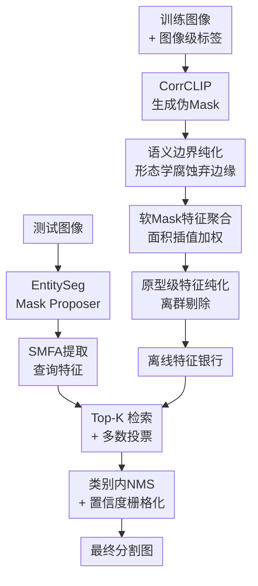

# ModuSeg: Decoupling Object Discovery and Semantic Retrieval for Training-Free Weakly Supervised Segmentation

**会议**: ECCV2026  
**arXiv**: [2604.07021](https://arxiv.org/abs/2604.07021)  
**代码**: [https://github.com/Autumnair007/ModuSeg](https://github.com/Autumnair007/ModuSeg)  
**领域**: 语义分割  
**关键词**: 弱监督语义分割, 解耦, 无训练, 特征检索, 基础模型

## 一句话总结

ModuSeg 将弱监督语义分割显式解耦为"类无关目标发现"和"语义检索"两个独立阶段——用通用 Mask Proposer 提取几何提案、用离线特征银行进行非参数检索，在完全不需微调的情况下以训练集仅图像级标签达到 VOC 86.3 mIoU 的 SOTA。

## 研究背景与动机

弱监督语义分割（WSSS）的目标是用图像级标签实现逐像素预测，大幅降低逐像素标注成本。传统方法几乎都走一条路：用类激活图（CAM）生成初始定位线索，然后靠多阶段网络重训练或端到端联合优化来扩充分割区域。这条路的根问题是**语义识别和物体定位被耦合进了同一个分类目标**——分类网络天然会只关注最具判别力的局部区域，导致 CAM 激活图只能覆盖物体稀疏片段（如鸟头而非全身），产生的前景区域天然残缺且边缘含混。为了修复这些残缺 seed，传统范式要么依赖多阶段重训练（计算量大、流程复杂），要么走端到端联合优化（训练不稳定、伪标签噪声难以抑制）。

视觉基础模型（DINOv2/v3、C-RADIOv4、SAM、EntitySeg 等）的兴起为这个困局带来了新可能。类无关分割模型有极好的边界感知能力，视觉-语言模型和自监督模型学到了极强的稠密语义描述。但很多现有方法仍然沿着耦合优化的老路走——把基础模型集成进来做微调或端到端蒸馏，结果还是逃不开弱监督伪标签中固有噪声的干扰，没有真正释放基础模型的潜力。

本文的核心洞察是：既然几何定位和语义分类本来就是两件事，为什么要捆绑在一起优化？一个通用 Mask Proposer（如 EntitySeg）本身就擅长提取边界干净的目标提案，不需要任何语义信息；一个语义基础模型（如 C-RADIOv4）本身就能提供高质量的稠密特征。把这两样东西直接拼起来——用提案做定位、用特征检索做分类——就能绕开耦合优化的所有麻烦。**核心 idea：将弱监督语义分割显式解耦为类无关目标发现 + 语义检索两个独立阶段，用通用 Mask Proposer 提取几何提案、用离线构建的特征银行做非参数 KNN 检索分配语义，整个流程完全不需要参数微调。**

## 方法详解

### 整体框架

ModuSeg 的核心是将 WSSS 拆成两个完全独立的阶段——离线特征银行构建和在线推理检索——之间只需要一次非参数的特征相似度计算，不存在任何跨阶段梯度回传或联合优化。

**阶段一（离线）：基于训练集图像级标签构建鲁棒特征银行。** 用预训练 CorrCLIP 为每张训练图生成初始伪 Mask，但直接用它提取特征有两个问题：伪 Mask 在物体边缘处由于 ViT patch 对齐和弱监督自身噪声而有严重的特征混合，且硬量化采样会引入量化噪声。本文通过语义边界纯化（SBP，形态学腐蚀抛弃边缘）和软 Mask 特征聚合（SMFA，面积插值加权）来提取高质量类别原型，再按聚类假设剔除离群样本，得到干净的特征银行。

**阶段二（在线推理）：用类无关 Mask Proposer 提取目标提案，再在特征银行中做检索投票完成语义分类。** 输入一张测试图，EntitySeg 生成一堆二元 Mask 提案（只回答"这里有一个物体"，不知道是什么），对每个提案用同样的 SMFA 提取查询特征，在特征银行里检索 Top-K 近邻，用多数投票定类别。最后对重叠提案做类别内 NMS + 按置信度优先级栅格化，得到最终分割图。

### 关键设计

**1. 语义边界纯化（SBP）：主动抛弃不可靠边缘以换特征纯度**

ViT 特征图和图像之间存在固体的结构错位——一个 16x16 的 patch 如果恰好跨在物体边界上，它编码的就是前景和背景的混合信号。而弱监督伪 Mask 在物体边缘本身就充满不确定性（分类器在边界处置信度低）。如果把这些"脏"patch 用于特征银行构建，每个类别原型都会被灌注噪声，后续检索的判别力随之下降。

SBP 的解法非常朴素但有效：**用形态学腐蚀把伪 Mask 往外"切掉一圈"**。具体来说，对每个类别的二元 Mask，用 3x3 的结构化核做 20 次迭代腐蚀。这相当于主动放弃物体边界附近的"灰区"，只保留物体核心区域——这些区域的 patch 几乎肯定属于该类别，特征最纯净。丢失的是边界几何完整性，但换来的特征是高度语义纯粹的。注意这一操作只在离线构建特征银行时使用（目标是精度），推理阶段直接用 EntitySeg 的原始提案不做腐蚀（目标是召回和边界保真度），形成训练-推理阶段的刻意不对称。

**2. 软 Mask 特征聚合（SMFA）：面积插值代替硬量化以抑制量化噪声**

将高分辨率 Mask 映射到低分辨率 ViT 特征网格时，朴素的近邻降采样赋予每个特征网格点一个二值标记——"包含"或"不包含"。但 Mask 边缘的网格点很可能只有部分区域被物体覆盖，硬量化要么把它整块算入（引入背景噪声），要么整块排除（丢掉有效信息）。

SMFA 用面积插值代替硬量化：把高分辨率的纯化 Mask 降采样到特征网格分辨率，每个网格点得到一个 0 到 1 之间的软权重 w，代表该 patch 被物体真实覆盖的比例。然后特征原型是加权平均：v = normalize(sum(w·F) / sum(w))。这样，完全落在物体中心区的 patch 贡献接近 1，边缘半覆盖的 patch 贡献按比例自然衰减，整个聚合过程可微且干净。这个设计也使模块与任意 ViT 骨干解耦——换 DINOv2 还是 C-RADIOv4，SMFA 的流程不变，只需替换特征提取器即可。

**3. 原型级特征纯化：聚类假设驱动的离群样本剔除**

即使经过 SBP + SMFA，伪标签的噪声依然无法完全消除——某些训练样本的伪 Mask 偏移严重、或者特征向量偏离了类内分布中心。本文基于聚类假设（同类可靠特征在高维空间形成紧凑簇，而噪声样本在边缘松散分布）做第二轮过滤。

对每个前景类，先计算所有候选特征向量的均值作为全局原型 μ_c，再计算每个特征向量 v 到 μ_c 的欧氏距离 d_v。剔除距离最大的 top α%（默认 25%）样本。这里的关键设计决策是：背景类不做纯化。背景天然是多模态的（天空、路面、植被、建筑……），单一中心假设完全不适用，强行过滤会丢失背景多样性、损害模型对复杂环境的判别能力。保留所有背景嵌入，保证负样本的全面覆盖。

**4. 检索增强语义分配：Top-K 搜索 + 分级投票 + 置信度栅格化**

实体分割模型（EntitySeg）给出的提案往往存在过度分割——一个物体被切碎成多个片段，或背景被折分。这意味着检索阶段必须鲁棒地处理碎片和重叠。

检索流程分为三层。第一层，对每个提案用 SMFA 提取查询特征，在特征银行中检索 Top-K（K=25）个最近邻（余弦相似度）。第二层，分级投票：先按类别计票，少数服从多数；平票时按支持样本的累积相似度决胜——"共识优先于峰值"，有效抑制单一离群高相似度样本带来的误判。第三层，冲突解决：先做类别内 NMS 消除重复检测，再按语义置信度（得票类别的平均相似度）对所有剩余提案降序排列，用"先来后到"逐像素填充分割图——高置信度的大提案优先占据空间，低置信度的小提案填剩下的空白。这个栅格化策略天然处理了遮挡和边界重叠。

### 一个完整示例

以 PASCAL VOC 的一张含"人骑自行车"的测试图为例。EntitySeg 可能会产出 30+ 个提案：骑手全身（大区域）、自行车（中区域）、骑车人的头盔（小区域）、车轮（碎片）、背景树冠（多个碎片）、天空（大区域）等。

对每个提案，SMFA 提取特征后在特征银行中检索 Top-25 近邻。"骑手全身"提案的近邻里 22 票是 "person"，3 票是 "bicycle"（背景中有人和自行车同时出现的场景特征），投票为 person。"自行车"提案的近邻里 18 票 bicycle、5 票 person、2 票 motorbike，投票为 bicycle。"头盔"提案的近邻 20 票 person（因为大多数训练图中的 person 都包含头部区域）、5 票 hat，投票也是 person。NMS 阶段，同属 person 类的"骑手全身"和"头盔"提案 IoU 大于阈值，"头盔"被抑制。最终按置信度栅格化：骑手全身（置信度 0.92）最先占位，然后自行车（0.88）占不重叠区域，背景树冠和天空填剩余。最终分割图清晰地看到 person + bicycle 两个类，边界来自 EntitySeg 的原始几何提案，比传统 CAM 方法精细得多。

### 损失函数 / 训练策略

本文完全不需要训练——特征银行构建和推理都是前向操作，没有任何反向传播或参数更新。唯一需要调节的是超参数：腐蚀迭代次数（20）、离群剔除比（25%）、KNN 检索邻居数（25）、目标置信度阈值（0.5）等，都在验证集上调定即可。

## 实验关键数据

### 主实验

| 数据集 | 指标 | ModuSeg | 此前 SOTA | 提升 |
|--------|------|---------|-----------|------|
| VOC 2012 val | mIoU | **86.3** | 79.5 (SSR) | +6.8 |
| VOC 2012 test | mIoU | **86.6** | 79.6 (SSR) | +7.0 |
| COCO 2014 val | mIoU | **56.7** | 50.6 (SSR) | +6.1 |

ModuSeg 在完全不训练的条件下，超越了此前所有需要多阶段重训练或端到端学习的方法。相比同样用了基础模型的 ExCEL（78.4）和 SSR（79.5），分别提升了 7.9 和 6.8 个百分点。

### 消融实验

| 配置 | VOC mIoU | 说明 |
|------|---------|------|
| Baseline (C-RADIOv4 + EntitySeg) | 84.3 | 完全无 SBP 和 SMFA |
| + SMFA | 84.6 | 软 Mask 聚合替代硬量化 |
| + SBP | 85.2 | 形态学腐蚀去边缘噪声 |
| + SMFA + SBP (ModuSeg 完整) | **86.3** | 两者协同，1.1% 额外提升 |

| 配置 | VOC mIoU | COCO mIoU |
|------|---------|-----------|
| CorrCLIP w/o 标签过滤 | 68.7 | 42.5 |
| CorrCLIP w/ 标签过滤 | **78.8** | **54.6** |
| Mask Adapter w/o 标签过滤 | 76.6 | 55.1 |
| Mask Adapter w/ 标签过滤 | **82.4** | **60.2** |

| 骨干网络 | VOC mIoU | COCO mIoU |
|---------|---------|-----------|
| DINOv2 ViT-B | 82.9 | 51.0 |
| DINOv3 ViT-B | 84.7 | 53.5 |
| DINOv3 ViT-L | 85.3 | 55.8 |
| C-RADIOv4 SO400M | **86.3** | **56.7** |

### 数据效率与上限分析

- **数据效率极高**：每类仅用 50 张训练图即达到 80.2 mIoU（全量 86.3 的 93%）；仅 20 张 / 类可达 69.8。在小样本场景下仍有效。
- **上限瓶颈在 Proposer 而非特征银行**：用 GT Mask 替换伪 Mask 做特征银行，mIoU 仅从 86.3 小幅升至 86.7；但推理时用 GT Mask 替换 EntitySeg 提案则提升到 95.7——瓶颈在于类无关 Proposer 对物体的过度分割和语义间隙，而不在特征银行的质量。
- **Mask Proposer 选择**：EntitySeg 优于 SAM 2（VOC 86.3 vs 82.6），主要是 EntitySeg 的实例一致性更强。

### 训练效率

| 方法 | 训练时间（min） | GPU 显存（G） | mIoU |
|------|---------------|-------------|------|
| CLIMS | 1068 | 18.0 | 70.4 |
| MCTformer+ | 1496 | 18.0 | 74.0 |
| WeCLIP | 270 | 6.2 | 76.4 |
| **ModuSeg** | **84** | **5.3** | **86.3** |

ModuSeg 的训练时间仅为当前最好方法 SSR 的约 1/6（基于推理时长估计，SSR 未直接报告训练时间但需多阶段 SFT）。

## 亮点与洞察

- **解耦即插即用**：本文最大的亮点是结构性的——把 WSSS 从"耦合优化"范式拉到"模块拼装"范式。任何更好的 Mask Proposer 或更强的语义特征提取器，直接替换对应模块即可自然提升性能，不需要重训网络，这在基础模型快速迭代的时代极有实用价值。
- **训练-推理不对称的边界处理**：SBP 只在特征银行构建时用（精度优先），推理阶段用原始提案（召回优先）——这个不对称设计看似简单但很关键。如果推理阶段也腐蚀，碎片提案会被进一步削弱，检索匹配精度显著下降。
- **背景类跳过纯化的决策**：聚类假设对多模态的背景类不适用，保留所有背景嵌入保证负样本多样性。这个细微但正确的"不做"比以前一些方法一律硬做过滤更合理。

## 局限与展望

- **依赖预训练 Proposer 的质量**：上限分析显示瓶颈在 EntitySeg 对物体的过度分割（把连续物体切碎成碎片）。如果能用更强的 Proposer（或结合多个 Proposer 的集成），性能仍有明显提升空间。
- **固定类别集限制**：本文仍遵循标准 WSSS 设定（给定训练集中的类别集），不具备开放词汇分割的能力。特征银行本身可以扩展为跨数据集共享的类原型库，但本文没有探索这个方向。
- **图像级标签仍需提供**：虽然不需要逐像素标注，但训练集仍需包含图像级类别标签（每组图像标注该图含哪些类），严格来说是"弱监督"而非"无监督"。
- **大规模场景的高效检索**：COCO 数据集上用 IVF 索引加速是必要的，FAISS 的索引选择和超参数（nlist、nprobe 等）会影响精度-速度权衡。

## 相关工作与启发

- **vs CAM-based WSSS（ToCo, MCTformer+, WeCLIP 等）**：这些方法本质是在"既然整体框架是耦合的，就尽量改良框架中的某个环节"（改进注意力、引入 CLIP 先验等）。ModuSeg 从框架层面重构了问题——既然解耦就能绕开矛盾，何必改良耦合。
- **vs SAM-based WSSS（S2C, SEPL 等）**：这些方法用 SAM 的 Mask 提案来 refine CAM 或伪标签，但仍然需要通过训练来融合 Mask 和语义信息。ModuSeg 直接用 Mask 提案做定位，不需要二者之间的任何训练桥接。
- **vs 原型学习 WSSS（SSR, ExCEL 等）**：这些方法用可学习的文本原型或可训练的投影头来对齐视觉和语言特征，本质上仍然需要反向传播。ModuSeg 的特征银行全是冻结提取器的前向输出，更简单也更易扩展。

## 评分

- 新颖性: ⭐⭐⭐⭐⭐ 将 WSSS 从"耦合优化"范式彻底推向"解耦即插即用"范式，路线级别的创新。
- 实验充分度: ⭐⭐⭐⭐ 主实验 + 消融 + 各种分析（上限分析/数据效率/泛化性/训练效率）全面到位，但缺更系统的超参数可视化。
- 写作质量: ⭐⭐⭐⭐⭐ 动机清晰、方法分层合理、消融证据链完整，图表丰富且与文字呼应好。
- 价值: ⭐⭐⭐⭐⭐ 无训练、模块化、性能大幅超越 SOTA——这种组合在研究社区和工业应用中都极有吸引力。

<!-- RELATED:START -->

## 相关论文

- [\[CVPR 2026\] Frequency-Aware Affinity for Weakly Supervised Semantic Segmentation](../../CVPR2026/segmentation/frequency-aware_affinity_for_weakly_supervised_semantic_segmentation.md)
- [\[AAAI 2026\] SSR: Semantic and Spatial Rectification for CLIP-based Weakly Supervised Segmentation](../../AAAI2026/segmentation/ssr_semantic_and_spatial_rectification_for_clip-based_weakly_supervised_segmenta.md)
- [\[CVPR 2026\] Leveraging Class Distributions in CLIP for Weakly Supervised Semantic Segmentation](../../CVPR2026/segmentation/leveraging_class_distributions_in_clip_for_weakly_supervised_semantic_segmentati.md)
- [\[CVPR 2026\] Rethinking Box Supervision: Bias-Free Weakly Supervised Medical Segmentation](../../CVPR2026/segmentation/rethinking_box_supervision_bias-free_weakly_supervised_medical_segmentation.md)
- [\[ECCV 2026\] SkelEM: Training-Signal Decoupling of Skeleton and Diffusion for Self-supervised Axial Super-Resolution in Volume Microscopy](skelem_training-signal_decoupling_of_skeleton_and_diffusion_for_self-supervised_.md)

<!-- RELATED:END -->
