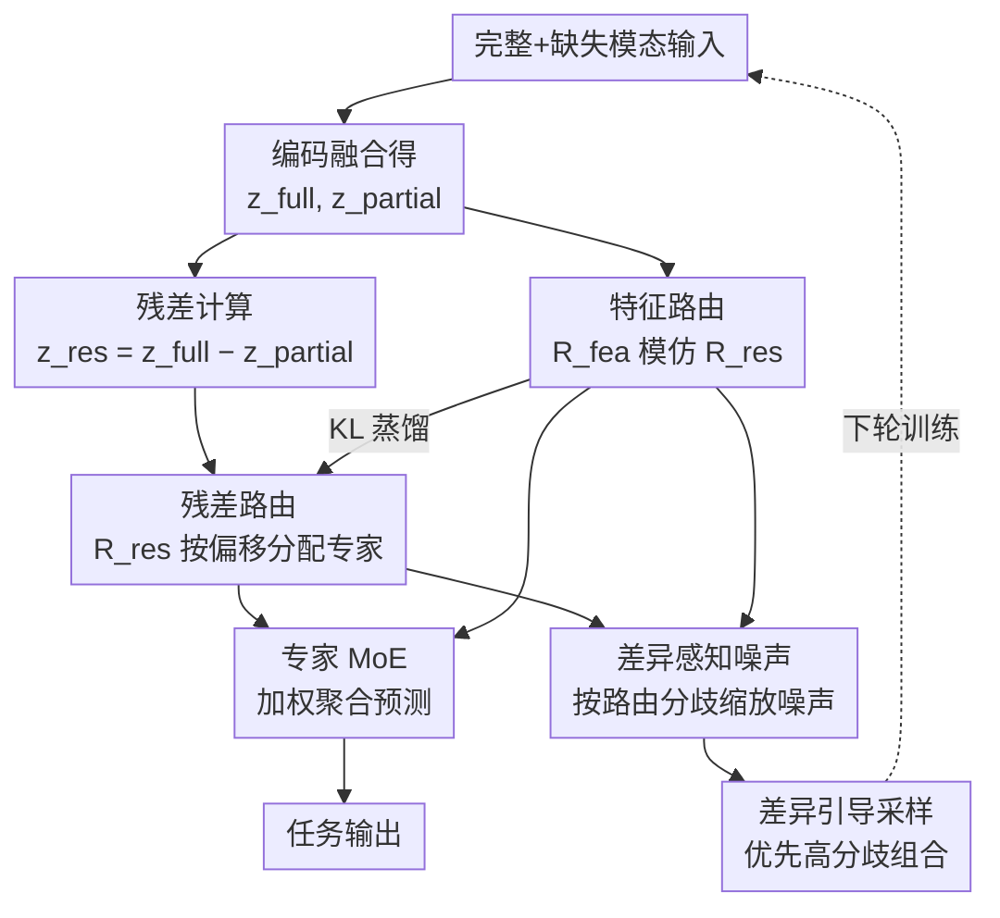

# Residual-Guided Expert Specialization for Incomplete Multimodal Learning

**会议**: ECCV 2026  
**arXiv**: [2606.30355](https://arxiv.org/abs/2606.30355)  
**代码**: [https://github.com/seunghub/MARS](https://github.com/seunghub/MARS)  
**领域**: 多模态VLM / 语义分割  
**关键词**: 不完备多模态学习, 混合专家模型, 残差路由, 模态缺失, 表征偏移

## 一句话总结
MARS 提出一种混合专家（MoE）框架，通过计算完整模态与缺失模态表征之间的残差来捕获模态缺失导致的表征偏移模式，以此引导专家特化；同时引入双路由器蒸馏和差异感知噪声正则化解决训练-推理路由不一致问题，在不完备多模态分类和分割四个数据集上全面超越 SOTA。

## 研究背景与动机
**领域现状**：多模态学习通过融合 RGB、深度、红外、文本等多源信息提升分类和分割性能，但实际部署中常因传感器故障或采集成本而缺失部分模态，不完备多模态学习（IML）因此成为实用化关键挑战。现有方法大致分为三类：基于填补的方法试图从已有模态重建缺失模态，但易产生幻觉且计算开销大；基于表示学习的方法（如 LCR、RFNet、DMRNet）学习对缺失鲁棒的表征，但始终在不完备输入上操作，无法显式建模缺失带来的影响；基于专家的方法（如 MoMKE、SimMLM）引入多专家结构，却将专家角色与模态组合硬绑定（需 $2^M$ 个专家）、或采用两阶段训练限制了灵活性。

**核心矛盾**：无论模型设计多么精巧，缺失模态的输入所产出的任务表征 $z^{\text{partial}}$ 与完整模态下的表征 $z^{\text{full}}$ 之间必然存在系统性偏差——缺失的模态带走了互补证据，导致表征被不可逆地"重塑"。然而，此前所有方法都只在残损表征上做决策，没有一种方法显式地表征和利用这种"重塑"的规律。一个自然的追问是：这个表征偏移（即残差 $z^{\text{full}} - z^{\text{partial}}$）本身是否包含着对模型有价值的信息？

**核心 idea**：用完整与缺失表征之差作为"特权残差信号"，让 MoE 路由器根据残差所刻画的表征偏移模式来为样本分配专家，使不同专家分别特化于不同的缺失模式；推理时通过一个仅依赖不完备输入的特征路由器蒸馏残差路由器的行为，实现对缺失模式的隐式推断与专家选择。

## 方法详解

### 整体框架
MARS 要解决两个问题：一是训练时如何利用残差信号让专家学会按"缺失模式"特化，二是推理时在没有完整模态（无法计算残差）的情况下如何维持同样的特化行为。方法的核心是一个稀疏 MoE 结构，但路由器不直接看不完备输入 $z^{\text{partial}}$，而是看"这个不完备输入相比完整输入差了多少"——即残差 $z^{\text{res}} = z^{\text{full}} - z^{\text{partial}}$。训练时，残差路由器用 $z^{\text{res}}$ 做路由分配，特征路由器用 $z^{\text{partial}}$ 模仿其行为；推理时特征路由器独立工作。同时，差异感知噪声正则化让残差路由器在路由分歧大的专家上注入更大噪声，促使这些专家对路由不匹配更鲁棒；差异引导采样则优先训练路由器分歧大的模态组合。整个框架是一个"特权信息引导特化 → 蒸馏迁移到可部署路由器 → 噪声弥合蒸馏误差"的闭环。

### 关键设计

**1. 残差引导的专家路由特化：用表征偏移而非残损表征做路由**

传统 MoE 路由器直接看不完备输入 $z^{\text{partial}}$ 来决定激活哪些专家，但 $z^{\text{partial}}$ 本身已因模态缺失而失真，路由器从中能获取的关于"缺了什么、缺到什么程度"的信息是有限且隐式的。MARS 改为利用残差 $z^{\text{res}} = z^{\text{full}} - z^{\text{partial}}$ 作为路由输入——这个残差直接刻画了缺失模态对任务表征的"扰动方向与幅度"，比残损表征本身更能反映缺失模式的结构化特征。

残差路由器 $\mathcal{R}_{\text{res}}$ 接收 $z^{\text{res}}$，输出干净 logits $l_i^{\text{res}} \in \mathbb{R}^N$ 和噪声标准差 $\sigma_i \in \mathbb{R}^N$（$N$ 为专家数）。采用带噪声的 Top-K 路由：对 logits 注入高斯噪声 $\tilde{l}_i^{\text{res}} = l_i^{\text{res}} + \epsilon \sigma_i$（$\epsilon \sim \mathcal{N}(0, I)$），选 top-$K$ 个专家并通过 $\text{Softmax}_K$ 计算路由概率 $p_i^{\text{res}}$。每个专家 $E_j$ 处理 $z^{\text{partial}}$，输出按 $p_i^{\text{res}}$ 加权聚合后送入任务头 $h$：$\hat{y}_i^{\text{partial}} = h(\sum_{j=1}^N (p_i^{\text{res}})_j E_j(z_i^{\text{partial}}))$。训练时，同一 batch 内每个样本同时构造完整输入和随机掩码后的不完备输入，使得 $z^{\text{res}}$ 可被计算。实验中的 Oracle 路由（推理时也用残差路由器）达到 ACER 0.94，证明专家已充分按缺失模式特化。

**2. 特征路由器的蒸馏学习：让可部署路由器模仿特权路由器**

残差路由器的核心问题是在推理时不可用——当模态缺失时，$z^{\text{full}}$ 无法获得，$z^{\text{res}}$ 无从计算。MARS 的解法是训练一个特征路由器 $\mathcal{R}_{\text{fea}}$，它仅以不完备输入 $z^{\text{partial}}$ 为输入，通过知识蒸馏学习模仿残差路由器的路由决策。

具体而言，$\mathcal{R}_{\text{fea}}$ 对 $z^{\text{partial}}$ 输出干净 logits $l_i^{\text{fea}}$，但不直接用于任务损失（任务损失仍由残差路由器主导），而是通过 KL 散度与残差路由器的 logits 对齐：$\mathcal{L}_{\text{distill}} = D_{\text{KL}}(\text{Softmax}(\text{GradStop}(l_i^{\text{res}})) \parallel \text{Softmax}(l_i^{\text{fea}}))$。$\text{GradStop}$ 阻止残差路由器被蒸馏损失反向更新，确保蒸馏是单向的——残差路由器保持最优路由，特征路由器向其靠拢。当所有模态都可用时，$z^{\text{res}} = 0$，此时路由完全由特征路由器承担。这个设计将"特化"（由残差路由器在训练时完成）和"部署"（由特征路由器在推理时完成）解耦，是整篇论文最核心的架构决策。

**3. 差异感知噪声正则化：用噪声弥合训练-推理路由鸿沟**

即使有蒸馏损失，特征路由器也无法完美复现残差路由器的行为——因为它缺少 $z^{\text{full}}$ 提供的完整信息。这种不可避免的路由偏差会导致训练时分配给某专家的样本在推理时被分配给另一个专家，而目标专家并未见过这些样本，造成性能下降。

MARS 的解法是让噪声"有方向地"注入：对于两个路由器分歧越大的专家，残差路由器向其注入越大的噪声方差，迫使该专家在训练时就接触更多不确定性，从而对推理时的路由切换更鲁棒。具体实现为：对每个样本，取两个路由器的 top-K 专家集合 $\mathcal{T}_i^{\text{res}}$ 和 $\mathcal{T}_i^{\text{fea}}$，在它们的并集 $\mathcal{U}_i$ 中，计算每个专家 $j$ 的路由分歧 $(m_i)_j = |\text{Softmax}(l_i^{\text{res}})_j - \text{Softmax}(l_i^{\text{fea}})_j|$。将专家按 $m_i$ 降序排列得到排列 $\pi_i$，然后用 Softplus 惩罚噪声方差排序与分歧排序不一致的情况：

$$\mathcal{L}_{\text{noise}} = \frac{1}{|\mathcal{U}_i|-1}\sum_{j=1}^{|\mathcal{U}_i|-1}\text{Softplus}\big(\log(\sigma_i)_{\pi_i(j+1)}^2 - \log(\sigma_i)_{\pi_i(j)}^2\big)$$

该损失软性地强制 $(\sigma_i^2)_{\pi_i(1)} \geq \dots \geq (\sigma_i^2)_{\pi_i(|\mathcal{U}_i|)}$，即分歧越大的专家噪声越大。这比传统 MoE 中单纯的负载均衡噪声多了一层"目的性"——噪声不只是为了让专家多样化，更是为了弥合训练推理的路由鸿沟。

**4. 差异引导的模态采样：让训练集中在路由器最难对齐的缺失模式上**

不同模态组合的训练难度不同——有些组合（如仅剩 IR）下残差路由器和特征路由器的分歧特别大，说明特征路由器在这些条件下难以模仿残差路由器的决策。MARS 提出在 warm-up 若干 epoch 后，根据两种路由器的 Top-K 重叠率动态调整各模态组合的采样概率。

对于每种不完备模态组合 $c_j$，计算当前 epoch 内所有样本的路由分歧 $d_j = 1 - \frac{1}{|\mathcal{D}_{c_j}|}\sum_{i \in \mathcal{D}_{c_j}} \frac{|\mathcal{T}_i^{\text{res}} \cap \mathcal{T}_i^{\text{fea}}|}{K}$，分歧越大说明特征路由器在该组合下越难对齐。然后用 softmax 归一化得到下轮采样概率 $q_j^{(t+1)} = \frac{\exp(d_j/\tau)}{\sum_k \exp(d_k/\tau)}$。实验中 IR-only 组合的采样概率最高（约 0.43），恰好对应此前所有方法在该设置下表现最差的事实——MARS 把最多训练资源投给了最难的场景。

### 一个完整示例：CASIA-SURF 上仅剩 IR 模态的推理过程

以人脸防伪检测 CASIA-SURF 数据集为例，输入包含 RGB、Depth、IR 三个模态。当推理时仅 IR 可用（RGB 和 Depth 传感器故障），处理流程为：IR 图像经模态编码器得 $e_i^{\text{IR}}$，RGB 和 Depth 因 $\delta = 0$ 被置零，拼接后经融合层得 $z^{\text{partial}}$。特征路由器 $\mathcal{R}_{\text{fea}}$ 将 $z^{\text{partial}}$ 映射为 16 个专家的 logits，Top-5 激活后，发现专家 E0 获得最高路由概率——E0 在训练时已被残差路由器反复分配了"仅剩 IR"的样本（残差 $z^{\text{full}} - z^{\text{partial}}$ 在 IR-only 模式下呈现特定的偏移方向）。E0 处理 $z^{\text{partial}}$ 后输出特征，与其余 4 个专家输出加权聚合，送入分类头判断真人/攻击。整个过程无需完整模态，MARS 在此最困难的设置下将 ACER 从 DMRNet 的 8.98 降至 3.96。

### 损失函数 / 训练策略

总损失为四项加权和：

$$\mathcal{L}_{\text{total}} = \lambda_{\text{task}}\mathcal{L}_{\text{task}} + \lambda_{\text{LB}}\mathcal{L}_{\text{LB}} + \lambda_{\text{distill}}\mathcal{L}_{\text{distill}} + \lambda_{\text{noise}}\mathcal{L}_{\text{noise}}$$

其中 $\mathcal{L}_{\text{task}} = \ell(\hat{y}_i^{\text{full}}, y_i) + \ell(\hat{y}_i^{\text{partial}}, y_i)$ 同时监督完整和不完备输入的任务损失（交叉熵）；$\mathcal{L}_{\text{LB}} = \text{CV}^2(\text{importance}) + \text{CV}^2(\text{load})$ 是负载均衡损失，用平方变异系数衡量专家利用均匀度；$\mathcal{L}_{\text{distill}}$ 和 $\mathcal{L}_{\text{noise}}$ 如上所述。训练时每样本同时构造完整和不完备两种输入（不完备输入的掩码随机采样），每次迭代完整输入必保留以提供残差监督。CASIA-SURF 上使用 ResNet-18 骨干、SGD 优化器、$N=16$ 专家 / Top-$K=5$，损失权重 $\lambda_{\text{task}}=1, \lambda_{\text{LB}}=0.05, \lambda_{\text{distill}}=1, \lambda_{\text{noise}}=0.01$，差异引导采样从第 20 个 epoch 启动。

## 实验关键数据

### 主实验

**CASIA-SURF 人脸防伪分类**（ACER ↓，越低越好）：

| 模态组合 (RGB/Depth/IR) | ResNet-18 | HeMIS | DMRNet | SimMLM | MARS |
|:---:|:---:|:---:|:---:|:---:|:---:|
| ●○○ (仅 RGB) | 11.75 | 14.36 | 8.23 | 10.04 | **6.92** |
| ○●○ (仅 Depth) | 5.87 | 4.70 | 2.01 | 1.95 | **1.87** |
| ○○● (仅 IR) | 16.62 | 16.21 | 8.98 | 12.57 | **3.96** |
| ●●○ | 4.61 | 3.23 | 1.21 | 1.20 | **1.06** |
| ●○● | 6.68 | 6.27 | 3.00 | 5.09 | **2.09** |
| ○●● | 4.95 | 3.68 | 0.80 | 1.06 | **0.66** |
| ●●● (完整) | 2.21 | 1.97 | 0.66 | 0.79 | **0.45** |
| **平均** | 7.52 | 7.18 | 3.58 | 4.67 | **2.43** |

MARS 在所有 7 种模态组合下均取得最低 ACER，平均 ACER 比最强基线 DMRNet 降低 1.15。仅在 IR 可用的最困难设置下，MARS 将错误率从 8.98 降至 3.96，降幅超过一半。

**MCubeS 材料分割**（mIoU ↑，越高越好）：

| 模态组合 | DeepLab v3+ | DMRNet | SimMLM | MARS |
|:---|:---:|:---:|:---:|:---:|
| 仅 RGB | 0.4249 | 0.4647 | 0.4462 | **0.4730** |
| RGB+AoLP | 0.4238 | 0.4682 | 0.4473 | **0.4767** |
| RGB+DoLP | 0.4249 | 0.4670 | 0.4420 | **0.4753** |
| RGB+NIR | 0.4247 | 0.4672 | 0.4355 | **0.4769** |
| RGB+AoLP+DoLP | 0.4269 | 0.4694 | 0.4427 | **0.4777** |
| RGB+AoLP+NIR | 0.4269 | 0.4701 | 0.4286 | **0.4808** |
| RGB+DoLP+NIR | 0.4261 | 0.4691 | 0.4224 | **0.4776** |
| 完整四模态 | 0.4271 | 0.4712 | 0.4220 | **0.4808** |
| **平均** | 0.4257 | 0.4683 | 0.4367 | **0.4773** |

分割任务上 MARS 同样在所有组合下最优，平均 mIoU 达到 0.4773。CREMA-D 情绪识别上平均准确率 65.52%（DMRNet 61.35%），UPMC Food-101 食物分类上平均准确率 91.59%（SimMLM 84.81%），跨域跨任务一致性验证了方法的通用性。

### 消融实验

| 配置 | CASIA-SURF ACER ↓ | MCubeS mIoU ↑ | 说明 |
|:---|:---:|:---:|:---|
| 基线 (ResNet-18 / DeepLab v3+) | 7.52 | 0.4257 | 无 MoE 的 vanilla 模型 |
| + MoE (无残差路由) | 4.12 | 0.4327 | 仅加标准 MoE，路由看 $z^{\text{partial}}$ |
| + 残差路由 | 3.78 | 0.4661 | 加入残差路由器，核心贡献 |
| + 噪声正则化 | 2.72 | 0.4750 | 加入差异感知噪声，弥合路由鸿沟 |
| + 差异引导采样 (完整 MARS) | **2.43** | **0.4773** | 加入自适应模态采样 |
| Oracle 路由（推理也用残差） | 0.94 | 0.4768 | 理论上界：推理时有完整模态 |

残差路由引入后分割 mIoU 跳升 0.0334，是单项最大增益，证实残差信号对专家特化的关键作用。分割任务上 MARS 甚至略超 Oracle（0.4773 vs. 0.4768），说明噪声正则化不仅弥合了路由鸿沟，还促使专家学习了互补决策边界。

专家停用实验进一步验证了特化的结构性：在 IR-only 组合下停用专家 E0（该组合最依赖的专家），ACER 从 3.96 升至 7.58（+3.62）；而在 RGB-only 下停用 E0 则无影响。专家与模态组合之间形成了稳定的"专长对应"关系。

### 关键发现
- **残差路由是最大驱动力**：从标准 MoE 到加入残差路由，CASIA-SURF ACER 从 4.12 降至 3.78，MCubeS mIoU 从 0.4327 升至 0.4661（+0.0334），是与 vanilla 基线之间的最大单步增益，证明"看残差而非看完备表征"是正确方向。
- **噪声正则化贡献显著且作用机制出人意料**：噪声正则化在分类上贡献了 1.06 ACER 降幅。更有趣的是，它在分割上使 MARS 反超 Oracle——噪声不仅防止了对残差路由的过度依赖，还让专家学到了在特征路由下更有效的互补决策边界。
- **专家特化具有可解释性**：路由分布可视化显示，MARS 的专家激活随模态组合结构化变化（如 E12 对应 RGB-only、E0 对应 IR-only、E5 对应完整模态），不同组合之间专家几乎不重叠，而标准 MoE 的路由在所有组合下都偏向相同的少数专家。
- **参数效率突出**：MARS 仅 244M 参数 / 716G FLOPs，与 DMRNet（238M / 639G）接近，远低于 Flex-MoE（672M / 716G）和 SimMLM（247M / 955G），证明残差路由引入的额外开销极小。

## 亮点与洞察
- **把"缺失"本身变成信号**：传统 IML 方法把模态缺失视为需要容忍的噪声或需要填补的空白，MARS 反其道而行之——缺失引起的表征偏移本身就是有价值的路由信号。这个视角转换是方法设计的上游灵感，值得迁移到其他"输入不完备"场景（如遮挡推理、部分观测强化学习）。
- **特权信息 + 蒸馏的优雅解耦**：将"如何用完整信息做好特化"和"如何在不完整信息下维持特化"分离为两个路由器，再通过蒸馏连接，是一个通用设计模式。凡是存在"训练时有额外信息、推理时没有"的场景（如 teacher forcing、oracle feature），都可以套用这个双路由器蒸馏框架。
- **让噪声有方向、有目的**：标准 MoE 的噪声只服务于负载均衡，MARS 却让噪声的强度与路由分歧挂钩——分歧越大的专家被注入越多噪声，从而主动对抗训练-推理不一致。这种"目的导向的随机性"是 MoE 设计中的一个新思路，不限于多模态场景。
- **Grad-CAM 可视化印证了方法的本质提升**：MARS 的注意力始终集中在鼻子等稳定 facial region，而标准 MoE 随模态组合变化而漂移到嘴角、额头等表层纹理——说明残差路由让模型学到了"跨模态不变"的判别线索，而非依赖特定模态的表面模式。

## 局限与展望
- **训练时依赖完整模态**：MARS 假设训练数据中所有模态都完整可用，残差信号的质量直接取决于完整表征的可靠性。在训练数据本身就不完备的场景（如医疗数据中某些检查天然缺失），残差无法直接计算，需要设计替代方案（如从多样本聚合出近似的完整表征作为锚点）。
- **单层残差的表达能力有限**：$z^{\text{res}} = z^{\text{full}} - z^{\text{partial}}$ 是融合后表征级别的线性残差，作者在附录中验证了减法优于加法、乘积、拼接、注意力等替代方案（Table A1），但这本质上仍假设表征空间中的线性差分足以刻画模态缺失的影响。当缺失引起的表征偏移在非线性流形上时，可能需要多层或多尺度的残差建模。
- **Top-K 路由在极端缺失下可能不稳定**：当多数模态缺失导致 $z^{\text{partial}}$ 极度不可靠时，特征路由器的模仿质量会进一步下降，噪声正则化能缓解但无法根除。一个潜在的改进方向是为特征路由器引入不确定性估计，在高度不确定的路由决策上触发回退策略（如激活更多专家或采用平均聚合）。
- **多模态组合数爆炸时的采样挑战**：差异引导采样当前在组合空间较小（3-4 模态）时有效，模态数 $M$ 增大后 $2^M-1$ 种组合的采样概率估计会变得稀疏。可考虑改为对每种模态的"缺失概率"建模而非对组合建模，或引入组合间的相似度先验来共享采样统计量。

## 相关工作与启发
- **vs DMRNet**：DMRNet 通过概率不确定性建模增强对缺失的鲁棒性，但仍只在 $z^{\text{partial}}$ 上操作，未显式利用完整表征。MARS 的残差视角是一种根本性的思路切换——从"在残损表征上建模不确定性"转向"用完整表征监督残损表征的偏移模式"。DMRNet 的不确定性建模思路可与 MARS 的特征路由器结合，让推理时路由器同时输出"该听哪个专家"和"有多确定"。
- **vs MoMKE / SimMLM**：这两个方法将专家与模态强行绑定（每个模态一个专家），限制了专家数量的灵活性且需要两阶段训练。MARS 的残差路由则让专家按"表征偏移模式"自然分化，专家数量独立于模态数量，且单个专家可以服务多种模态组合（如果它们的偏移模式相似）。这种"按需特化而非按模态特化"的理念更灵活。
- **vs Flex-MoE**：Flex-MoE 按模态组合定义专家（需 $2^M-1$ 个），本质上是用查表替代路由学习。MARS 证明不同模态组合可能共享相似的偏移模式（如 RGB-only 和 RGB+IR 在某些层面偏移方向接近），用残差路由学习这些模式比预设组合更高效。
- **vs Learning Using Privileged Information (LUPI)**：MARS 的双路由器设计与 LUPI 范式一脉相承——训练时使用特权信息（$z^{\text{full}}$）计算残差引导特化，推理时仅用常规信息（$z^{\text{partial}}$）。关键创新在于将特权信息用于路由而非直接用于预测，这在 MoE 框架中是一个新颖的结合点。

## 评分
- 新颖性: ⭐⭐⭐⭐⭐ — 将 IML 问题从"对缺失鲁棒建模"重新框定为"表征偏移引导专家特化"，带入残差信号和双路由器设计，视角转换具有原创性。
- 实验充分度: ⭐⭐⭐⭐⭐ — 四个数据集覆盖分类与分割、视觉与音频文本，消融实验逐模块验证、专家停用实验验证特化结构、路由分布和 Grad-CAM 可视化提供定性分析，附录还包含残差替代方案的对比实验。
- 写作质量: ⭐⭐⭐⭐ — 方法逻辑清晰，Fig. 1 的动机图有效传达了残差视角的直觉。附录对残差合理性做了深入论证（Word2Vec/GAN 类比等）。略有不足是公式编号在缓存文本中格式较乱，部分符号表述依赖读者对 MoE 的熟悉程度。
- 价值: ⭐⭐⭐⭐⭐ — 残差路由 + 双路由器蒸馏 + 噪声正则化的组合是一套可迁移的通用框架，适用于任何"训练时有完整信息、推理时不完整"的场景。论文还证明了这套框架在参数和计算开销极低（与 DMRNet 同级）的前提下实现显著性能提升，具有实际部署价值。

<!-- RELATED:START -->

## 相关论文

- [\[CVPR 2025\] SGMA: Semantic-Guided Modality-Aware Segmentation for Remote Sensing with Incomplete Multimodal Data](../../CVPR2025/segmentation/sgma_semantic-guided_modality-aware_segmentation_for_remote_sensing_with_incompl.md)
- [\[CVPR 2026\] ConceptPrism: Concept Disentanglement in Personalized Diffusion Models via Residual Token Optimization](../../CVPR2026/segmentation/conceptprism_concept_disentanglement_in_personalized_diffusion_models_via_residu.md)
- [\[NeurIPS 2025\] SAM-R1: Leveraging SAM for Reward Feedback in Multimodal Segmentation via Reinforcement Learning](../../NeurIPS2025/segmentation/sam-r1_leveraging_sam_for_reward_feedback_in_multimodal_segmentation_via_reinfor.md)
- [\[ICCV 2025\] HiMTok: Learning Hierarchical Mask Tokens for Image Segmentation with Large Multimodal Model](../../ICCV2025/segmentation/himtok_learning_hierarchical_mask_tokens_for_image_segmentation_with_large_multi.md)
- [\[CVPR 2026\] PixDLM: A Dual-Path Multimodal Language Model for UAV Reasoning Segmentation](../../CVPR2026/segmentation/pixdlm_uav_reasoning_segmentation.md)

<!-- RELATED:END -->
