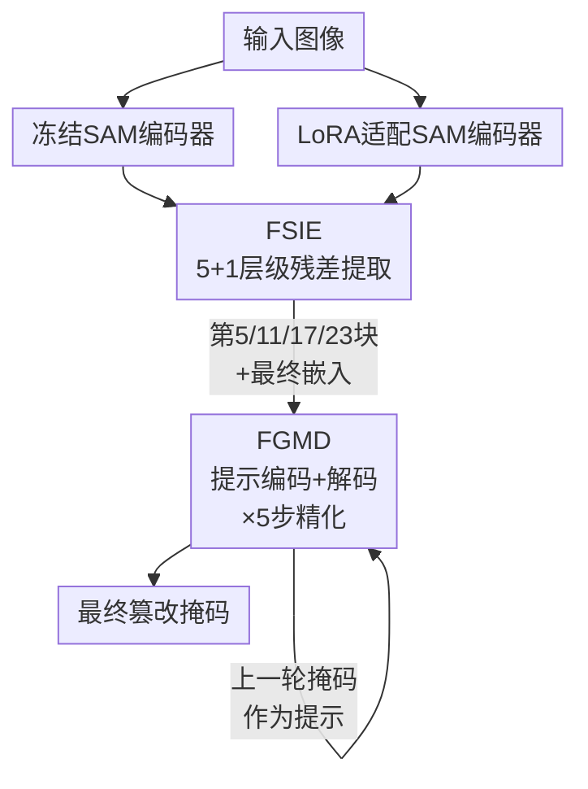

# SARIF: Segment Anything for Robust Image Forensics

**会议**: ECCV 2026  
**arXiv**: [2606.21108](https://arxiv.org/abs/2606.21108)  
**代码**: [https://github.com/...](https://github.com/...)（有）  
**领域**: 语义分割  
**关键词**: 图像取证, 篡改定位, SAM, 双编码器残差, 反馈引导解码

## 一句话总结
SARIF 同时运行一个冻结的原始 SAM 编码器和一个 LoRA 微调编码器，计算两者在各全局注意力层的残差作为篡改特定线索，再与上一轮预测掩码融合成提示、驱动 SAM 原有轻量解码器做 5 步渐进精化，在跨数据集篡改定位上达到了最强的平均性能。

## 研究背景与动机

图像编辑工具和生成模型的普及使得普通人也能轻松制作高逼真度的篡改图片，这对虚假信息识别、司法取证和公共信任构成了严峻挑战。早期的图像取证依赖手工特征（光照不一致、JPEG 压缩伪影、传感器模式噪声等），但止步于图像级检测，面对多样化的篡改类型时泛化能力极差。深度学习兴起后，MantraNet、SPAN 等模型实现了像素级的篡改定位，但计算开销大且表示能力有限；后续的 Transformer 模型（TransForensics、M2SFormer）和注意力机制虽然在效率和精度上有所提升，但在跨域泛化和图像退化（噪声、模糊、JPEG 压缩）下的鲁棒性依然远未令人满意。同时，真实世界的篡改图像来源庞杂——从简单的拼接复制到 AI 生成的内容——这些方法的泛化鸿沟始终是摆在实用化面前的核心瓶颈。

近年 SAM 等视觉基础模型凭借十亿规模掩码标注训练出的强泛化能力，为篡改定位带来了新思路。已有 IMDPrompter、SAMIF、SAFIRE 等工作尝试将 SAM 引入这一任务，但普遍存在两个问题：一是仍然依赖手工提示或网格点（定位偏向物体边界而非篡改痕迹），二是仅取 SAM 的最后嵌入层输出，忽略了中间层级中可能蕴含的不同粒度篡改线索。更深层的问题是，单分支 LoRA 微调虽然参数高效，但无法显式回答"适配器到底学到了什么篡改相关信息"——编码器的输出中语义内容和篡改痕迹纠缠在一起，难以分离。

SARIF 的洞察在于：如果同时运行微调前和微调后的两个副本，两者之间**差异**天然就是"微调所学的增量知识"，比单一特征更容易指向篡改模式。这一想法的灵感来自生物视觉中的"对手通道"机制——视觉系统编码的是相对对比度而非绝对强度。**核心 idea：同时运行冻结和 LoRA 微调两个 SAM 编码器，以逐层的残差特征隔离出适配器学到的篡改线索，再把这些线索与上一轮预测掩码融合成 SAM 提示，驱动轻量解码器做渐进式精化，实现全自动、无需人工提示的篡改定位。**

## 方法详解

### 整体框架

SARIF 的架构包含三条主线：一个完全冻结的原始 SAM 图像编码器、一个插入了 LoRA 适配器进行参数高效微调的编码器副本、以及复用 SAM 自身提示接口的反馈引导解码器。输入图像同时送入两个编码器，得到两组并行特征。在 ViT 的 4 个全局注意力块（第 5、11、17、23 层）和最终嵌入层处，FSIE（篡改特征提取器）逐层计算两组特征之间的残差——这些残差代表了 LoRA 针对篡改任务学到的增量信息。每层的残差特征以层级顺序依次注入 FGMD（反馈引导掩码解码器）：FGMD 将上一轮的预测掩码经 SAM 提示编码器编码为掩码提示，与当前层的篡改特征逐元素相加得到任务提示，再和微调编码器的最终嵌入一起送入 SAM 原版轻量解码器，输出当前轮的更精细预测。这个过程重复 5 步，从粗到细逐步收敛到最终定位掩码。

### 关键设计

**1. 双编码器残差：以微调前后的特征差异隔离篡改线索**

单分支 LoRA 适配器虽然能以极低的参数代价完成领域适应，但它的输出中语义内容和篡改痕迹纠缠在一起，无法分离出"到底哪部分特征是因为篡改任务才被激活的"。SARIF 的解法是将冻结的原始编码器作为参照基线，把微调后的编码器与它逐层做比较——两者的差异天然就是 LoRA 所学的增量知识，比单一特征更直接地指向篡改相关的变化模式。这一设计受生物视觉中"对手通道"（opponent channel）和"中心-环绕"（center-surround）机制的启发：视觉系统编码的是相对对比度而非绝对强度。

具体实现上，FSIE 在每个选中层 t 取出两组特征 O_t（冻结分支）和 F_t（微调分支）。首先计算两者的逐位置余弦相似度图，作为差异的粗粒度度量。然后通过 1×1 卷积将每组特征压缩到更低维度 C' 以减少计算量，再拼接两组压缩特征并对拼接结果施加通道注意力（全局平均池化 + 全局最大池化各接两个 1×1 卷积、求和后过 sigmoid 生成通道权重），以强调差异显著的通道。最后把余弦相似度图与通道加权特征拼接，经一个轻量的 Conv-BN-GeLU 残差块融合成紧凑的篡改特征 T_fs^t。FSIE 在第 5、11、17、23 块和最终嵌入层各输出一组这样的特征，形成从大尺度语义不一致到局部纹理异常的层级线索，为后续精化提供了多粒度的特征输入。

**2. 反馈引导解码：以历史掩码做 SAM 提示驱动的渐进精化**

常规的 SAM 篡改变体往往只做一次性预测，不利用其自身提示接口做迭代精化。SARIF 的设计是：每一轮将上一轮预测的掩码作为 SAM 提示编码器的输入，生成掩码提示（mask prompt），与 FSIE 当前层的篡改特征逐元素相加形成任务提示，再送入 SAM 原版轻量解码器预测当前轮的掩码。

整个过程从初始掩码开始：仅凭微调编码器的最终嵌入、不带任何外部提示时解码器的输出。第 t 轮精化的输入包括：(i) 第 t 个选中的全局注意力块处的 FSIE 输出，(ii) 第 t-1 轮的预测掩码经提示编码后的嵌入。两者相加后与微调编码器的最终嵌入一起输入 SAM 掩码解码器，得到第 t 轮的预测。这个过程沿着 FSIE 的层级顺序依次执行 5 步（第 5 → 第 11 → 第 17 → 第 23 块 → 最终嵌入），每轮的输出都作为下一轮的掩码提示，无需人工干预。实验表明掩码质量随步数稳步提升：在已见域 CASIAv2 上初始 IoU 为 53.3%，经过 5 步精化达到 56.7%；在未见域上同样呈现一致的提升趋势，且越早的步骤增益越明显，后期趋于饱和。此外，每轮的输出都被 BCE 损失监督（deep supervision），这不仅加速了收敛，也保证了精化梯度的稳定传导。

### 损失函数 / 训练策略

SARIF 基于 SAM ViT-L 预训练权重，在选中的全局注意力块处插入 LoRA 适配器（rank=32），训练时仅更新 LoRA 参数和掩码解码器，其余骨干完全冻结。训练使用 CASIAv2 数据集，Adam 优化器（初始学习率 1e-4，余弦退火至 1e-6），批大小 32，100 个 epoch，输入统一缩放至 256×256。损失函数为 6 个阶段（初始+5 步精化）的 BCE 损失之和。

## 实验关键数据

### 主实验

在 CASIAv2 上训练后，在已见域与 7 个未见域上的 DSC 对比（部分代表性方法）：

| 数据集 | SAM | AutoSAM | M2SFormer | SAFIRE | **SARIF** |
|--------|-----|---------|-----------|--------|-----------|
| CASIAv2（已见） | 27.1 | 49.0 | 58.8 | 56.8 | **63.1** |
| CASIAv1（未见） | 33.4 | 45.1 | 58.4 | **61.6** | 58.4 |
| Columbia（未见） | 24.6 | 28.2 | 42.4 | 53.1 | **58.4** |
| CoMoFoD（未见） | 19.7 | 23.8 | 24.9 | 39.5 | **65.4** |
| DIS25k（未见） | 18.7 | 31.4 | 38.5 | **50.7** | 47.8 |
| IMD2020（未见） | 22.3 | 34.0 | 32.6 | **53.1** | 48.4 |
| In the Wild（未见） | 29.6 | 36.5 | 35.0 | **63.3** | 55.7 |
| MISD（未见） | 31.3 | 61.3 | **69.1** | 48.3 | 66.2 |

SARIF 在已见域和 Columbia、CoMoFoD 上取得最佳，CoMoFoD 上的领先尤其显著（+25.9 DSC），整体平均 DSC 最高。在最新挑战性数据集上（CocoGlide 修补和 TGIF AI生成），SARIF 的 DSC 分别达 34.0 和 30.8，全面优于对比方法。

### 消融实验

| 配置 | 已见域 DSC | 未见域平均 DSC | 参数量 | FLOPs |
|------|-----------|---------------|--------|-------|
| 仅SAM（无LoRA/无精化） | 23.6 | 23.3 | 13.90M | 490.65G |
| +LoRA | 41.2 | 33.0 | 34.90M | 503.79G |
| +LoRA+FSIE | 62.4 | 44.7 | 41.04M | 994.88G |
| +LoRA+FGMD | 62.0 | 42.6 | 41.34M | 506.13G |
| **SARIF（完整）** | **63.1** | **57.9** | 52.62M | 998.43G |

### 关键发现

- LoRA 适配器自身即带来大幅提升（已见域 DSC +17.6），说明参数高效微调对跨领域篡改定位是有效的基线。
- FSIE 和 FGMD 单独引入时在未见域上增益相当（+11.7 和 +9.6 DSC），但两者结合后未见域 DSC 从 44.7/42.6 跃升至 57.9（+13.2/+15.3），表明"高质量特征"与"迭代精化"形成了强互补的正反馈循环。
- 在真实图像上的误报率（FPR）为 5.1%，在 SAM 类方法中最低，说明 SARIF 对未篡改区域不会大面积伪激活。
- 精化曲线（Table 8）显示越早的步骤增益越大，后期趋于饱和，实际部署可按需截断以换取速度。

## 亮点与洞察

- **双编码器残差可推广到其他"预训练+微调"范式**：任何需要从微调中分离增量知识的任务（域适应、异常检测、精细分类）都可以复制这一设计——冻结原版作为基线，以残差高亮增量信号。
- **复用而非重写 SAM 的提示接口**：SARIF 没有设计复杂的新解码器，而是把"上一轮掩码反馈为提示"这一极简改动插入了 SAM 自有的架构循环中，改动代价极低但对精度贡献显著。
- **层级线索的粗到细注入**：在第 5→11→17→23→最终层依次注入残差特征，天然形成了从大尺度语义不一致到局部纹理异常的渐进定位路径，比仅用最终嵌入更充分地利用了 SAM 的层级表示。
- **在 CoMoFoD（复制-移动篡改）上的大幅领先**：SARIF 在 CoMoFoD 上 DSC 高达 65.4，远超 SAFIRE 的 39.5 和第二好的 M2SFormer 的 24.9，推测原因是复制-移动篡改中的区域块间相似度会被双编码器残差机制敏锐捕获。

## 局限与展望

- **初始掩码质量是瓶颈**：如果初始掩码定位了错误区域，后续精化会放大这个错误——反馈的优势在错误初始化下反成劣势。可考虑引入置信度验证，在初始掩码置信度低时切换为"重初始化"分支。
- **双编码器推理开销大**：同时运行两个 ViT-L 编码器 + 5 步解码导致 FLOPs 约 998G，推理 47.5ms，是 M2SFormer（2.5ms）的近 20 倍，实时场景受限。
- **阶梯状伪影**：SAM 提示编码器将掩码投影到低分辨率后经转置卷积上采样，产生块状阶梯伪影，影响精细边界；引入可学习的上采样层可能有改善。
- **真实性图像上的弱响应**：在完全未篡改的真实图像上 SARIF 仍会输出稀疏的伪激活，虽然误报率在 SAM 方法中最低（5.1%），但对严格取证应用而言仍需关注。

## 相关工作与启发

- **vs IMDPrompter**: IMDPrompter 学习多视角提示库并用最优选择机制自动生成提示，但需多视角编码器+辅助模块。SARIF 直接从冻结/微调编码器的残差中派生提示，结构更简洁。
- **vs SAFIRE**: SAFIRE 用网格点提示做源区域分割再聚合预测，定位粒度受网格密度约束；SARIF 的连续掩码精化在需要精细边界的场景（如 CoMoFoD）上有明显优势。
- **vs SAMIF**: SAMIF 引入高频分支和 SRM 滤波器强化高频率线索，但仅取 SAM 最终嵌入；SARIF 利用层级残差提供从粗到细特征流，未见域泛化更强。

## 评分

- **新颖性**: ⭐⭐⭐⭐ 双编码器残差+反馈引导精化的组合在图像取证中有清晰的新意，动机从视觉神经科学中获得启发，设计落地干净。
- **实验充分度**: ⭐⭐⭐⭐⭐ 8 数据集（1 已见+7 未见）+ 多种退化条件（噪声/模糊/JPEG/混合）+ 最新挑战性数据集（CocoGlide/TGIF）+ 完整消融 + 伪阳性分析 + 精化阶段分析，实验非常充分。
- **写作质量**: ⭐⭐⭐⭐ 动机链和设计动机阐述清楚，图示辅助理解，但公式部分（通道注意力那一串）略显密集，可进一步精炼。
- **价值**: ⭐⭐⭐⭐ 为 SAM 在取证领域的全自动定位提供了有效方案，双编码器残差的思想可能推广到其他需要从预训练模型中提取增量知识的下游任务。

<!-- RELATED:START -->

## 相关论文

- [\[ICML 2026\] Segment Anything with Robust Uncertainty-Accuracy Correlation](../../ICML2026/segmentation/segment_anything_with_robust_uncertainty-accuracy_correlation.md)
- [\[ICLR 2026\] SAM 3: Segment Anything with Concepts](../../ICLR2026/segmentation/sam_3_segment_anything_with_concepts.md)
- [\[AAAI 2026\] SAQ-SAM: Semantically-Aligned Quantization for Segment Anything Model](../../AAAI2026/segmentation/saq-sam_semantically-aligned_quantization_for_segment_anything_model.md)
- [\[AAAI 2026\] Segment Anything Across Shots: A Method and Benchmark](../../AAAI2026/segmentation/segment_anything_across_shots_a_method_and_benchmark.md)
- [\[AAAI 2026\] Segment and Matte Anything in a Unified Model (SAMA)](../../AAAI2026/segmentation/segment_and_matte_anything_in_a_unified_model.md)

<!-- RELATED:END -->
