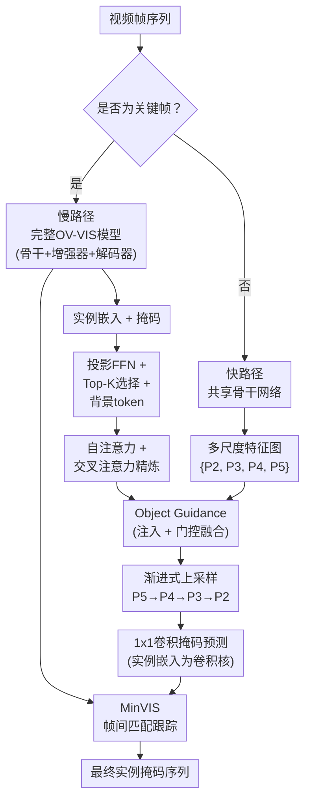

# Segmenting, Fast and Slow: Real-Time Open-Vocabulary Video Instance Segmentation with Dual-Path Processing

**会议**: ECCV 2026  
**arXiv**: [2607.00124](https://arxiv.org/abs/2607.00124)  
**代码**: 待确认  
**领域**: 分割 / 视频实例分割  
**关键词**: 开放词汇视频实例分割, 实时推理, 双路径架构, 移动端部署, 特征空间传播

## 一句话总结

SegFS 提出双路径快慢框架用于开放词汇视频实例分割（OV-VIS），在稀疏关键帧上运行完整的 object-centric 模型提取实例嵌入，然后将嵌入投影回骨干网络特征空间，以轻量级 Fast Feature Aggregator 在中间帧上完成高效的实例重定位与分割，实现了高达 14 倍的端侧延迟降低并首次在移动设备上跨越 30 FPS 实时阈值，同时性能损失控制在 1 AP 以内。

## 研究背景与动机

开放词汇视频实例分割（OV-VIS）要求在视频中持续定位、跟踪和分割由文本提示指定的任意类别的物体实例。当前的主流范式是以 DETR 为代表的 object-centric 架构，典型系统（如 GLEE）由三部分组成：视觉骨干网络（提取多尺度特征）、特征增强器（Feature Enhancer，包含像素解码器和早期文本-视觉融合模块）和物体解码器（Object Decoder，通过可学习 query 与增强后的特征交互输出实例嵌入与掩码）。其中，特征增强器因涉及文本嵌入与多尺度特征之间的密集跨模态交互，成为整条管线中最严重的计算瓶颈。即便近年出现了 MOBIUS（通过选择单尺度进行融合）和 TROY-VIS（将增强器拆解为轻量操作）等移动端优化方案，特征增强器的推理代价依然在端侧设备上占据主导地位（如图 1 的 FLOPs 和端侧延迟分析所示），并且这一瓶颈会随图像分辨率和词汇量增大而急剧恶化。

为解决这一矛盾，现有工作开始利用关键帧的思想：如 MobileInst 在关键帧上运行完整模型后在中间帧上直接复用其物体嵌入，从而免去物体解码器的开销。但这种方案仍需在每一帧上运行特征增强器——它才是真正的计算瓶颈所在。核心矛盾在于：高精度 OV-VIS 需要多模态深度融合来理解开放语义，而移动端实时推理（30 FPS 以上）要求每帧处理时间在 33 ms 以内，二者在现有架构下不可兼得。

本文的关键洞察是：当前帧中用于细粒度定位的空间语义信息已经编码在视觉骨干的多尺度特征图中，不需要每帧都重复运行昂贵的特征增强器。基于此，作者提出了 SegFS——一个双路径框架，将完整的 object-centric 模型（含特征增强器和物体解码器）仅运行在稀疏关键帧上（"慢路径"），提取实例嵌入后将其投影回骨干网络的特征空间，然后用一个极轻量的 Fast Feature Aggregator 在中间帧上（"快路径"）结合当前帧的骨干特征完成实例分割。**核心 idea：将 OV-VIS 中繁重的多模态语义理解与高效的密集掩码预测解耦，通过把实例嵌入从物体解码空间送回骨干特征空间，使快路径在完全不经过特征增强器的情况下，仅用一个轻量聚合模块即完成帧级的实例重定位与分割。**

## 方法详解

### 整体框架

SegFS 的整体架构以一个**双路径的时空交替执行策略**为核心。给定一个视频序列，系统以固定间隔选取关键帧（通常每 6 帧一个关键帧），形成"1 个关键帧 + 5 个中间帧"的传播窗口。

**慢路径**运行在稀疏关键帧上：输入关键帧图像后，一个冻结的 object-centric OV-VIS 模型（可以是 GLEE、MOBIUS 或 TROY-VIS）依次执行骨干网络提取多尺度特征、特征增强器完成文本-视觉融合与多尺度交互、物体解码器生成实例 query 并输出实例嵌入与掩码。这一过程提供了高质量的开集检测与分割结果，但代价高昂。

**快路径**运行在所有中间帧上：每一帧先通过同一个视觉骨干（与慢路径共享权重，同样冻结）提取多尺度特征图 {P2, P3, P4, P5}。这些特征图被投影到统一通道维度后，进入本文设计的 Fast Feature Aggregator——它在最粗的语义层 P5 上通过 Object Guidance 模块注入来自关键帧的实例嵌入，然后逐步上采样并与更细尺度的特征图融合，最终生成高分辨率特征图用于 1x1 卷积预测掩码。

慢路径输出的实例嵌入经过一个 3 层 FFN 投影到骨干特征空间（快路径能理解的特征），然后从中挑选与文本类别相似度最高的 Top-K 个加上一个可学习的背景 token，再经过自注意力与交叉注意力精炼后送入快路径。整条视频的时序关联则复用 MinVIS 的 tracking-by-matching 范式，即通过计算帧间实例嵌入的余弦相似度进行最优二分图匹配。

### 关键设计

**1. 双路径快慢分离：将特征增强器移至稀疏关键帧**

现有 OV-VIS 模型的根本瓶颈在于特征增强器需要在每一帧上执行密集的多尺度跨模态交互，其计算量随词汇量线性增长。SegFS 的核心策略是打破"每一帧都走完三条组件"的定式：把最重的特征增强器和物体解码器限定在稀疏关键帧上（每 6 帧才运行一次），中间帧则完全绕过它们。这个看似简单的"跳过"操作之所以可行，是因为中间帧并不需要从零开始做开集检测——关键帧已经提供了实例的类别信息和初始嵌入。中间帧的任务只是根据当前帧的画面变化（如物体移动、形变、遮挡变化）对已有实例进行**重定位和精修**，而这不需要多模态语义理解。

实现上，慢路径采用一个冻结的预训练 object-centric 模型（GLEE/MOBIUS/TROY-VIS），输出 300 个物体 query。快路径共享同一骨干网络，但骨干网络的输出经过 Fast Feature Aggregator 直接生成掩码。由于骨干网络也是冻结的，快路径实际上没有任何可学习的视觉编码器——所有可学习参数都在轻量聚合器中。这种设计使得快路径的计算量几乎不随骨干网络容量和词汇量变化，具备良好的可扩展性。

**2. Object Guidance：实例语义注入与门控融合**

如何将关键帧提取的实例嵌入高效地馈入当前帧的特征空间，是快路径的核心技术挑战。Object Guidance 模块实现了这一目标，且仅作用在最粗尺度的特征图 P5 上（避免在高分辨率下做开销大的跨模态操作）。

模块分为两步。第一步是**实例注入（Object Injection）**：对 P5 中的每个空间位置，计算其与 K+1 个 token（K 个选中的实例嵌入 + 1 个背景 token）的多头余弦相似度，经可学习温度参数 tau 缩放后沿实例维度做 softmax，得到每个空间位置在各实例上的注意力分布。以这些概率为权重对实例嵌入加权求和，得到"物体感知特征图"I5。当网络学会降低 tau 值时，softmax 分布趋于 sharp，每个空间位置实际上被替换为其语义最匹配的实例嵌入——这相当于在特征空间上做了一个软实例分配。

第二步是**门控融合（Gated Fusion）**：直接使用 I5 的问题在于它仅携带了来自关键帧的粗粒度语义，缺少当前帧的结构细节。因此，先用一个 DSConvGN 模块（深度可分离卷积 + GroupNorm + SiLU）对 I5 做局部平滑，再通过一个门控机制将 I5 与原始的 P5 特征图融合：

$$ \tilde{P}_5 = P_5 + \sigma(\text{GateConv}(P_5 \parallel I_5)) \odot \text{DSConvGN}(I_5) $$

其中 sigma 是 sigmoid 函数，GateConv 预测一个空间混合掩码，控制每个位置应多大程度吸收实例语义信息。这种设计确保网络既保留了 P5 中的精确视觉线索，又吸收了 I5 中的实例语义，且门控是可微的，端到端学习最优混合比例。

**3. 渐进式上采样与轻量特征融合**

得到注入语义的 P5 后，需要逐步恢复至 P2 的高分辨率才能输出精细掩码。为避免在高分辨率上重复做 Object Guidance（那会引入额外开销），SegFS 采用了一个极轻量的渐进式上采样融合方案。核心操作为：将上采样的 P5 与 P4 沿通道维拼接，送入 DSConvGN 块做局部融合与精炼，得到增强的 P4 特征；同样的操作递推至 P3 和 P2。

关键设计决策在于融合算子选择了 DSConvGN——一个由 3x3 深度可分离卷积、1x1 逐点卷积、GroupNorm 和 SiLU 激活组成的轻量模块。这一设计确保了整个 Fast Feature Aggregator 的计算量基本恒定（约 10.1 GFLOPs，不受骨干网络和词汇量影响），且推理延迟极低（MobileNetV4-CM 变体在 S25 Ultra 上仅 8.3 ms）。

最终，P2 分辨率的高分辨率特征图经过一个 1x1 卷积输出掩码 logits，其中关键帧实例嵌入充当该卷积的卷积核——每一组卷积核对应一个实例的掩码激活图。这种方式天然地将实例嵌入的语义信息转化为空间分割信号，避免了额外的分类头。

### 损失函数 / 训练策略

SegFS 完全基于图像级实例分割数据集训练，无需视频 GT。训练时，同一张图像依次经过慢路径和快路径。慢路径（冻结）正常前向传播，输出类别 logits、边界框预测和物体 query。query 被投影到快特征空间后送入快路径。匈牙利匹配使用混合匹配代价：类别 logits 和边界框来自慢路径，掩码预测来自快路径。一旦完成最优分配，快路径用 Mask Loss 和 DICE Loss 进行监督。训练使用 AdamW 优化器，学习率 1e-4，权重衰减 0.05（40 万次迭代后增至 0.1），4 张 A100 GPU 上 batch size 128 训练 50 万次迭代，多尺度训练（短边 320-640 像素）。

## 实验关键数据

### 主实验

SegFS 以 GLEE、MOBIUS（MNv4-CM/CL、ResNet50）和 TROY-VIS 共 5 个不同的 OV-VIS 模型作为冻结慢网络进行评测，在 YouTubeVIS19、OVIS、BURST、LV-VIS 四个数据集上与 Copy、Reuse Objects、LiteFlowNet2、RAFT 和 MPVSS 等传播策略对比。以下以 MOBIUS-MNv4-CM 为慢网络的配置展示（AP 指标，FPS 在 S25 Ultra 上以 6 帧滑动窗口的摊销值测算）：

| 数据集 | 指标 | Full Model (上界) | Reuse Objects | MPVSS | SegFS (ours) | SegFS FPS |
|--------|------|-|-|-|-|-|
| YouTubeVIS19 | AP | 48.7 | 42.1 | 39.8 | **41.6** | 38.2 |
| OVIS | AP | 23.6 | 15.0 | 13.9 | **14.1** | 38.2 |
| BURST | HOTA | 40.1 | 30.6 | 28.4 | **30.3** | 38.2 |
| LV-VIS | AP | 16.7 | 15.8 | 14.8 | **15.2** | 38.2 |

在全部 5 种慢网络配置下，SegFS 是唯一跨越 30 FPS 实时阈值的传播方法（MOBIUS-MNv4-CM 配置达 38.2 FPS）。性能与 Reuse Objects 基线非常接近（差距 -0.5~-5.4 AP），但 FPS 提升 2-3 倍。

### 消融实验

基于 MOBIUS-Mini-M 在 YouTubeVIS19 上的逐组件消融（训练 100k 迭代）：

| 配置 | 注入 | 背景token | 注意力精炼 | 平滑 | YTVIS19 AP | OVIS AP |
|------|------|-----------|-----------|------|-----------|---------|
| 基线 | ✗ | ✗ | ✗ | ✗ | 37.9 | 10.7 |
| +注入 | ✓ | ✗ | ✗ | ✗ | 39.6 | 12.5 |
| +背景token | ✓ | ✓ | ✗ | ✗ | 39.6 | 12.8 |
| +注意力精炼 | ✓ | ✓ | ✓ | ✗ | 40.2 | 13.6 |
| +平滑 | ✓ | ✓ | ✓ | ✓ | **40.9** | **13.7** |

### 关键发现

- **注入模块贡献最大**：仅加入 Object Injection 就让 AP 从 37.9 提升到 39.6（+1.7 AP），说明将实例语义注入特征空间是快路径生效的必要条件。注意力精炼（+0.6 AP）和平滑（+0.7 AP）也带来持续增益，背景 token 的贡献较小（+0.3 AP on OVIS 但 YTVIS19 无变化）。
- **传播间隔鲁棒性**：如图 5 所示，SegFS 和 MPVSS 等传播语义嵌入的方法在传播间隔 T 从 1 增加到 10 时性能退化非常平缓，而基于像素掩码扭曲的 Copy/RAFT/LiteFlowNet2 则急剧下降。这证明"传递语义嵌入 + 基于当前帧特征重定位"比"传递像素掩码"鲁棒得多。
- **端侧延迟优势显著**：SegFS-MNv4-CM 在 S25 Ultra 上仅需 8.3 ms/帧，比 MOBIUS 的 115.7 ms 快 14 倍，且延迟几乎不随词汇量增加（词汇量从 40 增至 1196 时，特征增强器延迟大幅增长，而 SegFS 快路径保持恒定）。
- **Top-K 敏感度**：K=50 时 AP 达到峰值，继续增加至 K=100 时 AP 反而略有下降——说明过多的实例嵌入反而成为噪声干扰 P5 特征，且计算量仅从 0.324 微增至 0.444 ms，开销仍可忽略。

## 亮点与洞察

- **"特征空间传播"替代"像素空间传播"**：大多数时序传播方法（光流扭曲、mask warping）在像素空间操作，误差会随帧数累积。SegFS 的意义在于将传播从像素层面提升到特征层面——携带的是"这个物体长什么样"的语义表示而非"这个物体的像素在哪"，后者天然对形变和遮挡更鲁棒。
- **巧妙的 Kernel 复用设计**：1x1 卷积阶段直接使用关键帧实例嵌入作为卷积核，相当于从 mask 预测的层面实现了"实例特异性解码"——不同的实例使用不同的卷积核解码其掩码，无需单独的分类头或实例头。
- **温度 tau 的自适应 sharpening**：可学习温度参数让 softmax 注意力在训练过程中从均匀分布自动趋向于"每个空间位置归入唯一实例"的硬分配，不需要显式的监督信号来引导实例-空间对应关系，属于优雅的隐式学习机制。
- **词汇量大召回的天然优势**：由于快路径完全不涉及文本-视觉交叉注意力，其计算量与类别数量解耦。在处理 LV-VIS（1196 类）这类大词汇量场景时，SegFS 的加速比反而从 14x 进一步提升至 16x。
- **纯图像训练**：无需视频级标注即可学习帧间传播能力，大幅降低了训练数据门槛——训练时每张图被视为"关键帧+当前帧"的组合来模拟视频场景。

## 局限与展望

- **依赖慢网络质量**：快路径的性能有上界——它严重依赖于慢网络在关键帧上检测和提取实例嵌入的质量。如果关键帧上漏检或误检，错误会直接传播到后续帧。实际部署中可能需要引入重检测机制来发现新出现的实例。
- **快路径不感知新物体**：快路径设计上只传播已有的实例嵌入，无法在中间帧发现并分割新出现的物体（直到下一个关键帧）。在需要实时捕获新物体的场景（如监控、自动驾驶）中，关键帧间隔需要合理设置以平衡计算与召回。
- **传播窗口长度限制**：实验显示 T=5-6 是效果与开销的 sweet spot，但 T 大于 10 时 AP 明显下降。实际应用中，视频内容变化剧烈（快速运动、频繁进入/退出场景）可能需要更短的关键帧间隔，这会抵消一部分效率优势。
- **光流方法在某些场景仍具优势**：对于非常剧烈的非刚性形变（例如视频中的人弯腰、跳跃），基于特征注入的"粗定位+精修"策略不如逐像素光流扭曲来得精确——SegFS 在 OVIS 这种高遮挡数据集上相比 Reuse Objects 基线有 AP 下降（-0.8~-4.6），说明传播本身仍有信息损失。
- **跨模态泛化边界**：论文聚焦于用文本类别引导的分割实例。对于更细粒度的指令（如指代分割中的"左边的那个穿红衣服的人"的表达理解），慢网络能否产出足够好的实例嵌入来指导快路径尚未验证。

## 相关工作与启发

- **vs MobileInst / TROY-VIS**: 它们仅复用物体解码器的输出（即跳过了物体解码器但保留了特征增强器），SegFS 更进一步跳过了特征增强器，将传播粒度从"实例嵌入"升级为"特征空间条件化"，实现了更大的加速。
- **vs MPVSS**: MPVSS 基于光流条件化预测实例级运动场来扭曲掩码，在像素空间操作。SegFS 在特征空间操作，不需要显式光流估计，因此更快且对运动剧烈/边界出现的物体更鲁棒。但 MPVSS 在闭集场景下的传播精度可能更高，因为它用运动场逐像素对齐。
- **vs SAM2 / MobileSAMv2**: SAM2 采用 mask propagation + memory bank 的范式，需要维护长程记忆。SegFS 的设计更接近传统 DETR 范式的延伸，不需要记忆存储，但也不能像 SAM2 那样接受用户点击/框来指定任意位置的分割。
- **vs MinVIS**: MinVIS 证明了 DETR 的实例嵌入在帧间具有判别性，可以直接进行匹配跟踪。SegFS 将其思想深化：不仅实例嵌入跨帧稳定，其投影回特征空间后仍能有效条件化特征图，这是一个更强的结论。

## 评分

- **新颖性**: ⭐⭐⭐⭐ 双路径快慢分离的思路在视频理解中并不完全全新，但将其应用于 OV-VIS 并设计 Object Guidance 在特征空间传播实例语义是一套优雅的系统级创新，尤其"绕过特征增强器"这一决策切中要害。
- **实验充分度**: ⭐⭐⭐⭐⭐ 在 4 个数据集上与 5 个不同的慢网络 + 6 个传播基线进行了详尽对比，消融实验覆盖了每个组件，效率分析跨 4 个端侧设备 + 2 个 GPU，还分析了不同 K 和 T 的敏感度，实验面面俱到。
- **写作质量**: ⭐⭐⭐⭐ 动机清晰、方法介绍层层递进、实验设计合理。缺点在于 Tables 1/2 信息过密（表格跨越 300 行，可读性一般），有些关键图表号引用顺序可以优化。
- **价值**: ⭐⭐⭐⭐⭐ 实现了移动端 OV-VIS 30 FPS 实时的突破，为边缘部署提供了切实可行的工程范式。方法简洁（快路径仅 10.4M 参数、10.1 GFLOPs），易复现，有很高的实际应用价值。

<!-- RELATED:START -->

## 相关论文

- [\[CVPR 2026\] MARIS: Marine Open-Vocabulary Instance Segmentation](../../CVPR2026/segmentation/maris_marine_open-vocabulary_instance_segmentation.md)
- [\[CVPR 2026\] PixDLM: A Dual-Path Multimodal Language Model for UAV Reasoning Segmentation](../../CVPR2026/segmentation/pixdlm_uav_reasoning_segmentation.md)
- [\[CVPR 2026\] Test-Time Multi-Prompt Adaptation for Open-Vocabulary Remote Sensing Image Segmentation](../../CVPR2026/segmentation/test-time_multi-prompt_adaptation_for_open-vocabulary_remote_sensing_image_segme.md)
- [\[CVPR 2026\] RobotSeg: A Model and Dataset for Segmenting Robots in Image and Video](../../CVPR2026/segmentation/robotseg_a_model_and_dataset_for_segmenting_robots_in_image_and_video.md)
- [\[CVPR 2025\] Golden Cudgel Network for Real-Time Semantic Segmentation](../../CVPR2025/segmentation/golden_cudgel_network_for_real-time_semantic_segmentation.md)

<!-- RELATED:END -->
