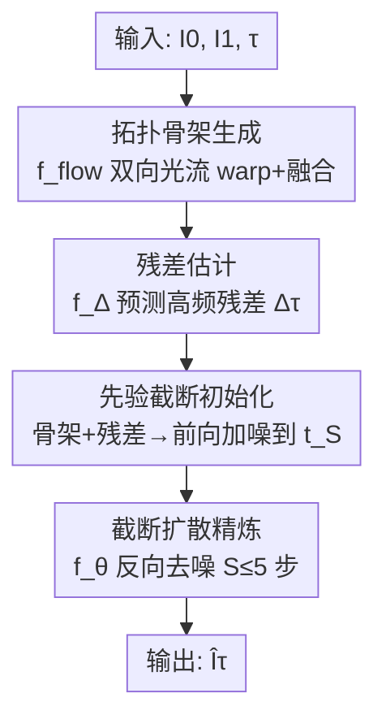

# SkelEM: Training-Signal Decoupling of Skeleton and Diffusion for Self-supervised Axial Super-Resolution in Volume Microscopy

**会议**: ECCV 2026  
**arXiv**: [2606.30012](https://arxiv.org/abs/2606.30012)  
**代码**: 无  
**领域**: 医学图像  
**关键词**: 轴向超分辨率, 体电子显微学, 训练信号解耦, 截断扩散, 自监督学习

## 一句话总结
SkelEM 提出一种自监督轴向超分辨率框架，通过将拓扑骨架网络与扩散精炼器的训练信号完全解耦（无共享梯度），以冻结的确定性骨架锚定结构拓扑、再用截断扩散在不超过 5 步内恢复高频生物纹理，在保真度-感知质量-推理速度的三难困境中取得自监督方法中最优的平衡，并在膜分割下游任务上达到 SOTA。

## 研究背景与动机

**领域现状**：体电子显微学（VEM）和体光学显微学（VLM）能够对细胞器和组织架构进行三维成像，但受限于物理切片或光学物理，轴向（Z 方向）分辨率远低于横向（XY）分辨率——例如 SBF-SEM 横向 4-10 nm、轴向仅 25-40 nm。由于各向同性真值极难获取，领域已从有监督方法转向自监督轴向超分辨率（ASR），主流范式有三类：基于正交平面 2D 超分、基于视频插帧、基于 XY 平面训练的 2D 扩散模型做 3D 精炼。

**现有痛点**：现有自监督 ASR 方法面临一个根本性的三难困境（trilemma）。基于回归的 3D 卷积网络（如 D2R-AENet）受像素级 L1/L2 损失约束，不可避免地向均值回归，产生过度平滑的体积；纯扩散模型能合成高频细节，但代价是结构幻觉（hallucination）和极高的推理延迟（单 patch 数百到数千步去噪）；视频插帧方法依赖自然视频预训练，难以适应生物超微结构的非线性形变，导致轴向不连续。

**核心矛盾**：作者将过平滑和幻觉两种失败模式归因于同一个根因——缺少一个忠实的、域自适应的结构骨架（structural skeleton）来捕捉生物超微结构的高度非线性形变。没有这样的骨架，回归模型只能"糊掉"高频纹理以求低损失，生成模型则在缺乏拓扑约束时"编造"结构。同时，截断扩散理论上可以通过从有信息先验出发来加速推理，但先验的质量直接决定了截断的有效性——没有可靠的结构锚点，截断只是把幻觉问题前移而非解决。

**本文目标**：设计一个自监督 ASR 框架，同时满足三个目标——（1）保持三维结构连续性（不产生轴向伪影），（2）恢复逼真的高频生物纹理（不过平滑），（3）推理速度快到可在百 GB 级生物体积上实际部署。

**切入角度**：作者观察到，如果能把低频拓扑的构建和高频纹理的生成这两个子任务在"训练信号层面"彻底分离——不让纹理生成阶段的梯度回流到拓扑网络——就可以让每个子网络专注解决自己擅长的问题。拓扑网络只需保证空间连续性，扩散精炼器只需补全纹理，而一个轻量残差估计器在两者之间建立物理上可信的桥梁。

**核心 idea**：用训练信号解耦（training-signal decoupling）代替端到端或级联训练——冻结的拓扑骨架网络 + 经稀疏真实切片双向自对齐的扩散精炼器 + 基于循环一致残差的截断采样，在不超过 5 步扩散内完成高保真轴向超分重建。

## 方法详解

### 整体框架

SkelEM 是一个两阶段、三轮训练的自监督 ASR 框架。输入为各向异性体积 V_low（d 张稀疏轴向切片），目标是重建各向同性高分辨率体积 V_high（d_hat = (d-1)*r+1 张切片，r 为上采样倍率，默认 r=8）。对于任意一对相邻真实切片 I_0 和 I_1，需要在相对位置 τ 处合成缺失的中间切片 Î_τ。

框架核心设计是将 ASR 任务在训练信号层面解耦为两个互不重叠的优化目标：拓扑骨架网络 f_flow 只负责从边界切片通过光流 warp 出确定性的低频骨架，训练后冻结、梯度永不流入后续阶段；扩散精炼器 f_θ 只负责在骨架基础上恢复高频生物纹理，通过合成流形预训练和真实稀疏切片自对齐两个阶段独立优化；一个轻量残差估计器 f_Δ 作为桥梁，在真实切片上通过循环一致重建提取高频残差先验，使截断扩散可以在仅 S 步（S <= 5）内完成精炼。

### 关键设计

**1. 拓扑骨架与合成流形预训练：用域内伪 HR 体积训练光流网络并丢弃细节精炼器，强制拓扑-纹理分离**

针对生物超微结构在轴向大间隙下的非线性形变问题——自然视频预训练的光流模型（如 RIFE、InterpolAI）无法捕捉生物组织的复杂运动模式。作者采用 D2R-AENet 生成的伪高分辨率体积 V_hat_high 作为训练数据，在其上训练 RIFE 的中间流网络 IFNet 作为拓扑网络 f_flow。给定相邻真实切片 I_0、I_1 和相对位置 τ，f_flow 预测双向光流 F_{τ→0}、F_{τ→1} 及融合掩码 M_τ，通过反向 warp 合成结构骨架：

$$ \hat{I}^{(skel)}_{\tau} = M_{\tau} \odot \mathcal{W}(I_0, F_{\tau \rightarrow 0}) + (1 - M_{\tau}) \odot \mathcal{W}(I_1, F_{\tau \rightarrow 1}) $$

关键设计选择是：训练完成后**故意丢弃** RIFE 的细节精炼器（detail refiner）并将 f_flow 冻结。原因在于 V_hat_high 本身包含跨平面伪影，如果保留细节精炼器，这些合成伪影会泄漏到骨架中，破坏拓扑-纹理分离原则。此举强制 f_flow 只输出确定性的低频拓扑锚点，为后续扩散精炼提供了不含合成偏置的干净结构基础。

**2. 扩散精炼器与稀疏自对齐：合成流形预训练建立生成先验，再通过双向循环在真实切片上去偏置**

骨架 I_hat_τ^(skel) 缺少物理切片过程中丢失的高频生物纹理。为此引入扩散精炼器 f_θ，以边界切片 I_0、I_1 和位置 τ 为条件，通过标准扩散目标在 V_hat_high 上进行基础训练（L_base，标准的噪声预测 MSE 损失）。但仅靠合成数据训练的精炼器会继承 V_hat_high 的跨平面伪影。

为解决此问题，作者提出**双向稀疏自对齐**（sparse self-alignment）：直接在 V_low 的真实稀疏切片上微调 f_θ。取三张连续真实切片 {I_{-1}, I_0, I_1}，用当前精炼器合成两个中间锚点 Î_{τ-1}（在 I_{-1} 和 I_0 之间）和 Î_τ（在 I_0 和 I_1 之间）。然后通过双向条件组合 Φ = {(Î_{τ-1}, Î_τ, 1-τ), (Î_τ, Î_{τ-1}, τ)}，要求 f_θ 从两个方向都能一致地重建中心观测切片 I_0：

$$ \mathcal{L}_{adapt} = \sum_{\phi \in \Phi} \mathbb{E}_{\epsilon, I_0, t} \left[ \| \epsilon - f_{\theta}(x_t, t, \phi) \|_2^2 \right] $$

此设计的精巧之处在于：合成锚点 Î_{τ-1} 和 Î_τ 的梯度被阻断（detached），不作为优化变量，仅作为固定条件输入。这强制 f_θ 从真实数据中学习去偏置，而非简单复制合成锚点的特征。直观上，一个方向无关（direction-agnostic）的精炼器应当无论从哪个方向合成，都能一致地重建 I_0——这一对称性约束既消除了合成偏置，又增强了拓扑一致性。

**3. 先验截断采样：循环一致残差提取将真实域高频线索注入扩散起点，使 S 步精炼即可收敛**

标准扩散需要从纯高斯噪声出发经数百步去噪，对百 GB 级生物体积完全不实用。SkelEM 的解决方案是：利用冻结的 f_flow 在真实切片序列上做循环一致重建，提取物理上可信的高频残差先验，将其直接注入扩散的初始状态，大幅截断去噪轨迹。

具体而言，在 {I_{-1}, I_0, I_1} 上，通过 f_flow 在对称拓扑位置合成两个虚拟锚点 I_{-τ} 和 I_{1-τ}，再通过循环 warp 重建 I_0——其与真实 I_0 的差值 Δ_gt = I_0 - Î_0 精确隔离了非线性 warp 过程中丢失的高频细节。一个轻量残差估计器 f_Δ（ResNet-9）通过频域 L1 损失从骨架上学习预测此残差：

$$ \mathcal{L}_{freq} = \| \mathcal{F}_{fft}(f_{\Delta}(\hat{I}^{(skel)}_{\tau})) - \mathcal{F}_{fft}(\Delta_{gt}) \|_1 $$

推理时，对于目标切片，先得到确定性骨架 I_hat_τ^(skel) 和预测残差 Δ_τ，合并为像素空间先验 I_hat_τ^(prior) = I_hat_τ^(skel) + Δ_τ，然后将扩散轨迹截断到中间时间步 t_S（S << T），通过前向加噪公式初始化：

$$ x_{t_S} = \sqrt{\bar{\alpha}_{t_S}} (\hat{I}^{(skel)}_{\tau} + \Delta_{\tau}) + \sqrt{1 - \bar{\alpha}_{t_S}} \epsilon $$

随后在 f_θ 上执行仅 S 步（论文默认 S=3）的 DDPM 反向采样。这一步的价值在于：骨架提供了确定性的结构锚点，残差注入了从真实域提取的高频线索，扩散只需做少量随机精炼即可产生逼真纹理，而非从头"幻想"整个切片。

### 一个完整示例

以 EPFL 数据集上 r=8 的推理为例。输入为 V_low 中三张连续切片 {I_{-1}, I_0, I_1}，目标是在 I_0 和 I_1 之间 τ=0.5 处合成中间切片。

1. **骨架生成**：f_flow 输入 (I_0, I_1, τ=0.5)，预测双向光流和融合掩码，warp 出骨架 I_hat_0.5^(skel)。此时切片具有正确的低频拓扑（膜结构位置、细胞器轮廓），但纹理平滑、缺乏真实电子显微图像的颗粒感。
2. **残差估计**：f_Δ 输入 I_hat_0.5^(skel)，预测像素空间残差 Δ_0.5，补充 warp 过程中丢失的高频细节（如膜边界的锐利纹理）。
3. **先验初始化**：合并 I_hat_0.5^(prior) = 骨架 + 残差（λ=1.0），从 1000 步 DDPM 调度中取 t_S=300（对应 S=3 步反向），按式 (6) 前向加噪得到初始潜变量 x_300。此时 x_300 中包含约 70% 的先验信号和 30% 的噪声。
4. **三步精炼**：f_θ 以 (I_0, I_1, τ=0.5) 为条件，从 x_300 → x_200 → x_100 → x_0 执行 3 步 DDPM 反向去噪。每步预测干净状态 x̂_0，再按标准 DDPM 后验采样下一步潜变量。最终 x_0 = Î_0.5，耗时约 151ms（单 RTX 4090，256x256 patch）。
5. **结果**：与纯骨架（PSNR 高但模糊）相比，3 步精炼在 XZ/YZ 视图的 LPIPS 从 0.52 降至 0.32，膜边界纹理清晰；与纯扩散从头生成（数百步且结构不可靠）相比，骨架锚定保证了膜结构的拓扑完整性，不会出现断裂或虚假连接。

### 损失函数 / 训练策略

三个训练阶段各自独立优化，无共享梯度：

- **阶段 1（拓扑骨架）**：在 V_hat_high 上用 L1 损失训练 f_flow 300 epoch，丢弃 detail refiner 后冻结。约 12 GPU 小时。
- **阶段 2（残差估计器）**：在 V_low 真实切片上用频域 L1 损失 L_freq 训练 f_Δ 5 epoch。关键是 Δ_gt 来自循环一致重建，确保残差在物理上是真实域的高频成分而非合成伪影。
- **阶段 3（扩散精炼器）**：两阶段训练。(a) 在 V_hat_high 上用标准扩散噪声预测 MSE（L_base）预训练 880 epoch，建立生成先验；(b) 在 V_low 真实切片上用双向自对齐损失 L_adapt 微调 20 epoch，消除合成偏置。合成锚点 Î_{τ-1} 和 Î_τ 在 L_adapt 优化时梯度被阻断（detached），防止错误的锚点信号误导精炼器。

所有网络在 256x256 patch 上训练，Adam 优化器（β1=0.9, β2=0.99），两块 RTX 4090 约 72 小时完成全流程。推理时采用 λ=1.0、S=3 的默认配置，单 patch 151ms。

## 实验关键数据

### 主实验

FIB-25 和 EPFL 数据集上 r=8 轴向超分的主结果对比如下。SkelEM 在自监督方法中取得最好的感知质量（XZ/YZ 视图 LPIPS 均为最优）和极具竞争力的保真度，并在综合排名得分 s̄=0.92 上领先第二名 D2R-AENet（s̄=0.76）0.16。

| 数据集 | 方法 | 3D-PSNR ↑ | SSIM XY ↑ | LPIPS XZ ↓ | LPIPS YZ ↓ | 类型 |
|--------|------|-----------|-----------|------------|------------|------|
| FIB-25 | Bicubic | 25.33 | 0.6528 | 0.5881 | 0.5971 | 自监督 |
| FIB-25 | D2R-AENet | **27.62** | **0.7373** | 0.4136 | 0.4246 | 自监督 |
| FIB-25 | Lee et al. | 26.18 | 0.6607 | 0.3862 | 0.3760 | 自监督 |
| FIB-25 | vEMDiffuse-a | 23.51 | 0.5699 | 0.4260 | 0.4466 | 自监督 |
| FIB-25 | InterpolAI | 24.27 | 0.6140 | 0.5535 | 0.5819 | 自监督 |
| FIB-25 | **SkelEM** | 26.24 | 0.6765 | **0.3658** | **0.3687** | 自监督 |
| EPFL | Bicubic | 23.09 | 0.4938 | 0.6794 | 0.6674 | 自监督 |
| EPFL | D2R-AENet | **26.35** | **0.6387** | 0.4788 | 0.4795 | 自监督 |
| EPFL | Lee et al. | 24.99 | 0.5593 | 0.3327 | 0.3431 | 自监督 |
| EPFL | vEMDiffuse-a | 22.98 | 0.4879 | 0.4269 | 0.4060 | 自监督 |
| EPFL | InterpolAI | 23.67 | 0.5116 | 0.5727 | 0.5861 | 自监督 |
| EPFL | **SkelEM** | 25.56 | 0.6192 | **0.3213** | **0.3298** | 自监督 |

BRAVE-ASR 零样本跨仪器迁移实验（EPFL 训练、BRAVE-ASR 直接测试）进一步验证了泛化性，SkelEM 在 XZ/YZ 视图 LPIPS 上同样取得最佳（0.3203 / 0.3093），且是唯一一个在全部 25 个评估指标上没有灾难性失败的方法。

下游膜分割任务中，SkelEM 在 F1 Score（0.8643）、IoU（0.7611）、ARE（0.2129）、VoI（0.4811）四项指标上全部 SOTA，甚至超过两个有监督基线（SRUNet 和 vEMDiffuse-i）。值得注意的是，SkelEM 在 PSNR/SSIM 上并非第一（D2R-AENet 保真度最高），但在分割精度上全面领先，说明像素级保真度指标不足以评估下游结构分析的质量。

### 消融实验

在 EPFL 数据集上沿三个轴消融（见表）：两阶段设计的必要性、骨架先验的质量、稀疏数据自对齐的效果。

| 消融维度 | 配置 | 3D-PSNR ↑ | LPIPS XZ ↓ | 关键结论 |
|----------|------|-----------|------------|----------|
| 骨架独立 | Skeleton only | 25.96 | 0.5171 | 保真度最高但严重过平滑 |
| 精炼器独立 | Refiner only (无适配) | 22.43 | 0.4390 | 保真度崩塌，无结构引导 |
| 精炼器独立 | Refiner only (有适配) | 20.26 | 0.5952 | 适配不能替代结构锚点，错误锚点反噬 |
| 骨架来源 | Bilinear 插值 | 22.55 | 0.4071 | 无结构先验，全面退化 |
| 骨架来源 | RIFE 自然视频预训练 | 25.19 | 0.3542 | 自然视频先验部分有效但不如域内重训 |
| 骨架来源 | InterpolAI 预训练 | 24.78 | 0.3406 | 同上 |
| 自对齐方法 | 无适配 | 25.94 | 0.3976 | 保真度高但感知差（复制平滑纹理） |
| 自对齐方法 | Sparse3Diff 适配 | 25.59 | 0.3640 | 恢复部分感知质量但不如此文 L_adapt |
| 自对齐方法 | SkelEM L_adapt | 25.56 | **0.3213** | 极小的保真度代价换最大感知提升 |

残差注入强度 λ 和精炼步数 S 的联合消融（Tab. 5）揭示了一个有趣的非单调规律：S=1 时 λ=1.0 效果最好（残差提供关键结构信息），但无论 λ 取何值，1 步无法消除回归偏置导致感知差；S=3 时对 λ 的敏感度大幅降低，λ=1.0 达到保真度-感知的最优平衡；S=5 时保真度反略微退化，说明过度扩散稀释了结构先验。默认配置 λ=1.0, S=3，单 patch 推理 151ms，比其他扩散方法快一个数量级以上（vEMDiffuse-a 约 2071ms，TPDM 约 402788ms）。

### 关键发现

- **骨架是使能条件而非锦上添花**：Refiner only 配置在有/无适配下都崩溃，证明没有可靠的结构锚点，扩散模型无法自监督地学习拓扑一致的重建——这与截断扩散文献中"有好先验才有效"的理论一致。
- **域内重训骨架是必要的**：自然视频预训练的 RIFE 和 InterpolAI 都明显弱于在伪 HR 体积上重训的骨架，因为生物超微结构的非线性形变（膜融合、消失、分叉）与自然视频的刚性运动有本质差异。
- **双向自对齐优于单向**：与 Sparse3Diff 的单向约束相比，SkelEM 的双向循环自对齐在所有视图的 LPIPS 上都有显著提升，证明方向对称性是一个有效的归纳偏置。
- **S=3 是甜点**：1 步不够去偏置，5 步过扩散稀释先验，3 步恰好在去偏置和保结构之间取得平衡。

## 亮点与洞察

- **训练信号解耦是一个可迁移的设计范式**：将低频拓扑和高频纹理分配给两个"互不知晓"的网络（无共享梯度、骨架冻结），让回归网络专注空间连续性、让扩散模型专注纹理生成，避免了端到端训练中的目标冲突。这一思路不仅适用于 ASR，也适用于任何需要同时保证结构一致性和纹理逼真度的图像恢复任务（如视频超分、医学图像重建）。
- **丢弃细节精炼器是反直觉但关键的操作**：标准 VFI 流程中细节精炼器是提升 PSNR 的核心组件，但 SkelEM 故意丢弃它——因为伪 HR 体积的合成偏置会通过精炼器泄漏到骨架中。这种"为分离而丢弃有用模块"的设计决策体现了对问题本质的深刻理解。
- **循环一致重建同时服务于两个目标**：同一个循环一致机制（在 {I_{-1}, I_0, I_1} 上 warp 再重建 I_0）既为残差估计器提供了真实域的高频真值（Δ_gt），又为扩散精炼器的双向自对齐提供了对称约束的条件对——一石二鸟的设计非常优雅。
- **频域损失的选择有针对性**：残差估计器用 FFT 域的 L1 损失而非像素空间损失，直接监督高频成分的恢复质量，与扩散精炼器的分工（低频由骨架保证、高频由残差补充）完美契合。

## 局限与展望

- **纳米级双膜结构模糊化**：作者在附录中承认，SkelEM 在 r=8 这样的大上采样因子下倾向于模糊双膜结构之间的纳米间隙。根因在于骨架网络在生物数据上训练时学到了"组织可能合并或消失"的先验，面对大间隙高不确定性时倾向于预测概率性连接；而 InterpolAI 因自然视频的刚性运动先验反而能保持更清晰的几何分离。一个具体改进方向：用自然视频 VFI 模型初始化骨架网络再在域内微调，继承其强几何边界保持先验同时适配生物非线性形变。
- **依赖伪 HR 体积的质量**：骨架网络和扩散精炼器的预训练都依赖 D2R-AENet 生成的 V_hat_high，如果伪 HR 体积本身存在系统性偏置（如跨平面伪影），骨架质量也会受影响。虽然丢弃细节精炼器和自对齐机制部分缓解了此问题，但完全消除此依赖可能需要在更物理的模拟数据或合成数据上训练。
- **VLM 上的定量评估不充分**：虽然展示了斑马鱼视网膜的定性结果和 CSBDeep 鼠肝的 r=8 定量结果，但 VLM 的模态多样性（共聚焦、双光子、光片等）远超 VEM，SkelEM 在更多 VLM 模态上的表现有待验证。
- **无法处理 slice 内的各向异性**：当前方法仅处理轴向切片间的插值，假设横向分辨率已足够高。对于某些横向分辨率也不足的场景（如低倍光镜），需要联合考虑 XY 和 Z 两个方向的超分。

## 相关工作与启发

- **vs D2R-AENet**：同为自监督 ASR 方法，D2R-AENet 通过像素级约束在保真度指标上最强，但本质上是一个回归网络，输出不可避免过平滑。SkelEM 保留了 D2R-AENet 生成的伪 HR 体积作为训练数据，但将"保结构"和"生纹理"分离到两个网络，用扩散的随机采样打破回归的确定性平滑。两者的关系是互补而非对抗——D2R-AENet 证明了伪 HR 体积的有效性，SkelEM 则在此基础上解决了其感知质量不足的问题。
- **vs 扩散 ASR 方法（Lee et al. / vEMDiffuse / DiffuseIR / TPDM）**：这些方法要么完全依赖扩散从噪声生成（导致结构幻觉和数秒级延迟），要么在级联框架中让回归和扩散共享监督信号（导致合成偏置泄漏）。SkelEM 的核心区别在于训练信号的彻底解耦——骨架从不接收扩散阶段的梯度——以及由此实现的截断扩散（≤5 步 vs 数百到数千步）。推理速度的提升（151ms vs 2000-400000ms）使方法从学术 demo 变为实际可用工具。
- **vs InterpolAI**：作为基于视频插帧的 ASR 方法，InterpolAI 展示了自然视频预训练在 ASR 上的潜力，但其底层假设（场景连续性、物体刚性）在生物超微结构中不成立。SkelEM 借鉴了光流 warp 的骨架思想，但通过域内重训和显式丢弃细节精炼器，实现了更好的生物域适配和拓扑-纹理分离。
- **截断扩散（SDEdit / truncated diffusion）的启发性应用**：截断扩散的原始思想是用部分加噪的引导图像初始化去噪过程以加速生成，其有效性高度依赖初始化质量。SkelEM 的贡献在于提供了一个获得高质量初始化的具体方案——循环一致残差从真实数据中提取高频线索，而非依赖合成数据或外部预训练模型。这为截断扩散在科学成像领域的落地提供了可复用的管道。

## 评分
- 新颖性: ⭐⭐⭐⭐ 训练信号解耦的概念在 ASR 领域是新的，丢弃细节精炼器、双向自对齐、循环一致残差提取三个设计组合在一起形成了一个优雅的整体方案，但单个组件（RIFE、DDPM、截断扩散）本身并无颠覆性创新
- 实验充分度: ⭐⭐⭐⭐⭐ 三个公开数据集 + 自建 BRAVE-ASR、零样本跨仪器迁移、下游膜分割、VLM 跨模态验证、计算效率对比、残差注入强度与步数的联合消融、25 指标归一化排名热力图——实验设计几乎覆盖了所有可能的质疑角度
- 写作质量: ⭐⭐⭐⭐ 动机链清晰（trilemma → root cause → decoupling solution），方法部分公式与文字配合紧密，图 2 的框架概览和图 9 的排名热力图直观有力；方法部分公式密度偏高，缺少一些直觉性解释
- 价值: ⭐⭐⭐⭐ 将自监督 ASR 从"三难全败"推进到"三难平衡"，推理速度从秒级压缩到毫秒级，使方法实际可用；BRAVE-ASR 数据集为跨仪器泛化设立了标准化基准，对领域有推动作用；但方法依赖伪 HR 体积质量，对训练数据有隐性要求

<!-- RELATED:START -->

## 相关论文

- [\[ECCV 2026\] AFFMAE: Scalable Vision Pre-Training for High-Resolution Microscopy Segmentation on Desktop Hardware](affmae_scalable_vision_pre-training_for_high-resolution_microscopy_segmentation_.md)
- [\[ECCV 2026\] ModuSeg: Decoupling Object Discovery and Semantic Retrieval for Training-Free Weakly Supervised Segmentation](moduseg_decoupling_object_discovery_and_semantic_retrieval_for_training-free_wea.md)
- [\[CVPR 2025\] The Power of Context: How Multimodality Improves Image Super-Resolution](../../CVPR2025/segmentation/the_power_of_context_how_multimodality_improves_image_super-resolution.md)
- [\[ICCV 2025\] Joint Self-Supervised Video Alignment and Action Segmentation](../../ICCV2025/segmentation/joint_self-supervised_video_alignment_and_action_segmentation.md)
- [\[NeurIPS 2025\] Exploring Structural Degradation in Dense Representations for Self-supervised Learning](../../NeurIPS2025/segmentation/exploring_structural_degradation_in_dense_representations_for_self-supervised_le.md)

<!-- RELATED:END -->
