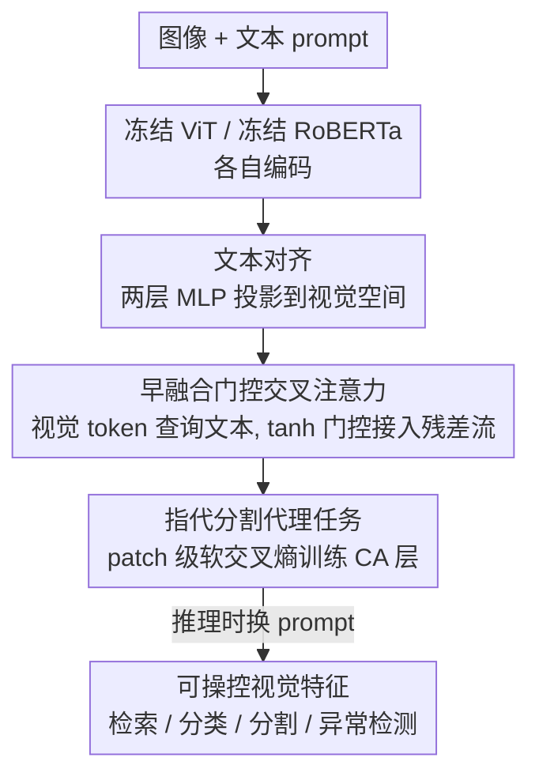

# Steerable Visual Representations

**会议**: ECCV 2026  
**arXiv**: [2604.02327](https://arxiv.org/abs/2604.02327)  
**代码**: [https://jonaruthardt.github.io/project/SteerViT](https://jonaruthardt.github.io/project/SteerViT) (项目主页)  
**领域**: 多模态视觉表征 / 指代分割  
**关键词**: 可操控视觉表征, 早融合, 门控交叉注意力, 冻结 ViT, 指代分割

## 一句话总结
SteerViT 把轻量门控交叉注意力层交错插进冻结的 ViT（如 DINOv2）内部，让文本在视觉编码「过程中」就介入，用一个 patch 级指代分割代理任务训练，仅加 21M 参数就能让视觉特征被自然语言「操控」聚焦到任意物体，同时几乎不损失原 ViT 的表征质量，在文本条件检索、个性化物体判别、工业异常分割等任务上零样本追平甚至超过专用方法。

## 研究背景与动机
DINOv2、MAE、SigLIP 这类预训练 ViT 已经能给出通用的图像特征，拿去做检索、分类、分割都很好用，但它们有个改不掉的毛病：只会盯着画面里最显眼的那个主体。一张室内照片里有猫、遥控器、书架，DINOv2 编码出来的几乎就是一个「猫」的表征，遥控器和书架被彻底忽略——这很大程度上源于「摄影师偏置」和以物体为中心的视觉数据集训练出的显著性偏好。问题是很多下游任务（细粒度定位、按需检索小物体）恰恰需要关注那些不显眼的概念，而纯视觉编码器是 query-agnostic 的，你没有任何手段告诉它「这次请看书架」。

另一条路是多模态大模型（MLLM），它们确实能被文本 prompt 引导，但融合发生在语言模型的早期层，结果特征落进了语言空间、视觉保真度被稀释，做通用视觉任务时反而不如纯视觉编码器；而且动辄上十亿参数，代价高昂。CLIP、SigLIP 这类跨模态编码器则是典型的「晚融合」——图像和文本各自独立编码，文本只在训练时提供监督信号，推理时根本无法回过头去改变视觉编码，你把文本特征后验地加到视觉特征上，检索精度纹丝不动（实测仅 +0.02%）。开放词表定位模型（SAM3、GroundingDINO）虽可被文本操控，但它们的中间表征是为定位专门优化的，缺乏迁移到通用视觉任务的泛化性。核心矛盾在于：现有方案要么可操控但表征质量差、要么表征质量好但不可操控，没有一个能同时满足「可操控」与「表征质量」两个诉求。

本文从人类视觉得到启发——人在被文字提示后，自上而下的任务引导注意力会真的改变他解析画面的方式。于是作者反转 MLLM 的范式：不是拿视觉去喂语言，而是让语言去调制视觉。**核心 idea：把轻量可训练的门控交叉注意力层交错插进冻结 ViT 的各个 block，让视觉 patch token 在编码过程中就去「注意」文本 token（早融合），并用一个 patch 级指代分割代理任务训练这些新增层，从而得到一类既能被文本操控、又保留原 ViT 表征质量的 vision-centric 多模态表征。**

## 方法详解

### 整体框架
SteerViT 的目标是：给任意一个预训练 ViT 装上「文本可操控」能力，且不破坏它原有的表征。整体上它保持骨干 ViT 和文本编码器全程冻结，只在 ViT 内部每隔一层插入一个门控交叉注意力层，让视觉 token 去查询文本 token；训练时用一个 patch 级的指代分割任务倒逼这些交叉注意力层学会把文本线索路由进对应的视觉 patch。推理时不需要针对新任务再训练，换个 prompt 就能把特征「操控」到新概念、新域上。

具体由四个组件构成：**A. 视觉编码器**（冻结的 ViT，主实验用 DINOv2 ViT-B/14，输出 N 个 patch token 和可选 [CLS]）；**B. 文本编码器**（冻结的 RoBERTa-Large，输出 token 级文本嵌入）；**C. 多模态适配器**（一个可训练两层 MLP，把 L2 归一化后的文本嵌入投影到视觉对齐空间）；**D. 门控交叉注意力层**（真正承载操控能力的新增模块，插在每隔一个 ViT block 处，如 12 层的 ViT-B 插 6 个）。前三者里 A、B 是脚手架式的冻结组件，C 是把文本对齐进视觉空间的通用子步，真正的创新落在 D 和训练目标上。

### 关键设计

**1. 早融合门控交叉注意力：让文本在编码过程中改写视觉残差流**

这一设计直接针对「晚融合无法操控冻结视觉特征」这个痛点。作者反转了 Flamingo 的门控交叉注意力方向——Flamingo 是语言去注意视觉，这里改成让视觉隐状态去注意语言 token：在第 $\ell$ 层，视觉 patch token 当 query，经适配器对齐后的文本 token 当 key/value，做标准交叉注意力。关键的巧思在于「门控接入残差流」的方式——注意力输出不是直接加回去，而是先过一个带层专属可学习标量 $\alpha_\ell$ 的 tanh 门，且 $\alpha_\ell$ 初始化为零：

$$Z_v^{(\ell+1)} = Z_v^{(\ell)} + \tanh(\alpha_\ell)\cdot \hat{Z}_v^{(\ell)}$$

由于 $\tanh(0)=0$，初始时刻模型和原始冻结 ViT 完全等价，不会一上来就把预训练特征打乱。但它又不是死的——门对 $\alpha_\ell$ 的梯度里含 $\mathrm{sech}^2(\alpha_\ell)$，而 $\mathrm{sech}^2(0)=1$，所以哪怕从零初始化，梯度信号依然存在，$\alpha_\ell$ 能在优化中逐渐离开零、慢慢「打开」这条语言注入通路。这样既保住了原 ViT 的表征质量，又让文本得以逐层、渐进地改写视觉表征。消融显示去掉这个 tanh 门（改成无门控交叉注意力）会让 FG-CLS、CORE、PODS 分别掉 4.2、1.4、11.0 分，说明无门控的交叉注意力会直接扰乱冻结特征。此外作者刻意省掉了 Flamingo 原架构里交叉注意力后的门控 FFN——加 FFN 不但对表征质量几乎没帮助、还会伤操控性和 OOD 迁移，同时把适配器参数从 21.2M 撑到 35.4M（+67%），得不偿失。

**2. patch 级指代分割代理任务：用「内容匹配」逼交叉注意力真正吸收语言**

光插入交叉注意力层还不够，得设计一个「不看文本就做不出来」的任务，才能倒逼视觉编码器去用语言线索。作者选了指代分割：给一张图和一个指向目标物体的 prompt，模型要预测哪些 patch 属于被指代的区域。为了避开像素级解码器的复杂度，整个任务在 ViT 的 $n\times n$ patch 网格上进行——ground truth 是把像素级二值 mask patch 化后每个 patch 的前景像素占比 $y_i$，一个线性分类头把每个 patch 表征映射成 mask 概率 $p_i$，用软交叉熵训练：

$$\mathcal{L} = -\sum_{i=1}^{n\times n} y_i \log p_i$$

这个软标签设计很关键。作者对比过更简单的「pointing」方案（在 bounding box 中心放一个高斯核当目标），发现它只教会模型「物体在哪」、对物体形状大小不敏感，把监督坍缩到单个空间位置；而分割目标会激活所有与物体重叠的 token，教的是「内容匹配」——每个 patch 得判断自己画的是不是被描述的物体，而不只是离中心多近。实测分割目标全面优于 pointing，FG-CLS +7.3、ADE20k +8.0、PODS +12.4。正是这种「内容匹配」的监督，让交叉注意力层学会把文本信息精确路由进对应的视觉 patch，产出可操控的表征。

**3. 门控标量当推理期连续控制旋钮：在原 ViT 与全条件态之间平滑插值**

因为操控能力全靠 tanh 门控接入，作者发现了一个免费的红利：门控标量 $\alpha_\ell$ 天然就是一个「文本条件强度」的连续旋钮。推理时把学到的 $\alpha_\ell$ 统一乘一个缩放因子 $\omega\in[0,1]$，就能在「原封不动的 ViT 子空间」和「完全文本条件态」之间平滑插值——$\omega=0$ 退回原始 ViT，$\omega=1$ 是全操控。画出这条轨迹会露出一条清晰的帕累托前沿：DINOv2 和 SigLIP 在 $\omega=0.6$ 附近取得操控性与表征质量的最佳折中，此时两者表征质量甚至略微超过原始 ViT、同时解锁了高操控性。最戏剧性的是 MAE——它的表征质量随 $\omega$ 单调上升，从 $\omega=0$ 的 40 分涨到 $\omega=0.6$ 的 50 分，说明文本条件反而给 MAE 那些语义不成熟的特征注入了语义结构、让它们更可迁移。这个旋钮让「操控性 vs 表征质量」从一个二选一的取舍，变成了可按需调节的连续谱。

### 损失函数 / 训练策略
训练目标就是上面的 patch 级软交叉熵指代分割损失。数据用了指代分割与 grounding 混合集：RefCOCO/+/g、Visual Genome、LVIS、Mapillary Vistas，共 162k 张独立图像、2.28M 图文对，覆盖室内/室外/街景多种域和从两词标签到多句描述的多样文本。bounding box 用 SAM2 转成二值 mask。骨干 DINOv2 ViT-B/14 + RoBERTa-Large，336² 分辨率、batch size 12、训 500k 步（约 84 H100 GPU 小时），AdamW + cosine 调度（warmup 到 3e-4 再降到 3e-5）。整个过程只训 21.2M 交叉注意力参数，ViT 和文本编码器全冻结。

## 实验关键数据

### 主实验
四类基线：纯视觉编码器（DINOv2、MAE）、跨模态编码器（CLIP、SigLIP，晚融合逐元素相加）、MLLM（InternVL3、Qwen3-VL、LFM-2.5-VL，按 E5-V 取末 token 池化）、开放词表定位（SAM3、GroundingDINO，取中间多模态状态）。

| 任务 / 基准 | 指标 | SteerViT | DINOv2 | 对比对象 |
|--------|------|------|----------|------|
| CORE 条件检索 | acc@1 | **96.0** | 43.7 | FLAIR 81.3 / SAM3 接近 96 / InternVL3-2B 差 20 分 |
| MOSAIC 定向注意力 | PR-AUC | **50.2** | 14.3 | — |
| GeneCIS Focus Object（真实图零样本） | R@1 | **25.4** | 9.6 | 专用基线 18.7 |
| PODS 个性化物体判别（详细 prompt） | PR-AUC | **58.1** | 29.6 | 微调 DINOv2 变体 48.0（需每类一个模型） |
| MVTec AD 零样本异常分割 | PRO | **82.1** | — | SAM3 54.5 / FADE(专用) 84.5 |
| VisA 零样本异常分割 | PRO | **82.0** | — | FADE(专用) 79.3 |

关键点：CORE 上早融合把 DINOv2 从 43.7 拉到 96.0，而晚融合后验加文本只有 +0.02% 的可忽略提升，坐实「晚融合无法操控冻结特征」。异常分割是极端 OOD 场景，SteerViT 零样本就追平专用方法。个性化判别里单个 SteerViT 模型（换 prompt）就超过了要为 100 个物体各训一个的微调 DINOv2。

### 消融实验

| 配置 | FG-CLS↑ | ADE↑ | CORE↑ | PODS↑ | 说明 |
|------|---------|------|-------|-------|------|
| Full（早融合+tanh 门+MLP） | 87.7 | 55.4 | **96.0** | **58.1** | 完整模型 |
| w/o 早融合（改晚融合） | 91.8 | 55.5 | 93.3 | 36.6 | 分类反而升，但 PODS 暴跌 21.5 |
| w/o tanh 门（无门控 CA） | 83.5 | 55.3 | 94.6 | 47.1 | 无门控扰乱冻结特征 |
| w/o MLP（改单线性层） | 86.7 | 54.5 | 95.2 | 56.4 | 对齐变差 |
| 训练目标 pointing（vs 分割） | 80.4 | 47.4 | 95.2 | 45.7 | 只教「在哪」不教「是什么」 |

### 关键发现
- **早融合对细粒度任务是刚需**：晚融合虽在粗超类分类上更高，但一到需要实例级区分的 PODS 就崩（36.6 vs 58.1）；当只用粗超类 prompt 时两者差距消失（26.5 vs 27.9），说明早融合的价值恰恰在细粒度。
- **文本细节直接控制特征粒度**：PODS 上从粗超类（「mug」）到实例名（「white ECCV mug」）再到 MLLM 生成的详细外观描述，PR-AUC 从 27.9% 一路涨到 58.1%——SteerViT 不是简单加信息，而是靠 prompt 详略精确控制视觉特征的语义粒度。
- **操控是真·文本驱动**：给错误随机类别做条件，SteerViT 掉 48.3 分、FLAIR 掉 29.4 分，而 CLIP/SigLIP 纹丝不动，证明前者的特征确实被文本重塑、后者只是无条件的视觉特征。
- **弱骨干获益更大**：早融合相对晚融合的 CORE 增益在 MAE 上 +33.9、SigLIP 上 +15.9，远大于 DINOv2 的 +2.7——底层视觉特征越不成熟，语言注入越有用。
- **涌现的多层级 / 组合操控**：条件于「animal」会把动物类并成一个宏簇同时保留细结构，条件于「eye」则按「有没有眼睛」这个组合属性重组空间，把人和动物聚到一起——这些都不是训练时显式鼓励的。

## 亮点与洞察
- **反转 MLLM 范式**是这篇最「啊哈」的点：大家默认多模态就是拿视觉喂语言，本文反过来让语言调制视觉，只加 21M 参数（比 MLLM 少两个数量级）就得到 vision-centric 的可操控表征，效率与质量兼得。
- **零初始化 tanh 门**是极优雅的工程 trick：既保证初始等价于冻结 ViT、不破坏预训练特征，又因 $\mathrm{sech}^2(0)=1$ 保留梯度信号能被激活，还顺手变成推理期的连续控制旋钮。这个「零初始化门控接入残差流」的思路可直接迁移到任何「想给冻结骨干安全加模块」的场景。
- **pointing vs segmentation 的对比**给出一个可复用的洞察：代理任务的监督密度决定学到什么——稀疏点监督只教定位，稠密 mask 监督才教「内容匹配」进而产出高质量表征。做表征学习的代理任务设计时值得借鉴。
- **prompt 详略即粒度旋钮**：同一个冻结模型不重训、仅靠改 prompt 就能在粗类到实例级之间切换语义粒度，这对个性化、长尾场景（一个模型顶一堆专用微调模型）实用价值很高。

## 局限与展望
- 异常分割的零样本设定下，某些缺陷（如翻转的金属螺母）无法准确预测——因为没在正常样本上训练、也没有可见的表面缺陷（划痕）可依据，纹理类缺陷表现好但结构/几何异常仍难。
- 表征质量并非零损失：在细粒度分类的 Birds、Cars 上 SteerViT 略低于 DINOv2（91.2 vs 94.7、77.7 vs 83.8），整体维持 DINOv2 平均性能的 98.8%，操控能力换来了极小的质量代价。
- 推理开销上升：SteerViT 总参数 465M（含冻结骨干），133.8 GFLOPS/img、9.5 ms/img，比裸 DINOv2（98.6 GFLOPS、6.6 ms）重一些；虽远轻于 SAM3 和 MLLM，但不是完全免费。
- 训练监督依赖指代分割 / grounding 标注数据（靠 SAM2 从 box 转 mask），标注质量与覆盖域会影响操控泛化；对训练中没见过的极端域仍是零样本外推。

## 相关工作与启发
- **vs CLIP / SigLIP（跨模态晚融合）**：它们用文本做训练监督但推理时视觉编码独立于 query，后验加文本毫无操控效果（+0.02%）；本文早融合让文本在编码过程中介入，CORE 从 43.7 拉到 96.0。
- **vs MLLM（InternVL3 / Qwen3-VL）**：MLLM 融合在语言模型早层、特征落进语言空间、视觉保真度下降且需上十亿参数换来中等操控性；本文只加 21M 参数、特征留在视觉空间，CORE 上超 InternVL3-2B 达 20 分。
- **vs 开放词表定位（SAM3 / GroundingDINO）**：它们操控性强（SAM3 检索接近 SteerViT），但中间表征为定位专门优化、缺通用迁移性，在通用视觉任务上得分差；本文在保操控性的同时保住了原 ViT 的通用表征质量。
- **vs FLAIR**：FLAIR 在冻结 SigLIP 上做文本条件注意力池化（仍是晚融合），操控性次优（CORE 81.3）且在标准视觉基准上不如纯视觉编码器；本文早融合注入使操控性再高 14.7 分且保表征质量。
- **vs TIE / ELIP / TEVI（并行的文本条件视觉特征工作）**：它们各自面向窄管线（TIE 减 MLLM 视觉 token 优化文档理解、ELIP 改文到图检索重排、TEVI 用 SAE 编辑 CLIP 末层特征）；本文是产出可跨多任务迁移的通用可操控视觉表征框架。

## 评分
- 新颖性: ⭐⭐⭐⭐⭐ 「反转 MLLM 范式、让语言调制视觉」提出了一类新的可操控视觉表征，早融合门控交叉注意力的用法清晰有力。
- 实验充分度: ⭐⭐⭐⭐⭐ 自建 CORE / MOSAIC 两个操控性基准，跨检索/分类/分割/异常检测/个性化多任务，早融合 vs 晚融合、pointing vs 分割、多骨干、缩放、数据量、FFN 等消融相当扎实。
- 写作质量: ⭐⭐⭐⭐⭐ 五个 Finding 层层递进，taxonomy 图和帕累托前沿把「同时满足两诉求」讲得非常直观。
- 价值: ⭐⭐⭐⭐⭐ 用极少参数把任意冻结 ViT 变成文本可操控、零样本迁移到新域，一个模型顶一堆专用微调模型，实用性与启发性俱佳。

<!-- RELATED:START -->

## 相关论文

- [\[AAAI 2026\] Empowering DINO Representations for Underwater Instance Segmentation via Aligner and Prompter](../../AAAI2026/segmentation/empowering_dino_representations_for_underwater_instance_segmentation_via_aligner.md)
- [\[CVPR 2026\] Unified Spherical Frontend: Learning Rotation-Equivariant Representations of Spherical Images from Any Camera](../../CVPR2026/segmentation/unified_spherical_frontend_learning_rotation-equivariant_representations_of_sphe.md)
- [\[NeurIPS 2025\] Exploring Structural Degradation in Dense Representations for Self-supervised Learning](../../NeurIPS2025/segmentation/exploring_structural_degradation_in_dense_representations_for_self-supervised_le.md)
- [\[ECCV 2024\] UniFS: Universal Few-Shot Instance Perception with Point Representations](../../ECCV2024/segmentation/unifs_universal_few-shot_instance_perception_with_point_representations.md)
- [\[NeurIPS 2025\] TabRAG: Improving Tabular Document Question Answering for Retrieval Augmented Generation via Structured Representations](../../NeurIPS2025/segmentation/tabrag_improving_tabular_document_question_answering_for_retrieval_augmented_gen.md)

<!-- RELATED:END -->
