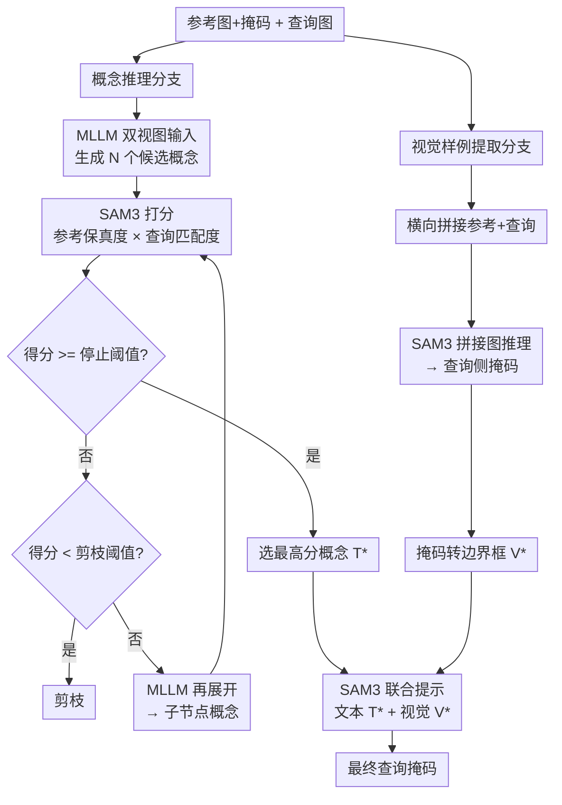

# Toward Robust In-Context Segmentation via Concept Guidance

**会议**: ECCV2026  
**arXiv**: [2606.28149](https://arxiv.org/abs/2606.28149)  
**代码**: [https://github.com/MAC-AutoML/CG-ICS](https://github.com/MAC-AutoML/CG-ICS)  
**领域**: 语义分割  
**关键词**: in-context分割, 鲁棒性, 概念引导, SAM3, 树搜索

## 一句话总结
CG-ICS 将 in-context 分割问题重新定义为概念引导的提示分割问题：用 MLLM 生成候选概念 + SAM3 打分 + 树搜索选出最佳文本概念，同时用图像拼接技巧从参考图提取查询侧的视觉样例，两者共同驱动冻结的 SAM3 完成分割，在保持高精度的同时显著降低不同参考选择导致的结果方差。

## 研究背景与动机

In-context segmentation（ICS）希望模型仅凭几张参考图和对应掩码就能分割查询图中的目标，全程不更新参数。这种范式灵活适应开放世界，但现有方法几乎完全忽略了一个关键问题：**系统鲁棒性**——同一张查询图，换一组参考图，分割结果可能天差地别。以当前最强的免训练方法 GF-SAM 为例，它在同一张图片上换几个参考样本，IoU 可以从 90+ 暴跌到 30 以下。已有工作确实注意到了这种敏感性，但它们的解决思路是"从候选池里选出最优参考"，实际部署中用户随手给一个参考，根本没有选的机会。一个真正可用的 ICS 系统，应该在任何合理参考下都给出稳定结果，而不是遇到"好"参考才工作。

这种脆弱性的根源在于：现有 ICS 方法都依赖参考图与查询图之间的**低层视觉匹配**（点匹配、区域匹配、特征对应）。视角一变、遮挡一出现、光照一变化，低层匹配就会漂移，产生语义错位。本文的洞察是：**如果 ICS 能先提取"目标是什么"的高层语义概念（比如"狗"、"飞机"），再用这个概念去引导分割，就能从根本上摆脱对低层视觉对应的依赖。** SAM3 恰好提供了这种能力——给它一段文本概念描述，它能理解语义并产生准确的分割掩码。但难点在于：ICS 的标准设定只给参考图和掩码，**没有任何类别标签或文字描述**，必须自己从参考中推导出合适的概念。

本文的核心 idea 是：**借 MLLM 从参考图像-掩码中自主生成候选文本概念，再用 SAM3 打分做树搜索选出最优概念，同时用参考文献的标注框在拼接图上引出查询侧的视觉样例，文本+视觉联合驱动 SAM3 产生最终分割——将 ICS 转化为提示概念分割（PCS）问题，使系统在参考多变时仍能稳定工作。**

## 方法详解

### 整体框架

CG-ICS 将 ICS 重新建模为 SAM3 的提示概念分割问题，采用两条并行的线索从参考图中提取引导信息。一条线索是**概念推理**——用 MLLM 生成候选文本概念，通过树搜索（展开→打分→剪枝→再展开）迭代精炼出最优概念；另一条是**视觉样例提取**——将参考图和查询图横向拼接，利用参考掩码的边界框在拼接图上调用 SAM3，从查询半侧切出掩码并转换成视觉样例边界框。最后将选定的文本概念与导出的视觉样例一起喂入 SAM3，得到最终的分割结果。全程所有模型参数保持冻结。

### 关键设计

**1. 树搜索式概念推理：MLLM 展开分支 + SAM3 打分剪枝**

要让 SAM3 正确分割目标，必须给它一个准确的概念描述。但参考图只有像素掩码，没有文字标签。最直接的想法是让 MLLM"看图说话"，但单次生成的描述可能过于笼统（"动物"）或过于特异（"金毛犬"），必须在大粒度与小粒度之间找到最合适的那个。本文把问题建模为**概念树上的搜索**：根节点是空白，MLLM 在根上首次生成 N 个候选概念作为第一层；每个候选节点由 SAM3 从两个维度打分——**参考保真度**（该概念在参考图上的语义掩码与真实掩码的 IoU）乘上**查询匹配度**（该概念在查询图上的存在概率），综合分数 `S = RF × QM`。得分超过停止阈值（0.8）的节点提前终止，低于剪枝阈值（0.5）的节点直接丢弃，其余节点被送回 MLLM 做进一步展开（生成近义词或更细粒度子概念）。如此反复最多 K=3 轮，选出整个树上得分最高的概念。这种"双阶段评分"让概念既忠实描述参考样本，又与查询图语义一致，两类误选（描述错但查询碰巧有，或描述对但查询没有）都能被抑制。

**2. 视觉样例提取：用拼接图将参考框"传递"到查询侧**

文本概念在某些情况下仍不够——对于罕见类别或外观极其特殊的物体，名词描述再精确也难以覆盖全部视觉细节。SAM3 本身支持视觉样例提示（目标边界框），但样例框需要在目标图像上定义。本文设计了一个简洁的传递机制：把参考图和查询图横向拼接，用参考掩码的边界框作为提示，让 SAM3 在整张拼接图上推理。由于 SAM3 能分割所有匹配的实例，它在参考侧和查询侧都会产生掩码——从查询半侧取出掩码并转成边界框，就得到了查询图上的视觉样例。这个设计巧妙地绕过了跨图像样例传递的难点，不用任何训练或额外学习，只靠拼接这一简单的几何操作就让 SAM3 在两侧一致地响应。

**3. 文本与视觉联合提示：语义概念 + 空间锚定互补**

最终分割阶段将两个线索融合：文本概念 `T*` 提供类别级语义（告诉 SAM3 "这是什么"），视觉样例 `V*` 提供查询图上的空间锚定（告诉 SAM3 "大概在哪儿，外观长什么样"）。两者作为 SAM3 的联合提示一次推理即得最终掩码。消融实验表明：仅用文本概念时 CV（变异系数）为 14.7%，加上视觉样例后降至 12.9%，说明视觉线索在空间定位上提供了正交的增益——尤其当概念词不够精确时，边界框能把注意力约束在正确区域。

### 多参考扩展

当有多个参考时，CG-ICS 对每个参考独立做概念推理得到各自的最优概念，然后在所有参考上重新评分选出一致性最高的那个；视觉样例则从每个参考到查询各执行一次拼接，收集所有边界框作为联合提示。这种"分而治之"的设计比一次性处理多图更可靠，因为 MLLM 同时处理多张图像时推理能力有限。

## 实验关键数据

### 主实验

在四个标准 ICS 基准上的对比结果：

| 基准 | 设定 | CG-ICS | 最强免训练基线 | 最强训练基线(含域内数据) |
|------|------|--------|---------------|------------------------|
| Pascal-5i | 1-shot | **89.3** | 72.1 (GF-SAM) | 88.3 (DiffwS) |
| COCO-20i | 1-shot | **72.3** | 58.7 (GF-SAM) | 77.8 (UNICL-SAM) |
| LVIS-92i | 1-shot | **55.4** | 35.2 (GF-SAM) | 50.3 (SANSA) |
| FSS-1000 | 1-shot | **90.2** | 88.0 (GF-SAM) | 90.0 (SANSA) |

CG-ICS 作为免训练方法，在 Pascal-5i、LVIS-92i、FSS-1000 上甚至超过了所有含域内数据训练的方法，达到 SOTA。

### 鲁棒性评估（参考选择）

通过固定查询、对每个查询采样 50 个不同参考来测量标准差和变异系数：

| 方法 | Pascal-5i CV | COCO-20i CV | LVIS-92i CV |
|------|-------------|-------------|-------------|
| CG-ICS | **7.8%** | **12.9%** | **30.1%** |
| GF-SAM | 27.3% | 28.1% | 44.3% |
| SANSA (训练) | 11.1% | 17.6% | 35.8% |

CG-ICS 在所有基准上的变异系数最低，说明它对参考选择的敏感度大幅降低。

### 鲁棒性评估（参考损坏）

对参考图施加 6 种退化（颜色偏移、模糊、压缩、空间变换、域偏移、形变），测量 mIoU 相对下降比例：

| 方法 | 干净 mIoU | 平均下降比例 |
|------|----------|-------------|
| CG-ICS | 74.6 | **-3.1%** |
| UNICL-SAM (训练) | 79.8 | -3.9% |
| GF-SAM | 61.5 | -4.1% |

CG-ICS 在各类退化下保持惊人的稳定，色彩和模糊退化几乎不受影响（下降 ≤0.3 mIoU）。

### 消融实验

| 配置 | mIoU | Std | CV | 说明 |
|------|------|-----|-----|------|
| 单次 MLLM 概念 | 67.6 | 15.1 | 22.3% | 直接生成一个概念做分割 |
| +多候选 | 66.5 | 15.3 | 23.0% | 仅增加候选数量没用 |
| +RF 评分 | 69.3 | 13.9 | 20.5% | 参考保真度帮助筛选 |
| +QM 评分 | 62.8 | 18.2 | 29.0% | 仅用查询匹配度反而更差 |
| +RF+QM | 70.1 | 11.3 | 16.1% | 两者结合最关键 |
| +树搜索 | 71.2 | 10.5 | 14.7% | 迭代精炼进一步提升 |
| +视觉样例 | **72.1** | **9.3** | **12.9%** | 完整系统 |

每个组件都贡献了可测量的增益，其中 RF+QM 联合评分是降低方差的转折点。搜索节点数 N=5、轮数 K=3 后收益趋于饱和。

## 亮点与洞察

- **将 ICS 重新定义为 PCS 问题是一个简洁而深刻的概念转型**：以往 ICS 困在"参考与查询之间的视觉对应"框架里，本文直接跳出来——不匹配像素，而是用来提取语义概念，再用概念驱动分割。这一转型消除了低层匹配的脆弱性（视角变化、遮挡、光照变化全部被 MLLM 的语义理解吸收）。
- **树搜索设计的两个评分维度（参考保真度 × 查询匹配度）有乘法协同效应**：消融显示只用一个维度反而退步（QM 单独用 CV 升到 29%），但两者相乘后 CV 骤降至 16.1%——因为 RF 筛掉了描述不准的概念，QM 确保概念在查询图中存在，缺一不可。
- **拼接图传递视觉样例的技术极小但巧妙**：不引入任何参数或学习，只是将参考和查询拼在一起，利用 SAM3 在同一张图上的一致性来跨图像传递边界框，简洁到几乎不需要解释，却是完整系统稳定的关键补充。

## 局限与展望

- MLLM 的推理成本不可忽视：每篇样本需要多轮 MLLM 调用（每节点 N=5 个候选，最多 K=3 轮），相比 GF-SAM 等纯视觉匹配方法，延迟和计算开销显著增加。
- 当目标类别极其罕见或 MLLM 产生幻觉时，概念推理可能收敛到错误的语义概念——尽管 RF 评分有一定保护，但若 MLLM 完全认错物体，评分也无能为力。
- 视觉样例提取依赖 SAM3 在拼接图上的一致性：如果参考和查询中的目标外观差异过大（如完全不同的物种），SAM3 在查询侧可能输出空掩码，此时视觉支路失效，完全依赖文本概念。

## 相关工作与启发

- **vs GF-SAM / PerSAM / Matcher**: 这些免训练方法依赖参考-查询之间的低层视觉匹配（点对应、区域对应），本文用高层语义概念替代低层匹配，从根本上提升了鲁棒性。
- **vs SegGPT / SINE / 其他训练方法**: 训练型方法需要大量域内数据微调，本文完全冻结模型，免训练且泛化性更强。
- **vs UNICL-SAM**: UNICL-SAM 关注参考损坏下的鲁棒性，但其训练范式成本高；本文在免训练设定下不仅处理损坏参考，还系统性地解决了任意参考选择导致的方差问题。

## 评分

- 新颖性: ⭐⭐⭐⭐ 将 ICS 重新定义为 PCS 问题并引入树搜索概念推理，思路清奇且有效
- 实验充分度: ⭐⭐⭐⭐⭐ 两个精心设计的鲁棒性评估协议（参考选择+参考损坏）+ 4 个基准 + 完整消融，实验扎实
- 写作质量: ⭐⭐⭐⭐ 动机清晰、方法阐述详细、图表呼应好
- 价值: ⭐⭐⭐⭐ 为 ICS 的实际部署扫清了重要障碍（参考敏感性），思路可迁移到其他 in-context 任务

<!-- RELATED:START -->

## 相关论文

- [\[ICLR 2026\] Advancing Complex Video Object Segmentation via Progressive Concept Construction](../../ICLR2026/segmentation/advancing_complex_video_object_segmentation_via_progressive_concept_construction.md)
- [\[ICML 2025\] ConText: Driving In-context Learning for Text Removal and Segmentation](../../ICML2025/segmentation/context_driving_in-context_learning_for_text_removal_and_segmentation.md)
- [\[ICML 2026\] FlowSeg: Dynamic Semantic Guidance for LLM-Conditioned Segmentation](../../ICML2026/segmentation/flowseg_dynamic_semantic_guidance_for_llm-conditioned_segmentation.md)
- [\[CVPR 2026\] Concept-Aware LoRA for Domain-Aligned Segmentation Dataset Generation](../../CVPR2026/segmentation/concept-aware_lora_for_domain-aligned_segmentation_dataset_generation.md)
- [\[CVPR 2026\] INSID3: Training-Free In-Context Segmentation with DINOv3](../../CVPR2026/segmentation/insid3_training-free_in-context_segmentation_with_dinov3.md)

<!-- RELATED:END -->
