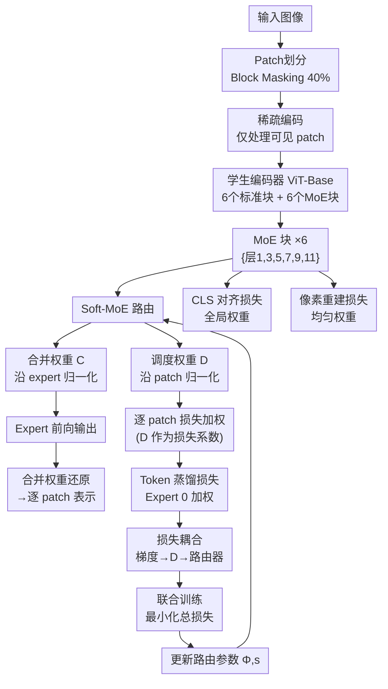

# ExPLoRe: Expert Patch-Level Loss Routing for Multi-Objective Masked Image Modeling

**会议**: ECCV 2026  
**arXiv**: [2606.31201](https://arxiv.org/abs/2606.31201)  
**代码**: [https://github.com/aicip/ExPLoRe](https://github.com/aicip/ExPLoRe)  
**领域**: 自监督学习  
**关键词**: 掩码图像建模, 多目标学习, 混合专家, 逐 patch 损失加权, 表示学习  

## 一句话总结

ExPLoRe 将 Soft-MoE 的调度权重 (dispatch weights) 重新用作多目标掩码图像建模中**逐 patch、可学习的损失系数**，通过损失耦合 (loss-coupling) 机制让路由器依据不同区域的语义特性动态调整各目标的权重，在 ImageNet-1K 上以更低的推理计算量（11.93 GFLOPs vs. 17.45）达到了 80.6% linear probe 和 85.3% finetuning 精度，并提出了三组下游迁移策略（Freeze Routing / Expert Dropout / Freeze Attention）将语义分割的 mIoU 差距从 2.5–2.9 完全弥合。

## 研究背景与动机

掩码图像建模 (Masked Image Modeling, MIM) 已成为视觉自监督学习的主流范式，其基本思路是让学生编码器从被掩码的图像中恢复出教师模型（如 CLIP）提供的语义目标。近年来，研究者发现将多个互补的学习信号——例如 token 级蒸馏（对齐 patch 特征）、全局 CLS 对齐（对齐图像级表示）、以及像素重建——组合在一起能带来更强的表示质量。然而，一个关键问题始终悬而未决：**如何为这些异构目标分配最优的损失权重？**

现有方法全部在全局层面做损失平衡：GradNorm 试图归一化梯度幅值、Uncertainty Weighting 建模任务相关不确定性、Random Loss Weighting 随机采样权重——但它们都施加**一个全局标量**，对所有空间位置的 patch 一视同仁。这忽略了图像的空间异质性：语义丰富的区域（如前景物体）更需要来自 CLIP 教师的蒸馏信号，而纹理密集的背景区域反而可能从像素重建中获益更多。作者通过实验证明，GradNorm 在这样的空间异构场景下会完全失效（Token+Pixel 配置 collapse 到 32.5% k-NN），原因是全局梯度信号被空间上互相冲突的局部需求拉扯到无法收敛。

本文的核心洞察是：既然不同 patch 对损失的敏感度天生不同，就应该让模型**自己学习**每个 patch 应该在哪些目标上被重点关注。作者巧妙地将 Soft Mixture of Experts (Soft-MoE) 的调度权重（原本用于决定 token 如何分配给各 expert）重新解释为损失系数——每个 expert 对应一个训练目标，其调度权重直接控制该 patch 在该目标上的贡献度。关键在于**损失耦合 (loss-coupling)**：让损失函数的梯度通过调度权重反向传播到路由器，从而驱动路由器学会按内容分配权重。**核心 idea：将 Soft-MoE 的调度权重重新用作多目标掩码图像建模中逐 patch、可学习的损失系数，通过损失耦合机制让路由器学会按图像内容动态调整各目标的关注程度。**

## 方法详解

### 整体框架

ExPLoRe 建立在 MaskDistill 框架之上，采用学生-教师架构进行自监督预训练。给定输入图像，首先进行 block masking（掩码率 40%），然后采用 MAE 风格的稀疏编码（仅处理可见 patch）送入学生编码器。编码器为 ViT-Base/16，其中交替的 6 个块（层 {1,3,5,7,9,11}）将原本的 MLP 替换为 Soft-MoE 层。每个 Soft-MoE 层包含 E 个 expert（每个是一个独立参数的 MLP），与可学习的路由参数 Φ（决定每个 expert 对什么内容敏感）和缩放参数 s（控制路由分布的锐度）。

Soft-MoE 从共享的 logits 中计算两类权重：**调度权重 D**（dispatch weights，沿 patch 维度做 softmax，每个 expert 上的权重之和为 1）和 **合并权重 C**（combine weights，沿 expert 维度做 softmax，每个 patch 上的权重之和为 1）。调度权重将可见 patch 聚合到各 expert 的输入槽中，各 expert 处理后，合并权重再将 expert 输出还原为逐 patch 的表示。ExPLoRe 的关键创新是**将调度权重 D 同时用作损失系数**：每个 expert 对应的训练目标（如 Token 蒸馏）在计算损失时，用 D 对 patch 级的损失进行加权，且损失梯度通过 D 反向传播到路由器参数，形成损失耦合。

整体训练使用三个互补目标：Token 级蒸馏（MoE 加权，由 Expert 0 调度）、CLS Token 对齐（全局权重 0.4）、像素重建（仅在 Token+Pixel 配置中开启，均匀权重）。主配置为 Token+CLS 组合，使用稀疏编码。

### 关键设计

**1. 损失耦合的调度权重：把路由变成一种隐式的损失分配策略**

多目标 MIM 面临的核心矛盾是：全局损失权重无法捕捉空间异质性的 patch 级需求。用 Soft-MoE 的调度权重来加权损失是一个自然想法，但关键在于**使用哪种权重、以及梯度该怎么流**。Soft-MoE 天然产生两类权重：调度权重 D 沿 patch 归一化（每个 expert 上，所有 patch 的权重和为 1；即 N 个 patch 竞争一个 expert 的注意力）和合并权重 C 沿 expert 归一化（每个 patch 上，所有 expert 的权重和为 1；即每个 patch 获得各 expert 的混合信号）。作者选择 D 而非 C 作为损失系数，理由巧妙：如果用 C 加权，路由器可以通过给困难 patch 分配很小的权重来让损失"消失"（因为 C 是每条 patch 独立的，可以全部给一个不相关的 expert 从而最小化加权损失）。而 D 的归一化方式意味着每个 expert 的权重总和在所有 patch 上固定为 1——路由器不能凭空缩小整个 batch 的损失，只能重新分配哪些 patch 承担更多损失。具体地，对于 Token 蒸馏损失（Expert 0 加权），每张图像 i 上可见 patch 的加权损失为 $\mathcal{L}_{\text{token}}^{\text{MoE}} = \frac{1}{B}\sum_{b=1}^{B} \frac{\sum_{i\in\mathcal{V}} D_{b,i,0} \cdot \ell_{\text{huber}}(\hat{t}_{b,i}, \text{LN}(t_{b,i}))}{\sum_{i\in\mathcal{V}} D_{b,i,0}}$，其中除以 ΣD 实现逐图像归一化，防止路由器通过全局缩小的方式欺骗损失。最关键的是，D 是可微的——损失梯度通过 D 反向传播到路由器参数 Φ 和 s，使得路由器能感知到"哪些 patch 在当前分配下损失大、哪些损失小"，从而学会将高损失权重的 patch 导向更能降低该损失的 expert。作者通过 detach 消融验证了这一机制的必要性：阻断梯度流后 k-NN 下降了 1.6%，且调度权重的空间模式从"前景/背景互补"退化为"随机散点"。

**2. 熵正则化的稳定性调控：在专家坍缩和均匀化之间找到平衡**

如果只有损失耦合，路由器容易走向极端——把所有调度权重都分配给少数 patch，导致 expert 坍缩（一个 expert 承担几乎全部损失，其他 expert 收不到梯度信号）。为此，作者在最后一个 MoE 块（Block 11，即用作损失加权的那个块）上施加了 per-expert 熵正则化：鼓励每个 expert 的调度权重分布尽可能均匀（即每个 expert 都关注到所有 patch）。每 expert 的熵定义为 $H_e = -\frac{1}{B}\sum_{b=1}^{B}\sum_{n=1}^{N} D_{b,n,e} \log D_{b,n,e}$，由于 D 本身已沿 patch 归一化，这天然是一个概率分布的熵。总熵正则项为 $\mathcal{L}_{\text{entropy}} = -\sum_{e=0}^{E-1} \lambda_e \cdot H_e$，最大化熵（使分布均匀）通过最小化负熵实现。熵正则化和损失耦合是一对**对抗力**：损失耦合推动路由器走向内容相关的 specialization（某些 patch 被某 expert 重点关注），而熵正则化推动均匀分布（所有 expert 关注所有 patch）。系数 λ 控制折中。作者发现了一个尖锐的相变：λ=0.01 时路由完全坍缩（k-NN 从 75.4% 跌到 66.9%），λ=0.1 以上才稳定。最佳 λ 与 expert 数量相关：2-expert 时 λ=0.5 最优，64-expert 时 λ=5.0 更好——因为更多 expert 本身就有天然多样性，不需要太强的熵正则来防止坍缩。

**3. 下游迁移策略：释放 MoE 模型在密集预测任务上的潜力**

MoE 模型在下游任务上迁移困难。标准 finetuning 会覆盖预训练的路由模式（路由器学习任务相关的捷径而非保留预训练的专业化分工），额外 expert 参数也增加了过拟合风险。作者提出了三组互补策略：**Freeze Routing (FR)** 冻结路由参数 Φ 和 s，保留预训练的 patch-expert 分配，只微调 expert MLP 参数；**Expert Dropout (ExD)** 对 expert 输出施加 p=0.4 的 dropout，防止过度依赖少数 dominant expert；**Freeze Attention (FA)** 额外冻结注意力参数，只训练 MLP、layer norm 和分类头。三者可自然组合。关键发现是：在语义分割（ADE20K）上，不使用任何迁移策略的 MoE 模型比非 MoE 基线低 2.5–2.9 mIoU——MoE 的稀疏路由模式与密集预测所需的空间全覆盖存在固有冲突。FR 单独恢复 0.7–1.4 mIoU，FR+FA+ExD 完全弥合差距（Token+Pixel 达 52.8 mIoU，比非 MoE 基线 52.5 还高 0.3；Token+CLS 达 51.1，比基线 50.8 高 0.3）。在 ImageNet finetuning 上，完整配方从 vanilla MoE 的 83.8% 提升到 85.3%（+1.5%），超过非 MoE 基线的 84.8%。

### 损失函数 / 训练策略

总训练目标包含三个组件：Token 蒸馏损失（MoE 加权，Huber 损失，β=1.0）、CLS 对齐损失（余弦相似度，全局权重 0.4）、像素重建损失（MSE，只在 Token+Pixel 配置中启用，默认权重 1.0）。预训练使用 AdamW 优化器（β1=0.9, β2=0.95），峰值学习率 1.5e-3，余弦衰减，40 epoch warmup，权重衰减 0.05，batch size 4096（4×H100），FP16 混合精度，梯度裁剪 3.0。MoE 配置采用交替块放置（1,3,5,7,9,11），每 expert 1 个 slot，路由类型为全可微 soft routing，缩放参数 s 初始化为 1.0 可学习。熵正则化系数默认 5.0，2-expert 时最优 0.5，64-expert 时最优 5.0。稀疏编码模式下仅可见 patch 产生调度权重，因此像素损失（在掩码 patch 上计算）只能使用均匀权重；密集编码（BEiT 风格）作为消融评估。

## 实验关键数据

### 主实验

| 配置 | Params | GFLOPs | k-NN@20 | Linear Probe | Finetune Top-1 | ADE20K mIoU |
|------|--------|--------|---------|-------------|----------------|-------------|
| MAE (1600ep) | 86M | 17.45 | — | 68.0 | 83.6 | 48.1 |
| BEiT (800ep) | 86M | 17.45 | — | 56.7 | 83.0 | 45.6 |
| MaskDistill (repr.) | 86M | 17.45 | 75.6 | 76.2 | 84.8 | 53.8 |
| BEiT v2 | 86M | 17.45 | — | 80.1 | 85.0 | 52.7 |
| MILAN (400ep) | 86M | 17.45 | — | 79.9 | 85.4 | 52.7 |
| CAE v2 | 86M | 17.45 | — | 80.5 | 85.3 | 52.9 |
| **ExPLoRe 2-exp** | **116M** | **11.93** | **75.4** | **79.6** | **84.1** | — |
| **ExPLoRe 64-exp** | **1.86B** | **13.86** | **76.2** | **80.6** | **85.3** | **52.8** |

64-expert ExPLoRe 以最低的推理计算量（13.86 GFLOPs vs. 其他方法的 17.45）达到了最高的 linear probe 80.6%，finetune 精度与 CAE v2 持平。2-expert 配置参数增加 35%，但推理 FLOPs 反而下降了 32%（因 soft MoE 的 slot 机制使 expert MLP 只需处理 E 个而非 N 个输入）。

### 消融实验

| 配置 | Token+CLS k-NN | Token+CLS Linear | Token+Pixel k-NN | 说明 |
|------|---------------|-----------------|-----------------|------|
| No MoE (baseline) | 75.7 | 76.2 | 71.5 | 无 MoE 基线 |
| 2-exp unweighted | 74.1 | — | — | MoE 容量反而有害 |
| 2-exp + W (loss-coupling) | 75.4 | 79.6 | — | 加权带来 +1.3% |
| 2-exp detach (无耦合) | 73.8 | — | — | 阻断梯度降 1.6% |
| 2-exp combine 权重 | 2.1 | — | — | 使用 C 加权完全坍缩 |
| 64-exp unweighted | 75.3 | — | — | 参数增加不保证增益 |
| 64-exp + W | 76.2 | 80.6 | — | 加权贡献 +0.9% |
| 32-exp unweighted | — | — | 73.0 | — |
| 32-exp + W | — | — | 73.7 | 加权贡献 +0.7% |
| 64-exp + W (Token+Pixel) | — | — | 69.3 | 64 expert 出现反转 |
| λ=0.01 (坍缩) | 66.9 | — | — | 路由完全坍缩 |
| λ=0.5 (最优 2-exp) | 75.5 | — | — | — |
| λ=5.0 (默认) | 75.4 | — | — | — |

**下游迁移策略消融（Token+CLS 64-exp ImageNet 微调）**：

| 策略 | Top-1 |
|------|-------|
| Vanilla MoE (unfrozen) | 83.8 |
| FR only | 84.2 |
| FR+FA | 84.3 |
| FR+ExD | 84.9 |
| FR+FA+ExD | **85.3** |
| No MoE 基线 | 84.8 |

### 关键发现

- **损失耦合是核心机制而非参数增益**：2-expert unweighted 变体（74.1% k-NN）甚至不如非 MoE 基线（75.7%），说明只有 MoE 容量但没有损失耦合的话，extra 参数反而有害。detach 消融（-1.6%）和 combine 权重坍缩（2.1%）进一步确认了损失耦合的不可替代性。
- **线性探测增益远大于 k-NN 增益**：2-expert 的 k-NN 仅 +0.4%（76.2 vs. 75.7），但 linear probe 从 76.2% 跃升到 79.6%（+3.4%）——表明损失耦合路由器重塑了特征空间的线性可分性，这种效应在最近邻检索中难以体现。
- **CLS token 的专家专精化**：在损失耦合块（Block 11），Expert 1 将 91–95% 的调度权重集中在 CLS token 上，几乎变成了一个"CLS 对齐专家"。这个现象只在损失耦合块出现，非损失块的 MoE 层没有这种模式，说明梯度信号直接驱动了路由器的语义特异性分化。
- **熵正则化的尖锐相变**：λ 从 0.01 提到 0.1 时，调度权重的变异系数（CV）跃升 32 倍——路由从"均匀分散"瞬间切换到"有意义的 specialization"。最优 λ 高度依赖于 expert 数量，说明正则化强度需要随模型容量缩放。
- **MoE 的推理效率优势**：由于 Soft-MoE 中每个 MoE 层将所有 token 路由到 E 个 expert slot 中（而非 N 个），expert MLP 只需处理 E 个输入而非 N 个（N=197），即使 64-expert 的 GFLOPs（13.86）仍低于标准 ViT-B/16（17.45）。Per-FLOP 视角下 ExPLoRe 是所有对比方法中的最优点。

## 亮点与洞察

- **调度权重 vs. 合并权重的选择**：将路由机制中原本被忽略的"哪一侧做 softmax"这个细节上升到方法论高度，从理论上论证了为什么用调度权重（沿 patch 归一化）而非合并权重（沿 expert 归一化）——前者阻止了路由器通过减小权重来"欺骗"损失函数。这是一个非常漂亮的设计决策推理。
- **损失耦合概念的简洁验证**：通过 detach 消融（只阻断损失梯度到路由器的路径，保留前向传播不变）来分离"MoE 容量"和"损失耦合"两个因素，是机制验证的教科书级范例。进一步地，用 2-expert unweighted 变体低于非 MoE 基线这个事实来证明"MoE 容量本身甚至是有害的"——逻辑链条干净有力。
- **下游迁移的"食谱工程"**：FR+FA+ExD 三组策略各司其职——FR 保留路由模式、FA 防止任务特定捷径、ExD 防过拟合——且它们可以自然组合。语义分割上 2.5-2.9 mIoU 到 +0.3 mIoU 的大逆转很具说服力，证明了 MoE 在密集预测任务上的潜力。
- **CLS 专精化的涌现现象**：路由器在损失耦合块自发地将 CLS token 集中给某个 expert，这种没有显式监督的语义分化令人印象深刻，也提供了理解"损失耦合机制到底学到了什么"的一个直观窗口。

## 局限与展望

- **实验规模受限**：所有实验使用 ViT-Base（GPU 内存限制，64-expert 约需 72GB/GPU），且教师固定为 CLIP-B，机制在更大模型（ViT-L/H）和更大数据（ImageNet-21K、JFT）上的表现未知。
- **三目标组合效果有限**：Token+CLS+Pixel 三目标联合训练时，MoE 加权并未带来 measurable 的收益（75.15% vs. 75.16% baseline），说明当前的路由机制在多目标（>2）场景下梯度冲突问题尚未解决，每个目标需要独立的 expert 分配策略。
- **Token+Pixel 的 expert scaling 反转**：64-expert 时 Token+Pixel 的 k-NN 从 71.5 不升反降到 69.3%（32-expert 时最优 73.7%），作者的归因（像素重建梯度信号较弱，不足以训练 64 组 expert）需要更多分析验证。
- **关键超参数对 expert 数敏感**：熵正则化系数 λ 需要根据 expert 数量手动调整（2-exp: 0.5, 64-exp: 5.0），没有自动调节机制；per-expert 非对称权重在 Token+Pixel 配置下更复杂（λ0=5.0, λ1=24.0），可推广性受限。
- **损失加权路由器与特征路由器未解耦**：当前使用同一套路由器参数同时做特征路由（前向 MoE 计算）和损失加权，两者目标可能冲突。作者在 future work 中提到可以分离出一个专用的损失加权路由器。

## 相关工作与启发

- **vs 全局损失平衡方法 (GradNorm, Uncertainty Weighting, RLW)**：这些方法施加统一的标量权重，无法捕捉图像的空间异质性。ExPLoRe 是第一个在 MIM 中实现逐 patch 自适应损失加权的方法。实验证明 GradNorm 在空间异构场景下会灾难性失效（Token+Pixel collapse 到 32.5% k-NN），直接颠覆了"全局梯度平衡就够了"的默认假设。
- **vs 传统 MoE 应用 (Switch Transformer, V-MoE, CR-MoE)**：传统 MoE 用于容量扩展或任务特定专家分配，ExPLoRe 将 MoE 调度权重重新解释为损失系数，赋予了路由机制完全不同的语义——不再是"哪个 expert 处理这个 token"，而是"这个 patch 应该多关注哪个目标"。CR-MoE 曾在对比学习中遇到路由一致性问题，ExPLoRe 的熵正则化和损失耦合设计可以看作是对此类问题的一种有效回应。
- **vs MoE 迁移工作 (ST-MoE, ViMoE)**：ST-MoE 主要关注路由冻结，ViMoE 侧重于监督微调中 MoE 层的选择。ExPLoRe 系统性研究了预训练 MoE 模型向分类和密集预测任务迁移的三组策略及其组合效果，填补了自监督 MoE 迁移的空缺。

## 评分

- 新颖性: ⭐⭐⭐⭐⭐ 将 MoE 调度权重重新解释为逐 patch 损失系数，配以损失耦合机制，思路简洁但新颖——不是简单堆砌 MoE，而是让路由机制本身成为学习损失分配的工具。
- 实验充分度: ⭐⭐⭐⭐⭐ 覆盖 k-NN、linear probe、finetune、语义分割四种评估协议；expert scaling（2→64）的加权/未加权对比精确隔离了机制与参数效应；detach 消融、combine 权重消融、熵正则化扫描等验证环环相扣。
- 写作质量: ⭐⭐⭐⭐⭐ 动机链条清晰（全局加权→空间异质性→逐 patch 自适应），方法部分对 dispatch vs. combine 权重的选择有充分的数学论证，消融实验设计逻辑严密（unweighted < baseline 这个反直觉事实讲得很有冲击力），附录中 silhouette coefficient 和 dispatch-loss 相关性分析提供了极佳的可视化佐证。
- 价值: ⭐⭐⭐⭐⭐ 为多目标 MIM 提供了一个全新的视角——"让路由器部分地承担损失分配的责任"——这个思路很容易迁移到其他多任务/多目标学习场景（如视觉-语言联合预训练、多模态目标组合），且推理 FLOPs 更低这一特性提升了实用性。

<!-- RELATED:START -->

## 相关论文

- [\[CVPR 2026\] Suppressing Non-Semantic Noise in Masked Image Modeling Representations](../../CVPR2026/self_supervised/suppressing_non-semantic_noise_in_masked_image_modeling_representations.md)
- [\[CVPR 2025\] From Prototypes to General Distributions: An Efficient Curriculum for Masked Image Modeling](../../CVPR2025/self_supervised/from_prototypes_to_general_distributions_an_efficient_curriculum_for_masked_imag.md)
- [\[ICML 2026\] Scaling Continual Learning to 300+ Tasks with Bi-Level Routing Mixture-of-Experts](../../ICML2026/self_supervised/scaling_continual_learning_to_300_tasks_with_bi-level_routing_mixture-of-experts.md)
- [\[ECCV 2026\] LoT-Pass: Long-term-robust Image Watermarking for Image to Video Generation](zipfian_adaptive_loss_for_neural_compression.md)
- [\[CVPR 2025\] CheXWorld: Image World Modeling for Radiograph Representation Learning](../../CVPR2025/self_supervised/chexworld_exploring_image_world_modeling_for_radiograph_representation_learning.md)

<!-- RELATED:END -->
