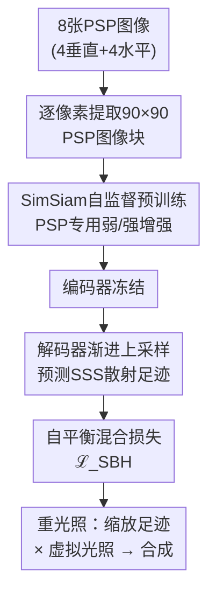

# From Phase to Phenomenon: Self-Supervised Learning of Subsurface Scattering with Minimal Phase-shift Inputs

**会议**: ECCV2026  
**arXiv**: [2606.29461](https://arxiv.org/abs/2606.29461)  
**代码**: 有（GitHub，论文内链接）  
**领域**: 次表面散射 / 自监督学习  
**关键词**: 次表面散射, 自监督学习, 重光照, 相移轮廓术, SimSiam

## 一句话总结

提出一套自监督预训练框架，利用投影仪-相机系统仅需8张高频相移条纹（PSP）图像即可学习通用的次表面散射（SSS）表征，再通过解码器预测各向异性散射足迹，实现零样本重光照，将新物体的数据采集量从数千张降至8张。

## 研究背景与动机

次表面散射（Subsurface Scattering, SSS）是光射入半透明材质后在内部多次散射、从另一点射出的现象，决定了皮肤、水果、蜡制品等物体的视觉外观。精确重建SSS对影视特效、数字孪生、虚拟试穿等应用至关重要。然而，完整测量物体表面每一点的SSS响应（即点扩散函数）极为昂贵——逐点激光扫描方案（如DISCO）需要数百万次测量，即使较高效的方案（如点阵投影）也需要上千张图像。这一数据采集瓶颈使得SSS建模难以扩展到新物体。

从另一个角度观察，在高精度三维扫描中，高频相移轮廓术（Phase-Shift Profilometry, PSP）被广泛用于重建物体几何。有趣的是，PSP图像中条纹的模糊程度和局部对比度恰恰反映了该处的SSS强度——强散射物体（如苹果）的条纹模糊严重，弱散射物体（如梨）则保持锐利。然而，现有方法一直把SSS当作三维重建的干扰因素去抑制，从未主动利用PSP图像中蕴含的散射信息。

本文的核心洞察是：既然PSP图像天然编码了SSS信息，就可以直接从中学习散射表征，从而绕过昂贵的逐点照明采集。**核心idea：用仅8张高频相移条纹投影(PSP)图像，通过SimSiam非对比自监督预训练学习通用次表面散射表征，再用解码器预测各向异性散射足迹，实现零样本重光照。**

## 方法详解

### 整体框架

整个框架分为两阶段训练和推理三部分。第一阶段（自监督预训练）：用投影仪-相机系统对训练物体采集8张PSP图像（4张垂直+4张水平正弦条纹），对每个表面像素提取90×90图像块，在SimSiam非对比学习框架下用PSP专用弱/强增强对来预训练编码器。第二阶段（解码器监督训练）：冻结编码器参数，训练一个渐进上采样解码器，将编码器的紧凑表征映射回90×90×3的SSS散射足迹图，用自平衡混合损失（ℒ_SBH）与采集的真实足迹做监督。推理阶段：对新物体只需8张PSP图像，经编码器→解码器逐像素预测散射足迹，再通过缩放和累积合成实现任意光照模式下的重光照。

### 关键设计

**1. PSP专用数据增强与SimSiam自监督预训练**

自监督学习在非自然图像上的关键在于数据增强——增强方式决定了编码器学到什么不变性。标准ImageNet式增强（随机颜色变换、高斯模糊等）对PSP图像效果很差，因为PSP图像中的相位结构包含了关键的几何和散射信息，弱增强会丢失有效信息，强增强又会破坏条纹模式的结构完整性。本文针对PSP图像设计了一套弱-强非对称双支路增强管线：弱增强支路仅做随机裁剪和轻微颜色抖动，保留主要的相位结构；强增强支路应用椒盐噪声、高斯模糊、随机翻转、随机强度缩放、随机相位抖动（在RGB上叠加类似相移的噪声）、以及随机洗牌PSP图像顺序（打破固定的2π/N相移对称性）。这种设计迫使编码器在保持几何相位信息的同时学习散射相关的材质不变性。编码器采用预激活残差块（Pre-activation ResNet）结构替换标准的U-Net下采样块，避免维度坍塌。在SimSiam框架下最小化弱/强支路编码输出的负余弦相似度，训练稳定。

**2. 解码器渐进上采样与注意力门控跳跃融合**

将编码器学到的紧凑表征还原为90×90×3的SSS散射足迹是一个精细重建任务，核心挑战在于同时保留散射峰值的高频锐度与尾部衰减的低频能量。解码器采用逐级子像素上采样（pixel shuffle），每级将空间分辨率翻倍，配合注意力门控的跳跃融合——从编码器的中间层特征中筛选出与散射重建最相关的空间信息，用注意力权重抑制背景噪声和非散射纹理的混入。相比转置卷积的棋盘伪影，子像素上采样能更自然地提升分辨率；相比于无门控的直接拼接，注意力门控有效抑制了编码器特征中非散射区域对预测的干扰。解码器在多个训练物体间随机采样训练，避免了逐物体训练导致的灾难性遗忘。

**3. 自平衡混合损失：针对SSS足迹分布的复合优化**

SSS散射足迹的分布极不均匀：入射点处有一个尖锐的强度峰值，随半径指数衰减至极微弱的长尾区域。简单的L1/L2损失会偏向优化峰值而忽略尾部，导致重建的散射外观生硬。本文设计了自平衡混合损失（ℒ_SBH），融合五个互补分量：L1数据项作为主体监督；对数域L1（ℒ_log）放大尾部区域的相对误差，提升微弱散射恢复精度；结构相似性（ℒ_SSIM）维护视觉感知质量；梯度域L1（ℒ_∇）锐化散射峰值的边界过渡，避免颜色通道坍塌；方差加权MSE（ℒ_wMSE）根据批次内各像素的方差值自适应加权——高方差区域（强散射、难预测区域）获得更大权重，自动平衡了峰值与尾部的优化优先级。权重配置为λ1=1、λwMSE=5、λ∇=10、λSSIM=0.5、λlog=1。

### 损失函数 / 训练策略

自监督预训练采用SimSiam负余弦相似度损失。由于PSP数据分布与自然图像差异大，直接使用SimSiam原版超参数会导致维度坍塌，因此改用初始lr=0.05、20个epoch warmup后余弦退火衰减、无重启的策略。解码器监督训练使用自平衡混合损失ℒ_SBH。训练数据来自5个物体（青苹果、橙子、梨、星星铲、铲子），每物体最多4个视角，共计1,126,827个SSS足迹样本。

## 实验关键数据

### 主实验

在训练未见过的测试物体上评估90×90散射足迹的重建质量，与真实相机捕获图像对比：

| 物体 | MSE×10⁻⁵↓ | PSNR↑ | SSIM↑ | LPIPS×10⁻²↓ |
|------|-----------|-------|-------|-------------|
| Apple | 4.1 | 44.67 | 0.96 | 8.4 |
| Orange | 4.9 | 43.84 | 0.94 | 8.6 |
| Crab | 3.5 | 47.98 | 0.98 | 6.5 |
| Hand | 3.8 | 42.51 | 0.96 | 6.5 |

### 消融实验

对比PSP专用增强与标准ImageNet增强对编码器kNN分类准确率的影响（逐视角留一法测试）：

| 物体 | PSP增强准确率↑ | ImageNet增强准确率↑ |
|------|---------------|-------------------|
| Apple | 99.6% | 99.04% |
| Pear | 99.99% | 98.74% |
| Orange | 99.99% | 98.92% |
| Star | 99.95% | 99.93% |
| Shovel | 91.43% | 84.91% |

### 关键发现

- PSP专用增强在所有物体上一致优于ImageNet增强，在强各向异性材质（Shovel）上差距达6.5个百分点，说明领域定制数据增强对结构光图像的SSL至关重要
- 编码器学到了材质相关的散射特征：PCA-RGB可视化显示，空间位置上散射特性相似的区域在特征空间中聚簇，散射变化剧烈的区域（如叶脉、材质边界）呈现明显颜色过渡
- 重光照结果即使在复杂几何下也保持高保真：沙耙手指间的散射互反射、柑橘类水果的高光区域均被准确还原
- 解码器成功预测了各向异性散射足迹的方向依赖性，在铲子等具有明显方向性散射的材质上表现突出

## 亮点与洞察

- **从"干扰"到"信号"的视角转换**：首次利用三维扫描中通常被抑制的SSS条纹模糊效应作为散射信息源，用同一套PSP图像同时完成几何重建和散射建模，极大降低了采集成本
- **SSL在工业/结构光视觉数据上的成功示范**：领域定制增强是SSL从自然图像迁移到非自然图像的关键——标准增强破坏了PSP的结构信息反而退化性能，这提示未来SSL应用需针对数据分布设计专属增强策略
- **自平衡混合损失的可迁移设计**：方差加权MSE让模型自动关注困难区域，无需手工调谐逐区域权重，可推广至其他非均匀分布的重建任务（如光场、MRI等）

## 局限与展望

- 散射足迹受限于90×90的局部图像块（约对应物理空间15mm半径），无法捕捉大范围的远距离光传输（如半透明大物体内部的深层次散射）
- 方法针对固定的投影仪-相机配置训练，跨相机或投影仪位姿的泛化尚未验证，可能限制了实际部署灵活性
- 依赖标准动态范围图像，弱信号区域的噪声和动态范围限制可能影响远尾重建精度，HDR采集是自然改进方向
- 当前为确定性回归，引入生成式或随机建模（如扩散模型、VAE）可能更好地表征高度各向异性的复杂散射行为

## 相关工作与启发

- **vs DISCO [Goesele et al., 2004]**: 用激光逐点扫描测量SSS，需数百万张图像；本文只需8张PSP图像即可推理，是数量级差距
- **vs Vicini et al. (Learned SSS)**: 用条件VAE + MLP学习BSSRDF高效采样，需渲染器集成；本文是纯数据驱动、基于图像的SSS建模，直接输出各像素散射足迹
- **vs Majumdar et al. (U-Net baseline)**: 用U-Net端到端学习PSP→足迹映射，需3000张采集图像且编码器不可复用；本文引入SSL预训练将采集降至8张，编码器可独立复用于分类等下游任务

## 评分

- 新颖性: ⭐⭐⭐⭐ 首次将自监督学习引入次表面散射建模，将PSP散射模糊从干扰重新定义为信号源，视角转换巧妙
- 实验充分度: ⭐⭐⭐⭐ 多个未见物体上的定性定量评估，含kNN表征分析、PCA可视化、多视角重光照对比，但消融主要对比增强策略，对损失各分量贡献的分析略显不足
- 写作质量: ⭐⭐⭐⭐ 动机叙述清晰，方法逻辑链完整，图表示例丰富直观，附录提供了可复现的架构细节
- 价值: ⭐⭐⭐⭐ 将SSS采集成本从数千张降至8张是实质进步，SSL设计思路可推广至其他结构光视觉任务（如透明物体重建、荧光成像）

<!-- RELATED:START -->

## 相关论文

- [\[CVPR 2026\] Text-Phase Synergy Network with Dual Priors for Unsupervised Cross-Domain Image Retrieval](../../CVPR2026/self_supervised/text-phase_synergy_network_with_dual_priors_for_unsupervised_cross-domain_image_.md)
- [\[ICLR 2026\] On the Alignment Between Supervised and Self-Supervised Contrastive Learning](../../ICLR2026/self_supervised/on_the_alignment_between_supervised_and_self-supervised_contrastive_learning.md)
- [\[CVPR 2026\] VideoSSR: Video Self-Supervised Reinforcement Learning](../../CVPR2026/self_supervised/videossr_video_self-supervised_reinforcement_learning.md)
- [\[ICLR 2026\] Understanding the Learning Phases in Self-Supervised Learning via Critical Periods](../../ICLR2026/self_supervised/understanding_the_learning_phases_in_self-supervised_learning_via_critical_perio.md)
- [\[ICLR 2026\] Equivariant Splitting: Self-supervised learning from incomplete data](../../ICLR2026/self_supervised/equivariant_splitting_self-supervised_learning_from_incomplete_data.md)

<!-- RELATED:END -->
