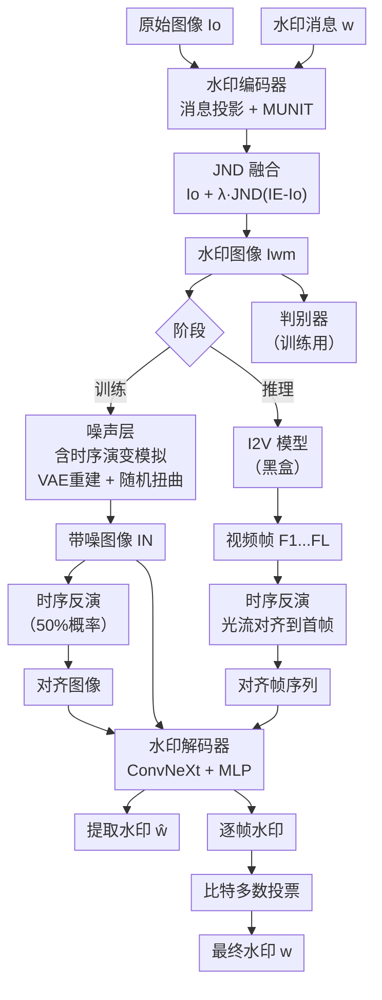

# LoT-Pass: Long-term-robust Image Watermarking for Image to Video Generation

**会议**: ECCV 2026  
**arXiv**: [2509.17773](https://arxiv.org/abs/2509.17773)  
**领域**: 自监督学习  
**关键词**: 图像水印, I2V生成, 长时间鲁棒性, 时序反演, 版权保护  

## 一句话总结
LoT-Pass 提出双向鲁棒策略——训练阶段用时序演变模拟主动扩大水印的鲁棒距离，推理阶段用光流反演把严重漂移帧"拉回"可提取状态——首次在 I2V 生成场景下实现超过 95% 的视频级水印提取准确率。

## 研究背景与动机

随着 Stable Video Diffusion、Wan、Hunyuan 等图像转视频（I2V）生成模型的普及，版权侵权风险急剧上升：攻击者可将受版权保护的图片或人物照片作为输入条件，生成侵权衍生视频甚至深度伪造。数字水印技术为这类场景提供了事后溯源的可行方案——在原始图像中嵌入不可见的持有者信息，后续可从任何使用场景中提取验证。然而，现有水印方法在 I2V 场景暴露出一个致命短板：由于生成过程导致的语义和结构漂移（semantic drift），水印信号仅在接近原始输入的前几帧中可靠存在，视频后期帧中几乎完全丢失。这使得攻击者只需一个简单的"时序裁剪"（temporal cropping）——丢弃前几帧提取早期帧、保留后期漂移帧——就能轻易获得无痕迹的侵权视频。

这种短期存活的根本矛盾在于：单纯加大正向嵌入强度无法对抗 I2V 生成中的非线性语义发散，任何水印方法都存在信号饱和点——超出该点后无论嵌入多强的水印信号都会被生成过程破坏殆尽。因此，达到长时间鲁棒性需要一种根本性的策略转变。本文的核心洞察是：与其让水印信号在极端前向漂移中被动承受，不如对已经漂移到可提取范围之外的帧做"反向操作"——把它们拉回一个对水印解码器友好的状态。基于这一思路，LoT-Pass 提出了一套双向鲁棒框架：在训练阶段模拟 I2V 生成的典型畸变（VAE 压缩重建和随机像素偏移），让编码器和解码器学会在这些畸变下仍能可靠地嵌入和提取水印，从而正向扩大鲁棒距离；在推理阶段用光流估计把后期严重漂移帧后向对齐到初始参考帧的坐标系统，再送入解码器提取水印，逆向恢复不可提取帧。**核心 idea：将图像水印的长时间鲁棒性从"单向抵抗畸变"转变为"正向扩大鲁棒距离 + 逆向时序恢复"的双向策略，用时序演变模拟训练扩大前向鲁棒半径、用光流反演模块后向拉回漂移帧。**

## 方法详解

### 整体框架

LoT-Pass 采用编码器-解码器水印架构，其核心创新在训练和推理阶段分别引入两个针对性模块。训练时，水印编码器接收原始图像 $I_o$ 和水印消息 $w \in \{0,1\}^M$，经过消息投影层和基于 MUNIT 的特征融合网络生成编码图像 $I_E$，再通过 JND（最小可觉差）模块与原始图像融合得到水印图像 $I_{Wm} = I_o + \lambda \times JND(I_E - I_o)$。$I_{Wm}$ 经噪声层处理（含时序演变模拟和各种通用畸变）后送入解码器重建水印；训练中还引入了一个基于 ResNet 的判别器通过对抗训练约束水印图像的视觉质量。推理时（视频模式），含水印图像经 I2V 模型生成视频后，每一帧先被送入时序反演模块用光流对齐到首帧的坐标系，然后送入解码器逐帧提取水印，最后通过比特多数投票（bit-majority vote）聚合全部帧的提取结果得到最终水印。

### 关键设计

**1. 时序演变模拟：在训练中用代理操作预演 I2V 生成畸变**

传统水印训练使用的噪声层仅包含裁剪、JPEG 压缩、高斯模糊等通用图像操作，无法模拟 I2V 生成过程特有的信号破坏模式。LoT-Pass 在噪声层中加入了两个针对性的模拟操作。其一是 VAE 重建：将水印图像送入预训练 Stable Diffusion 的 VAE，经过编码到潜空间、加噪去噪、再解码回像素空间的全流程。这精确复现了大多数 I2V 模型（如 SVD、CogVideoX）的关键处理步骤——I2V 的扩散过程会在潜空间中对输入条件逐渐"遗忘"，VAE 重建恰好模拟了这一信息耗散过程。其二是随机扭曲：生成一个低分辨率的高斯网格流场，上采样到目标分辨率后叠加到标准采样网格上，通过重采样对水印图像产生平滑的像素级偏移，模拟 I2V 模型中时序一致性层引入的像素运动。两类模拟操作都不需要实际运行 I2V 模型（训练时也无法接入），以轻量代理的形式让编码器-解码器提前学会抵抗 I2V 特有的信号畸变。

**2. 时序反演模块：用光流把漂移帧拉回到解码器熟悉的数据流形**

即便时序演变模拟扩大了正向鲁棒距离，视频后期帧的漂移程度仍可能超越解码器的可提取范围。时序反演模块从根本上改变了提取策略：不强制解码器从严重漂移帧中直接提取，而是先把该帧变换回接近参考帧（默认为首帧）的姿态再做提取。具体来说，模块使用预训练 RAFT 光流模型计算参考帧 $I_{ref}$ 与目标帧 $I_{tar}$ 之间的稠密光流 $F \in \mathbb{R}^{H \times W \times 2}$，表示每个像素从参考帧到目标帧的位移矢量；然后做反向重采样——将目标帧中每个像素 $(u,v)$ 按照光流矢量 $(F_x,F_y)$ 映射回参考帧的坐标系统：$I_{inv}(u,v) = \text{Interpolate}(I_{tar}, (u+F_x, v+F_y))$。由于参考帧（首帧）是含水印输入图像直接生成的，它与编码器的隐空间高度兼容——经过对齐的后期漂移帧被映射到解码器熟悉的数据流形上，水印提取率因此大幅提升。这一模块的巧妙之处在于它完全在像素域操作，不依赖任何 I2V 模型的内部信息，是一个可即插即用于黑盒模型的通用组件。

**3. 自适应噪声重加权两阶段训练**

训练采用两阶段策略。第一阶段不施加噪声层，让编码器-解码器-判别器快速收敛到稳定状态。第二阶段激活包含时序演变模拟和各种通用畸变的噪声层，并以固定间隔根据验证集上各类型噪声的表现自适应调整权重。每种噪声的权重按 $w_i = \max(e_i, 0.01) / \sum_j \max(e_j, 0.01)$ 更新，其中 $e_i$ 是该类型噪声下的提取错误率。即使某噪声的错误率已低于 1%，也保留最小权重 0.01，确保模型在学习对新噪声鲁棒的同时不会遗忘已掌握的鲁棒特征。此外，训练中带噪图像有 50% 的概率先经过时序反演模块（以原始水印图像为参考）再送入解码器，让解码器学会从经反面对齐的标准图像中提取水印。

### 损失函数 / 训练策略

整体训练目标为四项损失的加权和：

$$L = \lambda_1 L_{enc} + \lambda_2 L_{lpips} + \lambda_3 L_{adv} + \lambda_4 L_{dec}$$

其中 $L_{enc} = L_2(I_{Wm}, I_o)$ 约束水印图像与原始图像的像素相似度；$L_{lpips}$ 为 LPIPS 感知损失，保持人眼不可感知；$L_{adv} = \log(1 - D(I_{Wm}))$ 为判别器对抗损失，进一步约束水印图像的视觉自然度；$L_{dec} = L_2(w_{dec}, w)$ 为水印解码损失。权重设置 $\lambda_1=1, \lambda_2=0.1, \lambda_3=0.1, \lambda_4=50$，解码损失权重最高，体现水印提取准确性的首要地位。训练使用 MS COCO 数据集，分辨率 256×256，32 位随机水印消息，批大小 16，250 个 epoch，AdamW 优化器，初始学习率 0.0001。推理时，编码器通过残差缩放策略支持任意分辨率输入：先将输入图像降采样到训练分辨率，编码扩散残差后上采样叠加回原始尺寸。

## 实验关键数据

### 主实验

LoT-Pass 在四个开源 I2V 模型（CogVideoX、Hunyuan、Wan2.1、SVD）和两个商用模型（Kling、Hailuo）上评估，对比 SSLWM、CIN、MuST、TrustMark、WAM、VINE、Robust-Wide 七种基线。所有方法确保水印图像 PSNR > 36dB 以公平比较。

| 模型 | 指标（VACC） | LoT-Pass | 最佳基线 | RDD（LoT-Pass） | RDD（最佳基线） |
|------|-------------|----------|----------|----------------|----------------|
| CogVideoX | 视频级准确率 | 0.966 | 0.891（WAM） | 49 | 27 |
| Hunyuan | 视频级准确率 | 0.924 | 0.832（WAM） | 18 | 6 |
| Wan2.1 | 视频级准确率 | 0.943 | 0.872（WAM） | 49 | 20 |
| SVD | 视频级准确率 | 0.823 | 0.731（WAM） | 1 | 0 |

在 RDD（鲁棒扩散距离，提取准确率 ≥ 0.9 的最大帧数）上，LoT-Pass 在 CogVideoX 和 Wan2.1 上均达到 49 帧（接近视频全长 50 帧），远超所有基线。在经典噪声鲁棒性测试中，LoT-Pass 在随机弯曲攻击上较次优方法提升超过 22%。

### 消融实验

| 配置 | 关键指标 | 说明 |
|------|---------|------|
| Full model | 见主实验 | 完整 LoT-Pass |
| w/o 时序演变模拟 | FACC 全程显著下降 | 不包含时序演变模拟训练时，即使推理使用时序反演，所有帧的水印提取准确率也大幅降低 |
| w/o 时序反演 | 中期帧 FACC 快速衰减 | 不使用反演模块直接提取时，FACC 在中期帧即开始快速下降，后期帧近乎随机 |

### 关键发现

- **时序演变模拟中**，VAE 重建和随机扭曲分别模拟了 I2V 生成的两个核心信号破坏因素——潜空间压缩重建的信息耗散和像素级运动漂移，两者缺一不可。含该模块训练比不含的模型在所有 I2V 模型上 FACC 均显著更高。
- **时序反演在前期帧贡献小、后期帧贡献大**：前 10 帧有无反演差别不大（本身漂移小），但第 20 帧以后差距急剧拉大。这表明后期漂移帧的反向对齐是提取成功的关键瓶颈。
- 商用模型（Kling RDD=120, Hailuo RDD=47）上性能优于开源模型，因为商用模型视频质量更高、时序更连贯，水印信号保留更充分。SVD 下所有方法 RDD 接近 0，因其缺少文本提示先验，生成完全依赖输入图像，漂移失控。
- 剧烈运动场景会降低提取精度（VACC 下降约 2-4%），但 LoT-Pass 在高运动场景下仍保持 VACC > 0.91。
- LoT-Pass 在帧裁剪（丢弃前 20% 帧）后仍保持 VACC > 0.87（CogVideoX 上），说明其对时序裁剪攻击的天然鲁棒性。

## 亮点与洞察

- **双向鲁棒策略的范式转换**：此前水印鲁棒性研究几乎都在"增强编码强度"的单方向努力，LoT-Pass 首次提出"正向扩大 + 逆向恢复"的双向思路，是防御策略层面的根本转变。这一思路可以推广到任何需要信号在时间轴上持久保留的场景，如音频水印、文档溯源。
- **时序演变模拟的代理设计巧妙**：用 VAE 重建 + 随机扭曲模拟 I2V 生成的核心畸变，无需实际运行 I2V 模型即可在训练中预演干扰，实现了训练成本与模拟真实性的平衡。这种"代理畸变训练"的思路可迁移到其他跨模型水印场景。
- **光流反演即插即用的实用价值**：时序反演模块基于预训练光流模型，不依赖任何 I2V 模型的内部信息，可即插即用于黑盒模型，实际部署价值高。
- **水印模式的设计洞察**：论文发现表现好的方法（LoT-Pass、WAM、TrustMark）的水印模式呈大尺度斑点状分布，在 VAE 潜空间中差异最大，这提示水印模式设计对 I2V 鲁棒性的影响值得进一步探索。

## 局限与展望

- 时序反演模块依赖于光流估计的准确性。当 I2V 生成过程出现剧烈的结构变化（物体消失/出现、视角大幅度切换）时，光流估计可能失效，反演后图像质量退化影响水印提取。
- 论文主要关注 I2V 场景，对文生视频（T2V）的直接适配尚待探索——T2V 场景没有初始图像作为参考帧，反演模块的基线参考如何定义是一个开放问题。
- 水印容量的扩展性：当前仅测试 32 位消息，在实际应用（如大规模版权数据库）中可能需要更高容量，高容量下与长时间鲁棒性的权衡需要研究。
- 计算开销：光流估计增加了推理阶段的额外成本，在超长视频上的可扩展性有待验证。
- 主动对抗鲁棒性未充分讨论：如果攻击者知道反演模块的存在，可能设计针对性攻击（如对抗性光流扰动）来破坏对齐。

## 相关工作与启发

- **vs WAM / TrustMark**: 这两种方法虽然未专门针对 I2V 优化，但因水印模式呈现大尺度斑点状分布、在 VAE 潜空间中差异最大而在 I2V 场景中相对鲁棒——这提示水印模式的空间分布特性对跨模型鲁棒性有重要影响，可迁移到其他生成模型的水印设计。
- **vs Robust-Wide / VINE**: 这些方法针对图像编辑场景优化（指令引导编辑、图像修复），在 I2V 生成场景下泛化能力有限，因其训练畸变未涵盖 VAE 压缩重建这类跨模态畸变。
- **vs CIN / SSLWM**: 传统图像水印方法，训练噪声层仅包含经典几何/光度畸变，在 I2V 场景下几乎所有帧的提取准确率都快速降至随机水平，说明 I2V 特有的潜空间畸变是传统训练无法覆盖的关键盲区。

## 评分

- 新颖性: ⭐⭐⭐⭐⭐ 双向鲁棒策略（正向扩大 + 逆向恢复）的概念是水印领域在生成式 AI 时代的重要范式创新，时序演变模拟和光流反演的组合首次系统解决了 I2V 场景的长时间鲁棒性。
- 实验充分度: ⭐⭐⭐⭐⭐ 在 4 个开源 + 2 个商用 I2V 模型上评估，包含帧裁剪鲁棒性、经典噪声鲁棒性、运动强度影响等多种分析，消融实验完整验证了每个核心模块的必要性。
- 写作质量: ⭐⭐⭐⭐ 问题定义清晰（时序裁剪攻击），动机推理逻辑链完整，方法叙述层次分明。可改进之处是部分实验表格和公式说明可以更自包含。
- 价值: ⭐⭐⭐⭐⭐ 随着 I2V 模型在创意产业中的普及，版权追溯成为紧急需求。本文首次系统定义了并解决了图像水印在 I2V 场景下的长时间鲁棒性问题，实用价值和学术贡献均极为显著。

<!-- RELATED:START -->

## 相关论文

- [\[ECCV 2026\] ExPLoRe: Expert Patch-Level Loss Routing for Multi-Objective Masked Image Modeling](explore_expert_patch-level_loss_routing_for_multi-objective_masked_image_modelin.md)
- [\[CVPR 2026\] Decision Boundary-aware Generation for Long-tailed Learning](../../CVPR2026/self_supervised/decision_boundary-aware_generation_for_long-tailed_learning.md)
- [\[CVPR 2026\] Suppressing Non-Semantic Noise in Masked Image Modeling Representations](../../CVPR2026/self_supervised/suppressing_non-semantic_noise_in_masked_image_modeling_representations.md)
- [\[ICLR 2026\] Spatial Structure and Selective Text Jointly Facilitate Image Clustering](../../ICLR2026/self_supervised/spatial_structure_and_selective_text_jointly_facilitate_image_clustering.md)
- [\[ICLR 2026\] CARL: Camera-Agnostic Representation Learning for Spectral Image Analysis](../../ICLR2026/self_supervised/carl_camera-agnostic_representation_learning_for_spectral_image_analysis.md)

<!-- RELATED:END -->
