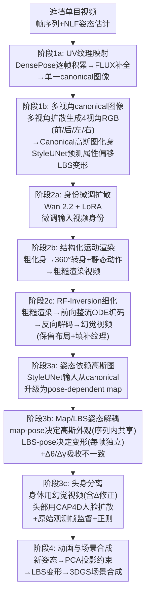

# AHOY! Animatable Humans under Occlusion from YouTube Videos with Gaussian Splatting and Video Diffusion Priors

**会议**: ECCV 2026  
**arXiv**: [2603.17975](https://arxiv.org/abs/2603.17975)  
**代码**: 待确认  
**领域**: 视频生成 / 3D视觉 / 人体重建  
**关键词**: 3D高斯化身, 人体重建, 视频扩散模型, 遮挡重建, 可动画化身

## 一句话总结

AHOY 从严重遮挡的单目 YouTube 视频中重建完整可动画的 3DGS 化身——先用 DensePose+FLUX+多视角扩散粗建 canonical 化身，再通过 LoRA 微调的 Wan 2.2 视频扩散模型做 RF-Inversion 生成多视角"幻觉"监督视频，最后用 map-pose/LBS-pose 解耦吸收生成数据的不一致性，训练出带姿态依赖形变的高保真高斯图化身。

## 研究背景与动机

从单目视频重建可重定姿的 3D 人体化身是计算机视觉和图形学的长期目标。NeRF 和 3DGS 领域的近期工作已能产生高保真、可实时驱动到新姿态的化身，但它们有共同的隐藏前提：输入中人物完全可见，且通常处于正向 canonical 姿态。这一假设排除了绝大多数真实世界视频——YouTube 上数十亿日常活动视频（做饭、运动、交谈）中，人体被家具、其他人或场景本身严重遮挡，大片身体区域从未出现在画面中，且每帧只有一个视角。如果能从这类视频中重建出完整化身，就等于解锁了无限量的人体外观数据源，无需受控捕捉环境、多视角相机阵列或受试者的主动配合。

然而遮挡下单目视频重建完整化身面临三个环环相扣的困难。第一，遮挡区域从未被观察到，没有直接的监督信号——模型必须"脑补"从未见过的身体表面。第二，高保真化身需要姿态依赖形变（弯腰时衣服褶皱变化、举手时腋下展开），但遮挡视频中每个姿态只有一个观察视角，无法提供训练形变所需的多视角监督。第三，即使靠扩散模型填补未观察区域，扩散模型每段视频独立采样生成，跨视角和跨帧之间不存在严格的几何一致性，直接当作多视角监督训练会产生严重的模糊和伪影。

本文的核心 idea 是**用身份微调的视频扩散模型作为"幻觉桥"：先将粗粒度化身的渲染嵌入扩散模型隐空间再解码回来，利用身份先验填补未观察区域同时保留身体布局；然后通过 map-pose 与 LBS-pose 的解耦将"决定高斯外观的姿态"和"决定高斯变形的姿态"分开，吸收生成数据中的多视角不一致性，最终从"幻觉"视频中训练出完整的姿态依赖高斯图化身**。

## 方法详解

### 整体框架

AHOY 的管线分为四个渐进阶段，从部分观察到的遮挡视频逐步推进到完整的可动画化身。第一阶段从部分观察建立粗粒度 canonical 化身：用 DensePose UV 映射将可见像素逐帧累积到 canonical 纹理图集，FLUX 补全未观察区域，多视角扩散模型从单张补全图生成 4 个 canonical 视角的 RGB 图像，用这些图像训练一个时间不变的 canonical 高斯图化身（不建模姿态依赖形变）。第二阶段生成"幻觉"监督视频：用输入视频中的身份信息通过 LoRA 微调 Wan 2.2 视频扩散模型，然后将粗粒度化身渲染成精心设计的结构化运动序列（360 度转身 + 特定动作如举手、坐着），再将粗糙渲染通过 RF-Inversion 嵌入扩散模型隐空间再解码回来，得到去除伪影、填补了未观察区域的高质量幻觉视频。第三阶段升级为完整化身：利用幻觉视频中"同一姿态多视角"的覆盖（转身序列中帧间近似同姿态）训练姿态依赖高斯图，同时引入 map-pose/LBS-pose 解耦和每帧姿态相机的可微调修正来吸收扩散模型的不一致性，并用 FLAME 头部分支保证面部身份。第四阶段，训练好的化身由 PCA 投影约束的新姿态驱动，合成到手机拍摄的 3DGS 场景中。

### 关键设计

**1. 幻觉即监督：RF-Inversion 填补未观察区域**

遮挡重建的核心困难是被遮挡区域从未被观察到，没有任何直接监督。本文的思路是先粗后精：基于部分观测训练一个粗的 canonical 化身，它知道身体的布局和姿态，但未观察区域只有粗糙的伪影。将这个粗化身按结构化运动序列（360 度转身配特定动作）渲染，这些渲染保留了正确的身体姿态和轮廓。关键步骤是将这些粗糙渲染输入身份微调扩散模型做 RF-Inversion——前向整流流 ODE 编码保留了空间布局，反向解码用 LoRA 微调的身份先验填充了缺失的纹理细节，输出的"幻觉"视频覆盖了之前从未观察到的身体表面（后背、腋下等），从多个视角和姿态提供了稠密监督。消融表明去掉 RF-Inversion 后新视角 PSNR 从 24.12 降至 21.10（-3dB），新姿态从 22.81 降至 19.40，验证了这一步骤的不可替代性。

**2. Canonical 到姿态依赖高斯图的两阶段渐进架构**

高保真化身必须建模姿态依赖形变——弯腰、举手、坐下时衣服的褶皱和轮廓都不同。但遮挡单目视频无法提供训练这种依赖所需的多视角覆盖。本文的洞察是暂时删减问题难度：第一阶段故意不做姿态依赖，只学 canonical 高斯图记忆人体的纹理和结构。等到第二阶段生成了幻觉视频，尤其是精心设计的"转身"序列，问题发生了质变——同一动作从 360 度不同角度被观察到，相当于提供了该姿态的多视角监督。转身序列中 map-pose 保持不变（如"举手"），各帧的 LBS-pose 只负责 360 度旋转的形变，这样姿态依赖的高斯图就获得了足够的监督信号。消融中仅用粗化身（不做第二阶段和姿态依赖）新视角 PSNR 从 24.12 暴跌至 16.10（-8dB），验证了升级的必要性。

**3. Map-pose / LBS-pose 解耦：吸收多视角不一致**

幻觉视频由扩散模型独立生成，跨视角和跨帧之间没有几何一致性。如果直接当真实多视角监督训练，化身会产生伪影。本文的解法是区分姿态的两个角色：决定"高斯属性长什么样"的 map-pose 和决定"高斯怎么变形到画面中"的 LBS-pose。Map-pose 作为 StyleUNet 输入，在同一转身序列内共享——对于"手臂举起"的动作，map-pose 保持不变，StyleUNet 输出同一套高斯属性。LBS-pose 则每帧不同，处理身体旋转带来的形变。此外，每帧的 LBS-pose 和相机参数附加了可微调的小修正量 $\Delta\theta$ 和 $\Delta\gamma$ 来吸收扩散模型的不一致性。消融表明去掉解耦后新视角 PSNR 下降 1.5dB（24.12→22.60），新姿态下降 2.2dB，因形变质量直接影响新姿态泛化。

**4. 头身分离监督：双扩散保护面部身份**

视频扩散模型生成的头部在不同帧间身份不一致——LoRA 微调能保留衣著和体型但面部细节不稳定。本文的方案是将化身高斯按 SMPL-to-FLAME 对应关系分为头部和身体。身体部分用幻觉视频的掩膜像素 $\mathcal{L}_{body} = \sum\|(\tilde{\mathbf{I}} - \hat{\mathbf{I}})\odot(1-\mathbf{M}_{head})\|_1$ 监督。头部则用 CAP4D 多视角人脸扩散模型生成身份一致的正面/侧面图像，训练专门的 FLAME 变形分支优化头部高斯。这一分离的动机是务实且清晰的：让一个视频扩散模型同时兼顾身体纹理和面部身份是不可靠的，不如把两个难度不同的任务交给不同的扩散模型。消融显示去掉头身分离后新视角 PSNR 下降 0.5dB，而视觉上的身份一致性变化比指标更大。

### 损失函数

完整训练目标包含五项：$\mathcal{L} = \lambda_{body}\mathcal{L}_{body} + \lambda_{obs}\mathcal{L}_{obs} + \lambda_{head}\mathcal{L}_{head} + \lambda_{per}\mathcal{L}_{per} + \lambda_{reg}\mathcal{L}_{reg}$。$\mathcal{L}_{body}$ 用幻觉视频的身体区域做 L1 监督，$\mathcal{L}_{obs}$ 用原始观测帧的可见区域做监督（掩膜遮挡物），$\mathcal{L}_{head}$ 用 CAP4D 人脸图像监督头部高斯，$\mathcal{L}_{per}$ 是 LPIPS 感知损失，$\mathcal{L}_{reg}$ 正则化蒙皮权重向 SMPL 默认约束。各 $\lambda$ 为平衡权重超参数。

## 实验关键数据

### 主实验

| 数据集 | 设定 | 指标 | 本文 | 之前最佳 | 提升 |
|--------|------|------|------|----------|------|
| BEHAVE | 新视角 | PSNR↑ | 24.12 | 19.34 (SyncHuman) | +4.78 |
| BEHAVE | 新视角 | SSIM↑ | 0.905 | 0.831 (SyncHuman) | +0.074 |
| BEHAVE | 新视角 | LPIPS↓ | 0.090 | 0.172 (SyncHuman) | -0.082 |
| BEHAVE | 新姿态 | PSNR↑ | 22.81 | 16.93 (LHM) | +5.88 |
| BEHAVE | 新姿态 | SSIM↑ | 0.889 | 0.774 (LHM) | +0.115 |
| BEHAVE | 新姿态 | LPIPS↓ | 0.110 | 0.238 (LHM) | -0.128 |
| YouTube | 动画(遮挡输入) | PSNR↑ | 22.81 | 19.03 (LHM) | +3.78 |
| YouTube | 动画(canonical输入) | PSNR↑ | 22.83 | 20.17 (LHM) | +2.66 |
| YouTube | 静态(遮挡输入) | PSNR↑ | 22.01 | 19.82 (SyncHuman) | +2.19 |
| YouTube | 静态(canonical输入) | PSNR↑ | 23.05 | 22.03 (SyncHuman) | +1.02 |

### 消融实验

| 配置 | BEHAVE 新视角 PSNR | BEHAVE 新姿态 PSNR | 说明 |
|------|-------------------|-------------------|------|
| AHOY (完整) | 24.12 | 22.81 | 完整管线 |
| (A) 仅有粗粒度化身 | 16.10 (-8.02) | 14.30 (-8.51) | 跳过幻觉生成和full avatar阶段 |
| (B) 去掉 RF-Inversion | 21.10 (-3.02) | 19.40 (-3.41) | 直接用粗渲染当监督 |
| (C) 去掉 map/LBS 解耦 | 22.60 (-1.52) | 20.60 (-2.21) | 不优化每帧姿态修正 |
| (D) 去掉头身分离 | 23.60 (-0.52) | 22.20 (-0.61) | 头部也用 Wan 视频监督 |

### 关键发现

- RF-Inversion 是最大的性能贡献者：去掉它 PSNR 下降超过 3dB，验证了"先粗渲染再扩散细化"这一"幻觉桥"设想的必要性
- map/LBS 解耦的贡献在新姿态设定下比新视角更显著（-2.21 vs -1.52），因为形变质量直接影响新姿态泛化，而解耦机制直接决定了形变修正的品质
- 头身分离的定量贡献相对较小（0.5dB），但视觉上对身份保真度的提升明显——面部的定性差异比 PSNR 差异大得多，这提醒了在化身重建中不能仅靠指标
- 即使给基线方法提供去遮挡后的 canonical 图像（最佳输入），AHOY 仍显著优于它们，说明完整的 3DGS 化身管线（姿态依赖高斯图 + 多阶段渐进训练 + 多视角扩散监督）本身就有结构性优势

## 亮点与洞察

- **"三阶段渐进训练替代单步回归"是严重遮挡重建问题的最佳实践**——不是直接要求模型一次推理出完整化身，而是 canonical → 粗渲染 → RF-Inversion → 姿态依赖高斯图，每一步都有清晰合理的监督信号和约束
- **RF-Inversion 用于化身监督是一个精巧的设计复用模式**——粗渲染提供正确的身体布局（几何先验），扩散模型提供合理的纹理细节（外观先验），两个强先验互补，比直接用扩散模型生成新视角更可控更稳定
- **map-pose/LBS-pose 解耦是处理生成数据多视角不一致性的优雅方案**——将姿态的"外观"角色和"变形"角色分开，这一设计思路可推广到其他用生成模型做 3D 监督的场景（如 NeRF-from-diffusion 等）
- **头身分离的设计体现了务实的分治哲学**——不试图让一个视频扩散模型同时做好身体和面部（两件事难度和需求不同），而是分别用最适合的工具处理

## 局限与展望

- 作者承认身份微调扩散模型可能"脑补"出看似合理但实际不存在的细节——对于从未被观察到的区域，生成结果没有几何约束来确保与真实一致
- 管线需要多个阶段的优化（LoRA 微调 + 多视角生成 + 结构化运动渲染 + RF-Inversion × N 段视频 + 完整化身训练），速度远慢于前馈式方法，难以用于在线场景
- 最终化身质量受限于视频扩散模型的保真度——随 Wan 2.2 / HunyuanVideo 的升级效果会自然提升，但当前生成模型的可靠性是天花板
- 该方法需要目标人物在输入视频中有一定可见帧数支持 LoRA 微调，如果遮挡极其严重（人物只出现几帧）则难以建立有效的身份先验

## 相关工作与启发

- **vs LHM / IDOL**：前馈式单图可动画化身方法，速度快但假设无遮挡输入；AHOY 从遮挡视频重建，速度慢但可在严重遮挡下生成完整化身——两者互补，AHOY 的输出可为前馈方法提供高质量的"去遮挡"训练数据
- **vs SyncHuman / PSHuman**：静态重建方法，不产生可动画化身；AHOY 的核心优势是输出的化身可驱动到新姿态，这是静态方法做不到的
- **vs Vid2Avatar / Vid2AvatarPro**：从无遮挡视频重建化身，不能处理遮挡；AHOY 填补了这个空白
- **vs Dream-Lift-Animate / AdaHuman / MoGA**：也从残缺输入重建化身，但无公开代码；AHOY 提供了可复现的方案，并在 YouTube 真实遮挡视频上做了充分评估
- **vs VIDA (Nazarczuk et al.)**：在稀疏视角设定下用视频扩散做 3DGS 监督，思路相似但聚焦不同问题；AHOY 将其扩展到遮挡单目化身重建

## 评分

- **新颖性**: ⭐⭐⭐⭐⭐ [将"扩散模型幻觉作为化身监督"系统化为完整的四阶段管线，map-pose/LBS-pose 解耦是巧妙的原创设计，开辟了从 YouTube 级别真实遮挡视频重建可动画化身的新方向]
- **实验充分度**: ⭐⭐⭐⭐⭐ [YouTube 50 段视频 + BEHAVE 多视角定量 + 两类输入设定（遮挡 vs canonical）+ 四大消融逐一验证 + 动画/静态/新视角/新姿态全覆盖，实验设计严谨完整]
- **写作质量**: ⭐⭐⭐⭐⭐ [动机层层递进，方法从粗到精逐步展开，每个阶段的设计动机和作用解释清晰，即使复杂管线也易于理解]
- **价值**: ⭐⭐⭐⭐⭐ [解锁了 YouTube 级别真实世界人体数据作为 3D 化身资产源，在游戏/VR/影视中有巨大应用潜力，方法设计思路具备很强的可扩展性]

<!-- RELATED:START -->

## 相关论文

- [\[ECCV 2026\] Next-Frame Decoding for Ultra-Low-Bitrate Image Compression with Video Diffusion Priors](next-frame_decoding_for_ultra-low-bitrate_image_compression_with_video_diffusion.md)
- [\[ECCV 2026\] Learning Transferable Dynamics Priors from Action to World Modeling](learning_transferable_dynamics_priors_from_action_to_world_modeling.md)
- [\[ECCV 2026\] Controllable Egocentric Video Generation via Occlusion-Aware Sparse 3D Hand Joints](controllable_egocentric_video_generation_via_occlusion-aware_sparse_3d_hand_join.md)
- [\[CVPR 2025\] Learning Temporally Consistent Video Depth from Video Diffusion Priors](../../CVPR2025/video_generation/learning_temporally_consistent_video_depth_from_video_diffusion_priors.md)
- [\[ICCV 2025\] NormalCrafter: Learning Temporally Consistent Normals from Video Diffusion Priors](../../ICCV2025/video_generation/normalcrafter_learning_temporally_consistent_normals_from_video_diffusion_priors.md)

<!-- RELATED:END -->
