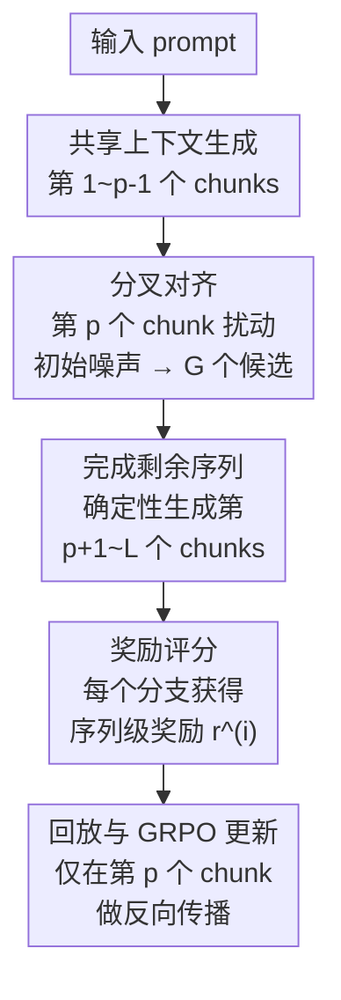

# AR-CoPO: Align Autoregressive Video Generation with Contrastive Policy Optimization

**会议**: ECCV 2026  
**arXiv**: [2603.17461](https://arxiv.org/abs/2603.17461)  
**代码**: 无  
**领域**: 视频生成 / 对齐RLHF  
**关键词**: 自回归视频生成, 对比策略优化, 强化学习人类偏好对齐, 一致性模型, 块级分叉对齐  

## 一句话总结

AR-CoPO 提出分块级对比策略优化框架来对齐少步自回归视频生成器：通过分叉机制在随机选取的 chunk 处构造初始噪声邻域候选、局部 GRPO 更新实现信用分配，绕开了 SDE 式 GRPO 与一致性模型近确定性动力学之间的根本性不匹配；同时设计半在策略训练范式利用固定参考回放和 ratio clipping 信任域来提升文本语义对齐质量，避免纯探索导致运动质量崩溃，在 Self-Forcing 上实现 VBench 和 VideoAlign 双基准联合提升。

## 研究背景与动机

**领域现状**: 扩散与流匹配模型在图像视频生成上取得了显著进展，但其双向生成推理成本随采样步数和视频长度线性增长。为支持低延迟、变长和流式生成场景，近年大量工作（CausVid、Self-Forcing、Causal-Forcing、LongLive）将强大的双向视频模型蒸馏为以逐块自回归方式运行的因果生成器。结合分布匹配蒸馏等少步蒸馏技术，推理过程可压缩到几步 ODE 求解器或一致性模型，辅以 KV 缓存进一步降本。

**现有痛点**: 然而，流式自回归结构加少步蒸馏的组合给后训练 RLHF 对齐带来显著挑战。对于流匹配生成器，策略梯度后训练（GRPO 类目标）是自然选择——将采样视为策略 rollout，用奖励反馈优化分布。但实际中的 GRPO 变体依赖一个关键实现选择：将确定性 ODE 采样转化为随机 SDE 形式以引入马尔可夫决策过程（如 DanceGRPO、FlowGRPO、BranchGRPO）。将这些 SDE 式 GRPO 方法应用到少步流式生成器时存在根本性不匹配：(1) 少步生成器（蒸馏 ODE 或一致性模型）偏离了标准流匹配 ODE，难以用连续流匹配的 SDE 方法训练；(2) 这些模型的采样轨迹短且随机性极有限，对初始噪声高度敏感，输出由初始噪声主导——而 SDE 方法严重依赖中间噪声注入来引导探索（通常冻结初始噪声），导致梯度信号近乎为零。

**核心矛盾**: 少步自回归视频生成器的近确定性动力学（输出由初始噪声主导，中间噪声几乎不改变输出）与 SDE 式 GRPO 所需的大量中间噪声探索之间存在根本性矛盾。

**切入角度**: Neighbor GRPO 提供了一种全新视角——它将 SDE-GRPO 重新解释为邻域候选轨迹上的距离驱动对比学习目标，无需在采样期间依赖随机 SDE 探索，而是在训练时通过构造初始噪声邻域并定义软最大化距离替代分布来实现可控探索，同时保持推理时的确定性 ODE 采样。

**核心 idea**: AR-CoPO 将 Neighbor GRPO 的对比视角适配到流式自回归生成场景：(1) 引入分块级对齐——只在随机选取的单个 chunk 处分叉构造邻域，其余 chunk 共享一致噪声，使信用分配自然归因到该特定 chunk；(2) 针对一致性模型将距离度量从中间潜变量 x_t 空间迁移到干净预测 x̂₀ 空间，使对比信号在语义有意义的空间生效；(3) 设计半在策略训练用固定参考回放加 ratio clipping 信任域约束，克服纯探索在全局语义奖励上的局限和 reward hacking。

## 方法详解

### 整体框架

AR-CoPO 的训练流程分为三大阶段，整体架构如下图所示：

具体来说，对于长度为 L 个 chunk 的目标序列，每次训练迭代执行以下操作：

1. **Rollout（邻域候选生成）**: 随机采样分叉 chunk 索引 p ∈ {1,…,L}。模型先生成前 p-1 个 chunk 建立共享上下文 h_{p-1}（含缓存的 KV 状态）。在第 p 个 chunk 处，基于共享初始噪声 ε*_p 构造 G 个扰动邻域噪声 {ε_p^(i)}（按公式 1）。每个分支 i 用对应噪声独立完成第 p 个 chunk 的 T 步去噪生成，结果存入回放缓冲区；然后确定性完成剩余 L-p 个 chunk——所有分支在此阶段使用完全一致的共享噪声序列，确保唯一差异仅在分叉 chunk 处。

2. **Reward（序列级奖励评分）**: 每个分支生成完整视频后，由奖励模型计算序列级奖励 r^(i)（含文本对齐 TA、视频质量 VQ、运动质量 MQ 三个维度）。

3. **Replay & Update（回放与 GRPO 更新）**: 从缓冲区检索第 p 个 chunk 的轨迹，用当前策略重放分叉 chunk，计算锚点与候选间在 x̂₀ 预测空间的欧氏距离，据此构造替代策略比率，执行裁剪 GRPO 更新——反向传播严格限制在分叉 chunk 的 T 步内。

### 关键设计

**1. 分叉式 Chunk 级对齐：通过局部噪声扰动实现序列级信用分配**

将整序列的 GRPO 直接应用到 AR 生成器上成本过高（O(L×G) 反向传播）且信用分配困难——全局奖励差时无法追溯是哪个 chunk 出了问题。AR-CoPO 的核心创新是将对齐操作严格限制在单个随机选取的 chunk。具体做法：模型先生成前 p-1 个 chunk 作为共享上下文 h_{p-1}；在第 p 个 chunk 处，将共享初始噪声 ε*_p 按 Neighbor GRPO 的扰动方式 `ε^(i) = √(1-σ²)·ε* + σ·δ^(i)` 构造 G 个邻域；每个分支用不同 ε^(i) 独立去噪该 chunk；然后所有分支共享完全一致的后续噪声（包括非分叉 chunk 的初始噪声和所有去噪步的求解器噪声），确定性完成剩余 L-p 个 chunk。

这个噪声共享控制是设计的点睛之处：它确保任意两个分支的奖励差异 r^(i)−r^(j) 唯一归因于第 p 个 chunk 的初始噪声选择，没有后续阶段的随机性混淆。更新阶段反向传播严格限制在分叉 chunk 的 T 步内，成本从 O(L×G) 降为 O(T×G)。分叉位置 p 每步随机采样，使所有 chunk 在训练中均有被对齐的机会。

**2. x̂₀ 距离对比优化：适配一致性模型的替代策略定义**

Neighbor GRPO 原始定义基于 ODE 求解器中间潜变量 x_t 的欧氏距离来构造对比替代策略，这对连续时间速度场的流匹配模型是自然的。但对一致性模型（如 Self-Forcing），情况不同：CM 的核心操作是从带噪潜变量直接一步映射到干净预测 x̂₀，不遵循标准 DDIM/ODE 轨迹。在中间 x_t 空间测距会混淆噪声尺度与语义内容，信息量不足。

AR-CoPO 将距离度量迁移到 x̂₀ 预测空间，利用 CM 的一步预测 `x̂_0,t = F_θ(x_t, h_{t-1}, t)`：

$$d_{0,t}^{(i)} = \| \hat{x}_{0,t}^{(i)} - \hat{x}_{0,t}^{(\theta)} \|_2^2, \qquad
\pi_\theta(i \mid s_t) = \frac{\exp(-d_{0,t}^{(i)} / \tau_0)}{\sum_{k=1}^G \exp(-d_{0,t}^{(k)} / \tau_0)}$$

其中 x̂_0,t^(i) 是旧参数在候选输入上的预测，x̂_0,t^(θ) 是当前参数在锚点上的预测。这个设计让距离在语义有意义的干净预测空间度量——两个 x̂₀ 接近意味着视觉内容相似，远离则语义差异大——比 x_t 空间更准确反映候选间真实差异。该距离驱动软最大化策略代入标准 GRPO 目标，自然地将锚点拉向高奖励候选、推离低奖励候选。

**3. 半在策略对齐训练：利用固定参考回放加信任域约束改善语义对齐**

纯在策略探索在文本对齐（TA）奖励上效果极差。TA 是全局语义级奖励，衡量视频是否忠实反映 prompt，而局部噪声扰动很难改变视频整体语义。实验证实（表 2）：纯在策略 TA 优化虽提升了 TA 分数，但导致运动质量 MQ 从 1.68 崩溃到 0.25、VBench Total 从 82.15 降至 79.26——严重的 reward hacking，生成视频出现运动不连续和帧间不一致。

AR-CoPO 的方案是互补训练两个独立的 LoRA 适配器，最终合并：(a) **在策略适配器**——通过扰动初始噪声探索，驱动 VQ 和 MQ 提升，训练曲线持续走高；(b) **半在策略适配器**——将 rollout 固定到参考策略（初始化 checkpoint），预收集 K=100 组参考候选存入回放缓冲区。训练时，用当前策略在锚点重新预测 x̂₀，与缓冲区中 G 个候选的旧 x̂₀ 计算距离，通过对比目标 upweight 高奖励候选、抑制低奖励候选，不依赖随机探索发现新模式。关键在于保留 GRPO 目标中的 ratio clipping 机制——它在 π_ref 周围施加隐式信任域约束，阻止策略漂离参考分布而崩溃。消融证实去掉 clipping 后 off-policy 模式各项指标全面崩溃（VBench Total 67.99）。

两个适配器以比例 scale 线性合并。论文提出"双提升准则"选择 scale：必须同时提升 VideoAlign Overall（域内）和 VBench Total（域外独立基准）。scale=0.8 满足该条件：VideoAlign 从 7.76 提升到 8.22，VBench Total 维持 82.15→82.17；超过此值（如 1.0）虽 VideoAlign 更高但 VBench Total 下降，被判定为过优化而非真实质量提升。

### 一个完整示例：L=8, p=4, G=12 的一次训练迭代

假设模型生成 8 个 chunk 的视频：(1) 随机采样 p=4，模型先生成 chunk 1-3 建立共享上下文 h₃；(2) 在第 4 个 chunk 处，以 ε*₄ 为基准构造 12 个邻域噪声 {ε₄^(1)…ε₄^(12)}，每个分支独立去噪 chunk 4（T=4 步 CM 采样）；(3) 12 个分支使用完全相同的噪声种子完成 chunk 5-8 的确定性生成，各得到一个完整视频；(4) 奖励模型给出 12 个序列级奖励 r^(1)…r^(12)，计算均值和标准差得到优势 A^(i)；(5) 回放阶段：取 chunk 4 保存的轨迹，用当前策略重预测 x̂₀，与 12 个候选的旧 x̂₀ 计算距离，构造替代策略 π_θ(i)，代入 GRPO 目标仅在 chunk 4 的 T 步上反向传播更新 θ。12 个分支中奖励最高的候选距离最短被 upweight，奖励最低的候选距离最近被 push away——信用分配精准定位到影响视频质量的那几帧。

### 损失函数 / 训练策略

AR-CoPO 的优化目标继承 Neighbor GRPO 的对比 GRPO 形式。给定 G 个候选的优势 A^(i) = (r^(i) − r̄) / σ_r 和基于 x̂₀ 距离的替代策略 π_θ(i)（公式 4），目标是：

$$J(\theta) = \frac{1}{G} \sum_{i=1}^{G} \min\left( \frac{\pi_\theta(i)}{\pi_{\text{old}}(i)} A^{(i)},\;
\operatorname{clip}\!\left( \frac{\pi_\theta(i)}{\pi_{\text{old}}(i)},\, 1-\epsilon,\, 1+\epsilon \right) A^{(i)} \right)$$

训练使用 LoRA（rank=64, α=128），学习率 1×10⁻⁵，组大小 G=12，对称锚点采样批量 4，24 块 GPU，优化目标联合三个奖励维度（TA+MQ+VQ）。半在策略回放缓冲区含 100 组 rollout。

## 实验关键数据

### 主实验

在 Self-Forcing 上与三个流式 AR 基线（Self-Forcing、Causal-Forcing、LongLive）对比如下。奖励使用 VideoAlign 套件（TA+VQ+MQ 联合优化），域外评估用 VBench（Quality / Semantic / Total）。

| 方法 | VBench Q | VBench S | VBench Total | VQ | MQ | TA | Overall |
|------|----------|----------|-------------|-----|-----|-----|---------|
| Self-Forcing | 84.87 | 71.27 | 82.15 | 3.80 | 1.68 | 2.28 | 7.76 |
| Causal-Forcing | 85.27 | 70.35 | 82.28 | 3.97 | 1.43 | 2.40 | 7.79 |
| LongLive | 85.10 | 71.16 | 82.31 | 3.87 | 1.76 | 2.43 | 8.06 |
| SF + ours (semi) | 85.15 | 71.68 | 82.45 | 3.70 | 1.60 | 2.30 | 7.61 |
| SF + ours (on-policy) | 84.81 | 70.71 | 81.99 | 4.15 | 2.06 | 2.30 | 8.51 |
| SF + ours (merged) | 85.07 | 70.55 | 82.17 | 4.00 | 1.86 | 2.36 | 8.22 |

半在策略单独即取得最佳 VBench Total（82.45），超过所有基线。合并后的完整 AR-CoPO（scale=0.8）将 VideoAlign Overall 从 7.76 提升至 8.22（+0.46），同时 VBench Total 保持 82.15→82.17，满足双提升准则，证明是真实质量提升而非域内 reward hacking。

### 消融实验

在仅优化 TA 奖励的受控条件下，对比三种训练策略：

| 策略 | VBench Q | VBench S | VBench Total | VQ | MQ | TA | Overall |
|------|----------|----------|-------------|-----|-----|-----|---------|
| Self-Forcing baseline | 84.87 | 71.27 | 82.15 | 3.80 | 1.68 | 2.28 | 7.76 |
| On-policy | 81.66 | 69.68 | 79.26 | 3.53 | 0.25 | 2.63 | 6.42 |
| Off-policy (无 ratio clipping) | 69.78 | 60.84 | 67.99 | 2.22 | -0.15 | 2.16 | 4.23 |
| Semi-on-policy | 85.15 | 71.68 | 82.45 | 3.70 | 1.60 | 2.30 | 7.61 |

此外，LoRA 合并比例的扫描显示 scale=0.8 是最优选择（满足双提升准则的最大值），scale=1.0 虽 VideoAlign 最高（8.33）但 VBench Total 降至 81.99 被判定为过优化。

### 关键发现

- **与 SDE-GRPO 对比**：SDE 式 GRPO 基线（模仿 DanceGRPO / FlowGRPO）在整个训练过程中 VQ 奖励曲线持平、无法提升；而 AR-CoPO 持续上升。主要原因在 Figure 6 的噪声替换实验中被直接证实——交换初始噪声大幅改变输出，交换中间 CM 求解器噪声几乎无变化，证明少步 CM 是近确定性的，中间噪声探索几乎没有信息量。
- **半在策略是解决 TA 优化的关键**：纯在策略 TA 优化导致 MQ 从 1.68 崩溃到 0.25——全局语义奖励无法通过局部噪声探索优化，模型走捷径（reward hacking）以牺牲运动连续性为代价提升 TA。半在策略加 ratio clipping 完全避免了这种崩溃。
- **Ratio clipping 不可或缺**：去掉 clipping 的 off-policy 训练全面崩溃（VBench Total 从 82.15 降至 67.99），验证了信任域约束对分布偏移的关键防御作用。
- **不同 reward 维度的行为差异大**：VQ 和 MQ 可通过在策略探索有效提升（表 1 的 on-policy 行 VQ 3.80→4.15，MQ 1.68→2.06），而 TA 必须通过 exploitation 路径改善。

## 亮点与洞察

- **噪声替换实验的诊断价值**（Figure 6）：通过精巧的控制变量设计——“冻结所有随机种子，仅替换初始噪声 / 仅替换某个中间步的 CM 噪声”——优雅地证实了少步一致性模型是近确定性的原因和程度。这种诊断方法可以推广到评估任何少步生成模型的随机性来源。
- **分叉机制的 credit assignment 设计**：所有非分叉 chunk 的噪声完全共享，使奖励差异纯净归因于分叉 chunk；反向传播严格限于该 chunk，计算成本 O(T×G) 而非 O(L×G)。这个"一石二鸟"的设计——同时解决信用分配和计算效率——是系统性工程智慧的体现。
- **x̂₀ 空间距离的适配决策**：看似小的改动（从 x_t 换到 x̂₀），但本质上是将对比学习从"噪声潜变量空间"迁移到"语义视觉空间"，让距离度量物理意义明确。这种"为架构适配度量空间"的思路可迁移到其他非标准采样架构（如 rectified flow、distilled 模型）。
- **半在策略 + 双 LoRA 合并的范式**：针对不同 reward 维度使用不同的优化范式（探索 vs 利用），用 LoRA 隔离训练再合并，避免了单一目标下的冲突。这个范式对任何多维度对齐任务（如文本+图像+运动多奖励）都有参考价值。
- **双提升准则防止 reward hacking**：拒绝使用单一域内指标进行模型选择，强制同时检查域外独立基准，为 RLHF 对齐的评估设立了一个简单而有效的标准。

## 局限与展望

- 实验仅在 Self-Forcing 上全面验证，在 Causal-Forcing 上的结果仅放在附录，泛化性有待更多流式 AR 生成器（如 CausVid、LongLive 等不同架构）的测试。
- 半在策略需预收集 100 组参考 rollout，引入了前期开销和额外超参数（缓冲区大小、参考策略的选择时机）；分叉位置完全随机采样，能否通过学习选择最优分叉位置进一步提升效率值得探索。
- 双 LoRA 合并使用单一全局 scale，对不同 reward 维度（TA vs VQ vs MQ）可能需要不同的合并比例，但论文仅展示了单一扫描维度上的最优选择。
- 半在策略中参考策略固定不变，但随着在策略适配器持续演化，固定参考可能会逐渐"过时"——可以探索周期性地用 EMA 更新参考策略。

## 相关工作与启发

- **vs DanceGRPO / FlowGRPO / BranchGRPO**: 这些方法通过将确定性 ODE 转换为随机 SDE 实现探索，在长轨迹扩散模型上有效，但近确定性短轨迹上失效。AR-CoPO 从初始噪声邻域而非中间噪声注入获取对比信号，从根本上绕开了近确定性限制。
- **vs Neighbor GRPO**: AR-CoPO 源自相同对比视角，但做了关键适配：(1) 全序列对齐降为 chunk 级以适配 AR 流式结构；(2) x_t 距离改为 x̂₀ 距离以适配 CM；(3) 新增半在策略范式解决全局语义奖励优化瓶颈。
- **vs Diffusion-DPO / DR-Tune**: 基于成对偏好的 DPO 方法需要人工标注或合成偏好数据；AR-CoPO 用奖励模型打分，训练信号更丰富、可伸缩。传统 RLHF for diffusion 通常需 critic 网络（如 value function），GRPO 风格无 critic 目标降低了实现复杂度。

## 评分

- 新颖性: ⭐⭐⭐⭐ 将 Neighbor GRPO 的对比视角系统适配到流式 AR 视频生成场景是方法论上的有效创新；chunk-level forking + x̂₀ 空间距离 + 半在策略的组合是工程巧妙的工作，但核心对比视角继承自 Neighbor GRPO。
- 实验充分度: ⭐⭐⭐⭐⭐ 实验设计严谨多层级——主实验设双基准（域内 VideoAlign + 域外 VBench）对比三个基线；消融实验直接对比三种训练策略；噪声替换诊断实验提供近确定性的直接证据；LoRA scale 扫描定量展示权衡；与 SDE-GRPO 的训练曲线对比提供 baseline 参照。论证链条完整。
- 写作质量: ⭐⭐⭐⭐⭐ 问题动机的建立极其清晰——Figure 2 的 SDE-GRPO 训练曲线 + Figure 6 的噪声替换实验让读者直接看到"为什么 SDE-GRPO 不 work"；方法部分的算法流程和图示衔接好；对比视角（Neighbor GRPO 的 reinterpretation）贯穿全文，逻辑一致性强。
- 价值: ⭐⭐⭐⭐ 为流式视频生成器的 RLHF 对齐提供了一套务实可靠方案，在社区关注 VideoAlign 和 VBench 双基准的背景下有直接实用价值；半在策略利用 exploitation 修复全局语义奖励的设计思路对更广泛的对齐任务有借鉴意义。

<!-- RELATED:START -->

## 相关论文

- [\[CVPR 2026\] Diverse Video Generation with Determinantal Point Process-Guided Policy Optimization](../../CVPR2026/video_generation/diverse_video_generation_with_determinantal_point_process-guided_policy_optimiza.md)
- [\[ACL 2026\] Accelerating Training of Autoregressive Video Generation Models via Local Optimization with Representation Continuity](../../ACL2026/video_generation/accelerating_training_of_autoregressive_video_generation_models_via_local_optimi.md)
- [\[ECCV 2026\] PhyGDPO: Physics-Aware Groupwise Direct Preference Optimization for Physically Consistent Text-to-Video Generation](phygdpo_physics-aware_groupwise_direct_preference_optimization_for_physically_co.md)
- [\[ICLR 2026\] Flow Caching for Autoregressive Video Generation](../../ICLR2026/video_generation/flow_caching_for_autoregressive_video_generation.md)
- [\[ICML 2026\] Light Forcing: Accelerating Autoregressive Video Diffusion via Sparse Attention](../../ICML2026/video_generation/light_forcing_accelerating_autoregressive_video_diffusion_via_sparse_attention.md)

<!-- RELATED:END -->
