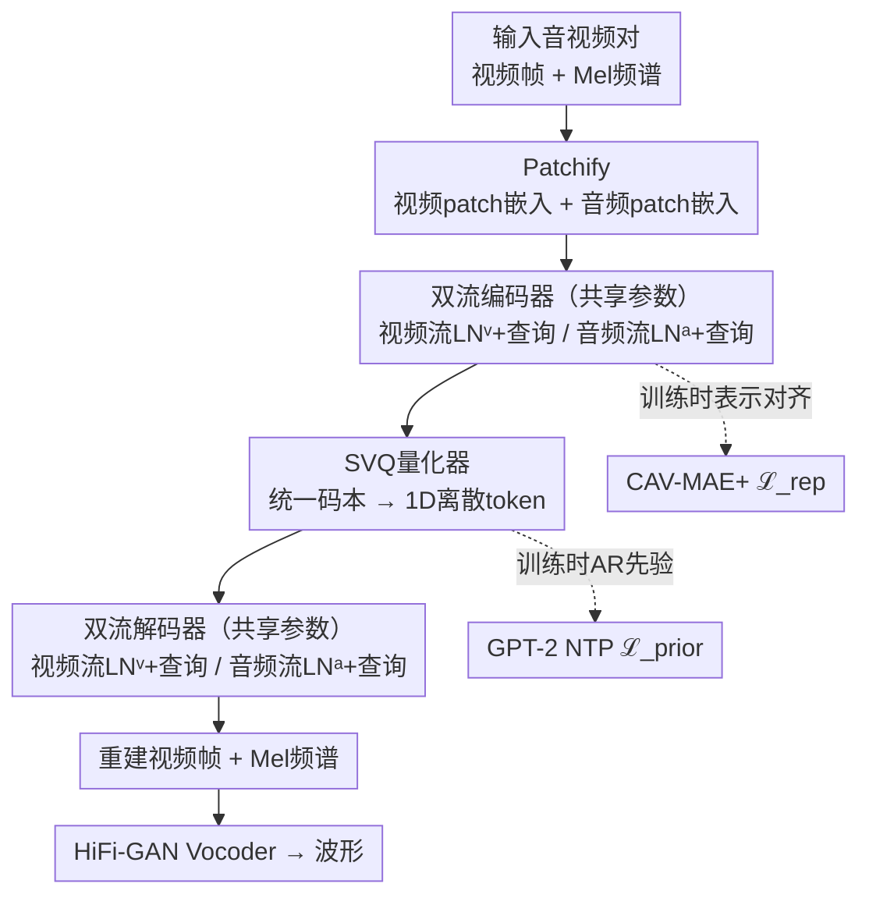

# AVTok: 1D Unified Tokenization for Holistic Audio-Video Generation

**会议**: ECCV 2026  
**arXiv**: [2606.30811](https://arxiv.org/abs/2606.30811)  
**项目**: [https://hkust-longgroup.github.io/AVTok/](https://hkust-longgroup.github.io/AVTok/)  
**代码**: 无（论文承诺后续开源）  
**领域**: 视频生成 / 音视频生成  
**关键词**: 音视频生成, 统一tokenization, 1D离散隐空间, 双流Transformer, 自回归生成

## 一句话总结
AVTok 提出首个统一的音视频 tokenizer，用双流 Transformer 架构（共享编解码器 + 模态特定可学习查询）将音视频对联合编码到单个 1D 离散隐空间，配合 VFAL 分层训练策略和表示对齐学习，在重建质量和下游自回归生成任务（A2V / V2A / 联合生成）上均达到领先水平，且参数量和计算量远小于主流双分支方案。

## 研究背景与动机
音视频生成（A2V、V2A、联合音视频生成）近年来备受关注，但主流方法普遍采用**双分支架构**：为音频和视频各配一套独立的 tokenizer 和生成模块，中间再插入额外的跨模态交互模块。这套设计有两个根本问题：第一，独立训练的 tokenizer 学到的嵌入空间存在**表示鸿沟（representation gap）**，导致生成的音频和视频之间出现语义不对齐；第二，双分支架构**计算开销极大**（如 Ovi 的 tokenizer + generator 合计近 1B + 17B 参数），训练和部署成本高，难以规模化。

本文的核心洞察是：如果能用一个统一的 tokenizer 把音视频对联合编码到**同一个隐空间**，不仅能从根本上消除表示鸿沟，还能省掉笨重的双分支生成架构。但挑战在于，视频原始是 3D 时空数据，音频原始是 1D 波形——数据结构完全不同，该怎么统一？幸运的是，近期的 1D 视频 tokenization 工作（LARP、AdapTok）已经证明，用可学习查询（learnable queries）可以将视频压缩成 1D 离散 token，这与音频天然的 1D 结构在形式上对齐了。沿着这条路，AVTok 将视频和音频都 tokenize 成 1D 离散隐表示，用**双流共享架构 + 统一码本**实现联合编码，成为这个方向上第一个吃螃蟹的工作。

**核心 idea**：用双流 Transformer（共享编解码器 + 模态特定查询和归一化层）将音视频对联合编码到一个统一码本的 1D 离散隐空间，配合「先视频后音频」的分层训练策略解决模态信息不平衡问题。

## 方法详解

### 整体框架
AVTok 的目标是输入一个音视频对（视频帧序列 + 音频），输出一组紧凑的 1D 离散 token，这些 token 既能高质量重建原始音视频，又能直接喂给自回归生成模型做下游任务。整个流程分五步：（1）将视频帧和音频 Mel 频谱分别 patchify 成嵌入序列；（2）通过**双流**（视频流 / 音频流各走一次前向）共享编码器，用各自的可学习查询（learnable holistic queries）提取全局信息；（3）用 SVQ 量化器将查询对应的隐向量映射到统一码本，得到离散 token；（4）对称地通过双流共享解码器重建视频帧和 Mel 频谱；（5）Mel 频谱经 HiFi-GAN vocoder 还原为波形。训练时额外引入 CAV-MAE+ 做表示对齐、以及一个轻量 AR 先验模型（GPT-2）做 next-token prediction 来塑造 AR 友好的隐空间。

### 关键设计

**1. 双流Transformer：模态特定查询 + 共享编解码器，解决表示鸿沟和模态冲突**

直接拼接音视频 patch 送进单流 Transformer（vanilla 版本）理论上能实现跨模态融合，但实验表明这种朴素设计效果很差——视频信息密度远高于音频，训练时视频流会压制音频流的学习，导致一方或双方重建质量下降。AVTok 的解决方案借鉴了 CAV-MAE 的双流哲学：编码器和解码器的**所有注意力层和 MLP 层参数共享**，但为视频流和音频流各自配备**独立的一组 LayerNorm 参数**（$LN_1^v, LN_2^v$ 和 $LN_1^a, LN_2^a$）以及**独立的可学习查询**（视频 holistic queries $\mathbf{Q}_L^v \in \mathbb{R}^{1024 \times d}$、音频 holistic queries $\mathbf{Q}_L^a \in \mathbb{R}^{128 \times d}$，以及各自的 patch queries）。

视频流和音频流**分两次前向传播**经过同一个编码器：每次只输入一个模态的 patch 嵌入和对应查询，但共享的注意力层隐式地融合了跨模态信息（因为参数是同一份，两次前向的梯度会叠加）。量化器 $\mathcal{Q}$ 也是共享的，使用同一个 SVQ 码本，确保视频和音频 token 落在同一个离散空间。解码时同样分两次前向，各自用自己的 patch queries 重建对应模态。这种「参数共享 + LN/查询分离」的设计非常巧妙：共享参数提供了隐式跨模态交互的通道，分离的 LN 和查询则保护了每个模态的独特性，避免了单流模型中的模态压制问题。同时，双流设计使得在下游任务中可以**按需单独编码条件模态**（例如 V2A 时只走视频流得到条件 token），而 vanilla 单流版本做不到这一点。

**2. VFAL分层训练：先视频后音频的渐进式训练，解决信息密度不平衡**

即使有了双流架构，从零开始联合训练音视频仍然不理想：视觉信息丰富且稠密，音频信息相对稀疏，联合训练时梯度会被视频主导。AVTok 提出 VFAL（Video-First-Audio-Later）三层渐进训练策略：

- **Stage 1（视频重建，75 epochs）**：只训练视频流——编码器和解码器（含视频专用 LN）、视频可学习查询、量化器和 AR 先验模型。音频流完全丢弃。目标是先建立一个强健的视频 token 隐空间。此时 $\lambda_1=1.0, \lambda_2=0.0, \lambda_3=0.0, \lambda_4=0.06$，$\mathcal{L}_{prior}$ 只用视频 token $\mathbf{x}^v$ 计算。
- **Stage 2（音频重建，35 epochs）**：冻结编码器、解码器和视频流所有参数（共享参数 + 视频 LN + 视频查询），**只训练**音频专用 LN（编码器和解码器中的 $LN_1^a, LN_2^a$）、音频可学习查询（$\mathbf{Q}_L^a, \mathbf{Q}_P^a$）、AR 先验模型和表示对齐的 MLP 投影器 $h_\phi$。此时 $\lambda_1=0.1, \lambda_2=1.0, \lambda_3=0.5, \lambda_4=0.06$。直觉是：Mel 频谱可以视为灰度图，冻结的共享参数已经具备「图像」处理能力，音频流只需学会自己的「读法」即可。
- **Stage 3（精调，10 epochs）**：只微调解码器（含两个模态的 LN），进一步统一音视频重建质量。此时 $\lambda_1=1.0, \lambda_2=0.01, \lambda_3=0.5, \lambda_4=0.06$。

这种分阶段策略强制模型按「先难后易」的顺序学习，每阶段目标明确，避免了多模态联合训练中的梯度竞争。消融实验证明去掉 VFAL 后重建 rFVD 从 12.80 升到 13.19、rFAD 从 5.93 升到 9.38，下游生成也大幅下降。

**3. 表示对齐学习：借助预训练AV基础模型增强跨模态语义对齐**

双流架构中跨模态交互仅靠共享参数隐式实现，论文发现这种隐式融合不足以让模型充分学习音视频之间的语义对应关系。为此，AVTok 引入一个**预训练的音频-视觉基础模型** CAV-MAE+（$\mathcal{M}_F$）作为「对齐教师」：将编码器输出的 patch-wise 连续隐向量 $\tilde{\mathbf{Z}}^v, \tilde{\mathbf{Z}}^a$（即编码器输出中不含查询的那部分 patch token）线性插值到与 $\mathcal{M}_F$ 输出相同长度后，用一个小的 MLP 投影器 $h_\phi$ 映射，再与 $\mathcal{M}_F$ 对同一输入提取的 patch 特征 $\mathbf{Z}_F^v, \mathbf{Z}_F^a$ 计算余弦相似度，最大化两者的一致。表示对齐损失 $\mathcal{L}_{rep}$ 为：

$$\mathcal{L}_{rep} = -\mathbb{E}\left[\sum_{i\in\{a,v\}}\frac{1}{N_i}\sum_{k=1}^{N_i}\text{sim}(\mathbf{Z}_F^{i}[k], h_\phi(\text{interp}(\tilde{\mathbf{Z}}^{i})[k]))\right]$$

这里 $\mathcal{M}_F$ 和 $h_\phi$ 在训练中更新，$\mathcal{M}_F$ 在推理时丢弃。效果：去掉 $\mathcal{L}_{rep}$ 后 rFAD 从 5.93 升到 8.48，说明对齐损失对音频重建尤其重要。消融还发现用更强的 CAV-MAE Sync 替换 CAV-MAE 能带来一致的提升。

**4. 跨模态AR生成先验：用NTP目标塑造AR友好的离散隐空间**

AVTok 的 holistic queries 是无序集合，Transformer 编码器的并行处理也不会自然产生序列顺序，但下游自回归生成需要一个有序的 token 序列。延续 LARP 的做法，AVTok 在训练时挂一个轻量 GPT-2 作为 AR 先验模型 $\mathcal{M}_P$，对两种拼接顺序（$\mathbf{x}^v \|\mathbf{x}^a$ 和 $\mathbf{x}^a \|\mathbf{x}^v$）分别计算 next-token prediction 的负对数似然损失 $\mathcal{L}_{prior}$，梯度反传回 tokenizer 的编码器和量化器，迫使隐空间自发形成适合 AR 生成的序列结构。$\mathcal{M}_P$ 只在训练时存在，推理时丢弃。消融显示：去掉 $\mathcal{L}_{prior}$ 反而获得最好的重建指标（rFVD 10.63 vs 12.80），但下游生成质量暴跌（gFVD 266.82 vs 150.26）——这正是 AR 先验的经典 trade-off：它为下游生成任务牺牲了一部分重建保真度，换取隐空间的序列化结构。

### 一个完整示例：VFAL三阶段训练走一遍

以一个来自 VGGSound 的 16 帧「弹吉他」音视频片段为例（128x128 分辨率、约 4 秒、22kHz 单声道音频），走一遍 VFAL 训练流程：

**Stage 1（视频重建，75 epochs）**：输入视频帧 $\mathbf{V} \in \mathbb{R}^{16 \times 128 \times 128 \times 3}$，经 patchify（$f_T=4, f_H=8, f_W=8$）得到 1024 个 $d$ 维 patch 嵌入 $\mathbf{E}^v \in \mathbb{R}^{1024 \times d}$。编码器接收 $\mathbf{E}^v$ 与 1024 个可学习 holistic queries $\mathbf{Q}_L^v$ 拼接（共 2048 个 token），经 12 层共享 Transformer（使用视频专用 LN）处理后，取前 1024 个 query 对应输出经 SVQ 量化得 1024 个离散 token $\mathbf{x}^v$。解码器用 1024 个 patch queries $\mathbf{Q}_P^v$ 与 dequantized token 拼接，经 12 层解码器（视频专用 LN）重建 1024 个 patch 嵌入，reshape 回视频帧，计算 $\mathcal{L}_{rec}^v$ 和 $\mathcal{L}_{prior}$（此时只用 $\mathbf{x}^v$ 的单向 NTP）。75 epochs 后，AVTok 学会了把「吉他手拨弦、手指移动」等视觉信息压缩进 1024 个离散 token，视频 rFVD 从初始高位收敛到约 13-14。

**Stage 2（音频重建，35 epochs）**：冻结 Stage 1 的所有共享参数和视频专用组件。将同一片段的音频转为 Mel 频谱 $\mathbf{A} \in \mathbb{R}^{80 \times 384}$，patchify（$f_M=16, f_L=16$）得 120 个音频 patch 嵌入 $\mathbf{E}^a \in \mathbb{R}^{120 \times d}$。编码器接收 $\mathbf{E}^a$ 与 128 个音频 holistic queries $\mathbf{Q}_L^a$ 拼接，复用 Stage 1 的共享注意力参数但使用新初始化的音频专用 LN。量化器统一码本输出 128 个离散 token $\mathbf{x}^a$，解码器重建 Mel 频谱后经 HiFi-GAN 还原为「吉他琴弦震动声」。此时 $\mathcal{L}_{rec}^a$ 为主损失（权重 1.0），$\mathcal{L}_{rep}$ 首次启用——CAV-MAE+ 提取的音频 patch 特征指导编码器 patch token 学习语义对齐。因为共享注意力层已具备从「视觉 patch」中提取信息的通用能力（Mel 频谱本质是灰度图），35 epochs 内音频流就能学会寄生在这个通用表示上，音频 rFAD 从约 20 降至约 6。

**Stage 3（精调，10 epochs）**：只微调解码器（含视频和音频双流的 LN），联合优化四项损失。10 epochs 后视频 rFVD 从纯视频训练后的水平进一步改善（跨模态隐式融合生效，rFVD 降至 12.80），音频 rFAD 稳定在 5.93。最终得到的 1152 个 token（1024 视频 + 128 音频）就是「弹吉他」这段音视频内容的统一 1D 表示——在下游任务中，这 1152 个 token 可以直接喂给 Llama-like AR 模型做 A2V（给定音频 token 预测视频 token）、V2A（反向）或 cJAVG（给定类别 token 预测全部 1152 个 token）。

### 损失函数 / 训练策略

总损失由四项加权组成：

$$\mathcal{L} = \lambda_1 \mathcal{L}_{rec}^v + \lambda_2 \mathcal{L}_{rec}^a + \lambda_3 \mathcal{L}_{rep} + \lambda_4 \mathcal{L}_{prior}$$

其中 $\mathcal{L}_{rec}^v$ 含 L1 重建损失 + LPIPS 感知损失 + GAN 对抗损失（ViT-based Discriminator）+ SVQ 量化损失，权重 (1.0, 1.0, 0.3, 0.1)；$\mathcal{L}_{rec}^a$ 含多尺度 Mel 频谱重建损失 + 深度特征匹配损失 + GAN 对抗损失（Multi-Scale Sub-Band CQT Discriminator + Multi-Period Discriminator）+ SVQ 量化损失，权重 (15.0, 2.0, 1.0, 0.1)。判别器每 5 步更新一次，学习率为 tokenizer 的 70%，并使用 LeCam 正则化稳定训练。四个损失权重 $\lambda_{1,2,3,4}$ 在 VFAL 三阶段动态调整（见关键设计 2）。优化器为 Adam（$\beta_1=0.9, \beta_2=0.95$），base lr=0.0001，余弦调度，三阶段 warm-up 分别为 8/3/1 epochs，batch size 均为 112。

## 实验关键数据

### 主实验

**重建对比**（Table 1，TAVGBench + VGGSound 测试集）：因统一音视频 tokenization 是全新任务，无直接可比的开放基线，AVTok 分别与视频-only 和音频-only 的 SOTA 1D tokenizer 对比。AVTok 在视频重建上全面超越所有视频-only 基线（包括 LARP），在音频重建上接近专用音频 codec 水平。

| 类型 | 方法 | 配置 | #Tokens | PSNR↑ | rFVD↓ | LPIPS↓ | SI-SDR↓ | rFAD↓ | MR-STFT↓ |
|------|------|------|---------|-------|-------|--------|---------|-------|----------|
| VO | OmniTokenizer | 17×128×128 | 1280 | 23.84 | 90.99 | 0.203 | - | - | - |
| VO | AdapTok | 16×128×128 | 2048 | 23.87 | 22.23 | 0.180 | - | - | - |
| VO | LARP | 16×128×128 | 1024 | 24.53 | 14.24 | 0.137 | - | - | - |
| AO | WavTokenizer | 98304×1 (W) | 164 | - | - | - | 24.27 | 6.82 | 1.589 |
| AO | SpectralCodec | 80×384 (M) | 384 | - | - | - | 29.30 | 5.56 | 1.514 |
| AV | Vanilla (单流) | 16×128×128 / 80×384 | 1152 | 24.50 | 14.87 | 0.140 | 35.45 | 10.26 | 2.114 |
| **AV** | **AVTok** | 16×128×128 / 80×384 | 1152 | **25.62** | **12.80** | **0.126** | 23.09 | 5.93 | 1.523 |

> 注：Vanilla 是本文实现的单流基线（直接拼接音视频 patch 送共享编码器）。AVTok 的视频 PSNR 比 LARP 高 1.09dB，音频 rFAD 接近 SpectralCodec（5.93 vs 5.56），证明了联合编码不仅可行，跨模态信息还能互相增强。

**生成对比**（Table 2，VGGSound 测试集）：AVTok + AR 生成模型（Llama-like Transformer，约 208M tokenizer + 632M generator）在 A2V / V2A / cJAVG 三个任务上与专用方法对比，以远小于对方的总参数量取得有竞争力的结果。

| 任务 | 方法 | 生成范式 | Tokenizer参数量 | Generator参数量 | gFVD↓ | gFAD↓ | DeSync↓ | IB-Score↑ |
|------|------|----------|-----------------|-----------------|-------|-------|---------|-----------|
| A2V | TempoTokens | Diffusion | 83.7M | 1.9B | 786.61 | - | 1.359 | 0.132 |
| A2V | **AVTok-A2V** | AR | 208.4M | 632.0M | **150.26** | - | **1.317** | **0.143** |
| V2A | MMAudio | Flow Matching | 298.5M | 1.3B | - | 17.09 | 0.813 | 0.291 |
| V2A | **AVTok-V2A** | AR | 208.4M | 632.0M | - | 49.47 | 1.239 | 0.249 |
| cJAVG | JavisDiT | Flow Matching | 448.7M | 8.9B | 1040.28 | 268.51 | 1.330 | 0.195 |
| cJAVG | Ovi | Flow Matching | 988.6M | 17.3B | 972.65 | 129.02 | 0.814 | 0.172 |
| cJAVG | **AVTok-cJAVG** | AR | 208.4M | 632.4M | **138.80** | **56.58** | 1.319 | **0.206** |

> 注：AVTok 在 A2V 的 gFVD（150.26 vs 786.61）和 cJAVG 的 gFVD（138.80 vs 972.65+）上大幅领先，尤其是 cJAVG 比 Ovi（17.3B）和 JavisDiT（8.9B）的总参数量小一个数量级但仍显著领先。V2A 的 gFAD（49.47）弱于 MMAudio（17.09），但优于 V-AURA、SpecVQGAN 等方法，且 MMAudio 的 generator 参数多一倍。

### 消融实验

| 配置 | 重建 rFVD↓ | 重建 rFAD↓ | A2V gFVD↓ | V2A gFAD↓ | cJAVG gFVD↓ | cJAVG gFAD↓ |
|------|-----------|-----------|-----------|-----------|-------------|-------------|
| Vanilla (单流) | 14.87 | 10.26 | - | - | - | - |
| **AVTok (完整)** | **12.80** | **5.93** | **150.26** | **49.47** | **138.80** | **56.58** |
| w/o VFAL | 13.19 | 9.38 | 209.33 | 61.02 | 193.28 | 80.78 |
| w/o $\mathcal{L}_{rep}$ | 12.90 | 8.48 | 182.15 | 54.16 | 184.20 | 75.09 |
| w/o $\mathcal{L}_{prior}$ | **10.63** | **3.47** | 266.82 | 67.84 | 249.47 | 90.11 |

### 关键发现
- **双流架构是基础，但 VFAL 训练策略是关键放大器**：去掉 VFAL 后重建和生成全面崩坏（rFAD 从 5.93 升至 9.38，A2V gFVD 从 150 升至 209），说明即使架构正确，不按正确顺序训练也无法发挥效果。
- **AR 先验的经典 trade-off 被量化验证**：去掉 $\mathcal{L}_{prior}$ 重建反而最好（rFVD 10.63 vs 完整 12.80），但下游生成全线崩溃（gFVD 普遍上升 80-110 点），说明 $\mathcal{L}_{prior}$ 本质上在为生成任务牺牲重建保真度来换取隐空间的序列化结构。
- **视频 token 数量对音频重建也有显著影响**：当视频 holistic token 从 1024 减半到 512 时，不仅视频 rFVD 从 12.80 升至 23.85，音频 rFAD 也从 5.93 升至 14.90——说明视频流承载的跨模态信息对音频重建有辅助作用；反之减少音频 token 对视频影响较小。
- **生成效率优势巨大**：AVTok-cJAVG 总推理延迟 12.76s / 3.48 TFLOPs，而 Ovi 需 87.28s / 14.99K TFLOPs，JavisDiT 需 32.24s / 2.60K TFLOPs，AVTok 在效率上有数量级优势。

## 亮点与洞察
- **「参数共享 + LN/查询分离」是双流设计的精髓**：不是简单的双编码器，而是同一套参数被两个模态「轮流使用」——共享注意力层提供隐式跨模态交互，分离的 LN 和查询保护模态独特性。这个设计模式可以迁移到任何需要融合异构模态的场景（如视频+文本、图像+深度图），核心原则是「能共享的共享，不能共享的分离」。
- **VFAL 的「先难后易」哲学具有通用性**：先训练信息密度更高的模态建立强表示空间，再让信息稀疏的模态在这个空间上「寄生」学习，最后联合精调。这个思路可以推广到任何多模态联合训练中存在信息不平衡的场景（如 RGB+深度、点云+图像、视频+字幕）。
- **用外部基础模型做表示对齐是一个低成本提升多模态融合质量的手段**：CAV-MAE+ 只是一个训练时的「拐杖」，推理时丢弃，不增加推理开销。这个 pattern（外部冻结模型 + 小投影器 + 对齐损失）已经在 DeRA、REPA 等工作中有先例，AVTok 证明了它在多模态 tokenization 场景同样有效。
- **1D 离散 tokenization 统一音频和视频是概念上非常优雅的设计**：它把「3D vs 1D」的模态差异问题转化为「都用 1D，只是 patch 维度和数量不同」，为未来构建统一的多模态大模型（一个模型同时理解和生成音视频）铺平了道路。

## 局限与展望
- **分辨率受限**：受限于计算资源，AVTok 只在 16 帧 128x128 分辨率、约 4 秒 22kHz 音频上训练和评估。扩展到更长时长、更高分辨率需要突破位置编码和计算量的瓶颈。
- **同步建模是隐式的**：目前 AVTok 仅通过同步音视频输入 + 共享参数 + AR 先验隐式捕捉跨模态时序同步，生成结果仍可能出现音画不同步（DeSync 指标 1.317-1.319，弱于 Ovi 的 0.814）。显式建模时间对齐（如引入同步损失或时间感知的注意力机制）是直接且重要的改进方向。
- **VFAL 三阶段训练流程复杂**：虽然有效，但需要手动设置每阶段的训练模块、epoch、损失权重，调参成本高，且阶段间可能存在级联误差。探索端到端单阶段训练（可能借助动态损失调度或课程学习）有望简化流程。
- **数据规模有限**：训练数据仅 640K（TAVGBench 子集 460K + VGGSound 180K），远小于当前视频生成模型的数据规模。更大的数据量和场景多样性很可能会进一步提升泛化性。
- **音频重建仍不及专用 codec**：AVTok 的 SI-SDR（23.09）与 SpectralCodec（29.30）仍有差距，说明统一 tokenization 在音频保真度上还有妥协。可能需要在解码器端引入更强的音频专用模块或后处理。

## 相关工作与启发
- **vs LARP / AdapTok / DeRA（1D视频tokenizer）**：AVTok 直接继承 LARP 的 query-based holistic tokenization 架构和 AR 先验训练机制，核心扩展是从单模态视频拓展到音视频联合编码。与 AdapTok 的自适应时序因果和 DeRA 的时空解耦不同，AVTok 的创新在于「双流共享」的架构设计而非 token 组织方式。
- **vs CAV-MAE / CAV-MAE+**：两者是 AV 预训练的代表作，使用双流架构 + 对比学习做自监督表示学习。AVTok 借鉴了其双流思想用于 tokenization 而非表示学习，且 AVTok 的 tokenization 是 holistic（全局查询）而非 patch-wise local。另外 CAV-MAE+ 在 AVTok 中被作为对齐教师使用，形成了「用 AV 表示模型训练 AV tokenizer」的有趣闭环。
- **vs Ovi / JavisDiT（联合音视频生成）**：这些方法代表了当前主流——双分支 VAE + 双分支 DiT，参数巨大但质量高。AVTok 在参数量上远小于它们，A2V 和 cJAVG 的指标甚至更好，但 V2A 的音频质量（gFAD）和同步指标（DeSync）还有差距。这暗示统一的 AR 范式在视频生成侧有天然优势（AR 天然的序列建模能力匹配视频的时序特性），但在音频精细度上不如扩散/流匹配方法。

## 评分
- 新颖性: ⭐⭐⭐⭐⭐ 首次提出「统一音视频 tokenization」这个任务本身就有开创性，双流共享架构 + VFAL 训练策略的设计也巧妙务实
- 实验充分度: ⭐⭐⭐⭐ 重建和三个下游生成任务都做了充分对比，消融覆盖架构和训练组件，附录还补充了效率、缩放、token 数量、外部模型选择等分析；扣一分是因为主实验缺乏直接可比的统一 tokenizer 基线（确实是领域空白，非作者之过）
- 写作质量: ⭐⭐⭐⭐ 结构清晰，动机和图解（Fig.2 表示鸿沟、Fig.3 方法总览）让读者很快抓住核心；附录细节充分，可复现性好
- 价值: ⭐⭐⭐⭐⭐ 为「统一多模态 tokenization → 统一多模态生成模型」这条路线提供了第一个可行方案，概念简洁、效果扎实、效率优势显著，有潜力影响后续音视频生成乃至通用多模态大模型的研究方向

<!-- RELATED:START -->

## 相关论文

- [\[ECCV 2026\] MMControl: Unified Multi-Modal Control for Joint Audio-Video Generation](mmcontrol_unified_multi-modal_control_for_joint_audio-video_generation.md)
- [\[CVPR 2026\] AdapTok: Learning Adaptive and Temporally Causal Video Tokenization in a 1D Latent Space](../../CVPR2026/video_generation/adaptok_learning_adaptive_and_temporally_causal_video_tokenization_in_a_1d_laten.md)
- [\[CVPR 2026\] Archon: A Unified Multimodal Model for Holistic Digital Human Generation](../../CVPR2026/video_generation/archon_a_unified_multimodal_model_for_holistic_digital_human_generation.md)
- [\[ICLR 2026\] JavisDiT++: Unified Modeling and Optimization for Joint Audio-Video Generation](../../ICLR2026/video_generation/javisdit_unified_modeling_and_optimization_for_joint_audio-video_generation.md)
- [\[ICML 2026\] T2AV-Compass: Towards Unified Evaluation for Text-to-Audio-Video Generation](../../ICML2026/video_generation/t2av-compass_towards_unified_evaluation_for_text-to-audio-video_generation.md)

<!-- RELATED:END -->
