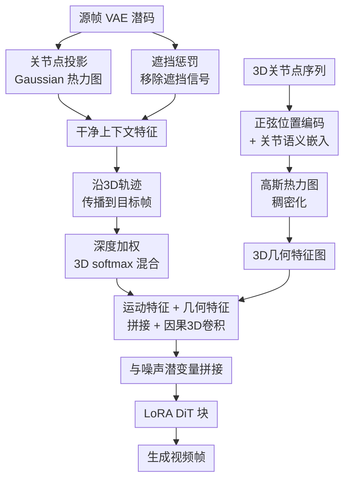

# Controllable Egocentric Video Generation via Occlusion-Aware Sparse 3D Hand Joints

**会议**: ECCV2026  
**arXiv**: [2603.11755](https://arxiv.org/abs/2603.11755)  
**代码**: [https://zhangcyg.github.io/handcontrolvideo/](https://zhangcyg.github.io/handcontrolvideo/)  
**领域**: 视频生成  
**关键词**: 第一人称视频生成, 手部姿态控制, 3D关节点, 遮挡感知, 扩散模型

## 一句话总结

本文提出用稀疏3D手部关节点作为显式控制信号驱动第一人称视频生成，通过遮挡移除的上下文聚合、3D深度加权的遮挡感知传播和3D几何嵌入三个关键设计，在WAN 2.1基础上以仅~20k参数的轻量模块实现精细的手物交互视频控制，性能大幅超越现有2D轨迹和隐式姿态方法。

## 研究背景与动机

可控视频生成正在从"生成好看的内容"走向"模拟物理世界的视觉世界模型"。在这一趋势下，运动控制（motion-controlled）视频生成成为核心方向，尤其在需要理解精细手物交互的第一人称（egocentric）场景中，模型必须同时保持高频的手部关节运动细节、在频繁遮挡下维持几何合理性、并严格跟随运动轨迹的空间一致性。这三个要求对现有范式构成了根本性挑战。

现有控制范式分为两类。轨迹类方法（如WAN-Move、MotionStream）把运动流当作孤立的2D点轨迹，丢弃了手的刚性结构完整性，天然缺乏深度感知——当手指在3D空间中交叉运动时，2D投影无法区分前后层次，产生的运动细节常常不真实。姿态类方法（如EgoControl、Mask2IV）要么将手部姿态编码成压缩的低频潜码（平滑了精细关节细节），要么投影成2D骨骼图或掩码（当手指重叠时变成一团视觉混乱），同样无法给生成器提供清晰的空间指引。两类方法共同的软肋是：**它们都缺乏处理密集遮挡所需的显式3D几何理解**。

本文的核心洞察非常直接：稀疏3D手部关节点是比2D轨迹和隐式姿态更适合第一人称视频生成的控制信号，因为它同时具备三个关键优势——显式3D几何解决遮挡歧义、稀疏直观的接口支持交互式编辑、跨形态泛化（可直接迁移到机械手）。但直接注入3D关节点并非易事：源帧中哪些关节被遮挡了不该贡献视觉特征、目标帧中前景手指跨过背景手指时特征该给谁、如何在2D潜空间中保留3D结构信息——这些都必须逐一解决。**核心idea：构建一套遮挡感知、几何保持的3D手部控制框架，将稀疏3D关节点拆成两条注入流——一条做遮挡感知的运动特征聚合与传播，一条做显式3D几何嵌入——以极轻量模块（~20k参数）精确驱动第一人称视频生成。**

## 方法详解

### 整体框架

本文以WAN 2.1图像到视频（I2V）扩散Transformer为基础，在其条件注入通道中叠加了一个极轻量的3D手部控制模块。核心流程分两条并行注入流：

第一流是**遮挡感知运动特征**：从参考帧（源帧）的VAE潜码中，对每个3D关节点的投影位置进行局部高斯上下文聚合，同时用成对遮挡惩罚项抑制被遮关节的不可靠纹理特征；然后将这些"干净"的视觉特征沿3D关节轨迹传播到目标帧，传播时使用3D深度加权的softmax机制处理交叉遮挡导致的特征冲突。

第二流是**3D几何嵌入**：每个关节点同时带有3D坐标（2D位置+深度）的正弦位置编码和可学习的语义索引嵌入（告诉模型"这是拇指"、"这是食指"），两者拼合后经MLP投影，再用高斯热力图稠密化成几何特征图。两条流的输出拼接后经因果3D卷积头部处理（确保时间因果性），最终与噪声潜变量、视觉条件拼接后送入LoRA微调的DiT块。

### 关键设计

**1. 遮挡移除的上下文聚合（OCA）：从源帧中提取不被遮挡污染的关节视觉特征**

对于第一人称手物交互，源参考帧中常常存在严重的手指自遮挡。如果直接对关节点的投影位置采样VAE特征，被遮的手指会"偷"到前景手指的纹理，后续生成中当被遮手指重新露出来时就会产生幻觉（比如拇指纹理出现在食指生成中）。解决这个问题的直觉很自然：特征聚合时应只关注"看得见"的关节，而抑制"被遮住"的关节的信号。

具体做法分两步。首先，对每个3D关节点$\mathbf{J}_i$，通过相机内参投影到2D坐标$\mathbf{u}_i$并取深度（视差$d_i$），以$\mathbf{u}_i$为中心生成高斯热力图$\mathbf{M}_i$作为空间上下文聚合的权重。其次，定义成对遮挡惩罚$P_{i\leftarrow j}$，它由两个因子乘积构成——空间重叠度（两关节投影位置的高斯距离）和深度次序（用sigmoid判断关节$j$是否比关节$i$更靠近相机）。如果$P_{i\leftarrow j}$接近1，意味着关节$j$几乎确定遮挡了关节$i$。最终，第$i$个关节的上下文特征$\mathbf{f}_i$被加权为$\mathbf{f}_i = (1 - \max_{j\neq i} P_{i\leftarrow j}) \cdot \text{GaussianPooling}(\mathcal{Z}_0(\mathbf{u}_i))$——当一个关节的可见度系数$(1-\max P)$接近0时，其特征贡献被完全抑制，防止错误纹理传播。

**2. 遮挡感知的特征传播（OP）：用3D深度加权解决目标帧的轨迹交叉冲突**

得到源帧的干净特征$\mathbf{f}_i$后，需要将它们沿关节3D轨迹传播到各目标帧，为生成提供运动指引。这里的关键难题是目标遮挡（target occlusion）：当手指在运动中交叉重叠时，不同关节的投影在2D图像坐标上直接重叠，简单求和会把前景和背景的特征混在一起。

本文的解决方案是一个类似**可微Z-buffer**的3D加权机制。对每个目标帧$t$和关节$i$，在2D投影位置$\mathbf{u}_{i,t}$处生成热力图$\mathbf{M}_{i,t}$，同时带入该关节在该帧的深度$d_{i,t}$。然后在每个像素$\mathbf{x}$上对全部$N$个关节做带深度偏置的softmax加权：

$$\mathbf{A}_{i,t}(\mathbf{x}) = \text{softmax}_i\left(\log(\mathbf{M}_{i,t}(\mathbf{x})+\epsilon) + \lambda \cdot d_{i,t}\right)$$

其中$\lambda$是可学习的深度锐度参数。空间接近度由对数热力图决定，而深度项让靠近相机的关节获得更高的logit值。当多个关节的投影重叠时，softmax将绝大多数权重分配给离相机最近的关节（即前景手指），从而"穿透"背景关节正确保留前层特征。最终的运动条件特征图是对所有关节特征按softmax权重的凸组合，再乘上一个总不透明度掩码（标出有关节存在的区域），做到精确的空间定位。

**3. 3D几何嵌入（3DGE）：在潜空间中显式保留3D结构和语义身份**

仅靠传播的视觉纹理特征本质上仍是2D的：3D到2D的投影不可避免地压缩了几何信息，也模糊了不同手指的语义身份（"哪根手指正在做什么动作"）。为此，本文引入第二条控制流，直接在潜空间中注入显式3D信息。

具体地，对关节$i$在帧$t$的3D坐标（2D位置$\mathbf{u}_{i,t}$和视差$d_{i,t}$），用正弦位置编码$\gamma(\cdot)$映射到连续频率域；同时为每个关节点关联一个可学习的语义身份嵌入$\mathbf{E}_{id}[i]$（告诉模型"这是第1个关节，它是拇指顶端"）。两者拼接后经浅层MLP$\phi$投影为联合嵌入$\mathbf{z}_{i,t}$，再用之前的高斯热力图$\mathbf{M}_{i,t}$将其"喷溅"（splat）到整个空间网格上，得到稠密的几何特征图$\mathcal{F}_{geo}$。运动特征$\mathcal{F}_{motion}$与几何特征$\mathcal{F}_{geo}$拼接后，经过一个因果3D卷积层处理——因果卷积沿时间方向做非对称padding，确保当前帧的几何引导只聚合历史信息而不泄露未来帧。整个控制模块仅约20k参数，远轻于ControlNet类方案，对预训练潜空间的扰动极小。

### 损失函数 / 训练策略

模型以WAN 2.1的连续时间条件流匹配（flow matching）为目标函数，使用LoRA（rank=64）微调DiT骨干，控制模块参数从头训练。训练数据来自Ego4D自动化标注管线产出的~100万条高质量视频片段，在16块GH200上训练约48小时。训练时还引入随机关节掩码策略：对5%的输入关节坐标置零，迫使模型学会在被遮挡或用户提供稀疏编辑时合理补全缺失关节的运动。

## 实验关键数据

### 主实验

在Ego4D和EgoDex两个数据集上与掩码类（Mask2IV）、2D骨架类（WAN-Fun）、2D轨迹类（MotionStream、WAN-Move）方法对比，同时报告视觉质量指标和3D手部精度指标。

| 数据集 | 指标 | 本文 | 次优方法 | 提升幅度 |
|--------|------|------|----------|----------|
| Ego4D | FVD ↓ | **259.99** | 303.54 (WAN-Fun) | 14% |
| Ego4D | MPJPE ↓ | **1.42** | 9.11 (WAN-Move) | 84% |
| Ego4D | MPVPE ↓ | **1.70** | 3.28 (MotionStream) | 48% |
| EgoDex | FVD ↓ | **174.73** | 178.67 (WAN-Fun) | 2.2% |
| EgoDex | MPJPE ↓ | **1.80** | 5.21 (WAN-Move) | 65% |
| EgoDex | MPVPE ↓ | **1.82** | 2.04 (WAN-Move*) | 11% |

注：MPJPE为Procrustes对齐后的平均关节点位置误差（mm），MPVPE为平均网格顶点误差。本文在所有指标上取得最优或次优，尤其在手部精度指标上拉开决定性差距。

### 消融实验

| 配置 | Ego4D FVD ↓ | Ego4D MPJPE ↓ | 说明 |
|------|-------------|---------------|------|
| 仅OCA（遮挡移除聚合） | 305.49 | 2.75 | 已超越WAN-Move* |
| OCA + OP（加传播遮挡感知） | 300.99 | 2.10 | OP贡献：MPJPE降23% |
| OCA + OP + 3DGE（完整模型） | 259.99 | 1.42 | 3DGE贡献：FVD再降11%，MPJPE降32% |

三个组件层层递进：OCA解决源帧遮挡带来的纹理污染，OP解决目标帧运动时的轨迹交叉冲突，3DGE显式编码3D结构信息，三者缺一不可。其中3DGE对视觉质量（FVD）和控制精度（MPJPE）的提升均最显著。

### 关键发现

- 与强基线WAN-Move在同等数据上训练相比（WAN-Move*），本文在EgoDex数据集上将MPJPE从5.21降至1.80（降幅68%），说明3D控制信号对复杂手物交互至关重要。
- 用户研究（2AFC, 30人×30个视频）显示本文在感知视频质量和运动准确度两个维度均显著胜出所有基线。
- 在机械手（Unitree G1-Dex3-1、H1-Inspire）上仅需少量微调即可迁移，验证了3D关节的形态不变性——不像骨骼图或隐式姿态那样编码了人类特有的运动学假设。

## 亮点与洞察

- **轻量化的3D控制注入**：整个控制模块仅~20k参数（LoRA微调骨干，不依赖ControlNet那种重头训练副本），与WAN 2.1的解耦极好——这是实践层面的重要优势，使方法容易集成到现有生成管线。
- **可微Z-buffer的思路简洁有效**：用3D深度加权的softmax做特征传播本质上就是渲染管线中的Z-buffer深度测试，把它变成可微模块移植到视频生成中，巧妙地将计算机图形学的经典手段适配到生成模型。
- **交互式单关节编辑**：由于控制信号是稀疏3D关节点，用户可以拖拽单个关节（比如只动拇指）而保持其他关节不变——这在2D轨迹方法中做不到（拖一个2D点会影响投影重叠区域的所有运动），为视频编辑提供了全新的微操作粒度。

## 局限与展望

- 数据依赖：100万片段均来自Ego4D，场景多样性受限于原数据集（主要是日常室内活动），对户外、快速运动等极端场景的泛化能力未知。
- 3D关节点需要外部上游模型（WiLoR）提取，管线中的级联误差（hand detection → MANO重建 → 跟踪 → 质量过滤）在高遮挡场景下可能累积，论文虽做了随机掩码鲁棒性训练，但实际部署时仍依赖上游跟踪质量。
- 当前方案聚焦单帧到视频生成（I2V），扩展到纯视频到视频（输入全是视频、无干净参考帧）或更长时域生成时，遮挡感知传播的时序一致性可能面临挑战。

## 相关工作与启发

- **vs WAN-Move / MotionStream（2D轨迹方法）**：这两类方法把运动表示为2D点轨迹，对没有刚性结构的一般物体运动工作良好，但在手部这种高关节自由度、频繁自遮挡的场景中失去了3D几何信息。本文的核心差异在于用3D关节替代2D点，并且对症设计了遮挡处理的三件套。
- **vs WAN-Fun / Mask2IV（2D姿态/掩码方法）**：这些方法把手部姿态投影到2D骨架图或掩码图作为控制信号，存在拓扑歧义（手指交叉时无法区分层次）和深度信息丢失的问题。3D关节直接避免了这些信息压缩损失。
- **vs EgoControl（隐式姿态编码）**：EgoControl将姿态编码成压缩潜码，低频特性平滑了精细关节细节。本文用3D坐标加语义嵌入的显式编码保留了高频空间精度。

## 评分

- 新颖性: ⭐⭐⭐⭐ 用稀疏3D关节点做视频生成控制不是首次提出，但论文针对第一人称场景中特有的遮挡问题设计了三件套（OCA + OP + 3DGE），方案完整、动机清晰，且"可微Z-buffer"的思想简洁有启发性。
- 实验充分度: ⭐⭐⭐⭐⭐ 在2个数据集上与5种基线对比，覆盖视觉质量、3D手部精度、用户研究、消融、跨形态迁移、交互式编辑等多维度评估，实验设计很完整。
- 写作质量: ⭐⭐⭐⭐⭐ 问题定义清晰、动机链完整、方法解释详细（图+公式+消融环环相扣），是典型的好读论文。
- 价值: ⭐⭐⭐⭐ 为第一人称视频生成提供了一个即插即用的3D控制模块，代码和自动化标注管线均开源，对Ego4D社区贡献了一个百万级标注数据集，落地价值高。

<!-- RELATED:START -->

## 相关论文

- [\[CVPR 2026\] EgoControl: Controllable Egocentric Video Generation via 3D Full-Body Poses](../../CVPR2026/video_generation/egocontrol_controllable_egocentric_video_generation_via_3d_full-body_poses.md)
- [\[CVPR 2026\] Open-world Hand-Object Interaction Video Generation Based on Structure and Contact-aware Representation](../../CVPR2026/video_generation/open-world_hand-object_interaction_video_generation_based_on_structure_and_conta.md)
- [\[CVPR 2026\] EgoX: Egocentric Video Generation from a Single Exocentric Video](../../CVPR2026/video_generation/egox_egocentric_video_generation_from_a_single_exocentric_video.md)
- [\[CVPR 2026\] HVG-3D: Bridging Real and Simulation Domains for 3D-Conditional Hand-Object Interaction Video Synthesis](../../CVPR2026/video_generation/hvg-3d_bridging_real_and_simulation_domains_for_3d-conditional_hand-object_inter.md)
- [\[ICML 2026\] CamGeo: Sparse Camera-Conditioned Image-to-Video Generation with 3D Geometry Prior](../../ICML2026/video_generation/camgeo_sparse_camera-conditioned_image-to-video_generation_with_3d_geometry_prio.md)

<!-- RELATED:END -->
