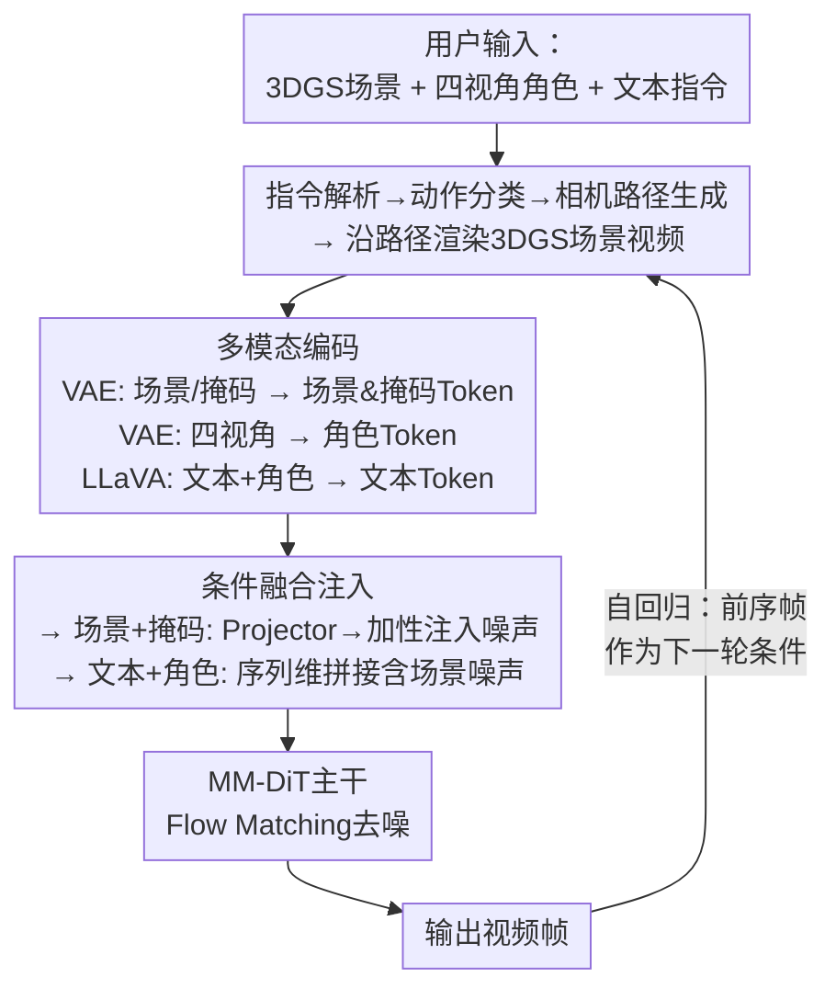

# CustomX: Unified Character, Action, and Scene Customization in Video World Models

**会议**: ECCV 2026  
**arXiv**: [2512.17796](https://arxiv.org/abs/2512.17796)  
**代码**: 待确认  
**领域**: 视频生成  
**关键词**: 世界模型, 可控视频生成, 角色定制, 3DGS场景, 文本驱动动作控制

## 一句话总结

CustomX将3DGS场景、多视角角色与文本指令统一建模为条件自回归视频生成问题，用户提供任意场景与角色后可通过自然语言驱动角色执行上百种动作，在生成质量、角色一致性和动作控制成功率上全面超越基础模型与专用世界模型。

## 研究背景与动机

视频世界模型近年来在动态环境模拟方面取得了长足进步。现有方法大致分为两个阵营：一是静态世界生成模型（如Matrix3D、WorldMirror），它们能构建可供自由探索的3D环境，但场景中缺乏活跃的智能体，本质上是一个"空舞台"；二是可控实体模型（如Hunyuan-GameCraft、Matrix-Game），它们允许单个实体在预设路径上执行有限动作（如前进、左转），但动作种类受限且场景本身不可控——用户的输入只能走预定义的几条路，无法让角色在环境中做有意义的事情。两个范式各覆盖了交互的一半：前者有场景无角色，后者有角色但动作匮乏、场景固定。

这种分裂的核心矛盾在于：要实现"用户指定角色与场景，自由执行开放动作"，需要同时解决场景几何一致性、角色外观一致性与动作多样性三者间的联合约束。这要求模型理解3D空间结构、将角色多视角外观泛化到不同姿态、同时保持与文本指令的语义对齐——任何一块缺失都会导致视觉不一致或控制失效。现有方法要么只做场景建模，要么只做有限角色控制，缺乏统一的处理范式。长时序生成中的视觉退化则是另一关键挑战：没有持续的空间锚点，角色在连续生成中容易模糊或漂移。

本文的切入角度非常直接：既然预训练视频生成模型已经具备强大的视觉先验和泛化能力，关键在于如何将场景、角色、动作这三种条件以合适的方式注入到生成过程中。**核心 idea：将3DGS场景、多视角角色和文本指令统一建模为条件自回归视频生成问题——场景与掩码通过VAE编码作为空间锚点以加性方式注入噪声隐变量，文本与角色通过LLaVA和VAE分别编码后在全注意力层拼接，在预训练的HunyuanCustom上以LoRA微调激活其开放动作控制能力，实现用户用自然语言驱动任意角色在任意3D场景中执行上百种动作的统一框架。**

## 方法详解

### 整体框架

CustomX将"角色在场景中执行动作"建模为多条件控制的视频生成问题。给定一个3DGS场景和任意角色的四视角图像（前/左/后/右），用户通过自然语言指定动作，模型输出一段与场景和角色视觉一致的视频片段，并支持多轮迭代生成长时序视频。

整个框架建立在预训练HunyuanCustom（13B参数）之上，采用Flow Matching训练目标。工作流程分为四个阶段：首先，文本指令被解析为四种动作类型之一（位移/手势/物体交互/相机行为），每种类型对应不同的相机路径生成策略；然后，系统沿该路径渲染3DGS场景视频作为显式的场景条件；同时，所有输入通过VAE和LLaVA编码为Token序列；最终，不同条件以差异化策略注入到MM-DiT主干中完成去噪。多轮交互时，前一片段的末段作为自回归条件参与下一轮生成。

### 关键设计

**1. 结构化数据管线：从GTA-V游戏实录到条件生成样本**

训练数据是CustomX的基础。论文利用GTA-V游戏引擎作为数据源，通过一套自动化流水线将原始游戏回放转化为结构化的条件生成样本。先录制游戏过程并切分为129帧的单动作片段，然后执行三步处理：用Grounded-SAM-2分割角色并提取边界框掩码序列；用DiffuEraser将角色区域修补为纯场景背景，得到干净的场景视频；为每个片段标注文本指令标签（如"The character is running forward"）。此外还从GTA-V中提取角色3D模型，渲染为前/左/后/右四个视角作为角色的视觉表征。最终每个样本包含视频、场景视频、掩码序列、文本标签和四视角角色图像五个分量。这套管线的巧妙之处在于将游戏引擎中天然存在的角色-场景-动作三元组分解成了条件生成所需的独立模态——角色分割与场景修补将视频拆为"前景角色+背景场景"两个可控分量，为后续多条件注入奠定了数据基础。最终构建了包含2084个视频片段、5个角色的训练集。

**2. 多模态条件联合注入：场景/掩码的加性融合与角色/文本的全注意力拼接**

CustomX的核心架构挑战是如何将四种不同粒度的条件（场景、掩码、角色、文本）有效注入到视频生成过程中。论文设计了差异化的融合策略：场景Token $\mathcal{T}_S$和掩码Token $\mathcal{T}_M$沿通道维拼接后经轻量Projector映射到噪声隐变量维度，然后以加法方式直接注入到噪声隐变量中

$$\mathbf{x}'_t = \mathbf{x}_t + \text{Projector}([\mathcal{T}_S; \mathcal{T}_M])$$

这种加性注入让场景几何和角色位置信息从一开始就融入去噪过程的每个时间步，相当于给生成锚定了"在什么空间、角色该出现在哪"。而文本Token和四视角角色Token则采取序列维拼接的方式与含场景条件的噪声$\mathbf{x}'_t$一起送入全注意力Transformer层，让自注意力机制自动学习文本语义、角色外观与生成内容之间的关联。对于位置编码，场景和掩码使用标准3D-RoPE保证时空位置一致；四个角色视角则使用带不同时间偏移的3D-RoPE（-1到-4），让模型区分各视角的观察方位，同时将这些视角"置于"生成视频时间序列之前，帮助模型理解每个视角在生成内容中对应的空间方向。

**3. 自回归生成与时序锚定：前序帧条件与训练-推理一致性优化**

为了支持多轮交互和长视频生成，CustomX引入了自回归模式。训练时将目标视频Token沿时间维分成两部分：前四分之一作为"前序视频Token"，剩余四分之三作为当前轮要生成的目标。模型以前序Token为额外条件预测后续内容。一个关键技巧是：训练时前序Token来自真实视频，但推理时来自模型自身生成——这种分布偏移会导致误差累积和时序退化。为此，论文在训练中对前序Token添加微量高斯噪声，模拟推理时的偏移，让模型学会容忍一定程度的生成噪声。推理流程也经过精心设计：用户只需在场景中放置虚拟相机并指定单帧锚点框（标记角色首帧位置），系统自动将锚点传播到所有后续帧。文本指令被解析为四种类型之一，每种对应固定的相机行为：位移动作相机跟随角色前进，手势和物体交互相机静止，相机控制则生成对应轨迹（如环绕）。

### 损失函数 / 训练策略

模型采用Flow Matching训练目标，对噪声$\mathbf{x}_0 \sim \mathcal{N}(\mathbf{0}, \mathbf{I})$与目标Token $\mathcal{T}_V$的线性插值路径$\mathbf{x}_t = (1-t)\mathbf{x}_0 + t\mathcal{T}_V$，训练模型预测速度场$\mathbf{v}_t$，最小化与真实速度$\mathbf{u}_t$的MSE损失。主干基于HunyuanCustom（13B），使用LoRA（rank=64）微调注意力与全连接层，冻结LLaVA编码器和场景条件Projector。场景条件以0.3概率随机丢弃以增强对文本和角色条件的依赖。360P模型在8张H100上5000步训练，720P模型在8张B200上5000步训练，均使用AdamW优化器，学习率1e-4。推理阶段采用DMD2蒸馏将30步去噪压缩为4步，推理时间从121秒降至21秒（360P单卡H100），DINOv2得分仅从0.698微降至0.669。

## 实验关键数据

### 主实验

论文从WorldScore综合指标、动作控制成功率（人工评估）和角色一致性（DINOv2/CLIP）三个维度与7个方法对比。

| 方法 | WorldScore(静态) | WorldScore(动态) | 动作控制成功率(运动) | 动作控制成功率(新动作) | DINOv2角色一致性 |
|------|-----------------|-----------------|---------------------|----------------------|-----------------|
| CogVideoX1.5-I2V | 56.77 | 42.13 | 23.3% | 21.1% | 0.594 |
| HunyuanVideo-I2V | 55.14 | 27.30 | 26.7% | 35.2% | 0.645 |
| Wan2.1-I2V | 55.87 | 37.32 | 26.7% | 64.8% | 0.627 |
| HunyuanCustom | 61.11 | 47.19 | 56.7% | 51.4% | 0.558 |
| Hunyuan-GameCraft† | 57.77 | 77.45 | 16.7% | - | 0.329 |
| **CustomX** | **77.22** | **88.91** | **100.0%** | **80.7%** | **0.698** |

### 消融实验

| 配置 | DINOv2得分 | 说明 |
|------|-----------|------|
| 无锚点掩码 | 0.477 | 模型无法区分角色与背景 |
| 仅首帧锚点 | 0.597 | 锚点不传播到后续帧 |
| 全帧锚点 | 0.698 | 每帧边界框锚定角色位置 |
| 单视角角色 | 0.556 | 仅用前视角 |
| 前后双视角 | 0.613 | 前+后 |
| 四视角角色 | 0.698 | 前+左+后+右，全量配置 |
| 仅游戏数据 | 0.686 | GTA-V训练，角色偏游戏渲染风格 |
| 混合真实数据 | 0.755 | GTA-V+400个真实视频，角色更逼真 |

### 关键发现

- 角色锚点掩码是最关键的组件：去掉后DINOv2得分从0.698降至0.477（降幅达32%），说明模型需要显式区分动态前景与静态背景的机制
- 多视角角色输入呈量化递增趋势：从单视角0.556到前后双视角0.613再到四视角0.698，每个新的视角都贡献了实实在在的DINOv2提升
- 后训练激活了预训练模型的泛化能力：仅在2084个基础运动样本上微调，对142种未见动作（手势、物体交互）达到了80.7%控制成功率，这一"预训练+小数据后训练"范式与LLM中GPT-3 instruct-tuning的行为高度一致
- DMD2蒸馏的7.5倍加速几乎无损：推理速度从121秒降至21秒，DINOv2仅从0.698降至0.669，实际可用性大幅提升
- 混合游戏-真实数据训练能够消除游戏渲染风格偏差，角色真实性得到显著提升（0.686→0.755）

## 亮点与洞察

- **"后训练激活"范式在视频生成中的成功移植**：最有趣的发现在于，仅用2000+基础运动数据LoRA微调就能大幅提升预训练模型的动作生成能力，且模型对新动作的泛化能力几乎完整保留——这与LLM中"预训练获取知识、后训练激活能力"的范式完全一致，为视频生成领域的模型能力激活提供了可复用的方法论
- **四种条件、两种融合策略的精准分工**：场景和掩码使用加性注入保留空间锚点，角色和文本使用全注意力拼接保留语义灵活性，每种条件放对了位置。这种按语义类型差异化注入的设计思路值得迁移到其他多条件生成任务中
- **结构化数据管线的自动化闭环**：利用游戏引擎生成+自动分割修补，整套管线无需人工标注即可产出角色-场景-动作三元组，大大降低了数据获取成本。同样的管线有望推广到其他需要场景解耦的视频生成任务
- **锚点机制的简洁高效**：仅用一个边界框掩码作为角色位置的显式锚点，就解决了模型混淆前景与背景的根本问题，比复杂的掩码预测或注意力约束简洁得多

## 局限与展望

- 仅支持单角色场景，无法同时控制多个角色交互——这是从训练数据（GTA-V单人动作）到架构设计（单角色条件注入）的系统性限制
- 推理仍未达到实时（4步蒸馏后21秒/段，720P需159秒），离可交互应用仍有距离。虽然DMD2大幅加速，但实时性仍是视频世界模型落地的核心瓶颈
- 数据主要依赖GTA-V游戏引擎，虽然混合了400段真实视频，但真实场景的泛化能力仍需更大规模的真实数据验证
- 动作解析依赖预设的四种固定相机路径策略，对于复杂多步动作的处理能力有限（如"走到桌前拿起电话并拨打"需要动作序列分解能力）
- 论文未讨论角色与场景物理交互中的一致性问题（如角色坐在椅子上时椅子的形变和受力反应）

## 相关工作与启发

- **vs 静态世界生成模型（Matrix3D/WorldMirror）**: 这些模型构建可探索的3D环境但无活跃角色，CustomX在其基础上引入可控制的角色和丰富动作，使场景从"空舞台"变为"有演员的舞台"
- **vs 可控实体世界模型（Hunyuan-GameCraft/Matrix-Game）**: 这些模型支持游戏式镜头导航但角色动作限于数种基本位移，CustomX通过自然语言驱动支持上百种动作，且场景本身可自由切换而非固定
- **vs 主体一致视频生成（HunyuanCustom/VACE）**: 这些模型通过参考图像保持主体外观但无法控制主体动作和场景；CustomX在保持角色一致的同时引入了场景几何锚点和开放动作控制

## 评分

- 新颖性: ⭐⭐⭐⭐⭐ 首次提出统一3DGS场景、任意角色和开放动作的条件视频生成框架，填补了世界模型中场景+角色+动作联合控制的空白
- 实验充分度: ⭐⭐⭐⭐⭐ 从WorldScore、动作成功率、角色一致性到长时序质量和推理速度，评估维度全面；消融实验清晰量化每个组件的贡献
- 写作质量: ⭐⭐⭐⭐ 方法描述清晰、示意图丰富，但部分训练细节和完整对比需查阅附录
- 价值: ⭐⭐⭐⭐⭐ 直接拓展了视频世界模型的可控性边界，为可交互虚拟世界生成提供了实用的技术方案

<!-- RELATED:START -->

## 相关论文

- [\[ECCV 2026\] Learning Transferable Dynamics Priors from Action to World Modeling](learning_transferable_dynamics_priors_from_action_to_world_modeling.md)
- [\[CVPR 2025\] World2Act: Latent Action Post-Training via Skill-Compositional World Models](../../CVPR2025/video_generation/world2act_latent_action_post-training_via_skill-compositional_world_models.md)
- [\[CVPR 2026\] HandWorld: Hand-Centric Unified Video Action Generation](../../CVPR2026/video_generation/handworld_hand-centric_unified_video_action_generation.md)
- [\[ECCV 2026\] MemLearner: Learning to Query Context Memory for Video World Models](memlearner_learning_to_query_context_memory_for_video_world_models.md)
- [\[ICLR 2026\] Vid2World: Crafting Video Diffusion Models to Interactive World Models](../../ICLR2026/video_generation/vid2world_crafting_video_diffusion_models_to_interactive_world_models.md)

<!-- RELATED:END -->
