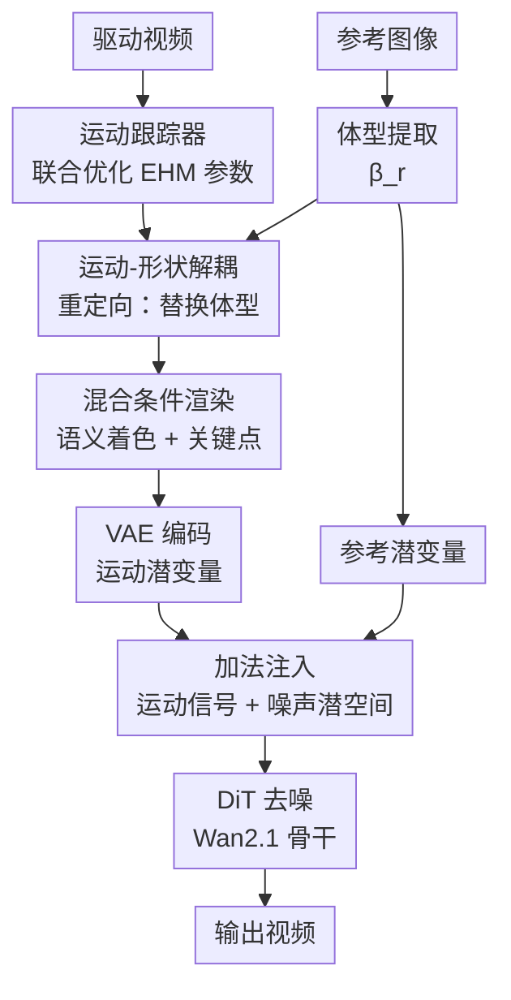

# EMOSH: Expressive Motion and Shape Disentanglement for Human Animation

**会议**: ECCV 2026  
**arXiv**: [2606.28026](https://arxiv.org/abs/2606.28026)  
**代码**: 待确认  
**领域**: 视频生成  
**关键词**: 人体动画, 运动-形状解耦, 三维参数化人体模型, 扩散模型, 置信感知跟踪

## 一句话总结

EMOSH 利用具有丰富表达能力的三维参数化人体模型 EHM 作为控制信号，通过显式的形状-姿态参数解耦从根本上消除体型泄漏问题，结合粗到细的混合运动注入和空间对齐条件机制，在保持精细表情和手势控制的同时实现高保真的人体动画生成。

## 研究背景与动机

可控人体动画是数字人、影视内容创作等应用的核心技术。当前主流方法采用 2D 骨架姿态作为扩散模型的控制信号（如 Animate Anyone、HyperMotion、Wan-Animate 等），能够通过 ReferenceNet 等方式较好地保留参考人物的外观信息。然而这类方法天生存在"运动-形状耦合"问题——2D 骨架隐式编码了驱动人物的体型，即使通过姿态重定向也无法彻底消除，导致生成视频中参考人物的体型被驱动人物"污染"。另一方面，部分工作（如 Champ、RealisDance）尝试使用 SMPL 等 3D 参数化模型渲染的深度图或法向图作为条件，在几何层面实现了形状与运动的解耦。但 SMPL 模型的表达能力局限在肢体级别的粗粒度控制上，无法刻画面部表情和复杂手势，生成结果僵硬死板，在精细控制上远不如 2D 姿态方法。

这种"表达能力"与"解耦能力"之间的两难局面是当前人体动画的核心矛盾：2D 姿态方法控制精细但会泄漏体型，3D 网格方法解耦干净但控制粗糙。一个关键观察是，如果采用表达能力更强的 3D 参数化模型——能够同时建模身体、手势、面部表情，就有望在不牺牲控制精度的前提下实现运动-形状解耦。除此之外，现有方法还有一个深层问题常被忽视：训练时使用同源视频的自驱动数据（空间天然对齐），但推理时面对的是不同人物的跨驱动任务（空间未对齐）。这种域间隙会随着自回归生成长视频时误差持续累积，导致身份漂移和视觉伪影。

本文的**核心 idea**是借助表达能力更强的三维参数化人体模型 EHM（整合 SMPL-X 与 FLAME），显式解耦体型参数与运动参数，从根本上消除体型泄漏；同时设计粗到细的混合运动注入策略弥补纯网格渲染缺失的高频细节，并以空间对齐条件机制弥合训练-推理域间隙，实现既精细又解耦的高保真人体动画。

## 方法详解

### 整体框架

EMOSH 基于 Wan2.1-I2V 的 DiT 骨干架构，以 LoRA 形式微调适配人体动画任务。整体流程如下：给定一段驱动视频和一张参考图像，首先通过置信感知运动跟踪器估计视频每帧的 EHM 参数（姿态 θ、表情 ψ、体型 β、相机 C），同时从参考图像提取体型参数 β_r；随后对驱动网格进行重定向——保留驱动视频的姿态和表情参数，注入参考图像的体型参数，实现运动与形状的显式解耦；重定向后的网格经过语义着色和稀疏关键点绘制两种方式渲染为混合条件图，经 VAE 编码后以加法形式注入到噪声潜空间中；对于长视频生成的后序片段，额外在潜变量序列中插入首个视频块首帧的空间对齐潜变量作为视觉锚点，缓解身份漂移。整体在 DiT 去噪网络中以 Flow Matching 目标完成生成。

### 关键设计

**1. 基于 EHM 的表达性运动表征与置信感知跟踪**

纯 2D 姿态方法无法解耦体型，而 SMPL 等传统 3D 模型又受限于肢体级粗粒度控制。EMOSH 引入 EHM（Expressive Human Model）作为核心表征——它整合 SMPL-X 与 FLAME，将人体参数化分解为身体体型 β_b、头部体型 β_f、表情系数 ψ、姿态参数 θ 四个独立部分，通过线性混合蒙皮（LBS）生成 3D 网格。这种分解使得运动与形状天然解耦，且能同时表达身体、手部、面部三个层次的动作，将网格控制的表达能力上限提升到与 2D 姿态旗鼓相当的水平。

为了从单目视频中鲁棒估计这些参数，论文设计了一个置信感知联合优化跟踪器。与 GUAVA 的级联式跟踪（先优化面部再优化身体）不同，EMOSH 采用统一框架同时恢复身体、手部、面部和相机参数。核心难点在于 2D 关键点估计在复杂场景下不可靠——例如大角度转头时面部关键点偏移、手部遮挡时误重现在画面中。方案是引入置信感知有效性门控：对于手部，同时检查关键点置信度和 3D 网格投影与图像边界的 IoU，仅当手部严格可见时才使用关键点监督；对于面部，计算头部朝向与相机视角的夹角，在大角度或背面场景下将面部关键点损失权重置零，防止强制对齐导致结构崩溃。联合优化的总损失如下：

$$ \mathcal{L}_{ehm} = \lambda_{kpt}\mathcal{L}_{kpt} + \lambda_{3d}\mathcal{L}_{hand}^{3D} + \lambda_{reg}\mathcal{L}_{reg} + \lambda_{smooth}\mathcal{L}_{smooth} $$

其中 2D 重投影损失通过可微渲染将 3D 顶点投影到 2D 平面并与检测值计算 L1 距离，深度分量通过 3D 手部顶点对齐损失（Z 轴权重放大 10 倍）解决手势深度歧义，平滑项惩罚帧间参数抖动来消除逐帧检测噪声。

**2. 运动-形状显式解耦：参数级重定向**

跨驱动推理时，直接使用驱动视频的跟踪网格必然泄漏驱动人物的体型。EMOSH 通过 EHM 的参数级重定向从根本上解决此问题：将驱动人物的姿态 θ^d 和表情 ψ^d 与参考人物的身体体型 β_b^r 和头部体型 β_f^r 重新组合：

$$ M_{ehm}^{target} = M_{ehm}(\theta^d, \psi^d, \beta_b^r, \beta_f^r) $$

这样生成的网格在运动上完全忠实于驱动视频，而体型严格锚定于参考人物。实际操作中体型替换会改变身体比例，导致头部渲染位置偏移甚至出画。解决方案是计算原始驱动网格与替换体型网格在第一帧的头部平均 Y 坐标差，将整个重定向网格施加全局 Y 轴偏移，消除面部错位。

**3. 粗到细混合运动注入：融合全局几何与局部高频细节**

纯网格渲染主要提供低频信号——在远距离或低分辨率下，渲染图会丢失眨眼、嘴唇闭合等微表情变化，而这正是过去网格类方法不如 2D 姿态方法的关键短板。EMOSH 将两种互补信号混合：首先在标准 T 姿态下将每个顶点的归一化 3D 坐标映射为固定 RGB 值，通过可微渲染生成稠密的语义着色条件图，让网络从空间上区分不同身体区域（这是"粗"层级，提供全局结构）。然后从中选取一组关键语义顶点（如眼角、嘴角），用不同颜色显式绘制到渲染图上（这是"细"层级，补充高频细节）。最终条件图经 VAE 编码和轻量嵌入层后直接以加法形式注入噪声潜变量。这种设计巧妙地把"低频结构+高频细节"合并在同一张条件图中，在保持解耦能力的同时达到了 2D 姿态方法的控制精度——消融实验显示去掉关键点绘制后眨眼等精细表情的生成质量显著下降。

**4. 空间对齐条件机制：弥合训练-推理域间隙**

这是一个容易被忽视但影响深层的问题。训练时参考帧与目标帧来自同一视频，天然空间对齐；推理时跨身份数据存在空间错位。随着自回归生成逐帧推进，模型注意力逐渐偏移到空间对齐的时间潜变量上，忽视原始参考潜变量，身份一致性随时间显著退化。关键洞察是：第一个视频块的首帧潜变量天然具有空间对齐性。方案是在生成第一个视频块后保留其首帧潜变量，后续所有视频块在拼接序列中将其插入到原始参考潜变量与时间潜变量之间。这个锚点潜变量累积的误差远少于递归生成的时间潜变量，能有效重新分配模型注意力，防止过度依赖带噪的时间线索。训练时通过随机几何增强（旋转、平移）以 50% 概率模拟空间错位，并以 10% 概率随机注入辅助参考帧，让模型提前适应含有空间对齐潜变量的推理模式。

### 损失函数 / 训练策略

模型基于 Wan2.1-I2V-14B 骨干，以 LoRA（秩 32）微调 DiT 模块，学习率 1×10⁻⁴。训练采用 Flow Matching 目标函数（最优传输路径），随机采样 77 帧 512×512 的视频片段。训练数据约 90 万段视频（互联网人体视频 37.8% + SpeakerVid 60.6% + VFHQ 1.6%），在 32 张 H20 GPU 上训练约 100 小时、6500 轮迭代。推理时采用基于重叠帧的自回归策略，前一个视频块的最后 5 帧编码为时间潜变量作为后续块的上下文。

## 实验关键数据

### 主实验

在自驱动场景（同源视频/首帧重建）下，EMOSH 在三个数据集上全面超越所有基线方法：

| 数据集 | 指标 | EMOSH | Wan-Animate | HyperMotion | Champ |
|--------|------|-------|-------------|-------------|-------|
| EchoMimicV2 | PSNR↑ | **23.66** | 22.86 | 22.32 | 17.40 |
| EchoMimicV2 | LPIPS↓ | **0.1428** | 0.1802 | 0.1800 | 0.2911 |
| TikTok | PSNR↑ | **17.80** | 17.18 | 15.48 | 13.34 |
| Self-collected | PSNR↑ | **21.18** | 20.72 | 19.48 | 14.85 |

跨驱动场景下，EMOSH 的 Identity Preservation Score（IPS，基于 ArcFace 面部特征余弦相似度）达到 **0.4445**，显著高于 Wan-Animate（0.3802）和 HyperMotion（0.2872）。人工评估（GSB 两两对比）中，EMOSH 以 89.21%、98.42%、95.62% 的胜率分别击败 Wan-Animate、HyperMotion、UniAnimate-DiT。

### 消融实验

| 配置 | EchoMimicV2 PSNR↑ | IPS↑ | 说明 |
|------|-------------------|-------|------|
| Full (EMOSH) | **23.66** | **0.4445** | 完整模型 |
| w/o Tracker | 20.51 | — | 使用现成估计器代替运动跟踪器，表情和手势控制精度大幅下降 |
| w/o Hybrid Motion | 22.90 | — | 去掉 2D 关键点绘制，仅用纯网格渲染，高频细节（眨眼等）丢失 |
| w/o Disentanglement | — | 0.4258 | 去掉 EHM 重定向，驱动人物体型泄漏 |
| w/o SAC | — | 0.4237 | 去掉空间对齐条件，身份保持退化，长视频伪影增加 |

### 关键发现

- 置信感知运动跟踪器贡献最大：去掉后 PSNR 从 23.66 降至 20.51，且跟踪速度是 GUAVA 的 1.9 倍（436 帧视频 223s vs 424s）。
- 混合运动注入中 2D 关键点绘制的贡献主要体现在高频细节（消融后 PSNR 从 23.66 降至 22.90），语义着色提供基础结构，两者互补。
- SAC 的优势随视频长度增加而拉大：短片段差异不大，长视频下身份保持的增益幅度持续扩大。
- 额外 FID/FVD 指标验证了 EMOSH 在空间质量和时序一致性上的全面优势。

## 亮点与洞察

- **EHM 的选择是核心突破**：不是为 3D 而 3D，而是找到了一个同时满足"表达能力（身体+手+面部）"和"解耦能力（形状 vs 运动）"的表征，把之前 2D 和 3D 两派各自的优点合二为一。
- **混合条件设计既简单又有效**：在语义着色渲染图上直接画稀疏关键点来补充高频细节，比同时维护两条独立的控制分支优雅得多，且加法注入保持了网络结构简洁。
- **SAC 锚定帧的思路来自对训练-推理差异的精准分析**：不是粗暴地在推理时加后处理，而是从"注意力会偏移"这个根源入手，用一个自然对齐的锚点重新分配注意力——这个思路可以迁移到其他长视频/自回归生成任务中。
- **联合优化跟踪器的置信感知门控设计巧妙**：把手部的"投影 IoU 检测"和面部的"朝向角度检测"两个 3D 信息用于过滤不可靠的 2D 关键点监督，是一种典型的"以 3D 先验修复 2D 缺陷"的思路。

## 局限与展望

- 目前仅训练了低分辨率版本（512×512），受限于训练数据质量，高分辨率生成有待探索。
- 推理速度较慢，生成短视频需数分钟，计算开销大。
- 网格条件无法解耦相机运动与人体运动，导致推拉镜头之外的旋转轨迹控制失败——因为训练数据以静态相机+运动主体为主，模型将渲染图缩放误解为主体运动。
- 体型重定向时因不同人物比例差异，相同姿态在不同体型上会导致末端执行器相对位置变化，可能让"拍手"误判为"交叉手"。
- 生成质量高度依赖上游运动跟踪器的精度，任何跟踪误差（如网格自交叉）会直接传播到最终视频。

## 相关工作与启发

- **vs Champ / RealisDance**: 它们用 SMPL 渲染的深度/法向图作条件，虽然解耦但表情和手势控制弱；EMOSH 用表达能力更强的 EHM 替换 SMPL，且增加混合条件弥补高频细节。
- **vs Wan-Animate**: 同基于 Wan2.1 骨干，但 Wan-Animate 仍用 2D 姿态+面部关键点，无法消除体型泄漏；EMOSH 通过 3D 参数化解耦从根本上解决了此问题。两者互补性在于 Wan-Animate 的权重可以作为 EMOSH 的 DiT 初始化。
- **vs GUAVA 跟踪器**: GUAVA 采用级联式跟踪（先脸后身），效率低且大角度场景易失败；EMOSH 的联合优化+置信感知门控在精度和速度（1.9×）上均胜出。
- **置信感知门控的设计思路（用 3D 先验验证 2D 检测的可靠性）可以迁移到其他依赖关键点监督的 3D 重建/跟踪任务中**。

## 评分

- 新颖性: ⭐⭐⭐⭐ [将表达能力更强的 EHM 引入人体动画实现运动-形状解耦的思路新颖，混合条件和 SAC 设计巧妙]
- 实验充分度: ⭐⭐⭐⭐⭐ [三个自驱动测试集+跨驱动 IPS+人工评估+详尽消融，定量定性全覆盖]
- 写作质量: ⭐⭐⭐⭐⭐ [问题动机清晰、方法逻辑流畅、图表完整、Supplementary 提供了大量实现细节]
- 价值: ⭐⭐⭐⭐ [解决了人体动画中重要的解耦难题，实用价值高；但分辨率受限、推理速度待优化，完全落地需进一步工作]

<!-- RELATED:START -->

## 相关论文

- [\[ICCV 2025\] X-Dancer: Expressive Music to Human Dance Video Generation](../../ICCV2025/video_generation/x-dancer_expressive_music_to_human_dance_video_generation.md)
- [\[CVPR 2026\] PersonaLive! Expressive Portrait Image Animation for Live Streaming](../../CVPR2026/video_generation/personalive_expressive_portrait_image_animation_for_live_streaming.md)
- [\[CVPR 2025\] TokenMotion: Decoupled Motion Control via Token Disentanglement for Human-centric Video Generation](../../CVPR2025/video_generation/tokenmotion_decoupled_motion_control_via_token_disentanglement_for_human-centric.md)
- [\[CVPR 2026\] Vanast: Virtual Try-On with Human Image Animation via Synthetic Triplet Supervision](../../CVPR2026/video_generation/vanast_virtual_try-on_with_human_image_animation_via_synthetic_triplet_supervisi.md)
- [\[AAAI 2026\] MotionCharacter: Fine-Grained Motion Controllable Human Video Generation](../../AAAI2026/video_generation/motioncharacter_fine-grained_motion_controllable_human_video_generation.md)

<!-- RELATED:END -->
