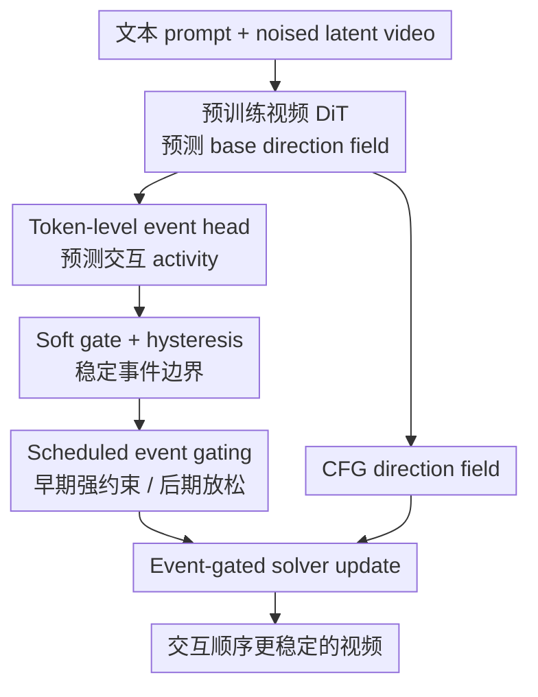

# Event-Driven Video Generation

**会议**: ECCV 2026  
**arXiv**: [2603.13402](https://arxiv.org/abs/2603.13402)  
**代码**: 未公开；项目页: [https://evd-project-website.pages.dev](https://evd-project-website.pages.dev)  
**领域**: 视频生成  
**关键词**: 文本到视频, Diffusion Transformer, 事件门控, 交互动态, Flow Matching

## 一句话总结
EVD 给预训练视频 DiT 加了一个轻量 token-level event head，并在训练和采样时用事件门控约束 latent update 只发生在交互真正活跃的区域，从而减少物体提前动、接触缺失、支撑关系跳变和事件后漂移等视频生成动态错误。

## 研究背景与动机

**领域现状**：文本到视频模型在画面真实感、分辨率和时长上进展很快，DiT、flow matching、temporal autoencoder 和高效 sampler 让单帧质量越来越像样。很多新基准也开始把 appearance 和 dynamics 分开评估，因为好看的帧并不等于交互合理的视频。

**现有痛点**：当前模型经常犯的不是纹理模糊，而是事件因果错乱：手还没碰到盘子盘子先动了，书已经堆起来但没有放置动作，椅子被拉完后还继续漂，目标平台没对齐却强行生成完成状态。这些错误在单帧上可能不显眼，但从视频因果链看很刺眼。

**核心矛盾**：标准 frame-first denoising / flow sampling 在每一步都对所有 latent 区域更新，即使 prompt 暗示当前只有局部接触或状态变化应该发生。模型缺少一个明确的「此时此地有事件发生吗」信号，于是全局 latent update 很容易产生 ghost motion、pre-contact motion 或 post-event drift。

**本文目标**：不换 backbone、不换 solver、不增加采样步数，在预训练视频 DiT 上加一个小的事件路径，让生成过程知道哪些 token 正处于 prompt-relevant event，从而把 update field 局部化、时序化。

**切入角度**：作者把视频看成 persistent latent state 加上一系列 discrete interaction events。状态不应该每处每步都变，而应该在事件活跃时、事件区域附近发生有方向的变化；事件结束后，更新应衰减，让结果稳定下来。

**核心 idea**：用 DiT 最后一层 token features 预测 event activity，经过平滑、soft gate、hysteresis 和 early-step schedule 后，直接门控 CFG 后的 direction field；训练时再用 realization / consistency / ordering losses 把事件信号和 latent state change 绑定起来。

## 方法详解

### 整体框架
EVD 仍然沿用视频 DiT 的 latent flow matching 接口：干净视频 $x$ 经 temporal autoencoder 编到 latent $z_1$，从噪声 $z_0$ 插值得到 $z_t=t z_1+(1-t)z_0$，base DiT 预测 velocity / direction field。EVD 的改动很集中：在 DiT token features 上接一个 event head，输出 token-wise activity；再把 activity 转成 gate，乘到 backbone 的 update field 上。采样时 CFG 仍照常做，只是最终传给 solver 的方向场变成 event-gated direction field。

### 关键设计

**1. Token-level event head：给 DiT 一个“这里正在发生交互”的显式通道**

EVD 使用 DiT 最后一层 token features $s_t^{(L)}$，接一个轻量 event head $π_ψ$，预测 token 对齐的事件字段 $e_t$。主方法里事件通道数 $C_e=1$，第一通道经过 sigmoid 得到 activity probability $a_t∈[0,1]^N$。为了不破坏预训练模型，一开始把 event head 近零初始化，让它在 fine-tuning 初期几乎不改变 base DiT 行为。

这个 event activity 不是额外标注的 symbolic event graph，而是从模型自己的 latent dynamics 中学出来的局部交互信号。它的作用是回答一个采样器原本不知道的问题：当前 token 对应的时空 patch 是否应该参与状态变化？如果答案接近 0，update 应被压住；如果接近 1，交互区域可以正常更新。

**2. Soft activation + hysteresis：避免事件门控变成闪烁的硬阈值 mask**

直接对 event activity 阈值化会有两个问题：边界抖动、强度不连续。EVD 先对 activity 做 $3×3$ 空间平滑，再用 on/off 两个阈值形成 hysteresis band。软门控大致为

$$g_{soft}=σ(β(a_t-(τ_{on}+τ_{off})/2)),$$

其中 $β$ 控制边界锐度；binary hysteresis gate 则在 activity 高于 $τ_{on}$ 时打开，低于 $τ_{off}$ 时关闭，中间区间沿用上一采样步状态。最终 gate 是 $g_t=g_{soft}·g_{bin}$。这相当于给事件边界加了记忆：一旦事件开始，不会因为一两个 noisy token 突然关掉；事件结束后，也不会拖着低 activity 区域继续乱动。

**3. Event-gated direction field：不改 solver，只改传给 solver 的 update**

在 CFG 之后，base direction field 可以写成 $v^{cfg}(z_t,y,t)$。EVD 不换 Euler/Heun/DPM-style solver，也不增加 DiT forward 次数，而是把 direction field patchify 后逐 token 乘以 gate，再 unpatchify 回 latent 形状：

$$\tilde v_t = UnTok(g_t · Tok(v^{cfg}(z_t,y,t))).$$

直觉上，EVD 不是告诉模型「生成什么物体」，而是约束「哪里允许发生状态变化」。这正好对应四类失败：Contact Stability 里的提前运动会被低 activity token 压住；State Persistence 里的事件后漂移会在 gate 关闭后被削弱；Support Relations 和 Spatial Accuracy 则依赖事件活跃区域与目标接触区域对齐。

**4. Scheduled gating：早期管住动态结构，后期放手修纹理**

采样早期决定粗动作和交互结构，采样后期更多是纹理与局部细节。如果全程强门控，虽然 dynamics 指标可能高，但会压制后期 refinement，导致 human preference 下降。因此 EVD 设置 schedule：$t≤t^*$ 时 full gating，之后 gate 线性退火到全 1，也就是后期逐步回到 base model。

这个细节在消融里很重要：constant gate 的 VBench Dynamics 依然很高，但人类偏好明显下降，说明「事件约束」不能变成粗暴 motion mask。EVD 的 schedule 本质是在 coarse event formation 和 late visual richness 之间做时间分工。

**5. Event-grounded losses：让事件信号和 latent state change 真的对齐**

只在推理时加一个 mask 不够，因为 event head 需要学会模型 latent 几何里的真实变化。EVD 保留 base Flow Matching loss，再加三类事件损失。Event realization loss 惩罚低 activity 区域的大 update，逼模型要么打开事件、要么别乱改；event consistency loss 在相近 diffusion time 上约束 active event 区域的 update direction 保持一致，减少交互抖动；ordering / termination loss 则用 $τ_{on},τ_{off}$ 抑制事件开始前和结束后的 update energy。

总目标可以概括为：

$$L=L_{base}+w(t)(λ_{real}L_{real}+λ_{cons}L_{cons}+λ_{order}L_{order}).$$

其中 $w(t)$ 强调早期 diffusion/flow time，因为粗动态在早期定型；论文默认 $t^*_{loss}=0.60$、$κ=6$，并设置 $λ_{real}=0.12$、$λ_{cons}=0.08$、$λ_{order}=0.03$。

### 一个完整示例
prompt 是「a plate is placed onto a dining table」。普通 DiT 可能在手还没接触时就让盘子滑动，或盘子放下后继续漂。EVD 采样早期会让 event head 在手、盘子和桌面接触区域预测较高 activity，gate 允许这些 token 更新；背景、桌面远处和已经稳定的盘子区域 activity 低，direction field 被压住。事件完成后 hysteresis gate 关闭，scheduled gate 也逐渐放松给纹理 refinement 留空间，于是最终视频更容易呈现「接触发生 -> 盘子落在桌面 -> 状态稳定」的因果顺序。

### 损失函数 / 训练策略
主实验在 DiT-4B 和 DiT-30B 上做 additive modification，不改 transformer blocks。所有方法在 EVD-Bench 上生成 128 帧、24 fps、256×256 latent/decoder 基础分辨率（可视化上采样到 720p），使用相同 solver、步数 $K=50$、CFG scale $w_{cfg}=4.0$，并固定 seed、只评估第一份 sample。事件门控超参为 $β=12.0$、$τ_{on}=0.62$、$τ_{off}=0.38$、$t^*=0.60$，event dropout 为 0.25。

## 实验关键数据

### 主实验
EVD-Bench 包含 150 个短交互 prompt，覆盖 State Persistence、Spatial Accuracy、Support Relations、Contact Stability 四类失败。结果同时报告 VBench Appearance / Dynamics 和人类 2AFC 偏好。

| 模型 | Text Faithfulness 偏好 | Quality 偏好 | Dynamics 偏好 | VBench Appearance | VBench Dynamics |
|------|------------------------|---------------|----------------|-------------------|-----------------|
| DiT-4B | - | - | - | 75.4 | 78.9 |
| DiT-4B + EVD | 88.9 | 91.3 | 96.4 | 76.2 | 94.8 |
| DiT-30B | - | - | - | 73.8 | 88.7 |
| DiT-30B + EVD | 89.7 | 92.4 | 97.1 | 78.1 | 95.7 |
| Wan / Hunyuan 对比 | - | - | EVD wins 68.4 / 65.7 | - | 95.7 vs 91.6 / 90.8 |

### 消融实验
DiT-4B 上的 ablation 能看出：训练损失、推理门控和 schedule 都不是可有可无。

| 配置 | EVD 文本偏好 | EVD 质量偏好 | EVD 动态偏好 | VBench App. | VBench Dyn. | 说明 |
|------|-------------|--------------|--------------|-------------|-------------|------|
| Full EVD | 88.9 | 91.3 | 96.4 | 76.2 | 94.8 | 完整训练 + 门控 + schedule |
| w/o event realization | 65.2 | 69.4 | 78.8 | 75.9 | 91.2 | missing/pre-contact 问题回潮 |
| w/o event consistency | 61.3 | 65.0 | 74.2 | 76.0 | 92.1 | 交互区域更抖，状态不稳 |
| Training-only, no gating | 63.0 | 66.8 | 77.1 | 76.1 | 90.5 | 只训练不门控，收益有限 |
| Inference-only, no event losses | 70.5 | 74.9 | 86.0 | 75.6 | 84.0 | 只推理 mask 不够对齐 latent dynamics |
| No schedule, const gate 1.0 | 55.7 | 58.9 | 60.5 | 75.7 | 94.1 | 自动动态高，但人类偏好差 |

### 关键发现
- 开销非常小：DiT-4B 只增加 6.5M 参数（0.16%），DiT-30B 增加 12.0M 参数（0.04%），推理开销约 1.02×，CFG 下仍是每步 2 次 DiT eval、$K=50$。
- EVD 主要提升 dynamics，而不是靠牺牲外观换分。DiT-4B 的 Appearance 从 75.4 到 76.2，Dynamics 从 78.9 到 94.8。
- motion mask baseline 不够：附录指出纯基于运动幅度的 gate 容易把相机运动和接触运动混淆，也不能保证结果通过可见交互产生；EVD 的优势来自 learned event representation。

## 亮点与洞察
- **把视频生成失败归因到 update field 的空间-时间控制**：很多动态错误不是模型不会画，而是采样过程中「不该变的地方也在变」。这个视角很有启发。
- **兼容性强**：EVD 不改 solver、decoder、NFE 和 CFG 结构，只改 direction field，因此理论上容易插到其他 DiT/flow video generator。
- **schedule 消融很诚实**：常数强门控能提高自动 dynamics 但降低人类偏好，说明作者没有把门控当万能 mask，而是明确处理 late refinement 的副作用。
- **事件信号是可诊断的**：Fig. 5 中 activity 和 gate 会集中到放置、接触、材料转移等区域，为调试视频动态提供了一个可视化窗口。

## 局限与展望
- EVD 依赖 event head 能在当前 latent resolution 下定位交互；小接触、遮挡、多人多物体和拥挤场景中，事件可能 under-localize。
- EVD-Bench 是 150 个短、原子、单事件 prompt，能很好测接触/支撑/状态保持，但还不能覆盖长故事、多事件依赖和复杂镜头语言。
- 训练仍需要大规模 DiT fine-tuning 资源，附录中 DiT-30B+EVD 使用 256 张 GH200 级别 GPU，普通实验室复现门槛高。
- 事件 activity 当前主要是单通道，难以区分接触开始、状态转移、结束稳定等 event phase；未来可以扩展到多通道 phase / object-centric event representation。
- 人类偏好和 VBench Dynamics 的关系仍需谨慎，constant gate 的例子说明自动指标可能奖励过强约束，而不一定对应更自然的视频。

## 相关工作与启发
- **vs VideoJAM / motion steering**：这些方法更多从 motion quality 或 inference steering 入手；EVD 的核心是把 prompt-relevant event 显式对齐到 latent update。
- **vs GEST / symbolic event control**：GEST 用事件图或形式化 specification 控制视频，EVD 不要求用户给 symbolic event graph，而是在 DiT 内部学习 event activity。
- **vs 普通 diffusion acceleration / mask**：EVD 不是为了少算，而是为了让 update 更符合因果时序；它的 gate 是语义事件门控，不是单纯运动幅度剪枝。
- **启发**：后续视频生成模型可以把 state / event / object contact 作为采样器的一等公民，甚至让 planner 先预测事件时间线，再由 DiT 负责视觉实现。

## 评分
- 新颖性: ★★★★☆ event gating 的概念直观但很对症，真正贡献在于把它落到 DiT latent update、训练损失和 schedule 上。
- 实验充分度: ★★★★☆ 有专门 EVD-Bench、人评、自动指标、开销和消融；长视频和复杂多事件覆盖还不够。
- 写作质量: ★★★★☆ 方法讲得清楚，附录非常详细；主文表格的 human preference 读法需要小心。
- 价值: ★★★★☆ 对解决视频生成交互动态很有实际价值，尤其适合接触、支撑和状态保持类 prompt。

<!-- RELATED:START -->

## 相关论文

- [\[CVPR 2025\] Mind the Time: Temporally-Controlled Multi-Event Video Generation](../../CVPR2025/video_generation/mind_the_time_temporally-controlled_multi-event_video_generation.md)
- [\[CVPR 2026\] SwitchCraft: Training-Free Multi-Event Video Generation with Attention Controls](../../CVPR2026/video_generation/switchcraft_training-free_multi-event_video_generation_with_attention_controls.md)
- [\[CVPR 2026\] Chain of Event-Centric Causal Thought for Physically Plausible Video Generation](../../CVPR2026/video_generation/chain_of_event-centric_causal_thought_for_physically_plausible_video_generation.md)
- [\[AAAI 2026\] Seeing the Unseen: Zooming in the Dark with Event Cameras](../../AAAI2026/video_generation/seeing_the_unseen_zooming_in_the_dark_with_event_cameras.md)
- [\[CVPR 2026\] The Devil is in the Details: Enhancing Video Virtual Try-On via Keyframe-Driven Details Injection](../../CVPR2026/video_generation/the_devil_is_in_the_details_enhancing_video_virtual_try-on_via_keyframe-driven_d.md)

<!-- RELATED:END -->
