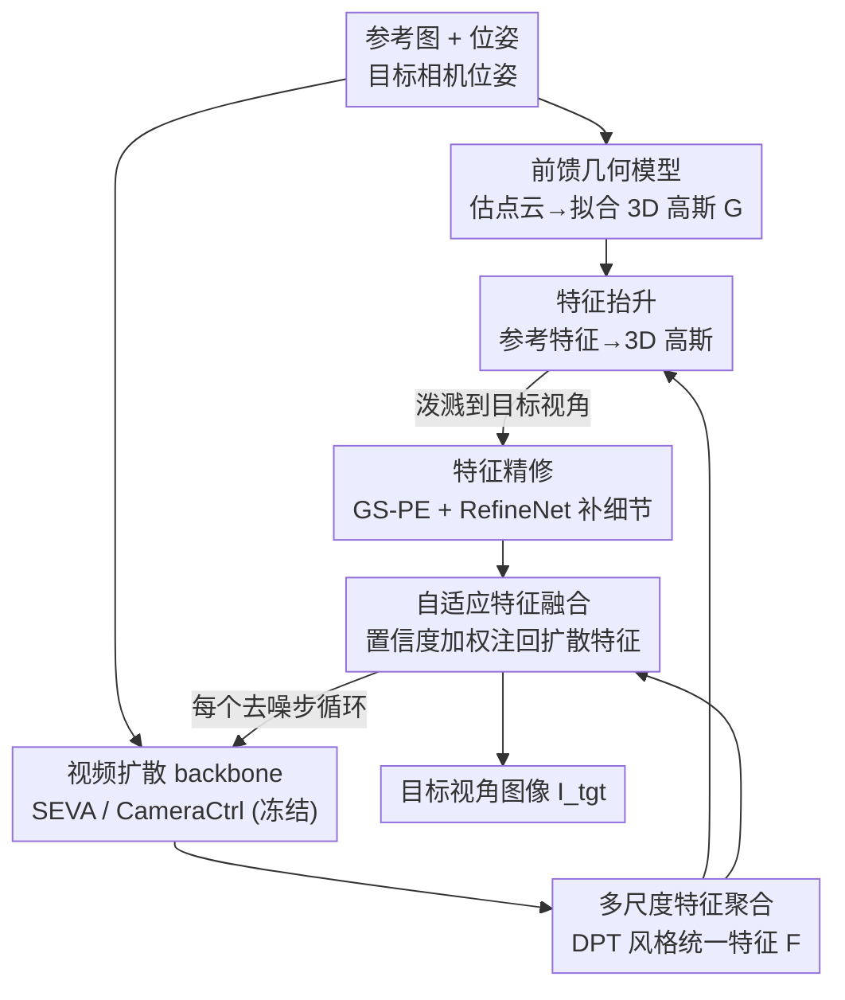

# GeoNVS: Geometry Grounded Video Diffusion for Novel View Synthesis

**会议**: ECCV 2026  
**arXiv**: [2603.14965](https://arxiv.org/abs/2603.14965)  
**代码**: 有（项目页，见论文 Project page）  
**领域**: 视频生成 / 新视角合成 / 扩散模型  
**关键词**: 新视角合成, 视频扩散, 3D 高斯, 几何先验, 特征调制

## 一句话总结
GeoNVS 提出即插即用的 GS-Adapter，把参考视角的扩散特征"抬升"到 3D 高斯里再渲染回目标视角，在**特征空间**而非图像输入端注入几何先验，从而在相机可控性和几何一致性上大幅超越 SEVA / CameraCtrl，平移误差最多降 2 倍、Chamfer 距离最多降 7 倍。

## 研究背景与动机
新视角合成（NVS）要在保持场景几何一致的同时，从任意相机位姿渲染出照片级的画面。经典的逐场景优化方案 NeRF 与 3D 高斯泼溅（3D-GS）在稠密观测下效果惊艳，但在稀疏输入、目标视角远离输入视角时严重过拟合。两条替代路线随之兴起：一是前馈几何方法（MVSplat、DepthSplat、VGGT、Pi3 等），单次前向就从稀疏图像回归出显式 3D 表示，在可观测区域结构一致性很强，却在低重叠场景丢失细粒度外观；二是生成式方法，把相机位姿或 Plücker 坐标喂进视频扩散模型（CameraCtrl、SEVA 等），即使输入重叠很低也能生成语义丰富的稠密画面，但代价是多视角不一致、会幻觉出偏离输入的结构，而且相机可控性差——生成的视频经常跟不上指定的相机轨迹。

一个自然的补救思路是把前馈几何模型的显式几何先验注入生成模型，让生成结果与输入视角结构对齐。已有不少工作（ReconFusion、GenFusion、Difix3D、MVSplat360 等）沿这条路走，但它们几乎都在**输入层**做融合：把 3D-GS 渲染出的带噪目标视角图像（或特征）当作扩散模型的输入去 refine。作者观察到这种做法反而会引入几何扭曲和幻觉结构——渲染图里视角相关的颜色噪声会淹没结构信号，让扩散模型"学歪"。更麻烦的是，这类方法通常绑死了某一个特定的几何模型，换几何 backbone 就得重训。

本文的核心矛盾在于：几何先验的**结构信息**是有用的，但它携带的**视角相关颜色噪声**是有害的，而输入层注入无法把两者分开。GeoNVS 的切入角度是把耦合点从图像输入端挪到**特征空间**：只借用 3D 高斯里编码的结构信息去调制扩散模型内部特征，绕开带噪的颜色。**核心 idea：用一个即插即用的 GS-Adapter，把参考视角的扩散特征抬升进 3D 高斯、按目标相机泼溅出几何约束的新视角特征，再用置信度感知的自适应融合把它注回扩散特征——让几何先验在整个去噪过程中锚定 3D 结构，而不引入渲染图的颜色噪声。**

## 方法详解

### 整体框架
GeoNVS 的输入是若干张参考图像 $I_{ref}$ 及其相机位姿 $\pi_{ref}$、以及目标相机位姿 $\pi_{tgt}$，输出是目标视角图像 $I_{tgt}$。整套系统建在冻结的视频扩散 backbone（SEVA 或 CameraCtrl）之上，只训练插入 attention 的 LoRA 层、多尺度融合模块和 GS-Adapter。

流程分三层：**先备几何先验**——用前馈几何模型（VGGT / Pi3 / DepthSplat 等）从参考图估出点云，对同时预测位姿和点云的模型（VGGT、Pi3）还要把预测的相机尺度对齐到目标相机，再用 InstantSplat 拟合出 3D 高斯 $G$。**再在每个去噪时刻做特征调制**——GS-Adapter 拿到当前时刻的扩散特征 $F_t = [F_{ref}; F_{tar}]$（参考视角 + 目标视角两部分）和几何先验 $G$，输出几何增强后的特征 $\hat{F}_t = \Phi(F_t, G)$，内部经过特征抬升、特征精修、特征融合三步。**最后接进扩散主干**——由于扩散特征在不同 U-Net 层的空间分辨率不同，用 DPT 风格的多尺度聚合把编码器各尺度特征上采样、层级合并成统一特征喂给 GS-Adapter，几何校正后的特征再下采样、经 skip connection 加回解码器。整个调制贯穿**每一个**去噪步。

### 关键设计

**1. GS-Adapter 三步走：把几何先验搬进特征空间**

这是全文的核心，专治"输入层注入几何先验反而引入颜色噪声"这个痛点。它不碰渲染出来的 RGB，而是在扩散特征上操作，分三步。第一步**特征抬升**：因为扩散特征逐时刻在变，逐场景优化式的特征嵌入根本没法用，作者借鉴 Dr.Splat / LUDVIG 的前馈思路，把 2D 参考视角特征按渲染权重加权平均"贴"到每个高斯上。对第 $i$ 个高斯，其特征是所有贡献到它的视图/像素对 $(d,p)$ 的加权归一化和：

$$\hat{f}_i = \frac{f_i}{\lVert f_i \rVert_2}, \qquad f_i = \sum_{(d,p) \in \mathcal{I}_i} \frac{w_i(d,p)}{\sum_{(d',p') \in \mathcal{I}_i} w_i(d',p')} F_{ref}(d,p)$$

这里刻意用**软分配**（累加一条光线上所有高斯，类似 alpha 合成）而非只取渲染权重最大的那个高斯（硬分配等价于把特征投到点云上）——补充实验里让每条光线采样的高斯数 $k$ 从 1 增到 255，PSNR 单调上升，证明软分配能捕获更完整的结构信号。这种前馈抬升让 3D 高斯能在每个去噪步显式参与、并支持与扩散模型端到端联合训练。第二步得到目标视角的几何特征 $G_{tar}$（用高斯特征泼溅公式渲染），第三步再融合回扩散特征。三步都是可微、逐时刻执行的，这是它区别于所有逐场景优化方法的关键。

**2. 特征精修：GS-PE + RefineNet 找回抬升丢掉的细节**

单纯把渲染出的几何特征和扩散特征直接融合，作者发现细粒度细节恢复不出来——抬升和渲染过程本身有信息损失。为此对渲染特征 $G$ 做两件事补偿。一是加**高斯位置编码（GS-PE）**：对每个像素找出贡献最大的那个高斯 $i^*(d,p)=\arg\max_i w_i(d,p)$，把它归一化到场景包围盒内的 3D 中心和渲染权重一起做正弦编码，拼到渲染特征上，给后续网络喂进显式的 3D 结构线索：

$$G'(d,p) = G(d,p) + \left[\gamma(\tilde{x}) \,\|\, \gamma(\tilde{y}) \,\|\, \gamma(\tilde{z}) \,\|\, \gamma(w^*)\right]$$

二是过一个轻量的 ResNet 精修网络 $R$ 得到 $\hat{G}=R(G')$。训练时因为参考视角特征 $F_{ref}$ 本身是可靠参照，就用一个余弦相似度损失把精修后的参考视角特征 $\hat{G}_{ref}$ 对齐到 $F_{ref}$：$\mathcal{L}_{feat} = \lVert 1 - \cos(\hat{G}_{ref}, F_{ref}) \rVert_2$。消融显示 GS-PE 和 $\mathcal{L}_{feat}$ 缺一不可，去掉 RefineNet 在各 benchmark 上都掉点，说明精修带来的增益独立于高斯泼溅本身。

**3. 自适应融合：按几何先验的局部可靠度决定信几分**

有了精修后的几何特征 $\hat{G}_{tar}$，怎么和扩散特征 $F_{tar}$ 融合是关键。最朴素的做法（Naïve Fusion）是直接拼接再用 MLP 投回原通道，$\hat{F}_{tar}=\text{MLPs}(F_{tar} \oplus \hat{G}_{tar})$——但它**完全依赖几何先验**，一旦先验损坏（比如反光区域几何估错）就跟着崩。作者转而提出**自适应融合**：让扩散特征 $F_{tar}$ 作 query、几何特征 $\hat{G}_{tar}$ 作 key/value 做交叉注意力得到几何注意特征 $F_{tar}^A$，再用一个门控 MLP 预测逐像素置信度权重 $W_{tar}\in[-1,1]$，按它加权注入：

$$W_{tar} = \text{Tanh}\!\left(\text{MLP}(F_{tar} \oplus F_{tar}^A)\right), \qquad \hat{F}_{tar} = F_{tar} + W_{tar} \cdot F_{tar}^A$$

作者进一步验证 $W_{tar}$ 确实"学到了该信不该信"：在 3 个反光场景上测 $|W_{tar}|$ 与 3D-GS 不确定度的皮尔逊相关，得到稳定的负相关（$r\approx-0.30$），且随去噪推进、在反光区域越发明显——说明在几何先验不可靠的地方，自适应融合会主动**下调**几何引导的权重。消融里这一步价值最大：Naïve Fusion 在 DTU 上换成 Pi3 先验会掉到 14.83（比 SEVA 基线 17.03 还低），而 Adaptive Fusion 无论用哪个几何先验都稳在 19.02–19.18，真正做到了"换几何 backbone 不掉点"的即插即用。

### 损失函数 / 训练策略
在冻结的视频扩散模型 attention 里注入 LoRA 层（SEVA 的 rank/α 设 16，CameraCtrl 设 4），与多尺度融合模块、GS-Adapter 一起训练。总损失是隐空间对齐损失加上特征对齐损失，后者权重仅 0.05：

$$\mathcal{L} = \mathcal{L}_{latent} + 0.05\,\mathcal{L}_{feat}$$

训练数据用 DL3DV-10K，配 VGGT + InstantSplat 构造出 15 万段 clip 的 3D 高斯，参考/新视角划分 $(P,Q)$ 在 $\{(1,20),(3,18),(6,15),(9,12),(12,9)\}$ 间变化、总视角固定 21。SEVA 版分辨率 $384\times384$、CameraCtrl 版 $320\times576$，8 张 A6000（48GB）用 LoRA 微调约 80 小时，总 batch size 8。

## 实验关键数据

### 主实验
在 SEVA benchmark 的 9 个场景、18 个设置上评测，覆盖小视角/大视角/长轨迹三类。生成式方法与"生成式 + 几何先验"方法各用每数据集最优的前馈几何先验。

| 设置 | 指标 | GeoNVS(本文) | SEVA 基线 | 关键对比 |
|------|------|------|----------|------|
| 小视角 Set NVS（9 数据集均值） | PSNR ↑ | **19.09** | 17.15 | Difix3D 16.89 / GenFusion 15.30 |
| 小视角 Set NVS（均值） | SSIM ↑ | **0.622** | 0.560 | Difix3D 0.545 |
| 小视角 Set NVS（均值） | LPIPS ↓ | **0.253** | 0.293 | Difix3D 0.339 |
| 大视角 Set NVS（低重叠，均值） | PSNR ↑ | **14.20** | 12.64 | DepthSplat 先验 10.46 |
| 长轨迹 NVS（Mip360/DL3DV/T&T） | PSNR ↑ | 全面领先 SEVA | 基线 | 参考视角越多增益越大 |

几何保真度上（Trajectory NVS 设置），GeoNVS 相对 SEVA 平移误差 $T_{err}$、旋转误差 $R_{err}$、Chamfer 距离全面下降，摘要报的整体增益是对 SEVA / CameraCtrl 分别 +11.3% / +14.9%，$T_{err}$ 最多降 2 倍、CD 最多降 7 倍。而输入层注入的对手（Difix3D、SEVA + 输入层注入）在可控性上灾难性退化——如 Mip360 上 SEVA + 输入层注入的 $T_{err}$ 飙到 233、$R_{err}$ 到 99.79，远差于纯生成基线 SEVA 的 18.76 / 3.29，本文则是 16.24 / 2.98。

在非共视区域（相对参考视角不可见的区域）PSNR$_U$ 上，GeoNVS 相对 SEVA 在 Mip360 +1.06、DL3DV +2.08、WRGBD-Sh +1.72，说明几何引导能帮助向未观测区域做几何一致的外推。

### 消融实验
以 VGGT 为几何先验，逐个拆 GS-Adapter 组件（DL3DV 6-view PSNR）：

| 配置 | DL3DV PSNR | 说明 |
|------|---------|------|
| SEVA 基线 | 15.84 | 纯生成 |
| + 输入层注入 | 16.73 | 仅当几何先验近乎完美才有增益 |
| + 仅 LoRA | 17.35 | 只微调不加几何 |
| + GS-Adapter（Naïve Fusion） | 17.88 | 拼接式融合 |
| + GS-Adapter（Adaptive Fusion） | 17.95 | 置信度加权 |
| − RefineNet | 17.71 | 去掉精修网络掉点 |
| **完整 GeoNVS** | **18.11** | 多尺度 + 精修 + 自适应 |

几何先验兼容性（SEVA backbone，3 参考图，DTU/CO3D）：Naïve Fusion 对先验质量敏感——VGGT 在 T&T 上 +3.37dB，但 Pi3 在 DTU 上 14.83 反低于基线 17.03；Adaptive Fusion 则把 DTU 稳在 19.02–19.18、CO3D 稳在 19.22–19.26，几乎与所用几何先验无关。

### 关键发现
- **自适应融合是稳健性的关键**：Naïve Fusion 会被差的几何先验拖垮，Adaptive Fusion 通过置信度权重 $W_{tar}$ 主动下调不可靠区域的几何引导，实现"换任意几何 backbone 都不掉点"，这是即插即用的前提。
- **特征空间 vs 输入空间是本文最大的实验支撑**：输入层注入几何先验只在先验近乎完美时有增益，先验一差就崩（可控性甚至差于纯生成基线）；特征层调制无论先验好坏都稳定提升 PSNR。
- **软分配 + 精修共同找回细节**：抬升采样的高斯数越多 PSNR 越高（软 > 硬分配）；RefineNet 在 9 视角设置下带来 +1.37dB，且输入视角越多增益越大。
- **计算开销可控**：瓶颈是几何先验产生的高斯数量（推理 4.19 秒/帧、峰值显存 18.03GB），用 voxel-based 高斯剪枝在 96.2% 剪枝率下提速 2.22 倍到 1.89 秒/帧、显存降到 12.93GB（逼近 SEVA 的 12.81GB），PSNR 几乎不变。

## 亮点与洞察
- **"输入层 vs 特征层"这一刀切得漂亮**：论文用一句话点破了此前所有几何引导 NVS 的通病——渲染图带的视角相关颜色噪声会淹没结构信号，因此把耦合点从图像输入移到特征空间，只借结构不借颜色。这个 insight 可迁移到任何"想注入几何/结构先验但又怕引入模态噪声"的生成任务。
- **置信度门控 $W_{tar}$ 用不确定度做了可解释性验证**：不是空口说"自适应"，而是实测 $|W_{tar}|$ 与 3D-GS 不确定度呈稳定负相关，把"该信几分"量化出来了，这种"预测一个先验可靠度权重再融合"的模式很值得复用。
- **真正的即插即用**：GS-Adapter 对 4 种几何先验、2 种扩散 backbone 都零样本兼容不用重训，摆脱了此前方法绑死某一几何模型的桎梏；软分配的特征抬升让 3D 高斯能逐去噪步显式参与，是端到端联合训练得以成立的技术前提。

## 局限与展望
- 作者承认：远离输入视角的区域生成质量下降，归因于 GS-Adapter 里特征渲染随距离增大越发不确定；偶尔在细节区域产生模糊纹理（结构保得好但感知锐度掉），源于特征抬升的信息损失（Fig. 10）。
- 自己发现的：推理开销强依赖几何先验产生的高斯数量，虽然剪枝能缓解，但仍比纯 SEVA 慢（1.89 vs 1.34 秒/帧）；方法效果强绑几何先验质量，虽然自适应融合缓解了敏感性，但在几何先验和生成基线**都**失败的区域仍无源可依。
- 改进方向：针对远视角的不确定特征渲染设计更强的补全/精修机制，或引入生成式补偿去恢复模糊纹理的高频细节。

## 相关工作与启发
- **vs 前馈几何方法（MVSplat / DepthSplat / VGGT / Pi3）**: 它们单次前向出显式 3D、结构一致性强但低重叠场景外观差；本文不取代它们，而是把它们当作可插拔的几何先验来源，用生成模型补足外观与稠密性。
- **vs 输入层几何引导生成（GenFusion / Difix3D / MVSplat360 / ReconFusion）**: 它们把 3D-GS 渲染的带噪图像/特征喂进扩散模型 refine，引入颜色噪声导致几何扭曲、且绑死某一几何模型；本文在特征空间只用结构信息调制，几何一致性与可控性大幅更优，且对几何/扩散 backbone 都即插即用。
- **vs 3D-GS 特征场蒸馏（Dr.Splat / LUDVIG）**: 它们把静态语义特征蒸馏进高斯用于分割等离散任务；本文的扩散特征逐去噪步在变、且 NVS 对特征失真极其敏感，于是改用前馈抬升 + RefineNet 精修来保住像素级特征保真，而非分割够用的粗粒度区分。

## 评分
- 新颖性: ⭐⭐⭐⭐⭐ "输入层→特征层"注入几何先验的视角切换干净有力，自适应置信度门控设计精巧且有可解释性验证。
- 实验充分度: ⭐⭐⭐⭐⭐ 9 场景 18 设置 + 2 个 backbone + 4 个几何先验，消融拆到每个组件，还有位姿无关、剪枝、CFG 敏感性等补充实验。
- 写作质量: ⭐⭐⭐⭐⭐ 图 2/图 4 把"为什么输入层不行、为什么要自适应"讲得非常直观，方法三步逻辑清晰。
- 价值: ⭐⭐⭐⭐⭐ 即插即用、零样本兼容多种几何/扩散 backbone，几何一致性与相机可控性提升显著，对几何引导生成是一个可复用的范式。

<!-- RELATED:START -->

## 相关论文

- [\[ICCV 2025\] FVGen: Accelerating Novel-View Synthesis with Adversarial Video Diffusion Distillation](../../ICCV2025/video_generation/fvgen_accelerating_novel-view_synthesis_with_adversarial_video_diffusion_distill.md)
- [\[ECCV 2024\] SV3D: Novel Multi-view Synthesis and 3D Generation from a Single Image using Latent Video Diffusion](../../ECCV2024/video_generation/sv3d_novel_multi-view_synthesis_and_3d_generation_from_a_single_image_using_late.md)
- [\[CVPR 2025\] StreetCrafter: Street View Synthesis with Controllable Video Diffusion Models](../../CVPR2025/video_generation/streetcrafter_street_view_synthesis_with_controllable_video_diffusion_models.md)
- [\[CVPR 2025\] Geometry-guided Online 3D Video Synthesis with Multi-View Temporal Consistency](../../CVPR2025/video_generation/geometry-guided_online_3d_video_synthesis_with_multi-view_temporal_consistency.md)
- [\[ECCV 2026\] LatSearch: Latent Reward-Guided Search for Faster Inference-Time Scaling in Video Diffusion](latsearch_latent_reward-guided_search_for_faster_inference-time_scaling_in_video.md)

<!-- RELATED:END -->
