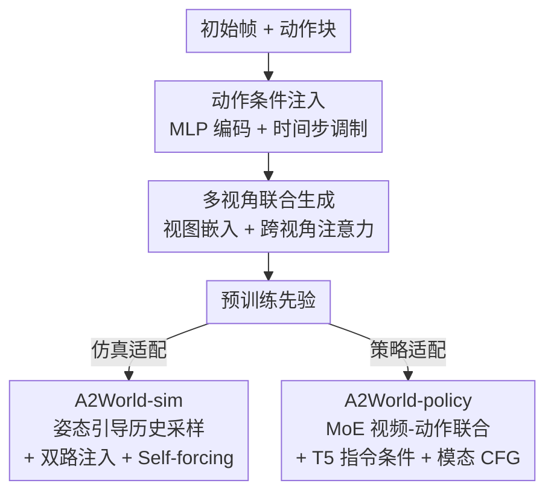

# Learning Transferable Dynamics Priors from Action to World Modeling

**会议**: ECCV 2026  
**arXiv**: [2606.29501](https://arxiv.org/abs/2606.29501)  
**代码**: [https://github.com/LogosRoboticsGroup/A2World](https://github.com/LogosRoboticsGroup/A2World)  
**领域**: 视频生成  
**关键词**: 扩散世界模型, 机器人操控, 动作到视频生成, 可迁移动态先验, 多视角生成  

## 一句话总结

提出 A2World，在大规模（215.6 万条轨迹、20+ 机械臂形态）真实机器人操控数据上预训练一个以动作为条件的多视角扩散世界模型，学得的动作→动态先验可适配为长程仿真器（A2World-sim）或指令驱动策略（A2World-policy），在 LIBERO 基准和真实机器人上均达到领先性能。

## 研究背景与动机

近年来，机器人学习领域越来越多地采用视频生成模型作为基础骨干。这些工作大致沿两条路线演进：一是将视频模型适配为视觉-语言-动作（VLA）策略，通过视频预测来驱动动作生成（如 Cosmos Policy、DreamZero、LingBot-VA）；二是开发以动作为条件的世界模型，用于数据增强和策略评估（如 Ctrl-World、DreamDojo、World4RL），甚至结合奖励模型进行策略后训练。尽管取得了显著进展，但这些方法尚未充分挖掘机器人数据预训练本身作为可迁移动态先验来源的潜力。多数工作直接从通用视频生成 checkpoint 微调（如 Cosmos-Predict2），缺少在大规模真机标注数据上以动作为监督信号的预训练阶段；即便在大规模数据集上预训练的工作，也往往面向单一下游目标优化（要么仿真、要么策略），而非显式设计为可复用的双用先验。

这一空白的核心矛盾在于：操控任务中的动作本身提供了天然的因果监督信号——接触、抓取、推动、释放等底层物理交互规则在不同物体、场景和视角间是共享的，但现有方法要么用文本条件来近似动态（信息不够精确），要么用潜动作模型产生间接伪标签（面临领域偏移）。本文的切入角度是：既然近两年涌现了 AgiBot、DROID、InternData、RoboCoin 等大规模高质量开源机器人操控数据集，就具备了在一个统一框架下利用真实动作标注来学习「动作如何驱动视觉场景演化」的条件。

**核心 idea**：本文提出 A2World，在大规模、多形态（20+ 机械臂构型）、多任务、多视角的真实机器人操控轨迹上预训练一个以动作为条件的扩散世界模型，将其学得的动作→视觉动态先验显式设计为双用范式——既适配为任务专属长程仿真器（A2World-sim）用于策略评估和反事实分析，又适配为指令驱动的视频-动作联合预测策略（A2World-policy）直接用于机器人操控。

## 方法详解

### 整体框架

A2World 是本文的核心预训练模型，定位为一个以动作为条件的多视角潜空间扩散世界模型。输入为单帧初始观测 $o_t$ 和长度为 $k=20$ 的未来动作块 $a_{t+1:t+k}$，输出为对应的未来 $k$ 帧多视角视频 $o_{t+1:t+k}$。模型基于 DiT（Diffusion Transformer）架构，在 WAN2.1 tokenizer 编码的连续潜空间上操作，从 Cosmos-Predict2-2B-Video2World 初始化骨干网络。预训练完成后，同一套权重通过两种方式适配下游：一是加入历史感知机制微调为 A2World-sim，支持长程自回归 rollout，作为真机训练和评估的替代仿真环境；二是加入文本指令条件和 MoE-like 视频-动作联合模块微调为 A2World-policy，输出动作序列直接驱动机械臂。

### 关键设计

**1. 动作条件注入：以动作为唯一调节信号的扩散先验学习**

如何让扩散模型学到的是「动作驱动的动态」而非「场景外貌的延续」？A2World 最根本的设计选择是：预训练阶段将所有文本条件特征置零 $\mathbf{c}=\mathbf{0}$，仅保留动作条件。具体地，动作块 $a$ 经 MLP 编码为动作嵌入 $e = \text{MLP}(a)$，然后将其加到扩散时间步嵌入上，使每个 DiT block 的自适应层归一化（AdaLN）生成的 scale/shift/gate 调制参数同时包含时间步与动作信息：

$$\tilde{\tau}(\sigma) = \tau(\sigma) + e$$

这一设计切断了模型借道文本线索预测未来的捷径——它不能预测「物体是红色的所以应该移动到哪里」，而必须学习「这个七维末端执行器位姿增量会导致场景中哪些像素发生怎样的变化」，从而将视觉动态与物理动作真正耦合。实验也证实了这一点：动作→视频预训练在策略下游的性能远优于文本条件预训练（LIBERO 平均 98.6% vs 97.4%），因为文本条件对应多种有效动作序列的不确定性被彻底消除了。

**2. 多视角联合生成：时间拼接 + 视图嵌入 + 跨视角注意力**

真实机器人操作通常配备多台相机。A2World 将全部 $V$ 个视角的画面沿时间维度拼接为 $\mathbf{z}_{\text{mv}} \in \mathbb{R}^{B \times C \times (V \cdot T) \times H \times W}$，相当于生成一段逐视角衔接的长视频序列。为了让 DiT 区分不同视角的身份，为每个视角设计了可学习的视图嵌入 $\epsilon_{\text{view}}(v) \in \mathbb{R}^{d_e}$，与潜特征在通道维拼接。更核心的是，在每个 DiT block 中插入了跨视角注意力模块：某个视角的 token 可以关注其他所有视角的 token，从而学到多视角间的空间对应关系。这一联合生成设计避免了逐视角独立生成导致的视图不一致，同时保留了各视角独有的细节（如光照差异、不同遮挡模式），为后续的策略评估和操控提供了物理自洽的多视角信息。

**3. 姿态引导历史采样与双路历史注入（A2World-sim）**

将短程 A2World 适配为长程仿真器面临两个挑战。第一是历史记忆的选择策略：滑动窗口只保留最近帧会丢失早期关键交互（如物体被抓取前的状态），而保留全部帧超出 token 预算。A2World-sim 的姿态引导历史采样根据相对动作计算机械臂运动加权弧长，在弧长空间上均匀采样 $m$ 帧，以固定预算覆盖运动的关键状态——包括接近接触的时刻和转向点。第二是历史信息的注入方式：采用双路策略，一方面将历史 tokens 替换预训练阶段的空交叉注意力条件，通过交叉注意力让当前帧 tokens 获取历史上下文；另一方面将历史 tokens 作为 key/value 记忆拼接到当前潜 token 的自注意力中，提供全局状态记忆。此外，A2World-sim 采用 Self-forcing 训练策略：训练中周期性地使用自生成的帧而非真实帧作为条件，暴露于自己的 rollout 误差并学会从中恢复。这种方式无需独立的教师模型，因为给定动作和初始帧，未来轨迹大部分由底层物理决定，自生成帧虽含误差但仍包含正确的动态趋势，训练出来的模型在长程 rollout 中表现出显著更好的稳定性。

**4. MoE-like 视频-动作联合模块（A2World-policy）**

将世界模型先验迁移为动作策略的核心问题是：视频动态先验如何转化为动作生成能力？A2World-policy 的设计是 MoE-like 共享注意力 + 模态分离分支——视频 token 和动作 token 共享同一套自注意力模块（让动作生成借用预训练的视频动态先验），但各自拥有独立的 AdaLN 和 MLP 分支（保留模态特定的去噪能力）。这避免了从头训练动作分支的巨量数据需求，又防止了动作预测对视频动态的灾难性干扰。指令文本由 T5 编码后作为交叉注意力条件注入每个 DiT block。推理时采用模态级无分类器引导（modality-wise CFG），视频和动作使用独立的引导尺度 $s_v, s_a$，可在视觉质量和动作精度之间灵活权衡。联合去噪目标为：

$$\mathcal{L}_{\text{A2World-policy}} = \mathbb{E}\left[ w(\sigma_v) \|\hat{\mathbf{z}}^v - \mathbf{z}^v \|_2^2 + \lambda_a w(\sigma_a) \|\hat{\mathbf{z}}^a - \mathbf{z}^a \|_2^2 \right]$$

其中视频和动作采用耦合的共享噪声水平 $\sigma_v = m_v \sigma_{\text{base}}, \sigma_a = m_a \sigma_{\text{base}}$（$m_v=\sqrt{6}, m_a=0.5$），在联合训练中保持视频-动作的时间对齐。论文的实验还揭示了一个有趣的正耦合现象：视频预测质量与动作生成质量在训练过程中高度正相关，联合训练比冻结视频分支到达更强的上界。

### 损失函数 / 训练策略

A2World 预训练采用 EDM 去噪分数匹配损失；A2World-policy 采用加权联合去噪损失（视频与动作损失权重 $\lambda_a=1$，最终反向传播梯度缩放 10 倍）。全部使用 fused Adam 优化器，学习率 1e-4，权重衰减 0.1。A2World 预训练使用 64 张 H200 GPU，batch size 12/GPU，gradient accumulation 4，训练 2 个 epoch。A2World-policy 微调使用 32 张 H200 GPU，global batch size 256，20k 步。扩散过程采用 rectified flow，$\sigma_{\min}=4.0, \sigma_{\max}=80.0, \rho=7.0$，35 步采样。

## 实验关键数据

### 主实验

**LIBERO 策略成功率评估**：A2World-policy 在标准四套件协议下平均成功率达 98.6%，在所有对比方法中最高，尤其在长程任务（Long）中表现突出（98.2%）。

| 方法 | Spatial | Object | Goal | Long | Average |
|------|---------|--------|------|------|---------|
| Diffusion Policy | 78.3 | 92.5 | 68.3 | 50.5 | 72.4 |
| OpenVLA-OFT | 97.6 | 98.4 | 97.9 | 94.5 | 97.1 |
| Cosmos Policy | 98.1 | 100.0 | 98.2 | 97.6 | 98.5 |
| **A2World-policy** | **98.2** | **99.2** | **98.6** | **98.2** | **98.6** |

**仿真器 Rollout 质量评估**（LIBERO 数据集）：A2World-sim 在视觉质量和动作忠实度指标上全面领先 Cosmos-Predict2、Ctrl-World、Prophet 等基线。

| 方法 | PSNR↑ | SSIM↑ | tSSIM↑ | EPE↓ | cos↑ |
|------|-------|-------|--------|------|------|
| Cosmos-Predict2 | 25.36 | .8792 | .7631 | .4009 | .5755 |
| Ctrl-World | 23.60 | .8632 | .7445 | .6827 | .3730 |
| Prophet | 26.12 | .8887 | .7789 | .3667 | .5932 |
| **A2World-sim** | **26.64** | **.8957** | **.7862** | **.3498** | **.6045** |

### 消融实验

**历史采样策略消融**（LIBERO 数据集）：姿态引导采样在所有指标上显著优于无历史策略和滑动窗口基线，验证了运动关键帧选择对长程 rollout 稳定性的重要性。

| 配置 | PSNR↑ | SSIM↑ | tSSIM↑ | EPE↓ | cos↑ |
|------|-------|-------|--------|------|------|
| 无历史 | 25.41 | .8806 | .7663 | .3969 | .5778 |
| 滑动窗口 | 25.63 | .8840 | .7699 | .3900 | .5853 |
| **姿态引导（本文）** | **26.64** | **.8957** | **.7862** | **.3498** | **.6045** |

**预训练变体消融**（LIBERO 策略）：动作→视频预训练（A-pre）达到 98.6%，远超文本条件预训练（T-pre, 97.4%）和 Cosmos 初始化（C-init, 97.0%），与策略定向预训练（P-pre, 98.8%）接近但保留了仿真器复用能力。

| 配置 | 平均成功率 |
|------|-----------|
| 文本条件 Cosmos 初始化（C-init） | 97.0 |
| 文本条件 A2World 预训练（T-pre） | 97.4 |
| **动作→视频 A2World 预训练（A-pre）** | **98.6** |
| 策略定向预训练（P-pre） | 98.8 |

### 关键发现

- 动作→视频预训练相比文本条件预训练在策略下游大幅领先，原因是动作条件下视觉转换几乎完全由动作决定，消除了文本指令对应多种有效动作序列的不确定性。
- 视频建模与动作学习存在正耦合：训练过程中视频预测质量越高，动作生成质量也越高——联合训练比冻结视频分支到达更强的上界，说明共享的自注意力模块有效传递了动态先验。
- OOD 场景中 A-pre 大幅超越 C-init（LIBERO-Plus Spatial 平均 88.5% vs 80.2%），说明动作→视频预训练捕获了超越外观的动态交互先验。
- A2World-sim 作为真实世界仿真器的评估显示与真实世界高度一致（Spearman ρ=0.916, Pearson r=0.965, R²=0.930），支持用世界模型 rollout 替代真机 rollout 进行策略评估。

## 亮点与洞察

- **动作作为唯一条件的预训练设计非常巧妙**：将文本条件全部置零，迫使模型在潜空间学习动作→视觉动态的因果映射，避免了通用视频模型「看画面猜未来」式的捷径——这是本文最核心的设计哲学，也是各项收益的根源。
- **姿态引导历史采样算法简洁高效**：通过计算运动弧长并在弧长空间均匀采样，在固定预算内最大化了历史帧的信息密度，比简单滑动窗口更鲁棒且无额外计算开销（不增加 token 数）。
- **MoE-like 共享注意力 + 模态分离分支**是一种优雅的迁移设计：自注意力共享让动作生成「借用」了视频预训练学到的动态先验，而各模态独立的分支保留了自己的去噪特性，避免了跨模态干扰。
- **Self-forcing 训练策略**将长程 rollout 的误差暴露纳入训练过程，无需独立的教师模型，完美适配动作条件先验。
- **单次预训练、双用适配的范式高度实用**：同一个 A-pre checkpoint 既可以做仿真器初始化也可以做策略初始化，与专门为策略训练的策略定向预训练（P-pre）性能几乎持平（98.6% vs 98.8%），但多了一个仿真器适配能力。

## 局限与展望

- 预训练仅使用了桌面机器人操控数据（AgiBot、DROID、InternData 等），暂未覆盖移动操作、人形机器人等更广泛的形态。将先验扩展到更丰富的运动模式是自然延拓方向。
- 模型参数量大（A2World 2.5B，A2World-policy 3.0B），推理成本较高，距离实际部署到消费级机器人硬件尚有距离。采用蒸馏或 sparse MoE 可能是可选路径。
- OOD 泛化的评估在 LIBERO-Plus Spatial 上进行，真实世界仿真器一致性评估仅覆盖 8 个策略-任务组合，更广泛的场景和退变条件（传感器噪声、光照突变）仍需验证。
- A2World-policy 采用扩散模型生成动作，推理速度较慢，能否替换为 consistency 模型或多步蒸馏方案值得探讨。

## 相关工作与启发

- **vs Cosmos-Predict2**: 通用视频生成模型，文本条件无动作信号；A2World 在大规模机器人数据上以动作监督预训练，在动作忠实度指标上显著领先（EPE 0.3498 vs 0.4009）。
- **vs Ctrl-World / Prophet**: 同类动作条件扩散世界模型，但 Ctrl-World 预训练数据限于 DROID，Prophet 为单视角；A2World 通过多数据集、多形态、多视角联合预训练获得了更好的泛化。
- **vs DreamDojo**: 同样在 LIBERO 上做仿真器，但缺乏大规模动作→视频预训练，OOD 场景更容易漂移到训练域外观。
- **vs Cosmos Policy / LingBot-VA**: 视频→动作策略，但视频模型预训练不使用动作条件；A2World-policy 在长程任务（LIBERO Long 98.2% vs Cosmos Policy 97.6%）上优势明显，且利用同一先验还能做仿真器。

## 评分

- 新颖性: ⭐⭐⭐⭐⭐ [首次系统提出将动作→视频扩散世界模型预训练作为可迁移动态先验范式，双用适配思路清晰，设计简洁优雅]
- 实验充分度: ⭐⭐⭐⭐⭐ [覆盖 LIBERO/LIBERO-Plus/RoboNet 模拟器和 5 项真实机器人任务，包含仿真器一致性评估、OOD 迁移、全面消融和多种基线对比]
- 写作质量: ⭐⭐⭐⭐⭐ [从预训练到两种适配的叙述过渡自然，研究动机阐述清晰，实验组织和图表呈现规整]
- 价值: ⭐⭐⭐⭐⭐ [为机器人领域提供「预训练一次、双用适配」的新范式，对降低真机训练成本、提高策略泛化有切实帮助]

<!-- RELATED:START -->

## 相关论文

- [\[ECCV 2026\] CustomX: Unified Character, Action, and Scene Customization in Video World Models](customx_unified_character_action_and_scene_customization_in_video_world_models.md)
- [\[ECCV 2026\] MemLearner: Learning to Query Context Memory for Video World Models](memlearner_learning_to_query_context_memory_for_video_world_models.md)
- [\[ICML 2026\] OLAF-World: Orienting Latent Actions for Video World Modeling](../../ICML2026/video_generation/olaf-world_orienting_latent_actions_for_video_world_modeling.md)
- [\[CVPR 2026\] SeeU: Seeing the Unseen World via 4D Dynamics-aware Generation](../../CVPR2026/video_generation/seeu_seeing_the_unseen_world_via_4d_dynamics-aware_generation.md)
- [\[CVPR 2026\] Phantom: Physics-Infused Video Generation via Joint Modeling of Visual and Latent Physical Dynamics](../../CVPR2026/video_generation/phantom_physics-infused_video_generation_via_joint_modeling_of_visual_and_latent.md)

<!-- RELATED:END -->
