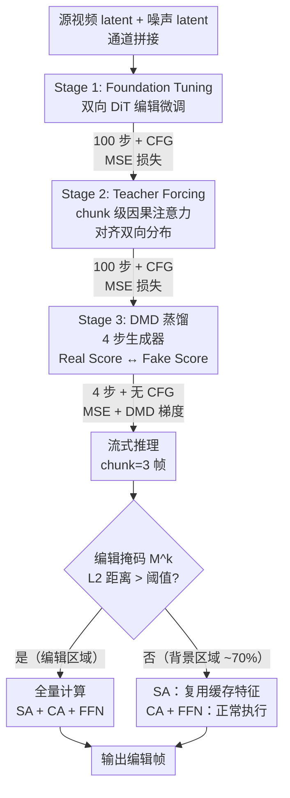

# LiveEdit: Towards Real-Time Diffusion-Based Streaming Video Editing

**会议**: ECCV 2026  
**arXiv**: [2606.26740](https://arxiv.org/abs/2606.26740)  
**代码**: 待确认（项目页 [https://live-edit.github.io](https://live-edit.github.io)）  
**领域**: 视频生成 / 视频编辑  
**关键词**: 流式视频编辑, 扩散模型蒸馏, 因果注意力, 掩码缓存, 实时推理

## 一句话总结

LiveEdit 通过三阶段渐进蒸馏将双向扩散 Transformer 的编辑能力迁移到因果流式编辑器（4 步推理），并利用自注意力层在背景区域的高时序冗余设计 AR 掩码缓存，在保留双向模型编辑质量的同时实现 12.66 FPS 的实时推理。

## 研究背景与动机

视频编辑技术近年来发展迅速，从文本引导的局部修改到风格迁移，离线双向扩散模型已经能生成高保真结果。然而，这些模型依赖全局注意力机制——必须看完完整视频的时空上下文才能输出第一帧。在增强现实和直播互动等需要即时响应的场景中，这种"先看完再编辑"的范式带来不可接受的延迟。业界因此转向流式（streaming）视频编辑：因果地逐帧或逐 chunk 处理视频，不依赖未来帧信息。但这一转向遭遇了两个核心瓶颈。第一个是注意力分布偏移：双向模型在离线阶段将大量注意力权重集中在最近邻帧上以获得局部结构一致性，一旦简单截断为因果掩码、去掉未来帧的 key/value，注意力分布会急剧展平——权重均匀分布在所有历史帧上，导致模型丢失局部结构先验，表现为严重的闪烁和内容"遗忘"。第二个是空间-时间 token 冗余：流式逐帧推理中，每到来一帧都要跑一遍完整的扩散网络——即使只有少量像素被编辑，其余 90% 以上的背景区域也要承受百分之百的计算开销，使实时部署在边缘设备上遥不可及。

与此同时，已有的流式视频生成工作（如 StreamDiffusion、Self-Forcing）主要面向从零合成的文生视频任务，直接迁移到编辑场景时面临本质性不匹配。视频生成只需要输出的帧与上一帧在风格上连续，而视频编辑必须严格保持源视频中未编辑区域的每像素一致性（如背景纹理、人物身份）。现有的缓存方案（DeepCache、VMem）主要针对生成任务做全层级的特征复用，在编辑中会导致高频细节丢失和结构漂移。LiveEdit 的切入点是：架构鸿沟和计算冗余是两个正交问题，应当分别设计针对性方案——通过三阶段蒸馏让双向先验"软着陆"到因果架构，同时利用实验发现的自注意力层在背景区域的高时序冗余来设计选择性缓存。

**核心 idea：通过三阶段渐进蒸馏（双向微调→Teacher Forcing 因果对齐→DMD 4步蒸馏）解决双向到因果的注意力分布偏移，同时基于自注意力层在未编辑区域的高时序冗余设计 AR 掩码缓存，在流式编辑中同时实现严格背景保持和 12.66 FPS 的实时推理速度。**

## 方法详解

### 整体框架

LiveEdit 的整体思路是先用一个双向 DiT 学好编辑能力，然后分三步将其转化为高效的因果流式编辑器。第一阶段（Foundation Tuning）在双向 DiT 上做编辑微调，以通道拼接输入源视频和噪声 latent，避免长序列注意力二次复杂度膨胀，同时让模型掌握复杂的编辑映射。第二阶段（Teacher Forcing for Causal Initial）引入 chunk 级因果注意力掩码，并用第一阶段学好的双向模型作为教师，迫使因果 DiT 的输出分布对齐双向分布，防止截断未来帧后的结构崩塌。第三阶段（DMD for Streaming Editing）跳过昂贵的 ODE 初始化，直接用第二阶段权重初始化 DMD 的 4 步生成器，配合冻结的 Real Score 和可训练的 Fake Score 做分布匹配蒸馏，同时去除 CFG 将单次前向从 200 NFEs 压缩到 4 次。

推理时，AR 掩码缓存对上一 chunk 的编辑输出和源 latent 逐位置计算 L2 距离生成编辑掩码，将当前帧的空间 token 分为"编辑区域"（全量计算 SA+CA+FFN）和"背景区域"（跳过 SA、复用缓存，CA 和 FFN 正常计算）两类。

### 关键设计

**1. 三阶段渐进蒸馏管线：从双向先验软着陆到高效流式编辑**

将离线双向扩散模型改造为因果流式模型并非简单的掩码替换——去掉未来帧 key/value 后注意力分布剧烈展平，局部结构先验完全丢失。LiveEdit 的三阶段设计让这一改造逐步完成，每个阶段只解决一个问题。第一阶段用通道拼接（而非序列拼接）将源视频 latent 和噪声 latent 合并输入到双向 DiT 中，以标准 MSE 噪声匹配损失微调，获得一个强大的离线编辑先验。第二阶段引入 chunk 级因果注意力掩码（每个 chunk 3 帧，只允许关注当前及之前 chunk），核心技巧是 Teacher Forcing——用第一阶段学好的双向模型输出作为教师信号，迫使因果 DiT 的注意力分布与双向分布对齐。实验表明直接截断因果掩码会导致 TA 从 0.268 降至 0.210 以下，而 Teacher Forcing 后仅微降至 0.264。第三阶段更进一步：由于第二阶段已经让因果模型分布高度对齐，可以直接用它的权重初始化 DMD 的 4 步生成器，跳过 Self-Forcing 等方法中昂贵的 ODE 初始化。DMD 蒸馏使用冻结的 Real Score 模型 $\epsilon_{\phi}^{real}$ 和可训练的 Fake Score 模型 $\epsilon_{\psi}^{fake}$ 计算分布匹配梯度 $\nabla_\theta\mathcal{L}_{DMD} = \mathbb{E}_{z_T,c}[w(t)(\epsilon_{\phi}^{real}(z_t,t,c)-\epsilon_{\psi}^{fake}(z_t,t,c))\nabla_\theta G_\theta(z_T,c)]$，同时使用 MSE 损失做锚定。三阶段联合将推理从 200 次 NFEs（100 步 × 2 路 CFG）压缩至 4 次，实现 50× 加速比，且 Image Quality 反而从 0.716（双向基线）提升到 0.720。

**2. AR 掩码缓存：基于自注意力层时序冗余的动态计算路由**

流式编辑中相邻帧的背景区域高度相似，但不同模块的冗余程度不同——自注意力层捕获全局上下文依赖，在未编辑区域的特征几乎不变；而 FFN 包含每帧特有的高频空间信息、交叉注意力负责文本条件对齐，直接复用会严重退化。基于这一观察，LiveEdit 在推理期间对上一 chunk 的编辑输出 latent $z_{edit}^{k-1}$ 和源 latent $z_{src}^{k-1}$ 逐空间位置计算 L2 距离并阈值化，得到二值编辑掩码 $M_{u,v}^k = \mathbb{I}(\|z_{edit,u,v}^{k-1} - z_{src,u,v}^{k-1}\|_2 > \tau)$，阈值 $\tau$ 动态调节以确保约 70% 的 token 被剪枝。对于掩码标记为"背景"的区域，自注意力计算被完全跳过，中间特征直接复用上一 chunk 的 Token Cache；交叉注意力和 FFN 仍正常执行。消融实验明确支持了这一差异化设计：缓存作用于自注意力时，BC（背景一致性）完美保持 0.956、TA 提升至 0.270；而缓存作用于 FFN 时 TA 暴跌至 0.236、BC 降至 0.841，FFN 特征相似度分布在时序上确无冗余。该机制将逐帧推理延迟进一步压缩至 79ms，在 4 步蒸馏基础上再获约 2.5 倍加速。

### 损失函数 / 训练策略

三阶段各有不同的目标和配置。Stage 1 和 Stage 2 均使用标准 MSE 噪声匹配损失，但 Stage 2 在因果注意力掩码约束下优化。Stage 3 联合优化 MSE 损失和 DMD 梯度。训练数据来自 Ditto-1M 筛选的 20K 高质量视频对，基础模型为 Wan2.1-T2V-1.3B。三个阶段 batch size 均为 8，学习率 $10^{-5}$，分别在 8 张 A100 上训练 9K / 20K / 10K 步。Stage 2 的 chunk 大小设为 3 个 latent 帧，Stage 3 的 4 步采样时间步设为 [0, 250, 500, 750]。

## 实验关键数据

### 主实验

在 120 对视频的专用流式编辑 benchmark 上对比 6 个基线（3 个离线双向 + 3 个流式生成），使用 6 个自动指标。

| 方法 | TA↑ | BC↑ | MS↑ | DD↑ | AQ↑ | IQ↑ |
|------|-----|-----|-----|-----|-----|-----|
| LucyEdit | 0.253 | 0.943 | 0.990 | 0.266 | 0.529 | 0.707 |
| VideoCoF | 0.245 | 0.953 | 0.991 | 0.094 | 0.542 | 0.709 |
| InsV2V | 0.259 | 0.943 | 0.986 | 0.196 | 0.577 | 0.708 |
| StreamDiffusion | 0.239 | 0.886 | 0.975 | 0.239 | 0.590 | 0.717 |
| StreamDiffusionV2 | 0.252 | 0.951 | 0.992 | 0.264 | 0.539 | 0.653 |
| StreamV2V | 0.244 | 0.934 | 0.989 | 0.153 | 0.548 | 0.712 |
| LiveEdit (w/o Cache) | 0.265 | 0.956 | 0.991 | 0.282 | 0.584 | 0.720 |
| **LiveEdit (w/ Cache)** | **0.270** | **0.956** | **0.992** | 0.256 | 0.581 | 0.708 |

LiveEdit 在文本对齐（TA）和背景一致性（BC）等核心指标上取得最优。值得注意的是，因果架构在 TA 上反而超越了所有双向模型（0.270 vs InsV2V 的 0.259），可能原因在后文分析。加入缓存后 TA 进一步提升，BC 完美保持。

### 消融实验

| 配置 | TA↑ | IQ↑ | 延迟(NFEs) | 说明 |
|------|-----|-----|-------|------|
| Stage 1 双向基线 | 0.268 | 0.716 | 197.48s(100+CFG) | 离线模型，不能流式 |
| + Stage 2 Teacher Forcing | 0.264 | 0.702 | 200.36s(100+CFG) | 实现流式但延迟反增 |
| + Stage 3 DMD 蒸馏 | 0.265 | 0.720 | 7.89s(4,无CFG) | 50× 加速，质量持平 |
| 缓存作用自注意力 | 0.270 | 0.708 | 79ms/帧 | 最佳，几乎无退化 |
| 缓存作用 FFN | 0.236 | 0.513 | — | 严重退化，不可用 |

### 关键发现

- Stage 1→2 的 TA 和 IQ 微降（0.268→0.264 / 0.716→0.702），说明因果截断确实有代价但 Teacher Forcing 有效抑制了退化；Stage 3 的 DMD 蒸馏不仅未进一步退化，IQ 反超双向基线至 0.720，证明 4 步蒸馏的生成质量保持能力。
- **SA 缓存 vs FFN 缓存的差异化发现**是本文最重要的洞察之一：自注意力层特征在相邻帧的背景区域上的余弦相似度接近 1.0，而 FFN 特征在连续去噪步之间的相似度极低，说明 FFN 的高频空间信息不可时序复用。这一定量解释对其他扩散模型缓存工作有直接指导价值。
- 因果架构在 TA 上反超双向模型（0.270 vs 0.259）：一个可能解释是，因果模型因为看不到未来帧，被迫更准确地解析当前帧的编辑指令以精确匹配，而双向模型有更多上下文容错空间，反而在细粒度文本对齐上放松了。
- 20 人用户研究中，LiveEdit 在指令一致性上取得 100% top-3 偏好率和绝大部分"最佳"票，在背景保持上以 75% 绝对"最佳"票碾压所有基线（LucyEdit 仅 12.5%）。

## 亮点与洞察

- **三阶段逐步解耦的蒸馏设计**：不是一步到位将双向剪成因果，而是把"建立编辑能力→对齐因果分布→压缩步数"解耦为三个可独立研究的阶段。特别是 Stage 2 的因果权重直接作为 DMD 蒸馏初始化，绕过了昂贵的 ODE 初始化环节，是高价值的工程技巧。
- **FFN 与自注意力的缓存差异实验**：很多缓存相关工作的默认做法是对 FFN 和 SA 一视同仁地剪枝或复用，LiveEdit 定量证明了二者的本质差异——SA 关注上下文关系（背景时序上稳定），FFN 关注空间高频细节（每帧不同）。这一发现可推广到所有缓存型加速方法。
- **因果架构在文本对齐中意外占优**：反直觉的实验发现为流式编辑的建模路线提供了新视角——因果约束可能天然有利于细粒度指令理解，值得进一步理论分析和验证。

## 局限与展望

- 编辑掩码依赖上一 chunk 的 L2 距离，当物体突然进入画面（非编辑指令导致的运动）时可能误判为"编辑区域"触发全量计算，缓存命中率在快速运动或大幅相机缩放场景下会下降。
- 70% 的剪枝率是经验设定，对不同编辑场景（大面积编辑 vs 微调）缺乏自适应机制，理想情况应根据编辑区域占比动态调整。
- 实验仅在 Wan2.1-1.3B 上进行，向更大模型（7B+）扩展时蒸馏的收敛性和缓存策略是否依然成立需验证——大模型 FFN 层承载更复杂的空间映射，复用窗口可能需要压缩。
- 训练数据仅 20K 对且全部来自 Ditto-1M 筛选，数据多样性和规模可能是进一步提升泛化能力的瓶颈。

## 相关工作与启发

- **vs Self-Forcing**：Self-Forcing 用自生成条件弥合训练-推理分布差，面向文生视频；LiveEdit 面对的是需严格保持源结构的视频编辑。Self-Forcing 依赖 ODE 初始化的昂贵开销，LiveEdit 通过 Stage 2 因果教师指导绕过此步。
- **vs FlashVSR**：同样使用三阶段蒸馏实现实时流式超分，但超分为低层像素映射任务，编辑涉及复杂语义重建；LiveEdit 额外引入 AR 掩码缓存解决编辑场景特有的空间选择性冗余问题。
- **vs StreamDiffusionV2**：使用 sink-token 引导的滚动 KV 缓存加速流式生成，但该缓存面向全局重合成，在编辑中会破坏未编辑区域的结构；LiveEdit 基于编辑掩码做空间选择性缓存，只缓存背景区域的自注意力特征。

## 评分

- 新颖性: ⭐⭐⭐⭐ [三阶段蒸馏 + AR 掩码缓存的组合设计在流式视频编辑领域首次提出，且 SA vs FFN 缓存差异的实验发现具通用指导价值；但各组件（DMD、Teacher Forcing、分级蒸馏）均为已有技术]
- 实验充分度: ⭐⭐⭐⭐⭐ [120 对专用 benchmark + 6 个自动指标 + 20 人用户研究，三阶段和缓存位置两套消融设计清晰，证据链完整]
- 写作质量: ⭐⭐⭐⭐ [动机阐述和 Motivation 可视化（注意力分布偏移、token 相似度分布）质量高；但附录部分偏简略]
- 价值: ⭐⭐⭐⭐⭐ [在 12.66 FPS 下实现高质量流式视频编辑，直接填补离线双向→实时流式编辑的空白，对 AR/直播场景有直接推动价值]

<!-- RELATED:START -->

## 相关论文

- [\[CVPR 2026\] EgoEdit: Dataset, Real-Time Streaming Model, and Benchmark for Egocentric Video Editing](../../CVPR2026/video_generation/egoedit_dataset_real-time_streaming_model_and_benchmark_for_egocentric_video_edi.md)
- [\[CVPR 2026\] EditCtrl: Disentangled Local and Global Control for Real-Time Generative Video Editing](../../CVPR2026/video_generation/editctrl_disentangled_local_and_global_control_for_real-time_generative_video_ed.md)
- [\[ECCV 2026\] StreamEdit: Training-Free Video Editing via Few-Step Streaming Video Generation](streamedit_training-free_video_editing_via_few-step_streaming_video_generation.md)
- [\[ICLR 2026\] Real-Time Motion-Controllable Autoregressive Video Diffusion](../../ICLR2026/video_generation/real-time_motion-controllable_autoregressive_video_diffusion.md)
- [\[ICLR 2026\] Rolling Forcing: Autoregressive Long Video Diffusion in Real Time](../../ICLR2026/video_generation/rolling_forcing_autoregressive_long_video_diffusion_in_real_time.md)

<!-- RELATED:END -->
