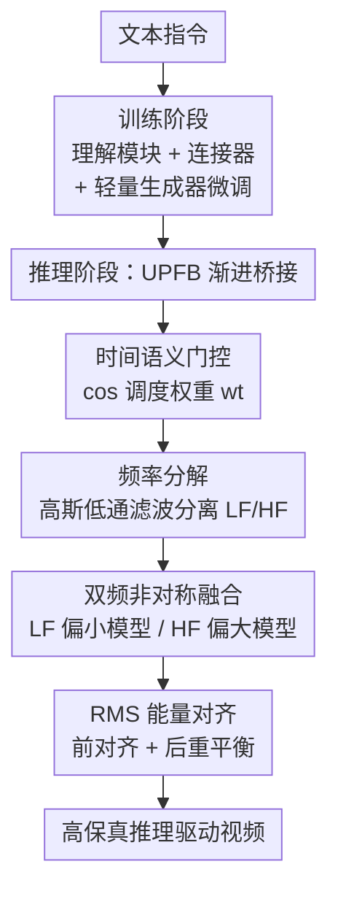

# Lumos-Nexus: Efficient Frequency Bridging with Homogeneous Latent Space for Video Unified Generation

**会议**: ECCV 2026  
**arXiv**: [2605.31603](https://arxiv.org/abs/2605.31603)  
**项目**: [https://jiazheng-xing.github.io/nexus-lumos-home/](https://jiazheng-xing.github.io/nexus-lumos-home/)  
**代码**: 无  
**领域**: 视频生成 / 扩散模型  
**关键词**: 统一视频生成, 频率桥接, 同质潜空间, 推理驱动生成, 训练高效

## 一句话总结
Lumos-Nexus 提出一种训练高效的两阶段统一视频生成框架：训练时仅微调轻量生成器吸收 VLM 语义，推理时通过统一渐进频率桥接（UPFB）将生成责任从轻量生成器逐步移交给大容量预训练生成器，在共享同质潜空间中实现粗到细的视频合成，兼顾推理驱动的语义准确性与高保真视觉质量。

## 研究背景与动机

**领域现状**：统一模型将多模态理解和生成集成到单一框架中，其中理解模块为生成器提供结构化语义先验，使其能解释复杂指令并产出符合逻辑意图的输出。在视频领域，这种统一尤为关键——视频不是静态画面，而是随时间展开的事件序列，生成需要时间一致性、因果推进和连贯运动，天然比图像生成更需要强推理能力。现有视频统一模型分为两类：基于联合注意力的方案（共享自注意力实现长上下文交互，扩展性强但训练成本极高）和基于连接器的方案（通过显式连接器将理解块的表征注入生成器的条件注入空间，解耦两个模块）。

**现有痛点**：基于连接器的视频统一模型虽然设计上更解耦，但在实际训练中仍需对大规模扩散生成器（如 Wan2.1-14B）进行高昂的微调，以便将理解输出与生成输入对齐。这使得同时实现强语义对齐和高视觉保真度在实践中非常困难。

**核心矛盾**：大生成器的高保真细节合成能力极为诱人，但将其纳入端到端理解-生成的统一训练循环中计算代价过高；小生成器训练成本可控，但生成质量存在"短板效应"——准确的理解侧语义先验受限于生成器本身的表达力，无法在生成的视频画面中得到有效执行。

**本文目标**：在连接器范式下，不增加训练成本的同时，将大生成器的高保真能力引入统一视频生成流程。

**切入角度**：作者观察到，统一模型中的微调并不改变扩散骨干的潜表示空间，因此同属一个模型家族的大小生成器天然共享同质潜空间（共享同一个 VAE）。这构成了训练-推理分离的基础：训练时用小生成器学会"吸收和编码"来自理解模块的高层语义先验；推理时小生成器充当"语义启动器"，将理解衍生的语义表征转化为可被大生成器无缝继承的结构先验，大生成器则贡献其预训练获得的高保真合成能力并进一步强化推理驱动语义的执行。

**核心 idea**：用"同质潜空间中的频率域渐进桥接"替代"端到端训练大生成器"，将语义学习与高保真合成分离到训练和推理两个阶段，以极低的训练代价获得大模型的生成质量。

## 方法详解

### 整体框架

Lumos-Nexus 的核心思路是"训小推大"：训练阶段只让轻量生成器在统一模型框架内学习如何接收并编码理解模块的语义知识，推理阶段再通过 UPFB 逐步将生成任务移交给大容量预训练生成器。整个框架分两阶段运行，输入为文本指令，输出为高保真推理驱动视频。

**训练阶段**：以 Omni-Video（基于 Wan2.1-T2V-1.3B 的连接器式视频统一模型）为基线，仅微调连接器和轻量生成器 $G^S$（Wan2.1-1.3B），使其学会将理解模块输出的 VLM 对齐嵌入 $c^S$ 转化为结构化的生成信号。大生成器 $G^L$（Wan2.1-14B）完全在训练循环之外，保持冻结。

**推理阶段**：UPFB 在去噪采样的每一步动态桥接两个生成器的速度场预测。$G^S$ 和 $G^L$ 对同一中间潜变量 $z_t$ 分别做 CFG 预测得到 $v_t^S$ 和 $v_t^L$，然后经过时间门控、频率分解、非对称融合和 RMS 对齐四个步骤，得到融合速度场 $v_t$ 用于流匹配的潜变量更新。整个过程是训练无关的，可无缝插入现有连接器式统一模型推理管线。

### 关键设计

**1. 两阶段训练-推理分离：用小生成器学语义、大生成器补细节**

针对"端到端训练大生成器成本过高"的痛点，Lumos-Nexus 的核心架构决策是将语义对齐与高保真合成彻底分离到训练和推理两个阶段。训练阶段只优化 Wan2.1-1.3B（训练仅需 2.25 s/it、26.3 GB 显存），推理阶段才引入 Wan2.1-14B。关键前提是两者共享同质潜空间（来自同一 Wan 家族 VAE，MMD 仅为 0.523），使得小模型学到的语义表征可以被大模型直接理解和继承。这一设计的精妙之处在于：它完全避开了大模型训练（Wan2.1-14B 微调需 7.21 s/it、72.8 GB），推理时大约增量为约 1.2 倍延迟（35.1 到 40.5 秒/步），换来了 VBench +0.43 和 VR-Bench +1.05 的显著提升。消融中直接升级 Omni-Video 到 14B 骨干并用 LoRA 微调（Omni-Video*），VBench 反降至 81.73、VR-Bench 降至 70.63，说明单纯放大骨干无法解决跨模态对齐的结构性不兼容。

**2. 统一渐进频率桥接（UPFB）：时域+频域融合实现粗到细的语义-纹理过渡**

UPFB 是整个方法的技术核心，针对"直接混合两个生成器输出会导致语义不稳定、结构重复和纹理冲突"的问题。它包含四个子机制：

**时间语义门控**：用余弦调度函数 $w_t = \frac{1}{2}(1 + \cos(\pi(1 - \tau_t)^{\gamma_w}))$ 控制两个生成器的支配权过渡，其中 $\tau_t = (T-1-t)/(T-1)$，$\gamma_w$ 控制交接锐度（论文取 0.3）。早步 $w_t$ 大，偏重小生成器的语义构建；晚步 $w_t$ 小，逐步移交给大生成器做细节精炼。

**时变频率分解**：对两个生成器预测的速度场分别施加高斯低通滤波 $G_{\sigma_t}(\cdot)$，分离低频结构分量 $LF(v) = G_{\sigma_t}(v)$ 和高频纹理分量 $HF(v) = v - LF(v)$。带宽参数 $\sigma_t = \sigma_{\min} + (\sigma_{\max} - \sigma_{\min}) w_t$ 随时间衰减（$\sigma_{\min}=0.35$, $\sigma_{\max}=0.70$），早期大带宽抑制高频噪声利于布局稳定，后期小带宽逐步恢复细节。

**双频非对称融合**：低频分量按时间权重加权融合 $LF_t = w_t LF_t^S + (1-w_t) LF_t^L$，让大模型也参与语义结构贡献但随步数渐进；高频分量额外用衰减系数 $\gamma_{hf}=0.7$ 压制小模型高频噪声：$HF_t = w_t \gamma_{hf} HF_t^S + (1-w_t) HF_t^L$。最终融合速度场为 $v_t = LF_t + HF_t$。

**RMS 能量对齐**：在融合前将大模型速度场幅度对齐到小模型 $\mathbf{v}_t^L \leftarrow \mathbf{v}_t^L \cdot \frac{\text{RMS}(\mathbf{v}_t^S)}{\text{RMS}(\mathbf{v}_t^L)}$，融合后再按两个模型平均 RMS 做全局重平衡 $\mathbf{v}_t \leftarrow \mathbf{v}_t \cdot \frac{\frac{1}{2}(\text{RMS}(\mathbf{v}_t^S) + \text{RMS}(\mathbf{v}_t^L))}{\text{RMS}(\mathbf{v}_t)}$，防止幅度失配导致的过曝和不稳定激活。

**3. VR-Bench：首个推理驱动视频生成评测基准**

此前视频生成评测主要关注视觉保真度和时间连贯性，完全忽略了推理维度——模型能否根据语义意图进行推断、规划和行动。VR-Bench 填补了这一空白，设计了 216 个评测案例，覆盖 8 个推理维度、3 个高层类别：（1）高层物理世界推理——动态参考系（DRF）、能量传递可视化（ETV）、材料记忆一致性（MMC）；（2）高层常识推理——概念性动作推理（CAR）、文化常识推理（CCR）、预防性因果推理（PCR）；（3）具身物理推理——生物行为推理（BBR）、并发动作协调（CAC）。评测使用 Qwen3-VL-30B-A3B-Instruct 对每个维度进行 8 问三级诊断（L1 基础感知→L2 中级关系推理→L3 高级因果/语义推理），以 0-1 分制汇总，并通过人类评估验证了排序一致性（Kendall $\tau = 0.73$）。

### 损失函数 / 训练策略

训练阶段沿用 Omni-Video 的标准统一模型训练目标（仅微调连接器和轻量生成器，大生成器冻结且在训练中完全不参与）。推理阶段 UPFB 完全训练无关，所有超参数在推理时设定：$\gamma_w = 0.3$、$\sigma_{\min}=0.35$、$\sigma_{\max}=0.70$、$\gamma_{hf}=0.7$、CFG scale = 5、50 步采样、480p 分辨率、81 帧（5 秒@16fps）。

## 实验关键数据

### 主实验

**VBench T2V 评估**（Tab. 1）：

| 模型 | Total | Quality | Semantic | 类型 |
|------|-------|---------|----------|------|
| CogVideoX1.5-5B | 82.17 | 82.78 | 79.76 | 纯生成 |
| HunyuanVideo | 83.43 | 85.07 | 76.88 | 纯生成 |
| CausVid | 83.88 | 85.21 | 78.57 | 纯生成 |
| Wan2.1-14B | 83.69 | 85.59 | 76.11 | 纯生成 |
| Omni-Video | 83.82 | 85.00 | 79.10 | 统一模型 |
| Show-o2 | 81.34 | 82.10 | 78.31 | 统一模型 |
| **Lumos-Nexus** | **84.12** | **85.03** | **80.52** | 统一模型（本文） |

Lumos-Nexus 取得最高总分 84.12，相比基线 Omni-Video 提升 0.30，相比纯生成模型 Wan2.1-14B 提升 0.43。语义分数从 Omni-Video 的 79.10 提升至 80.52，验证了 UPFB 有效弥补了"理解侧语义准确但生成侧表达力受限"的短板。

**VR-Bench 推理评估**（Tab. 2，Wan2.1 级别）：

| 模型 | Total | HL-Phys. | HL-Comm. | Emb.-Phys. |
|------|-------|----------|----------|------------|
| Veo 3.1 (闭源) | 93.95 | 94.25 | 95.37 | 91.37 |
| Kling 2.6 (闭源) | 91.13 | 92.96 | 88.71 | 92.01 |
| CogVideoX1.5-5B | 66.27 | 71.92 | 67.03 | 56.67 |
| HunyuanVideo | 75.38 | 76.79 | 69.73 | 81.39 |
| Wan2.1-14B | 78.23 | 80.34 | 75.96 | 78.46 |
| Omni-Video | 72.78 | 72.39 | 72.79 | 73.33 |
| **Lumos-Nexus** | **79.28** | **79.49** | **77.57** | **81.54** |
| Lumos-Nexus* (Wan2.2) | **81.90** | 83.02 | 79.43 | 83.93 |

值得注意的是，Omni-Video 在 VR-Bench 上反而不如纯生成模型 Wan2.1-1.3B（72.78 vs. 77.00），这是因为其理解侧虽然提供了准确的语义先验，但小生成器无法将其正确"执行"到视频画面中。Lumos-Nexus 通过桥接大生成器显著扭转了这一局面。此外，替换大生成器为 Wan2.2-T2V-A14B 后（Lumos-Nexus*），VR-Bench 进一步提升至 81.90，验证了框架的扩展性。

### 消融实验

**时间门控锐度 $\gamma_w$**（Tab. 3）：

| $\gamma_w$ | VBench Total | VBench Semantic | VR-Bench Total |
|------------|-------------|-----------------|----------------|
| 0.2 | 84.08 | 80.04 | 79.09 |
| **0.3** | **84.12** | **80.52** | **79.28** |
| 0.4 | 84.02 | 79.63 | 76.49 |
| 0.5 | 84.05 | 79.29 | 75.10 |

$\gamma_w = 0.3$ 取得最佳表现。过大（0.5）使小模型主导时间过长，继承过多基准模型的结构行为但细节不足；过小（0.2）使过渡过快，大模型细节丰富但语义根基不够稳定。

**带宽范围 $(\sigma_{\min}, \sigma_{\max})$**（Tab. 4）：

| $(\sigma_{\min}, \sigma_{\max})$ | VBench Total | Quality | Semantic |
|----------------------------------|-------------|---------|----------|
| (0.05, 0.10) | 83.99 | 84.90 | 80.34 |
| **(0.35, 0.70)** | **84.12** | **85.03** | **80.52** |
| (1.00, 2.00) | 83.56 | 84.86 | 78.36 |

适中带宽范围最好。过窄时滤波几乎不生效，两个模型冲突未缓解；过宽时低频成分被过度压制，语义基础薄弱导致语义分大幅下滑。

**RMS 对齐**（Tab. 5）：

| 配置 | VBench Total | Quality | Semantic |
|------|-------------|---------|----------|
| w/o RMS | 84.07 | 84.98 | 80.43 |
| **w/ RMS** | **84.12** | **85.03** | **80.52** |

RMS 对齐带来的提升稳定但幅度较小（Total +0.05），主要作用在于稳定融合速度场幅度，防止过曝和不稳定激活。

**直接相加 vs. UPFB**（Tab. 7，Appendix）：

| 桥接策略 | VBench Total | VR-Bench Total |
|----------|-------------|----------------|
| Direct Add | 83.28 | 77.33 |
| UPFB | 84.12 | 79.28 |

直接相加会导致主体重复、结构不一致等严重问题（如图中出现双头鸟），UPFB 的时频域控制显著更优（VBench +0.84，VR-Bench +1.95）。

### 关键发现
- **UPFB 的频率分解是核心贡献**：去掉频率域控制（退化为 Direct Add）时 VBench 掉 0.84 分，说明单纯的时域加权不足以协调两个异构生成器的冲突。
- **$\gamma_w$ 对推理能力影响极为敏感**：从 0.3 到 0.5，VR-Bench 掉了 4.18 分，远超对 VBench 的影响（仅掉 0.07），说明推理驱动的语义执行对交接时机高度依赖——过渡过快或过慢都会破坏推理链的连贯执行。
- **同质潜空间是硬前提**：如果将大生成器替换为不同 VAE 的异构模型（如 HunyuanVideo），MMD 从 0.523 跳到 1.031，输出严重模糊退化。论文在 Wan2.1 和 Wan2.2 两个家族上均验证有效，说明框架的普适性依赖于同一 VAE 家族内的模型变体。
- **模型容量 vs. 桥接机制**：将 Omni-Video 的生成器直接升级到 14B 并 LoRA 微调（Omni-Video*），VR-Bench 反而只有 70.63（vs. Lumos-Nexus 79.28），说明 Wan2.1-14B 不能原生接受 VLM token，轻量 LoRA 适配不足以解决这种跨模态对齐的结构性失配——桥接机制本身才是关键。

## 亮点与洞察
- **训小推大 + 频率桥接的组合思路**：将大规模生成器的集成问题从"怎么训"转化为"怎么桥"，用同质潜空间和频域分解两个前提消解了直接混合带来的语义冲突。这一思路不是简单的模型集成，而是精细地利用了扩散模型去噪过程的"粗到细"特性——早期步决定全局布局、晚期步补充纹理细节，自然对应了小模型的语义主导和大模型的细节主导。
- **UPFB 的训练无关性**：整个桥接过程完全发生在推理端，不需要对大模型做任何微调或适配。这意味着任何共享同质潜空间的模型对都能直接受益，部署成本极低。论文用 CogVideoX-2B/5B 做了初步验证，在完全没有重训的情况下跨模型桥接也能生成有效视频。
- **VR-Bench 的层级诊断设计**：用"8 问 3 层"结构替代简单的整体打分，每道题有明确的推理能力指向（从基础感知到因果推理），使得 benchmark 不仅能排名，还能定位模型在哪一类推理上薄弱。这一设计对其他需要细粒度评测生成质量的领域（如具身智能、物理仿真）有方法迁移价值。
- **RMS 能量对齐的小技巧**：在速度场层面做预对齐和重平衡，而非在图像/潜变量层面，避免了幅度失配导致的曝光异常和不稳定去噪轨迹。这一做法可以迁移到任何需要融合多个扩散模型预测的场景（如多条件组合生成、模型合并）。

## 局限与展望
- **同质潜空间的硬约束**：当前方法要求小生成器和大生成器共享同一个 VAE 潜空间，这限制了可用的生成器组合范围。虽然论文提出可以通过训练阶段对小生成器进行潜空间适配来纳入异构模型，但这一方案尚未实验验证。
- **VR-Bench 覆盖范围有限**：作者承认 8 个维度无法穷举开放世界的推理多样性，特别是长时域因果链推理尚未覆盖。216 个测试案例的规模在覆盖面和统计显著性之间也需要进一步平衡。
- **推理开销**：虽然避开了大模型训练，但推理时需要同时运行两个生成器（约 1.2 倍于单大模型的延迟），对实时应用仍有压力。在 Wan2.1 配置下每步约 40 秒，在消费级硬件上部署困难。
- **仅验证了 DiT 架构**：实验全部基于 Wan 家族的 DiT 扩散模型，UPFB 在 U-Net 架构或其他流匹配变体上的表现未知。
- **缺乏对"推理链可视化"的直接评测**：VR-Bench 评测的是生成视频与推理意图的一致性，但没有直接验证理解模块内部推理链的质量或可解释性。未来可以加入对中间推理步骤的显式评估。

## 相关工作与启发
- **vs Omni-Video**：Omni-Video 是 Lumos-Nexus 的直接基线，同样采用连接器式视频统一模型架构，但生成器固定为 Wan2.1-1.3B 端到端微调，受限于小模型的生成质量。Lumos-Nexus 在此基础上通过 UPFB 引入了 Wan2.1-14B 的高保真能力而不增加训练成本，在 VBench 和 VR-Bench 上均有全面提升。
- **vs Show-o / Show-o2 / UniVideo**：这些基于联合注意力的视频统一模型通过共享自注意力实现理解-生成的长上下文交互，扩展性更强但训练代价极高。Lumos-Nexus 走的是连接器路线的扩展路径——承认训练成本的硬约束，用推理端 innovation 弥补生成质量差距。两条路线的竞争尚未有定论。
- **vs 多模型集成方法（如 Show-1 的像素-潜空间混合）**：Show-1 也是混合两个生成器的范式，但在像素/潜空间层面做融合。Lumos-Nexus 的创新在于将融合放到频率域和速度场，利用扩散过程的时变特性实现了更精细的控制。频率域分解作为桥接手段是一个相对新颖的角度。
- **启发**：本文"训练小模型捕获语义、推理时桥接大模型提升质量"的范式可以推广到其他统一模型场景——如图像统一模型（T2I）、多模态对话生成等——只要大小模型共享潜空间即可。特别是在模型家族越来越丰富（如 Wan 系列有 1.3B/14B、CogVideoX 有 2B/5B）的趋势下，这一范式的适用面会持续扩大。

## 评分
- 新颖性: ⭐⭐⭐⭐ 训小推大 + 频域桥接的组合视角有一定新意，UPFB 的训练无关性让方法区别于常规的多模型集成或知识蒸馏。但核心机制（低通滤波分离频带、余弦调度门控）本身不新，新颖性更多体现在组合方式而非单项技术上。
- 实验充分度: ⭐⭐⭐⭐⭐ 实验设计非常充分：VBench + VR-Bench + GenEval 三个 benchmark、消融覆盖所有超参数（$\gamma_w$、带宽、RMS、直接相加对比）、直接升级 14B 骨干做容量控制实验、换 Wan2.2 验证扩展性、换评判模型验证鲁棒性、人类评估验证一致性、MMD 量化潜空间对齐程度、推理/训练效率对比——几乎覆盖了所有合理的质疑角度。
- 写作质量: ⭐⭐⭐⭐ 方法部分逻辑清晰，公式严谨完整，消融分析有深度（特别是区分了模型容量贡献和桥接机制贡献）。但 VR-Bench 的 8 个维度描述偏抽象，缺少具体的 prompt 示例让读者直观感受评测粒度。
- 价值: ⭐⭐⭐⭐ 在统一视频生成这一竞争激烈的方向上，提供了一个实用性强、训练成本低的方案。VR-Bench 填补了推理驱动视频生成评测的空白，有成为社区标准基准的潜力。方法本身的可迁移性（扩展到任何同质潜空间的模型对）增加了其实践影响力。

<!-- RELATED:START -->

## 相关论文

- [\[ICLR 2026\] Lumos-1: On Autoregressive Video Generation with Discrete Diffusion from a Unified Model Perspective](../../ICLR2026/video_generation/lumos-1_on_autoregressive_video_generation_with_discrete_diffusion_from_a_unifie.md)
- [\[ICML 2026\] LuVe: Latent-Cascaded Ultra-High-Resolution Video Generation with Dual Frequency Experts](../../ICML2026/video_generation/luve_latent-cascaded_ultra-high-resolution_video_generation_with_dual_frequency_.md)
- [\[CVPR 2026\] AdapTok: Learning Adaptive and Temporally Causal Video Tokenization in a 1D Latent Space](../../CVPR2026/video_generation/adaptok_learning_adaptive_and_temporally_causal_video_tokenization_in_a_1d_laten.md)
- [\[ECCV 2026\] AVTok: 1D Unified Tokenization for Holistic Audio-Video Generation](avtok_1d_unified_tokenization_for_holistic_audio-video_generation.md)
- [\[ECCV 2026\] MMControl: Unified Multi-Modal Control for Joint Audio-Video Generation](mmcontrol_unified_multi-modal_control_for_joint_audio-video_generation.md)

<!-- RELATED:END -->
