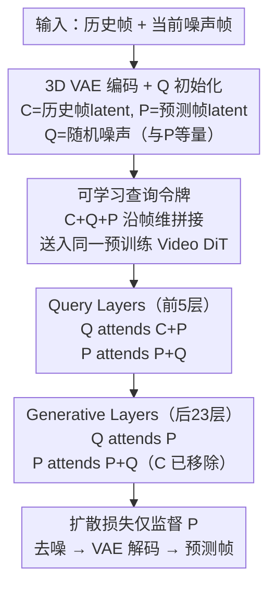

# MemLearner: Learning to Query Context Memory for Video World Models

**会议**: ECCV 2026  
**arXiv**: [2606.31734](https://arxiv.org/abs/2606.31734)  
**项目页**: [https://yujiwen.github.io/memlearner/](https://yujiwen.github.io/memlearner/)  
**代码**: 无  
**领域**: 视频生成  
**关键词**: 视频世界模型, 上下文记忆, 可学习查询令牌, 扩散Transformer, 长视频生成

## 一句话总结
MemLearner 提出一种基于可学习查询令牌（Q tokens）的自适应上下文记忆机制，让视频世界模型在生成长视频时能端到端地学会"从历史帧里查什么信息有用"，而非依赖人工规则检索关键帧。Q tokens 作为 C（context）和 P（predicted）之间的信息桥，在预训练 Video DiT 内部通过 3D 注意力完成上下文查询，配合浅层查询+深层生成的分层策略和注意力裁剪大幅降低计算开销；在遮挡和动态物体场景下，PSNR 比 CaM 提升 1.38 dB，LPIPS 降低 0.057。

## 研究背景与动机
视频世界模型（Video World Models）的目标是根据历史视频帧和用户交互动作，预测未来的世界状态。近年来，以扩散Transformer（DiT）为骨干的视频生成模型在短片段生成上取得了显著进展，但在生成长视频时面临严重的场景一致性问题——后续生成的画面会逐渐"忘记"之前出现过的物体、布局和外观，导致画面漂移和内容崩坏。根本原因在于模型缺乏有效的记忆机制，有限的上下文窗口无法保留足够的历史信息。

现有方法解决记忆问题主要走三条路：（1）3D 重建，将历史帧重建为 3D 表达，再渲染出新视角下的条件帧；（2）特征压缩，将历史帧编码为紧凑特征注入生成过程；（3）上下文检索，根据某种规则从历史帧中选出与当前生成最相关的帧作为条件。其中，上下文检索因无需额外的 3D 重建成本和压缩误差而被认为是最有前途的方向。然而，现有检索方法全部基于人工规则——例如 CaM 根据 FOV 重叠度筛选帧、VMem 通过点云估计和 surfel 匹配找对应帧——这些规则在遮挡场景（如墙壁挡住视线）和动态物体（移动的行人、车辆）面前完全失效。FOV 规则无法识别相机与目标之间的遮挡物，点云规则无法准确重建运动物体，且这些硬编码规则不具备对多样化动态环境的泛化能力。

这引出一个范式转变：不做规则检索，而是让网络自己学会"从历史里查什么、查多少"。核心矛盾在于：如何设计一种可端到端训练的查询机制，让模型在给定历史帧和当前生成目标时，自适应地抽取最相关的上下文信息，且不引入过多计算开销？本文的切入角度是引入可学习查询令牌（query tokens）作为信息桥，利用预训练视频生成模型自身的视觉先验来完成上下文查询，避免从头训练独立查询模块。

核心 idea：让 Q tokens 在扩散模型的 3D 注意力层中同时 attend 到 C tokens（提取上下文）和 P tokens（感知生成需求），以端到端的扩散损失作为唯一监督信号，学会自适应地查询上下文记忆。

## 方法详解

### 整体框架
MemLearner 建立在 latent video diffusion model 之上，采用因果 3D VAE 将视频帧压缩为 latent tokens，再通过 Diffusion Transformer（DiT）进行去噪生成。整个框架围绕三种令牌展开：上下文令牌（C tokens，来自历史帧 latent）、查询令牌（Q tokens，随机噪声初始化，数量与 P tokens 相同）和预测令牌（P tokens，来自当前待生成帧的噪声 latent）。三者沿帧维度拼接后送入同一个预训练 Video DiT，在 3D 注意力层中完成交互。DiT 被划分为浅层 Query Layers（前 n 层，n=5）和深层 Generative Layers（后 m 层，m=23）：Query Layers 中 C、Q、P 三者全交互（Q attend 到 C+P，P attend 到 P+Q），Generative Layers 中移除 C 仅保留 Q 和 P 的交互，大幅降低长上下文带来的计算开销。训练时扩散损失仅作用在 P tokens 的噪声预测上，C 和 Q tokens 不加噪，间接驱动 Q tokens 学会从 C 中提取有用信息。相机姿态通过独立的一层 MLP 编码器注入，支持交互式视频生成，但上下文查询机制本身不依赖相机姿态。

### 关键设计

**1. 可学习查询令牌（Q tokens）：C-Q-P 自适应信息桥**

现有规则检索的最大问题是"查什么"被人工规则固定死了——FOV 重叠规则查到的帧可能被墙挡住，点云匹配规则对动态物体无效。MemLearner 的核心洞察是：不同预测帧需要不同的上下文信息，甚至在同一个预测帧的不同扩散去噪阶段（早期需要全局布局、后期需要细粒度纹理），对历史帧的信息需求也截然不同。论文通过注意力相似度分析在附录中验证了这一点：Q tokens 在不同预测帧和不同扩散时间步上确实展现出显著不同的注意力分布。

为此，MemLearner 引入可学习查询令牌 Q tokens。Q tokens 不是可学习参数向量（那样只能学到一个固定的查询模式），而是在每次前向传播时随机采样的噪声，与扩散模型的输入分布一致，因此天然适配去噪过程。Q tokens 的数量与 P tokens 相同（对应 20 帧 latent），在 3D 注意力中同时 attend 到 C tokens（查询历史信息）和 P tokens（感知当前生成目标需要什么），充当"翻译官"角色——先读懂 P 需要什么，再去 C 里翻对应的信息。整个查询过程通过扩散损失的间接监督端到端学习：损失只施加在 P tokens 的噪声预测上，但梯度会通过 3D 注意力反向传播到 Q tokens 对 C tokens 的注意力模式上，从而让 Q tokens 学会"查什么有用"。关键公式：

$$\mathbf{C}_{out} = \mathbf{C}$$

$$\mathbf{Q}_{out} = \mathbf{Q} + g(\mathbf{Q}, \{\mathbf{C}, \mathbf{P}\}, \{\mathbf{C}, \mathbf{P}\})$$

$$\mathbf{P}_{out} = \mathbf{P} + g(\mathbf{P}, \{\mathbf{P}, \mathbf{Q}\}, \{\mathbf{P}, \mathbf{Q}\})$$

其中 $g(Q, K, V)$ 是 3D 注意力运算的简记。Q 同时以 C 和 P 为 K/V 做注意力，这样 Q 的输出既包含了从 C 里提取的历史信息，又受到了 P 的生成目标的引导。消融实验（Tab. 4）证明，去掉"Q attend P"这条注意力路径（即 Q 只看 C 不看 P）会导致 GT PSNR 从 21.23 暴跌到 17.27，表明 Q tokens 必须先理解"当前要生成什么"才能有效地从历史中查信息。

**2. 复用预训练 Video DiT 完成上下文查询，而非独立查询模块**

直觉上，在 C 和 P 之间插入一个独立的 Transformer 模块来做查询（类似 Perceiver Resampler / Q-Former 的思路）是最直接的设计。论文在 Fig. 2(b) 中试验了这种设计：在预训练 Video DiT 前加一个 5 层 Transformer 作为独立上下文查询模块，输出拼接到 DiT 的输入中。然而实验结果（Tab. 2 "Fig. 2(b)" 行）惨不忍睹：GT PSNR 仅 9.16 dB（甚至比无记忆的 DFoT 的 16.98 dB 还差），LPIPS 高达 0.6567。注意力可视化分析揭示原因：从零训练的独立查询模块产出的 Q-C 注意力相似度几乎为零，说明它完全没有学会上下文建模；由此梯度无法有效传播到 DiT，后者直接忽略查询模块的输出，退化为一个纯 text-to-video 模型。

MemLearner 的设计与之相反（Fig. 2(c)）：直接将 C、Q、P tokens 全部送入预训练 Video DiT，让 DiT 自身的 3D 注意力层来完成上下文查询。这有两重优势：（1）DiT 在大规模视频数据上预训练得到的视觉先验（对物体、场景、运动的语义理解）直接被复用，不需要从零学起；（2）端到端训练自然地学会查询能力，不需要为独立模块设计显式监督信号（而"什么是正确查询到的记忆"本身就很难定义，论文在附录 C.8 中尝试了 L1 监督的独立预训练方案，结果远差于端到端）。简而言之，这是一个"搭便车"策略——让已经学会看视频的 DiT 同时承担"查记忆"的职责，不给它加一个没学过看视频的新模块拖后腿。

**3. 高效分层注意力：Query Layers + 注意力裁剪**

当历史上下文很长时（C tokens 可达 P tokens 的 9 倍，对应 180 帧 latent），C 参与全部 28 层 DiT 的 3D 注意力会导致计算开销爆炸。论文提出两个简单且有效的效率策略。

策略一（Query Only in Early Layers）：上下文查询本质上是"编码"操作，需要的参数和计算量远少于"生成"操作（类比 VAE 编码器 vs 解码器的参数量差异）。因此仅在前 n 层（Query Layers，n=5）中让 C、Q、P 三者全交互完成上下文查询，而后 m 层（Generative Layers，m=23）移除 C tokens，只保留 Q 和 P 的交互用于生成。消融实验（Tab. 6）显示，Query Layer 数量从 1 增加到 5 时 PSNR 从 18.16 提升到 21.23；从 5 增加到 20 时 PSNR 几乎不变（21.37）但 fps 从 0.54 降到 0.36。5 层是最优权衡点。

策略二（Exclude Unnecessary Attention Computations）：在标准 3D 注意力中，C、Q、P 两两之间的注意力计算很多是冗余的。论文裁剪后只保留三种必要模式：（1）Q 作为 query attend 到 P 作为 K/V——让 Q 理解"当前要生成什么"；（2）Q 作为 query attend 到 C 作为 K/V——让 Q 从历史中提取信息；（3）P 作为 query attend 到 P+Q 作为 K/V——让 P 利用查询到的信息进行生成。被裁剪掉的最关键计算是"以 C 为 query 的注意力"（C attend 到 Q、P），因为 C 是历史帧不需要被更新，其输出直接保持恒等映射 $\mathbf{C}_{out}=\mathbf{C}$。附录 C.5 的补充实验证实，加入 C-as-query 的注意力会显著增加开销（fps 从 0.54 降到 0.24）而性能几乎不变。

**4. 多数据集分编码器训练策略**

训练可学习上下文查询需要同时具备四个条件的长视频数据：精确的逐帧相机姿态标注、遮挡关系、动态物体、充分的"重访"（revisit）模式（相机离开后回到之前见过的区域）。现有数据集无一满足（Tab. 1）：CaM 只有渲染数据但无遮挡和动态物体；SpatialVid 是真实视频但姿态为估计值、不够精确；Sekai-real 是真实视频但无相机标注。真实视频内容多样、视觉逼真，但缺乏精确标注；渲染视频标注精确，但视觉真实感和内容多样性不足。

论文做了两件事。第一，基于 Unreal Engine 收集了专门的渲染数据集：选取 13 个含遮挡关系的多样化场景（工厂、街道、自然景观），引入人物（多种外观角色）和动物（狗、骆驼、马）作为动态物体，实现基于蓝图脚本的自动相机轨迹生成（随机行走 + 避障），产出 100 段长视频，每段平均超过 18000 帧，共 16.7 小时。第二，提出多数据集分编码器训练策略：为三种不同的标注质量各分配一个独立的相机编码器——精确姿态的渲染数据用一个编码器、姿态估计的真实数据用另一个、无可靠标注的真实数据以零相机参数（R=0, t=0）送入第三个编码器。不同标注质量的数据在各自独立的编码器中处理，互不干扰，推理时仅使用在精确标注数据上训练的编码器以确保可靠控制。这一策略使模型同时受益于渲染数据的精确姿态监督、估计姿态数据的真实感、以及无标注数据的丰富多样性。

### 一个例子：重访场景中的上下文查询

假设场景：相机在一条街道上向前行走，经过一个红色汽车（frame 1-30），随后右转进入小巷（frame 31-60），最后掉头原路返回（frame 61-90）。当模型需要在 frame 75 重新生成那辆红色汽车时，这属于典型的"重访"（revisit）场景。

在传统 CaM 方法中，FOV 重叠规则在 frame 75 时会错误地选中 frame 40-50 的小巷帧（因为此时相机的粗略位置与返回路径接近），完全忽略了 frame 75 需要的其实是 frame 10-30 中汽车首次出现时的帧——更糟的是，如果巷口有一堵墙，FOV 规则对遮挡毫无感知。VMem 的点云匹配方法试图通过 3D 重建建立帧间对应，但红色汽车如果在首次出现时自身就在移动，点云重建会产生严重伪影，匹配精度大打折扣。

MemLearner 的处理方式完全不同：frame 75 的 P tokens 携带了当前画面中的部分场景信息（如墙角、路面纹理），Q tokens 在 Query Layers 中同时 attend 到 P tokens（理解"我现在在巷口转角处，需要补全之前见过的街道主路场景"）和 C tokens（扫描 frame 1-60 的全部历史 latent）。由于 Q tokens 在与 C 的注意力中不受规则约束，它可以根据 P tokens 的需求自由地给 frame 10-30（红色汽车出现的帧）分配高注意力权重，同时抑制无关帧（小巷内部帧）。在后续的 Generative Layers 中，Q tokens 携带的"红色汽车外观信息"通过 Q-P 注意力传递给 P tokens，帮助 frame 75 的去噪过程恢复一致的外观。整个过程没有显式的 3D 几何计算，全由端到端的扩散损失驱动——如果 Q tokens 从 C 中提取了错误的信息导致 frame 75 与 frame 10-30 中的汽车不一致，LPIPS 损失会反向惩罚 Q 对 C 的注意力分布。

### 损失函数 / 训练策略
训练目标是标准的扩散损失，但仅作用在 P tokens 上：

$$\mathcal{L}(\theta)=\mathbb{E}\left[\|\epsilon_\theta(Z_t, \mathbf{cam}, \mathbf{p}, t) - \epsilon^P\|\right]$$

其中 $Z_t = \{\mathbf{C}, \mathbf{Q}, \mathbf{P}_t\}$，C 和 Q tokens 不加噪，仅 P tokens 在输入端加噪。训练时 C tokens 的长度从 0 到 9 倍 P token 长度均匀采样（0 对应纯 image-to-video 训练，即无历史上下文）。完整 fine-tune 预训练的 1B 参数 T2V DiT（28 层，5 层 Query Layers），在自收集数据集 + CaM 数据集（50%:50%）以及混合真实数据（75% 渲染 + 25% 真实）上训练 20K+ iterations，batch size=8，lr=5e-5。视频分辨率 640x352，P tokens 对应 77 帧视频（经 3D VAE 4x 时间压缩后为 20 帧 latent），C tokens 最多为 P tokens 的 9 倍（180 帧 latent）。采样时使用 50 步 Classifier-Free Guidance。

## 实验关键数据

### 主实验
所有方法在同一代码库和数据集上复现以保证公平比较。评估包含两种设定：GT Comp.（给定 GT 历史帧，预测帧应与 GT 对齐）和 Revisit Comp.（长视频中回访已见过场景时，新生成帧应与之前生成的帧一致）。指标为 PSNR/LPIPS（衡量记忆一致性）和 FID/FVD（衡量视觉质量）。

| 方法 | GT PSNR↑ | GT LPIPS↓ | GT FID↓ | GT FVD↓ | Revisit PSNR↑ | Revisit LPIPS↓ | Revisit FID↓ | Revisit FVD↓ | fps↑ |
|------|----------|-----------|---------|---------|---------------|----------------|--------------|--------------|------|
| DFoT | 16.98 | 0.4796 | 147.09 | 998.43 | 16.14 | 0.5481 | 151.38 | 1021.46 | 1.59 |
| FramePack | 16.42 | 0.5104 | 143.97 | 967.97 | 15.86 | 0.5837 | 154.11 | 1037.58 | 1.40 |
| VMem | 19.59 | 0.3872 | 129.94 | 850.17 | 17.30 | 0.4187 | 141.82 | 968.45 | 0.73 |
| CaM | 19.85 | 0.3475 | 125.35 | 848.61 | 17.61 | 0.3934 | 137.87 | 948.63 | 0.97 |
| Separate Module | 9.16 | 0.6567 | 145.63 | 930.54 | — | — | — | — | 0.48 |
| **MemLearner** | **21.23** | **0.2904** | **112.75** | **835.98** | **18.57** | **0.3230** | **101.57** | **847.52** | 0.54 |

Separate Module（独立查询模块设计）的性能甚至不如无记忆的 DFoT，佐证了从零训练的独立模块完全无法学到上下文查询能力，反而拖垮了预训练 DiT。MemLearner 在所有指标上大幅领先。

在 CaM 数据集（无遮挡、无动态物体）上，MemLearner 与 CaM 差距极小（GT PSNR 20.35 vs 20.22），但在自收集的遮挡/动态数据集上 CaM 从 GT PSNR 20.22 掉到 19.85 而 MemLearner 保持 21.23，直接验证了本文方法在复杂场景下的鲁棒性优势。

### 消融实验

| Query Layers 数量 | GT PSNR↑ | GT LPIPS↓ | Revisit PSNR↑ | Revisit LPIPS↓ | fps↑ |
|-------------------|----------|-----------|---------------|----------------|------|
| 1 | 18.16 | 0.4056 | 17.25 | 0.4144 | 0.61 |
| 3 | 19.43 | 0.3625 | 17.83 | 0.3808 | 0.58 |
| 5 | 21.23 | 0.2904 | 18.57 | 0.3230 | 0.54 |
| 10 | 21.36 | 0.2913 | 18.50 | 0.3214 | 0.46 |
| 20 | 21.37 | 0.2891 | 18.66 | 0.3217 | 0.36 |

Query Layers 从 1 增加到 5 时性能快速提升，5 之后趋于饱和但 fps 持续下降（20 层时仅 0.36 fps），5 层是性能与效率的最优平衡。

### 关键发现
- **Q attend P 是查询能力的关键**（Tab. 4）：移除 Q 对 P 的注意力后，GT PSNR 从 21.23 暴跌至 17.27，说明 Q 必须理解"要生成什么"才能在历史中精准检索信息。相比之下，在已有 P+Q 基础上额外加"Q attend Q"注意力几乎不影响性能，属可裁剪的冗余计算。
- **相机姿态非必需**（Tab. 5）：仅给 P tokens 注入相机姿态（不给 C 和 Q tokens），记忆性能几乎不降（GT PSNR 21.17 vs 21.23），暗示预训练 DiT 隐式学会了帧间几何对应关系，无需显式 3D 信息即可完成上下文查询。
- **纯真实数据无法学会记忆**（Tab. 7）：仅用 Sekai-real + SpatialVid 训练时 Revisit PSNR 仅 15.32，因为这些数据缺乏充分的 revisit 模式；加入渲染数据后 PSNR 跳升至 18.57；再混入真实数据提升视觉真实感（FID 从 161.83 降至 115.47）。
- **跨架构泛化**（附录 C.1）：在开源 Wan2.1 (1.3B) 上 MemLearner 同样超越 CaM（GT PSNR 19.25 vs 18.37），证明方法不绑定特定 DiT 架构，只要模型有 3D 注意力层即可接入。

## 亮点与洞察
- **"用预训练模型当查询模块"这一设计决策非常聪明**：独立查询模块从零训练失败的原因并非"查询太难"，而是"预训练 DiT 不理解新模块在干什么"。把查询嵌入 DiT 内部，复用其视觉先验，是典型的"不做多于的事"——这背后有一条可迁移的设计原则：当为预训练模型增加新能力时，优先利用模型已有的层和参数来实现，而不是外挂新模块，除非有明确的证据表明解耦是必要的。
- **随机噪声初始化 Q tokens 而非可学习参数**是一个精巧的工程选择：它天然匹配扩散模型的输入分布，且 Q tokens 的能力来自注意力机制（Q attend P + Q attend C）而非初始值本身。消融（附录 C.9）证实从 P tokens 的噪声复制初始化效果相当——核心是"查"的动作而非"初始记住什么"。
- **注意力裁剪分析非常扎实**：不是笼统地说"减少计算"，而是逐条拆解 C/Q/P 两两之间的注意力对最终性能的影响，提炼出三条必要模式和一条（C as query）可安全移除的模式。这在工程上为后续工作提供了明确的注意力设计指南。

## 局限与展望
- **模型容量和动态场景复杂性**（作者承认）：当前 1B 模型在同一场景中超过 5 个相互交互的角色时生成质量明显下降，出现外观不一致或物体丢失。作者认为需要扩展到更大模型并收集更丰富的动态交互数据。
- **记忆应随生成时长压缩而非线性增长**（作者承认）：本文和所有现有上下文记忆方法都依赖完整存储历史帧再从中检索，记忆开销与生成时长成线性关系。作者指出上下文压缩与本文的查询机制是正交的——可以先压缩历史，再在压缩后的 token 上应用 learnable query——这是一个直接的改进方向。
- **仅在 DiT 架构上验证**：虽然论文在 Wan2.1 上证明了跨模型泛化，但两者都是 DiT。对于基于 UNet 或自回归的视频生成架构（如 VideoPoet、NOVA），Q tokens 机制是否同样有效尚待验证。
- **数据集泛化的上限未探明**：零样本迁移到 Epic-Kitchens 的实验中，MemLearner 的 GT PSNR 从 21.23 降到 20.19，绝对性能仍好于 CaM 但下降幅度不小。当前的多数据集策略能部分缓解域差距，但训练域与测试域之间的语义差距（渲染室内 vs 真实厨房）仍是挑战。

## 相关工作与启发
- **vs CaM (Context-as-Memory)**：CaM 基于 FOV 重叠度进行规则性上下文帧检索，在无遮挡场景下效果不错（与 MemLearner 在 CaM 数据集上差距极小），但在遮挡和动态物体场景下性能崩塌。MemLearner 将"检索"替换为"查询"，由网络自动判断需要哪些上下文，本质是从"硬规则"到"软学习"的转变。一个实用的迁移思路：在任何需要"基于规则选历史帧"的视频任务中（如长视频理解、视频问答），都可以尝试将规则替换为可学习查询 tokens。
- **vs Perceiver Resampler / Q-Former**：两者都用可学习查询 tokens 压缩视觉信息，但服务于不同的目标场景（多模态 LLM 输入压缩 vs 视频生成的上下文记忆），且关键区别在于：本文证明独立查询模块与预训练生成模型联合训练会失效，必须在生成模型内部完成查询。这暗示了"压缩"和"生成"两种任务对查询机制的要求有本质不同——前者只需提取语义级全局信息，后者需要 token 级的细粒度时空对齐。
- **vs 3D-as-Memory 系列**：WonderJourney、ViewCrafter 等方法依赖 3D 重建 → 渲染管线，虽然理论上能提供最几何精确的记忆，但引入了重建误差和额外的计算开销。MemLearner 在 2D 域内通过注意力隐式学习几何对应（Tab. 5 的相机姿态消融佐证了这一点），避免了显式 3D 重建的工程复杂度。未来可以探索将隐式学习的"2D 注意力对应"与显式 3D 重建融合，取长补短。

## 评分
- 新颖性: ⭐⭐⭐⭐ 将"规则检索"替换为"可学习查询"在直觉上很直接，但"复用预训练 DiT 内部注意力做查询 + 证明独立模块行不通"这一设计空间分析做得透彻，不是简单的替换
- 实验充分度: ⭐⭐⭐⭐⭐ 主表、多数据集消融、架构消融（注意力模式/Query Layer 数量/相机嵌入/Q 初始化）、跨模型泛化（Wan2.1）、跨数据集评估（自收集/CaM/SpatialVid/Epic-Kitchens）、用户研究、VBench 质量评估，覆盖面广且无关键遗漏
- 写作质量: ⭐⭐⭐⭐ 核心动机（遮挡+动态物体的规则失效）清晰，方法部分层次分明，失败设计（独立模块）的分析增强了论证力；附录中注意力可视化和伪代码对复现有帮助
- 价值: ⭐⭐⭐⭐ 视频世界模型的记忆问题是一个有实际需求的方向，本文提出的"在预训练模型内部做查询"范式和数据集/训练策略为后续工作提供了明确基线和工程指导

<!-- RELATED:START -->

## 相关论文

- [\[ECCV 2026\] Learning Transferable Dynamics Priors from Action to World Modeling](learning_transferable_dynamics_priors_from_action_to_world_modeling.md)
- [\[ICCV 2025\] Long-Context State-Space Video World Models](../../ICCV2025/video_generation/long-context_state-space_video_world_models.md)
- [\[ICLR 2026\] EditVerse: Unifying Image and Video Editing and Generation with In-Context Learning](../../ICLR2026/video_generation/editverse_unifying_image_and_video_editing_and_generation_with_in-context_learni.md)
- [\[ECCV 2026\] CustomX: Unified Character, Action, and Scene Customization in Video World Models](customx_unified_character_action_and_scene_customization_in_video_world_models.md)
- [\[CVPR 2026\] Captain Safari: A World Engine with Pose-Aligned 3D Memory](../../CVPR2026/video_generation/captain_safari_a_world_engine_with_pose-aligned_3d_memory.md)

<!-- RELATED:END -->
